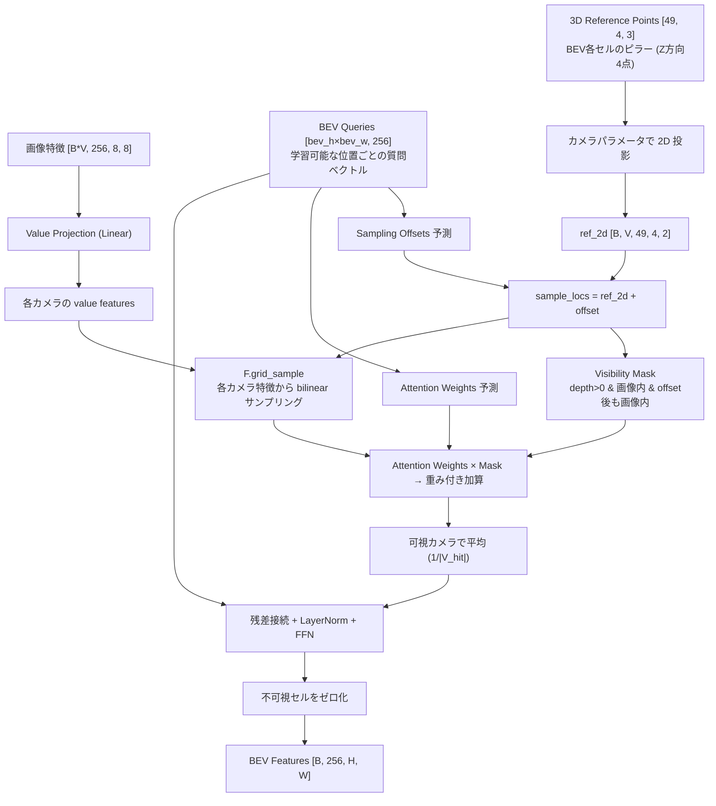
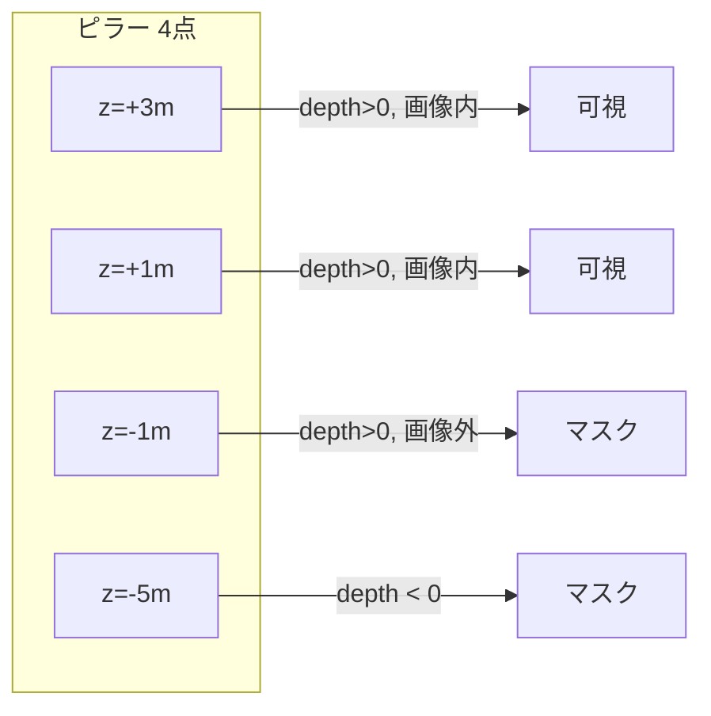

## はじめに

普段は AWS の SA として自動運転モデルの開発に携わっています。特に AWS を用いた DataOps / MLOps などのプラットフォーム側を本業では強みとしていますが、一方で Autoware Foundation の Robotaxi Working Group では、Maintainer を務めています。
Robotaxi WG は 2027 年に完全自動運転（L4）の公道デモ走行を目標に掲げています。
その中核が、カメラのみで高速道路から市街地まで走行可能な End-to-End 自動運転モデル [AutoE2E](https://github.com/autowarefoundation/auto_e2e) です。


そちらでも E2E の自動運転モデル開発をリードしていますが、その活動の中で今回紹介するマルチカメラ統合モジュールを書いたのをきっかけに、私自身もあまり PyTorch を使ってちゃんとネットワークを組んでこなかった中で向き合うことになったので、このブログを書くことにしました。

BEVFormer や UniAD の論文を読んで「spatial cross-attention で BEV 特徴を作る」と書いてあるのは理解したが、実装レベルで何が起きているのかが掴めない。テンソルがどう変形されて、どの重みがどの計算に使われるのかが追えない。そういう経験はないでしょうか。

この記事では、Autoware Foundation の End-to-End 自動運転モデル AutoE2E に実装した3種類のマルチカメラ統合アーキテクチャについて、各テンソルの形状変化と計算を1ステップずつ解説します。

### この記事を読むと得られるもの

- Concat / Cross-Attention / BEV の3手法それぞれで「なぜその形状変換が必要か」の理解
- BEVFormer の 3D参照点 → 2D投影 → grid_sample の実装レベルの動作理解
- 各手法のパラメータがどう学習されるか（勾配の流れ）

### 対象読者

- ニューラルネットワークの概念は知っているが、自動運転モデルを PyTorch スクラッチで実装したことがない人
- テンソルの形状変換（reshape, permute）がピンと来ない人
- BEVFormer / UniAD の論文を読んだが ピンと来ない人
- 逆に、PyTorch には詳しいが自動運転モデルのイメージがピンとこない人

:::message
本記事のコードはすべて [autowarefoundation/auto_e2e](https://github.com/autowarefoundation/auto_e2e) に公開されています。
:::

---

## 全体像: なぜマルチカメラ統合が必要か

自動運転車には通常 6〜8 台のカメラが搭載されています。各カメラの視野角は60〜120°程度なので、360°のシーンを理解するには複数カメラからの情報を1つにまとめる必要があります。この処理を View Fusion（ビュー統合） と呼びます。

```
前方カメラ ─┐
右前カメラ ─┤
右カメラ　 ─┤
後方カメラ ─┼─→ [ View Fusion ] ─→ 統合されたシーン表現 ─→ 走行軌跡予測
左カメラ　 ─┤
左前カメラ ─┤
後方カメラ ─┤
マップタイル─┘
```

---

## PyTorch の基本構造（前提知識）

PyTorch でネットワークを書くとき、必ずこの形になります:

```python
class MyModule(nn.Module):
    def __init__(self):
        super().__init__()
        # ここで「学習可能なパーツ」を定義（道具を棚に並べる）

    def forward(self, x):
        # ここで「データの流れ」を記述（レシピ通りに料理する）
        return x
```

| メソッド | 役割 |
|---------|------|
| `__init__` | 使うレイヤー（道具）の宣言 |
| `forward` | データが来たときの処理手順 |

---

## テンソルの形状表記

この記事を通して `[B, V, C, H, W]` のような表記が頻出します。

| 記号 | 意味 | 今回の例 |
|------|------|----------|
| B | バッチサイズ（同時処理するサンプル数） | 2 |
| V | ビュー数（カメラ台数） | 7 |
| C | チャンネル数（特徴の種類） | 256 |
| H | 高さ（空間方向） | 8 |
| W | 幅（空間方向） | 8 |

テンソルとは多次元配列のことです。1枚のRGB画像は `[3, 224, 224]` で表現され、それが複数枚集まると次元が増えていきます。

具体的なイメージ:
```
[3, 224, 224] は「3枚の224×224の数値表」

  R (赤):        G (緑):        B (青):
  ┌───────┐     ┌───────┐     ┌───────┐
  │0.2 0.3│     │0.1 0.5│     │0.8 0.2│
  │0.4 0.1│     │0.3 0.2│     │0.1 0.9│
  └───────┘     └───────┘     └───────┘
  ↑ 各ピクセルの赤の強さ  緑の強さ      青の強さ
```

これが8カメラ分で `[8, 3, 224, 224]`、さらに2サンプル同時処理で `[2, 8, 3, 224, 224]`。次元が増えるのは単に「同じ構造のものが複数ある」ことを表しているだけです。

:::message
batch=2 にしている理由は2つあります。1サンプルずつ学習すると特殊なシーンに引きずられてパラメータが極端にブレやすく、GPU の並列計算能力も使い切れません。複数サンプルを同時処理することで学習が安定し、GPU効率も上がります。加えて batch=1 だとバッチ次元の扱いに関するバグが隠れることがあるため、テスト時も batch=2 で検証しています。
:::

---

## ネットワーク全体の流れ

```
入力: [2, 7, 3, 224, 224]  ← 2サンプル × 7カメラ × RGB × 224×224
         │
         │  (1) Backbone: 画像を特徴マップに変換
         ▼
    [14, 1440, 8, 8]       ← 14枚の画像それぞれの特徴（マルチスケール結合後）
         │
         │  (1.5) Channel Projection: 1440ch → 256ch に圧縮
         ▼
    [14, 256, 8, 8]        ← 圧縮された特徴
         │
         │  (2) View Fusion: 7カメラを1つに統合
         ▼
    [2, 256, H, W]         ← 統合されたシーン表現
         │                    (concat/cross_attn: 8×8, BEV: 450×300)
         │
         │  (2.5) Map Fusion: マップ特徴と統合
         ▼
    [2, 256, H, W]         ← カメラ + マップ統合表現
         │
    ┌────┴────┐
    ▼         ▼
 走行軌跡  未来予測
[2, 128]   [2, 256, H, W]×4
```

---

## (1) Backbone: 画像を特徴に変換する

### なぜ reshape が必要か

Backbone（Swin Transformer）は1枚の画像単位で処理するモジュールであり、入力として `[バッチ, 3, 224, 224]` という4次元テンソルのみ受け付けます。しかし我々の入力は `[2, 7, 3, 224, 224]`（5次元）なので、バッチ次元とビュー次元を結合して4次元に変換する必要があります。

```python
x = x.reshape(B * V, C, H, W)
# [2, 7, 3, 224, 224] → [14, 3, 224, 224]
```

2サンプル × 7カメラ = 14枚を「14枚のバッチ」として Backbone に通します。

:::message
reshape はテンソルの中身（数値の並び）を一切変えずに、解釈の仕方だけを変える操作です。

例: 6個の数値 `[1, 2, 3, 4, 5, 6]` を...
- `reshape(2, 3)` → `[[1,2,3], [4,5,6]]`（2行3列の表）
- `reshape(3, 2)` → `[[1,2], [3,4], [5,6]]`（3行2列の表）
- `reshape(6)` → `[1,2,3,4,5,6]`（元の1列）

数値自体は変わっていません。メモリ上のデータ配置はそのままで、アクセスの仕方だけが変わります。
:::

### Backbone の4段階処理

Swin Transformer は画像を段階的に低解像度化しつつ、意味的に濃い特徴へと変換していきます:

```
入力:  [14, 3, 224, 224]     ← 生の画像ピクセル

Stage 0: [14, 56, 56, 96]    ← 1/4解像度、96種類の低レベル特徴
Stage 1: [14, 28, 28, 192]   ← 1/8解像度、192種類の中レベル特徴
Stage 2: [14, 14, 14, 384]   ← 1/16解像度、384種類の高レベル特徴
Stage 3: [14, 7, 7, 768]     ← 1/32解像度、768種類の意味的特徴
```

:::message
7×7 の各マスは元画像の 32×32 ピクセル領域に対応しています。224÷7=32 なので、Stage 3 の1マス = 元画像の 32×32px の情報を768個の数値に圧縮したものです。
:::

### マルチスケール特徴の結合

4段階の出力を全て 8×8 に揃えて、チャンネル方向に結合します:

```python
f0 = pool(features[0])  # [14, 96, 56, 56]  → pool → [14, 96, 8, 8]
f1 = pool(features[1])  # [14, 192, 28, 28] → pool → [14, 192, 8, 8]
f2 = pool(features[2])  # [14, 384, 14, 14] → pool → [14, 384, 8, 8]
f3 = pool(features[3])  # [14, 768, 7, 7]   → pool → [14, 768, 8, 8]

fused = torch.cat([f0, f1, f2, f3], dim=1)
# → [14, 96+192+384+768, 8, 8] = [14, 1440, 8, 8]
```

これで14枚の画像それぞれについて `[1440, 8, 8]` の特徴マップが得られました。ここまで、カメラ間の情報交換は一切行っていません。

:::message
元画像は RGB=3チャンネルでしたが、Backbone を通すとチャンネル数が 3→1440 に増えます。各チャンネルは特定のパターンに対する応答値であり、ある位置の1440個の数値のうち特定のチャンネルが大きい値を持てば「そこにエッジがある」「そこに車輪のような形がある」等のパターンが検出されたことを意味します。
:::

:::message
8×8 で足りるのか: 元画像 224×224 = 50,176 ピクセル × 3ch = 約15万個の数値。一方、8×8 × 1440ch = 約9.2万個の数値。データ量としては同じオーダーですが、意味的に整理された形式になっているため、後段の処理がはるかに楽になります。
:::

### Channel Projection: 1440 → 256 に圧縮

現在の実装では、View Fusion に渡す前に `Conv2d(1440, 256, kernel=1)` でチャンネル数を 256 に圧縮します:

```python
self.channel_proj = nn.Sequential(
    nn.Conv2d(backbone_channels, embed_dim, kernel_size=1),  # 1440 → 256
    nn.GELU()
)

# [14, 1440, 8, 8] → [14, 256, 8, 8]
```

この `embed_dim=256` が以降の View Fusion・Trajectory Planner・FutureState 全てで統一的に使われる次元数です。1440 のままだとメモリ消費と計算量が大きすぎるため、1×1 Conv で情報を圧縮してから後段に渡す設計になっています。

---

## (2) View Fusion: 3つの手法

ここからが本記事の核心です。「16枚分の独立した特徴」を「2サンプル分の統合シーン表現」にまとめます。

AutoE2E では `fusion_mode` パラメータで3つの手法を切り替えられます:

```python
model = AutoE2E(num_views=7, fusion_mode="concat")      # 手法1
model = AutoE2E(num_views=7, fusion_mode="cross_attn")   # 手法2
model = AutoE2E(num_views=7, fusion_mode="bev")          # 手法3
```

---

## 手法1: ConcatViewFusion（チャンネル結合 + 畳み込み）

最もシンプルな手法です。全カメラの特徴をチャンネル方向に連結し、1×1 畳み込みで元の次元数に圧縮します。

### 処理の流れ

```
入力: [14, 256, 8, 8]    ← 14枚(=2バッチ×7カメラ)の特徴

Step 1: reshape
  [14, 256, 8, 8] → [2, 7, 256, 8, 8]
  「14枚バラバラ」を「2サンプル × 7カメラ」に戻す

Step 2: reshape (チャンネル方向に結合)
  [2, 7, 256, 8, 8] → [2, 7×256, 8, 8] = [2, 1792, 8, 8]
  7カメラ分の特徴を1つのチャンネルに並べる

Step 3: Conv2d(1792, 256, kernel=1) + GELU
  [2, 1792, 8, 8] → [2, 256, 8, 8]
  1×1 畳み込みで「どのカメラのどの特徴が重要か」を学習して圧縮

出力: [2, 256, 8, 8]
```

### Conv2d(1792, 256, kernel=1) とは何か

これは 1×1 畳み込み（Pointwise Convolution） と呼ばれる操作です。

```
入力: 各空間位置(i, j)に 1792 個の数値がある

1×1 Conv の動作:
  出力[k][i][j] = Σ(weight[k][c] × 入力[c][i][j]) + bias[k]
  
  k = 0, 1, ..., 255 (出力チャンネル)
  c = 0, 1, ..., 1791 (入力チャンネル)
```

各空間位置で独立に 1792次元のベクトルを256次元に線形変換しています。7カメラ×256特徴 = 1792個の情報から、重要な256個の特徴を学習によって選び出す操作です。

:::message
num_views=2, embed_dim=3 の極小ケースで考えると:
```
入力: カメラ0=[0.5, 0.3, 0.8], カメラ1=[0.1, 0.9, 0.2]
concat後: [0.5, 0.3, 0.8, 0.1, 0.9, 0.2]  (6次元)
Conv1x1:  出力[k] = w[k][0]*0.5 + w[k][1]*0.3 + ... + w[k][5]*0.2
         → [0.4, 0.7, 0.1]  (3次元に圧縮)
```
weight の値によって「カメラ0の2番目の特徴を重視」「カメラ1は無視」等が決まります。
:::

### GELU とは

活性化関数（Activation Function）の一種です。

```
GELU(x) ≈ x × Φ(x)   (Φ はガウス分布の累積分布関数)
```

線形変換だけだと直線的な変換しかできません。GELU を挟むことで非線形な変換が可能になり、ネットワークの表現力が上がります。ReLU の滑らかな代替として、近年の Transformer 系モデルで標準的に使われています。

### この手法の特徴

| 良い点 | 悪い点 |
|--------|--------|
| 実装が簡単 | 空間的な対応関係を学習できない |
| 計算が軽い | カメラの位置情報を考慮していない |
| カメラパラメータ不要 | 「右カメラの左端 = 前方カメラの右端」のような関係は暗黙的にしか学習できない |

次の手法では、カメラ間の関係を明示的に学習する方法を見ていきます。

---

## 手法2: CrossAttentionViewFusion（カメラ間アテンション）

各空間位置で、8カメラ間の相互参照を行う手法です。入力に応じて「どのカメラの情報が今重要か」を動的に判断します。

### 処理の流れ（全体像）

```
入力: [14, 256, 8, 8]

Step 1: reshape        → [2, 7, 256, 8, 8]
Step 2: permute+reshape → [128, 7, 256]     空間位置ごとに分解
Step 3: + view_embed    → [128, 7, 256]     カメラの位置情報を付与
Step 4: Self-Attention  → [128, 7, 256]     カメラ間で情報交換
Step 5: FFN            → [128, 7, 256]     非線形変換
Step 6: mean(dim=1)    → [128, 256]        7カメラを平均して1つに
Step 7: reshape        → [2, 256, 8, 8]    空間形状に戻す

出力: [2, 256, 8, 8]
```

### Step 1: バッチとカメラを分離

```python
x = fused_per_view.reshape(B, V, C, H, W)
# [14, 256, 8, 8] → [2, 7, 256, 8, 8]
```

Backbone に通すために結合した「14枚バッチ」を、「2サンプル × 7カメラ」に復元します。

:::message
もし復元せずに Attention を計算すると、サンプル1の前方カメラとサンプル2の右カメラが混ざってしまいます。それは物理的に意味がないので、サンプル境界を明示する必要があります。
:::

### Step 2: 空間位置ごとに分解

```python
x = x.permute(0, 3, 4, 1, 2).reshape(B * H * W, V, C)
# [2, 7, 256, 8, 8]
#   ↓ permute（次元の並び替え）
# [2, 8, 8, 7, 256]
#   ↓ reshape
# [2×8×8, 7, 256] = [128, 7, 256]
```

8×8 = 64 の空間位置 × 2バッチ = 128個のグループになります。各グループに「7カメラ分の256次元ベクトル」が並んでいます。

:::message
permute は reshape と異なり、メモリ上のデータ配置自体が変わります。次元の順序を入れ替える操作です。

例: `[2, 3]` の行列を permute(1, 0) すると `[3, 2]` に転置されます:
```
元:       [[1, 2, 3],     permute(1,0):  [[1, 4],
           [4, 5, 6]]                     [2, 5],
                                          [3, 6]]
```
reshape と違い、`[1,2,3,4,5,6]` → `[1,4,2,5,3,6]` のようにデータの並び順自体が変わります。
:::

この変形が必要な理由は、PyTorch の `nn.MultiheadAttention` が入力として `[batch, sequence_length, embed_dim]` の形を期待するためです。今回比較したい sequence はカメラ7台なので、カメラ軸を sequence 次元に配置します。`[128, 7, 256]` = [batch(空間位置), sequence(カメラ), features] という対応です。

```
ある空間位置(3, 4)について:
  前方カメラの特徴:   [0.3, -0.1, 0.8, ..., 0.2]   (256個)
  右前カメラの特徴:   [0.1, 0.4, -0.2, ..., 0.7]   (256個)
  右カメラの特徴:     [-0.5, 0.2, 0.1, ..., 0.3]   (256個)
  ...
  マップタイルの特徴:  [0.0, 0.6, 0.4, ..., -0.1]  (256個)
```

この8つのベクトルの間で「どれが重要か」を次の Attention で決定します。

### Step 3: カメラ位置埋め込み（view_embed）の加算

```python
self.view_embed = nn.Parameter(torch.randn(1, num_views, embed_dim) * 0.02)

x = x + self.view_embed
# [128, 7, 256] + [1, 8, 1440] → [128, 7, 256] (ブロードキャスト加算)
```

Attention は入力ベクトルの数値しか見えないため、このままだと「この特徴がどのカメラから来たか」を区別できません。`view_embed` は各カメラに固有の学習可能ベクトルを加算することで、カメラの識別情報を埋め込みます。`view_embed[0]` は前方カメラ、`view_embed[1]` は右前カメラ、のように各カメラに対応します。

:::message
`nn.Parameter` で宣言すると PyTorch が学習対象として認識します。初期値は小さなランダム値ですが、学習が進むにつれて「右カメラと左カメラは対になっている」のような意味のある関係性を獲得していきます。
:::

### Step 4: Self-Attention（カメラ間の情報交換）

```python
x_norm = self.norm(x)                          # LayerNorm
attn_out, _ = self.cross_attn(x_norm, x_norm, x_norm)  # Attention
x = x + attn_out                               # 残差接続
```

#### Self-Attention の仕組み

Self-Attention の数式は以下の通りです:

```
Attention(Q, K, V) = softmax(Q × K^T / √d) × V
```

:::message
softmax は任意の数値の列を「合計1の確率分布」に変換する関数です。

例: `[2.0, 1.0, 0.1]` → softmax → `[0.66, 0.24, 0.10]`

大きい値ほど大きい重みになり、全部足すと必ず 1.0 になります。
:::

:::message
√d で割る理由: d はベクトルの次元数です。Q×K^T の内積値は次元数が大きいほど値が大きくなります。大きな値を softmax に入れると「ほぼ1つだけ1.0、残り全部0.0」の極端な分布になるため、√d で割ることで値を適度な範囲に抑え、学習を安定させます。
:::

今回は Q=K=V=同じテンソル（Self-Attention）です。Q（Query）は各カメラが「他のカメラに対して何を問い合わせるか」を表し、K（Key）は各カメラが「自分がどんな情報を持っているか」を表し、V（Value）は「実際に渡す情報の中身」を表します。Q と K の内積で類似度（注目度）が計算され、その重みで V を加重平均することで、各カメラが他カメラから関連情報を取り込みます。

#### 具体例: カメラ0 の更新

```
Q×K^T を計算:
  カメラ0 と カメラ0 の類似度: 0.30
  カメラ0 と カメラ1 の類似度: 0.05
  カメラ0 と カメラ2 の類似度: 0.02
  カメラ0 と カメラ3 の類似度: 0.40  ← 最も類似（最重要）
  ...

softmax で正規化 → 重み: [0.30, 0.05, 0.02, 0.40, 0.01, 0.02, 0.10, 0.10]

重み付き加算:
  出力0 = 0.30×V0 + 0.05×V1 + 0.02×V2 + 0.40×V3 + ... + 0.10×V7
```

これを8カメラ全てについて行います。結果として各カメラが「他のカメラの情報も取り入れた特徴」に更新されます。

#### 残差接続（Residual Connection）

```python
x = x + attn_out
```

Attention の出力を元の入力に加算します。元の情報を保持しつつ補強する形式であり、完全に置き換えないことで学習が安定します。

#### Multi-Head Attention

実際には `num_heads=8` で動作しています。256次元を8つの head に分割（各32次元）し、それぞれ独立に Attention を計算した後に結合します。

```
256次元 → 8頭 × 32次元 → 各頭で独立に Attention → 結合 → 256次元
```

:::message
256次元全体で1つの attention weight を計算すると、1通りの重要度パターンしか表現できません。8 head に分割すると各 head が独立した重要度パターンを持てるため、head 0 は「カメラ0,1を重視」、head 3 は「カメラ4,5を重視」のように複数の異なる注目パターンを並列に計算できます。
:::

### Step 5: Feed-Forward Network (FFN)

```python
x = x + self.ffn(self.norm_ffn(x))
```

FFN の中身:
```
[128, 7, 256]
  → LayerNorm
  → Linear(256, 512)    # 2倍に拡張 (256→512)
  → GELU                  # 非線形活性化
  → Dropout(0.1)          # ランダムに10%を0にする（過学習防止）
  → Linear(512, 256)    # 元に戻す
  → Dropout(0.1)
[128, 7, 256]             # 形状は変わらない
```

Attention は重み付き加算（線形操作）しかできないため、FFN で非線形変換を加えることで「集めた情報をさらに加工する」能力を与えます。

### Step 6-7: 集約と形状復元

```python
x = x.mean(dim=1)  # [128, 7, 256] → [128, 256]  7カメラを平均
x = x.reshape(B, H, W, C).permute(0, 3, 1, 2)  # → [2, 256, 8, 8]
```

Attention で相互参照済みの8つの特徴を平均して、1つの統合表現にします。次の手法では、さらに3D幾何学を活用した統合方法を見ていきます。

---

## 手法3: BEVViewFusion（BEV 空間射影 + 空間クロスアテンション）

### まず何をやっているのか

手法1と手法2は「カメラの画像特徴をそのまま組み合わせる」アプローチでした。手法3はまったく異なる発想です。

自動運転車が走行計画を立てるとき、最終的に必要なのは「自分の周囲の地面に何があるか」という鳥瞰図（Bird's Eye View = BEV）の情報です。「前方カメラの特徴マップ (2,3) の位置」と言われてもそれが実世界のどこなのかわかりませんが、「車両の右前方 10m、幅 3m の位置に車がいる」なら経路計画に直接使えます。

そこで手法3では、出力する表現を最初から BEV 空間（車両を中心とした上から見た2Dグリッド）に定義し、そこに各カメラから必要な情報を「取りに行く」形で統合します。

```
手法1,2: カメラの特徴 → カメラ空間で統合 → シーン表現（画像座標系）
手法3:   BEVグリッドの各セルが → カメラに「自分の場所に何が映っている？」と問い合わせ → シーン表現（実世界座標系）
```

### なぜこの方式が有効か

手法1,2では「前方カメラの右端に映っている物体」と「右前カメラの左端に映っている物体」が実は同一物体であることを、ネットワークがデータから暗黙的に学習する必要がありました。手法3では、BEV グリッドの「右前方 10m の位置」というセルが、前方カメラと右前カメラの両方に幾何学的に投影して情報を集めるので、同一物体の情報が自然に統合されます。カメラパラメータ（取り付け位置・向き・焦点距離）を使って「この3D位置はどのカメラのどのピクセルに映るか」を計算するため、学習に頼らず幾何的に正確な対応が取れます。

この方式は BEVFormer（Li et al., ECCV 2022）で提案され、UniAD（CVPR 2023 Best Paper）でもそのまま採用されています。

:::message
BEV（Bird's Eye View）とは車を真上から見下ろした2D平面のことです。自動運転の走行計画は「地面上のどこを通るか」という2D問題なので、入力がBEV形式になっていると計画モジュールとの接続が自然になります。
:::

### 処理の流れ

処理は大きく5段階に分かれます。

まず、BEV グリッド（7×7 = 49 セル）の各セルが「自分の位置に何があるか知りたい」という問い合わせベクトル（BEV Query）を持っています。これは `nn.Embedding` で定義された学習可能なパラメータです。

次に、各 BEV セルに対して3D空間上の参照点を生成します。BEV は上から見た2D位置ですが、実世界には高さがあるため、各セルに Z 方向 4 点の「ピラー（柱）」を立てます。これにより「この位置の地面から上空 3m まで」を4つの高さでサンプリングします。

その4つの3D点を、各カメラのパラメータ（焦点距離・取り付け位置・向き）を使って2D画像座標に投影します。すると「BEV のこのセルの情報は、前方カメラの座標 (0.3, 0.6) と右前カメラの座標 (0.8, 0.2) に映っている」のような対応関係が得られます。

得られた 2D 座標を使い、各カメラの特徴マップから `F.grid_sample`（バイリニア補間）で値を取り出します。これがそのセルに対する「各カメラからの情報」になります。

最後に、取り出した情報を attention weight で重み付けし、可視カメラで平均して、1つの BEV 特徴マップ `[B, 256, H, W]` を作ります。

### 処理の全体像（図）




### Visibility Mask の動作



### Step 1: BEV Queries を準備する

```python
self.bev_queries = nn.Embedding(bev_h * bev_w, embed_dim)
# shape: [bev_h*bev_w, 256]  (450×300のBEVグリッド、各セルに256次元の学習可能ベクトル)
```

BEV グリッドの各セルが持つ学習可能ベクトルです。このベクトルが後段の Linear 層を通して「どの高さを重視するか（attention weights）」や「投影先からどれだけずらすか（offsets）」を決定します。つまり BEV Query はこのセルの「性格」を定義するパラメータで、学習を通じて「自分の位置に有用な情報を集めるための最適な問い合わせ方」を獲得していきます。

:::message
手法2 の view_embed との違い:

- view_embed（手法2）: 各カメラに加算される固定ベクトル。形状 `[7, 256]`。カメラ間の self-attention で「自分はカメラ何番か」を区別するために使う。
- BEV queries（手法3）: BEV グリッドの各位置に対応する学習可能ベクトル。形状 `[bev_h×bev_w, 256]`。画像特徴から情報を引き出すための query として機能する。

手法2 はカメラ特徴同士が相互に参照する（self-attention）。手法3 は BEV の各位置が能動的にカメラ特徴を取りに行く（cross-attention 的な動作）。情報の流れる方向が異なります。
:::

BEVFormer では 200×200（4万個）のクエリを使います。AutoE2E でもデフォルトで 450×300 = 135,000 個のクエリを使い、実世界の距離（pc_range）に対応した BEV 空間を構築しています。

### Step 2: 3D Reference Points を生成する

BEV は上から見た 2D グリッドですが、実世界は 3D です。BEV のあるセルが「自分の位置の情報」をカメラから取得するには、そのセルの 3D 空間上の位置を知る必要があります。ただし、高さ方向はわかりません。地面にあるのか、車の屋根の高さなのか、信号機の高さなのか。そこで複数の高さを試すために、各セルに Z 方向 4 点のピラー（柱）を事前に定義しておきます。

```python
# 各BEVセルに Z 方向の「柱」(pillar) を立てる
# [49, 4, 3] = 49セル × 4つの高さ × (x, y, z)座標

xs = linspace(0, 1, 7)    # BEV の X 軸
ys = linspace(0, 1, 7)    # BEV の Y 軸
zs = linspace(0, 1, 4)    # 高さ方向 4点（-5m 〜 +3m）
```

この4つの高さそれぞれをカメラに投影して特徴を取得し、attention weight で「どの高さの情報が有用か」をセルごとに学習させます。地面のセルでは路面の高さ (z=-1m) の重みが大きくなり、信号機のある交差点のセルでは z=+3m 付近の重みが大きくなる、という動作を期待しています。

```
        z=+3m  ●  ←上空（高架など）
               |
        z=+1m  ●  ←車両の高さ
               |
        z=-1m  ●  ←路面
               |
        z=-5m  ●  ←地下（トンネルの床）
               |
     ──────────┼──────── BEV グリッドの1セル
```

歩行者（高さ1.7m）と信号機（高さ5m）は同じXY位置でも異なる高さにあるため、4点サンプリングすることでモデルが「どの高さが重要か」を学習できます。

:::message
LSS方式（Lift, Splat, Shoot）では画像の各ピクセルについて深度の確率分布を予測しますが、正確な深度ラベル（LiDAR由来）がないと学習が難しいという問題があります。ピラー方式（BEVFormer）は3D座標を既知のカメラパラメータで画像上に投影するため、深度を「予測」せず「計算」します。幾何学的に正確で追加の教師信号が不要なため、深度ラベルが用意できない状況に適しています。
:::

### Step 3: 3D参照点をカメラ画像上に投影する

ここが手法3の核心的な計算です。3D 空間上の参照点（ピラーの各点）が、各カメラの画像のどの位置に映るかを、カメラの物理パラメータから計算します。この計算は学習ではなく幾何学で行うため、キャリブレーションさえ正確なら投影先は正確です。

ここで重要なのは、モデルへの入力はカメラ画像だけだという点です。では `camera_params` はどこから来るのか。これはモデルが推論するものではなく、車両のセットアップ時に一度だけ計測して固定される物理的なデータです。

#### キャリブレーションとは何か

カメラのキャリブレーションとは、そのカメラが「3D空間のどの点を画像のどのピクセルに映すか」を数値的に記述したものです。自動運転車では車両を製造・セットアップするときにチェッカーボード等を使って計測し、以降は（カメラの取り付けがずれない限り）固定値として使います。

具体的には2種類のパラメータがあります:

extrinsic（外部パラメータ）は、カメラが車体のどこに、どの向きで付いているかを表す 4×4 の行列です。例えば「前方カメラは車両中心から前方 2m、高さ 1.5m の位置に、正面を向いて取り付けられている」という情報が回転行列と並進ベクトルで記述されます。

intrinsic（内部パラメータ）は、カメラ自体の光学特性を表す 3×3 の行列です。焦点距離（どれだけズームしているか）と画像中心（光軸がセンサーのどこを通るか）が含まれます。同じカメラなら交換しない限り変わりません。

この2つを掛け合わせた `intrinsic @ extrinsic` が `camera_params`（shape `[3, 4]`）であり、3D座標を直接ピクセル座標に変換する行列になります。カメラが8台あれば `[8, 3, 4]` です。

#### 投影計算の入出力

入力と出力を明確にすると:

```
入力:
  - 3D参照点: [x, y, z, 1]  (車両中心からの相対座標、単位メートル)
  - camera_params: [3, 4]    (そのカメラの intrinsic @ extrinsic)

計算:
  projected = camera_params @ [x, y, z, 1]^T  → [u', v', depth]
  u = u' / depth    (透視除算: 遠いものほど画像中心に寄る)
  v = v' / depth
  u_norm = u / image_size   (ピクセル座標を [0, 1] に正規化)
  v_norm = v / image_size

出力:
  - (u_norm, v_norm): その3D点がこのカメラの画像のどこに映るか [0,1]×[0,1]
  - depth: その点がカメラからどれだけ離れているか (正=前方、負=背面)
```

例えば、車両の右前方 10m・高さ 1m の点 `[10, -5, 1, 1]` を前方カメラに投影すると `(0.7, 0.45)` のような画像座標が得られます。同じ点を右カメラに投影すると `(0.3, 0.5)` のように別の座標になります。同じ3D点でもカメラによって画像上の位置が異なるのは、カメラの取り付け位置と向きが違うためです。

```python
# コード上での計算
projected = torch.einsum('bvij,nj->bvni', camera_params, ref_homo)
# camera_params: [B, V, 3, 4], ref_homo: [N*num_z, 4]
# → projected: [B, V, N*num_z, 3]  (u', v', depth)

depth = projected[..., 2]
ref_2d = projected[..., :2] / depth.clamp(min=1e-5).unsqueeze(-1)
ref_2d = ref_2d / image_size  # ピクセル → [0, 1] 正規化
```

:::message alert
カメラパラメータがないときのために `pseudo_projection`（`nn.Parameter`, shape `[V, 3, 4]`）がフォールバックとして存在しますが、これはテストと形状確認のためだけのものです。pseudo_projection は固定的な投影先を出力するだけで、画像の内容を見ることができないため、真のカメラ幾何を学習することは構造上不可能です。実データで BEV fusion を機能させるには、車両のキャリブレーションから得た実際の camera_params が必須です。
:::

### Step 4: Visibility Mask で見えない点を除外する

```python
# 3段階のチェック:
# 1. 奥行きが正（カメラの前にある）
valid_depth = depth > 0

# 2. 投影結果が画像の範囲内 [0, 1]
in_bounds = (u_norm >= 0) & (u_norm <= 1) & (v_norm >= 0) & (v_norm <= 1)

# 3. offset を加えた後の最終サンプリング位置も範囲内
sample_locs = reference_2d + offsets
sample_in_bounds = (sample_locs >= 0) & (sample_locs <= 1)

mask = valid_depth & in_bounds & sample_in_bounds
```

3段階で「この点はこのカメラから見えるか」を判定します。depth > 0 はカメラの後ろにある点を除外し、画像範囲チェックは視野外の点を除外し、offset 後のチェックは学習されたオフセットで画像外に出た点を除外します。

:::message
カメラの後ろの点（depth < 0）の処理は重要です。以前の実装では clamp(min=0.00001) で無理やり正にしていましたが、幾何的に見えないはずの点を「見える」として扱ってしまう問題がありました。正しくは mask で除外します。
:::

### Step 5: grid_sample で投影先から特徴を取り出す

```python
sampled = F.grid_sample(feature_map, sample_locations, mode='bilinear')
```

2D投影で得た座標 `(u, v)` の位置から、画像特徴マップの値を取り出します。

```
feature_map [B, 256, H, W]:

    (0,0)────────────(1,0)
     │  ┌──┐┌──┐     │
     │  │A ││B │     │
     │  └──┘└──┘     │
     │    ● (0.3, 0.6) ← この位置の特徴が欲しい
     │  ┌──┐┌──┐     │
     │  │C ││D │     │
     │  └──┘└──┘     │
    (0,1)────────────(1,1)

grid_sample は周囲4点 (A, B, C, D) からバイリニア補間で値を計算
= 距離に応じた重み付き平均（近いセルほど強く反映）
```

:::message
バイリニア補間の具体例: 7×7 の特徴マップで座標 `(2.3, 4.7)` の値が欲しいとき:

```
周囲4セル:
  (2,4)=0.5   (3,4)=0.9
  (2,5)=0.3   (3,5)=0.7

x方向: 0.3 の位置 → (2,4) に 0.7、(3,4) に 0.3 の重み
y方向: 0.7 の位置 → (x,4) に 0.3、(x,5) に 0.7 の重み

結果 = 0.7*0.3*0.5 + 0.3*0.3*0.9 + 0.7*0.7*0.3 + 0.3*0.7*0.7
     = 0.105 + 0.081 + 0.147 + 0.147 = 0.48
```

整数座標以外の任意の位置から滑らかに特徴を取得でき、勾配も通るため「どこからサンプリングすべきか」自体も学習可能です。
:::

:::message
BEVFormer の論文ではカスタム CUDA カーネルによる Multi-Head Deformable Attention を使いますが、AutoE2E では `F.grid_sample` による single-head 簡略版で代替しています。概念は同じ（参照点 + オフセット + 重み）ですが、BEVFormer の完全な multi-head 独立サンプリングとは異なります。特別な CUDA コンパイルが不要なため移植性が高い利点があります。
:::

### Step 6: Sampling Offsets で投影先を微調整する

幾何計算による投影先は「その3D点が画像のどこに映るか」を正確に示しますが、自動運転に有用な情報（物体の輪郭、進行方向など）は投影先のちょうどぴったりの位置にあるとは限りません。1〜2ピクセルずれた場所に本当に欲しい情報があることがあります。

そこで BEV Query から Linear 層で予測される学習可能なオフセットを加えます。

```python
offsets = self.sampling_offsets(queries)  # BEV queries から予測、shape [B, N, num_z, 2]
offsets = offsets * 0.1                   # 初期段階では小さいずらしに制限
sample_locations = reference_points_2d + offsets
```

初期値は約 0 で、スケール係数 0.1 により学習初期は投影先そのものに近い位置からサンプリングします。学習が進むにつれて「この BEV セルでは投影先より少し右を見た方がよい」のような調整が自動的に獲得されます。

### Step 7: Attention Weights で高さ方向の重要度を決める

```python
attn_weights = self.attention_weights(queries)  # [B, N, V * num_z]
attn_weights = attn_weights.reshape(B, N, V, num_z)
attn_weights = attn_weights.softmax(dim=-1)     # 各カメラ内で高さ方向に正規化

# mask された点のweight をゼロにして再正規化
w = w * point_mask
w = w / w.sum(dim=-1, keepdim=True).clamp(min=1e-8)
```

BEV queries から予測される重みで、各カメラ内で「柱の4つの高さのどれが重要か」を学習します。カメラ間の重み付けは attention weight ではなく visibility-based 平均で行います。これは BEVFormer の SCA 式 `output = (1/|V_hit|) × Σ(...)` と同じ設計です。

:::message
softmax 後に masked points をゼロにすると、残った valid points の重みの合計が 1 未満になり特徴のスケールが不安定になります。`w / w.sum()` で再正規化することで、valid points だけで重みが合計 1 になるようにしています。
:::

:::message
標準的な Attention では重み = dot(Q, K) / √d で Q と K の類似度から決まりますが、BEVFormer 式では重み = Linear(Q) で Q だけから決まり K は不要です。これが Deformable Attention の特徴であり、標準の Attention が全位置を見る O(N²) に対し、Deformable は少数の点だけ見る O(N×K) で高速に動作します。
:::

### Step 8: 可視カメラで平均する

```python
output = sum(weighted_features * cam_visible) / visible_count
```

各BEVセルについて、見えているカメラからの情報を集めて平均します。ある場所は2台のカメラから見えるかもしれないし、6台から見えるかもしれません。これは BEVFormer の SCA 式そのものです。

### Step 9: 残差接続 + FFN + 不可視セルのゼロ化

```python
output = LayerNorm(queries + output_proj(sampled))  # Attention結果 + 元のクエリ
output = LayerNorm(output + FFN(output))            # FFN で非線形変換

# どのカメラからも見えなかったBEVセルはゼロにする
has_observation = (visible_count > 0).float()
output = output * has_observation
```

手法2と同じ残差+FFNパターンに加え、観測されていないBEVセルを明示的にゼロ化します。これがないと、LayerNorm のバイアス経由で「何も見えていないのにもっともらしい特徴が出る」現象が起きます。

### Step 10: 最終形状復元

```python
bev_features = output.reshape(B, bev_h, bev_w, C).permute(0, 3, 1, 2)
# [2, 49, 1440] → [2, 7, 7, 1440] → [2, 256, 8, 8]
```

---

## 3手法の比較まとめ

| | Concat | Cross-Attention | BEV |
|---|---|---|---|
| 統合空間 | チャンネル | 特徴空間 | 3Dエゴ座標（車両中心） |
| カメラ関係 | 暗黙的（Conv で学習） | 明示的（Attention） | 幾何学的（投影） |
| カメラパラメータ | 不要 | 不要 | 必要（なければ pseudo fallback） |
| 計算コスト | 低 | 中 | 高 |
| パラメータ数 | ~16.6M | ~16.6M | ~13.0M |
| 学習パラメータ | Conv の重み | view_embed + Attention + FFN | BEV queries + offsets + weights + FFN |
| 業界での使用例 | CLIP, 初期マルチモーダルfusion | PETR, PETRv2 | BEVFormer, UniAD (デフォルトBEVエンコーダ) |
| 3D空間の扱い | なし | 暗黙的（学習依存） | 明示的（幾何投影） |

---

## 後段: 統合された特徴から何を予測するか

View Fusion の出力 `[B, 256, H, W]` は車両周囲のシーンを1つにまとめた表現です。さらに MapEncoder で符号化された地図特徴と MapBEVFusion で統合された後、2つの予測を並列に行います。1つは走行軌跡の予測（GRUPlanner）、もう1つは未来のシーン特徴の予測（FutureState）です。この2つは独立した出力ですが、学習時にはそれぞれ異なる Loss を生成し、合算してネットワーク全体を更新します。

### GRUPlanner: 走行軌跡の予測

:::message
この部分は記事の初出時には MLP ベースの DrivingPolicy として解説していましたが、その後 **GRUPlanner（Deformable Cross-Attention + 自己回帰デコーダ）** に置き換えられました。以下は最新の実装に基づいた解説です。
:::

GRUPlanner は View Fusion + Map Fusion の出力（BEV 特徴マップ）を受け取り、今後 6.4 秒間の走行軌跡を 128 次元のベクトルとして自己回帰的に予測します。128 = 64 ステップ × 2（加速度と曲率）なので、10Hz で 6.4 秒先までの「どれだけ加速し、どれだけハンドルを切るか」をステップごとに予測しています。

#### アーキテクチャ概要

```
egomotion_history [B, 256] → Linear → embed_dim [B, 256] ─┐
visual_history [B, 896] → Linear → embed_dim [B, 256] ────┼─→ GRU hidden state 初期化
                                                            │
ego_query [1, 256]（学習可能）─────────────────────────────┘
                    │
         ┌─────────▼──────────── ×64 timesteps ──────────┐
         │  1. Reference point 予測 (Linear → sigmoid)    │
         │  2. Sampling offsets 予測 (Linear × num_points) │
         │  3. Attention weights 予測 (Linear → softmax)   │
         │  4. grid_sample で BEV 特徴を取得              │
         │  5. GRU で次の hidden state を更新             │
         │  6. waypoint_head → (accel, curvature)         │
         └────────────────────────────────────────────────┘
                    │
         出力: [B, 128] (64 × 2)
```

旧 DrivingPolicy（MLP で flatten → Linear）と比較して、GRUPlanner は以下の利点があります：

- **BEV 解像度に依存しない**: `grid_sample` でサンプリングするため、BEV グリッドサイズが変わっても再学習不要
- **時間的整合性**: GRU の隠れ状態が各 timestep の予測を滑らかに接続
- **空間的注意**: 各 timestep で BEV マップの異なる位置を参照できる（直近は車両前方、将来は遠方を見る等）

#### Step 1: チャンネル圧縮

```python
feature_map = self.reduce_channels(fused_features)
# Conv2d(1440, 3, kernel=3, padding=1)
# [2, 256, 8, 8] → [2, 3, 7, 7]
```

1440 チャンネルの統合特徴を 3 チャンネルに圧縮します。kernel=3 なので周囲の空間情報も考慮した畳み込みです。1440→3 という大幅な削減により、後段の Linear 層の入力サイズを現実的な大きさに抑えています。仮に 1440 のまま flatten すると 1440×7×7 = 70,560 次元になり、Linear 層のパラメータ数が爆発してしまいます。

#### Step 2: flatten で1次元に展開

```python
visual_feature_vector = torch.flatten(feature_map, start_dim=1)
# [2, 3, 7, 7] → [2, 3×7×7] = [2, 147]
```

2D の空間構造（7×7）を捨てて、1次元のベクトルに変換します。ここから先は全結合層（Linear）で処理するため、空間的な2D構造は不要になります。

:::message alert
`start_dim=1` の指定が重要です。これにより dim=0（バッチ次元）は保持され、dim=1 以降（チャンネル×高さ×幅）だけが展開されます。旧コードでは引数なしの `flatten()` でバッチ次元も含めて全て1次元にしてしまい、batch_size > 1 で動かないバグがありました。
:::

#### Step 3: 過去の情報と結合

```python
feature_vector = torch.cat((visual_feature_vector, visual_history, egomotion_history), dim=1)
# [2, 147] + [2, 896] + [2, 256] → [2, 1299]
```

現在の視覚情報（147次元）に加えて、2つの時系列情報を結合します。

visual_history `[2, 896]` は過去 6.4 秒間にわたり毎フレーム蓄積されてきた圧縮視覚特徴です。各フレームで DrivingPolicy が出力する 14 次元の圧縮ベクトル × 64 ステップ = 896 次元として構成されています。これにより「3秒前にはここに車がいた」のような過去の情報を保持します。

egomotion_history `[2, 256]` は車両自身の動きの時系列です。速度・加速度・ヨー角・ヨー角速度の 4 値 × 64 ステップ = 256 次元です。「今 60km/h で走行中」「3秒前から減速している」のような自車の状態をモデルに提供します。

結合後の 1299 次元ベクトルには「今見えている景色」「過去の景色の記憶」「自分の動き」が全て含まれています。

#### Step 4: MLP で軌跡を予測

```python
f1 = self.dropout(self.activation(self.fc1(feature_vector)))
# Linear(1299, 1299) + GELU + Dropout(0.25)
# [2, 1299] → [2, 1299]

f2 = self.dropout(self.activation(self.fc2(f1)))
# Linear(1299, 1164) + GELU + Dropout(0.25)
# [2, 1299] → [2, 1164]

trajectory = self.fc3(f2)
# Linear(1164, 128)
# [2, 1164] → [2, 128]
```

3層の全結合層（Multi-Layer Perceptron = MLP）で、1299 次元の入力を段階的に 128 次元に圧縮していきます。各層の間に GELU（非線形活性化）と Dropout（学習時にランダムに 25% のニューロンを無効化して過学習を防ぐ）が入ります。

最終出力の `[2, 128]` は以下のように解釈されます:

```
output[0:2]   = t+0.1s の (加速度, 曲率)
output[2:4]   = t+0.2s の (加速度, 曲率)
output[4:6]   = t+0.3s の (加速度, 曲率)
...
output[126:128] = t+6.4s の (加速度, 曲率)
```

加速度が正なら加速、負なら減速。曲率が正なら右カーブ、負なら左カーブ。この 64 点の (加速度, 曲率) 系列を積分すると、車両の将来経路が得られます。

#### Step 5: 圧縮視覚特徴の出力

```python
compressed_visual_feature_vector = self.compress_vision(visual_feature_vector)
# Linear(147, 14)
# [2, 147] → [2, 14]
```

DrivingPolicy は軌跡予測と並行して、現在の視覚特徴を 14 次元に圧縮したベクトルも出力します。このベクトルは rolling buffer に蓄積され、次フレーム以降の visual_history の一部として使われます。つまり「今のシーンの要約を14個の数値にまとめて記憶する」操作です。

学習時には、人間ドライバーの実際の走行軌跡を正解とし、予測軌跡との差（MSE 等）を trajectory loss として使います。

---

### FutureState: 未来の視覚特徴予測

FutureState は View Fusion + Map Fusion の出力から「1.6 秒後、3.2 秒後、4.8 秒後、6.4 秒後のシーンがどのような特徴表現になるか」を予測します。出力は画像ではなく特徴マップ（`[B, 256, H, W]` × 4）です。

:::message
最新の実装では、GRUPlanner の ego_hidden（256次元）が FutureState に注入されます。これにより「モデルが予測した走行意図」に応じた未来シーン予測が可能になりました。
:::

#### Step 1: 走行意図の注入

```python
bias = self.ego_proj(ego_hidden).view(-1, self.embed_dim, 1, 1)
conditioned = fused_features + bias
# ego_hidden [B, 256] → Linear → [B, 256] → view → [B, 256, 1, 1]
# fused_features [B, 256, H, W] + bias [B, 256, 1, 1] → [B, 256, H, W]
```

GRUPlanner の ego_hidden を全空間位置に broadcast 加算することで、「この先右に曲がるつもり」のような走行意図を特徴マップ全体に反映させます。

#### Step 2: 特徴の拡張（第1段）

```python
future_features = self.predict_future_1(conditioned)
future_features = self.activation(future_features)
# Conv2d(256, 512, kernel=3, padding=1) + GELU
# [B, 256, H, W] → [B, 512, H, W]
```

#### Step 3: さらに拡張（第2段）

```python
future_features = self.predict_future_2(future_features)
# Conv2d(512, 1024, kernel=3, padding=1)
# [B, 512, H, W] → [B, 1024, H, W]
```

1024 = 256 × 4 であり、4つの未来時刻それぞれに 256 チャンネルの特徴を割り当てます。

#### Step 4: 時間方向に4分割

```python
future_visual_features = torch.chunk(future_features, chunks=4, dim=1)
# [B, 1024, H, W] → ([B, 256, H, W], [B, 256, H, W], [B, 256, H, W], [B, 256, H, W])
```

5760 チャンネルをチャンネル方向に均等に4分割します。各チャンクが1つの未来時刻に対応します:

```
chunk 0: [2, 256, 8, 8] → t+1.6s の予測特徴
chunk 1: [2, 256, 8, 8] → t+3.2s の予測特徴
chunk 2: [2, 256, 8, 8] → t+4.8s の予測特徴
chunk 3: [2, 256, 8, 8] → t+6.4s の予測特徴
```

各チャンクは現在の統合特徴 `[B, 256, H, W]` と同じ形状です。つまり「今のシーン表現」と「1.6秒後のシーン表現（予測）」が同じ形式なので、直接比較が可能です。

---

### FutureState が学習にどう繋がるか（Feature Reconstruction Loss）

FutureState の出力は推論時には直接使いませんが、学習時に重要な役割を果たします。

学習時には時系列データ（連続フレーム）を使います。あるフレーム t で FutureState が予測した「1.6 秒後の特徴」が、実際に 1.6 秒後のフレーム t+16 の画像を FrozenBackbone（重みを凍結した Backbone）に通して得た特徴と一致するかを比較します。

```
フレーム t:
  画像 → Backbone → Fusion → FutureState → 予測特徴 (t+1.6s の予測)

フレーム t+16 (実際の 1.6秒後):
  画像 → FrozenBackbone → Fusion → 実際の特徴 (t+1.6s の実測)

Feature Reconstruction Loss = MSE(予測特徴, 実際の特徴)
```

この Loss が小さくなるということは、モデルが「今のシーンを見て、1.6 秒後にシーンがどう変化するか」を内部特徴のレベルで正しく予測できていることを意味します。

具体例として、現在の特徴マップの位置 (3, 4) に「前方 20m に車がいる」という特徴が入っているとします。FutureState が正しく機能していれば、1.6 秒後の予測特徴の位置 (3, 4) には「前方 15m に車がいる（近づいてきた）」のような変化が反映されるはずです。

---

### なぜ画像ではなく特徴を予測するのか

ここで「なぜ FutureState は未来の画像そのものを予測しないのか」を掘り下げます。

未来の画像を直接予測するアプローチ（ピクセル空間予測）には根本的な問題があります。カメラ画像には運転判断に無関係な情報が大量に含まれています。木の葉のテクスチャ、アスファルトの模様、雲の形、影の位置 — これらは1.6秒後に全て変化しますが、その変化は運転判断に影響しません。ピクセル空間で予測すると、モデルはこうした無関係な変化まで正確に予測しようとしてパラメータを浪費します。

さらに、同じ交差点でも晴れの日のピクセル値と雨の日のピクセル値はまったく異なります。しかし特徴空間では、Backbone が既に「ここに横断歩道があり歩行者がいる」という抽象化を行っているため、天候に関わらず似た特徴値になっています。特徴空間で予測することにより、モデルは「歩行者が横断歩道を渡り始めた → 1.6秒後には道路中央にいるだろう」のような、運転に直結する変化だけを捉えられます。

JEPA（Joint Embedding Predictive Architecture, LeCun 2022）はこの考えを体系化した枠組みです。JEPA の原則は「予測はピクセルではなく学習された表現空間で行うべきだ」というもので、予測対象から不要な詳細を排除することで、より本質的なダイナミクスの学習に集中できるとしています。自動運転の文脈では MILE（Hu et al., NeurIPS 2022）がこの原則を採用し、ピクセル予測ベースのモデルより高い性能を示しました。

具体的に数値で比較すると:

```
ピクセル空間で予測する場合:
  予測対象: [3, 224, 224] = 150,528 個の数値（RGB 全ピクセル）
  予測すべき変化: テクスチャ、影、色調、物体位置... すべて

特徴空間で予測する場合:
  予測対象: [1440, 7, 7] = 70,560 個の数値（意味的特徴）
  予測すべき変化: 物体の移動、出現、消失のみ
```

予測対象のサイズが約半分になるだけでなく、各数値が持つ意味の密度が圧倒的に高い。ピクセル値の 0.5→0.6 という変化は照明のわずかなゆらぎかもしれませんが、特徴値の 0.5→0.6 は「車が 2m 近づいた」のような意味のある変化に対応します。

---

### FutureState が DrivingPolicy の学習を助ける仕組み

FutureState は auxiliary task（補助タスク）として機能し、ネットワーク全体の学習効率を上げます。この仕組みを理解するために、まず「auxiliary task がない場合に何が起きるか」から考えます。

trajectory loss だけで学習する場合、勾配（パラメータをどう更新すべきかの信号）は出力層から入力層に向かって逆伝播します:

```
Loss
 ↓ 勾配の強さ: 1.0（最も強い）
DrivingPolicy fc3
 ↓ 勾配の強さ: 0.8（少し減衰）
DrivingPolicy fc2
 ↓ 勾配の強さ: 0.6
DrivingPolicy fc1
 ↓ 勾配の強さ: 0.4
View Fusion
 ↓ 勾配の強さ: 0.2（かなり減衰）
Backbone Stage 3
 ↓ 勾配の強さ: 0.05（ほぼ届かない）
Backbone Stage 0
```

（数値は概念的な例です。）レイヤーを経由するたびに勾配が減衰するため、Backbone の浅い層は「どの方向にパラメータを動かせばよいか」の情報をほとんど受け取れません。結果として Backbone は ImageNet の事前学習済み重みからほとんど変化せず、自動運転に特化した特徴抽出を獲得しにくくなります。

feature reconstruction loss を追加すると、勾配の経路が1つ増えます:

```
trajectory_loss                   feature_reconstruction_loss
 ↓                                 ↓ 勾配の強さ: 1.0
DrivingPolicy (6層)               FutureState (2層だけ)
 ↓ 勾配の強さ: 弱い                ↓ 勾配の強さ: 0.7（経路が短いので強い）
View Fusion ←←←←←←←←←←←←←←←←←← View Fusion
 ↓                                 ↓
Backbone                          Backbone
```

FutureState は View Fusion の直後に位置し、たった2層の Conv で構成されているため、Loss から Backbone までの勾配経路が非常に短い。これにより Backbone は「シーンがどう変化するか予測可能な特徴を出せ」という明確で強い学習信号を受け取れます。

この効果は具体的にどう現れるかというと、feature reconstruction loss がないと Backbone は「今この瞬間の物体認識に十分な特徴」だけを抽出しがちです。しかし feature reconstruction loss があると、「今の特徴から1.6秒後の変化が予測できるか」が問われるため、Backbone は速度情報（物体の移動方向やスピード）や因果関係（ブレーキランプが光っている → 減速するだろう）のような時間的に意味のある特徴も抽出するよう圧力を受けます。

学習時の total loss は:

```python
total_loss = trajectory_loss + λ * feature_reconstruction_loss
# λ は2つの loss のバランスを取るハイパーパラメータ（通常 0.5〜1.0）
```

λ を大きくしすぎると「未来予測は上手いが軌跡予測が下手」になり、小さすぎると auxiliary task の効果が薄れます。UniAD ではこの種の補助 Loss の重みを 0.5〜1.0 の範囲で設定しています。

---

### Introspection（内省）としての利用

FutureState には学習時の補助タスクとしての役割に加え、推論時（実際に車が走っているとき）に「モデル自身が今どれだけ自信を持てるか」を判定する機能があります。これが Introspection（内省）です。

考え方はシンプルです。モデルが今のシーンをよく理解しているなら、1.6秒後にシーンがどう変化するかも正確に予測できるはずです。逆に、予測が大きく外れたということは、モデルが想定していない状況に直面していることを意味します。

推論時の流れは以下のようになります。時刻 t でモデルが forward pass を行うと、FutureState から「1.6秒後の予測特徴」が出力されます。この予測はバッファに保存しておきます。1.6秒後（時刻 t+16）になったとき、実際のカメラ画像から得た特徴と、先ほどの予測特徴を比較します:

```python
# 時刻 t: 予測を保存
predicted_t_plus_16 = future_state_output[0]  # 1.6秒後の予測
buffer.store(predicted_t_plus_16)

# 時刻 t+16: 予測と実測を比較
actual_t_plus_16 = current_fused_features     # 実際の特徴
prediction_error = F.mse_loss(buffer.get(), actual_t_plus_16)
```

この prediction_error の値によって、システムの動作を変えることができます:

```
prediction_error < 0.01  → 通常走行。モデルの理解は正確。
prediction_error = 0.05  → 要注意。予測がやや外れている。制御を保守的にする。
prediction_error > 0.1   → 異常事態。予測が大幅に外れている。速度を落とす/人間に通知。
```

どのような場面で prediction_error が大きくなるかの例:

直進している高速道路で前方の車が急ブレーキをかけた場合、モデルは「前方車は同じ速度で走り続ける」と予測しているのに実際は急減速しているため、予測特徴と実際の特徴に大きなずれが生じます。

工事で車線が突然規制されている場合、モデルは「道路構造は変わらない」と予測しているのに実際にはコーンが並んでいるため、やはりずれが生じます。

雪が突然降り始めた場合、路面の特徴が予測と異なります。ただし特徴空間での予測なので、「雪のテクスチャが違う」ではなく「路面の摩擦に関わる特徴パターンが想定外」という形でずれが現れます。

重要なのは、この仕組みが追加のラベルデータなしで機能する点です。prediction_error は「モデル自身の予測」と「実際に観測した結果」の比較なので、人間が「ここは危険」というアノテーションを付ける必要がありません。モデルが自分自身の内部状態を監視して、自分が信頼できる状況にあるかどうかを判断する — これが Introspection（内省）の意味です。

GAIA-1（Hu et al., 2023）は大規模な生成型ワールドモデルを学習し、予測と実測の乖離がシーンの複雑さや新規性と相関することを示しました。AutoE2E の FutureState はこれと同じ原理を、より軽量な特徴予測の形で実現しています。

---

## 学習の流れ（Backpropagation）

```
1. Forward Pass: 画像を入力 → 軌跡予測を得る
   [2, 8, 3, 224, 224] → Backbone → Fusion → Policy → [2, 128]

2. Loss 計算: 予測軌跡と正解軌跡の差
   loss = MSE(predicted_trajectory, ground_truth_trajectory)

3. Backward Pass: 勾配を逆方向に伝播
   loss.backward()
   
   Loss → DrivingPolicy の重み
       → View Fusion の重み（view_embed, attention, BEV queries...）
       → FeatureFusion の重み
       → Backbone の重み

4. パラメータ更新: 勾配の方向に少しだけ動かす
   optimizer.step()
```

このサイクルを数万〜数十万回繰り返すことで、全パラメータが「正しい走行軌跡を予測する方向」に自動的に学習されます。

:::message
勾配（Gradient）とは、あるパラメータ w を微小量変化させたとき loss がどれだけ変化するかの比率（偏微分）です。

具体例: `w=0.5` のとき `loss=2.0`、`w=0.501` にすると `loss=1.98` なら:
- 勾配 ≈ (1.98 - 2.0) / (0.501 - 0.5) = -2.0
- 勾配が負 → w を増やすと loss が下がる → w を増やす方向に更新

`optimizer.step()` は全パラメータに対してこれを同時に適用します:
```
w_new = w_old - learning_rate × gradient
```
:::

:::message
learning_rate は通常 0.001 ~ 0.0001 程度の小さい値であり、1回の更新でパラメータが動く量は極めて小さいです。大きく動かすと loss が逆に増える（発散する）ため、小さい更新を数万回積み重ねることで安定的に loss の低い領域に到達します。
:::

---

## UniAD との関係

UniAD (Planning-oriented Autonomous Driving, CVPR 2023 Best Paper) はこの分野の最先端モデルです。AutoE2E の BEV fusion は UniAD と同じ BEVFormer アーキテクチャを採用しています。

```
UniAD:    ResNet-101 → BEVFormer → Detection → Tracking → Planning
AutoE2E:  Swin V2    → BEVViewFusion → MapFusion → GRUPlanner
```

UniAD は BEVFormer をモジュールとしてそのまま組み込んでいます。AutoE2E の実装も同じ数学的原理に基づいていますが、以下の点で簡略化しています:

| | UniAD/BEVFormer | AutoE2E |
|---|---|---|
| BEV解像度 | 200×200 | 450×300（デフォルト） |
| embed_dim | 256 | 256 |
| Encoderレイヤー数 | 6 | 1 |
| Temporal Self-Attention | あり | なし（今後追加予定） |
| Deformable Attention | カスタムCUDA | F.grid_sample（移植性重視） |
| マルチスケール | 4レベルFPN | 単一スケール（pool+channel_proj後） |
| Trajectory Decoder | MLP | GRU + Deformable Cross-Attention |
| Map入力 | なし（BEVで暗黙的） | 明示的なMapEncoder + MapBEVFusion |


---

## まとめ

| 手法 | 一言でいうと | 適した場面 |
|------|-------------|-----------|
| Concat | 全部並べて圧縮 | 素早いプロトタイプ、カメラパラメータがないとき |
| Cross-Attention | カメラ同士で相互参照して統合 | カメラ間の関係性を学習したい、幾何学なしで |
| BEV | 3D空間に投影して鳥瞰図で統合 | 本格的な自動運転（UniAD/BEVFormerと同じ） |

3つとも `fusion_mode` を変えるだけで切り替え可能であり、同じデータセット上で比較実験ができます。

:::message
使い分けの基準: Concat はカメラパラメータ不要、計算が最も軽い。Cross-Attention もカメラパラメータ不要、カメラ間の動的な重み付けを学習する。BEV はカメラパラメータがあれば幾何的に正確な投影が可能、3D空間での推論が可能。データセットとキャリブレーションの有無に応じて選択します。
:::

---

## 参考文献

1. Li, Z., et al. "BEVFormer: Learning Bird's-Eye-View Representation from Multi-Camera Images via Spatiotemporal Transformers." ECCV 2022. https://arxiv.org/abs/2203.17270
2. Hu, Y., et al. "Planning-oriented Autonomous Driving (UniAD)." CVPR 2023 (Best Paper). https://arxiv.org/abs/2212.10156
3. Liu, Y., et al. "PETR: Position Embedding Transformation for Multi-View 3D Object Detection." ECCV 2022. https://arxiv.org/abs/2203.05625
4. Philion, J., Fidler, S. "Lift, Splat, Shoot: Encoding Images From Arbitrary Camera Rigs by Implicitly Unprojecting to 3D." ECCV 2020. https://arxiv.org/abs/2008.05711
5. Liu, Z., et al. "Swin Transformer: Hierarchical Vision Transformer using Shifted Windows." ICCV 2021. https://arxiv.org/abs/2103.14030
6. Vaswani, A., et al. "Attention Is All You Need." NeurIPS 2017. https://arxiv.org/abs/1706.03762
7. Zhu, X., et al. "Deformable DETR: Deformable Transformers for End-to-End Object Detection." ICLR 2021. https://arxiv.org/abs/2010.04159
8. LeCun, Y. "A Path Towards Autonomous Machine Intelligence." Technical Report, 2022. https://openreview.net/pdf?id=BZ5a1r-kVsf

---

## 謝辞

本記事で紹介した実装のコードレビューおよび設計方針について、Autoware Foundation President の Muhammad Zain Khawaja 氏に多くの助言をいただきました。この場を借りて感謝いたします。
