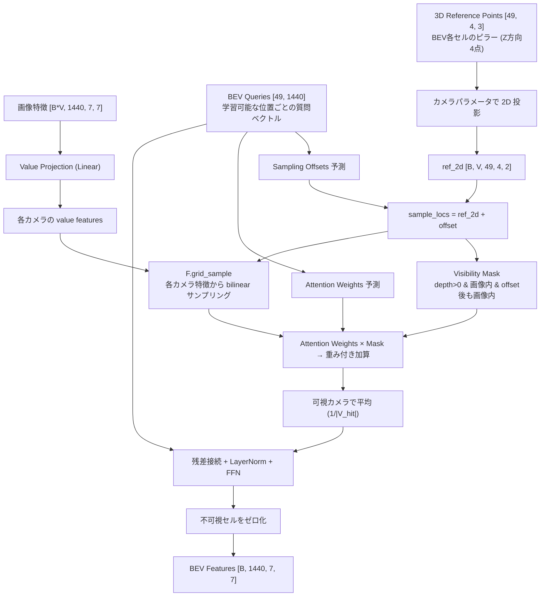
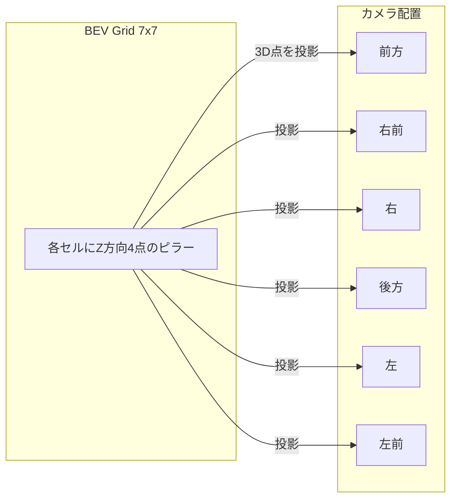
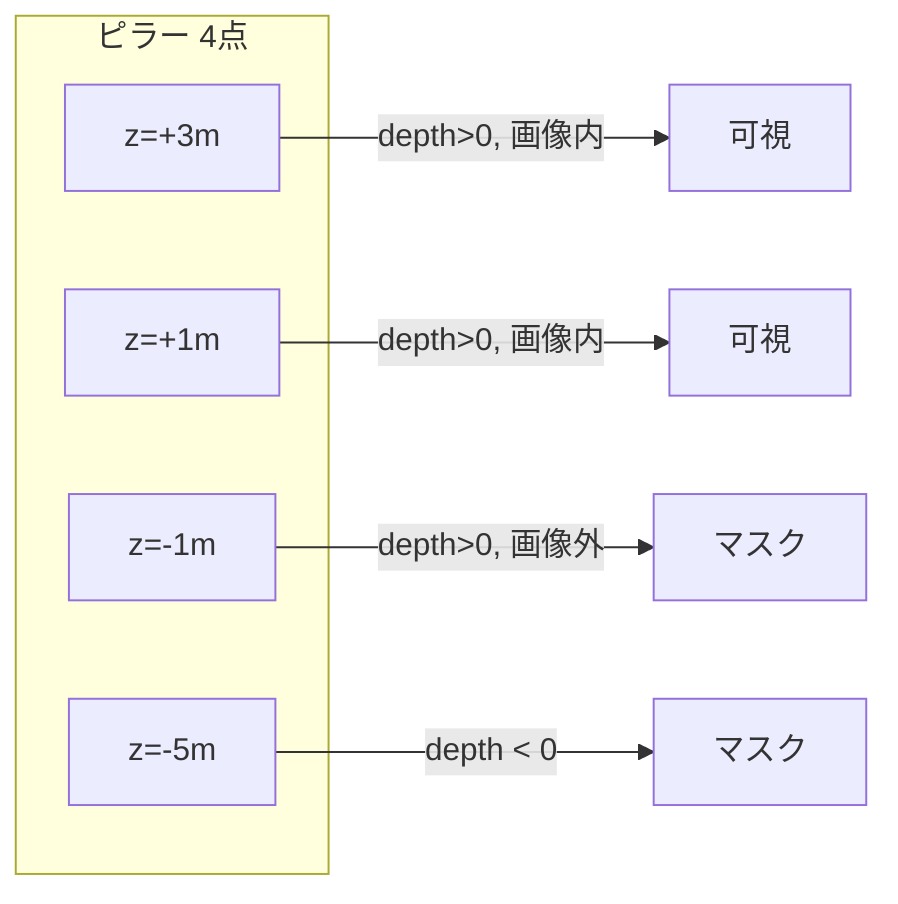

## はじめに

普段は AWS で自動運転モデルの開発をしています。特に AWS を用いた DataOps / MLOps というところを本業では強みとしていますが、一方で Autoware Foundation の Robotaxi Working Group にも参加しています。そちらでも E2E の自動運転モデル開発に取り組んでいますが、その活動の中で今回紹介するマルチカメラ統合モジュールを書いたのをきっかけに、私自身もあまり PyTorch を使ってちゃんとネットワークを組んでこなかった中で向き合うことになったので、このブログを書くことにしました。

BEVFormer や UniAD の論文を読んで「spatial cross-attention で BEV 特徴を作る」と書いてあるのは理解したが、実装レベルで何が起きているのかが掴めない。テンソルがどう変形されて、どの重みがどの計算に使われるのかが追えない。そういう経験はないでしょうか。

この記事では、Autoware Foundation の End-to-End 自動運転モデル AutoE2E に実装した3種類のマルチカメラ統合アーキテクチャについて、各テンソルの形状変化と計算を1ステップずつ解説します。

### この記事を読むと得られるもの

- Concat / Cross-Attention / BEV の3手法それぞれで「なぜその形状変換が必要か」の理解
- BEVFormer の 3D参照点 → 2D投影 → grid_sample の実装レベルの動作理解
- 各手法のパラメータがどう学習されるか（勾配の流れ）

### 対象読者

- ニューラルネットワークの概念は知っているが、自動運転モデルを PyTorch スクラッチで実装したことがない人
- テンソルの形状変換（reshape, permute）がピンと来ない人
- BEVFormer / UniAD の論文を読んだが ピンと来ない人

:::message
本記事のコードはすべて [autowarefoundation/auto_e2e](https://github.com/autowarefoundation/auto_e2e) に公開されています。
:::

---

## 全体像: なぜマルチカメラ統合が必要か

自動運転車には通常 6〜8 台のカメラが搭載されています。各カメラの視野角は60〜120°程度なので、360°のシーンを理解するには複数カメラからの情報を1つにまとめる必要があります。この処理を View Fusion（ビュー統合） と呼びます。

```
前方カメラ ─┐
右前カメラ ─┤
右カメラ　 ─┤
後方カメラ ─┼─→ [ View Fusion ] ─→ 統合されたシーン表現 ─→ 走行軌跡予測
左カメラ　 ─┤
左前カメラ ─┤
後方カメラ ─┤
マップタイル─┘
```

---

## PyTorch の基本構造（前提知識）

PyTorch でネットワークを書くとき、必ずこの形になります:

```python
class MyModule(nn.Module):
    def __init__(self):
        super().__init__()
        # ここで「学習可能なパーツ」を定義（道具を棚に並べる）

    def forward(self, x):
        # ここで「データの流れ」を記述（レシピ通りに料理する）
        return x
```

| メソッド | 役割 |
|---------|------|
| `__init__` | 使うレイヤー（道具）の宣言 |
| `forward` | データが来たときの処理手順 |

---

## テンソルの形状表記

この記事を通して `[B, V, C, H, W]` のような表記が頻出します。

| 記号 | 意味 | 今回の例 |
|------|------|----------|
| B | バッチサイズ（同時処理するサンプル数） | 2 |
| V | ビュー数（カメラ台数） | 8 |
| C | チャンネル数（特徴の種類） | 1440 |
| H | 高さ（空間方向） | 7 |
| W | 幅（空間方向） | 7 |

テンソルとは多次元配列のことです。1枚のRGB画像は `[3, 224, 224]` で表現され、それが複数枚集まると次元が増えていきます。

具体的なイメージ:
```
[3, 224, 224] は「3枚の224×224の数値表」

  R (赤):        G (緑):        B (青):
  ┌───────┐     ┌───────┐     ┌───────┐
  │0.2 0.3│     │0.1 0.5│     │0.8 0.2│
  │0.4 0.1│     │0.3 0.2│     │0.1 0.9│
  └───────┘     └───────┘     └───────┘
  ↑ 各ピクセルの赤の強さ  緑の強さ      青の強さ
```

これが8カメラ分で `[8, 3, 224, 224]`、さらに2サンプル同時処理で `[2, 8, 3, 224, 224]`。次元が増えるのは単に「同じ構造のものが複数ある」ことを表しているだけです。

:::message
batch=2 にしている理由は2つあります。1サンプルずつ学習すると特殊なシーンに引きずられてパラメータが極端にブレやすく、GPU の並列計算能力も使い切れません。複数サンプルを同時処理することで学習が安定し、GPU効率も上がります。加えて batch=1 だとバッチ次元の扱いに関するバグが隠れることがあるため、テスト時も batch=2 で検証しています。
:::

---

## ネットワーク全体の流れ

```
入力: [2, 8, 3, 224, 224]  ← 2サンプル × 8カメラ × RGB × 224×224
         │
         │  (1) Backbone: 画像を特徴マップに変換
         ▼
    [16, 1440, 7, 7]       ← 16枚の画像それぞれの特徴
         │
         │  (2) View Fusion: 8カメラを1つに統合
         ▼
    [2, 1440, 7, 7]        ← 統合されたシーン表現
         │
    ┌────┴────┐
    ▼         ▼
 走行軌跡  未来予測
[2, 128]   [2, 1440, 7, 7]×4
```

---

## (1) Backbone: 画像を特徴に変換する

### なぜ reshape が必要か

Backbone（Swin Transformer）は1枚の画像単位で処理するモジュールであり、入力として `[バッチ, 3, 224, 224]` という4次元テンソルのみ受け付けます。しかし我々の入力は `[2, 8, 3, 224, 224]`（5次元）なので、バッチ次元とビュー次元を結合して4次元に変換する必要があります。

```python
x = x.reshape(B * V, C, H, W)
# [2, 8, 3, 224, 224] → [16, 3, 224, 224]
```

2サンプル × 8カメラ = 16枚を「16枚のバッチ」として Backbone に通します。

:::message
reshape はテンソルの中身（数値の並び）を一切変えずに、解釈の仕方だけを変える操作です。

例: 6個の数値 `[1, 2, 3, 4, 5, 6]` を...
- `reshape(2, 3)` → `[[1,2,3], [4,5,6]]`（2行3列の表）
- `reshape(3, 2)` → `[[1,2], [3,4], [5,6]]`（3行2列の表）
- `reshape(6)` → `[1,2,3,4,5,6]`（元の1列）

数値自体は変わっていません。メモリ上のデータ配置はそのままで、アクセスの仕方だけが変わります。
:::

### Backbone の4段階処理

Swin Transformer は画像を段階的に低解像度化しつつ、意味的に濃い特徴へと変換していきます:

```
入力:  [16, 3, 224, 224]     ← 生の画像ピクセル

Stage 0: [16, 56, 56, 96]    ← 1/4解像度、96種類の低レベル特徴
Stage 1: [16, 28, 28, 192]   ← 1/8解像度、192種類の中レベル特徴
Stage 2: [16, 14, 14, 384]   ← 1/16解像度、384種類の高レベル特徴
Stage 3: [16, 7, 7, 768]     ← 1/32解像度、768種類の意味的特徴
```

:::message
7×7 の各マスは元画像の 32×32 ピクセル領域に対応しています。224÷7=32 なので、Stage 3 の1マス = 元画像の 32×32px の情報を768個の数値に圧縮したものです。
:::

### マルチスケール特徴の結合

4段階の出力を全て 7×7 に揃えて、チャンネル方向に結合します:

```python
f0 = pool(features[0])  # [16, 96, 56, 56]  → pool → [16, 96, 7, 7]
f1 = pool(features[1])  # [16, 192, 28, 28] → pool → [16, 192, 7, 7]
f2 = pool(features[2])  # [16, 384, 14, 14] → pool → [16, 384, 7, 7]
f3 = features[3]        # [16, 768, 7, 7]   (既に 7×7)

fused = torch.cat([f0, f1, f2, f3], dim=1)
# → [16, 96+192+384+768, 7, 7] = [16, 1440, 7, 7]
```

これで16枚の画像それぞれについて `[1440, 7, 7]` の特徴マップが得られました。ここまで、カメラ間の情報交換は一切行っていません。

:::message
元画像は RGB=3チャンネルでしたが、Backbone を通すとチャンネル数が 3→1440 に増えます。各チャンネルは特定のパターンに対する応答値であり、ある位置の1440個の数値のうち特定のチャンネルが大きい値を持てば「そこにエッジがある」「そこに車輪のような形がある」等のパターンが検出されたことを意味します。
:::

:::message
7×7 で足りるのか: 元画像 224×224 = 50,176 ピクセル × 3ch = 約15万個の数値。一方、7×7 × 1440ch = 約7万個の数値。データ量としては同じオーダーですが、意味的に整理された形式になっているため、後段の処理がはるかに楽になります。
:::

---

## (2) View Fusion: 3つの手法

ここからが本記事の核心です。「16枚分の独立した特徴」を「2サンプル分の統合シーン表現」にまとめます。

AutoE2E では `fusion_mode` パラメータで3つの手法を切り替えられます:

```python
model = AutoE2E(num_views=8, fusion_mode="concat")      # 手法1
model = AutoE2E(num_views=8, fusion_mode="cross_attn")   # 手法2
model = AutoE2E(num_views=8, fusion_mode="bev")          # 手法3
```

---

## 手法1: ConcatViewFusion（チャンネル結合 + 畳み込み）

最もシンプルな手法です。全カメラの特徴をチャンネル方向に連結し、1×1 畳み込みで元の次元数に圧縮します。

### 処理の流れ

```
入力: [16, 1440, 7, 7]    ← 16枚(=2バッチ×8カメラ)の特徴

Step 1: reshape
  [16, 1440, 7, 7] → [2, 8, 1440, 7, 7]
  「16枚バラバラ」を「2サンプル × 8カメラ」に戻す

Step 2: reshape (チャンネル方向に結合)
  [2, 8, 1440, 7, 7] → [2, 8×1440, 7, 7] = [2, 11520, 7, 7]
  8カメラ分の特徴を1つの巨大なチャンネルに並べる

Step 3: Conv2d(11520, 1440, kernel=1) + GELU
  [2, 11520, 7, 7] → [2, 1440, 7, 7]
  1×1 畳み込みで「どのカメラのどの特徴が重要か」を学習して圧縮

出力: [2, 1440, 7, 7]
```

### Conv2d(11520, 1440, kernel=1) とは何か

これは 1×1 畳み込み（Pointwise Convolution） と呼ばれる操作です。

```
入力: 各空間位置(i, j)に 11520 個の数値がある

1×1 Conv の動作:
  出力[k][i][j] = Σ(weight[k][c] × 入力[c][i][j]) + bias[k]
  
  k = 0, 1, ..., 1439 (出力チャンネル)
  c = 0, 1, ..., 11519 (入力チャンネル)
```

各空間位置で独立に 11520次元のベクトルを1440次元に線形変換しています。8カメラ×1440特徴 = 11520個の情報から、重要な1440個の特徴を学習によって選び出す操作です。

:::message
num_views=2, embed_dim=3 の極小ケースで考えると:
```
入力: カメラ0=[0.5, 0.3, 0.8], カメラ1=[0.1, 0.9, 0.2]
concat後: [0.5, 0.3, 0.8, 0.1, 0.9, 0.2]  (6次元)
Conv1x1:  出力[k] = w[k][0]*0.5 + w[k][1]*0.3 + ... + w[k][5]*0.2
         → [0.4, 0.7, 0.1]  (3次元に圧縮)
```
weight の値によって「カメラ0の2番目の特徴を重視」「カメラ1は無視」等が決まります。
:::

### GELU とは

活性化関数（Activation Function）の一種です。

```
GELU(x) ≈ x × Φ(x)   (Φ はガウス分布の累積分布関数)
```

線形変換だけだと直線的な変換しかできません。GELU を挟むことで非線形な変換が可能になり、ネットワークの表現力が上がります。ReLU の滑らかな代替として、近年の Transformer 系モデルで標準的に使われています。

### この手法の特徴

| 良い点 | 悪い点 |
|--------|--------|
| 実装が簡単 | 空間的な対応関係を学習できない |
| 計算が軽い | カメラの位置情報を考慮していない |
| カメラパラメータ不要 | 「右カメラの左端 = 前方カメラの右端」のような関係は暗黙的にしか学習できない |

次の手法では、カメラ間の関係を明示的に学習する方法を見ていきます。

---

## 手法2: CrossAttentionViewFusion（カメラ間アテンション）

各空間位置で、8カメラ間の相互参照を行う手法です。入力に応じて「どのカメラの情報が今重要か」を動的に判断します。

### 処理の流れ（全体像）

```
入力: [16, 1440, 7, 7]

Step 1: reshape        → [2, 8, 1440, 7, 7]
Step 2: permute+reshape → [98, 8, 1440]     空間位置ごとに分解
Step 3: + view_embed    → [98, 8, 1440]     カメラの位置情報を付与
Step 4: Self-Attention  → [98, 8, 1440]     カメラ間で情報交換
Step 5: FFN            → [98, 8, 1440]     非線形変換
Step 6: mean(dim=1)    → [98, 1440]        8カメラを平均して1つに
Step 7: reshape        → [2, 1440, 7, 7]   空間形状に戻す

出力: [2, 1440, 7, 7]
```

### Step 1: バッチとカメラを分離

```python
x = fused_per_view.reshape(B, V, C, H, W)
# [16, 1440, 7, 7] → [2, 8, 1440, 7, 7]
```

Backbone に通すために結合した「16枚バッチ」を、「2サンプル × 8カメラ」に復元します。

:::message
もし復元せずに Attention を計算すると、サンプル1の前方カメラとサンプル2の右カメラが混ざってしまいます。それは物理的に意味がないので、サンプル境界を明示する必要があります。
:::

### Step 2: 空間位置ごとに分解

```python
x = x.permute(0, 3, 4, 1, 2).reshape(B * H * W, V, C)
# [2, 8, 1440, 7, 7]
#   ↓ permute（次元の並び替え）
# [2, 7, 7, 8, 1440]
#   ↓ reshape
# [2×7×7, 8, 1440] = [98, 8, 1440]
```

7×7 = 49 の空間位置 × 2バッチ = 98個のグループになります。各グループに「8カメラ分の1440次元ベクトル」が並んでいます。

:::message
permute は reshape と異なり、メモリ上のデータ配置自体が変わります。次元の順序を入れ替える操作です。

例: `[2, 3]` の行列を permute(1, 0) すると `[3, 2]` に転置されます:
```
元:       [[1, 2, 3],     permute(1,0):  [[1, 4],
           [4, 5, 6]]                     [2, 5],
                                          [3, 6]]
```
reshape と違い、`[1,2,3,4,5,6]` → `[1,4,2,5,3,6]` のようにデータの並び順自体が変わります。
:::

この変形が必要な理由は、PyTorch の `nn.MultiheadAttention` が入力として `[batch, sequence_length, embed_dim]` の形を期待するためです。今回比較したい sequence はカメラ8台なので、カメラ軸を sequence 次元に配置します。`[98, 8, 1440]` = [batch(空間位置), sequence(カメラ), features] という対応です。

```
ある空間位置(3, 4)について:
  前方カメラの特徴:   [0.3, -0.1, 0.8, ..., 0.2]   (1440個)
  右前カメラの特徴:   [0.1, 0.4, -0.2, ..., 0.7]   (1440個)
  右カメラの特徴:     [-0.5, 0.2, 0.1, ..., 0.3]   (1440個)
  ...
  マップタイルの特徴:  [0.0, 0.6, 0.4, ..., -0.1]  (1440個)
```

この8つのベクトルの間で「どれが重要か」を次の Attention で決定します。

### Step 3: カメラ位置埋め込み（view_embed）の加算

```python
self.view_embed = nn.Parameter(torch.randn(1, num_views, embed_dim) * 0.02)

x = x + self.view_embed
# [98, 8, 1440] + [1, 8, 1440] → [98, 8, 1440] (ブロードキャスト加算)
```

Attention は入力ベクトルの数値しか見えないため、このままだと「この特徴がどのカメラから来たか」を区別できません。`view_embed` は各カメラに固有の学習可能ベクトルを加算することで、カメラの識別情報を埋め込みます。`view_embed[0]` は前方カメラ、`view_embed[1]` は右前カメラ、のように各カメラに対応します。

:::message
`nn.Parameter` で宣言すると PyTorch が学習対象として認識します。初期値は小さなランダム値ですが、学習が進むにつれて「右カメラと左カメラは対になっている」のような意味のある関係性を獲得していきます。
:::

### Step 4: Self-Attention（カメラ間の情報交換）

```python
x_norm = self.norm(x)                          # LayerNorm
attn_out, _ = self.cross_attn(x_norm, x_norm, x_norm)  # Attention
x = x + attn_out                               # 残差接続
```

#### Self-Attention の仕組み

Self-Attention の数式は以下の通りです:

```
Attention(Q, K, V) = softmax(Q × K^T / √d) × V
```

:::message
softmax は任意の数値の列を「合計1の確率分布」に変換する関数です。

例: `[2.0, 1.0, 0.1]` → softmax → `[0.66, 0.24, 0.10]`

大きい値ほど大きい重みになり、全部足すと必ず 1.0 になります。
:::

:::message
√d で割る理由: d はベクトルの次元数です。Q×K^T の内積値は次元数が大きいほど値が大きくなります。大きな値を softmax に入れると「ほぼ1つだけ1.0、残り全部0.0」の極端な分布になるため、√d で割ることで値を適度な範囲に抑え、学習を安定させます。
:::

今回は Q=K=V=同じテンソル（Self-Attention）です。Q（Query）は各カメラが「他のカメラに対して何を問い合わせるか」を表し、K（Key）は各カメラが「自分がどんな情報を持っているか」を表し、V（Value）は「実際に渡す情報の中身」を表します。Q と K の内積で類似度（注目度）が計算され、その重みで V を加重平均することで、各カメラが他カメラから関連情報を取り込みます。

#### 具体例: カメラ0 の更新

```
Q×K^T を計算:
  カメラ0 と カメラ0 の類似度: 0.30
  カメラ0 と カメラ1 の類似度: 0.05
  カメラ0 と カメラ2 の類似度: 0.02
  カメラ0 と カメラ3 の類似度: 0.40  ← 最も類似（最重要）
  ...

softmax で正規化 → 重み: [0.30, 0.05, 0.02, 0.40, 0.01, 0.02, 0.10, 0.10]

重み付き加算:
  出力0 = 0.30×V0 + 0.05×V1 + 0.02×V2 + 0.40×V3 + ... + 0.10×V7
```

これを8カメラ全てについて行います。結果として各カメラが「他のカメラの情報も取り入れた特徴」に更新されます。

#### 残差接続（Residual Connection）

```python
x = x + attn_out
```

Attention の出力を元の入力に加算します。元の情報を保持しつつ補強する形式であり、完全に置き換えないことで学習が安定します。

#### Multi-Head Attention

実際には `num_heads=8` で動作しています。1440次元を8つの head に分割（各180次元）し、それぞれ独立に Attention を計算した後に結合します。

```
1440次元 → 8頭 × 180次元 → 各頭で独立に Attention → 結合 → 1440次元
```

:::message
1440次元全体で1つの attention weight を計算すると、1通りの重要度パターンしか表現できません。8 head に分割すると各 head が独立した重要度パターンを持てるため、head 0 は「カメラ0,1を重視」、head 3 は「カメラ5,6を重視」のように複数の異なる注目パターンを並列に計算できます。
:::

### Step 5: Feed-Forward Network (FFN)

```python
x = x + self.ffn(self.norm_ffn(x))
```

FFN の中身:
```
[98, 8, 1440]
  → LayerNorm
  → Linear(1440, 2880)    # 2倍に拡張
  → GELU                  # 非線形活性化
  → Dropout(0.1)          # ランダムに10%を0にする（過学習防止）
  → Linear(2880, 1440)    # 元に戻す
  → Dropout(0.1)
[98, 8, 1440]             # 形状は変わらない
```

Attention は重み付き加算（線形操作）しかできないため、FFN で非線形変換を加えることで「集めた情報をさらに加工する」能力を与えます。

### Step 6-7: 集約と形状復元

```python
x = x.mean(dim=1)  # [98, 8, 1440] → [98, 1440]  8カメラを平均
x = x.reshape(B, H, W, C).permute(0, 3, 1, 2)  # → [2, 1440, 7, 7]
```

Attention で相互参照済みの8つの特徴を平均して、1つの統合表現にします。次の手法では、さらに3D幾何学を活用した統合方法を見ていきます。

---

## 手法3: BEVViewFusion（BEV 空間射影 + 空間クロスアテンション）

最も高度な手法です。BEV（Bird's Eye View、鳥瞰図）空間に特徴を投影します。BEVFormer（Li et al., ECCV 2022）の手法であり、UniAD（CVPR 2023 Best Paper）でも同じ方式が使われています。

### 核心アイデア

手法1,2は画像特徴空間で統合していました。手法3は3Dエゴ（車両）座標空間で統合します。

```
手法1,2: カメラの特徴 → カメラ空間で統合 → シーン表現
手法3:   カメラの特徴 → 車両中心の3D空間に投影 → BEV グリッドで統合 → シーン表現
```

:::message
BEV とは車を真上から見下ろした視点のことです。自動運転の経路計画は2D平面で行うため、カメラ画像を BEV に変換できると計画が容易になります。
:::

### 処理の全体像



### 3D空間とカメラの位置関係



### Visibility Mask の動作



### コンポーネント詳解

#### BEV Queries

```python
self.bev_queries = nn.Embedding(bev_h * bev_w, embed_dim)
# shape: [49, 1440]  (7×7のBEVグリッド、各セルに1440次元の学習可能ベクトル)
```

BEV グリッドの各セルが持つ学習可能ベクトルです。各セルはこのベクトルを使って画像特徴に対し「自分の位置に何があるか」を問い合わせます。

:::message
手法2 の view_embed との違い:

- view_embed（手法2）: 各カメラに加算される固定ベクトル。形状 `[8, 1440]`。カメラ間の self-attention で「自分はカメラ何番か」を区別するために使う。
- BEV queries（手法3）: BEV グリッドの各位置に対応する学習可能ベクトル。形状 `[49, 1440]`。画像特徴から情報を引き出すための query として機能する。

手法2 はカメラ特徴同士が相互に参照する（self-attention）。手法3 は BEV の各位置が能動的にカメラ特徴を取りに行く（cross-attention 的な動作）。情報の流れる方向が異なります。
:::

BEVFormer では 200×200（4万個）のクエリを使いますが、AutoE2E では後段との互換性のため 7×7 = 49 個にしています。

#### 3D Reference Points（参照点）

```python
# 各BEVセルに Z 方向の「柱」(pillar) を立てる
# [49, 4, 3] = 49セル × 4つの高さ × (x, y, z)座標

xs = linspace(0, 1, 7)    # BEV の X 軸
ys = linspace(0, 1, 7)    # BEV の Y 軸
zs = linspace(0, 1, 4)    # 高さ方向 4点（-5m 〜 +3m）
```

1つのBEVセルは地面上の位置を表しますが、その位置に何があるか知るには異なる高さの情報が必要です:

```
        z=+3m  ●  ←上空（高架など）
               |
        z=+1m  ●  ←車両の高さ
               |
        z=-1m  ●  ←路面
               |
        z=-5m  ●  ←地下（トンネルの床）
               |
     ──────────┼──────── BEV グリッドの1セル
```

歩行者（高さ1.7m）と信号機（高さ5m）は同じXY位置でも異なる高さにあるため、4点サンプリングすることでモデルが「どの高さが重要か」を学習できます。

:::message
LSS方式（Lift, Splat, Shoot）では画像の各ピクセルについて深度の確率分布を予測しますが、正確な深度ラベル（LiDAR由来）がないと学習が難しいという問題があります。ピラー方式（BEVFormer）は3D座標を既知のカメラパラメータで画像上に投影するため、深度を「予測」せず「計算」します。幾何学的に正確で追加の教師信号が不要なため、深度ラベルが用意できない状況に適しています。
:::

#### カメラパラメータによる 3D → 2D 投影

```python
# 3Dエゴ座標（車両中心）→ カメラ画像上の2D座標
# projection_matrix = intrinsic @ extrinsic  (内部パラメータ × 外部パラメータ)

projected = projection_matrix @ [x, y, z, 1]^T   # 射影変換
depth = projected[2]                               # 奥行き（正=カメラの前）
u = projected[0] / depth                           # 透視除算（遠いものは小さく）
v = projected[1] / depth
# 正規化: u_norm = u / image_size, v_norm = v / image_size  → [0, 1] の範囲に
```

| パラメータ | 意味 |
|-----------|------|
| extrinsic (外部パラメータ) | 車両座標系 → カメラ座標系の変換（カメラが車体のどこに、どの方向に付いているか）|
| intrinsic (内部パラメータ) | カメラの焦点距離、画像中心など（3D → 2Dピクセルの変換係数）|

:::message alert
カメラパラメータがないときのために `pseudo_projection`（`nn.Parameter`, shape `[V, 3, 4]`）がフォールバックとして存在しますが、これはテストと形状確認のためだけのものです。pseudo_projection は入力画像の内容を見ずに固定的な投影先を出力するため、真のカメラ幾何を学習することは構造上不可能です。実データで BEV fusion を機能させるには実際のカメラキャリブレーション（intrinsic @ extrinsic）が必須であり、Design Document でも「データセット決定後に real camera_params に切り替え、pseudo_projection は削除予定」と明記されています。
:::

#### Visibility Mask（可視性マスク）

```python
# 3段階のチェック:
# 1. 奥行きが正（カメラの前にある）
valid_depth = depth > 0

# 2. 投影結果が画像の範囲内 [0, 1]
in_bounds = (u_norm >= 0) & (u_norm <= 1) & (v_norm >= 0) & (v_norm <= 1)

# 3. offset を加えた後の最終サンプリング位置も範囲内
sample_locs = reference_2d + offsets
sample_in_bounds = (sample_locs >= 0) & (sample_locs <= 1)

mask = valid_depth & in_bounds & sample_in_bounds
```

3段階で「この点はこのカメラから見えるか」を判定します。depth > 0 はカメラの後ろにある点を除外し、画像範囲チェックは視野外の点を除外し、offset 後のチェックは学習されたオフセットで画像外に出た点を除外します。

:::message
カメラの後ろの点（depth < 0）の処理は重要です。以前の実装では clamp(min=0.00001) で無理やり正にしていましたが、幾何的に見えないはずの点を「見える」として扱ってしまう問題がありました。正しくは mask で除外します。
:::

#### grid_sample による特徴サンプリング

```python
sampled = F.grid_sample(feature_map, sample_locations, mode='bilinear')
```

2D投影で得た座標 `(u, v)` の位置から、画像特徴マップの値を取り出します。

```
feature_map [B, 1440, 7, 7]:

    (0,0)────────────(1,0)
     │  ┌──┐┌──┐     │
     │  │A ││B │     │
     │  └──┘└──┘     │
     │    ● (0.3, 0.6) ← この位置の特徴が欲しい
     │  ┌──┐┌──┐     │
     │  │C ││D │     │
     │  └──┘└──┘     │
    (0,1)────────────(1,1)

grid_sample は周囲4点 (A, B, C, D) からバイリニア補間で値を計算
= 距離に応じた重み付き平均（近いセルほど強く反映）
```

:::message
バイリニア補間の具体例: 7×7 の特徴マップで座標 `(2.3, 4.7)` の値が欲しいとき:

```
周囲4セル:
  (2,4)=0.5   (3,4)=0.9
  (2,5)=0.3   (3,5)=0.7

x方向: 0.3 の位置 → (2,4) に 0.7、(3,4) に 0.3 の重み
y方向: 0.7 の位置 → (x,4) に 0.3、(x,5) に 0.7 の重み

結果 = 0.7*0.3*0.5 + 0.3*0.3*0.9 + 0.7*0.7*0.3 + 0.3*0.7*0.7
     = 0.105 + 0.081 + 0.147 + 0.147 = 0.48
```

整数座標以外の任意の位置から滑らかに特徴を取得でき、勾配も通るため「どこからサンプリングすべきか」自体も学習可能です。
:::

:::message
BEVFormer の論文ではカスタム CUDA カーネルによる Multi-Head Deformable Attention を使いますが、AutoE2E では `F.grid_sample` による single-head 簡略版で代替しています。概念は同じ（参照点 + オフセット + 重み）ですが、BEVFormer の完全な multi-head 独立サンプリングとは異なります。特別な CUDA コンパイルが不要なため移植性が高い利点があります。
:::

#### Sampling Offsets（サンプリングオフセット）

```python
offsets = self.sampling_offsets(queries)  # BEV queries から予測
# 「投影先からちょっとずらした位置も見たい」
sample_locations = reference_points_2d + offsets
```

投影先の位置だけでなく少しずらした位置も見ることで、投影の誤差を吸収し、より広い文脈を取得できます。

:::message
投影計算は「その3D点が画像のどこに映るか」を示しますが、実際に有用な情報（物体の中心、境界等）は数ピクセルずれた場所にあることが多いです。学習可能なオフセット（初期値≈0、スケール0.1）を加えることで、幾何的な投影先を起点に「本当に見るべき場所」に自動調整されます。
:::

#### Attention Weights（注意重み）

```python
attn_weights = self.attention_weights(queries)  # [B, N, V * num_z]
attn_weights = attn_weights.reshape(B, N, V, num_z)
attn_weights = attn_weights.softmax(dim=-1)     # 各カメラ内で高さ方向に正規化

# mask された点のweight をゼロにして再正規化
w = w * point_mask
w = w / w.sum(dim=-1, keepdim=True).clamp(min=1e-8)
```

BEV queries から予測される重みで、各カメラ内で「柱の4つの高さのどれが重要か」を学習します。カメラ間の重み付けは attention weight ではなく visibility-based 平均で行います。これは BEVFormer の SCA 式 `output = (1/|V_hit|) × Σ(...)` と同じ設計です。

:::message
softmax 後に masked points をゼロにすると、残った valid points の重みの合計が 1 未満になり特徴のスケールが不安定になります。`w / w.sum()` で再正規化することで、valid points だけで重みが合計 1 になるようにしています。
:::

:::message
標準的な Attention では重み = dot(Q, K) / √d で Q と K の類似度から決まりますが、BEVFormer 式では重み = Linear(Q) で Q だけから決まり K は不要です。これが Deformable Attention の特徴であり、標準の Attention が全位置を見る O(N²) に対し、Deformable は少数の点だけ見る O(N×K) で高速に動作します。
:::

#### 可視カメラでの平均（BEVFormer の 1/|V_hit|）

```python
output = sum(weighted_features * cam_visible) / visible_count
```

各BEVセルについて、見えているカメラからの情報を集めて平均します。ある場所は2台のカメラから見えるかもしれないし、6台から見えるかもしれません。これは BEVFormer の SCA 式そのものです。

#### Post-Attention: 残差接続 + FFN + 不可視セルのゼロ化

```python
output = LayerNorm(queries + output_proj(sampled))  # Attention結果 + 元のクエリ
output = LayerNorm(output + FFN(output))            # FFN で非線形変換

# どのカメラからも見えなかったBEVセルはゼロにする
has_observation = (visible_count > 0).float()
output = output * has_observation
```

手法2と同じ残差+FFNパターンに加え、観測されていないBEVセルを明示的にゼロ化します。これがないと、LayerNorm のバイアス経由で「何も見えていないのにもっともらしい特徴が出る」現象が起きます。

#### 最終形状復元

```python
bev_features = output.reshape(B, bev_h, bev_w, C).permute(0, 3, 1, 2)
# [2, 49, 1440] → [2, 7, 7, 1440] → [2, 1440, 7, 7]
```

---

## 3手法の比較まとめ

| | Concat | Cross-Attention | BEV |
|---|---|---|---|
| 統合空間 | チャンネル | 特徴空間 | 3Dエゴ座標（車両中心） |
| カメラ関係 | 暗黙的（Conv で学習） | 明示的（Attention） | 幾何学的（投影） |
| カメラパラメータ | 不要 | 不要 | 必要（なければ pseudo fallback） |
| 計算コスト | 低 | 中 | 高 |
| パラメータ数 | ~16.6M | ~16.6M | ~13.0M |
| 学習パラメータ | Conv の重み | view_embed + Attention + FFN | BEV queries + offsets + weights + FFN |
| 業界での使用例 | CLIP, 初期マルチモーダルfusion | PETR, PETRv2 | BEVFormer, UniAD (デフォルトBEVエンコーダ) |
| 3D空間の扱い | なし | 暗黙的（学習依存） | 明示的（幾何投影） |

---

## 後段: 統合された特徴から予測する

### DrivingPolicy: 走行軌跡の予測

```
統合シーン特徴 [2, 1440, 7, 7]
  ↓ Conv2d(1440, 3, kernel=3, padding=1)   チャンネル圧縮
  → [2, 3, 7, 7]
  ↓ flatten(start_dim=1)                   空間方向を1次元に
  → [2, 147]
  ↓ cat(visual_history [2,896], egomotion [2,256])  履歴情報を結合
  → [2, 1299]
  ↓ Linear(1299, 1299) + GELU + Dropout
  ↓ Linear(1299, 1164) + GELU + Dropout
  ↓ Linear(1164, 128)
  → [2, 128]

出力: 64ステップ × (加速度, 曲率) = 6.4秒先の走行軌跡
```

:::message alert
`flatten(start_dim=1)` が重要。`start_dim=1` を指定することでバッチ次元（dim=0）を保持しつつ、それ以降を1次元に展開します。旧コードでは引数なしの `flatten()` でバッチ次元も潰してしまい、batch_size=1 でしか動かないバグがありました。
:::

### FutureState: 未来の視覚特徴予測

```
統合シーン特徴 [2, 1440, 7, 7]
  ↓ Conv2d(1440, 2880, kernel=3, padding=1) + GELU
  → [2, 2880, 7, 7]
  ↓ Conv2d(2880, 5760, kernel=3, padding=1)
  → [2, 5760, 7, 7]
  ↓ chunk(4, dim=1)    チャンネルを4分割
  → [2, 1440, 7, 7] × 4

出力: 1.6秒間隔 × 4 = 6.4秒先までの未来の視覚特徴
```

これは JEPA（Joint Embedding Predictive Architecture, LeCun 2022）の考え方に基づいています。「未来の画像」ではなく「未来の特徴表現」を予測します。ピクセルではなく意味空間で予測するため、計算効率と汎化性が高くなります。

---

## 学習の流れ（Backpropagation）

```
1. Forward Pass: 画像を入力 → 軌跡予測を得る
   [2, 8, 3, 224, 224] → Backbone → Fusion → Policy → [2, 128]

2. Loss 計算: 予測軌跡と正解軌跡の差
   loss = MSE(predicted_trajectory, ground_truth_trajectory)

3. Backward Pass: 勾配を逆方向に伝播
   loss.backward()
   
   Loss → DrivingPolicy の重み
       → View Fusion の重み（view_embed, attention, BEV queries...）
       → FeatureFusion の重み
       → Backbone の重み

4. パラメータ更新: 勾配の方向に少しだけ動かす
   optimizer.step()
```

このサイクルを数万〜数十万回繰り返すことで、全パラメータが「正しい走行軌跡を予測する方向」に自動的に学習されます。

:::message
勾配（Gradient）とは、あるパラメータ w を微小量変化させたとき loss がどれだけ変化するかの比率（偏微分）です。

具体例: `w=0.5` のとき `loss=2.0`、`w=0.501` にすると `loss=1.98` なら:
- 勾配 ≈ (1.98 - 2.0) / (0.501 - 0.5) = -2.0
- 勾配が負 → w を増やすと loss が下がる → w を増やす方向に更新

`optimizer.step()` は全パラメータに対してこれを同時に適用します:
```
w_new = w_old - learning_rate × gradient
```
:::

:::message
learning_rate は通常 0.001 ~ 0.0001 程度の小さい値であり、1回の更新でパラメータが動く量は極めて小さいです。大きく動かすと loss が逆に増える（発散する）ため、小さい更新を数万回積み重ねることで安定的に loss の低い領域に到達します。
:::

---

## UniAD との関係

UniAD (Planning-oriented Autonomous Driving, CVPR 2023 Best Paper) はこの分野の最先端モデルです。AutoE2E の BEV fusion は UniAD と同じ BEVFormer アーキテクチャを採用しています。

```
UniAD:    ResNet-101 → BEVFormer → Detection → Tracking → Planning
AutoE2E:  Swin V1    → BEVViewFusion → DrivingPolicy
```

UniAD は BEVFormer をモジュールとしてそのまま組み込んでいます。AutoE2E の実装も同じ数学的原理に基づいていますが、以下の点で簡略化しています:

| | UniAD/BEVFormer | AutoE2E |
|---|---|---|
| BEV解像度 | 200×200 | 7×7 |
| Encoderレイヤー数 | 6 | 1 |
| Temporal Self-Attention | あり | なし（今後追加予定） |
| Deformable Attention | カスタムCUDA | F.grid_sample（移植性重視） |
| マルチスケール | 4レベルFPN | 単一スケール（pool後） |

---

## テストで検証していること

88個のテストが全 fusion mode に対して以下を保証しています:

| カテゴリ | 検証内容 |
|---------|---------|
| 出力形状 | batch_size 1/2/4 で正しい shape が出るか |
| バッチ独立性 | あるサンプルを変えても他のサンプルに影響しないか |
| View 統合 | 各カメラが出力に影響しているか |
| 勾配伝播 | 全パラメータに勾配が届くか（学習可能か） |
| num_views 柔軟性 | 1/4/8/12 カメラで動くか |
| 数値安定性 | NaN/Inf が出ないか |

---

## まとめ

| 手法 | 一言でいうと | 適した場面 |
|------|-------------|-----------|
| Concat | 全部並べて圧縮 | 素早いプロトタイプ、カメラパラメータがないとき |
| Cross-Attention | カメラ同士で相互参照して統合 | カメラ間の関係性を学習したい、幾何学なしで |
| BEV | 3D空間に投影して鳥瞰図で統合 | 本格的な自動運転（UniAD/BEVFormerと同じ） |

3つとも `fusion_mode` を変えるだけで切り替え可能であり、同じデータセット上で比較実験ができます。

:::message
使い分けの基準: Concat はカメラパラメータ不要でパラメータ数 ~16.6M、計算が最も軽い。Cross-Attention もカメラパラメータ不要でパラメータ数 ~16.6M、カメラ間の動的な重み付けを学習する。BEV はカメラパラメータがあれば幾何的に正確な投影が可能でパラメータ数 ~13.0M、3D空間での推論が可能。データセットとキャリブレーションの有無に応じて選択します。
:::

---

## 参考文献

1. Li, Z., et al. "BEVFormer: Learning Bird's-Eye-View Representation from Multi-Camera Images via Spatiotemporal Transformers." ECCV 2022. https://arxiv.org/abs/2203.17270
2. Hu, Y., et al. "Planning-oriented Autonomous Driving (UniAD)." CVPR 2023 (Best Paper). https://arxiv.org/abs/2212.10156
3. Liu, Y., et al. "PETR: Position Embedding Transformation for Multi-View 3D Object Detection." ECCV 2022. https://arxiv.org/abs/2203.05625
4. Philion, J., Fidler, S. "Lift, Splat, Shoot: Encoding Images From Arbitrary Camera Rigs by Implicitly Unprojecting to 3D." ECCV 2020. https://arxiv.org/abs/2008.05711
5. Liu, Z., et al. "Swin Transformer: Hierarchical Vision Transformer using Shifted Windows." ICCV 2021. https://arxiv.org/abs/2103.14030
6. Vaswani, A., et al. "Attention Is All You Need." NeurIPS 2017. https://arxiv.org/abs/1706.03762
7. Zhu, X., et al. "Deformable DETR: Deformable Transformers for End-to-End Object Detection." ICLR 2021. https://arxiv.org/abs/2010.04159
8. LeCun, Y. "A Path Towards Autonomous Machine Intelligence." Technical Report, 2022. https://openreview.net/pdf?id=BZ5a1r-kVsf

---

## 謝辞

本記事で紹介した実装のコードレビューおよび設計方針について、Autoware Foundation President の Muhammad Zain Khawaja 氏に多くの助言をいただきました。この場を借りて感謝いたします。
