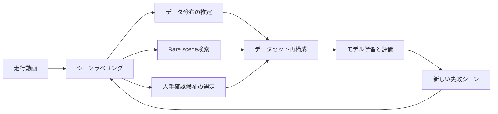
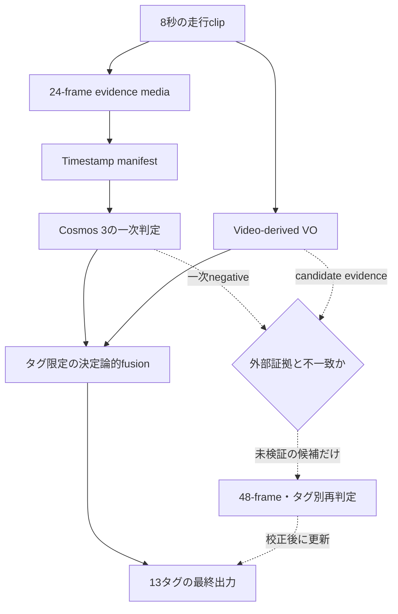
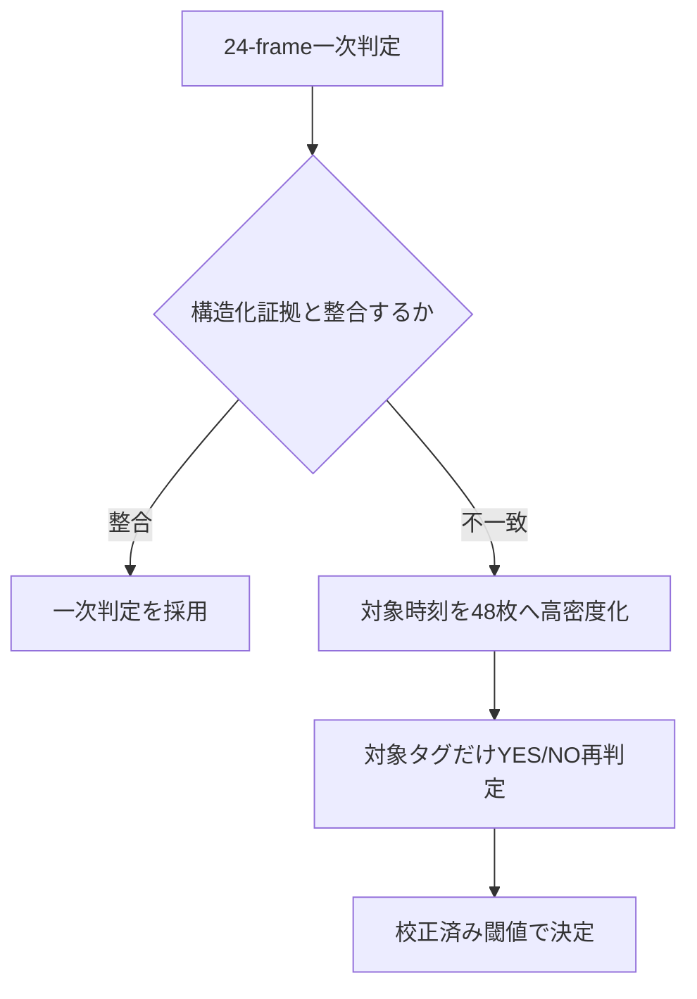

:::message
本記事は個人の技術検証をまとめたものであり、所属組織を代表するものではありません。
実験には公開データセットのみを使用しており、お客様データや非公開の走行データは含まれません。
本記事は、学会投稿用原稿「公開自動運転動画に対する視覚言語モデルを用いた時系列シーンラベリングの品質・計算費用評価」と同じ数式、実験定義、主結果を用い、その設計意図と補足分析を詳述したものです。
:::

## 論文と再現用成果物

[](https://doi.org/10.5281/zenodo.21863163)

本記事の基礎となる論文と再現用成果物は、Zenodoで恒久公開している。論文の数式、実験定義、主結果および入力artifactを参照する場合は、DOI [`10.5281/zenodo.21863163`](https://doi.org/10.5281/zenodo.21863163) を利用されたい。本記事は、この公開成果物と内容を整合させたうえで、実験の設計意図、試行錯誤、補足分析をより詳しく説明するものである。

## 概要

自動運転の研究開発では、長時間の走行動画から特定の状況を検索し、データセットの分布や不足領域を把握する必要がある。
しかし、車両や歩行者の存在を検出するだけでは、車線変更、歩行者横断、停止車両、信号状態のような時系列の意味を十分に表現できない。
本研究では、動画と言語を同時に扱うCosmos 3を用い、公開ROADデータセットから構築した8秒区間（以下、clip）に13種類のシーンラベルを付与する方法を検討した。

評価では、Cosmos 3 NanoとSuper、フレーム選択、判定プロンプト、Visual Odometry（VO：映像からカメラ運動を推定する方法）による自車運動の融合、GPU推論サーバー設定を比較した。
15本の評価用元動画から得た875 clipsでは、同じAdaptive 24-frame条件でSuperの映像判定がPrecision 81.9%、Recall 68.3%、F1 74.5%を示し、NanoのF1 68.9%を上回った。
Nano内ではUniform 24-frame条件がF1 69.4%で最良だったが、Adaptiveとの差の95%信頼区間は0を跨いだ。
Developmentで固定したVO規則をSuperの予測に適用すると、追加のGPU requestなしでF1は76.2%へ改善した。

Prompt設計は、3本のDevelopment source videoから得た169 clipsで独立に比較した。
全タグを長文化するのではなく、Developmentで選定した5タグだけに詳細な肯定条件と除外条件を与えることで、短いBaselineより高いF1を得た。
一方、タグ別には悪化もあり、全体指標の改善がすべてのタグへ一様に及ぶわけではなかった。
Hybrid CoreはEvaluationでは未実施であり、前段のSuperおよびVOのEvaluation値は従来のReasoned Promptによる。

誤り分析では、False Negativeの95.1%が、正解イベント区間から2枚以上かつ0.5秒以上を入力しても検出できない事例だった。
正解時刻を使う診断では、局所的な48-frame化によって一部の見逃しが回復した。
一方、ROI追加やYES score閾値の低下はFalse Positiveとの交換を伴った。
本研究は、品質、Recall、計算費用のトレードオフに加え、期待どおりに機能しなかった方式も報告する。

## 1. 研究背景

### 1.1 シーンラベリングの役割

走行データは、収集しただけでは学習や評価に直接利用しにくい。
たとえば「歩行者が横断した」「停止車両へ接近した」「自車が車線変更した」といった意味を検索できなければ、必要な動画を抽出するために人が大量の映像を確認することになる。
この検索単位となる意味ラベルを、本研究ではシーンラベルと呼ぶ。

シーンラベルは、教師データを作る目的だけに使われるものではない。
収集データに含まれる行動の比率を推定し、rare sceneを抽出し、人手確認の優先順位を決めるためにも利用できる。
Active learning（モデルが有益な追加データを選びながら学習する方法）では、不確かな動画や複数の証拠が矛盾する動画を優先して確認し、限られたannotation予算を難例に集中させる。



### 1.2 物体認識だけでは表せない情報

車両や歩行者を1枚の画像から検出できても、その物体が何をしているかは必ずしも分からない。
停止車両の判定には相対位置が時間的に変化しないこと、歩行者横断には人物trackが道路領域を横切ること、車線変更には自車がlane boundaryを越えて別laneへ移ることが必要になる。
したがって、シーンラベリングには物体の存在、時間変化、道路構造、行動の意味を組み合わせる必要がある。

Vision-Language Model（VLM）は、動画と自然言語の判定基準を同じ推論器に入力できる。
タグごとに個別の分類器を学習しなくても、「道路の右カーブではなく交差点で右折した場合だけpositive」といった基準をPromptとして記述できる点が利点である。
一方、入力フレームの選び方、Promptの曖昧さ、小さな対象物、複数タグの競合、GPU費用が性能を左右する。

### 1.3 本研究の位置付け

[ROAD](https://doi.org/10.1109/TPAMI.2022.3150906)は、自動運転動画にagent、action、location、ego actionを時間的に付与した公開データセットである。
[Cosmos 3](https://arxiv.org/abs/2606.02800)は、動画、画像、言語を統合して扱うOmnimodal World Modelであり、Physical AIを対象とする。
本研究は、ROADの密な時間注釈からpositive、negative、unknownを明示した評価集合を構築し、Cosmos 3の時系列シーンラベリングを評価する。
モデル品質だけでなく、入力設計とServing費用まで同時に検討する。

既存研究との包括的な性能比較は本研究の範囲外である。
外部VLM、専用のtemporal action detector、人間annotationとの直接比較を実施していないため、Cosmos 3が他方式より優れるとは主張しない。
本研究が示すのは、同一の公開GTと実行基盤のもとで、Cosmos 3内部のモデル規模、入力、Prompt、構造化証拠、Serving設定を変えたときの実測差である。

## 2. 課題設定

### 2.1 定式化

以下では、学会原稿と同一の記号体系を用いる。
8秒の走行clipを $v\in\mathcal{V}$、対象タグを $t\in\mathcal{T}$ とする。
clipから選択したframe集合を $M(v)$、各frameの元動画時刻列を $\tau(v)$、タグ定義と判定手続を $D$、VLMを $f_\theta$ とすると、映像予測は次式で表される。

$$
\hat{\mathbf{y}}(v)=f_\theta\!\left(M(v),\tau(v),D\right)
$$

$\hat{\mathbf{y}}(v)$ は13タグの二値予測である。
本研究で比較するsamplingとPromptは、それぞれ $M(v)$ と $D$ を変更する操作に対応する。
この定式化により、frame選択、timestamp表現、タグ定義、モデル規模を別の操作因子として扱える。

### 2.2 対象ラベル

8秒の前方カメラclipに対して、13タグをmulti-labelで判定した。
1本のclipには複数タグが同時に付与される。
対象タグと、判定に本来必要となる証拠を表1に示す。

表1　対象タグ、ROAD原ラベル、GT閾値、主要な判定証拠

| Index | タグ | ROAD原ラベル | Positive基準 | 判定に必要な主な証拠 |
| ---: | --- | --- | ---: | --- |
| 0 | 自車走行 | `AV-Mov` | 6 frames | 背景flow、道路方向に沿った継続移動 |
| 1 | 自車停止 | `AV-Stop` | 6 frames | 低motion状態の継続 |
| 2 | 自車左折 | `AV-TurLft` | 6 frames | 交差点、進入前後のheading変化、道路曲率との区別 |
| 3 | 自車右折 | `AV-TurRht` | 6 frames | 交差点、進入前後のheading変化、道路曲率との区別 |
| 4 | 車線変更 | `AV-MovLft`, `AV-MovRht` | 合計6 frames | lane boundary横断、変更前後のlane、道路方向との整合 |
| 5 | 車両制動 | `Car-Brake` | 6 frames | 同一車両track、brake lamp変化、減速 |
| 6 | 停止車両 | `Car-Stop` | 6 frames | 同一trackの相対速度、停止継続、駐車車両との区別 |
| 7 | 歩行者横断待ち | `Ped-Wait2X` | 6 frames | 人物track、縁石との位置関係、身体方向、待機継続 |
| 8 | 歩行者横断 | `Ped-Xing`, `Ped-XingFmLft`, `Ped-XingFmRht` | 合計6 frames | 人物trackと道路領域の交差 |
| 9 | 自転車存在 | `Cyc` | 3 frames | 小物体の外観、複数時刻での一貫性 |
| 10 | 二輪車存在 | `Mobike` | 3 frames | motorcycleとbicycleの外観差 |
| 11 | 対象信号赤 | `TL-Red` | 3 frames | 自車laneとの対応、赤色灯の視認 |
| 12 | 対象信号青 | `TL-Green` | 3 frames | 自車laneとの対応、青色灯の視認 |

この表から分かるように、タグごとに必要な証拠は異なる。
自転車や信号は空間解像度に依存しやすく、右左折や車線変更は時間的な運動と道路geometryに依存する。
そのため、すべてのタグを同じフレーム選択と同じ文量の定義で扱う設計は、必ずしも合理的ではない。

### 2.3 ROADからのGround Truth構築

Ground Truth（GT）は、評価時に正解として参照するラベルを指す。
ROAD train/validation annotation（人手注釈）から、8秒窓を8秒間隔で重複なく切り出した。
source videoの毎秒12 frames（12 FPS）のannotationに対し、通常タグは6 annotated frames以上、存在系タグである自転車、二輪車、信号は3 frames以上存在するときpositiveとした。
表1の複数原ラベルを統合する車線変更と歩行者横断では、いずれかの対応ラベルが存在するframe数を合算して閾値判定した。
対象labelが1 frameも存在しない場合をnegative、event frameが存在してもpositive基準を満たさない境界事例をunknownとした。

clip内の全frameが注釈済みであることを必須とし、unknownのclip-tag pairは評価から除外した。
この規則により、単に「positiveだけが信頼できる」検索用データではなく、True Positive、False Positive、True Negative、False Negativeを構成できる。
構築後のbenchmarkは18 source videos、1,044 clipsである。
ROADが提供する分割定義の一つである公式fold 3に基づき、Development 169 clipsとEvaluation 875 clipsへsource video単位で分離した。

表2　DevelopmentとEvaluationの分割

| 項目 | Development | Evaluation |
| --- | ---: | ---: |
| Source videos | 3 | 15 |
| 8秒clips | 169 | 875 |
| 用途 | 方式選定、閾値固定 | 固定方式の母集団評価 |

source video単位で分割したのは、同一走行の時間的に近いclipがDevelopmentとEvaluationに跨ることを避けるためである。
ただし、後述する誤り分析ではEvaluationの低Recallタグを特定しているため、「Evaluationを一度も観察していない」という意味ではない。
Hybrid Prompt自体の選定にはEvaluationを用いていないが、誤り診断から得た知見を将来の方式設計へ利用している点は区別する必要がある。

### 2.4 評価指標

主指標にはmicro F1を用い、Precision、Recall、Balanced Accuracy、Matthews Correlation Coefficient（MCC）を併記した。
micro F1は全clip-tag pairをまとめて計算するため、出現数の多いタグの影響を受けやすい。
各タグを同じ重みで平均するmacro F1とは性質が異なるため、タグ別指標も併せて確認した。
MCCはpositiveとnegativeの比率が偏る場合にも、4種類のconfusion matrix要素をまとめて評価しやすい指標である。
出力不備を見逃さないため、有効な二値出力を返した既知clip-tag pairの割合をpair coverageとして記録した。
Evaluationには11,314 known pairsと61 unknown pairsが含まれる。
unknownは品質指標の分母から除外する一方、要求したタグの欠落やparse不能な出力はnegativeへ丸めず、abstention $\bot$ としてstrict指標へ残した。
Developmentではpair coverage 99%以上を採用条件とし、coverage不足を高いF1で覆い隠せないようにした。

信頼区間はclipを独立標本として扱わず、source videoを単位として再標本化するblock bootstrapで算出した。
ただしDevelopmentは3 source videosしかないため、Development上の95%区間は有効cluster数が少なく、微小な候補差を識別する力は限定的である。
そのためHybrid Promptの候補間で差を解消できない場合は、より短いPromptを選ぶparsimony（簡潔性）の原則を採用した。

### 2.5 研究質問

本研究では、学会原稿と同じ7つの研究質問を設定した。
各質問は、単に比較項目を列挙するものではない。
実験前に抱いていた仮説と、比較時に固定する条件を対応付ける役割を持つ。

表3　研究質問と事前に定めた比較方針

| ID | 研究質問と実験前の仮説 | 操作因子と固定条件 | データと採否規則 |
| --- | --- | --- | --- |
| RQ1 | 限られたframe budgetでは、均等samplingより短時間eventへ局所高FPSを配るAdaptiveまたはMixed samplingが有利か | samplingだけを変更し、model、Prompt、24-frame budgetを固定 | Developmentで候補を比較し、Nano Evaluationではpaired CIが0を跨ぐ場合に明確な優位を主張しない |
| RQ2 | 肯定証拠、時系列検査、除外条件は、全タグ一律ではなく難しいタグへ限定した方が品質とPrompt長を両立できるか | 詳細定義を与えるタグ集合だけを変更し、169 clips、media、Super、temperatureを固定 | DevelopmentでF1、MCC、coverageを比較し、差を識別できない候補間では短いPromptを採用 |
| RQ3 | NanoからSuperへの規模拡大は、見逃しと誤検出のどちらを主に減らし、追加EC2費用に見合うか | 同じEvaluation clips、media、Reasoned Promptを固定 | 875 clipsの母集団評価として、Precision、Recall、F1、MCC、定常GPU費用を併記 |
| RQ4 | continuous batching、Chunked Prefill、MM/prefix cache、request分割は、throughput、tail latency、Prefill、Decode、費用へどう作用するか | 少数clipのmediaとPromptを固定し、Serving設定だけを変更 | failure、parse error、preemptionをgateとし、主要Nano条件はPod再作成後に3回反復 |
| RQ5 | 映像だけでは曖昧な自車運動を公開軌跡またはVOで補助すると品質が上がるか。自然言語contextとタグ限定の決定論的fusionでは、どちらが安定するか | 映像baselineを固定し、contextの渡し方とfusion規則だけを変更 | DevelopmentでF1、MCC、BAが改善し、改善pair数が悪化pair数以上の規則だけを固定してEvaluationへ適用 |
| RQ6 | event時刻を既に含むFalse Negativeは、48-frame化、ROI、track、タグ別YES scoreのどの段階で回復するか | 同じ24難例と対象タグを固定し、時間密度、空間表現、構造化証拠、decision形式を順に変更 | GTを使う上限診断としてFN回復、TP維持、negative-control FPを報告し、母集団性能とは扱わない |
| RQ7 | 生成ラベルは個別clipの分類だけでなく、データ分布推定と希少sceneの人手確認順序付けに利用できるか | Evaluation GTと固定予測を用い、学習や閾値調整は行わない | prevalence誤差と人手確認候補の濃縮率を評価し、downstream再学習効果とは区別 |

RQ1ではmodelとServing、RQ2ではmediaとmodel、RQ4ではmediaとPrompt、RQ5では映像baselineを固定した。
複数の要因を同時に変えると、結果が改善しても原因を特定できないためである。
品質表のFull Run費用と、少数clipのcontrolled serving sweepは実行範囲やrequest順が異なるため、同じ表内で直接比較しない。

## 3. 提案手法

### 3.1 階層型ラベリングパイプライン

提案の中心は、VLMだけに全責務を持たせず、映像の意味判断と構造化した運動証拠を分離する点にある。
Evaluationで実証した構成は、24-frame evidence media、Reasoned Prompt、Cosmos 3 Super、固定VO priorの4要素から成る。
48-frame再判定とタグ別scoreは診断段階であり、Evaluation済みの最終方式には含めない。



この構成では、Cosmos 3が物体と行動の意味を判断し、VOが自車の走行、停止、旋回を補助する。
VOの数値を自然言語として全タグのPromptへ挿入すると、歩行者や信号など無関係なタグまで変動した。
そこで、構造化証拠が関係するタグだけを決定論的に更新し、他タグはVLMの予測を保持した。

実装上のデータ契約を表4に示す。
ここでは、Evaluationまで実証済みの経路と、DevelopmentまたはOracle診断に留まるextensionを分けている。

表4　1 clipを処理する際のデータ契約

| 段階 | 入力 | 出力 | 実証水準 |
| --- | --- | --- | --- |
| Evidence生成 | 8秒のROAD動画、sampling config | 24枚を連結したmedia、元動画timestamp列、media SHA | Evaluation済み |
| 一次VLM判定 | media、timestamp manifest、13タグ定義 | `FINAL_POSITIVE_INDICES`、request・stage latency、cache統計 | Evaluation済み |
| VO前処理 | 元の8秒動画 | median flow、low-motion率、累積visual yaw、quality flag | Evaluation済み |
| タグ限定fusion | 一次hard label、VO特徴、Development固定規則 | 13タグの最終hard label | Evaluation済み |
| 候補routing | 一次negative、detector/tracker/lane/VOのcandidate score | 再判定対象となるclip-tag pair | 設計のみ。Full Run未実施 |
| 48-frame再判定 | 候補時刻の高密度media、対象タグ定義 | タグ別YES/NO未校正score | GT OracleによるDevelopment診断のみ |

この責務分離により、VLMの意味推論、動画前処理、decision rule、Serving計測を個別に置換できる。
また、再現時にはmediaとPromptだけでなく、どの段階の出力を次段へ渡したかをSHAで追跡できる。

### 3.2 Evidence mediaとtimestamp

元動画をそのまま渡すのではなく、8秒clipから代表frameを選択し、固定枚数のevidence mediaを生成した。
各frameには元動画上の秒数を対応付け、Promptへtimestamp manifestとして入力した。
これによりモデルは、画像配列上の順番だけでなく、イベントの継続時間や前後関係を解釈できる。
選択frameは元解像度を維持してPNGへ一時展開し、4 FPS再生のH.264/MP4へ連結した。
実装artifactでは符号化条件を`libx264`、CRF 18、`yuv420p`へ固定し、sampling間でcontainerや再生速度が変わらないようにした。
これは学会原稿の主表には含めていない、本記事で補足する再現用の実装条件である。

```text
FRAME 01: t=0.00 s
FRAME 02: t=0.35 s
...
FRAME 24: t=7.96 s
```

比較した主なsamplingは次の三つである。

- Uniform: clip全体を3 FPS相当で走査し、均等な24 timestampsを選ぶ
- Adaptive: 4 FPSでmotionを解析し、全域1 FPS、peak前後2秒を2 FPS、中心前後1秒を4 FPSで構成する
- Mixed sampling（論文中のHybrid sampling）: 全域2 FPSを維持し、8 FPS解析で選んだ1 peakの前後1秒、特に中心前後0.5秒を補強する

高FPS frameは単純に追加せず、固定frame budget内で低優先frameと置換した。
これは品質改善とPrefill（動画とPromptを最初に読み込む処理）の費用を分離するためである。
motion peakにはcamera vibration、道路のカーブ、近接物体の通過も含まれるため、motion量が大きい時刻を意味イベントの時刻と同一視しない。

Adaptiveではframe差分とoptical flowからmotion scoreを作り、2秒のnon-maximum suppression（NMS：近接する候補のうち強い候補だけを残す処理）でpeakを統合した。
採用するpeakは最大2箇所であり、24枚を超える場合は局所frameを追加し続けず、優先度の低い全域frameと置換した。
Mixed samplingではpeakを1箇所に限定した。
したがって三方式の比較は、frame数を増やす比較ではなく、同じ24枚を時間軸上のどこへ配分するかという比較である。

### 3.3 Reasoned Prompt

Reasoned Promptは、タグごとの肯定証拠、時間変化、反証を照合する順序を入力契約として明示する方式である。
長い思考過程を外部へ出力させるChain-of-Thoughtではない。
モデル内部で確認すべき順序を指定し、最終出力はpositive tagのindexだけに限定する。
出力を短く保つことで、自由記述によるparse failureとDecode費用を抑えた。

```text
1. Observe all frames in timestamp order.
2. Track the same actor across time.
3. Check the positive evidence for each tag.
4. Check the rejection criteria and competing labels.
5. Return only FINAL_POSITIVE_INDICES: [...]
```

Baseline Promptでは、各タグを1文程度で定義した。
詳細版では、追跡対象、肯定証拠、時間変化、類似行動との区別、negative条件を明示した。
タグ $t$ の詳細定義は、学会原稿と同じく次の5要素で表す。

$$
D_t=(m_t,o_t,e_t,\Delta_t,r_t)
$$

ここで $m_t$ はタグの意味、$o_t$ は追跡対象、$e_t$ はpositiveを支持する視覚証拠、$\Delta_t$ は複数timestamp間で確認すべき変化、$r_t$ は類似事象を除外する反証である。
たとえば車線変更では、道路の右左折やカメラ運動ではなく、同じ道路上で隣接laneへ移ることを要求した。

```text
Tag: ego lane change
Positive evidence:
- Identify lane boundaries before and after the maneuver.
- Verify that the ego vehicle crosses a boundary into an adjacent lane.
- Confirm that the road direction remains approximately continuous.

Reject when:
- The apparent lateral motion is caused only by road curvature.
- The ego vehicle turns at an intersection.
- Lane boundaries are not visible enough to establish a lane transfer.
```

全13タグを詳細化すると、Prompt criteriaは213語から1,273語へ増えた。
この長文化はRecallを改善する一方で、生成途中の状態を保持するKV cacheを圧迫し、Prefillを増やした。
また、詳細化はすべてのタグに有効ではなかった。
そこで、Developmentで詳細化対象を限定したHybrid Promptを比較した。

### 3.4 Hybrid Core Prompt

Hybrid Core Promptは、次の5タグだけに詳細なReasoning基準を適用し、残り8タグは短い定義を維持する。

- 自車左折
- 車線変更
- 停止車両
- 歩行者横断待ち
- 二輪車存在

この5タグはDevelopment上の既存誤りとPrompt ablationから選んだ。
ただし選択されたタグがすべて改善したわけではなく、車線変更はF1 60.0%から33.3%へ悪化した。
Hybrid Coreの採用はmicro F1全体とPromptの簡潔性に基づくものであり、タグごとの単調改善を保証するものではない。

### 3.5 1 requestでのmulti-label出力

通常条件では13タグを1 requestで判定した。
タグを複数groupに分割すると、同一mediaのmultimodal cacheと共通Prompt prefixは再利用できたが、request数、scheduler overhead、Decodeが増えた。
したがって、cache hit率を高めること自体を目的にrequestを分割しない。

```text
FINAL_POSITIVE_INDICES: [0, 6, 11]
```

出力上限は短く設定し、説明文を生成させない。
最大出力は学会原稿と同じ64 tokensとした。
必要な理由はPrompt内で内部確認させ、外部へ返すのは機械処理可能なindex列だけとした。
この例は、自車走行、停止車両、対象信号赤をpositiveとしたことを意味する。
indexとタグの対応は表1で固定し、Prompt config、parser、評価器が同じ順序を参照する。
配列に含まれないindexはnegativeであるが、配列自体をparseできない場合や要求したタグを返していない場合はabstentionとして区別する。

### 3.6 Visual Odometryによる決定論的fusion

Visual Odometry（VO）は、動画内の静的背景featureを追跡し、カメラ運動を推定する方法である。
本研究では、元動画を5 frames間隔、幅480 pxへ縮小して走査した。
空や道路中央の移動物体へ特徴点が偏らないよう、背景寄りの領域から最大800個のShi--Tomasi特徴点を抽出し、Lucas--Kanade法で前後方向に追跡した。
forward--backward誤差1.5 px以下かつ20 tracks以上を有効なframe pairとし、median visual flow、0.8 px未満のlow-motion pair率、Essential MatrixのRANSAC inlier率、累積visual yawをclip単位へ要約した。
yawはinlier率0.25以上のpairだけを集計し、全pairの50%以上が有効なclipだけをfusion対象とした。

公開OPR（OpenPlaceRecognition）派生データは、Oxford RobotCar走行からplace recognition研究向けに作成された公開データである。
このデータに含まれる粗いRTK-GNSS軌跡は、VOの同期と妥当性を監査する補助資料として用いた。
RTKはReal-Time Kinematic測位を指し、通常のGNSSより高精度な位置軌跡を得る技術である。
run artifactで確認した公開軌跡は約20 m間隔であり、瞬間的な制動や細かな操舵を直接表すものではない。
この間隔は学会原稿の主表ではなく、本記事で補足する入力監査値である。
このため、RTK方位を右左折の正解として使用せず、最終fusionにはROAD動画だけから再計算できるVO特徴を用いた。
OPR画像とROAD frameはperceptual hashで対応付けた。
perceptual hashは、画素が完全一致しなくても見た目が近い画像に近いhashを与える画像照合方法である。
複数anchor間の時刻は区分線形補間した。
frame coverage 70%以上、かつleave-one-anchor-out時刻誤差P95が2秒以下の走行だけを採用し、Evaluationでは341 clips、6 source videosを覆った。
video-derived VO自体はEvaluationの875 clips、15 source videosへ同一条件で適用した。

Developmentで規則と閾値を固定し、Evaluationでは変更しなかった。
最終的に非identityの更新を採用したのは自車走行、自車停止、自車左折の3タグである。
右折、車線変更、Map contextも試したが、Developmentで改善しないか悪化したためVLM予測を保持した。

VO特徴を $\mathbf{z}(v)$、Developmentで固定したタグ別規則と閾値を $g_t(\cdot;\phi_t)$ とすると、fusion後の予測は学会原稿と同じ次式で定義する。

$$
\tilde{y}_t(v)=g_t\!\left(\hat{y}_t(v),\mathbf{z}(v);\phi_t\right)
$$

規則を持たないタグでは $\tilde{y}_t(v)=\hat{y}_t(v)$ とする。
すなわち、VOを13タグ全体の分類器として使うのではなく、自車運動と直接関係するタグにだけpromotionまたはvetoを適用する。
Developmentで最終的に固定した規則を表5に示す。

表5　Developmentで固定したVO motion prior規則

| 対象タグ | 映像予測を変更する条件 |
| --- | --- |
| 自車走行 | `no→yes`: median flowが0.50 px以上かつlow-motion率が0.75以下。`yes→no`: flowが0.05 px以下かつlow-motion率が0.50以上 |
| 自車停止 | `no→yes`: flowが0.05 px以下、またはlow-motion率が0.10以上。`yes→no`: flowが1.00 px以上かつlow-motion率が0.05以下 |
| 自車左折 | Superの`yes`を維持するのは、累積visual yawが正方向へ3.0度以上の場合だけ |

fusionは、VLMの二値出力であるhard labelとVO規則を組み合わせる。
Superのタグ別log probabilityや校正済みconfidenceは用いていない。
したがって、VLMが弱い確信で出したpositiveと強い確信で出したpositiveを区別できない点は、現方式の限界である。

### 3.7 選択的48-frame再判定

48-frame再判定は、Evaluationで検証済みの提案手法ではなく、Recall改善の可能性を測るOracle診断である。
Oracle診断とは、通常の推論時には利用できない正解時刻や正解boxを使い、改善可能性の上限を測る実験を指す。
GT event時刻を使って対象周辺を高密度化したため、そのまま実運用へ適用できない。
本番ではdetector、tracker、lane推定、VOなどがVLMのnegativeと矛盾する候補を検出し、GT時刻を近似する必要がある。

論文では、外部証拠がタグ $t$ を支持し、一次予測がnegativeである場合だけ再判定するrouting変数を次式で定義した。

$$
q_t(v)=\mathbb{1}\!\left[\hat y_t(v)=0\ \land\ c_t(v)\ge\gamma_t\right]
$$

ここで $c_t(v)$ はタグ固有のcandidate score、$\gamma_t$ はDevelopmentで固定する閾値である。
$q_t(v)=1$ の場合だけ、候補時刻の前後を8 FPS相当で密にした48-frame evidence $M_{48,t}(v)$ を作る。
本研究ではこのproduction候補生成器をFull Runしておらず、後述するGT Oracle診断によって到達可能性だけを測った。

タグ別YES/NO passでは、最初の意味tokenに対するlog probability $\ell_{\mathrm{YES}}$ と $\ell_{\mathrm{NO}}$ から、学会原稿と同じ未校正scoreを求める。

$$
s_t(v)=\frac{\exp \ell_{\mathrm{YES}}}
{\exp \ell_{\mathrm{YES}}+\exp \ell_{\mathrm{NO}}}
$$

$s_t(v)$ は校正済み確率ではなく、YESとNOの相対的な未校正scoreである。
実運用で用いるには、診断集合とは独立したcalibration setでタグ別閾値を固定する必要がある。

診断では、通常の24枚、GT event周辺へ再配置した24枚、同周辺を48枚へ増やした条件、Region of Interest（ROI：注目領域）mosaic、匿名track summaryを比較した。
この結果は、どの追加証拠がRecall改善の上限を持つかを調べるために用い、875 clipsの母集団性能とは別に報告する。

## 4. 実験設定

### 4.1 証拠水準の分離

本研究では、数値の役割を三つに分けた。
同じF1であっても、Evaluation、Development、難例診断の値は意味が異なる。

表6　実験結果の証拠水準

| 水準 | データ | 用途 | 主張できること |
| --- | --- | --- | --- |
| Population evaluation | 875 clips、15 videos | 固定方式の最終品質 | 評価母集団における品質と費用 |
| Development selection | 169 clips、3 videos | Prompt、sampling、規則の選定 | 候補比較と方式固定 |
| Oracle診断 | 24 selected clips | FN原因の上限診断 | 時間密度、ROI、scoreの回復可能性 |

Developmentの最高値をEvaluation性能として記載せず、Oracle診断のPrecisionやRecallを母集団指標として扱わない。
また、異なるrun条件で得た数値を加算しない。
たとえばHybrid CoreのF1 75.6%とVO fusionのEvaluation F1 76.2%から、両者を組み合わせた性能を推定することはできない。

### 4.2 モデルと推論条件

比較対象はCosmos 3 NanoとSuperである。
temperatureは0、通常出力はpositive indexのみ、入力は同一の8秒clipとtimestamp manifestを用いた。
モデル比較では同じEvaluation 875 clipsを使用した。

Nanoはg6e.2xlargeの1 GPU、Superはg6.24xlargeの4 GPU tensor parallelで実行した。
このinstanceは4 GPU間がPCIe-onlyであり、vLLM custom all-reduceではなくNCCL fallbackを用いた。
したがって、NVLinkまたはNVSwitchを備える構成におけるSuperの上限性能を測ったものではない。

Full Runで記録したmodel IDは`nvidia/Cosmos3-Nano`および`nvidia/Cosmos3-Super`、vLLMは0.25.0である。
両者は同一のcontainer image
`vllm/vllm-omni:cosmos3@sha256:6d2630c7d637b699557573f2c3fee8df5d4d0cd718977aa22549ed6a6ef30587`
で実行した。
Superはtensor parallel 4、`max-model-len=16384`、`max-num-batched-tokens=8192`、Chunked Prefill有効、GPU memory utilization 0.85とした。
Nanoはtensor parallel 1、`max-model-len=32768`である。
いずれも明示的なquantizationまたは`dtype`指定は行っていない。

### 4.3 段階的実験設計と採用基準

実験は、Smoke、Development、Evaluationの三段階で進めた。
この順序は、Superの高い実行費用を抑えるためだけではない。
少数例で見つけた方式を、そのまま母集団性能として扱うことと、Evaluationを見ながら方式を調整することを避けるためである。

Smokeでは、request failure、parse failure、preemption、明らかな品質劣化を確認した。
ここでの目的は方式の成立性を確かめることであり、少数clipのF1を最終品質として報告することではない。
不安定な候補や、入力を増やしただけで品質が悪化する候補はDevelopmentへ進めなかった。

Developmentでは、pair coverage 99%以上を必須とし、micro F1、MCC、Balanced Accuracyを主に、Prompt長、latency、費用を副に見て候補を絞った。
複雑な方式は単純baselineを上回る場合だけ残した。
候補差をsource-video block bootstrapで識別できない場合は、短く実装しやすい方式を選んだ。
Hybrid TemporalではなくHybrid Coreを採用したのは、この規則による。

Evaluationでは、条件、閾値、Promptを再調整しなかった。
paired差の信頼区間が0を跨ぐ場合は、点推定値が高くても明確な改善とは主張しない。
追加VLM passは、対象タグの改善が追加費用と誤変更を上回る場合に限って採用し、無関係なタグの揺らぎが支配する条件は棄却した。

この採用ゲートによって、実験の複雑さを増やすこと自体を目的にしなかった。
後述する車線変更専用pass、Map付きpass、ROI mosaicは、技術的には実行できても採用基準を満たさなかったため最終構成から外れている。

### 4.4 費用算定

GPU費用は、実測したrun wall timeとOn-Demand instance単価から1,000 clips当たりへ換算した。
instanceの1時間当たり単価を $p$、clip当たりwall timeを $t$ 秒とすると、定常状態のEC2費用を学会原稿と同じ次式で算出する。

$$
C_{1000}=p\frac{t}{3600}\times 1000
$$

Full Runの費用はモデル品質表に、controlled serving sweepの費用はServing設定比較にのみ用いる。
両者はclip集合、request順、cache状態が異なるため、絶対値を横断して比較しない。

換算に用いたOn-Demand単価は、us-west-2におけるg6e.2xlargeのUSD 2.24208/hとg6.24xlargeのUSD 6.6752/hである。
費用には、EKS control plane、storage、network、model startup、idle time、CPU前処理を含めない。
VO fusionは追加GPU requestを必要としないが、CPU上のfeature tracking費用は未計測である。
したがって、この費用はrequestが継続して供給される定常状態のEC2下限であり、「同じGPU推論費用」は「総システム費用が完全に同じ」という意味ではない。

### 4.5 再現性

各runでは、model ID、container digest、vLLM command、instance type、Prompt config、sampling config、media lock、入力timestamp、出力JSONL、GPU telemetry、stage latency、cache hit率を保存した。
入力と成果物にはSHA-256を記録し、同じ設定から再生成できるようにした。
論文、入力artifact、再現用CLIは[再現用リポジトリ](https://github.com/riita10069/cosmos3-reasoner-nim-endpoint-terraform)で管理している。
モデルweightやROAD動画そのものは各配布元の利用条件に従い、run artifactには設定、hash、派生manifest、集計結果を記録した。

主要runが記録した基準commitは`2c4c5e53cb9ba59ab253f2bb0647d05c7054e0b8`である。
ただし実験時worktreeはdirtyであり、変更内容そのものはcommit SHAだけでは再現できない。
そのため、実際の再現契約はcommit SHA単独ではなく、container digest、Prompt・sampling config SHA、dataset/media lock SHA、vLLM command、結果artifact SHAの組で管理した。
また、model IDは保存したが、model registry側のweight revisionまたはweight SHAを独立には固定していない。
したがって、第三者が将来同じmodel IDを取得した場合のweight同一性まで保証するものではなく、これは本実験の再現性上の制約である。

比較では、可能な限り一つの因子だけを変更した。
Prompt比較ではmediaをhard linkで共有し、sampling比較ではPromptとmodelを固定した。
複雑な方式は、少数clipで成立性を確認するSmoke testを行い、Developmentで単純baselineを上回った場合だけ次段階へ進めた。

### 4.6 論文主表と補足集計の区別

本記事は論文より詳細な説明を目的とするため、論文本文の主表に加えて、同じSHA固定run artifactから再集計した内訳も示す。
表10のHybrid Coreタグ別差、表11のMacro F1、表12のタグ別Recall、VO fusionのタグ別変化、車線変更専用passのpair内訳、Rare sceneの順位規則は論文非掲載の補足集計である。
これらは新しい実験結果を学会原稿の結果へ合成したものではなく、同一runまたはDevelopment実験の内訳である。
論文の母集団主張は、Evaluation、Development、Oracle診断を分離した表6の証拠水準に従う。

補足集計の規則も固定した。
Macro F1は、13タグそれぞれのF1を算出し、当該指標が定義できるタグだけを単純平均した値である。
Rare sceneはEvaluationでGT prevalenceが10%以下かつpositiveが1件以上あるタグから構成し、各clipの順位scoreを「予測positiveとなったrare tag数」とした。
確認件数は875 clipsの1%、5%、10%、20%をそれぞれ切り上げ、同点順位はseed 20260808で1,000回無作為化して平均と95%区間を算出した。
表10は変化の大きいタグだけを選ばず、13タグをすべて掲載する。

## 5. 結果

### 5.1 RQ1: Samplingの影響

Development 169 clipsで、Adaptive、Mixed sampling（論文中のHybrid sampling）、Uniformの24-frame条件を比較した。
Reasoned Promptと他の入力条件を固定した結果を表7に示す。

表7　Developmentにおけるフレーム選択の比較

| Sampling | Precision | Recall | F1 | MCC |
| --- | ---: | ---: | ---: | ---: |
| Adaptive 24枚 | 73.3% | 67.3% | 70.2% | 0.609 |
| Mixed sampling 24枚 | 72.1% | 68.6% | 70.3% | 0.608 |
| Uniform 24枚 | 74.1% | 68.4% | 71.1% | 0.621 |

DevelopmentではUniformが最良だった。
motion peakへframeを集中させるAdaptiveが優位でなかった理由は、画面全体のmotionが意味イベントの発生時刻と一致しないためだと考えられる。
道路の曲率、camera vibration、近接物体もmotion scoreを大きくする。

Evaluationでは、Nano AdaptiveのF1 68.9%に対してNano Uniformは69.4%だった。
paired差は+0.5ポイントであったが、95%区間は-0.2から+1.2ポイントで0を跨いだ。
したがって、Uniformは実装の単純さと計算量の予測可能性を持つが、Evaluationで明確な品質優位を示したとはいえない。

SuperのFull Runは、このNano Uniform比較が確定する前にAdaptive 24枚で実施していた。
Nano上でSampling差を明確に識別できず、Superの追加Full Runは高価であることから、Super Uniformは実行していない。
したがって、後述するSuper Adaptiveは「AdaptiveがSuperでも最良だった」ことを示す条件ではなく、固定済みprofileで得られた母集団評価である。

品質差の原因を確認するため、GT event区間と選択timestampの関係も測定した。
表8の`any`はevent内に1枚以上、`2 frames`は2枚以上、`span`はevent内で0.5秒以上の時間幅、`context`はevent開始前と終了後の双方を含む割合である。
この集計にGT時刻は用いるが、frame選択そのものには用いていない。

表8　DevelopmentにおけるSampling coverage

| Sampling | 平均frames | Any | 2 frames | Span | Context |
| --- | ---: | ---: | ---: | ---: | ---: |
| Adaptive 24枚 | 23.3 | 100.0% | 97.4% | 96.1% | 100.0% |
| Mixed sampling 24枚 | 23.2 | 100.0% | 98.9% | 97.1% | 100.0% |
| Uniform 24枚 | 24.0 | 99.8% | 98.9% | 97.1% | 89.2% |

Mixed samplingは複数frameとevent内span、Adaptiveはevent前後contextを多く保持したが、表7のF1ではUniformが最良だった。
したがって、GT eventを機械的に多く含めることと、VLMがその意味を正しく判定することは同義ではない。
この結果は、motion peakへframeを寄せるだけでなく、clip全域の文脈を維持する必要性を示している。
表8のAdaptive行は`adaptive 24-reasoned-v2`のsampling auditから取得した。
Promptはframe timestampの選択を変えないため、ここでは同じAdaptive sampling系列のcoverageとして扱っている。

### 5.2 初期Prompt ablation

初期のDevelopment ablation（要因比較）では、timestampだけを与える短いPromptと、判定順序を明示したReasoned Promptを比較した。
2 FPSと4 FPSのtimestamp-only条件はF1 41.5%と47.0%、Adaptive timestamp-onlyは45.8%、Reasoned Promptは70.2%だった。
frame数の変更より、タグの肯定条件と除外条件を確認する手順の方が大きな差を示した。
ただし、この比較には「同一Promptからtimestamp表記だけを除く」独立条件がない。
したがって、timestamp自体の単独効果ではなく、比較した入力契約の中でReasoned手順が支配的だった、と解釈する。

このablationと後述するHybrid Prompt選定は、同一の連続runではない。
実行時期、Prompt世代、Serving状態が異なるため、70.2%から75.6%までを単一の段階的改善量として扱わない。
初期ablationは「Reasoning手順の有無」、Hybrid選定は「詳細定義をどのタグへ適用するか」を調べた独立実験である。

### 5.3 RQ2: Hybrid Promptの選定

同一Development 169 clips、同一Super、同一24-frame media、temperature 0で、Baseline、全タグContrastive、三つのHybrid候補を比較した。
三つのHybrid候補は同じrun内でランダムに混在させ、request順序の偏りを抑えた。

表9　DevelopmentにおけるHybrid Prompt候補の比較

| Prompt | Criteria語数 | 詳細化タグ数 | Precision | Recall | F1 | MCC |
| --- | ---: | ---: | ---: | ---: | ---: | ---: |
| Baseline | 213 | 0 | 86.2% | 62.1% | 72.2% | 0.663 |
| Full Contrastive | 1,273 | 13 | 85.6% | 65.8% | 74.4% | 0.683 |
| Hybrid Core | 603 | 5 | 85.6% | 67.6% | 75.6% | 0.695 |
| Hybrid Temporal | 778 | 7 | 85.8% | 67.8% | 75.8% | 0.697 |
| Hybrid F1-selected | 850 | 8 | 84.9% | 66.4% | 74.5% | 0.682 |

数値上はHybrid Temporalが最良だった。
しかし、Hybrid Coreとの差は+0.21ポイントで、source-video block bootstrapの95%区間は-0.45から+0.63ポイントだった。
3 source videosのDevelopmentでは両者の差を解消できなかったため、criteriaが22.5%短いHybrid Coreを簡潔性の原則で固定した。

Hybrid CoreはBaselineに対してmicro F1を+3.34ポイント改善した。
一方、タグ別F1は均一には改善していない。
13タグすべての変化を表10に示す。
表10は論文のPrompt選定runから再集計した、論文非掲載のタグ別内訳である。

表10　Hybrid Coreによるタグ別F1の変化

| タグ | GT positive | Baseline F1 | Hybrid Core F1 | 差 |
| --- | ---: | ---: | ---: | ---: |
| 自車左折 | 13 | 56.4% | 72.2% | +15.8 |
| 車両制動 | 57 | 57.1% | 70.5% | +13.4 |
| 歩行者横断待ち | 16 | 9.1% | 20.0% | +10.9 |
| 二輪車存在 | 9 | 88.9% | 94.1% | +5.2 |
| 自車走行 | 142 | 85.9% | 90.8% | +4.8 |
| 対象信号青 | 33 | 77.8% | 82.1% | +4.4 |
| 自車停止 | 53 | 88.0% | 90.9% | +2.9 |
| 停止車両 | 76 | 55.6% | 58.4% | +2.8 |
| 自車右折 | 8 | 59.3% | 59.3% | 0.0 |
| 対象信号赤 | 26 | 75.6% | 72.7% | -2.8 |
| 自転車存在 | 82 | 74.2% | 70.9% | -3.4 |
| 歩行者横断 | 25 | 63.4% | 50.0% | -13.4 |
| 車線変更 | 4 | 60.0% | 33.3% | -26.7 |

車両制動や自車走行は詳細化対象ではないが、同一multi-label request内の判断順序やタグ間相互作用が変化した影響によって改善した可能性がある。
本実験はこの要因だけを分離していないため、詳細化された5タグからの因果的な波及効果とは断定しない。
逆に、詳細化対象である車線変更はpositiveがDevelopmentに4件しかなく、1件の変化がF1を大きく動かした。
この結果は、micro F1に基づくPrompt選定がrare tagの性能を保証しないことを示している。
将来はmacro指標とタグ別最低性能を選定制約へ追加する必要がある。

### 5.4 RQ3: NanoとSuperのEvaluation品質

固定したEvaluation 875 clipsに対するFull Run結果を表11に示す。
Hybrid CoreはまだEvaluation Full Runを実施していないため、この表のSuperは従来のReasoned Promptを用いる。

表11　Evaluation Full Runの品質と定常GPU推論費用

| モデルと入力 | Coverage | Precision | Recall | Micro F1 | Macro F1 | Accuracy | MCC | GPU費用 / 1,000 clips |
| --- | ---: | ---: | ---: | ---: | ---: | ---: | ---: | ---: |
| Nano / Adaptive 24枚 | 100% | 71.3% | 66.7% | 68.9% | 58.2% | 85.6% | 0.596 | USD 0.66 |
| Nano / Uniform 24枚 | 100% | 73.4% | 65.9% | 69.4% | 58.2% | 86.1% | 0.606 | USD 0.69 |
| Super / Adaptive 24枚 | 100% | 81.9% | 68.3% | 74.5% | 62.5% | 88.8% | 0.678 | USD 13.48 |

本評価内では、SuperがNanoより高いPrecisionとF1を示した。
改善幅はRecallよりPrecisionで大きく、予測positiveに占めるFalse Positiveの割合がNanoより低かった。
fine-tuningなしで13タグのF1 74.5%を得たことは、公開ROAD上での利用可能性を検討する根拠となる。
全条件のCoverageは100%であり、差は出力欠落ではなく判定内容に由来する。
Macro F1もSuperが高いが、Micro F1との差から、出現頻度の低い難しいタグでは全体値ほど高くないことが分かる。
表11のMacro F1は、学会原稿のFull Runと同一artifactから再集計した補足値である。

費用差は大きく、SuperはNano Adaptiveの約20倍だった。
したがって、大量データの一次処理にはNano、誤検出を抑えたい高品質処理にはSuperという異なる運用点が成立する。

### 5.5 タグ別のSuper性能

Superの全体F1は74.5%だが、タグ別には大きな差がある。
13タグすべての結果を表12に示す。
表12のF1は論文主表と同一であり、RecallとGT positive数は同じEvaluation artifactから再集計した補足値である。

表12　Superのタグ別Precision、Recall、F1

| タグ | GT positive | Precision | Recall | F1 |
| --- | ---: | ---: | ---: | ---: |
| 車両制動 | 152 | 48.6% | 66.4% | 56.1% |
| 停止車両 | 272 | 69.8% | 33.1% | 44.9% |
| 自転車存在 | 432 | 97.5% | 72.5% | 83.1% |
| 車線変更 | 20 | 15.0% | 15.0% | 15.0% |
| 自車走行 | 701 | 99.4% | 88.2% | 93.4% |
| 自車停止 | 264 | 95.0% | 86.7% | 90.7% |
| 自車左折 | 61 | 46.0% | 85.2% | 59.8% |
| 自車右折 | 59 | 45.3% | 72.9% | 55.8% |
| 歩行者横断待ち | 123 | 32.3% | 25.2% | 28.3% |
| 歩行者横断 | 205 | 91.8% | 32.7% | 48.2% |
| 二輪車存在 | 34 | 77.8% | 82.4% | 80.0% |
| 対象信号赤 | 226 | 88.9% | 78.3% | 83.3% |
| 対象信号青 | 163 | 93.4% | 60.7% | 73.6% |

自車走行と停止は比較的安定している。
一方、車線変更、歩行者行動、停止車両はRecallが低い。
これらは単一frameの外観だけでは決められず、同一track、道路領域、lane boundary、相対速度を復元する必要がある。

右左折はRecallが比較的高いがF1が低く、False Positiveが多い。
道路の曲率と交差点での旋回を区別できないことが一因である。
この違いから、低F1を一律に「見逃し」として扱わず、タグごとにFalse PositiveとFalse Negativeの構造を分ける必要がある。

### 5.6 RQ5: VO fusionのEvaluation結果

Superの映像予測に固定VO priorを適用した結果を表13に示す。
この規則はDevelopmentで固定し、Evaluationでは変更していない。

表13　Super映像予測と固定VO priorの比較

| 方式 | Precision | Recall | F1 | MCC | 追加GPU request |
| --- | ---: | ---: | ---: | ---: | ---: |
| Super映像のみ | 81.9% | 68.3% | 74.5% | 0.678 | なし |
| Super + 固定VO prior | 82.8% | 70.5% | 76.2% | 0.698 | なし |

F1差は+1.7ポイントで、source-video block bootstrapの95%区間は+1.3から+2.2ポイントだった。
90 clip-tag pairsが正しくなり、16 pairsが悪化した。
15 Evaluation videosのうち14 videosでF1が改善し、1 videoは同値だった。

改善はVO規則を適用した3タグに集中した。
自車走行はF1 93.4%から95.8%へ、自車停止は90.7%から96.4%へ、自車左折は59.8%から64.5%へ改善した。
改善pair数と悪化pair数は、それぞれ37/7、34/6、19/3である。
これらのタグ別値と動画別内訳は、表13と同じEvaluation run artifactから再集計した論文非掲載の補足値である。
したがって、全体F1 76.2%は、既に比較的高性能だった自車走行と停止、およびFalse Positiveの多かった左折を補正した結果であり、車線変更、歩行者行動、停止車両の低Recallを直接解決した値ではない。

この改善は、VLMへmotion情報を再質問して得たものではない。
自然言語contextを追加すると無関係なタグも変動したため、VO evidenceが関係するタグだけを更新した。
意味判断をVLM、低次の運動計測をVOへ分担した設計は、追加requestなしで観測された改善と整合する。

## 6. 誤り分析

### 6.1 RQ6: False Negativeはsampling missか

Super Full RunのFalse Negative 861件を、GT event区間と入力timestampの関係から三つに分類した。

- Miss: event区間内のframeが0枚
- Sparse: eventは含むが、2枚未満または0.5秒未満
- Covered: 2枚以上かつ0.5秒以上を含む

分類結果を表14に示す。

表14　SuperのFalse Negativeと時間的coverage

| 分類 | 件数 | 割合 |
| --- | ---: | ---: |
| Miss | 1 | 0.1% |
| Sparse | 41 | 4.8% |
| Covered | 819 | 95.1% |

完全な時刻取り逃しは1件だけだった。
この結果から直接いえるのは、イベント時間帯を完全に取り逃したことが主要因ではない、という点までである。
Coveredの基準は2枚以上かつ0.5秒以上という粗い条件であり、時系列判断に十分な密度を保証しない。
さらに、GT positiveの通常タグも6 annotated frames以上を条件としているため、Covered率の高さにはGT構築規則と24-frame samplingの組み合わせが影響する。

したがって、Coveredを「時間情報は十分」と解釈してはならない。
後述するOracle診断では、Coveredに分類されたFNでも48枚への高密度化によって回復している。
ただしCoveredは「モデル能力だけが原因」という意味でもない。
対象物の画素数、遮蔽、night scene、trackの同一性、道路geometry、Promptの定義、GT境界も含む。

MissとSparseの42件は、少なくとも現在の粗いcoverage基準で説明できる誤りである。
SuperのGT positiveはTP 1,851件とFN 861件の合計2,712件であるため、42件をすべて回復できたと仮定した机上のRecall増加は $42/2712=1.55$ pointsとなる。
これは実測改善ではなく、MissとSparseだけを完全回復する反実仮想である。
また、この+1.55 pointsは「時間密度改善全体の上限」ではない。
Covered内部にも局所密度で回復する事例が存在するためである。
一方、全875 clipsを一律に高FPS化する費用対効果はまだ測定しておらず、実運用では候補を限定した再判定と、空間解像度、構造化track、lane推定、タグ別decision ruleを組み合わせる必要がある。

### 6.2 低Recallタグの失敗要因

Superの低Recallタグについて、不足している証拠と、単純なFPS増加だけでは不十分な理由を表15に整理する。

表15　低Recallタグに不足する証拠

| タグ | 主な不足 | 単純なFPS増加だけで不十分な理由 |
| --- | --- | --- |
| 車線変更 | lane boundary、変更前後のlane | road curvatureと横揺れを区別できない |
| 歩行者横断待ち | 人物track、縁石距離、身体方向 | 人物の存在だけでは意図を判定できない |
| 歩行者横断 | person trackとroad ROIの交差 | ego motionが見かけの移動を生む |
| 停止車両 | 相対速度、停止継続 | 駐車車両、低速車両、一時停止が類似する |
| 車両制動 | brake lamp差分、相対減速度 | 尾灯、反射、単一frame点灯が類似する |
| 対象信号青 | 高解像度crop、自車laneとの対応 | 色が見えても自車向け信号とは限らない |
| 自転車 | 対象trackの拡大列 | 遠方では元画素が不足する |

この分類から、Recall改善はタグ別でなければならない。
車線変更にはlane geometry、歩行者にはtrackとroad ROI、信号にはlane relevanceが必要である。
同じ48枚を追加しても、必要な証拠の種類が欠けていれば改善しない。

### 6.3 48-frame Oracle診断

時間的samplingの上限を調べるため、Developmentの一次判定から低Recall 7タグの難例を選んだ。
集合は24 unique clips、28 clip-tag pairsで、内訳は既存False Negative 14件、True Positive 7件、negative control 7件である。
選択されたFalse Negativeは、すべて現行24-frame入力でもCoveredに分類されていた。

GT event時刻とGT boxを使うため、以下は診断専用である。
negative controlは、対象タグがGT negativeであるにもかかわらず再判定による誤検出が増えないかを確認する対照例である。
negative controlが7件しかなく、1件の差が割合を大きく変える点にも注意が必要である。
さらに現行24枚の時点で5/7件が既にFalse Positiveであり、新規False Positiveを検出できる余地は2件しかない。
したがって、この対照集合から安全性を強く主張することはできない。

表16　48-frame Oracle診断による既存誤りの変化

| 入力条件 | 既存FNの回復 | 既存TPの維持 | Negative-control FP |
| --- | ---: | ---: | ---: |
| 現行24枚 | 0 / 14 | 7 / 7 | 5 / 7 |
| Oracle時刻 24枚 | 2 / 14 | 7 / 7 | 4 / 7 |
| Oracle時刻 48枚 | 5 / 14 | 7 / 7 | 4 / 7 |
| 48枚 + multi-scale | 3 / 14 | 6 / 7 | 2 / 7 |
| 48枚 + GT-box ROI | 4 / 14 | 5 / 7 | 3 / 7 |
| ROI + VO | 3 / 14 | 5 / 7 | 1 / 7 |
| ROI + 匿名track + VO | 5 / 14 | 5 / 7 | 3 / 7 |

Oracle 48枚はhard labelのFNを5件回復し、7件の既存TPを維持した。
一方、GT-box ROIやmosaicは単調に改善しなかった。
cropは対象物を拡大するが、元画像の画素数を増やすわけではなく、full-frameの道路contextを圧縮する。

匿名track summaryは停止車両の一部を回復した。
これは、外観frameを増やすより、相対移動とstationary durationを構造化して渡す方が有効なタグが存在することを示す。
ただしGT boxから作ったperfect detector上限であり、production detectorで同じ品質を得られるとは限らない。

### 6.4 タグ別YES/NO score

13タグ同時判定では、rare tagが他タグとの競合によってnegativeへ寄る可能性がある。
そこで低Recall 7タグを個別にYES/NO判定し、最初の意味tokenからYES scoreを作った。
このscoreは独立calibration setで校正していないため、0.8を80%の正解確率として解釈できない。

現行24枚とOracle 48枚の双方でscore thresholdを変えた探索結果を表17に示す。
同じ24 clipsでthresholdを比較しているため、これは上限診断であり、未知データへそのまま適用できる閾値ではない。

表17　未校正YES scoreの閾値と診断集合上のトレードオフ

| Evidence | YES score閾値 | 既存FNの回復 | TP維持 | Negative-control FP | 診断集合Precision | 診断集合Recall |
| --- | ---: | ---: | ---: | ---: | ---: | ---: |
| 現行24枚 | 0.05 | 10 / 14 | 7 / 7 | 6 / 7 | 73.9% | 81.0% |
| 現行24枚 | 0.20 | 8 / 14 | 7 / 7 | 4 / 7 | 78.9% | 71.4% |
| 現行24枚 | 0.40 | 6 / 14 | 7 / 7 | 4 / 7 | 76.5% | 61.9% |
| Oracle 48枚 | 0.05 | 11 / 14 | 7 / 7 | 5 / 7 | 78.3% | 85.7% |
| Oracle 48枚 | 0.20 | 8 / 14 | 7 / 7 | 3 / 7 | 83.3% | 71.4% |
| Oracle 48枚 | 0.40 | 7 / 14 | 7 / 7 | 2 / 7 | 87.5% | 66.7% |

score thresholdを下げるとFNは回復するが、negative controlのFPが増える。
現行24枚でもthreshold 0.05では診断Recall 81.0%まで上がったため、改善の一部は48枚ではなく、multi-label hard decisionをタグ別scoreへ変えた効果である。
Oracle 48枚は同じ閾値でRecall 85.7%、Precision 78.3%となり、時間密度の追加効果も観測された。
同じ閾値で、現行24枚は元FNを10/14件、Oracle 48枚は11/14件回復した。
この小規模診断では、専用YES/NO判定と閾値変更の寄与が大きく、48枚化の限界寄与は追加1件だった。

この結果から、全タグを個別callするのではなく、一次判定とdetector/trackerが矛盾するタグだけを専用passへ送る構成が考えられる。
ただし、候補生成器、独立calibration set、production条件の48-frame routingは未実装であり、Evaluation済みの方式ではない。

## 7. RQ4: 計算効率

### 7.1 PrefillとDecode

VLM Servingでは、動画とPromptを読み込むPrefillと、出力tokenを生成するDecodeを分けて考える。
実行基盤のvLLMは、PagedAttentionに基づくpaged KV cacheによって複数requestの生成状態を管理する。
PagedAttentionは、KV cacheを固定長blockへ分けて非連続に割り当て、可変長request間のmemory断片化を抑える方式である。
本研究では出力をpositive indexへ制限したため、主な計算負荷は動画frameを含むPrefillにある。
FPSやPrompt長を増やすと、主にPrefillとKV cache使用量が増える。

全タグContrastive PromptはBaselineよりcriteriaが約6倍長く、Prompt tokensとtail latencyを増加させた。
Hybrid Coreは詳細化タグを5つに限定し、criteriaを603語へ抑えた。
ただしHybrid候補のP50/P95は同一mixed run内の参考値であり、独立cold runの費用差としては扱わない。

### 7.2 Continuous batching

Nanoの同じ15 clipsを用い、Pod再作成によってcache状態を揃えたcontrolled sweepを3回反復した。
concurrencyはGPUへ同時に投入する最大request数である。
P95はrequest latencyの95 percentileであり、遅い側5%の境界を表す。

表18　Nanoのconcurrency controlled sweep（3反復の平均±標本標準偏差）

| Nano設定 | Wall / clip | 15-clip P95 | Prefill | Decode | GPU費用 / 1,000 clips |
| --- | ---: | ---: | ---: | ---: | ---: |
| c1 | 3.61±0.20 s | 2.60±0.04 s | 0.98±0.00 s | 0.38±0.01 s | USD 2.245±0.122 |
| c2 | 1.85±0.01 s | 3.87±0.03 s | 1.14±0.01 s | 0.74±0.01 s | USD 1.151±0.008 |
| c4 | 1.38±0.01 s | 5.75±0.06 s | 1.39±0.00 s | 1.43±0.00 s | USD 0.862±0.003 |
| c8 | 1.22±0.04 s | 13.78±1.19 s | 1.54±0.04 s | 3.21±0.13 s | USD 0.759±0.025 |

c4はc1に対してthroughputを約2.6倍にし、3反復平均の費用を約61.6%削減した。
c8は平均throughputと費用で最良だが、15-clip smokeのP95は13.8秒へ悪化した。
このP95は15 clipsから得た少数測定であり、production SLAを保証する値ではない。

offlineの大量処理ではc8、個々のrequest待ち時間も重視する場合はc4が妥当な運用点となる。
Superの15-clip Smokeを表19に示す。
Superは4 GPU tensor parallelであり、g6.24xlargeのGPU間接続がPCIe-onlyであったため、vLLM custom all-reduceではなくNVIDIA Collective Communications Library（NCCL）fallbackを用いた。

表19　Superのconcurrency Smoke

| Super設定 | Wall / clip | 15-clip P95 | Prefill | Decode | Preemption | GPU費用 / 1,000 clips |
| --- | ---: | ---: | ---: | ---: | ---: | ---: |
| TP4、Chunked Prefill 8,192、c4 | 7.38 s | 30.47 s | 11.52 s | 9.52 s | 0 | USD 13.68 |
| TP4、Chunked Prefill 8,192、c8 | 6.97 s | 67.36 s | 17.51 s | 16.49 s | 4 | USD 12.93 |

c4の定常wall timeから単純換算すると約488 clips/hであり、875 clipsは約1.8時間に相当する。
これはrequestが継続供給され、model startupやidleを含まない理想的な定常換算である。
c8ではpreemptionが4回発生した。
preemptionはKV cache容量が不足したrequestを退避し、後から再計算する動作であり、P95悪化の一因となるためc4を採用した。

### 7.3 Chunked Prefill

Chunked Prefillは、大きなPromptを小さなchunkへ分け、他requestのDecodeとinterleaveするServing機能である。
24-frame workloadでは、2,048-token chunkのc4はwall time 1.38秒でserver default c4の1.38秒と同等だった。
8,192-token chunkは1.54秒で遅くなった。

したがって、この入力規模では明示的なChunked Prefill設定の利点を確認できなかった。
長い動画やPromptで結果が変わる可能性はあるが、設定を複雑にする根拠は得られていない。

### 7.4 CacheとGrouped request

同一mediaを複数passで使うと、multimodal cache hitは100%、Grouped条件のPrompt prefix cache hitは93.1%となった。
しかし、13タグを3 groupへ分ける方式はrequest数とDecodeを増やし、単一Reasoned requestより品質も費用も悪化した。

Cacheは、必要なfollow-up requestの追加費用を下げる手段である。
Cache hit率だけを改善する目的でrequest数を増やしても、end-to-endの処理時間と費用は改善しない。
一次判定で十分なタグを再質問せず、不確かなタグだけを再確認する場合に利用すべきである。

### 7.5 NanoとSuperのcascade

Nanoで全件を判定し、条件を満たすclipだけSuperへ送る実用的な構成をオフライン合成した。
この比較はNano UniformとSuper Adaptiveの既存出力を組み合わせたものであり、純粋にrouting ruleだけを操作したablationではない。
`positive 3個以上`はNanoが13タグ中3個以上をpositiveとしたclipを送る。
`歩行者positive`は歩行者横断待ちまたは歩行者横断がpositiveのclipを送る。
`複雑時系列positive`は、自車左折、自車右折、車線変更、車両制動、停止車両、歩行者横断待ち、歩行者横断のいずれかがpositiveのclipを送る。

表20　NanoからSuperへのcascadeによる品質と費用

| 構成 | Super routing率 | Precision | Recall | F1 | GPU費用 / 1,000 clips |
| --- | ---: | ---: | ---: | ---: | ---: |
| Nanoのみ | 0% | 73.4% | 65.9% | 69.4% | USD 0.69 |
| Positive 3個以上をSuper | 39.8% | 79.9% | 63.0% | 70.4% | USD 6.05 |
| 歩行者positiveをSuper | 23.7% | 78.4% | 63.8% | 70.3% | USD 3.88 |
| 複雑時系列positiveをSuper | 69.1% | 83.1% | 65.8% | 73.4% | USD 10.01 |
| Super全件 | 100% | 81.9% | 68.3% | 74.5% | USD 13.48 |

cascadeは費用とF1の中間点を作る。
ただしNanoがFalse Negativeを出したclipはSuperへ送られないため、positive-only routingではRecallが伸びにくい。
Recall改善には、VLMのpositiveではなく、detector、tracker、VOとの不一致をrouting条件へ含める必要がある。

## 8. RQ7: データキュレーションへの利用

### 8.1 データセット分布の推定

シーンラベルの用途は、個々のclipを正しく分類することだけではない。
タグ出現率の推定誤差をprevalence Mean Absolute Error（MAE）、13タグ分布の形状差をJensen-Shannon Divergence（JSD）で測定した。

表21　固定Full Runにおけるデータセット分布の推定誤差

| モデルと入力 | Prevalence MAE | JSD |
| --- | ---: | ---: |
| Nano / Adaptive 24枚 | 0.084 | 0.048 |
| Super / Adaptive 24枚 | 0.066 | 0.022 |

同じAdaptive 24-frame Full Runの比較では、Superは個別clipのF1だけでなく、データセット全体のタグ分布推定でもNanoを上回った。
ただし、平均誤差0.066は、出現率が数%のrare tagに対しては大きな相対誤差となり得る。
したがって、収集データ全体の概観には利用できる可能性があるが、車線変更のような希少タグの正確な比率推定や、完全なannotationの代替としては不十分である。

### 8.2 Rare sceneの優先確認

モデルがpositiveとした候補を上位から人が確認する場合の効率も調べた。
以下は学会原稿のEvaluationと同一artifactから再集計した補足分析である。
ここでrare sceneは、EvaluationでGT prevalenceが10%以下のタグ、すなわち車線変更、左折、右折、二輪車存在の少なくとも一つがpositiveであるclipと定義した。
順位scoreはconfidenceではなく、モデルがpositiveと予測したrare tag数である。
同点は1,000回の無作為tie-breakで平均した。

Superの上位1%は9 clipsであり、Precision@Kは88.9%だった。
対象件数が9件と極めて少なく、離散scoreの同順位処理にも依存するため、この値を一般的なranking性能として解釈してはならない。
同じ条件で、無作為抽出の期待Precision 18.6%に対するenrichmentは4.77倍、全rare sceneのRecall@Kは4.9%だった。
つまり、全rare sceneを回収したのではなく、非常に小さい確認枠へ一部の候補を濃縮した結果である。

この評価はactive learningによる再学習後の性能向上を直接測ったものではない。
人手確認候補の選択効率を測った段階であり、下流modelのlabel efficiencyは今後の課題である。

## 9. 候補の棄却と設計判断

本研究では、複雑な方式を追加したこと自体を成果とみなさず、単純なbaselineを上回らない候補を棄却した。
各実験で立てた仮説、観測結果、最終設計へ残した知見を表22にまとめる。
数値は前節までに示したDevelopmentまたはOracle診断の再掲であり、新しい母集団評価ではない。

表22　採用しなかった候補と棄却理由

| 候補 | 実験前の仮説 | 観測結果 | 採否と残した知見 |
| --- | --- | --- | --- |
| Motion peak中心sampling | 大きなmotion付近へframeを集めれば短時間eventを捉えやすい | AdaptiveとMixedはUniformを安定して上回らなかった | 不採用。motionは道路曲率、振動、近接物体にも反応するため、trackやego-motion補償なしでは意味eventのproxyにならない |
| 全13タグの詳細化 | 全タグへ肯定証拠と反証を加えれば一様に改善する | Full Contrastive F1 74.4%に対し、5タグだけのHybrid Coreは75.6% | 全タグ詳細化は不採用。Prompt設計は情報量の最大化ではなく、タグごとに必要な証拠を選ぶ問題である |
| 3-group request | タグ間競合を減らし、cacheで追加費用も抑えられる | MM cache 100%、prefix cache 93.1%でも、request数とDecodeが増えた | 無条件分割は不採用。cacheは必要なfollow-upの費用を下げる手段としてのみ利用する |
| 自然言語motion context | 速度、停止度、yawを説明すれば自車actionが改善する | Developmentの自車action再判定はF1 74.6%、改善/悪化27/8 pairsだが、無関係な歩行者・信号も変化 | 全タグ再生成は不採用。構造化値は責務を限定した決定論的fusionへ移した |
| 車線変更専用Super pass | 1タグへ質問を集中すればlane changeの競合を減らせる | VO prior F1 76.5%から75.6%へ低下、改善/悪化1/14 pairs | 不採用。Prompt専用化だけではlane boundaryと変更後laneを復元できない |
| Map付き4タグpass | 交差点距離や分岐数が右左折・信号判定を補助する | Development F1 76.5%から76.4%へ低下、改善/悪化3/7 pairs | 不採用。Mapは設備の存在を示すが、実際のmaneuverや信号色は決められない |
| ROI mosaic | 小物体を拡大すれば歩行者・信号・二輪車を回復できる | Oracle診断でFN回復は4/14、TP維持は5/7で、48枚のみの条件を上回らない | 不採用。cropは元画素を増やさず、full-frameの道路contextを圧縮する |

否定的結果から共通して得られたのは、入力やrequestを増やすだけでは品質が単調に上がらないという点である。
最終構成には、DevelopmentまたはEvaluationで改善が再現し、誤変更と追加費用を正当化できた要素だけを残した。

## 10. 考察

### 10.1 改善効果の階層

本研究で観測した主要な差は、概ね次の順に大きかった。

1. 判定手順を持たない短いPromptからReasoned Promptへの変更
2. NanoからSuperへのモデル規模変更
3. Super予測とVOのタグ限定fusion
4. sampling方式の微調整

ただし、これらは異なるrunとsplitで測定したため、寄与率として加算できない。
この順位は、次にどこへ実験予算を配分すべきかを示す定性的な指針である。

入力frameを増やす前に、モデルが何を肯定証拠とし、何を除外すべきかを定義する価値が大きかった。
一方、Promptだけでlane geometryや小物体の元画素を生成することはできない。
意味理解、運動計測、物体追跡、道路geometryを適切なcomponentへ分担させる必要がある。

### 10.2 Cosmos 3について何が分かったか

本研究は外部VLMや専用action detectorとの比較を含まないため、Cosmos 3の絶対的な優位性を評価するものではない。
その範囲内では、SuperはNanoより5ポイント以上高いF1を示し、同じROAD benchmark内で13種類の時系列タグをNanoより高い品質で判定した。
Precisionは81.9%であり、過剰なpositiveを抑えながらデータキュレーションに利用できる可能性を示した。

VO融合後のRecallは70.5%まで改善したが、車線変更、歩行者横断待ち、歩行者横断、停止車両には見逃しが残った。
したがって、Cosmos 3 Superは本研究の公開ROAD benchmarkにおいてNanoを上回った一方、低Recallタグにはtrack、lane、VOなどの構造化証拠が必要である。

### 10.3 Recall改善の設計

Oracle診断から、48枚化とタグ別YES/NO判定に回復余地があることは分かった。
しかし、全clipを48枚、全タグを個別callにするとPrefillとrequest数が大きく増える。
また、score thresholdを下げるだけではFalse Positiveが増える。

実運用候補は、通常の24-frame一次判定を維持し、外部証拠がnegative予測と矛盾するclip-tag pairだけを再確認する構成である。



この構成を成立させるには、GTを使わないcandidate detectorと独立calibration setが必要である。
現時点では設計仮説であり、Evaluation結果として報告しない。

たとえば歩行者横断待ちでは、人物detectorのconfidenceだけでroutingすると、歩道を歩く人物も大量に候補となる。
実装候補としては、同一person trackが縁石近傍に一定時間留まり、road ROIへ向く移動成分を持ち、一次VLMがnegativeである場合にだけ $c_t(v)$ を高くする。
これは今回評価した規則ではなく、表15と表17の診断から導いた次段階の設計仮説である。
実装時にはDevelopmentとは別のcalibration setで $\gamma_t$ を固定し、routing率、FN回復、新規FP、追加費用を同時に測る必要がある。

### 10.4 用途別の選択

費用を優先する大量一次処理ではNano Uniform 24枚が候補となる。
Evaluation F1は69.4%、Full Runの定常GPU費用は約USD 0.69 / 1,000 clipsだった。
offline処理ではc8、tail latencyも考慮する場合はc4が運用候補となる。

品質を優先する場合はSuper Adaptive 24枚と固定VO priorを用いる。
Evaluation F1は76.2%であり、GPU推論費用はSuper Full RunのUSD 13.48 / 1,000 clipsと同じである。
ただしCPU VO費用は別途発生する。

Hybrid Coreと選択的48-frame再判定は、次段階の候補である。
現時点の結果は、それぞれDevelopment選定とGT Oracle診断に留まる。

### 10.5 実装を進める順序

実務では、最終構成を一度に実装するより、証拠水準の高い順に段階導入する方がよい。

1. GTと評価器を固定する。 positive、negative、unknown、abstentionを区別し、source-video splitとcoverage gateを先に実装する。
2. 単一requestの24-frame baselineを作る。 Uniformまたは既存Adaptive media、timestamp manifest、Reasoned Prompt、表1のindex契約を固定する。
3. 用途に応じてNanoまたはSuperを選ぶ。 大量一次処理ではNano c4/c8、品質優先ではSuper c4を起点とする。Full Run費用と少数clipのServing費用を混同しない。
4. 再現可能な構造化証拠を追加する。 まず追加VLM requestを要しないVO fusionをDevelopmentで固定し、タグ限定で適用する。
5. 最後に選択的な再判定を追加する。 detector、tracker、lane推定と一次negativeが矛盾するpairだけを候補化し、48-frame mediaとタグ別scoreを独立calibration setで評価する。

この順序なら、各段階で増えた品質と費用を前段baselineへ帰属できる。
逆に、最初から全clipを48枚化し、全タグを個別callし、Mapやtrackを同時投入すると、改善要因と失敗要因を切り分けられない。

## 11. 妥当性の脅威と限界

### 11.1 外部比較

外部VLM、専用video action model、人間annotatorとの比較を行っていない。
したがって、Cosmos 3のstate of the artや人間同等性は主張できない。
また、人間間一致率が不明であり、ROAD taxonomy自体の曖昧さに対する上限も測定していない。
さらに、タグ出現率だけを用いる常時negative・常時majorityのような単純baselineを計算していない。
Macro F1とタグ別指標は報告したが、F1 74.5%という絶対値を単独で一般的な難易度指標として解釈することには限界がある。

### 11.2 データ分布

ROADはOxford周辺の走行動画であり、地域、天候、camera placementが限定される。
日本の道路環境や別cameraへの一般化は未確認である。
車線変更はDevelopment positive 4件、Evaluation positive 20件と少なく、タグ別結果の分散が大きい。
Developmentの4件という内訳はGT artifactからの論文非掲載補足集計である。
また、event frameが存在してもpositive基準を満たさない境界事例をunknownとして評価対象から除外したため、短時間・境界事例を含む実運用分布より楽観的な値になり得る。

### 11.3 Prompt選定

Hybrid CoreはDevelopment 3 source videosで選定した。
source-video block bootstrapを用いたが、有効cluster数が少ないため、候補間の小さな差を識別する力は弱い。
Hybrid Coreのmicro F1は改善した一方、車線変更と歩行者横断は悪化した。
Evaluation Full Runを行う前に、タグ別最低性能を含む採用規則を再検討する余地がある。

### 11.4 Evaluationの利用

主要なNano、Super、VO融合は固定Evaluationで評価した。
その後、Evaluation結果から低Recallタグと誤り構造を分析し、Development上のOracle診断やPrompt改善を設計した。
したがって、後続研究のアイデアはEvaluation観察の影響を受けている。
将来の最終検証には、新しいholdout datasetまたは別source videosが必要である。

### 11.5 Oracle診断

48-frame診断ではGT event時刻とGT boxを使用した。
診断集合は24 clipsに難例を濃縮しており、Precision、Recallを875 clipsの母集団値と比較できない。
negative controlも7件しかなく、False Positiveの安全性を十分に評価できない。

### 11.6 未校正score

タグ別YES scoreは、YES/NO tokenのlog probabilityから作った未校正値である。
同じ診断集合でthresholdを比較しているため、未知データへ適用できるdecision thresholdではない。
独立calibration setを作り、[Guoらの校正評価](https://proceedings.mlr.press/v70/guo17a.html)で用いられるExpected Calibration ErrorやBrier scoreを評価する必要がある。

### 11.7 費用

報告した費用は定常GPU推論のみである。
control plane、storage、network、startup、idle、CPU前処理、運用保守を含まない。
Full Runと15-clip serving sweepは測定範囲が異なるため、絶対費用を横断比較しない。

## 12. 結論

本研究では、公開ROADデータセットからpositive、negative、unknownを明示して構築したGTを用い、Cosmos 3による自動運転動画の時系列シーンラベリングを評価した。
875 Evaluation clipsでは、SuperがPrecision 81.9%、Recall 68.3%、F1 74.5%を示し、Nanoを上回った。
固定VO priorを組み合わせると、追加GPU requestなしでF1は76.2%へ改善した。

Developmentでは、全タグを長文化するより、5タグだけに詳細な肯定条件と除外条件を与えるHybrid Core Promptが高いmicro F1を示した。
ただしrare tagを含むタグ別性能には悪化もあり、Prompt選定を全体指標だけで行う危険性も明らかになった。
Hybrid CoreについてはEvaluationでFull Runしていないため、このDevelopment上の改善を母集団性能の改善とはみなさない。

False Negativeの95.1%は、正解イベント区間から2枚以上かつ0.5秒以上を入力していた。
したがって完全な時間帯の取り逃しは主要因ではなかったが、このCovered基準は十分な時間密度を保証しない。
実際、GT時刻を使う48-frame Oracle診断では14件中5件がhard labelで回復し、Covered内部にも局所時間密度で回復する事例が存在した。
一方、ROI追加やscore threshold低下はFalse Positiveとの交換を伴った。
Recall改善には、一律な入力増加ではなく、タグごとに必要なtrack、lane、motion、解像度を生成し、矛盾候補だけを再確認する設計が必要である。

Cosmos 3 Superは、本研究の公開ROAD benchmarkにおいて、追加学習なしでもシーンラベリングとデータキュレーションを検討できる品質を示した。
同時に、VLM単体で自動運転の時系列認識が完結するわけではなく、VOやtrackerなどの構造化手法と責務を分けることが重要だった。
今後はHybrid Prompt、GTを使わないcandidate routing、独立calibration、別データセットでの外部検証を固定し、新しいholdout上で階層型pipeline全体を評価する必要がある。

## 参考文献

- G. Singh et al., [ROAD: The ROad event Awareness Dataset for Autonomous Driving](https://doi.org/10.1109/TPAMI.2022.3150906), IEEE TPAMI, 2022.
- W. Maddern et al., [1 Year, 1000 km: The Oxford RobotCar Dataset](https://robotcar-dataset.robots.ox.ac.uk/), IJRR, 2017.
- OPR Project, [OxfordRobotCar OpenPlaceRecognition](https://huggingface.co/datasets/OPR-Project/OxfordRobotCar_OpenPlaceRecognition), CC BY-NC-SA 4.0, accessed Aug. 9, 2026.
- OpenStreetMap contributors, [OpenStreetMap copyright and license](https://www.openstreetmap.org/copyright), Open Data Commons Open Database License, fixed snapshot accessed Aug. 9, 2026.
- NVIDIA et al., [Cosmos 3: Omnimodal World Models for Physical AI](https://arxiv.org/abs/2606.02800), 2026.
- W. Kwon et al., [Efficient Memory Management for Large Language Model Serving with PagedAttention](https://arxiv.org/abs/2309.06180), SOSP, 2023.
- J. Lin et al., [Exploring Diversity-based Active Learning for 3D Object Detection in Autonomous Driving](https://doi.org/10.1109/TITS.2024.3386911), IEEE T-ITS, 2024.
- J. Z. Bengar et al., [Temporal Coherence for Active Learning in Videos](https://openaccess.thecvf.com/content_ICCVW_2019/html/CVRSUAD/Bengar_Temporal_Coherence_for_Active_Learning_in_Videos_ICCVW_2019_paper.html), ICCV Workshops, 2019.
- C. Guo et al., [On Calibration of Modern Neural Networks](https://proceedings.mlr.press/v70/guo17a.html), ICML, 2017.
