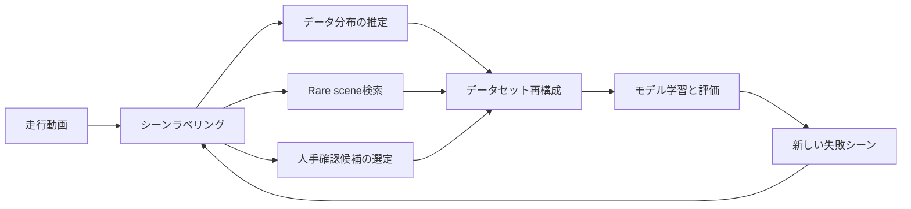
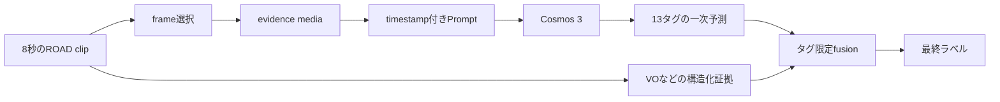
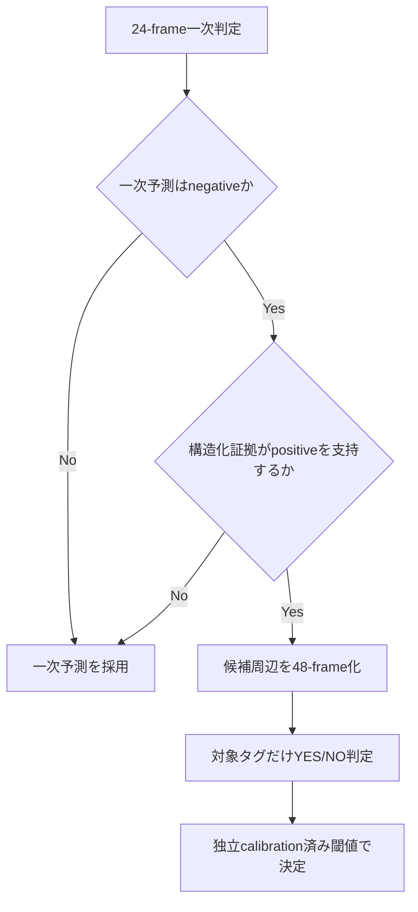

:::message
本記事は個人の技術検証をまとめたものであり、所属組織を代表するものではありません。
実験には公開データセットのみを使用しており、業務で使用している非公開の走行データは含まれません。技術検証を目的としたもので、所属組織が所有する製品の販促等を目的としたものではありません。
本記事は、原稿「公開自動運転動画に対する視覚言語モデルを用いた時系列シーンラベリングの品質・計算費用評価」の設計意図と補足分析を詳述したものです。
:::

## 論文と再現用成果物

[](https://doi.org/10.5281/zenodo.21863163)

本記事の基礎となる論文と再現用成果物は、Zenodoで恒久公開している。論文の数式、実験定義、主結果および入力artifactを参照する場合は、DOI [`10.5281/zenodo.21863163`](https://doi.org/10.5281/zenodo.21863163) を利用されたい。本記事は、この公開成果物と内容を整合させたうえで、実験の設計意図、試行錯誤、補足分析をより詳しく説明するものである。

## 結論

公開ROAD datasetから8秒単位のclipを 875 clipsに分割し、13タグの完全な正負Ground Truthを予測し、以下のようなシーンラベリング結果を得ることができた。

| Model | F1 | Overall Accuracy | 走行動画1時間当たりの推論費用 |
|---|---:|---:|---:|
| Cosmos 3 Nano (16B) | 69.4% | 86.1% | $0.31 |
| Cosmos 3 Super (64B) | 74.5% | 88.8% | $6.07 |

ここでOverall Accuracyは、正解が既知の全clip--tag pairのうち、positiveまたはnegativeを正しく判定できた割合である。positiveとnegativeを同じ重みで扱うBalanced Accuracyとは異なる。

※ 8秒クリップを連続処理した場合の定常EC2 GPU実測費用を、On-Demand料金で計算した。起動、idle、storage、network、前処理などの費用は含まず、推論用GPU instanceの費用だけを対象とする。

※ 以下の 13 種類のシーンラベルを Cosmos VLM で推論

1. 自車走行（`ego_moving`）
2. 自車停止（`ego_stopped`）
3. 自車左折（`ego_turn_left`）
4. 自車右折（`ego_turn_right`）
5. 自車車線変更（`ego_lane_change`）
6. 車両制動（`car_braking`）
7. 停止車両（`car_stopped`）
8. 歩行者横断待ち（`pedestrian_waiting_to_cross`）
9. 歩行者横断（`pedestrian_crossing`）
10. 自転車存在（`cyclist_present`）
11. 二輪車存在（`motorcycle_present`）
12. 対象信号赤（`traffic_light_red`）
13. 対象信号青（`traffic_light_green`）


## アブストラクト

自動運転の研究開発では、長時間の走行動画から特定の状況を検索し、データセットの分布や不足領域を把握する必要がある。
しかし、車両や歩行者の存在を検出するだけでは、車線変更、歩行者横断、停止車両、信号状態のような時系列の意味を十分に表現できない。
本研究では、動画と言語を同時に扱うCosmos 3を用い、公開ROADデータセットから構築した8秒区間（以下、clip）に13種類のシーンラベルを付与する方法を検討した。

評価では、Cosmos 3 NanoとSuper、フレーム選択、判定プロンプト、Visual Odometry（VO：映像からカメラ運動を推定する方法）による自車運動の融合、GPU推論サーバー設定を比較した。
15本の評価用元動画から得た875 clipsでは、同じAdaptive 24-frame条件でSuperの映像判定がPrecision 81.9%、Recall 68.3%、F1 74.5%を示し、NanoのF1 68.9%を上回った。
Nano内ではUniform 24-frame条件がF1 69.4%で最良だったが、Adaptiveとの差の95%信頼区間は0を跨いだ。
Developmentで固定したVO規則をSuperの予測に適用すると、追加のGPU requestなしでF1は76.2%へ改善した。

Prompt設計は、3本のDevelopment source videoから得た169 clipsで独立に比較した。
全タグを長文化するのではなく、Developmentで選定した5タグだけに詳細な肯定条件と除外条件を与えることで、短いBaselineより高いF1を得た。
一方、タグ別には悪化もあり、全体指標の改善がすべてのタグへ一様に及ぶわけではなかった。
固定Evaluationでは、Hybrid Core単体のF1はNano 65.7%、Super 74.4%であり、通常Reasoningの68.9%、74.5%を上回らなかった。
固定VO priorを加えた最良条件はSuperのF1 76.4%だったが、通常ReasoningとVOを組み合わせた76.2%との差は小さかった。

誤り分析では、False Negativeの95.1%が、正解イベント区間から2枚以上かつ0.5秒以上を入力しても検出できない事例だった。
正解時刻を使う診断では、局所的な48-frame化によって一部の見逃しが回復した。
一方、ROI追加やYES score閾値の低下はFalse Positiveとの交換を伴った。
本研究は、品質、Recall、計算費用のトレードオフに加え、期待どおりに機能しなかった方式も報告する。

## 1. 研究背景

### 1.1 シーンラベリングの役割

走行データは、収集しただけでは学習や評価に直接利用しにくい。
たとえば「歩行者が横断した」「停止車両へ接近した」「自車が車線変更した」といった意味を検索できなければ、必要な動画を抽出するために人が大量の映像を確認することになる。
この検索単位となる意味ラベルを、本研究ではシーンラベルと呼ぶ。

シーンラベルは、教師データを作る目的だけに使われるものではない。
収集データに含まれる行動の比率を推定し、rare sceneを抽出し、人手確認の優先順位を決めるためにも利用できる。
Active learning（モデルが有益な追加データを選びながら学習する方法）では、不確かな動画や複数の証拠が矛盾する動画を優先して確認し、限られたannotation予算を難例に集中させる。



### 1.2 物体認識だけでは表せない情報

車両や歩行者を1枚の画像から検出できても、その物体が何をしているかは必ずしも分からない。
停止車両の判定には相対位置が時間的に変化しないこと、歩行者横断には人物trackが道路領域を横切ること、車線変更には自車がlane boundaryを越えて別laneへ移ることが必要になる。
したがって、シーンラベリングには物体の存在、時間変化、道路構造、行動の意味を組み合わせる必要がある。

Vision-Language Model（VLM）は、動画と自然言語の判定基準を同じ推論器に入力できる。
タグごとに個別の分類器を学習しなくても、「道路の右カーブではなく交差点で右折した場合だけpositive」といった基準をPromptとして記述できる点が利点である。
一方、入力フレームの選び方、Promptの曖昧さ、小さな対象物、複数タグの競合、GPU費用が性能を左右する。

### 1.3 本研究の位置付け

[ROAD](https://doi.org/10.1109/TPAMI.2022.3150906)は、自動運転動画にagent、action、location、ego actionを時間的に付与した公開データセットである。
[Cosmos 3](https://arxiv.org/abs/2606.02800)は、動画、画像、言語を統合して扱うOmnimodal World Modelであり、Physical AIを対象とする。
本研究は、ROADの密な時間注釈からpositive、negative、unknownを明示した評価集合を構築し、Cosmos 3の時系列シーンラベリングを評価する。
モデル品質だけでなく、入力設計とServing費用まで同時に検討する。

既存研究との包括的な性能比較は本研究の範囲外である。
外部VLM、専用のtemporal action detector、人間annotationとの直接比較を実施していないため、Cosmos 3が他方式より優れるとは主張しない。
本研究が示すのは、同一の公開GTと実行基盤のもとで、Cosmos 3内部のモデル規模、入力、Prompt、構造化証拠、Serving設定を変えたときの実測差である。

## 2. 課題設定

### 2.1 定式化

8秒の走行clipを $v\in\mathcal{V}$、対象タグを $t\in\mathcal{T}$ とする。
clipから選択したframe集合を $M(v)$、各frameの元動画時刻列を $\tau(v)$、タグ定義と判定手続を $D$、VLMを $f_\theta$ とすると、映像予測は次式で表される。

$$
\hat{\mathbf{y}}(v)=f_\theta\!\left(M(v),\tau(v),D\right)
$$

$\hat{\mathbf{y}}(v)$ は13タグの二値予測である。
本研究で比較するsamplingとPromptは、それぞれ $M(v)$ と $D$ を変更する操作に対応する。
この定式化により、frame選択、timestamp表現、タグ定義、モデル規模を別の操作因子として扱える。

### 2.2 対象ラベル

8秒の前方カメラclipに対して、13タグをmulti-labelで判定した。
1本のclipには複数タグが同時に付与される。
対象タグと、判定に本来必要となる証拠を表1に示す。

表1　対象タグ、ROAD原ラベル、GT閾値、主要な判定証拠

| Index | タグ | ROAD原ラベル | Positive基準 | 判定に必要な主な証拠 |
| ---: | --- | --- | ---: | --- |
| 0 | 自車走行 | `AV-Mov` | 6 frames | 背景flow、道路方向に沿った継続移動 |
| 1 | 自車停止 | `AV-Stop` | 6 frames | 低motion状態の継続 |
| 2 | 自車左折 | `AV-TurLft` | 6 frames | 交差点、進入前後のheading変化、道路曲率との区別 |
| 3 | 自車右折 | `AV-TurRht` | 6 frames | 交差点、進入前後のheading変化、道路曲率との区別 |
| 4 | 車線変更 | `AV-MovLft`, `AV-MovRht` | 合計6 frames | lane boundary横断、変更前後のlane、道路方向との整合 |
| 5 | 車両制動 | `Car-Brake` | 6 frames | 同一車両track、brake lamp変化、減速 |
| 6 | 停止車両 | `Car-Stop` | 6 frames | 同一trackの相対速度、停止継続、駐車車両との区別 |
| 7 | 歩行者横断待ち | `Ped-Wait2X` | 6 frames | 人物track、縁石との位置関係、身体方向、待機継続 |
| 8 | 歩行者横断 | `Ped-Xing`, `Ped-XingFmLft`, `Ped-XingFmRht` | 合計6 frames | 人物trackと道路領域の交差 |
| 9 | 自転車存在 | `Cyc` | 3 frames | 小物体の外観、複数時刻での一貫性 |
| 10 | 二輪車存在 | `Mobike` | 3 frames | motorcycleとbicycleの外観差 |
| 11 | 対象信号赤 | `TL-Red` | 3 frames | 自車laneとの対応、赤色灯の視認 |
| 12 | 対象信号青 | `TL-Green` | 3 frames | 自車laneとの対応、青色灯の視認 |

この表から分かるように、タグごとに必要な証拠は異なる。
自転車や信号は空間解像度に依存しやすく、右左折や車線変更は時間的な運動と道路geometryに依存する。
そのため、すべてのタグを同じフレーム選択と同じ文量の定義で扱う設計は、必ずしも合理的ではない。

### 2.3 ROADからのGround Truth構築

Ground Truth（GT）は、評価時に正解として参照するラベルを指す。
ROAD train/validation annotation（人手注釈）から、8秒窓を8秒間隔で重複なく切り出した。
source videoの毎秒12 frames（12 FPS）のannotationに対し、通常タグは6 annotated frames以上、存在系タグである自転車、二輪車、信号は3 frames以上存在するときpositiveとした。
表1の複数原ラベルを統合する車線変更と歩行者横断では、いずれかの対応ラベルが存在するframe数を合算して閾値判定した。
対象labelが1 frameも存在しない場合をnegative、event frameが存在してもpositive基準を満たさない境界事例をunknownとした。

clip内の全frameが注釈済みであることを必須とし、unknownのclip-tag pairは評価から除外した。
この規則により、単に「positiveだけが信頼できる」検索用データではなく、True Positive、False Positive、True Negative、False Negativeを構成できる。
構築後のbenchmarkは18 source videos、1,044 clipsである。
ROADが提供する分割定義の一つである公式fold 3に基づき、Development 169 clipsとEvaluation 875 clipsへsource video単位で分離した。

表2　DevelopmentとEvaluationの分割

| 項目 | Development | Evaluation |
| --- | ---: | ---: |
| Source videos | 3 | 15 |
| 8秒clips | 169 | 875 |
| 用途 | 方式選定、閾値固定 | 固定方式の母集団評価 |

source video単位で分割したのは、同一走行の時間的に近いclipがDevelopmentとEvaluationに跨ることを避けるためである。
ただし、後述する誤り分析ではEvaluationの低Recallタグを特定しているため、「Evaluationを一度も観察していない」という意味ではない。
Hybrid Prompt自体の選定にはEvaluationを用いていないが、誤り診断から得た知見を将来の方式設計へ利用している点は区別する必要がある。

### 2.4 評価指標

主指標にはmicro F1を用い、Precision、Recall、Overall Accuracy、Balanced Accuracy、Matthews Correlation Coefficient（MCC）を併記した。
Precisionはpositiveと予測したpairの正解率、Recallは実際のpositiveを回収できた割合、F1は両者の調和平均である。
micro F1は全clip-tag pairをまとめて計算するため、出現数の多いタグの影響を受けやすい。
各タグを同じ重みで平均するmacro F1とは性質が異なるため、タグ別指標も併せて確認した。
Overall Accuracyは全known pairに占める正解pairの割合であり、Balanced Accuracyはpositive側の正解率とnegative側の正解率を等しく平均した値である。
MCCはpositiveとnegativeの比率が偏る場合にも、4種類のconfusion matrix要素をまとめて評価しやすい指標である。
出力不備を見逃さないため、有効な二値出力を返した既知clip-tag pairの割合をpair coverageとして記録した。
Evaluationには11,314 known pairsと61 unknown pairsが含まれる。
unknownは品質指標の分母から除外する一方、要求したタグの欠落やparse不能な出力はnegativeへ丸めず、abstention（判定棄権）$\bot$ としてstrict指標へ残した。
Developmentではpair coverage 99%以上を採用条件とし、coverage不足を高いF1で覆い隠せないようにした。

信頼区間はclipを独立標本として扱わず、source videoを単位として再標本化するblock bootstrapで算出した。
ただしDevelopmentは3 source videosしかないため、Development上の95%区間は有効cluster数が少なく、微小な候補差を識別する力は限定的である。
そのためHybrid Promptの候補間で差を解消できない場合は、より短いPromptを選ぶparsimony（簡潔性）の原則を採用した。

### 2.5 研究質問

本研究では、学会原稿と同じ7つの研究質問を設定した。
各質問は、単に比較項目を列挙するものではない。
実験前に抱いていた仮説と、比較時に固定する条件を対応付ける役割を持つ。

表3　研究質問と事前に定めた比較方針

| ID | 研究質問と実験前の仮説 | 操作因子と固定条件 | データと採否規則 |
| --- | --- | --- | --- |
| RQ1 | 限られたframe budgetでは、均等samplingより短時間eventへ局所高FPSを配るAdaptiveまたはMixed samplingが有利か | samplingだけを変更し、model、Prompt、24-frame budgetを固定 | Developmentで候補を比較し、Nano Evaluationではpaired 95%信頼区間が0を跨ぐ場合に明確な優位を主張しない |
| RQ2 | 肯定証拠、時系列検査、除外条件は、全タグ一律ではなく難しいタグへ限定した方が品質とPrompt長を両立できるか | 詳細定義を与えるタグ集合だけを変更し、169 clips、media、Super、temperature（生成のランダム性を制御する値）を固定 | DevelopmentでF1、MCC、coverageを比較し、差を識別できない候補間では短いPromptを採用 |
| RQ3 | NanoからSuperへの規模拡大は、見逃しと誤検出のどちらを主に減らし、追加EC2費用に見合うか | 同じEvaluation clips、media、Reasoned Promptを固定 | 875 clipsの母集団評価として、Precision、Recall、F1、MCC、定常GPU費用を併記 |
| RQ4 | 複数requestの同時処理、入力処理の分割、計算結果の再利用、request分割は、処理量、遅い側の応答時間、費用へどう作用するか | 少数clipのmediaとPromptを固定し、Serving設定だけを変更 | failure、parse error、GPU memory不足による処理退避をgateとし、主要Nano条件はPod再作成後に3回反復 |
| RQ5 | 映像だけでは曖昧な自車運動を公開軌跡またはVOで補助すると品質が上がるか。自然言語contextとタグ限定の決定論的fusionでは、どちらが安定するか | 映像baselineを固定し、contextの渡し方とfusion規則だけを変更 | DevelopmentでF1、MCC、Balanced Accuracyが改善し、改善pair数が悪化pair数以上の規則だけを固定してEvaluationへ適用 |
| RQ6 | event時刻を既に含むFalse Negativeは、48-frame化、対象領域のcrop（ROI）、track、タグ別YES scoreのどの段階で回復するか | 同じ24難例と対象タグを固定し、時間密度、空間表現、構造化証拠、decision形式を順に変更 | GTを使う上限診断としてFalse Negative回復、True Positive維持、negative-controlのFalse Positiveを報告し、母集団性能とは扱わない |
| RQ7 | 生成ラベルは個別clipの分類だけでなく、データ分布推定と希少sceneの人手確認順序付けに利用できるか | Evaluation GTと固定予測を用い、学習や閾値調整は行わない | prevalence誤差と人手確認候補の濃縮率を評価し、downstream再学習効果とは区別 |

RQ1ではmodelとServing、RQ2ではmediaとmodel、RQ4ではmediaとPrompt、RQ5では映像baselineを固定した。
複数の要因を同時に変えると、結果が改善しても原因を特定できないためである。
品質表のFull Run費用と、少数clipのcontrolled serving sweepは実行範囲やrequest順が異なるため、同じ表内で直接比較しない。

## 3. 提案手法

ここからは、完成した構成を先に説明するのではなく、RQ1からRQ7までを実験した順に追う。
各RQでは、最初に仮説を示し、次に実際の実装と比較条件を確認し、最後に結果と採否を述べる。
この順序を採るのは、最終構成だけを見ると、採用しなかった方式や設計判断の根拠が見えにくいためである。

### 3.1 共通の処理フロー

すべての実験は、8秒clipから入力動画を生成し、timestampと13タグの判定基準をPromptへ加え、Cosmos 3からmulti-label出力を得る流れを共有する。



System Promptは全条件で次の文を共通にした。

```text
You classify an ordered eight-second front-facing autonomous-driving video
using the ROAD dataset taxonomy. Sampled frames are chronological but may be
nonuniform in source time. Judge only visible evidence in the supplied
interval. Apply every criterion independently.
```

通常のReasoned Promptでは、13タグを一つのrequestで判定し、positiveと判断したindexだけを返す。
実際に比較したPrompt本文と出力形式は、RQ2の比較表の直後に引用する。
自由記述を返させないことで、parse failureと出力token数を抑えた。

### 3.2 実験結果の水準を分ける

本記事では、次の三種類の結果を混ぜない。

| 水準 | データ | 目的 |
| --- | --- | --- |
| Development | 169 clips、3 source videos | sampling、Prompt、閾値の選定 |
| Evaluation | 875 clips、15 source videos | 固定した方式の母集団品質評価 |
| Oracle診断 | 24 selected clips | GT時刻やGT boxを使った改善上限の確認 |

Developmentで高かったF1を最終性能として扱わず、Oracle診断の値も875 clipsの結果へ合成しない。
Evaluationでは11,314 known clip--tag pairsを用い、unknown 61 pairsを品質指標の分母から除外した。
出力欠落やparse不能はnegativeへ丸めず、abstentionとして記録した。

実行scriptでは、Full Run完了後に875行すべてが成功したことをgateとしている。

```bash
test "$(wc -l < "$RUN_DIR/results.jsonl")" -eq 875
test "$(
  jq -s 'map(select(.success == true)) | length' "$RUN_DIR/results.jsonl"
)" -eq 875
```

GPU費用は、instanceのOn-Demand単価を $p$、1 clip当たりの実測経過時間（wall time）を $t$ 秒として、次式で換算した。

$$
C_{1000}=p\frac{t}{3600}\times1000
$$

以下の費用は、requestが継続して供給される定常GPU推論の値である。
model download、startup、idle、storage、network、EKS control plane、CPU前処理は含まない。

## 4. RQ1: 24枚をどの時刻へ配るべきか

### 4.1 仮説

車線変更や歩行者横断のような短時間eventでは、clip全体を均等に見るより、motionの大きい区間へframeを集中した方が有利だと考えた。
そこで、frame数を24枚に固定し、時間軸上の配分だけを変更した。

- Uniform: 8秒全体から3 FPS相当で均等に24枚を選ぶ
- Adaptive: 全体を低FPSで保持し、motion peak付近を高FPS化する
- Mixed: 全体を2 FPSで保持し、最大1個のmotion peak周辺だけを8 FPS相当にする

### 4.2 実装

Uniformのconfigは単純である。

```json
{
  "kind": "uniform",
  "fps": 3,
  "max_frames": 24,
  "display_fps": 4,
  "timestamp_mode": "text-manifest",
  "prompt_variant": "road-reasoned"
}
```

Adaptiveでは、全域、peak周辺、peak中心に異なるpriorityを与え、24枚を超えた場合に低priorityのframeから落とした。
実験時の実装の主要部分を示す。

```python
def select_adaptive_timestamps(duration, event_peaks, profile):
    priorities = {}

    def add_grid(start, end, fps, priority):
        for timestamp in _grid(max(0, start), min(duration, end), fps):
            priorities[timestamp] = max(
                priority, priorities.get(timestamp, 0)
            )

    add_grid(0, duration, profile["base_fps"], 1)
    for peak in event_peaks:
        add_grid(
            peak - profile["shoulder_seconds"],
            peak + profile["shoulder_seconds"],
            profile["shoulder_fps"],
            2,
        )
        add_grid(
            peak - profile["event_seconds"],
            peak + profile["event_seconds"],
            profile["event_fps"],
            3,
        )
```

frameを単純に追加するのではなく、同じ24-frame budget内で再配分している。
これにより、品質差を入力枚数や入力側の計算量の差から分離した。

### 4.3 実験と結果

Development 169 clipsで、modelとReasoned Promptを固定して比較した。

| Sampling | Precision | Recall | F1 | MCC |
| --- | ---: | ---: | ---: | ---: |
| Adaptive 24枚 | 73.3% | 67.3% | 70.2% | 0.609 |
| Mixed 24枚 | 72.1% | 68.6% | 70.3% | 0.608 |
| Uniform 24枚 | 74.1% | 68.4% | 71.1% | 0.621 |

事前仮説に反して、DevelopmentではUniformが最良だった。
そこでNanoのEvaluationでもAdaptiveとUniformを比較した。

| Nano Evaluation | Precision | Recall | F1 | Overall Accuracy |
| --- | ---: | ---: | ---: | ---: |
| Adaptive 24枚 | 71.3% | 66.7% | 68.9% | 85.6% |
| Uniform 24枚 | 73.4% | 65.9% | 69.4% | 86.1% |

F1差は+0.5 pointsだったが、source-video block bootstrapの95%信頼区間は-0.2から+1.2 pointsであり、0を跨いだ。
したがって、Uniformの明確な品質優位は確認できない。

### 4.4 なぜmotion peakが効かなかったか

GT event区間を入力frameが覆った割合も調べた。

| Sampling | Event内1枚以上 | Event内2枚以上 | 0.5秒以上のspan | Event前後context |
| --- | ---: | ---: | ---: | ---: |
| Adaptive | 100.0% | 97.4% | 96.1% | 100.0% |
| Mixed | 100.0% | 98.9% | 97.1% | 100.0% |
| Uniform | 99.8% | 98.9% | 97.1% | 89.2% |

AdaptiveとMixedはevent前後を多く含んだが、F1ではUniformを上回らなかった。
画面motionは、意味的なeventだけでなく、道路のカーブ、camera vibration、近接物体の通過にも反応する。
一方、停止、信号、小さな歩行者のように重要でもmotionが小さい対象がある。

RQ1から得た結論は、motion peakへの集中は単独では有効なevent detectorにならず、単純なUniform 24枚が実装上の合理的な既定値になる、というものである。
ただしSuperのUniform Full Runは実施していないため、全modelでUniformが最良とは主張しない。

## 5. RQ2: Promptをどこまで詳細化すべきか

### 5.1 最初にReasoningの出力契約を変えた

初期条件では、13タグすべてについて`yes/no`をJSONで返させていた。
その後、各criteriaを独立に確認させ、positive indexだけを出すReasoned Promptへ変更した。

| Development条件 | F1 | Overall Accuracy |
| --- | ---: | ---: |
| Adaptive 24枚 + timestamp-only | 45.8% | 79.6% |
| Adaptive 24枚 + Reasoned Prompt | 70.2% | 85.7% |

両条件は、共通のSystem Prompt、13タグの定義、clip固有のtimestamp manifestを使用する。`timestamp-only`という実験名は、timestamp以外に指示がないという意味ではない。実際には次のinstructionで全タグを判定し、固定順の13要素を持つbinary arrayとして出力させた。

```text
Inspect the complete ordered sequence before classifying.
For a temporal action, require a consistent state or motion change across
source timestamps; do not infer it from a single ambiguous frame.
For an object or traffic-light state, require direct visual evidence.
For each criterion in the exact order listed, emit 1 only when supported
and emit 0 otherwise. Return only the required JSON object.
```

たとえば、自車走行、停止車両、対象信号赤をpositiveとする出力は次の形になる。配列の位置は、表1に示した0から12までのタグ順に対応する。

```json
{"labels": [1, 0, 0, 0, 0, 0, 1, 0, 0, 0, 0, 1, 0]}
```

Reasoned Promptでは、同じ映像、タグ定義、timestampを維持し、instructionと出力契約だけを次の実文へ変更した。

```text
Analyze the complete ordered sequence and source timestamps.
Check every indexed criterion independently against visible evidence.
Temporal actions require consistent evidence across timestamps.
Finish with exactly one line of the form
FINAL_POSITIVE_INDICES: [0, 2].
Use an empty list when none is supported.
Do not write anything after that line.
```

同じ判定結果は、positiveのindexだけを用いて次の1行で返される。

```text
FINAL_POSITIVE_INDICES: [0, 6, 11]
```

この差は、詳細なChain-of-Thoughtを出力させた効果ではない。
全タグを独立確認する手順と、短いpositive-only出力を一つの契約にした効果である。
同じrunでtimestamp単独効果だけを分離した比較ではないため、「timestampが24.4 points改善した」とは解釈しない。

### 5.2 Hybrid Coreを考えた理由

次に、すべてのタグを長文化すべきかを検討した。
たとえば通常Reasoningにおける車線変更の定義は1文である。

```text
The ego vehicle moves from its current lane into an adjacent lane on either
side without making a road turn.
```

Hybrid Coreでは、同じタグを次のように分解した。

```text
Meaning:
The ego vehicle transfers from its current lane into an adjacent lane while
remaining on the same continuing road.

Required evidence:
- A lane boundary or stable lane-relative reference moves across the ego path.
- The vehicle is first aligned with one lane and later aligned with the
  adjacent lane.

Temporal test:
Seek before, boundary-crossing, and after states.

Reject when:
- The entire road bends while the ego vehicle remains in its lane.
- The ego vehicle turns onto another road at a junction.
- Lateral camera motion occurs without a visible lane transfer.
```

全13タグをこの形式にするとcriteriaは213語から1,273語へ増える。
そこで、誤りが多く、肯定条件と除外条件の区別が必要だった5タグだけを詳細化した。

```json
{
  "tag_reasoning_include_tags": [
    "ego_turn_left",
    "ego_lane_change",
    "car_stopped",
    "pedestrian_waiting_to_cross",
    "motorcycle_present"
  ],
  "tag_reasoning_fallback": "base"
}
```

Hybrid Coreのinstructionは、詳細criteriaを他タグへ誤って適用しないように明示した。

```text
Some criteria contain expanded evidence, temporal, and rejection tests;
apply those tests only to their own criterion. For concise criteria, use
their direct visible definition and do not import restrictions from another
label. Establish the continuing road direction, keep the same physical
subject across timestamps, and test the criterion's own strongest rejection
before retaining a tentative positive.
```

### 5.3 DevelopmentでのPrompt選定

同じDevelopment 169 clips、同じ24-frame media、同じCosmos 3 Super、temperature 0で比較した。

| Prompt | Criteria語数 | 詳細タグ数 | Precision | Recall | F1 | MCC |
| --- | ---: | ---: | ---: | ---: | ---: | ---: |
| 短いReasoned baseline | 213 | 0 | 86.2% | 62.1% | 72.2% | 0.663 |
| 全タグContrastive | 1,273 | 13 | 85.6% | 65.8% | 74.4% | 0.683 |
| Hybrid Core | 603 | 5 | 85.6% | 67.6% | 75.6% | 0.695 |
| Hybrid Temporal | 778 | 7 | 85.8% | 67.8% | 75.8% | 0.697 |
| Hybrid F1-selected | 850 | 8 | 84.9% | 66.4% | 74.5% | 0.682 |

Hybrid Temporalの点推定値が最も高かったが、Hybrid Coreとの差は0.2 pointsで、95%信頼区間は0を跨いだ。
そこで、同等群の中から短いHybrid Coreを固定した。

### 5.4 固定Evaluationで一般化したか

Developmentで選んだHybrid Coreを変更せず、NanoとSuperのEvaluation 875 clipsへ適用した。
さらに、RQ5で説明する固定VO priorを同じ出力へ適用した。

| Model | Prompt | VO prior | Precision | Recall | F1 | Overall Accuracy | MCC |
| --- | --- | --- | ---: | ---: | ---: | ---: | ---: |
| Nano | 通常Reasoning | なし | 71.3% | 66.7% | 68.9% | 85.6% | 0.596 |
| Nano | Hybrid Core | なし | 79.9% | 55.7% | 65.7% | 86.0% | 0.587 |
| Nano | Hybrid Core | あり | 84.7% | 58.9% | 69.5% | 87.6% | 0.637 |
| Super | 通常Reasoning | なし | 81.9% | 68.3% | 74.5% | 88.8% | 0.678 |
| Super | Hybrid Core | なし | 82.4% | 67.8% | 74.4% | 88.8% | 0.678 |
| Super | 通常Reasoning | あり | 82.8% | 70.5% | 76.2% | 89.4% | 0.698 |
| Super | Hybrid Core | あり | 83.2% | 70.6% | 76.4% | 89.5% | 0.701 |

最良の点推定値はSuper、Hybrid Core、固定VO priorのF1 76.4だった。
しかし、通常Reasoningと固定VO priorのF1 76.2との差は0.2 pointsである。
Hybrid Core単体も、通常Reasoningの74.5を上回らなかった。
したがって、最終的な改善をHybrid Coreの効果だけに帰属できない。

Nanoでは、Hybrid Coreによって予測positiveが2,536件から1,890件へ減った。
False Positiveは728件から379件へ減った一方、True Positiveも1,808件から1,511件へ減り、Recallが66.7%から55.7%へ低下した。
詳細化していない8タグでも183件のTrue Positiveを失っており、`strongest rejection`を優先するinstructionがNano全体を過度に保守化したと考えられる。

RQ2の結論は、詳細criteriaはDevelopmentでは有効でも、model規模を跨いで一般化するとは限らない、というものである。
Superでは悪化せず維持できたが、通常Reasoningに対する明確な優位は確認できなかった。
Prompt改善を主張するには、base/expanded criteriaと通常/棄却重視instructionを独立に切り替える$2\times2$ ablationが必要である。

なお、Hybrid Core Full Runは品質比較を目的としており、独立した応答時間・費用測定を行っていない。
以降の費用比較には、通常Reasoningで直接計測したNano/Super Full Runを用いる。

## 6. RQ3: NanoとSuperの品質差は費用に見合うか

### 6.1 実行構成

Cosmos 3 Nanoは約16B parameters、Superは約64B parametersである。
Nanoはg6e.2xlargeの1 GPU、Superはg6.24xlargeの4 GPU tensor parallel（modelを複数GPUへ分割する並列化）で実行した。
実験時のvLLM起動設定の主要部分は次のとおりである。

```yaml
# Nano
- vllm
- serve
- nvidia/Cosmos3-Nano
- --tensor-parallel-size
- "1"
- --max-model-len
- "32768"

# Super
- vllm
- serve
- nvidia/Cosmos3-Super
- --tensor-parallel-size
- "4"
- --max-model-len
- "16384"
- --max-num-batched-tokens
- "8192"
- --enable-chunked-prefill
```

Superを動かしたg6.24xlargeはGPU間接続がPCIe-onlyであり、vLLM custom all-reduceではなくNCCL fallbackを用いた。
したがって、NVLinkまたはNVSwitch環境におけるSuperの上限性能ではない。

### 6.2 Evaluation結果

費用を直接測定した通常ReasoningのFull Runを比較する。

| Model / Sampling | Precision | Recall | F1 | Overall Accuracy | MCC | USD / 1,000 clips |
| --- | ---: | ---: | ---: | ---: | ---: | ---: |
| Nano / Adaptive 24枚 | 71.3% | 66.7% | 68.9% | 85.6% | 0.596 | 0.66 |
| Nano / Uniform 24枚 | 73.4% | 65.9% | 69.4% | 86.1% | 0.606 | 0.69 |
| Super / Adaptive 24枚 | 81.9% | 68.3% | 74.5% | 88.8% | 0.678 | 13.48 |

8秒clipを重複なく連続処理すると、走行動画1時間は450 clipsに相当する。

| Model | F1 | Overall Accuracy | 走行動画1時間当たりの定常GPU費用 |
| --- | ---: | ---: | ---: |
| Nano / Uniform 24枚 | 69.4% | 86.1% | USD 0.31 |
| Super / Adaptive 24枚 | 74.5% | 88.8% | USD 6.07 |

SuperはNano UniformよりF1が5.1 points高い一方、定常GPU費用は約20倍だった。
改善はRecallよりPrecisionで大きい。
Superはpositiveを一律に増やしたのではなく、False Positiveを強く抑えた。

### 6.3 タグごとの差

Superでも、すべてのタグが同じ精度になるわけではない。

| タグ | GT positive | Precision | Recall | F1 |
| --- | ---: | ---: | ---: | ---: |
| 自車走行 | 701 | 99.4% | 88.2% | 93.4% |
| 自車停止 | 264 | 95.0% | 86.7% | 90.7% |
| 対象信号赤 | 226 | 88.9% | 78.3% | 83.3% |
| 自転車存在 | 432 | 97.5% | 72.5% | 83.1% |
| 停止車両 | 272 | 69.8% | 33.1% | 44.9% |
| 歩行者横断待ち | 123 | 32.3% | 25.2% | 28.3% |
| 車線変更 | 20 | 15.0% | 15.0% | 15.0% |

自車走行、停止、信号色のように視覚的な継続状態が明瞭なタグは高かった。
一方、車線変更にはlane boundary、横断待ちには人物の意図、停止車両にはego motionを補償した相対速度が必要になる。
modelを大きくするだけでは、この構造化情報の不足を解決できない。

RQ3から得た運用上の結論は明確である。
大量の一次ラベリングではNano、誤検出を抑えたい品質優先処理ではSuperが候補となる。
全件Superが費用に見合わない場合は、RQ4の段階処理で中間点を作る。

## 7. RQ4: GPU Servingをどこまで最適化できるか

### 7.1 比較方法

同じ15 clips、同じAdaptive 24-frame media、同じReasoned Promptを固定し、Serving設定だけを変更した。
Nanoの主要条件はPodを作り直して3回反復した。
concurrencyは、clientが同時に処理中とするrequest数である。
実行scriptでは、次のconcurrencyを順に測定している。

```bash
points=(
  "nano-server-default:1"
  "nano-server-default:2"
  "nano-server-default:4"
  "nano-server-default:8"
  "nano-chunked-2048:4"
  "nano-chunked-8192:4"
)
```

各点では同じCLIを使い、`--concurrency`だけを切り替えた。

```bash
python -m benchmark_tool.cli phase2-run \
  --experiment configs/road-nano.json \
  --profiles road-adaptive-24-reasoned \
  --concurrency "$concurrency" \
  --request-order shuffled-cold
```

### 7.2 Continuous batching

Continuous batchingは、複数requestの入力処理と出力生成をGPU schedulerが随時まとめ、GPUの空き時間を減らす仕組みである。
表中の`c1`から`c8`はconcurrencyを表す。
Wall / clipは、測定全体の経過時間を完了clip数で割った値であり、その逆数がthroughput（単位時間当たりの処理clip数）に対応する。
P95 latencyはrequestごとのend-to-end応答時間の95パーセンタイルであり、requestの95%がその時間以内に完了したことを表す。
表中の`平均±標本標準偏差`は、Podを再作成して行った3回の独立反復に対する値である。

| Nano concurrency | Wall / clip | P95 latency | GPU費用 / 1,000 clips |
| --- | ---: | ---: | ---: |
| c1 | 3.61±0.20 s | 2.60±0.04 s | USD 2.245±0.122 |
| c2 | 1.85±0.01 s | 3.87±0.03 s | USD 1.151±0.008 |
| c4 | 1.38±0.01 s | 5.75±0.06 s | USD 0.862±0.003 |
| c8 | 1.22±0.04 s | 13.78±1.19 s | USD 0.759±0.025 |

c1からc4でthroughputは約2.6倍となり、費用は約61.6%下がった。
一方、P95 latencyは2.60秒から5.75秒へ増えた。
c8はthroughputと費用で最良だったが、P95は13.78秒まで悪化した。

したがって、offline batchではc8、個々のrequest latencyも重視する場合はc4が妥当な運用点となる。
throughput最大化とtail latency最小化は同じ目標ではない。

Superではc4とc8を比較した。
Preemptionは、その空き容量が不足したとき、vLLMが実行中sequenceを退避または再計算対象にして処理枠を空けた回数である。

| Super設定 | Wall / clip | P95 latency | Preemption | GPU費用 / 1,000 clips |
| --- | ---: | ---: | ---: | ---: |
| TP4、c4 | 7.38 s | 30.47 s | 0 | USD 13.68 |
| TP4、c8 | 6.97 s | 67.36 s | 4 | USD 12.93 |

c8ではKV cache不足に伴うpreemptionが4回発生し、P95が67.36秒まで増えたため、Full Runにはc4を採用した。

### 7.3 Chunked Prefill

Nano c4で、server default、2,048-token chunk、8,192-token chunkを比較した。
Chunked Prefillは、長いPrefillを分割し、途中に他requestのDecodeを挟めるようにする機能である。

| c4条件 | Wall / clip | Prefill / clip | GPU費用 / 1,000 clips |
| --- | ---: | ---: | ---: |
| Server default | 1.38 s | 1.39 s | USD 0.862 |
| Chunk 2,048 | 1.38 s | 1.40 s | USD 0.861 |
| Chunk 8,192 | 1.54 s | 1.29 s | USD 0.956 |

しかし、この24-frame workloadではserver defaultを明確に上回らなかった。
Prefill単体が短くなっても、schedulerとDecodeを含むend-to-end費用が下がるとは限らない。

### 7.4 Cacheとrequest分割

Multimodal cacheは同じvideoの内部表現を、Prompt prefix cacheは同じPrompt先頭部分の内部状態を再利用する仕組みである。
13タグを3 requestへ分割すると、同じ動画に対するmultimodal cache hitは100%、Prompt prefix cache hitは93.1%になった。
それでもrequest数とDecodeが増え、単一Reasoned requestより高価になる。


### 7.5 NanoからSuperへのcascade

全件をSuperへ送らず、Nano予測に応じて一部だけをSuperへ送る方式も比較した。
実装ではrouting policyを関数として固定し、routed clipだけSuperの既存予測へ置き換えた。

```python
policies = [
    ("nano_only", lambda values: False),
    ("positive_count_at_least_3",
     lambda values: positive_count(values) >= 3),
    ("pedestrian_positive",
     lambda values: any_positive(values, PEDESTRIAN_TAGS)),
    ("complex_temporal_positive",
     lambda values: any_positive(values, complex_temporal_tags)),
    ("super_all", lambda values: True),
]
```

| 構成 | Super routing率 | Precision | Recall | F1 | USD / 1,000 clips |
| --- | ---: | ---: | ---: | ---: | ---: |
| Nanoのみ | 0% | 73.4% | 65.9% | 69.4% | 0.69 |
| 歩行者positiveをSuper | 23.7% | 78.4% | 63.8% | 70.3% | 3.88 |
| Positive 3個以上をSuper | 39.8% | 79.9% | 63.0% | 70.4% | 6.05 |
| 複雑時系列positiveをSuper | 69.1% | 83.1% | 65.8% | 73.4% | 10.01 |
| Super全件 | 100% | 81.9% | 68.3% | 74.5% | 13.48 |

複雑時系列positiveをroutingする方式は、Super全件より25.7%低い費用で、F1差を1.1 pointsまで縮めた。
ただしNanoが見逃したclipはrouting条件を発火しないため、positive-only cascadeではRecallを救いにくい。
次の改善には、Nanoの出力だけでなく、detector、tracker、VOとの不一致をrouting条件へ加える必要がある。

## 8. RQ5: 映像判定へVisual Odometryをどう融合するか

### 8.1 なぜVLMへ再質問しなかったか

自車走行、停止、右左折は、物体の外観よりcamera motionに依存する。
そこで、公開軌跡とvideo-derived Visual Odometry（VO）を補助証拠として検討した。

最初はmedian flowやyawを自然言語としてPromptへ追加し、Superへ再質問した。
自車actionは改善したが、motion情報と直接関係しない歩行者や信号タグまで変化した。
そこで最終的には、VLMへ全タグを再生成させず、自車運動タグだけを決定論的に変更した。

### 8.2 VOの実装

静的背景寄りの領域からShi--Tomasi法で追跡しやすい特徴点を抽出し、Lucas--Kanade optical flow（隣接frame間の画素移動推定）で前後追跡した。
forward--backward誤差、すなわち次frameへ追跡してから元frameへ戻したときの位置ずれが1.5 px以下のtrackだけを残した。

```python
points = cv2.goodFeaturesToTrack(
    previous,
    maxCorners=800,
    qualityLevel=0.01,
    minDistance=7,
    mask=feature_mask,
)
forward, status_forward, _ = cv2.calcOpticalFlowPyrLK(
    previous, following, points, None
)
backward, status_backward, _ = cv2.calcOpticalFlowPyrLK(
    following, previous, forward, None
)
source = points.reshape(-1, 2)
reverse = backward.reshape(-1, 2)
valid = (
    status_forward.reshape(-1).astype(bool)
    & status_backward.reshape(-1).astype(bool)
    & (np.linalg.norm(source - reverse, axis=1) <= 1.5)
)
```

各clipについて、valid trackの移動量中央値であるmedian flow、動きが小さいframe pairの割合、Essential Matrix（対応点からcamera間の相対姿勢を表す行列）から得た累積visual yaw（cameraの左右回転量）を保存した。
有効trackを十分に得られたframe pairが50%以上あるclipだけをfusion対象とした。

### 8.3 タグ限定の決定論的fusion

Developmentで候補閾値を探索し、改善した規則だけを固定した。
Evaluationでは閾値を変更していない。

実装は、元のhard labelとVO summaryをタグ単位で組み合わせる。

```python
if kind == "moving_state":
    if (
        prediction == "no"
        and flow >= rule["promote_flow_at_least"]
        and low_motion <= rule["promote_low_motion_at_most"]
    ):
        return "yes"
    if (
        prediction == "yes"
        and flow <= rule["veto_flow_at_most"]
        and low_motion >= rule["veto_low_motion_at_least"]
    ):
        return "no"

if kind == "turn_veto" and prediction == "yes":
    supported = signed_yaw >= rule["minimum_signed_yaw_degrees"]
    return prediction if supported else "no"
```

最終的に変更対象としたのは、自車走行、自車停止、自車左折の3タグである。
右折、車線変更、Map contextはDevelopmentで改善しなかったため、VLM予測をそのまま保持した。

### 8.4 Evaluation結果

通常ReasoningのSuper出力に固定VO priorを適用した。

| 方式 | Precision | Recall | F1 | Overall Accuracy | MCC | 改善 / 悪化pairs |
| --- | ---: | ---: | ---: | ---: | ---: | ---: |
| Super映像のみ | 81.9% | 68.3% | 74.5% | 88.8% | 0.678 | - |
| Super + 固定VO prior | 82.8% | 70.5% | 76.2% | 89.4% | 0.698 | 90 / 16 |

F1差は+1.7 pointsで、95%信頼区間は+1.3から+2.2 pointsだった。
追加のVLM requestは発生しない。
CPUによるVO前処理費用は未計測であるため、総システム費用が完全に同じという意味ではない。

Hybrid Core出力でも、SuperのF1は74.4から76.4へ、Nanoは65.7から69.5へ改善した。
異なるPromptに対してもVO priorの方向は一貫していた。
一方、車線変更、歩行者横断待ち、停止車両の低Recallは直接改善していない。

RQ5から得た結論は、異種の数値証拠を長い自然言語として全タグへ再入力するより、その情報が観測できる対象タグだけへpromotionまたはvetoとして適用する方が安定する、というものである。

## 9. RQ6: False Negativeは何を追加すれば回復するか

### 9.1 まずsampling missを数えた

Superの通常Reasoning Full RunにはFalse Negativeが861件あった。
GT event区間と入力timestampの関係から、次の三つに分けた。

- Miss: event区間内のframeが0枚
- Sparse: eventは含むが、2枚未満または0.5秒未満
- Covered: 2枚以上かつ0.5秒以上を含む

| 分類 | 件数 | 割合 |
| --- | ---: | ---: |
| Miss | 1 | 0.1% |
| Sparse | 41 | 4.8% |
| Covered | 819 | 95.1% |

大半のFalse Negativeは、event時間帯を完全に取り逃してはいなかった。
ただし、2枚かつ0.5秒というCovered条件は、lane移行や歩行者trackを判断するのに十分な時間密度を保証しない。
また、小物体の画素不足、遮蔽、夜間、道路geometry、taxonomy境界もCoveredへ含まれる。

### 9.2 48-frame Oracle診断

低Recallの7タグについて、Developmentから既存False Negative 14件、True Positive 7件、negative control 7件を選んだ。
GT event時刻やGT boxを使うため、これはproduction方式ではなく改善上限の診断である。

| 入力条件 | 既存FNの回復 | 既存TPの維持 | Negative-control FP |
| --- | ---: | ---: | ---: |
| 現行24枚 | 0 / 14 | 7 / 7 | 5 / 7 |
| Oracle時刻 24枚 | 2 / 14 | 7 / 7 | 4 / 7 |
| Oracle時刻 48枚 | 5 / 14 | 7 / 7 | 4 / 7 |
| 48枚 + multi-scale | 3 / 14 | 6 / 7 | 2 / 7 |
| 48枚 + GT-box ROI | 4 / 14 | 5 / 7 | 3 / 7 |
| ROI + VO | 3 / 14 | 5 / 7 | 1 / 7 |
| ROI + 匿名track + VO | 5 / 14 | 5 / 7 | 3 / 7 |

Oracle 48枚は5/14件を回復したが、9件は残った。
ROIやmosaicも単調には改善しなかった。
cropは対象を拡大して見せるが、元画像の画素数を増やさず、full-frameの道路contextを失うためである。

### 9.3 13タグ同時判定をやめてみる

見逃しが視覚証拠不足だけでなく、multi-label出力内のtag competitionによる可能性も調べた。
対象タグだけをYES/NOで判定し、最初のtokenのlog probabilityを取得した。

実際のrequestは最大3 tokensで、次のinstructionを使った。

```python
user_text = (
    f"TARGET CRITERION: {tag}\n{definition}\n\n"
    "Inspect the complete ordered video. Apply the target criterion's "
    "required evidence, temporal test, and rejection conditions. "
    "Return exactly one uppercase token: YES or NO."
)

payload = {
    "temperature": 0,
    "max_tokens": 3,
    "logprobs": True,
    "top_logprobs": 20,
}
```

YESとNOのlog probabilityから未校正scoreを求めた。

$$
s_t(v)=
\frac{\exp \ell_{\mathrm{YES}}}
{\exp \ell_{\mathrm{YES}}+\exp \ell_{\mathrm{NO}}}
$$

| Evidence | 閾値 | FN回復 | TP維持 | Control FP | 診断Precision | 診断Recall |
| --- | ---: | ---: | ---: | ---: | ---: | ---: |
| 現行24枚 | 0.20 | 8 / 14 | 7 / 7 | 4 / 7 | 78.9% | 71.4% |
| Oracle 48枚 | 0.20 | 8 / 14 | 7 / 7 | 3 / 7 | 83.3% | 71.4% |
| Oracle 48枚 | 0.40 | 7 / 14 | 7 / 7 | 2 / 7 | 87.5% | 66.7% |

現行24枚でもタグ別判定だけで8/14件を回復した。
したがって、見逃しにはframe不足だけでなく、13タグ同時判定における競合と実効decision thresholdも関与する。

ただし、このscoreは校正済み確率ではない。
同じ小規模診断集合で閾値を選んでいるため、未知データへそのまま適用できない。

### 9.4 次に実装すべきrouting

全clipを48枚化し、全13タグを個別callすると費用が大きくなる。
次の候補は、一次VLMがnegativeで、detector、tracker、lane、VOなどの外部証拠がpositiveを支持するclip--tag pairだけを再判定する方式である。



このcandidate generatorと独立calibration setは未実装であり、Evaluation済みの提案手法には含めない。
RQ6が示したのは、一律な高FPS化ではなく、タグごとに必要な証拠を作り、矛盾したpairだけへ計算量を配るべきだという設計方針である。

## 10. RQ7: ラベルはデータキュレーションに使えるか

### 10.1 データセット分布の推定

個々のclipを分類するだけでなく、タグの出現率をどこまで再現できるかを測った。
各タグのprevalence誤差の絶対値を平均した値をMAE、13タグ分布全体のずれを0以上の値で表し、0に近いほど分布が近いJensen--Shannon Divergence（JSD）を用いた。

| Model / Sampling | Prevalence MAE | JSD |
| --- | ---: | ---: |
| Nano / Adaptive 24枚 | 0.084 | 0.048 |
| Super / Adaptive 24枚 | 0.066 | 0.022 |

Superは個別clipのF1だけでなく、データセット全体の分布推定でもNanoを上回った。
ただしMAE 0.066は、出現率が数%しかないrare tagにとって大きな相対誤差である。
収集データの概観には使えても、完全なannotationの代替にはならない。

### 10.2 Rare sceneを先に人へ見せる

Evaluationでprevalence 10%以下かつpositiveが1件以上あるタグをrare tagと定義した。
各clipについて、モデルがpositiveとしたrare tag数をscoreとし、上位から人が確認する状況を評価した。
実装は次のような単純なrankingである。

```python
scores = {
    clip_id: sum(
        predictions[clip_id].get(tag) == "yes"
        for tag in rare_tags
    )
    for clip_id in clip_ids
}
```

Superの上位1%は9 clipsで、上位$K$件に占める正解候補率であるPrecision@Kは88.9%だった。
無作為抽出の期待Precision 18.6%に対する濃縮倍率であるenrichmentは4.77倍である。
一方、全rare sceneのうち上位$K$件で回収できた割合を表すRecall@Kは4.9%に留まった。

この結果は、少ない確認枠へ高濃度の候補を集められることを示すが、rare sceneを網羅的に回収できたことを意味しない。
また、confidenceではなくpositive rare tag数で順位付けしているため、同順位が多く9 clipsという小標本にも依存する。

RQ7の結論は、シーンラベルはデータ分布の概観と人手確認候補の濃縮には利用できるが、希少事象の完全な計数やactive learning後の性能向上までは保証しない、というものである。

## 11. RQを通して採用したもの、棄却したもの

各RQの判断をまとめる。

| 変更 | 結果 | 判断 |
| --- | --- | --- |
| Motion peak中心sampling | Uniformを明確に上回らない | 単純なUniformを既定候補とする |
| Reasoned Prompt | timestamp-only条件から大幅改善 | 採用 |
| 全13タグの詳細化 | 長いがHybrid Coreを上回らない | 不採用 |
| Hybrid Core | Developmentでは改善、Evaluationでは通常Reasoningと同等 | Superで利用可能だが、一般的改善とは主張しない |
| NanoからSuper | F1 69.4から74.5、費用は約20倍 | 用途に応じて選択 |
| Continuous batching | Nano c4で費用約61.6%削減 | 採用 |
| Chunked Prefill調整 | Defaultを明確に上回らない | 本workloadでは追加設定不要 |
| 3-group request | cache hitは高いが品質・費用で不利 | 不採用 |
| 固定VO prior | Super F1 74.5から76.2 | 採用 |
| 全件48-frame化 | 一部回復するが費用とFPが増える | 候補限定passとして再検証 |
| Nano--Super cascade | F1と費用の中間点を構成 | 運用要件に応じて採用 |

効果の大きさは、概ねReasoned Prompt、model規模、固定VO prior、sampling微調整の順だった。
ただし、これらは異なるrunやsplitで測定しているため、改善量を足し合わせて寄与率として扱うことはできない。

最終的に重要だったのは、入力やPromptを増やすことではなく、各componentの責務を限定することだった。
VLMには外観と意味の判定、VOには自車運動、将来のtrackerには対象の同一性、lane modelには道路geometryを担当させる。
一つの長いPromptへすべてを押し込むより、対象タグにだけ構造化証拠を適用する方が、改善箇所と失敗箇所を追跡しやすい。


## 12. 妥当性の脅威と限界

本研究は、Cosmos 3と外部VLM、専用video action model、人間annotatorを比較していない。
したがって、Cosmos 3のstate of the artや人間同等性は主張できない。

ROADはOxford周辺の限定された道路、天候、camera domainから成る。
日本の道路環境や異なるcamera placementへの一般化は未確認である。
車線変更はEvaluation positiveが20件しかなく、タグ別指標の分散が大きい。

Hybrid CoreはDevelopment 3 source videosで選定した。
固定EvaluationではNanoに転用できず、Superでも通常Reasoningを上回らなかった。
Evaluation結果を見た後の誤り分析から次の方式を考えているため、将来の検証には新しいholdout datasetが必要である。

48-frame、ROI、track、YES scoreの実験は、GT時刻やGT boxを用いた難例診断である。
875 clipsの母集団性能ではなく、production detectorを使った場合の性能も未測定である。
YES scoreは未校正であり、独立calibration setでExpected Calibration ErrorやBrier scoreを確認する必要がある。

費用は定常GPU推論のみであり、startup、idle、storage、network、control plane、CPU前処理、運用保守を含まない。
SuperはPCIe-only TP4で測定しており、NVLinkまたはNVSwitch環境の性能ではない。

## 13. 結論

公開ROAD datasetの875 Evaluation clips、13タグ、11,314 known clip--tag pairsを用い、Cosmos 3による時系列シーンラベリングを品質と費用の両面から評価した。

通常ReasoningのFull Runでは、Nano UniformがF1 69.4、Overall Accuracy 86.1%、走行動画1時間当たり約USD 0.31、Super AdaptiveがF1 74.5、Overall Accuracy 88.8%、約USD 6.07だった。
Superは主にFalse Positiveを抑えたが、費用はNanoの約20倍だった。

入力設計では、motion peakへframeを集中する方式は単純なUniformを明確に上回らなかった。
Prompt設計では、全タグを独立確認しpositive indexだけを返すReasoned Promptが大きく改善した。
一方、難しい5タグを詳細化するHybrid CoreはDevelopmentではF1を改善したものの、固定EvaluationではNanoのRecallを低下させ、Superでも通常Reasoningとほぼ同等だった。

最も再現性のある追加改善は、映像から得たVOを自車運動タグだけへ決定論的に適用する方法だった。
SuperのF1は追加GPU requestなしで74.5から76.2へ改善した。CAN や GNSS / IMU のデータがあればより明確な改善を実現できるだろう。
また、continuous batchingはNanoの費用を大きく下げ、Nano--Super cascadeは品質と費用の中間点を作った。

以上から、時系列シーンラベリングでは、frame数やPrompt長を一律に増やすより、明示的な判定手順、用途に応じたmodel routing、対象タグに限定した構造化証拠が有効である。
残る低Recallタグには、lane geometry、対象track、高解像度crop、独立校正されたタグ別decisionを組み合わせ、矛盾候補だけを再判定する設計が必要である。

## 参考文献

- G. Singh et al., [ROAD: The ROad event Awareness Dataset for Autonomous Driving](https://doi.org/10.1109/TPAMI.2022.3150906), IEEE TPAMI, 2022.
- W. Maddern et al., [1 Year, 1000 km: The Oxford RobotCar Dataset](https://robotcar-dataset.robots.ox.ac.uk/), IJRR, 2017.
- OPR Project, [OxfordRobotCar OpenPlaceRecognition](https://huggingface.co/datasets/OPR-Project/OxfordRobotCar_OpenPlaceRecognition), CC BY-NC-SA 4.0, accessed Aug. 9, 2026.
- OpenStreetMap contributors, [OpenStreetMap copyright and license](https://www.openstreetmap.org/copyright), Open Data Commons Open Database License, fixed snapshot accessed Aug. 9, 2026.
- NVIDIA et al., [Cosmos 3: Omnimodal World Models for Physical AI](https://arxiv.org/abs/2606.02800), 2026.
- W. Kwon et al., [Efficient Memory Management for Large Language Model Serving with PagedAttention](https://arxiv.org/abs/2309.06180), SOSP, 2023.
- J. Lin et al., [Exploring Diversity-based Active Learning for 3D Object Detection in Autonomous Driving](https://doi.org/10.1109/TITS.2024.3386911), IEEE T-ITS, 2024.
- J. Z. Bengar et al., [Temporal Coherence for Active Learning in Videos](https://openaccess.thecvf.com/content_ICCVW_2019/html/CVRSUAD/Bengar_Temporal_Coherence_for_Active_Learning_in_Videos_ICCVW_2019_paper.html), ICCV Workshops, 2019.
- C. Guo et al., [On Calibration of Modern Neural Networks](https://proceedings.mlr.press/v70/guo17a.html), ICML, 2017.
