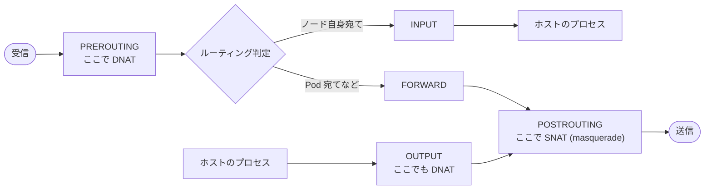
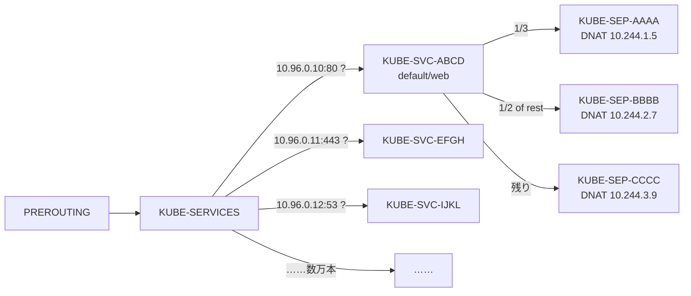
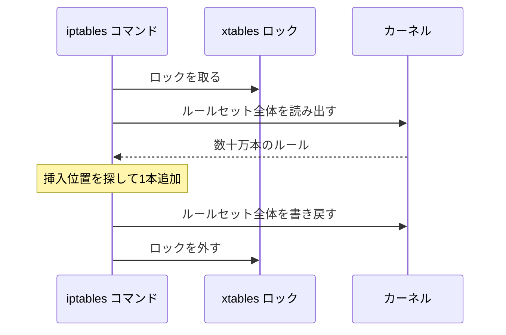
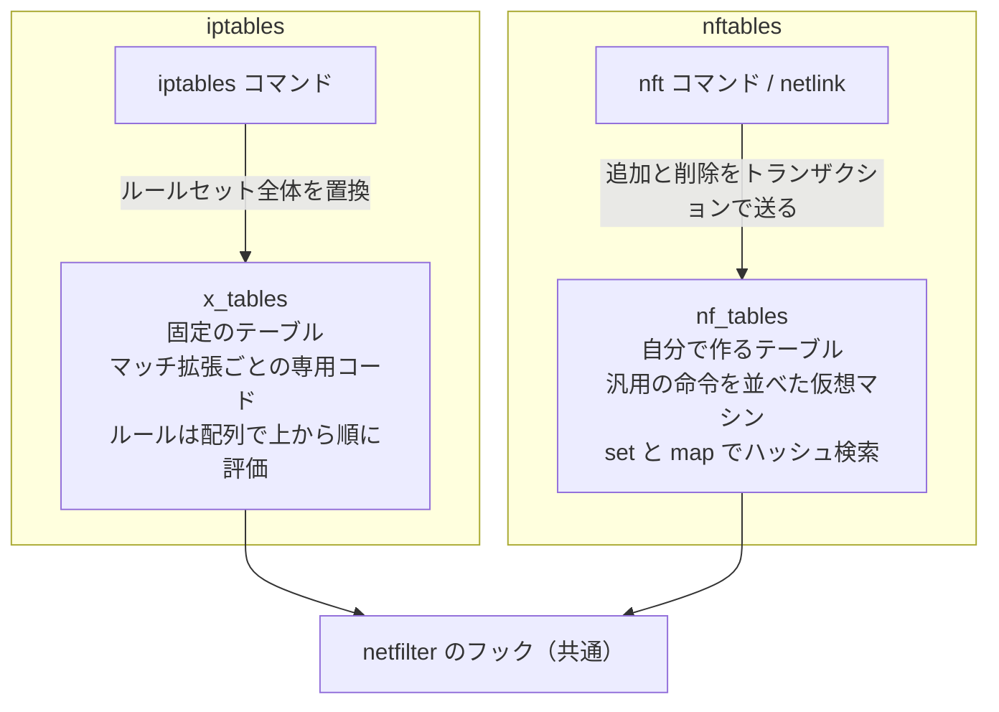
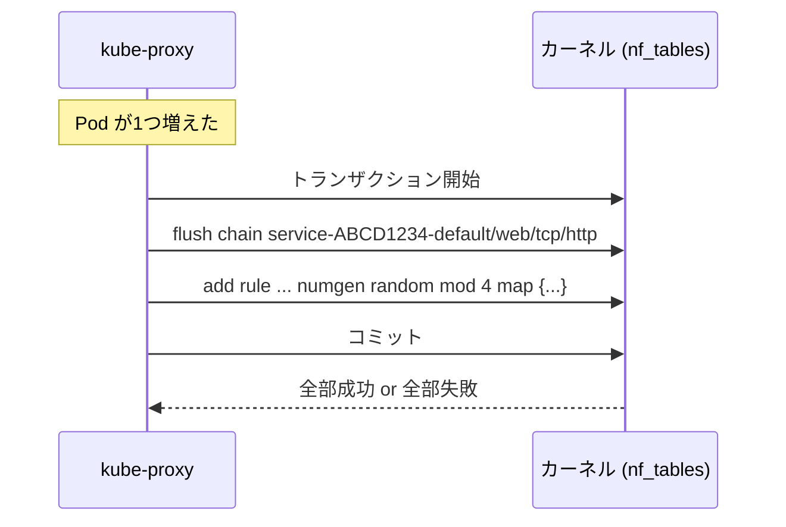
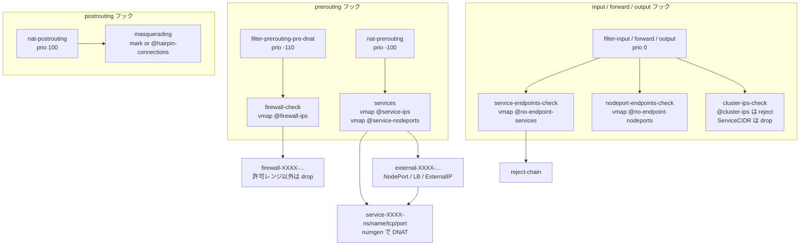
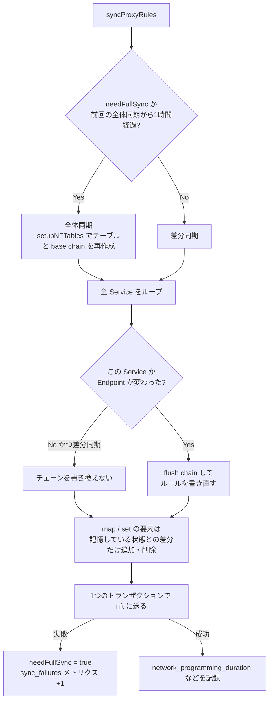
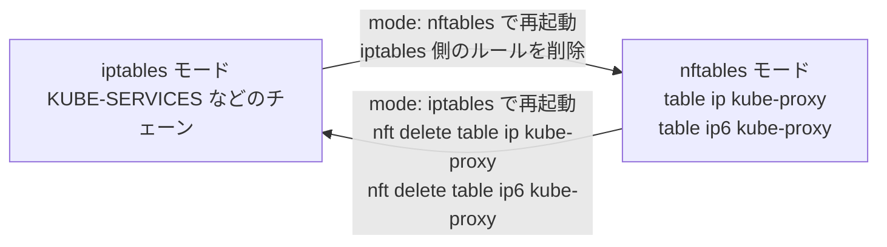

## はじめに

Kubernetes 1.33 で、kube-proxy の nftables モードが GA になりました。
1.37 では IPVS モードが Deprecated になり、1.40 ではデフォルトのモードが iptables から nftables へ切り替わる予定です。

この記事では、以下の内容について説明したいと思います。

1. iptables の構造的な限界
2. nftables による解決の仕組み
3. kube-proxy の実装の変化
4. 移行時の影響範囲

執筆にあたって参考にしたKEPなどは以下になります。

| 資料 | 内容 |
|---|---|
| [KEP-3866](https://github.com/kubernetes/enhancements/blob/master/keps/sig-network/3866-nftables-proxy/README.md) | nftables モードの提案 |
| [KEP-5343](https://github.com/kubernetes/enhancements/tree/master/keps/sig-network/5343-nftables-to-default) | nftables のデフォルト化 |
| [KEP-5495](https://github.com/kubernetes/enhancements/tree/master/keps/sig-network/5495-deprecate-ipvs-mode-in-kube-proxy) | IPVS モードの廃止 |
| [`pkg/proxy/nftables`](https://github.com/kubernetes/kubernetes/tree/master/pkg/proxy/nftables) | kube-proxy の実装とコミット履歴 |


### 対象読者

- Service や ClusterIP は使っているが、その裏側で何が起きているかは知らない人
- iptables という名前は知っているが、チェーンやテーブルの仕組みは曖昧な人
- nftables への移行を検討していて、影響範囲を知りたい人

---

## 前提となる kube-proxy の役割

最初に、kube-proxy の役割をおさらいします。

Kubernetes の Service を作ると、ClusterIP という仮想 IP が割り当てられます。
ところが、この IP を持っているネットワークインターフェースはクラスタのどこにもありません。
Pod が `10.96.0.10:80` に接続すると、そのパケットは途中で宛先を実在する Pod の IP、例えば `10.244.1.5:8080` に書き換えられて届きます。

この宛先の書き換えを行うのが linux の netfilter です。
kube-proxy は各ノードで動き、API サーバから Service と EndpointSlice の変更を受け取ります。
そして、仮想 IP 宛てのパケットを Pod 宛てへ書き換える netfilter のルー
ルを Linux カーネルに登録し続けます。


```text
                 kube-apiserver
                       │  Service / EndpointSlice の変更を watch
                       ▼
                 ┌────────────┐
                 │ kube-proxy │  ルールを生成してカーネルに書き込む
                 └─────┬──────┘
                       │
 ━━━━━━━━━━━━━━━━━━━━━━┿━━━━━━━━━━━━━━━━━━━━━━━━━━━━━━━  ユーザー空間
                       ▼                                  カーネル空間
   Pod A ──▶ [ netfilter のルール ] ──▶ Pod B
   dst: 10.96.0.10:80      │           dst: 10.244.1.5:8080
   (ClusterIP)             └ DNAT で宛先を書き換え
```

kube-proxy ってなんかNode上で動くプロキシなんでしょってイメージを持た
れている方が結構いらっしゃるような印象なんですが、proxy という名前のく
せして、パケットを受け取ったり転送したりする子ではないんです。
Kubernetes のコントローラーパーターンそのもので、Service /
EndpointSlice を watch していて、変更に応じて、 netfilter のルールを
iptables や IPVS といったツールを使って変更するような子なんです。
そして、netfilter の操作に今回 nftables というものを使えるようになった
よという話です。


---

## 第1章 iptables の構造的な限界

### netfilter のフックと iptables のチェーン

Linux カーネルの中には、パケットの経路上に5つのチェックポイントがあります。
これを netfilter のフック（hook）と呼びます。



> 図2 netfilter の5つのフックと、kube-proxy が DNAT と SNAT を行う位置。

外から来たパケットや Pod から出たパケットは PREROUTING を通り、そこで宛先を見てルーティングが決まります。
ノード自身宛てなら INPUT、別の Pod 宛てなら FORWARD に進み、最後に POSTROUTING を通って出ていく。
ノード上のプロセスが出したパケットは OUTPUT から始まります。

iptables は、このフックに対して nat や filter といった固定のテーブルと、PREROUTING や INPUT といった組み込みチェーンを用意しています。
ユーザーはそのチェーンにルールを追加し、処理をまとめたいときは自作のチェーンへジャンプさせます。

### kube-proxy が作る iptables ルール

具体例として、エンドポイントが3つある Service `default/web`（ClusterIP `10.96.0.10`、ポート80）を考えます。
iptables モードの kube-proxy は、nat テーブルに次のようなルールを書きます。

```bash
# 入口。全 Service の ClusterIP がここに1本ずつ並ぶ
-A KUBE-SERVICES -d 10.96.0.10/32 -p tcp --dport 80 -j KUBE-SVC-ABCD

# Service のチェーン。確率で3つのエンドポイントに振り分ける
-A KUBE-SVC-ABCD ! -s 10.244.0.0/16 -d 10.96.0.10/32 -p tcp --dport 80 -j KUBE-MARK-MASQ
-A KUBE-SVC-ABCD -m statistic --mode random --probability 0.33333333349 -j KUBE-SEP-AAAA
-A KUBE-SVC-ABCD -m statistic --mode random --probability 0.50000000000 -j KUBE-SEP-BBBB
-A KUBE-SVC-ABCD -j KUBE-SEP-CCCC

# エンドポイントのチェーン。実際に DNAT する
-A KUBE-SEP-AAAA -s 10.244.1.5/32 -j KUBE-MARK-MASQ
-A KUBE-SEP-AAAA -p tcp -j DNAT --to-destination 10.244.1.5:8080
```

> 図3 iptables モードの kube-proxy が Service 1つのために書く nat テーブルのルール例。

チェーンの関係を図にすると、次の木構造になります。



> 図4 KUBE-SERVICES から KUBE-SVC、KUBE-SEP へと分岐するチェーンの木構造。

確率の値が 1/3、1/2、残りと変化する理由は、ルールを上から順に評価するためです。
最初のルールで 1/3 が抜け、残った 2/3 の半分が次で抜け、最後に残りが全部落ちる。
つまり全体で見た確率はどれも 1/3 なのですが、チェーンの評価のされ方的
にこんな感じで書かなきゃあかんということですね。

これ自体は、なんとなく問題なさそうなんですが、実際は次に説明する限界を引き起こす原
因になっています。


### 限界1. データプレーンの線形探索

KUBE-SERVICES チェーンには、Service の ClusterIP とポートの組ごとに1本のルールが並びます。
新しい接続の最初のパケットが来ると、カーネルはこのチェーンを先頭から1本ずつ比べて、宛先が一致するルールを探します。

```text
パケット dst=10.96.200.7:80 が到着

KUBE-SERVICES
  rule 1     : 10.96.0.1:443   ?  ✗
  rule 2     : 10.96.0.10:53   ?  ✗
  rule 3     : 10.96.0.12:80   ?  ✗
  ...
  rule 29,999: 10.96.200.6:80  ?  ✗
  rule 30,000: 10.96.200.7:80  ?  ✓ ──▶ KUBE-SVC-XXXX へ

  照合回数は Service 数 n に比例する  → O(n)
```

> 図5 KUBE-SERVICES チェーンの線形探索。一致するまで先頭から順に比較する。

同じクラスタの中でも、チェーンの先頭近くにある Service は速く、末尾にある Service は遅いという差が発生します。

2025年の公式ブログ「[NFTables mode for kube-proxy](https://kubernetes.io/blog/2025/02/28/nftables-kube-proxy/)」には、Service 数を変えたクラスタで初回パケットのレイテンシの計測結果があります。

conntrack に登録された後のパケットはこのチェーンを通らないので、影響を受けるのは新しい接続の最初のパケットです。
それでも、短い接続を大量に張るマイクロサービスでは無視できない遅延です。

### 限界2. 差分更新ができない API

もう1つの限界は、ルールを書き換える側にあります。
KEP-3866 はこれをコントロールプレーンの問題と呼んでいます。

iptables のカーネル API には、ルールを1本だけ追加する操作がありません。
`iptables -A` でルールを1本足すだけでも、裏では次の処理が動きます。



> 図6 iptables でルールを1本追加するときの読み出しと書き戻し。

kube-proxy は Pod が1つ増えたり減ったりするたびにルールを更新するので、この読み書きがクラスタの規模に比例して重くなります。

kube-proxy はもともと、同期のたびに全ルールを `iptables-restore` に流し込んでいました。
Kubernetes 1.26 からは [KEP-3453](https://github.com/kubernetes/enhancements/tree/master/keps/sig-network/3453-minimize-iptables-restore) の改善で、変更のない Service のチェーンは送信しなくなりました。
それでも KUBE-SERVICES のような全 Service を並べたチェーンは毎回書き直す必要があり、1回の更新量は Service の総数に比例したままでした。
そのため大規模なクラスタでは、`minSyncPeriod` を設定して同期の間隔を意図的に空ける運用が必要になっていました。

```text
                    1回の同期で送るデータ量

 〜1.25  iptables   ████████████████████████████████  全 Service・全 Endpoint
 1.26〜  iptables   ██████████████                    変更分 + 全 Service の一覧
         nftables   ██                                変更分だけ
```

> 図7 1回の同期で kube-proxy がカーネルへ送るデータ量の比較（模式図）。

### 限界3. 全員で1つのテーブルを共有している

iptables の nat テーブルや filter テーブルは、ノード上の全員で共有する1つの場所です。
kube-proxy、CNI プラグイン、firewalld、Docker などが同じチェーンにルールを書き込みます。

```text
          iptables の nat テーブル（ノードに1つ）
 ┌────────────────────────────────────────────────┐
 │ PREROUTING                                     │
 │   -j KUBE-SERVICES        ← kube-proxy         │
 │   -j CNI-HOSTPORT-DNAT    ← CNI プラグイン     │
 │   -j DOCKER               ← Docker             │
 │ POSTROUTING                                    │
 │   -j KUBE-POSTROUTING     ← kube-proxy         │
 │   -j FIREWALLD_...        ← firewalld          │
 └────────────────────────────────────────────────┘
      書き込むたびに全員が同じロックを奪い合う
```

> 図8 ノード上の全コンポーネントが共有する iptables の nat テーブル。

共有しているので、書き込みのたびに同じロックを奪い合う。
さらに、ファイアウォールが再起動時に全ルールを消してしまい、kube-proxy のルールまで巻き添えで消えることもありました。
KEP-3866 によると、kube-proxy はこれに備えて、canary チェーンが消されていないかを30秒ごとに確認する仕組みまで持っていました。

### 限界4. iptables そのものが終わりに向かっている

nftables は2014年の Linux 3.13 で入った iptables の後継という位置付け
のようです。

KEP-3866 でもこの点は議論されていて、Red Hat が RHEL 9 で iptables を非推奨にし、RHEL 10 では削除される見込みであることを挙げています。
これまで Kubernetes に影響する iptables のバグを直してきたのは Red Hat の開発者が中心だったので、今後の修正は期待しにくいとも判断しています。

### iptables-nft と IPVS では解決しなかった

実際、iptables 1.8 以降には iptables-nft という実装があり、今の主要ディストリビューションの iptables コマンドは大抵こちらです。
コマンドの見た目は iptables のまま、カーネル側では nftables のルールとして登録する。

しかし、KEP-3866 の中でもこれに言及されていますが、
iptables のコマンド体系を保つ以上、set や map のような nftables の新し
い機能は表現できず、ルールは結局1本ずつ並ぶので、本質的な解決にならな
いよねって議論になっています。


#### iptables-nft と nftables のルールを並べてみる

実際に確かめてみます。
使ったのは Debian bookworm のコンテナで、バージョンは iptables v1.8.9 (nf_tables) と nftables v1.0.6 です。
同じ Service 3つ分のルールを2通りの方法で作り、どちらも `nft list` で表示しました。

iptables-nft には、kube-proxy と同じ形のルールを投入します。

```bash
iptables-nft -t nat -A KUBE-SERVICES -d 10.96.0.11/32 -p tcp -m comment --comment "default/svc1 cluster IP" -m tcp --dport 80 -j KUBE-SVC-1
iptables-nft -t nat -A KUBE-SERVICES -d 10.96.0.12/32 -p tcp -m comment --comment "default/svc2 cluster IP" -m tcp --dport 80 -j KUBE-SVC-2
iptables-nft -t nat -A KUBE-SERVICES -d 10.96.0.13/32 -p tcp -m comment --comment "default/svc3 cluster IP" -m tcp --dport 80 -j KUBE-SVC-3
iptables-nft -t nat -A KUBE-SVC-1 -m statistic --mode random --probability 0.5 -j KUBE-SEP-A
iptables-nft -t nat -A KUBE-SVC-1 -j KUBE-SEP-B
iptables-nft -t nat -A KUBE-SEP-A -p tcp -j DNAT --to-destination 10.244.1.5:8080
iptables-nft -t nat -A KUBE-SEP-B -p tcp -j DNAT --to-destination 10.244.2.7:8080
```

`nft list table ip nat` で見ると、カーネル側では確かに nftables のルールになっています。

```text
table ip nat {
    chain KUBE-SERVICES {
        meta l4proto tcp ip daddr 10.96.0.11  tcp dport 80 counter packets 0 bytes 0 jump KUBE-SVC-1
        meta l4proto tcp ip daddr 10.96.0.12  tcp dport 80 counter packets 0 bytes 0 jump KUBE-SVC-2
        meta l4proto tcp ip daddr 10.96.0.13  tcp dport 80 counter packets 0 bytes 0 jump KUBE-SVC-3
    }
    chain KUBE-SVC-1 {
        meta random & 2147483647 < 1073741824 counter packets 0 bytes 0 jump KUBE-SEP-A
        counter packets 0 bytes 0 jump KUBE-SEP-B
    }
    chain KUBE-SEP-A {
        meta l4proto tcp counter packets 0 bytes 0 dnat to 10.244.1.5:8080
    }
    chain KUBE-SEP-B {
        meta l4proto tcp counter packets 0 bytes 0 dnat to 10.244.2.7:8080
    }
}
# Warning: table ip nat is managed by iptables-nft, do not touch!
```

> 図9 iptables-nft が作ったルールを nft で表示したもの。iptables の1ルールが nftables の1ルールに置き換わっただけ。

同じ内容を nftables で直接書くと、次のようになります。

```text
table ip kube-proxy {
    map service-ips {
        type ipv4_addr . inet_proto . inet_service : verdict
        elements = { 10.96.0.11 . tcp . 80 : goto service-svc1,
                     10.96.0.12 . tcp . 80 : goto service-svc2,
                     10.96.0.13 . tcp . 80 : goto service-svc3 }
    }
    chain services {
        ip daddr . meta l4proto . th dport vmap @service-ips
    }
    chain service-svc1 {
        meta l4proto tcp dnat ip to numgen random mod 2 map { 0 : 10.244.1.5 . 8080, 1 : 10.244.2.7 . 8080 }
    }
    chain nat-prerouting {
        type nat hook prerouting priority dstnat; policy accept;
        jump services
    }
}
```

> 図10 同じ3つの Service を nftables で直接書いたもの。Service の振り分けは map とルール1本、エンドポイント選択も1本。

違いは3つあります。

| 観点 | iptables-nft | nftables を直接使う |
|---|---|---|
| Service の振り分け | Service ごとに1本のルールが並ぶ | map の要素が並び、ルールは1本 |
| エンドポイント選択 | `-m statistic` が `meta random` の比較に変換され、エンドポイントのチェーンへ jump | `numgen random` の値で map を引き、その場で DNAT |
| エンドポイントのチェーン | エンドポイントごとに必要 | この例では不要 |

違いがいちばんはっきり出るのは、カーネルが実行する命令列です。
`nft --debug=netlink` で表示すると、iptables-nft 側は宛先 IP だけ違う命令の塊が Service の数だけ続きます。

```text
iptables-nft の KUBE-SERVICES
  ip nat KUBE-SERVICES 3
    [ meta load l4proto => reg 1 ]
    [ cmp eq reg 1 0x00000006 ]                          ← TCP か
    [ payload load 4b @ network header + 16 => reg 1 ]
    [ cmp eq reg 1 0x0b00600a ]                          ← 宛先が 10.96.0.11 か
    [ match name comment rev 0 ]                         ← -m comment は xtables 互換の match のまま
    [ payload load 2b @ transport header + 2 => reg 1 ]
    [ cmp eq reg 1 0x00005000 ]                          ← 宛先ポートが 80 か
    [ counter pkts 0 bytes 0 ]
    [ immediate reg 0 jump -> KUBE-SVC-1 ]
  ip nat KUBE-SERVICES 5 3
    （宛先 IP だけ違う同じ命令が続く。Service の数だけ繰り返し）

nftables の services
  ip kube-proxy services 9
    [ payload load 4b @ network header + 16 => reg 1 ]   ← 宛先 IP
    [ meta load l4proto => reg 9 ]                       ← プロトコル
    [ payload load 2b @ transport header + 2 => reg 10 ] ← 宛先ポート
    [ lookup reg 1 set service-ips dreg 0 0x0 ]          ← map を1回検索
```

> 図11 カーネル内の命令列の比較。iptables-nft は比較の繰り返し、nftables は map の1回の検索。

ここで Service を1つ追加すると、iptables-nft 側は KUBE-SERVICES に4本目のルールが増えます。
nftables 側のルールは1本のままで、map に `10.96.0.14 . tcp . 80 : goto service-svc4` という要素が1つ増えるだけです。

iptables-nft は、iptables の1ルールを nftables の1ルールに翻訳するだけです。
iptables のコマンドに「map を引く」という書き方がない以上、ルールを map にまとめることはできず、上から順に比べる構造がそのまま残ります。

もう1つの候補だった IPVS モードは非常に高速ですが、課題が残りました。
IPVS はカーネル内のロードバランサで、振り分け自体はハッシュテーブルで高速です。
しかし IPVS だけでは Service の仕様を実装しきれず、masquerade や drop などで結局 iptables に大きく依存しています。
全 Service IP を `kube-ipvs0` というダミーデバイスに割り当てる必要があ
ることや、IPVS 自体も活発に開発されていないことなどが課題です。

| 方式 | ルールの評価 | 更新の単位 | iptables 非推奨の影響 |
|---|---|---|---|
| iptables-legacy | 線形 | 全体 | 受ける |
| iptables-nft | 線形 | 全体 | 受ける |
| IPVS + iptables | ハッシュ | 一部は差分 | iptables 部分が受ける |
| nftables | ハッシュ | 差分 | 受けない |

こうして、nftables を直接使う kube-proxy が必要であるという方向に向かっています。

---

## 第2章 nftables は何を変えたのか

### 同じ netfilter の上にある別のルールエンジン

最初の前提として、nftables も iptables と同じ netfilter のフックを使います。
パケットの経路は同じ。
変化点は、フックに登録するルールの形式とカーネル内の評価方法です。



> 図12 x_tables と nf_tables の違い。フックは共通で、ルールの形式と評価方式が別物。

iptables では、`-m tcp` や `-m statistic` などのマッチごとにカーネル側の専用コードが存在しました。
nftables では、ルールをバイト読み出し、比較、set 検索などの小さな命令列に変換し、カーネル内の仮想マシンで実行します。
カーネルへの機能追加なしに、命令の組み合わせで多様な処理を表現できます。

### 自分専用のテーブルと base chain

nftables には、iptables の nat や PREROUTING のような固定のテーブルやチェーンがありません。
各アプリケーションが専用テーブルを作成し、接続先フックと優先度を指定したチェーンをその中に定義します。
フックにつながったチェーンを base chain と呼びます。


> 図13 同じ prerouting フックに複数テーブルの base chain がつながる様子。priority の小さい順に実行。

-110 の chain からは DNAT 前の宛先、つまり Service の IP が見えます。
priority 0 の chain に届く時点では、宛先はすでに Pod の IP です。

同一フックに複数テーブルのチェーンが接続されている場合、priority の小さい順に実行します。
他コンポーネントは kube-proxy のテーブルを変更する必要がありません。
自分のテーブルの priority 設定だけで、kube-proxy の DNAT の前後どちらで処理するかを選択できます。

テーブルが分かれているので、firewalld を再起動しても消えるのは firewalld のテーブルだけ。
書き込みも自テーブル内で完結するため、iptables のようなロック競合も発生しません。

### set と verdict map

nftables の最大の特徴は set と map です。
set は値の集合、map はキーと値の対応表で、カーネル内ではハッシュテーブルなどで実装します。
値として、飛び先のチェーンを示す判定（verdict）を持つ map を verdict map と呼びます。

```text
map service-ips {
    type ipv4_addr . inet_proto . inet_service : verdict
    elements = {
        10.96.0.10 . tcp . 80  : goto service-ABCD1234-default/web/tcp/http,
        10.96.0.11 . tcp . 443 : goto service-EFGH5678-default/api/tcp/https,
        ...
    }
}

chain services {
    ip daddr . meta l4proto . th dport vmap @service-ips
}
```

> 図14 Service の振り分けを verdict map 1つと1本のルールで表した例。

`ip daddr . meta l4proto . th dport` は、宛先 IP、L4 プロトコル、宛先ポートの連結キーです。
このキーで map を検索し、一致要素の verdict（この例では goto）を実行します。

```text
パケット dst=10.96.200.7:80/tcp が到着

  キーを作る    10.96.200.7 . tcp . 80
       │
       ▼   hash
 ┌──────────────── service-ips (map) ────────────────┐
 │ bucket 0 : 10.96.0.1 . tcp . 443  → goto ...      │
 │ bucket 1 : 10.96.0.10 . tcp . 80  → goto ...      │
 │   ...                                             │
 │ bucket k : 10.96.200.7 . tcp . 80 → goto svc-X    │ ◀ ここに直接たどり着く
 │   ...                                             │
 └───────────────────────────────────────────────────┘

  Service 数によらず、ほぼ一定時間で引ける  → O(1)
```

> 図15 連結キーのハッシュ検索。Service 数によらずほぼ一定時間。

公式ブログの計測では、nftables の初回パケットレイテンシは Service 数の増加でもほぼ一定で、p01 と p99 の差もわずかでした。
3万 Service のクラスタでは、nftables の p99 が iptables の p01 を数マイクロ秒下回っています。
nftables で最も遅い部類のパケットが、iptables で最も速い部類のパケットより速い。
IPVS との比較でも、nftables がわずかに高速でした。

### トランザクションで差分だけを送る

ルール更新の仕組みも変化しました。
nftables の API では、map への要素追加やチェーン削除などの操作を列挙し、1つのトランザクションとしてカーネルへ送信できます。



> 図16 差分だけを1つのトランザクションで送る nftables の更新。

トランザクションは全体が成功するか、全体が失敗するかの二択。
部分的に反映された状態をパケットが観測することはありません。
送信データは変更対象の Service 分だけで、更新量はクラスタ規模に依存しません。

ここまでの対応関係を整理します。

| iptables の限界 | nftables での解決 |
|---|---|
| Service 数に比例する線形探索 | verdict map によるハッシュ検索 |
| 全ルールの読み書きが必要 | 差分だけを送るトランザクション |
| 全員で共有するテーブルとロック | コンポーネントごとの専用テーブル |
| 開発停止と非推奨化 | 現在の Linux の標準パケットフィルタ |

---

## 第3章 kube-proxy の実装はどう変わったか

ここからは、`pkg/proxy/nftables/proxier.go` の実装を追っていきます。

### 全体の構造

nftables モードの kube-proxy は、IPv4 用に `ip kube-proxy`、IPv6 用に `ip6 kube-proxy` という2つのテーブルを作ります。
自分のチェーンや map は全てこのテーブルの中に置く。
コードでは `NewDualStackProxier` が IPv4 と IPv6 の Proxier を1つずつ作り、`MetaProxier` で統合します。

IPv4 と IPv6 を両方入れられる inet ファミリーのテーブルを1つにしなかった理由も KEP に記載があります。
IPv4 と IPv6 のどちらのアドレスも入る型がないため、set や map はどのみちファミリーごとに分ける必要があり、1つにまとめても単純化しないためです。

テーブルの中には、フックにつながる8つの base chain があります。

| チェーン | type | hook | priority | 役割 |
|---|---|---|---|---|
| `filter-prerouting-pre-dnat` | filter | prerouting | dstnat-10（-110） | DNAT 前の LoadBalancerSourceRanges 判定 |
| `filter-output-pre-dnat` | filter | output | dstnat-10（-110） | 同上（ホストプロセス発） |
| `nat-prerouting` | nat | prerouting | dstnat（-100） | 外部・Pod 発の DNAT |
| `nat-output` | nat | output | dstnat（-100） | ホストプロセス発の DNAT |
| `filter-input` | filter | input | filter（0） | エンドポイントなしの拒否 |
| `filter-forward` | filter | forward | filter（0） | エンドポイントなしの拒否、未割り当て ClusterIP の破棄 |
| `filter-output` | filter | output | filter（0） | 同上（ホストプロセス発） |
| `nat-postrouting` | nat | postrouting | srcnat（100） | masquerade |

base chain からは、用途ごとの通常のチェーンにジャンプします。
全体の接続関係は次の図のとおりです。



> 図17 kube-proxy テーブル内の base chain と主要チェーン、map の関係。

`ct state new` の条件付きでジャンプしているルールが多く、確立済みの接続は filter 系のチェックを通りません。

### パケットの流れをイメージしてみる

Pod `10.244.0.20` が Service `default/web` の ClusterIP `10.96.0.10:80` に接続するときの流れを、実際のルールで追ってみます。
エンドポイントは3つとする。

```text
① Pod から送信   src=10.244.0.20  dst=10.96.0.10:80
   │
   │  prerouting フック
   ▼
② filter-prerouting-pre-dnat (-110)
   ct state new jump firewall-check
   └ firewall-check:  ip daddr . meta l4proto . th dport vmap @firewall-ips
                      → この Service は LoadBalancerSourceRanges なしなので素通り
   │
   ▼
③ nat-prerouting (-100)
   jump services
   └ services:  ip daddr . meta l4proto . th dport vmap @service-ips
                → 10.96.0.10 . tcp . 80 にヒット
                → goto service-ABCD1234-default/web/tcp/http
   │
   ▼
④ service-ABCD1234-default/web/tcp/http
   meta l4proto tcp dnat ip addr . port to numgen random mod 3 map {
       0 : 10.244.1.5 . 8080,
       1 : 10.244.2.7 . 8080,
       2 : 10.244.3.9 . 8080 }
   → 乱数が 1 なら dst=10.244.2.7:8080 に書き換え
   │
   │  ルーティング判定 → 別ノードの Pod なので forward へ
   ▼
⑤ filter-forward (0)
   ct state new jump service-endpoints-check  → 該当なし
   ct state new jump cluster-ips-check        → もう ClusterIP 宛てではないので該当なし
   │
   ▼
⑥ nat-postrouting (100)
   jump masquerading
   └ mark も立っておらず hairpin でもないので masquerade しない
   │
   ▼
⑦ 送信   src=10.244.0.20  dst=10.244.2.7:8080
```

> 図18 Pod から ClusterIP への接続でパケットが通るチェーンと書き換えの順序。

iptables モードでは③　のところでルールを順に比べていたところが、map の1回の検索に置き換わりました。
④のエンドポイント選択も、確率つきのルールを上から並べる代わりに `numgen random mod 3` で乱数を作り、その値で map を引きます。

### エンドポイント選択は3通り

④のサービスチェーンの中身は、Service の状態によって3通りに分かれます。

```text
 エンドポイントが1つ
   service-XXXX
     meta l4proto tcp dnat to 10.244.1.5:8080

 エンドポイントが複数（affinity なし）
   service-XXXX
     meta l4proto tcp dnat ip addr . port to numgen random mod 3 map { 0 : ..., 1 : ..., 2 : ... }

 sessionAffinity: ClientIP
   service-XXXX
     ip saddr @affinity-...10.244.1.5 goto endpoint-...10.244.1.5   ← 過去に使った先があればそこへ
     ip saddr @affinity-...10.244.2.7 goto endpoint-...10.244.2.7
     numgen random mod 2 vmap { 0 : goto endpoint-..., 1 : goto endpoint-... }
   endpoint-...10.244.1.5
     update @affinity-...10.244.1.5 { ip saddr }                  ← 送信元を記録
     meta l4proto tcp dnat to 10.244.1.5:8080
```

> 図19 エンドポイント数と session affinity の有無で変わるサービスチェーンの3つの形。

エンドポイントが1つのときに map を使わないのは、map の作成が要素数に対して O(n) 以上かかるからだとコードのコメントにあります。

エンドポイントごとのチェーンを作るのは、session affinity を使う Service だけです。
1.36 より前は、全 Service でエンドポイントごとのチェーンを作っていました。
「[Squash nftables endpoint chains into service vmap](https://github.com/kubernetes/kubernetes/commit/475f9622c8)」のコミット以降、affinity なしの場合は省略されます。
affinity の記録には timeout 付きの set を使い、送信元 IP を入れておきます。
set の要素は時間が来るとカーネルが自動で消すので、kube-proxy が掃除する必要はありません。

### masquerade と hairpin

DNAT されたパケットの返りを正しく戻すため、送信元を書き換える(SNAT) masquerade が必要になる場合があります。
例えばクラスタ外から ClusterIP に来たパケットや、Pod が自分自身を指す Service に接続した hairpin の場合です。

masquerade は postrouting でしかできないので、どこかで「このパケットは masquerade が必要だ」と判断して、postrouting まで伝える必要があります。
iptables モードでは、KUBE-MARK-MASQ チェーンでパケットに mark を付けて伝えていました。
nftables モードの `masquerading` チェーンは以下のようなルールです。

```text
chain masquerading {
    mark and 0x4000 != 0 mark set mark xor 0x4000 masquerade fully-random
    ct status dnat ip saddr . ip daddr . meta l4proto . th dport @hairpin-connections masquerade fully-random
}
```

> 図20 masquerading チェーンの2本のルール。0x4000 はデフォルトの masquerade ビット。

1本目は mark が立っているパケットを masquerade する。
クラスタ外から ClusterIP に来たパケットには、`services` チェーンの先頭のルールでこの mark が付きます。

2本目が hairpin の判定。
`hairpin-connections` という set には、ノード上のエンドポイントごとに「送信元 IP・宛先 IP・プロトコル・ポート」の組を登録します。
送信元と宛先には、同じエンドポイントの IP を入れておきます。
DNAT 済みのパケットがこの組に一致したら、自分から自分への通信とみなして masquerade します。

```text
 hairpin-connections (set)
 ┌──────────────────────────────────────────────┐
 │ 10.244.0.20 . 10.244.0.20 . tcp . 8080       │
 │ 10.244.0.31 . 10.244.0.31 . tcp . 9090       │
 └──────────────────────────────────────────────┘

 Pod 10.244.0.20 → ClusterIP → DNAT で 10.244.0.20:8080（自分自身）
   ct status dnat かつ 10.244.0.20 . 10.244.0.20 . tcp . 8080 ∈ set
   → masquerade して、返りのパケットがノードを経由するようにする
```

> 図21 hairpin-connections set による自分宛て通信の判定。

以前はエンドポイントごとに「送信元が自分なら mark」というルールを置き、補助チェーンの `mark-for-masquerade` にジャンプしていました。
2026年1月のコミット「[Remove mark-for-masquerade chain](https://github.com/kubernetes/kubernetes/commit/5cffb4d1f6)」によると、今のカーネルはジャンプの多い巨大なルールセットで、ループ検出の処理が遅くなるそうです。
そこで補助チェーンを廃止し、hairpin 判定も1つの set に集約しました。
これで、エンドポイントごとに1本と Service ごとに1〜2本あったジャンプがなくなります。

### エンドポイントがない Service と ClusterIP の保護

エンドポイントが1つもない Service にパケットが来た場合、kube-proxy は接続を拒否します。
これも map で実装する。

```text
map no-endpoint-services {
    type ipv4_addr . inet_proto . inet_service : verdict
    elements = {
        10.96.0.50 . tcp . 80 : goto reject-chain,   ← エンドポイントが1つもない
        10.96.0.51 . tcp . 80 : drop,                ← Local ポリシーでローカルにない
    }
}

chain reject-chain {
    reject
}
```

> 図22 エンドポイントのない Service を drop または reject する verdict map。

reject は verdict ではないため、map の値として直接書けません。
そのため、補助チェーンの `reject-chain` を経由します。

このチェックは prerouting ではなく、input、forward、output の3か所で行います。
コードの README によると、カーネル 5.9 より前は prerouting で reject が使えなかったからです。

加えて nftables モードには、iptables モードにない保護が2つ入りました。
存在する ClusterIP の定義されていないポートへのパケットは reject され、ServiceCIDR の中でまだ割り当てられていない IP へのパケットは drop されます。
どちらも `cluster-ips-check` チェーンが、DNAT より後の priority 0 で判定します。
正当なパケットはその時点で DNAT 済みなので、宛先が ClusterIP のまま残っているパケットだけが引っかかる仕組みです。

### LoadBalancerSourceRanges

`LoadBalancerSourceRanges` は、LoadBalancer IP に接続できる送信元を制限する機能です。
DNAT した後では元の宛先が分からなくなるので、priority -110 の `filter-prerouting-pre-dnat` で、DNAT より先に判定します。

```text
firewall-check:
  ip daddr . meta l4proto . th dport vmap @firewall-ips
    203.0.113.10 . tcp . 443 : goto firewall-XXXX-default/web/tcp/https

firewall-XXXX-default/web/tcp/https:
  ip saddr != { 192.168.0.0/24, 198.51.100.0/24 } drop
```

> 図23 LoadBalancerSourceRanges の判定。firewall-ips から Service ごとのチェーンへ振り分け。

当初の実装は、範囲を含む連結キーの set を1つだけ使う形でしたが、これはカーネル 5.6 以降でしか動きませんでした。
5.4 がまだ広く使われていたため、2024年1月に「[wider kernel support](https://github.com/kubernetes/kubernetes/commit/377f521038)」として、Service ごとのチェーンに振り分ける今の形へ書き直されました。

### kube-proxy の差分同期

kube-proxy が Service や EndpointSlice の変更を受け取ると、`syncProxyRules` が呼ばれます。



> 図24 syncProxyRules の全体同期と差分同期の分岐。

普段は差分同期で、変更のあった Service のチェーンだけを書き直す。
map や set の要素は、kube-proxy が前回書いた内容をメモリに持っていて、その差分だけを送ります。
全体を作り直すのは、1時間に1回とトランザクションが失敗した直後だけ。

2024年7月にこの差分同期を入れたコミット「[Add partialSync mode](https://github.com/kubernetes/kubernetes/commit/3ccf5b8a55)」には、kind での測定値の記載があります。

| 条件 | 差分同期なし | 差分同期あり |
|---|---|---|
| 1万 Service（各2エンドポイント）の作成 | 約25分 | 約9分 |
| 作成中の最大メモリ | 約650 MiB | 約260 MiB |
| 1万 Service がある状態で1つ追加 | 約8分 | 約141ミリ秒 |

使われなくなったサービスチェーンの消し方にも工夫があります。
カーネル 6.2 より前は、チェーンを指していた map 要素を消しても、カーネルがチェーンの参照がなくなったと気づくまで少し時間がかかります。
そのため、不要になったチェーンはまず中身を空にして記録しておき、1秒以上経過した後の同期で削除します。

iptables モードにあった30秒ごとの canary チェックは、nftables モードにはありません。
他のコンポーネントは自分のテーブルしか消さない前提のためです。

### 起動にはカーネル 5.13 と nft 1.0.1 が必要

nftables モードは、カーネル 5.13 以上でないと起動しません。
`supported.go` のコメントを読むと、この数字には少し込み入った事情があります。

本当に必要なのは、ホストに入っている nft コマンドが 1.0.1 以上であることです。
1.0.1 より前の nft は、自分に関係のないテーブルまで全部パースしようとする。
kube-proxy が新しい nft でルールを書くと、ホストの古い nft がそれを読めずにクラッシュします。
するとホスト側のファイアウォール操作までできなくなるおそれがありました（[kubernetes#122743](https://issues.k8s.io/122743)）。
しかしホストの nft のバージョンを確実に調べる方法がないので、同じディストリビューションならカーネルと nft の世代はそろっているだろうと仮定し、カーネルのバージョンで代替判定します。
環境変数 `KUBE_PROXY_NFTABLES_SKIP_KERNEL_VERSION_CHECK` を設定すれば、このチェックは回避できます。

カーネルとのやり取りには、Kubernetes が開発した Go ライブラリ [sigs.k8s.io/knftables](https://github.com/kubernetes-sigs/knftables) を使います。
KEP の設計では、書き込みは nft コマンドにテキストで流し、読み出しだけ JSON を使う方針でした。
1.37 では `NFTablesNetlink` feature gate が Beta になり、デフォルトで有効になりました。
これにより、nft バイナリを実行せず netlink でカーネルと直接やり取りします。
KEP-5343 は、nft のバージョン違いによるクラッシュを、残っている最大の不安定要因として挙げていました（[kubernetes#136786](https://github.com/kubernetes/kubernetes/issues/136786)）。
kube-proxy のイメージに入っている nft と、ホストの別バージョンの nft がお互いのルールを読めなくなる問題です。

### モードの切り替えはノードを再起動せずにできる

iptables モードと nftables モードは、kube-proxy を再起動するだけで行き来できます。
nftables モードで起動すると iptables と IPVS のルールを消し、iptables モードに戻すと nftables のテーブルを消します。



> 図25 モード切り替え時の後片付け。nftables 側はテーブル2つの削除だけ。

nftables 側の後片付けは、`cleanup.go` を見るとテーブルを2つ消すだけです。
自分のルールを全部自分のテーブルに閉じ込めているので、テーブルを消せば痕跡は残らない。
KEP では、ロールバックがうまくいかなかったときに管理者が手動でこの2行を実行してよいとまで記述しています。

---

## 第4章 移行すると何が変わるか

### 性能

データプレーンでは、第2章のとおり初回パケットのレイテンシが Service 数に依存しなくなります。
コントロールプレーンでは更新が差分化され、大規模クラスタでも `minSyncPeriod` による同期の間引きが不要になりました。

KEP-3866 は GA の判定について、同一条件での比較値がないことを明記しています。
1000ノードの性能試験で、`minSyncPeriod: 10s` を iptables 側だけが使用しているためです。
nftables 側の CPU 使用量が多い理由も、同期回数の多さだと説明しています。
そのうえで、同期間隔を絞らずにクラスタが安定稼働している事実を、効率の良さの証拠と位置づけています。

### 意図的に変えられた挙動

nftables モードは、利用者が明示的に選択する opt-in のモードです。
そのため、iptables モードでは互換性維持のため変更できなかったデフォルト挙動を、この機会に見直しました。
移行前の確認点は次のとおりです。

| 項目 | iptables モード | nftables モード |
|---|---|---|
| NodePort を受ける IP | ノードの全ローカル IP | ノードのプライマリ IP だけ（`--nodeport-addresses primary`） |
| `127.0.0.1` での NodePort | 使える | デフォルトでは使えない。1.37 で Alpha の `KubeProxyNFTablesLocalhostNodePorts` を有効にすると使える |
| ホストのファイアウォール対策 | NodePort などに ACCEPT ルールを入れる | 入れない。ファイアウォール側で許可が必要 |
| conntrack INVALID パケットの drop | 入れる | 入れない。必要なら `--conntrack-tcp-be-liberal` |
| ClusterIP の未定義ポート | 特に何もしない | reject |
| ServiceCIDR 内の未割り当て IP | 特に何もしない | drop |

localhost の NodePort がデフォルトで無効になったのは、セキュリティ上の理由です。
iptables モードでの実現には sysctl の `route_localnet` の有効化が必要で、これは CVE-2020-8558 の原因になった設定です。
IPv6 ではそもそも NAT 方式で実現できない。
KEP-3866 の時点では非対応と決定しましたが、移行の障害になったため、[KEP-6032](https://github.com/kubernetes/enhancements/issues/6032) でユーザー空間の TCP プロキシとして復活しました。

ファイアウォール対策の廃止も nftables の仕組みに起因します。
nftables の accept は、処理中のテーブルの評価を終了するだけです。
後から別のテーブルが drop すれば、パケットは破棄される。
kube-proxy がホストのファイアウォールを迂回させる手段がないため、ファイアウォール側で NodePort 範囲を許可する運用に変わります。

これらの挙動への依存有無は、iptables モードのまま次のメトリクスで確認できます。

| メトリクス | 0 でない場合の意味 |
|---|---|
| `kubeproxy_iptables_ct_state_invalid_dropped_packets_total` | conntrack の回避策に依存している |
| `kubeproxy_iptables_localhost_nodeports_accepted_packets_total` | どこかのクライアントが localhost の NodePort を使っている |

### CNI、NetworkPolicy、監視ツール

多くの CNI プラグインは、kube-proxy のルールを直接操作しない限り、iptables と nftables の違いに影響されません。
影響を受けるのは、KUBE-SERVICES や KUBE-MARK-MASQ などのチェーン名を前提に独自ルールを挿入していた実装です。

実は2022年の公式ブログ「[Kubernetes's IPTables Chains Are Not API](https://kubernetes.io/blog/2022/09/07/iptables-chains-not-api/)」で、iptables のチェーン名は API ではないと明言されていました。
それでも実際にはチェーン名依存のコンポーネントが存在し、変更困難な状態が続いていました。
nftables モードでは、他のコンポーネントとの連携方法を README で明文化しています。

```text
 他のコンポーネントが守ること
   ・kube-proxy テーブルの中身を変更しない
   ・自分のテーブルを作り、base chain の priority で前後を決める

 kube-proxy が保証すること
   ・Service の DNAT は type nat / priority dstnat（prerouting と output）で行う
       それより前の chain には Service IP が、後の chain には Endpoint IP が見える
   ・masquerade は type nat / hook postrouting / priority srcnat で行う
       それより前の chain には元の送信元 IP が見える
   ・エンドポイントなしの drop / reject は priority filter（input, forward, output）で行う

 保証しないこと
   ・masquerade に使う mark のビット
```

> 図26 kube-proxy の nftables README が定める他コンポーネントとの連携ルール。

監視ツールにも注意が必要です。
iptables モードのルール数やチェーン数を集計するツールでは、nftables モードで取得できる情報量が減る場合もあります。
KEP-3866 は、nftables では map の要素がほぼ O(1) で引けるので、ルール数は性能の目安にならないと述べています。
代わりに `sync_proxy_rules_nftables_sync_failures_total` や `network_programming_duration_seconds` を見ます。

### デバッグの方法が変わる

ノード上でルールを確認するコマンドも変わります。

```bash
# iptables モード
iptables-save -t nat | grep 'default/web'

# nftables モード：kube-proxy のテーブル全体
nft list table ip kube-proxy

# 特定の map だけ
nft list map ip kube-proxy service-ips

# 特定 Service のチェーン（チェーン名に namespace/name が入っている）
nft list table ip kube-proxy | grep -A5 'default/web'
```

nftables のチェーン名は `service-ABCD1234-default/web/tcp/http` のような形です。
ハッシュの後ろに、namespace と Service 名、プロトコル、ポート名が続く。
iptables の `KUBE-SVC-XPGD46QRK7WJZT7O` のようなハッシュだけの名前と比べると、どの Service のチェーンか一目で判別できます。
チェーン名の上限が iptables の30文字から nftables の256文字に拡大したためです。

### 移行の手順とこれから

1.31 以降なら、kube-proxy の設定で `mode: nftables` を指定し、Pod を再起動するだけで移行できます。

```yaml
apiVersion: kubeproxy.config.k8s.io/v1alpha1
kind: KubeProxyConfiguration
mode: nftables
```

今後の予定は KEP-5343 と KEP-5495 に記載があります。

| バージョン | 出来事 | 根拠 |
|---|---|---|
| 1.29 | nftables モード Alpha（`NFTablesProxyMode`） | KEP-3866 |
| 1.31 | Beta | KEP-3866 |
| 1.33 | GA | KEP-3866 |
| 1.35 | IPVS モードが起動時に警告を出す | KEP-5495 |
| 1.37 | `KubeProxyIPVS` が Deprecated、既定値の iptables に警告、`NFTablesNetlink` Beta、localhost NodePort Alpha | KEP-5343、KEP-5495、KEP-6032 |
| 1.39（予定） | kubeadm が 5.4 と 5.10 のカーネルを受け付けなくなる | KEP-5343 |
| 1.40（予定） | デフォルトのモードを nftables に変更 | KEP-5343 |

1.37 からは、`--proxy-mode` 未指定でデフォルトの iptables になった kube-proxy が警告を出します。
1.40 でデフォルトが nftables に変わったとき、`mode` を指定していないクラスタは、アップグレードした時点で nftables に切り替わります。
今のうちに `mode` を明示的に指定しておくのが安全です。

IPVS モードには別リポジトリへの移設案もありましたが、最終的にはリポジトリから削除する方針に決まりました。
IPVS 利用中のクラスタは、nftables への移行計画が必要です。

一方で、KEP-5343 は解決しきれていない課題も挙げています。
大量の Service があるクラスタに新しいノードを追加したとき、最初の全体同期に時間がかかる問題。
関連修正は入っていますが、未解決なら巨大な同期を複数回に分割して送る方式への変更が必要だとしています。

---

## 参考文献

1. [KEP-3866: Add an nftables-based kube-proxy backend](https://github.com/kubernetes/enhancements/blob/master/keps/sig-network/3866-nftables-proxy/README.md)
2. [KEP-5343: Make nftables the default kube-proxy backend](https://github.com/kubernetes/enhancements/tree/master/keps/sig-network/5343-nftables-to-default)
3. [KEP-5495: Deprecate ipvs mode in kube-proxy](https://github.com/kubernetes/enhancements/tree/master/keps/sig-network/5495-deprecate-ipvs-mode-in-kube-proxy)
4. [KEP-6032: localhost NodePort userspace proxy for nftables](https://github.com/kubernetes/enhancements/issues/6032)
5. [KEP-3453: Minimizing iptables-restore input size](https://github.com/kubernetes/enhancements/tree/master/keps/sig-network/3453-minimize-iptables-restore)
6. [kubernetes/kubernetes pkg/proxy/nftables](https://github.com/kubernetes/kubernetes/tree/master/pkg/proxy/nftables)（`proxier.go`、`supported.go`、`cleanup.go`、`README.md`）
7. [NFTables mode for kube-proxy（Kubernetes Blog, 2025-02-28）](https://kubernetes.io/blog/2025/02/28/nftables-kube-proxy/)
8. [Kubernetes's IPTables Chains Are Not API（Kubernetes Blog, 2022-09-07）](https://kubernetes.io/blog/2022/09/07/iptables-chains-not-api/)
9. [Virtual IPs and Service Proxies（Kubernetes Documentation）](https://kubernetes.io/docs/reference/networking/virtual-ips/)
10. [sigs.k8s.io/knftables](https://github.com/kubernetes-sigs/knftables)
11. [kubernetes#122743: figure out / document nftables version requirements](https://issues.k8s.io/122743)
