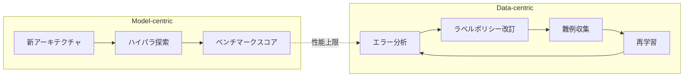
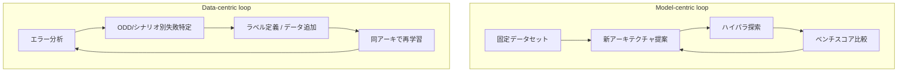
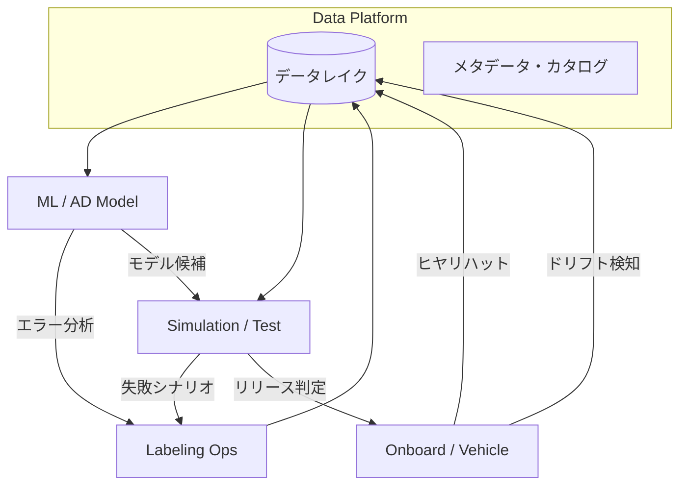

# 1.1 モデル中心からデータ中心へ：自動運転開発パラダイムの転換

自動運転 (autonomous driving; AD) の開発パラダイムは、ルールベース／モデル中心 (model-centric) から **データ中心 (data-centric)** へ移行してきました。本節では、その経緯を俯瞰します。あわせて、ロングテール (long-tail; 頻度は低いが種類は多い分布の裾) とデータ品質が、なぜ安全性に直結するのかを定量的に整理します。本書全体を貫く **Closed-Loop データエンジン** の出発点となる視点を共有することが狙いです。

## ルールベースから学習ベースへ

自動運転の初期世代では、システムの大部分がルールベース (rule-based) あるいはモジュラー (modular; モジュール分割型) な構成をとっていました。センサから取得した情報に対し、人間のエンジニアが条件分岐やしきい値を細かく設計します。知覚 (perception; 周囲環境の認識) もクラシカルなコンピュータビジョンと信号処理が中心でした。

その後、深層学習 (deep learning) と GPU ハードウェアの進化に伴い、画像認識・物体検出・軌道予測などのサブタスクは深層ニューラルネットワーク (deep neural network; DNN) が主役になりました。NVIDIA による End-to-End Learning for Self-Driving Cars [P1](references#p1)（PilotNet, 2016）はその象徴的な研究です。フロントカメラ画像から操舵角を直接推定する単一の畳み込みネットワークを示しました。以降、Waymo / Cruise / Mobileye / Tesla / Zoox / NIO / BYD などの主要プレイヤーは、知覚モジュール、予測モジュール、計画モジュールをそれぞれ学習ベース (learning-based) のモデルへ置き換える流れを加速させてきました。

その流れのなかで、開発の焦点はいつしか **「より複雑なモデルアーキテクチャを試す」** という model-centric な探索に向かいました。ハイパーパラメータ探索、ネットワーク深度・幅の拡大、新しい損失関数の設計などです。学術コンペティションではきわめて有効な戦略でした。しかし自動運転は「実世界＋安全クリティカル＋ロングテール」が同時に成立するタスクであり、ここでいくつかの限界が次第に明らかになってきました。

## モデル中心アプローチの限界

モデル中心アプローチでは、固定された学習データセットを前提として、その上で最高のスコアを出すモデルを追求します。この姿勢は、以下の3つの限界を抱えています。

1. **データセットが現実分布をカバーしないと、モデル変更だけでは性能が上がらない**。たとえば、KITTI や nuScenes のような大規模データセットも、収集された地域・センサ構成・気象条件に強く依存します。同じデータセット上でモデルを変えても、未収録の ODD（Operational Design Domain; 運用設計領域。システムが安全に動作できる条件の集合）では本質的な改善が見込めません。
2. **ラベルポリシーや品質のばらつきは、モデルの上限を直接下げる**。アノテータ間で「ガラス越しの歩行者」「シルエットだけの物体」「群衆」などの定義が揺れていると、モデルはノイズに適応してしまい、本来の境界を学べません。
3. **分布外 (out-of-distribution; OOD) 入力に対する挙動が予測しにくい**。新しい交通ルール、新規道路工事、未知の特殊車両が現れたとき、モデル中心の最適化だけでは安定した汎化を保証できません。

自動運転では、これらの問題が安全性と信頼性に直結します。希少な事象は **「安全上クリティカル」** な性質を持ち、そこでの誤検出・検出漏れがそのまま重大事故につながります。したがって、ベンチマークデータセット上の平均性能だけではなく、**ロングテール領域での堅牢性** を重視した評価が必要です。

近年の Data-Centric AI [S3](references#s3)（Andrew Ng, 2021）の議論では、「モデルは十分に強力であることが多く、性能のボトルネックはデータ品質やラベル一貫性にある」と指摘されています。この潮流は自動運転でも顕著で、Tesla の AI Day 2022 [D10](references#d10)、Mobileye の RSS White Paper [R4](references#r4)、Waymo の Safety Reports [R1](references#r1) など、主要企業の公開資料はいずれも「データ → ラベル → モデル → 評価 → 配信」という循環構造を中心に据えています。

### 公開ベンチマークの飽和傾向

「モデルを変えるだけ」では大幅な改善が難しくなりつつあることは、公開ベンチマークの推移にも表れています。たとえば nuScenes [P6](references#p6) の **カメラのみ 3D 検出（camera-only track）** の NDS（nuScenes Detection Score; 検出精度の総合指標）の推移を追ってみます。DETR3D [P5](references#p5)（2021）で約 0.42、BEVFormer [P2](references#p2)（2022）で約 0.56、StreamPETR [P19](references#p19)・FastBEV [P20](references#p20) 系（2023-）で 0.63〜0.65 前後に達しています。2020 年代前半の年次改善幅 0.05〜0.1 ポイントは、ここ 1〜2 年で 0.01〜0.02 ポイント台に縮小しました（いずれも同一モダリティ・同一トラック内の比較です。LiDAR 融合系はより高い水準ですが、年次逓減の傾向は同様）。同様の傾向は Waymo Open Dataset [P7](references#p7) 検出指標、Argoverse 2 Motion Forecasting [P8](references#p8) でも観測されています。

> **図 1.1**：モデル中心ループは「より大きく深く」へ進むが、現実分布の非カバレッジに突き当たって停滞する。データ中心ループは「エラー → ラベル → 難例 → 学習」を継続的に回すことで、現実世界の分布変化に追従する。

## ロングテール問題：定量的な視点

道路交通環境には、頻度は低いが安全上クリティカルな事象が数多く存在します。一般道では「ほぼ停止しているバスの陰から突然歩行者が現れる」、高速道路では「珍しい特殊車両が逆光の中で走行している」、雪道では「積雪でレーンマークがほとんど見えない」などがその例です。これらの事象は統計的には少数派ですが、見逃すと致命的な事故につながりかねません。

実運用フリートのテレメトリ（走行データの遠隔送信値）を分析すると、走行時間に対する特定イベントの発生頻度は **強いパワーロー（冪乗則）的分布** を示します。たとえば次のような大まかな分類が観測されます。

| カテゴリ | 典型的な発生頻度 | 例 |
|---|---|---|
| 日常的イベント | 常時 | 直進、車線維持、緩やかなカーブ |
| 頻出イベント | 数分〜数十分 | 一般的な車線変更、合流、右左折 |
| まれなイベント | 数時間〜数十時間 | 急制動、近接オブジェクト、複雑交差点 |
| ロングテールイベント | 数百〜数千時間 | AEB 介入、ドライバ急介入、特殊車両との遭遇、異常な他車挙動 |

モデル中心の発想で学習・評価を行うと、日常的・頻出イベントが統計的に支配的となり、ロングテールイベントに対する性能は平均値に埋もれてしまいます。たとえば Waymo は公開資料 [R1](references#r1) で、800 万マイル以上のシミュレーションと 700 万マイル以上の公道走行を組み合わせて評価していると述べています。それでも実フリートで観測される全ロングテール事象の **ごく一部** しかカバーできていない、というのが業界共通の認識です。

### ロングテールの統計的定義

「どこからがロングテールか」は組織により定義が異なります。本書では便宜的に、次のいずれかの基準を満たすシーンをロングテールとして扱います。

- **頻度ベース**：年間走行距離あたりの発生率が **0.001%（10^-5）以下** のシーン。たとえば年間 10 万 km 走行のフリートで、年に 1 件以下しか観測されないパターン。
- **影響ベース**：1 件あたりの被害想定（重傷以上の発生確率）が、頻度を補正してもなお高位に位置するシーン。RAND の試算 [R6](references#r6) 等を参考に、**全体リスクの 50% 以上を占める希少事象** を選別する。

実運用では、両者を組み合わせて Long-tail セット（ロングテール評価専用のサンプル群）を定義し、専用の評価指標（後述）で追跡することが一般的です。

### 「動的ロングテール」という現実

長期運用を前提にすると、「今日のロングテール」が翌年には「よくあるシーン」になることもあります。新しい信号機のデザイン、新しい道路標識、マイクロモビリティ、新しい交通ルールなど、環境変化に伴って **まれな事象の中身そのものが変化** します。データ中心・Closed-Loop の観点では、ロングテールを固定リストとして扱わず、**継続的にアップデートされる動的な関心リスト** として扱う必要があります。

## データ中心アプローチの主戦場

データ中心 (data-centric) アプローチでは、モデルアーキテクチャはある程度固定し、その代わりにデータの質と多様性を徹底的に改善します。具体的には、以下のような活動が主役になります。

- **エラー分析**：どのシーンが現行モデルにとって難しいかを系統的に分析し、難例 (hard case) を体系的に収集・ラベリングする。
- **ラベルポリシー強化**：ラベリングガイドラインを明文化し、Cohen's Kappa [D11](references#d11) や Fleiss' Kappa [D12](references#d12)（複数アノテータ間のラベル一致度を測る統計量）で品質を継続監視する。
- **意図的な分布操作**：データ収集フリートやシミュレータを活用し、特定のシナリオ（夜間の横断歩道、高速道路の合流部、悪天候時の自転車など）を意図的に増やす。
- **アクティブラーニング (active learning; モデルが自信のないサンプルを優先的にラベル付け対象とする手法)**：BALD [AL1](references#al1)、Core-set [AL2](references#al2)、BADGE [AL3](references#al3) などの手法で、ラベル付与優先度を不確実性に基づき決める。

これらは「モデルをいじる」というより「データを設計する」活動です。第4章ではアクティブラーニングと合成データ、第5章ではラベルポリシーと品質指標を、本書の中心テーマとして詳しく扱います。

具体的にやるべきことは、データ中心への移行初期では次の通りです。

- 直近 3 ヶ月のフリートログから「インシデント・介入ログ」を抽出し、分析対象シーンを 100〜500 件に絞り込む。
- ラベリングガイドラインを文書化し、Cohen's Kappa を 0.7 以上を目標として継続監視する（第5章で詳述）。
- 自社の優先 ODD セグメント（例：夜間市街地、雨天高速合流）を 5〜10 個に絞り、それぞれに 1,000〜10,000 サンプルの初期データセットを準備する。
- BALD などの不確実度ベースの Active Learning を、最初は単純な top-k 抽出から実装し、効果計測の仕組みを後付けで作る。

## ケーススタディ：mAP は改善したのにヒヤリハットが減らない

実務で頻繁に経験するパターンを、匿名化した架空のケースとして示します。

ある都市部 ADAS 開発チームは、歩行者検出モデルの mAP（mean Average Precision; 平均適合率の平均、検出精度の代表指標）を、社内ベンチマーク上で 0.68 → 0.72 に改善することに成功しました。社内レビューでは肯定的に受け止められました。しかし、量産フリートから集計した **ヒヤリハット統計** を見ると、夜間・雨天・横断歩道のシナリオでの歩行者関連ヒヤリハット率はほとんど変化していませんでした。

エラー分析の結果、次の事実が判明しました。

- 社内ベンチマークデータでは、晴天昼間・良好な視認性のシーンが大半を占めていた。
- モデル改良で改善されたのは、ほぼ日常シーンの検出精度であり、夜間・雨天サンプルでは元から十分なデータが無かった。
- ラベルポリシー上、横断歩道付近の歩行者の定義が曖昧で、アノテータ間のばらつきが大きかった。

このケースでは、モデルをどれだけ磨いても安全性ボトルネックは解消できません。データ中心・Closed-Loop の観点からは、次の対策が自然に導かれます。

1. **シナリオタグの整理**：夜間・雨天・横断歩道を独立シナリオとして定義し、ラベルポリシーに具体例とともに記述する。
2. **オンラインモニタリング起点の難例マイニング**：ヒヤリハット・介入シーンから該当シナリオのログを抽出し、Long-tail セットに登録する。
3. **専用指標の追跡**：`Night-Rain Crosswalk mAP`、シナリオ別ヒヤリハット率を、リリースごとに必ず追跡する。

このように、評価指標とデータセット設計を見直すことで、同じモデルアーキテクチャでも「現場で本当に減らしたいリスク」に直接効く改善ループを構築できます。

## モデル中心評価の落とし穴とデータ中心指標

mAP、IoU（Intersection over Union; 物体検出における重なり率）、ADE（Average Displacement Error; 軌道予測の平均誤差）、FDE（Final Displacement Error; 軌道予測の終端誤差）などの平均値指標は重要です。しかし、自動運転のような安全クリティカル領域では、これらだけでは不十分です。データ中心・Closed-Loop の観点では、次のような **分解された指標** を併用します。

| 指標カテゴリ | 例 | 意味 |
|---|---|---|
| ODD セグメント別指標 | `Urban-Rain mAP`, `Highway-Night NDS` | 都市高速・郊外・降雪など ODD ごとの分解 |
| シナリオ別指標 | `Right-turn success rate`, `Merge near-miss rate` | 右折・合流・追い越しのような行動単位 |
| Long-tail セット指標 | `Long-tail mAP`, `Long-tail collision rate` | 希少事象のみで構成された別セット |
| データ品質指標 | 露出統計、SNR（Signal-to-Noise Ratio; 信号対雑音比）、キャリブレーション残差 | 入力データそのものの品質 |
| 安全マージン指標 | TTC（Time-To-Collision）、PET（Post-Encroachment Time）、THW（Time Headway）（第7・8章で詳述） | 出力した制御の安全性 |

これらをダッシュボードとして可視化し、**「どのモデルバージョンがどの指標をどれだけ改善・悪化させたか」** を一目で確認できる状態を作ります。これが Closed-Loop 改善のスピードを左右します。第6章でオフライン評価、第7章で Closed-Loop 評価、第8章でフリート観測を扱う際にも、この「指標の分解」が一貫した視点になります。

## 「モデルをいじる」から「データをいじる」への実務的シフト

モデル中心 vs データ中心の違いは、スローガンではなく **日々の開発サイクル** に現れます。

> **図 1.2**：模擬的なモデル中心ループ（左）とデータ中心ループ（右）。後者では、アーキテクチャは固定したまま、ラベル・データセット側に時間とリソースを投資する。

現実のプロジェクトでは両者が混在し、「モデルもデータも両方改善する」のがほとんどです。それでも **どちらに時間と人員を投下しているか** で、最終的な開発効率と安全性は大きく変わります。近年の大規模自動運転プロジェクトでは、モデルアーキテクチャの革新よりも、データパイプライン・ラベリング・評価の設計に多くのエンジニアが配置されるようになっています。

## 組織・プロセスへの波及

データ中心への転換は、組織構造にも影響します。モデル中心の組織では「モデルチーム」が主役で、データは静的な前提として扱われがちでした。データ中心の組織では、次のロールが互いに密に連携しながら Closed-Loop を回します。

| ロール | 主な責任 |
|---|---|
| **Data Platform / Data Engineering** | ログ収集、インジェスト、データレイク、カタログ、シーン検索 |
| **Labeling Operations** | ラベルポリシー策定、ベンダー管理、品質指標、再ラベル運用 |
| **ML / AD Model** | モデル設計、学習、オフライン評価、エラー分析を上流に戻す |
| **Simulation / Test** | シナリオ DB、Closed-Loop SiL、HiL、レポート生成 |
| **Onboard / Vehicle Integration** | 車両実装、OTA、オンラインモニタリング、フィードバックの検出 |

> **図 1.3**：データ中心開発における 5 ロールとデータフロー。データレイクとカタログを中心に、複数の経路でフィードバックが循環する点が要点です。

このように、データ中心・Closed-Loop な開発は **「データを見ようと呼びかける」だけでは成立しません**。組織とプロセスの設計を通じてフィードバックループを構造的に支える必要があります。本書の残り章では、それぞれのロールが扱う技術スタックと指標を順に掘り下げていきます。

## 本節の振り返り

モデル中心からデータ中心への転換は、「どのアルゴリズムを使うか」から「どのデータをどう設計するか」に開発の重心が移ったことを意味します。重要なのは、これが単なる流行ではなく、公開ベンチマーク（nuScenes / WOD / Argoverse 2）の年次改善幅が 0.01〜0.02 ポイント台に縮小したという定量的事実と、ロングテールの厳然たる存在という二つの構造的な現実が背景にある点です。

実務でこの転換に失敗するチームには共通点があります。「データの整備は地味な作業」と捉え、研究的に華やかなモデル改良に人員を集中させてしまうのです。しかし本節のケーススタディが示したように、社内 mAP を 0.68 から 0.72 に上げてもヒヤリハット率が動かないケースは頻繁に観察されます。なぜなら平均値指標は「失敗が起きやすい夜間・雨天・横断歩道」のような部分集合を希釈してしまい、改善が最も必要な領域を覆い隠すからです。ヒヤリハット率を下げる確実な手段は、こうしたシナリオの **ラベル定義を厳密化し、専用評価セットを設けて追跡する** という地に足のついた作業にあります。

もう一つの落とし穴は「データ量さえ集めればよい」という量の罠です。本節で示した動的ロングテールの議論は、今日の希少シーンが来年には日常シーンになり得ることを示します。したがって、データ収集はループの一段に過ぎず、エラー分析・ラベル改訂・難例マイニング・再学習という **ループ全体の回転速度こそが性能を決める** という視点が、本書全体を通じて繰り返し確認される設計原理です。組織的には、5 ロール（Data Platform / Labeling Ops / ML / Sim / Onboard）のうちどこに人員を厚く張るかが、この回転速度を決定します。

## 次節への橋渡し

次の 1.2 節では、この「データを軸にした開発」が **どのソフトウェアスタックの上で行われるか** を整理します。センシングから制御までのモジュール構成、BEV / Occupancy / End-to-End の3類型、HD マップ・ローカライゼーション・V2X の役割を、データフローの視点で再構築します。なお、本節で示した 5 ロール（Data Platform / Labeling Ops / ML / Sim / Onboard）の責任分担と組織設計は、第 8.9 節で RACI 行列および ASIL × ゲート対応として再訪します。
