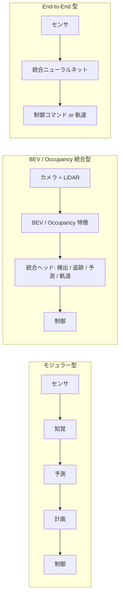
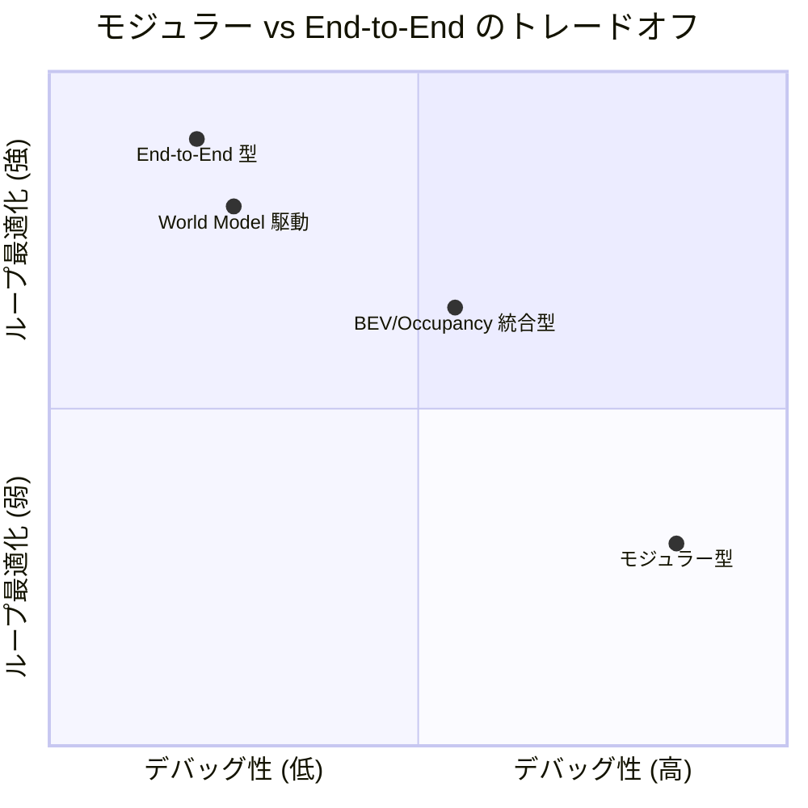

# 1.2 自動運転スタックの全体像と ML タスクの位置づけ

自動運転スタック (autonomous driving stack; センシングから制御までのソフトウェア階層) の典型構成を整理します。各モジュールがどの機械学習タスクとデータに依存しているかを俯瞰します。古典的な **モジュラー型**、近年主流の **BEV / Occupancy 統合型**、そして急速に存在感を増す **End-to-End 型** の3類型を比較します。あわせて HD マップ (High-Definition map; 高精度地図)・ローカライゼーション (localization; 自車位置推定)・V2X (vehicle-to-everything; 車両と外部の通信) が果たす役割を整理します。これにより、Closed-Loop データエンジンが「どの層からどんなフィードバック信号を取り出せるか」を見通せる地図を提供します。

## モジュール群と情報の流れ

典型的な自動運転システムは、次のモジュール群で構成されます。

| モジュール | 主な役割 | 主な ML タスク |
|---|---|---|
| センシング (sensing) | カメラ / LiDAR / Radar / GNSS / IMU で計測 | （前段、ML 自体は限定的） |
| 知覚 (perception) | 物体検出、セマンティックセグメンテーション、レーン検出 | 2D/3D 検出、Occupancy、トラッキング |
| 予測 (prediction) | 周囲アクターの将来軌道・行動意図 | Multimodal trajectory prediction |
| 経路計画・行動決定 (planning / behavior) | ゴールへの経路と短期モーションプラン生成 | 学習ベースの軌道生成、強化学習、模倣学習 |
| 制御 (control) | ステア・アクセル・ブレーキの制御コマンド出力 | モジュラー型では学習ベース制御は補助的、End-to-End 型ではここまで学習対象 |

これらに加え、補助的に次のモジュールが置かれることが多くあります。

| モジュール | 役割 |
|---|---|
| ローカライゼーション (localization) | 自車位置・姿勢推定（GNSS+IMU+LiDAR/Camera マッチング） |
| HD マップ (HD map) | 車線・信号・標識・勾配などの静的情報 |
| V2X (vehicle-to-everything) | 他車・インフラからの情報受信、SPaT、事故通知 |

スタックがこれらを **明示的に分離するモジュラー型** をとるか、**ニューラルネットワーク内部に取り込むエンドツーエンド型** をとるかで、ログ設計とエラー分析の難度は大きく変わります。本節ではこの 3 類型を順に整理します。

## 自動運転スタックの3類型

> **図 1.4**：自動運転スタックの3類型。同じ「センシング → 制御」のフローだが、モジュール境界の濃さと中間表現の扱いが大きく異なる。

### モジュラー型

最も歴史が長く、現在も多くの量産 ADAS および一部の自動運転システムが採用するアーキテクチャです。各モジュールは ROS（Robot Operating System）や DDS（Data Distribution Service）、独自 IPC（プロセス間通信）などで明示的なインターフェース（メッセージ）を持ちます。**ログと評価がモジュール単位で完結** する利点があります。

代表的な実装には、Autoware（Linux Foundation Autonomous Driving）、Apollo（Baidu）、Cruise の初期スタック、各 OEM の量産 ADAS スタックなどがあります。Closed-Loop データエンジンの観点では、知覚→予測→計画の各段で個別にログを取り、エラー原因を切り分けやすい点が大きなメリットです。一方、モジュール間の **責任分界点が増える** ため、「上流のわずかな誤差が下流に増幅する」問題（cascading error; 連鎖誤差）への対処が常に必要になります。

### BEV / Occupancy 統合型

近年最も活発な領域です。マルチカメラ画像（と LiDAR）を、**鳥瞰視点 (bird's-eye view; BEV)** や **占有グリッド (occupancy grid)** に投影し、その空間上で検出・追跡・予測・軌道生成を統合的に行う構成です。

ここで **BEV** とは、車両を真上から見下ろす視点で世界を 2D 平面（地面 + 高さ圧縮）として表現する形式です。複数カメラ・LiDAR・Radar の特徴量を共通の地面座標系へ投影でき、知覚・予測・計画を同じ空間で扱えます。**Occupancy grid（占有グリッド）** は空間を 3D ボクセルに分割し、各ボクセルが障害物に占有されているか否か（さらにクラスや動きの予測）を表現する形式です。未知クラスや一般障害物の表現力に優れます。**Foundation Model（基盤モデル）** は、大規模な未ラベル/弱ラベルデータで事前学習された汎用モデル（CLIP / DINOv2 / SAM 系など）です。下流の検出・分割・検索タスクに少量のラベルで適応できます。代表的な手法を表 1.1 にまとめます。

| 手法 | 発表 | 主な特徴 | 主な入力 | 主な出力 |
|---|---|---|---|---|
| BEVFormer [P2](references#p2) | ECCV 2022 | 時空間 Transformer による BEV 特徴生成 | マルチカメラ | 3D 検出 / セグメンテーション |
| BEVDet [P3](references#p3) | 2021 | LSS (Lift-Splat-Shoot) ベースの BEV 投影 | マルチカメラ | 3D 検出 |
| PETR / PETRv2 [P4](references#p4) | ECCV 2022 | 3D Position Embedding によるマルチビュー検出 | マルチカメラ | 3D 検出 |
| DETR3D [P5](references#p5) | CoRL 2021 | 3D query を用いた set prediction | マルチカメラ | 3D 検出 |
| TPVFormer [P14](references#p14) | CVPR 2023 | 3 視点 (top/side/front) で Occupancy | マルチカメラ | 占有予測 |
| Occ3D / FlashOcc [P13](references#p13) | NeurIPS 2023 | 大規模 Occupancy ベンチ + 高速デコーダ | マルチカメラ | 占有予測 |

これらに共通するのは、**同じ BEV / Occupancy 特徴の上に複数のヘッドを載せ、マルチタスクで学習する** ことです。データ中心観点では、「悪天候時の Occupancy 精度が低下している」とき、どのセンサ・どの ODD・どの時間帯のデータを増やせばよいかを、**誤差マップから逆算** できる点が強みです。

### End-to-End 型

センサ入力からそのまま軌道や制御コマンドを出力する構成です。研究では PilotNet [P1](references#p1) が古典です。量産・準量産レベルで急速に存在感を増しているのは、UniAD [P11](references#p11)、VAD [P12](references#p12)、Tesla の FSD v12 系などです。これらは **モジュール間の手作業のチューニングを最小化** し、データから直接ループ全体を学習させます。

| 手法 | 発表 | 主な特徴 |
|---|---|---|
| UniAD [P11](references#p11) | CVPR 2023 (Best Paper) | 知覚・予測・計画を単一 Transformer で統合 |
| VAD [P12](references#p12) | ICCV 2023 | ベクトル化シーン表現で計算量削減 |
| GenAD | 2024 | 生成的アプローチでマルチモーダル軌道分布を出力 |
| Tesla FSD v12 系 | 2024- | カメラ入力からの End-to-End ニューラルプランナー（公開動画より） |
| Wayve (LINGO 系) [Sim6](references#sim6) | 2023- | 言語接地 (language-grounded) End-to-End |

End-to-End はデバッグ性とトレーサビリティが弱い反面、**Closed-Loop でのインタラクションそのもの** を学習対象にできます。そのため World Model（[W1, W3, W4]）と相性が良いとされています。

## モジュラー vs End-to-End：トレードオフ整理

> **図 1.5**：3 類型のトレードオフ。横軸はデバッグ性・トレーサビリティ、縦軸は Closed-Loop 全体の最適化余地です。多くのチームは中央の **BEV 統合型を主流に据えつつ、E2E を補完的に試す** 構成を採用しています。

| 観点 | モジュラー | BEV / Occupancy 統合 | End-to-End |
|---|---|---|---|
| デバッグ・再現性 | ◎ | ○ | △ |
| エラー切り分け | モジュール単位で容易 | ヘッド単位で可 | 困難（特徴量勾配解析等が必要） |
| 計算効率 | 中（重複計算が出やすい） | 良 | 良 |
| ロングテール対応 | データ追加 + ロジック修正 | データ追加が中心 | データ + ループ学習 |
| 安全認証との整合 | 高（境界が明確） | 中 | 低（説明責任の挑戦） |
| 学習データ要件 | タスク別ラベルで十分 | マルチタスクラベル | 大量の運転デモ + シナリオ |

## センサとデータフロー

スタックを **データの流れ** で見ると、最上流にはセンサがあります。カメラは高解像度の画像フレーム列、LiDAR は 3D 点群、Radar はレンジ・ドップラー、GNSS（Global Navigation Satellite System; 全球測位衛星システム）/ IMU（Inertial Measurement Unit; 慣性計測装置）は時系列の状態量を、それぞれ高い帯域で出力します。

### 代表的なログとして残すべき信号

実務では、スタック各段から次の情報をログとして残すことが多くあります。第 2〜3 章で詳しく扱います。

| 段 | 主なログ |
|---|---|
| センサ段 | 生画像・点群、露出・SNR、キャリブレーション残差、センサ温度 |
| 知覚段 | 物体クラス・位置・速度、信頼度、各クラスのロジット、トラッキング ID |
| 予測段 | アクター別マルチモーダル軌道、各モード確率、不確実性 |
| 計画段 | 候補軌道、コスト内訳（安全 / 快適 / 効率）、選択軌道とその理由 |
| 制御段 | 目標値と実出力、トラッキング誤差、コントローラ内部状態 |

ログを「1 フレーム（または短時間窓）に対応するレコード」にまとめておくと、後段のエラー分析・再現実験・シミュレーションでスタック全体の挙動を再現しやすくなります。第3章のデータレイク設計（Drive / Scene / Frame の 3 階層テーブル）と整合させる前提で、本書では **「スタック各段の入出力を後でクエリ可能な形に構造化する」** ことを終始強調します。

## 世界モデル・BEV・Foundation Model の位置づけ

最近の研究・実務では、従来「モジュールごとに別表現」だった構成に対して、**世界モデル (world model)** や Foundation Model のように、**フリート全体のデータを情報圧縮した共通表現** を共有する構成が注目されています。代表例として、Wayve の GAIA-1 [W1](references#w1)、DriveDreamer / DriveDreamer-2 [W2, W3]、Vista [W4](references#w4) などがあります。これらは自動運転を「**動画生成タスクの一種**」と捉え直す視点です。

データ中心・Closed-Loop の観点では、世界モデルは「実世界からのフィードバックを統合して継続更新される環境モデル」として機能します。第7章で世界モデルの評価指標（再現性 / 多様性 / 安全マージン）、第6章で世界モデルの学習データ設計を扱います。

## HD マップ・ローカライゼーション・V2X：環境文脈レイヤー

これら3要素は「環境文脈レイヤー」とも呼べる存在で、知覚や計画に **静的・動的な追加情報** を提供します。

### HD マップの内容と更新サイクル

HD マップ（高精度地図）は、ナビゲーション地図よりはるかに高い解像度・精度を持ち、次のような情報を含みます。

- **幾何情報**：道路・レーン境界、レーン中心線、縁石、ガードレール
- **規制情報**：制限速度、進行方向、一時停止、信号機・標識位置
- **付加情報**：勾配、カント、橋・トンネル、横断歩道、停止線

実世界の道路環境は工事や規制変更で常に変化します。そのため HD マップは **半動的なデータセット** として扱うことが現実的です。Mobileye の REM [R4](references#r4) や Waymo のフリートベース更新 [R1](references#r1) のように、量産フリートからの観測を編集に還元する仕組みが整いつつあります。

### ローカライゼーションのデータフロー

ローカライゼーション（自車位置推定）は、GNSS、IMU、ホイールエンコーダ、LiDAR / カメラベースの特徴マッチングを統合し、自車位置・姿勢を推定します。多くのシステムは Kalman フィルタや因子グラフ最適化を使います。出力は次のように消費されます。

- 知覚：マップ座標系とセンサ座標系の変換に用いる
- 予測：他車・歩行者の軌道を地図上のパスとして推定
- 計画：レーン中心線・交差点構造と組み合わせて経路設計

Closed-Loop の観点では、**ローカライゼーション残差の時系列分布** をログとして取り、都市キャニオン（高層ビル群でマルチパスが起きやすい区間）やトンネル、未整備領域などの「ローカライゼーション難所」を Long-tail セットとして扱う運用が有効です。

### V2X 通信の情報とログ設計

V2X (vehicle-to-everything) は、他車両・インフラからの情報を受信する手段です。代表的なのは次の 3 つです。

- 他車の位置・速度・意図（ターンシグナル、ブレーキ）
- SPaT (Signal Phase and Timing; 信号機の現示と切替タイミング) 情報
- 道路工事・事故などのインフラ通知

V2X は **信頼性・遅延・カバレッジ** がセンサ知覚と大きく異なります。そのため依存しすぎない設計と最大限活用する設計の両立が必要です。第8章では、Shadow Mode（陰モード；走行中のシステムが意思決定はせず候補のみログ化するモード）で V2X 有 / 無の挙動差を比較する評価設計を扱います。

## モジュール別の Closed-Loop 改善例

各モジュールが Closed-Loop の中でどのように改善サイクルに組み込まれるかを、簡単な例で示します。

### 知覚

- オンラインモニタリングで誤検出・検出漏れシーンを収集する。
- ラベルポリシーやアノテーションツールを改善し、難例を重点再ラベルする。
- Long-tail セット上の mAP / Recall を追跡する（第6章）。

### 予測

- 軌道予測の外れが大きかったシーンを抽出する。
- 人間ドライバの挙動・安全マージンを詳細解析する。
- ADE / FDE / Miss Rate / Mode Coverage をシナリオ別に集計する。

### 計画 / 制御

- シミュレーションやログリプレイで、不自然動作・安全マージン不足・快適性低下を検出する。
- コスト関数や制約条件の問題か、上流情報の不足かを切り分ける。
- 必要に応じてセンサ追加 / 世界モデル特徴の取り込みを検討する。

## 本節の振り返り

スタック類型の選択は、単なる技術選択ではなく、**チームが「失敗をどう観察するか」を決める根本設計** です。モジュラー型はモジュール境界でログを取れるためエラーの切り分けが容易な反面、上流の小さな誤差が下流で増幅する連鎖誤差に苦しみます。End-to-End 型は学習対象がループ全体に及ぶので Closed-Loop 最適化と相性がよい反面、「なぜ失敗したか」を説明する責任を負ったときに、特徴量の勾配解析や中間表現の可視化など、追加の説明責任の道具立てがないと安全認証が極めて厳しくなります。BEV / Occupancy 統合型が現在の主戦場なのは、両者の中間でデバッグ可能性とループ最適化のバランスが取れる点に加え、「マルチタスクヘッドのどれが落ちているか」という観点でデータ中心の改善サイクルを回しやすいためです。

ここで読者に意識してほしいのは、**スタックを選ぶことはログ設計を選ぶこと** とほぼ同義だ、という点です。E2E 型に切り替えた瞬間、従来モジュラー型で取れていた「予測モジュールの ADE」「計画段の選択軌道とコスト内訳」のような中間信号は、モデル内部に隠蔽されます。これに気づかず E2E に飛びつくと、量産後にインシデント分析の道具を失います。本書が繰り返し「Drive / Scene / Frame の構造化ログ」を強調するのは、スタック類型を変えても **後段から問い直せる粒度のデータが残っているか** を担保するためです。HD マップ・ローカライゼーション残差・V2X 受信状態のような環境文脈レイヤーも同じ思想で、その瞬間には不要に見えても、半年後のインシデント分析で唯一の手がかりになります。スタック設計は性能ではなく、未来の自分が過去を再現できるかで評価されるべきものです。

## 次節への橋渡し

次の 1.3 節では、**世界の自動運転プレイヤーがどのように Closed-Loop データエンジンを構築しているか** をトレンドとして俯瞰します。Tesla / Waymo / Mobileye / Cruise / Zoox / 中国 OEM の公開資料を比較しつつ、世界モデル・自然言語クエリ・自己教師あり学習・合成データなど、第二版で大幅に拡張された動向を整理します。
