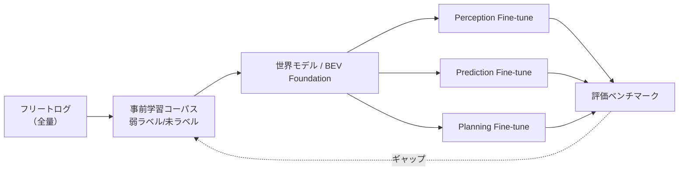
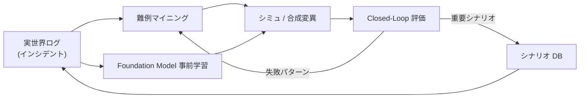

# 1.3 データ中心自動運転モデルのグローバルトレンド

世界の AD / ADAS 開発で進んでいる **データ中心の潮流** を俯瞰します。大規模フリートからの DataOps 整備、世界モデル (world model) と Foundation Model の台頭、自然言語クエリによるシーン検索、自己教師あり学習・合成データ・シミュレーションのハイブリッド活用などの動きを整理します。これにより、Closed-Loop データエンジンへの実装上の含意を引き出します。

## 大規模フリートとデータ駆動開発

### 主要プレイヤーの公開動向

ロボタクシー（無人運転タクシー）から量産 ADAS まで、フリート活用のスタイルは多様です。次表は公開情報範囲で 2024-2025 年時点の主要プレイヤーを比較したものです。**非公開情報には触れていない** こと、また各社のスタックは継続的に進化しているため、「ある時点でのスナップショット」として参照してください。

| プレイヤー | フリート規模（公開情報） | 主な ODD | スタック型 | 特徴的な Closed-Loop 機構 |
|---|---|---|---|---|
| **Waymo** | 数百台規模のロボタクシー（PHX/SF/LA など） | 都市部低中速 | BEV 統合 + 世界モデル系 | 公道700M+ マイル + シミュ800M+ マイル [R1](references#r1)、Block-NeRF [W6](references#w6) |
| **Tesla** | 数百万台量産（FSD/Autopilot 搭載） | 高速・市街地・郊外 | E2E（FSD v12 系） | 大規模オートラベリング + Multi-trip Reconstruction [D10](references#d10) |
| **Mobileye** | 数千万台規模（OEM 量産 EyeQ 搭載） | 高速・市街地 | モジュラー + RSS | REM クラウドソース HD マップ [R4](references#r4) |
| **Cruise** | 数百台規模ロボタクシー（運用一時休止 → 再構築中） | 都市部 | BEV 統合 | 安全レポート [R3](references#r3)、Shadow Mode |
| **Zoox** | 数十〜百台規模 | 都市部低速、独自車体 | BEV 統合 | 専用車体 + 独自シミュレータ |
| **Wayve** | 評価フリート（UK 中心） | 都市部 | E2E + LLM 接地 | GAIA-1 / LINGO 系世界モデル [W1](references#w1) |
| **NIO / BYD / XPeng** | 量産百万台規模（中国 NOA 搭載） | 高速 NOA / 市街地 NOA | BEV / Occupancy + E2E 検討 | 中国国内データレジデンシー対応 |
| **Pony.ai / WeRide / AutoX** | 数百〜千台規模ロボタクシー（中国） | 都市部 | BEV / Occupancy | Shadow + 段階的展開 |

> 数値・定性情報はいずれも各社の公開資料・年次報告・カンファレンス発表（2024 末〜2025 初）の範囲です。フリート規模・運用状況・スタック構成は四半期単位で変化します。参照時には **必ず各社一次情報の最新版** に当たり、表中の取得時期との差分を確認してください。

### 共通する DataOps 実務パターン

公開情報を横断すると、共通する実務パターンが見えてきます。

1. **常時テレメトリ + イベントトリガ高解像度ログ**
   位置・速度・介入フラグなどの低レートテレメトリは常時送信します。AEB（Automatic Emergency Braking; 自動緊急ブレーキ）作動・急ブレーキ・ステア介入・システム警告のタイミングで、前後数秒〜数十秒の高解像度センサログを優先度高くアップロードします。
2. **オンラインモニタリングと自動アラート**
   クラウドで介入率・近接オブジェクト件数・モデル信頼度をストリーミング集計します。閾値や統計モデルでアラートを発火し、対象 ODD・SW バージョン・車両世代をタグ付けします。
3. **インシデントレビューとシーン抽出**
   安全チームと AD 開発チームがアラートに紐づくログをレビューします。代表シーンをシナリオ DB（シナリオデータベース；運用上重要なシーンを構造化して登録する DB）に登録し、夜間・雨・交差点右折・歩行者横断などのタグを付与します。
4. **データセット更新とモデル再学習**
   抽出シーンを優先ラベリングキューで処理 → 新データセットバージョン → 再学習 → オフライン評価 → シミュ評価 → リリースゲート → OTA（Over-The-Air; 無線によるソフトウェア更新）配信、と進めます。

この基本ループを支える定量指標として、ODD セグメント別のヒヤリハット率を継続集計します。具体的には、フリートテレメトリの月次パーティション（例：S3 上の Parquet ファイル）を入力とします。`odd_segment` 列で集計し、走行距離合計とインシデント件数合計を求め、`インシデント件数 ÷ 走行距離(km) × 1000` でセグメントごとの「1,000 km あたりのインシデント率」を算出します。走行距離が極端に小さいセグメントはゼロ除算を避けるため下限値（例：1e-3 km）でクリップしておき、上位 10 セグメントをダッシュボード化します。このような統計を継続的に観測し、「どの ODD セグメントでインシデント率が高いか」「データ量に対して性能が悪い領域はどこか」を把握することが、データ中心・Closed-Loop の出発点になります。

## 世界モデル・BEV・Foundation Model の台頭

### 世界モデルの位置づけ

世界モデル (world model) とは、**センサ入力から将来の環境状態を生成・予測する大規模ネットワーク** を指します。生成モデルとしてのアプローチが目立つ現在のトレンドを表 1.2 に整理します。

| モデル | 提供者 / 発表 | 主な入力 | 主な出力 | データ中心の含意 |
|---|---|---|---|---|
| **GAIA-1** [W1](references#w1) | Wayve, 2023 | 動画 + 行動 + テキスト | 連続フレーム生成 | テキストプロンプトでロングテールを「生成」 |
| **DriveDreamer / -2** [W2, W3] | 2023 / 2024 | 行動 + 構造化シナリオ | 動画生成 | LLM プロンプトで多様シナリオ |
| **Vista** [W4](references#w4) | 2024 | 動画 + 制御 | 高忠実度動画 | 多変量制御信号での予測 |
| **UniSim** [W5](references#w5) | Waabi, 2023 | 実走行ログ | 仮想センサ再生 | Closed-Loop シミュレータ用ニューラルレンダラ |
| **Block-NeRF** [W6](references#w6) | Waymo, 2022 | 大量走行ログ | 都市規模シーン | 静的シーンの NeRF 再構成 |
| **Street Gaussians / DrivingGaussian** [W8, W9] | 2024 | 多視点映像 | 動的シーンの 3D 再現 | 動的物体の高速 3DGS |
| **MARS** [W10](references#w10) | 2023 | 走行ログ | モジュラ合成 | 評価向けシミュ |

これらは、**実世界ログを Closed-Loop 評価とデータ拡張の双方に利用** する発想で結ばれており、第7章で詳しく扱います。

### Foundation Model 時代のデータ階層

Foundation Model 系のアプローチでは、データを次のように階層管理することが定着しつつあります。

| 階層 | 内容 | データ要件 |
|---|---|---|
| 事前学習コーパス | フリート全体の未ラベル / 弱ラベルデータ | ODD カバレッジ・シーン多様性 |
| タスク別ファインチューニング | 検出・予測・計画用の高品質ラベル | 厳密ラベル + ロングテール |
| 評価ベンチマーク | タスク横断の固定セット | 安定性・トレーサビリティ |

> **図 1.6**：Foundation Model 時代のデータ階層。事前学習コーパスは数十万〜数百万時間の量を狙い、タスク別ラベルはロングテール厚めに、評価ベンチマークは長期安定の3階層に分けることが定石になりつつあります。

## 自然言語クエリによるシーン検索・評価

### 自然言語シーン検索の実装パターン

「夜間かつ雨で右折時に歩行者が横断しているシーン」をテキストで指定し、データレイクから取得する操作は、もはや先進事例ではありません。**DataOps の標準機能** になりつつあります。実装は CLIP [P17](references#p17) / OpenCLIP / DINOv2 [P16](references#p16) などの視覚言語モデル + ベクトルデータベース（FAISS / Milvus / pgvector）の組み合わせが主流です。

最小構成のフローは次のとおりです。まずシーン単位（典型的には 1 シーン = 数秒の代表フレーム）に対してオフラインで CLIP 系の画像エンベディング（例：ViT-L/14、出力 768 次元）を一括計算し、Frame メタ DB へ `scene_id → vector` として格納しておきます。検索時はユーザー入力テキスト（例：「rainy night right turn pedestrian crossing」）をテキストエンコーダで同じ次元のベクトルに変換し、内積（コサイン類似度）でトップ k（例：k=200）件のシーンを返します。スケール（数千万〜数億シーン）になると総当たりの内積計算は不可能です。HNSW（Hierarchical Navigable Small World; Milvus / Weaviate / pgvector の HNSW モード）や IVF-PQ（Inverted File + Product Quantization）へインデックスを切り替え、リコールとレイテンシを ODD セグメント別に評価します。第4章で詳細を扱います。

### LLM / VLM による要約・タグ付け

オンラインモニタリングで検出されたシーンに対して、LLM / VLM が自動要約とタグ付けを行うフローも普及しつつあります。

- **GPT-4V / Gemini Pro / Claude 3.5 系**：精度は高いが API コストが大きい。エッジでは使えない。
- **LLaVA / BLIP-2 / Florence-2**：軽量で社内 GPU に展開可能、ファインチューニングも容易。

第5章で詳細を扱います。**「何が起きたかを人間に短い文章で説明できる」** ことが、Closed-Loop 全体の改善速度を体感的に大きく押し上げます。

## 自己教師あり学習・合成データ・シミュレーションのハイブリッド

### 自己教師あり学習の主要手法

自己教師あり学習 (self-supervised learning; SSL) は、人手のラベルなしで生データから表現を学ぶ手法群です。自動運転で利用される代表モデルは次のとおりです。

| 手法 | 発表 | 主な使い方 |
|---|---|---|
| MAE [P15](references#p15) | CVPR 2022 | 大規模画像の事前学習（マスク再構成） |
| DINO / DINOv2 [P16](references#p16) | ICCV 2021 / 2024 | 自己蒸留での視覚特徴学習 |
| MoCo / SimCLR / BYOL | 2020 | コントラスト学習の系譜 |
| CLIP [P17](references#p17) | ICML 2021 | 画像-テキスト対の対比学習 |

これらを使うと、**未ラベルログから汎用特徴量を学習** し、下流タスク（検出・予測）に少ないラベルでファインチューニング（fine-tuning; 事前学習済みモデルを少量データで再学習する手法）できます。第4・6章で詳述します。

### 合成データの位置づけ

実世界ロングテールをすべて実走行で集めるのは現実的ではありません。Block-NeRF [W6](references#w6)、Street Gaussians [W8](references#w8)、3DGS（3D Gaussian Splatting）系 [W7](references#w7)、生成モデル系（Stable Diffusion + ControlNet、BEVGen / BEVControl など）を活用して、**実ログから派生する合成シーン** を増やすアプローチが主流化しつつあります。詳細は第7章で扱います。

### ハイブリッド Closed-Loop

> **図 1.7**：実世界 × シミュレーション × 世界モデルのハイブリッド Closed-Loop。実世界で1度しか観測されない危険シナリオも、合成変異によって数千〜数万バリエーションに拡張できる。

## オープンデータセット・ベンチマークの変遷

データ中心トレンドを語るうえで、オープンデータセットの変遷は重要な指標です。0.9 節と重複しない範囲で、データ中心の観点から整理します。

| 視点 | 観察される傾向 |
|---|---|
| **マルチモーダル化** | 画像のみ → 画像 + LiDAR + Radar + Map + Telemetry へ |
| **長時間化・シナリオ指向** | 単一フレーム → 数十秒のシーン、シナリオラベル付き |
| **ロングテール意識** | 雪道・悪天候・複雑交差点・特殊車両を意図的に含む |
| **タスク統合** | 検出だけ → 検出 + 予測 + 計画ベンチマーク（NuPlan, Argoverse 2 Motion Forecasting） |

ただし、公開データセットは「研究しやすい ODD」に偏り、商用フリートのロングテール全量はカバーできていません。データ中心実務では、**社内フリート上の指標（インシデント頻度、介入率、Long-tail mAP）を主指標** に据え、公開ベンチマークは補助に置く運用が一般的になっています。

## ケーススタディに見るトレンド組み合わせ

### ケース A：都市ロボタクシーサービス

- フリートからのテレメトリ + イベントトリガ高解像度ログを都市別 / 時間帯別に蓄積する。
- 世界モデル / BEV 統合ネットワークで Perception / Prediction / Planning をマルチタスク学習する。
- 交差点右折時のヒヤリハット・介入を周辺ログとともに Long-tail セットへ追加する。
- 「雨夜の交差点右折」を自然言語検索 → ラベリング & シミュ評価へ流す。
- 実車ステージング + Shadow Mode → 限定 ODD ロールアウト、と段階的に展開する。

### ケース B：量産 ADAS と OTA

- 数百万台量産車両から匿名化テレメトリを集約する。
- 公開データセットで事前学習 → 自社ファインチューニングする。
- OTA で数 % のフリートに新モデル → SPRT（Sequential Probability Ratio Test; 逐次確率比検定）による早期停止判定を行う（第8章）。
- 失敗観測時は該当 ODD のデータを再収集 → 再ラベル → 再学習、と回す。

このケースでは、世界モデルや高度なシミュレーションをフルに活用していなくても、**「フリート × OTA × DataOps」** の閉じたループが機能している点が要点です。

## トレンドを自分たちに落とし込む順序

すべてのトレンドを一度に取り入れることは現実的ではありません。次のような優先順位付けを推奨します。

1. **基盤の整備**：データレイク + メタデータ + シーン検索 + Long-tail セット定義（第2〜4章）
2. **オートラベリング基盤**：SAM / SAM2 / Grounding DINO + プリラベル + 品質指標（第5章）
3. **オフライン評価のセグメント分解**：ODD × シナリオ × Long-tail での性能追跡（第6.8 節）
4. **シミュレーション基盤**：シナリオ DB + Closed-Loop SiL + 合成データ（第7章）
5. **オンライン Closed-Loop**：OTA + Shadow Mode + ドリフト検知 + RCA（第8章）
6. **世界モデル / Foundation Model**：基盤データを十分に蓄えた後の差別化要素（第6・7章）

この順序は、**先に基盤（1〜3）が整っていないと、上位（4〜6）の効果計測そのものが難しくなる** という経験則に基づきます。組織の規模や成熟度に応じて、1〜3 の整備に 6〜12 ヶ月、4〜5 の本格運用にさらに 6〜12 ヶ月、6 の試験導入はその後、というレンジが現実的です。

## 本節の振り返り

グローバルトレンドを眺めると、Tesla / Waymo / Mobileye / Wayve / 中国 OEM など各社の戦略は表面的にはばらばらに見えます。しかし共通するのは、**「実世界ログ → 難例マイニング → ラベル / シナリオ更新 → 再学習 → 段階的展開 → さらにログ収集」というループを途切れさせない** という一点です。世界モデルや Foundation Model や自然言語クエリといった派手なキーワードは、このループの個々の段を効率化する道具に過ぎません。読者がトレンド情報を吸収するときに陥りやすいのは、「最新の世界モデルを導入すれば一気に追いつける」という錯覚です。実際には、データレイクとシーン検索とラベル品質という地味な基盤が整っていなければ、世界モデルを学習させる事前学習コーパスすら用意できません。

本節で示した段階的導入の順序（データレイク → オートラベリング → セグメント評価 → シミュ → オンラインループ → 世界モデル）は、この前提依存性を反映しています。なぜこの順番でなければならないかというと、後段ほど **効果計測に前段の基盤が必要** だからです。たとえばシミュ環境を整えても、シナリオ DB が空ならカバレッジを語れません。世界モデルを試しても、Long-tail セットが定義されていなければ「どこが改善したか」を主張できません。読者の組織が中国 OEM のような量産規模を持たなくても、データ × OTA × DataOps の閉じたループは小さなフリートでも構築可能だという点が、ケース B から伝わるはずです。重要なのは規模ではなく、ループが「閉じている」ことです。

もう一つ意識したいのは、**公開情報のフォロー自体がデータ中心開発の一部** だという点です。各社の公開資料は四半期単位で更新されます。半年前の認識のまま戦略を立てると、業界標準と乖離します。本書を読むことと並行して、各社の一次情報を継続的に追う習慣を組織のリチュアルに組み込むことを勧めます。

## 次節への橋渡し

次の 1.4 節では、これらのトレンドを支える **DataOps / MLOps アーキテクチャ全体** を俯瞰します。データレイク・カタログ・GPU クラスタ・シミュレータ・OTA・モニタリング・実験管理・モデルレジストリ・監査ログがどう接続されているか、ツール選定（Slurm vs K8s、Airflow vs Kubeflow など）の視点まで含めて整理します。
