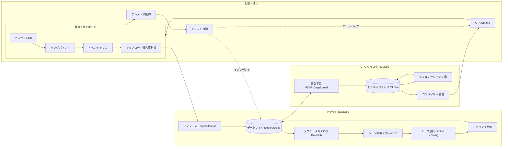
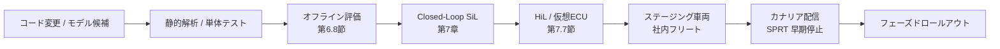

# 1.4 自動運転 DataOps / MLOps アーキテクチャの俯瞰

自動運転に特有の DataOps / MLOps アーキテクチャを俯瞰します。DataOps（データ運用）と MLOps（機械学習運用）は、それぞれデータ流通と ML モデルライフサイクルの自動化を扱う運用領域を指します。データレイク、データカタログ、GPU クラスタ、シミュレーション基盤、OTA、オンラインモニタリング、実験管理、モデルレジストリ、CI/CD、監査ログがどのようにつながり、Closed-Loop データエンジンを支えているか。**ツール選定とコスト最適化** の視点まで含めて整理します。

## 全体アーキテクチャ俯瞰

> **図 1.8**：自動運転 DataOps / MLOps の典型構成。車両 → クラウド → 学習 → シミュレーション → 配信 → モニタリング → 車両、と一周します。各ブロックは第2章以降で詳細化します。

## オンボードとクラウドの役割分担

### 大枠の切り分け

- **オンボード**
  - リアルタイム推論と車両制御（ms 級レイテンシ要求）
  - センサデータの一時バッファリング、イベントトリガ判定
  - 低レートテレメトリ送信、アップロード候補の選別
- **クラウド**
  - 大規模なデータ保存・検索・加工（DataOps）
  - 分散学習・ハイパラ探索・評価（MLOps）
  - シミュレーション基盤、デジタルツイン
  - モデル配信・コンフィグ配信・フリート管理

### レイテンシと安全クリティカル度による分担

| 要件 | 役割 |
|---|---|
| 数十 ms オーダーかつ安全クリティカル（衝突回避、車両安定化） | オンボード完結 |
| 数百 ms〜数秒（モニタリング、軽量分析） | オンボード前処理 + クラウド集約 |
| 数秒〜数分（フリート設定変更、トリガポリシー更新） | クラウド主導 + OTA |
| 分〜時間（モデル更新、評価レポート） | クラウド完結 |

### オンボードロギングとクラウドインジェストの境界

オンボード（onboard; 車載）とクラウド間で、どこからどこまでをどちら側で処理するか。第2〜3章で詳述しますが、**境界をどこに引くか** で全体構成が大きく変わります。代表的な選択肢は次の3パターンです。

| 戦略 | 概要 | 利点 | 欠点 |
|---|---|---|---|
| 生データ転送型 | センサ生データをそのままクラウドへ | 後段の自由度が高い | 帯域コスト膨大（数 PB/月） |
| 中間表現転送型 | BEV 特徴・検出結果も含めてアップロード | デバッグが容易 | フォーマット変更時に互換が壊れやすい |
| イベントトリガ型 | 通常はテレメトリ、イベント時のみ生データ | コスト最適 | トリガ未捕捉のロングテールを取り逃す可能性 |

実プロジェクトでは「テレメトリ常時 + 数 % のイベントトリガ高解像度」をベースに、必要に応じて Shadow Mode（陰モード；推論結果のログ化のみで制御は介さない運用）や Pull-on-Demand（必要時にクラウドから車両へデータ要求を送る運用）を組み合わせる構成が多く採られています。

## データレイクとデータカタログ

### データレイクのフォーマット選択

| 選択肢 | 強み | 弱み | 主な採用領域 |
|---|---|---|---|
| Apache Iceberg [ST1](references#st1) | スキーマ進化、time travel、partition の hidden 化 | 学習曲線 | データウェアハウス系 |
| Delta Lake [ST2](references#st2) | ACID、Spark との親和性、merge 性能 | Spark 中心の生態系 | Databricks 環境 |
| Apache Hudi [ST3](references#st3) | upsert / incremental pipeline | 運用の癖 | 高頻度 upsert |

自動運転データレイクでは、**Iceberg + Parquet** か **Delta Lake + Parquet** の組み合わせが現代的です。第3章で詳しく扱います。

### メタデータ主導のクエリ設計

データレイクとカタログ設計の成否は、**現場が投げたいクエリ** を正確に捉えることで決まります。代表例は次の 3 つです。

- **ODD ベース**：「都市高速 × 夜間 × 雨 × 交差点右折」のシーン抽出
- **モデル挙動ベース**：「最新バージョンで介入が多発した区間の全ログ」
- **イベントベース**：「AEB 作動 + 歩行者近接」のログ

これを支えるのは、Drive / Scene / Frame 単位のテーブルと、属性メタデータ（地域・天候・SW バージョン・センサ構成）の整備です。Apache Iceberg の場合、Drive 単位のテーブルを次のような列で定義します。

- `drive_id`（文字列）と `vehicle_id`（文字列）：走行・車両の主キー
- `sw_version`（文字列）：搭載されていたスタックバージョン
- `start_ts` / `end_ts`（タイムスタンプ）：走行開始・終了時刻
- `odd_segment`（文字列）：`urban_highway_night_rain` のように 2.1 節で定義したカバレッジ表のセグメント ID
- `weather`（文字列）と `intervention_count`（整数）：環境タグと介入回数
- `sensor_config_id`（文字列）：センサ構成・キャリブ世代を指す ID

パーティションは `start_ts` の月単位（hidden partition の `months(start_ts)`）と `odd_segment` の二段で切ります。Iceberg の format-version 2 を指定して time travel と DELETE/UPDATE を有効にします。これにより「2024 年 11 月かつ雨夜の都市高速」のような典型クエリがフルスキャン無しで返ります。後段の学習・評価・監査ログから同一スキーマで参照できます。

### データカタログの代表例

| ツール | 特徴 |
|---|---|
| DataHub [ST10](references#st10) | LinkedIn 発、強力なリネージ、自動メタデータ抽出 |
| OpenMetadata | 商用 / OSS、UI が現代的、リネージ |
| Apache Atlas | Hadoop 生態系で実績 |
| Amundsen | Lyft 発、検索体験 |
| Unity Catalog | Databricks 統合 |

これらに加え、リネージ標準（lineage; データの来歴）として **OpenLineage** [ST9](references#st9) と Marquez を採用すると、学習ジョブ・データセット・モデル間の依存関係を統一的に追跡できます。

### カタログ × 権限管理

データカタログは「どこに何があるか」だけでなく、「誰が触れるか」を制御します。

- プロジェクト・ロール別の RBAC（Role-Based Access Control; ロールベースアクセス制御）/ ABAC（Attribute-Based Access Control; 属性ベースアクセス制御）をカタログで定義する（第3.8 節）。
- 高機密データ（顔・ナンバー・特定顧客）は匿名化済み派生データのみカタログに表示する。
- データセットの状態（実験用 / 本番用 / 廃止予定）を管理し誤用を防ぐ。

## GPU クラスタと学習・評価パイプライン

### スケジューラとオーケストレーションの選び方

| 選択肢 | 適性 | 学習曲線 | 自動運転での実績 |
|---|---|---|---|
| Slurm | 大規模 HPC（High-Performance Computing）、スループット最大化 | 中 | 学術機関・大規模学習で標準 |
| Kubernetes (KubeRay / Volcano) | 異種ワークロード混在、CI/CD 統合 | 高 | クラウド事業者、現代的選択 |
| Ray | 分散学習・推論・RL（Reinforcement Learning; 強化学習） | 中 | LLM / RL 系で台頭 |
| Apache Mesos | ミドルウェア混在 | 高 | レガシー |

ワークフローエンジン（DAG 定義に基づく依存関係を持つ複数ジョブの実行基盤）は、**Argo Workflows** / **Airflow** / **Kubeflow Pipelines** / **Flyte** / **Prefect** / **Metaflow** が候補です。**「DAG として書ける」「冪等性 (idempotency; 同じ入力に対し何度実行しても結果が同じになる性質) を担保できる」「再実行容易」** の3点を満たすかが選択基準です。

### 分散学習スタック

近年の標準的選択は次のとおりです。第6章で詳述します。

| 観点 | 選択肢 |
|---|---|
| 並列方式 | DDP（Distributed Data Parallel）/ FSDP（Fully Sharded Data Parallel）/ DeepSpeed ZeRO / Megatron-LM 系 |
| Mixed Precision | BF16 / FP16 / FP8（H100 系） |
| 通信 | NCCL（NVIDIA Collective Communications Library）+ InfiniBand / NVLink / NVSwitch |
| チェックポイント | torch.distributed.checkpoint, async save |
| ジョブ管理 | Slurm / Kubernetes |

### 実験管理ツール比較

| ツール | 強み | 弱み |
|---|---|---|
| MLflow [T11](references#t11) | OSS、自社ホスト容易、Model Registry | 大規模スケーリングは要工夫 |
| Weights & Biases [T12](references#t12) | 強力 UI、Sweep | SaaS 中心、コスト |
| Neptune | 大量実験、企業利用 | 機能差はあるが価格次第 |
| ClearML | OSS + SaaS、パイプライン | 認知度はやや低 |
| Comet | 実験追跡 + LLMOps | LLM 寄り |

## シミュレーション基盤とデジタルツイン

### シミュレータの代表

| 選択肢 | OSS / 商用 | 強み |
|---|---|---|
| CARLA [Sim1](references#sim1) | OSS | コミュニティ大、Python API |
| AWSIM [Sim2](references#sim2) | OSS | Autoware 統合、Unity ベース |
| NVIDIA DRIVE Sim [Sim3](references#sim3) | 商用 | Omniverse、フォトリアリスティック |
| Applied Intuition [Sim4](references#sim4) | 商用 | 大規模シナリオ実行 |
| Foretellix [Sim5](references#sim5) | 商用 | M-SDL ベースシナリオ生成 |
| Wayve Infinity [Sim6](references#sim6) | 商用 | LLM × 世界モデル |
| Waymo Carcraft | 内製 | 公開なしだが各種論文に言及 |

### シミュレータとデータレイクの接続

| パターン | 説明 |
|---|---|
| ログリプレイ | 実 Drive / Scene をシミュへインポート、センサ・物理モデルを通じて再生 |
| シナリオ生成 | レイクの統計（交通密度、車種分布）から新シナリオを生成 |
| 結果フィードバック | シミュ実行結果（成否、メトリクス）をレイクに保存し、評価レポートに統合 |

第7章で詳述します。

## OTA・オンラインモニタリング・リリースゲート

### OTA フレームワーク

| フレームワーク | 特徴 |
|---|---|
| **Uptane** [O1](references#o1) | OTA セキュリティの de facto 標準（Uptane: 車載用 OTA セキュリティフレームワーク）。複数ロール署名で耐侵入性が高い |
| Mender [O4](references#o4) | OSS、組み込み Linux 向け |
| SwUpdate [O5](references#o5) | OSS、組み込み Linux 向け |
| RAUC [O6](references#o6) | OSS、組み込み Linux 向け |

UNECE WP.29 R155 [O2](references#o2)（CSMS: Cybersecurity Management System; サイバーセキュリティ管理システム）と R156 [O3](references#o3)（SUMS: Software Update Management System; ソフトウェア更新管理システム）は、OEM にとって **2024 年以降の事実上の必須要件** です。第8章で詳述します。

### リリースゲートの段階

> **図 1.9**：リリースゲートの典型7段。第8.2 節で SPRT 等の統計的判定を交えて詳述します。

## 実験管理・モデルレジストリ・CI/CD・監査ログ

### 実験メタデータとデータセットバージョンの紐付け

MLflow を例に取ると、各学習ラン（実験単位）は次の三層を必ずタグ付けして登録します。

- **データセット系**：`dataset_id`（例：`fleet_dataset_2025q1_v3`）、`label_schema`（例：`schema_v2.4`）、`preprocess_version`（例：`preproc_v1.7`）。再現性とリネージのために、レイクの Iceberg スナップショット ID と一対一に紐付けます。
- **学習ハイパーパラメータ**：学習率・バッチサイズ・並列方式（FSDP の有無）など。後で sweep（網羅的なハイパラ探索）を再構成できる粒度で記録します。
- **評価メトリクス**：`nuscenes_NDS`、`long_tail_mAP` など、リリースゲートと一致した指標を記録します。同一ランの artifact を Model Registry へ `perception_bevformer` のような正準名で登録します。

これにより「どのデータセット ID で学習されたモデルか」「どのラベルスキーマ世代か」が、監査ログから 1 ホップで辿れる状態になります。

### 監査ログのスキーマ例（最小）

監査イベントは追記専用ストア（例：S3 Object Lock + Glue カタログ）に書き込み、最低限以下のフィールドを持たせます。

- `event_id`：一意 ID（例：`evt_20250529_001`）
- `ts`：UTC ISO8601 タイムスタンプ
- `actor`：操作主体のメールアドレスまたはサービスアカウント
- `action`：`model_promote` / `dataset_publish` / `policy_update` などの正規化されたアクション名
- `target`：操作対象（モデル名 + バージョン、例：`perception_bevformer:v3`）
- `artifacts`：紐付く成果物の参照（`dataset_id`、評価レポートの S3 URI など）
- `approver`：承認者（特に安全関連アクションでは安全チームの担当者）
- `release_gate_passed`：リリースゲート通過フラグ（boolean）

第8.9 節では、これを RACI 行列・ISO 26262・EU AI Act・地域規制と組み合わせて詳しく扱います。

## セキュリティ・プライバシー・コスト

### セキュリティの 3 層

| 層 | 対象 | 主な対策 |
|---|---|---|
| 車載ネットワーク | CAN / Ethernet | CAN-FD SecOC（Secure Onboard Communication）、MACsec (IEEE 802.1AE) |
| 通信経路 | 4G/5G/専用線 | TLS 1.3 + ECDHE-ECDSA + AES-256-GCM |
| クラウド | データレイク / 学習 / 監査 | KMS（Key Management Service）、IAM RBAC/ABAC、audit log、SOC2/ISO27001 整合 |

### 主要規制とのマッピング

| 規制 | 主な対象 | DataOps への影響 |
|---|---|---|
| GDPR [L14](references#l14) | EU、個人データ | 顔・車内映像・位置情報のマスキング、削除権、保持期間 |
| 改正個人情報保護法 [L13](references#l13) | 日本、個人情報 | 仮名加工情報、第三者提供、越境制限 |
| PIPL [L12](references#l12) | 中国、個人情報 | データ越境禁止、国内処理オンプレ要件 |
| EU AI Act [L10](references#l10) | EU、High-Risk AI | 監査ログ、トレーサビリティ、ハイリスク機能制限 |
| UNECE R155/R156 [O2, O3] | 国際 | CSMS / SUMS、署名、ロールバック記録 |

### コスト最適化のフレーム

- **ストレージ**：ホット / ウォーム / コールド階層化（S3 Standard → Intelligent-Tiering → Glacier Deep Archive）を採用する。1 PB を Standard 14 日 → Intelligent 60 日 → Glacier Flexible 残り、で月 \$4k 程度（2024 後半相場、概算で約 60 万円/月。3.5 節の年間試算と整合）。クラウド料金は四半期単位で改定されるため、稟議時には AWS / GCP / Azure 公式料金表で再確認する。
- **計算**：FSDP + Gradient Checkpointing で同 GPU 数を半減し、Spot / Preemptible（短期で停止される代わりに安価なインスタンス）を活用する。
- **転送**：オンボード前段階での圧縮（H.265 cam 5:1、Draco 点群 10:1、zstd CAN 5:1）と差分アップロードを組み合わせる。

## アーキテクチャ健全性の評価軸

ここで示したアーキテクチャは典型例であり、実際のプロジェクトでは多様なバリエーションがあります。共通する **3 つの健全性条件** は次のとおりです。

1. データ収集 → 学習 → 評価 → 展開の流れが途切れていない
2. 各ステップで生成されるデータ・メタデータが、後からトレース可能な形で保存されている
3. オンライン・オフラインの両方のフィードバックが、再びデータエンジンに戻るループとして設計されている

### 段階的導入ステップ（小〜大組織共通の出発点）

1. **ログスキーマとデータレイクの整備**：Drive / Scene / Frame の構造化
2. **基本メタデータとカタログ**：ODD・シナリオ・SW バージョン
3. **シンプルなパイプライン as Code**：学習・評価の DAG 化
4. **モデルレジストリ + 実験管理**：データセットバージョンとの紐付け
5. **シミュレーション基盤・シーン検索・Long-tail セット** などの高度コンポーネント
6. **OTA + オンラインモニタリング + Closed-Loop 自動化**
7. **世界モデル / Foundation Model** の試験導入

## 本節の振り返り

DataOps / MLOps の全体図を眺めると、ツールの数の多さに圧倒されます。Iceberg か Delta か、Slurm か Kubernetes か、Argo か Airflow か、MLflow か W&B か――こうした個別選択にとらわれると、本質を見失います。本節で繰り返し示したように、ツール選定の正解は組織規模と既存資産で決まり、**重要なのは「DAG として書ける」「冪等」「監査可能」** という 3 つの抽象的な条件を満たすかどうかです。これらの条件を満たすツール群は、数年単位で見れば代替が利きますが、満たさないツールチェーンを採用してしまうと、フィードバックループ自体が壊れて全体が機能しなくなります。

実務で見落とされがちな観点が 3 つあります。第一に、**データセットバージョンとモデルバージョンの紐付け** です。MLflow に学習ハイパラだけ記録して `dataset_id` を空欄にしているチームは多く、半年後にインシデント分析で「このモデルはどのデータで学習されたのか」を再現できなくなります。本節が Iceberg のスナップショット ID と MLflow のラン ID を一対一に紐付けることを強調したのはこのためです。第二に、**監査ログを後付けで足すことの困難さ** です。EU AI Act や R155/R156 のような規制が要求するトレーサビリティは、システムが既に動き始めた後では再構築コストが極めて高くなります。最初から S3 Object Lock のような追記専用ストレージを置いておくべきだ、というのが教訓です。第三に、**コスト最適化を「あとで考える」と必ず破綻する** という現実です。1 PB 規模になると月数千ドルから数万ドルのオーダーで支出が変動し、ホット / ウォーム / コールドの階層設計を入れなかった組織は半年後に予算会議で立ち止まることになります。

本書の主張に引き付けて言えば、DataOps / MLOps はモデル開発を支える「裏方」ではなく、**Closed-Loop データエンジンそのもの** です。フィードバックが戻る経路の太さと速度は、このアーキテクチャが決定します。読者の多くは ML エンジニアやデータエンジニアでしょうが、自分の担当領域の外側にあるブロック（車両側のリングバッファ、OTA、ドリフト検知）まで一度は理解しておくと、ループのどこで詰まっているかを言語化できるようになります。

## 次節への橋渡し

次の 1.5 節では、これら DataOps / MLOps を前提として、本書の中核となる **7 段階 Closed-Loop データエンジン** を提示します。各段階の役割、相互フィードバック、実装難度の目安、組織規模別のロードマップを、後続の章で何を扱うかと対応付けて整理します。
