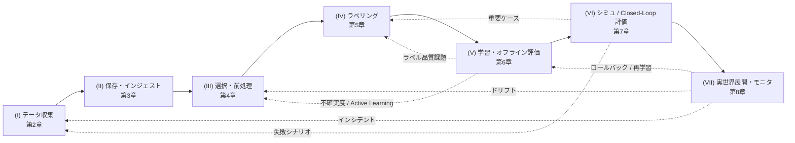

# 1.5 Closed-Loop データエンジンの 7 段階

本書の中核となる **Closed-Loop データエンジン** を 7 段階に分解します。それぞれの役割、ボトルネックの典型、組織規模別の実装難度を示します。各段階の詳細は第2章以降で扱いますが、ここでは「自社の Closed-Loop はどこまで閉じているのか」を点検する **共通言語** を提供することが目的です。

## 7 段階の俯瞰

> **図 1.10**：7段階 Closed-Loop データエンジン。直線パイプラインではなく、複数の経路で前段にフィードバックが戻る点が要諦。

| 段階 | 章 | 役割 | 主要ステークホルダー |
|---|---|---|---|
| (I) データ収集 | 第2章 | ODD・フリート・センサ・トリガ設計 | 車両 / フィールド / Data Platform |
| (II) 保存・インジェスト | 第3章 | データレイク、メタデータ、ストレージ | Data Platform / SRE |
| (III) 選択・前処理 | 第4章 | サンプリング、Active Learning、合成データ | ML / Data Platform |
| (IV) ラベリング | 第5章 | ポリシー、ツール、品質、オートラベリング | Labeling Ops / ML |
| (V) 学習・オフライン評価 | 第6章 | 分散学習、量子化、レジストリ、メトリクス | ML |
| (VI) シミュ・Closed-Loop 評価 | 第7章 | シナリオ、SiL、HiL、世界モデル評価 | Simulation / Test |
| (VII) 実世界展開・モニタ | 第8章 | OTA、Shadow Mode、ドリフト検知、RCA | Onboard / Operations / Safety |

## 各段階の役割

### (I) データ収集

**主目的**：「どのようなシーンを、どのようなバランスで、どのようなセンサで集めるか」のポリシーと実装。

**判断ポイント**（第2章で詳述）：

- 自分たちの ODD に対し、どの地域・時間帯・天候の走行が不足しているか
- どの種類のインシデント・介入を「収集トリガ」として定義しているか、保存窓は何秒か
- FOT 車両（Field Operational Test; 公道実証車）・量産車両・社内実験車両の役割分担、それぞれのロギングポリシー

これらの問いに具体的に答えられる状態が、「データ収集が暗黙知ではなく **設計** されている」状態です。

### (II) データ保存・インジェスト

**主目的**：あとから必要になったときに、どのような切り口でデータにアクセスできるか。

**典型的失敗パターン**：

- データはあるが、誰もどこに何があるか分からない
- 同じようなログが複数のストレージに重複している
- 学習済みモデルが「どのデータで学習されたか」をトレースできない

**成熟度指標例**：

- 「雨天夜間の交差点右折」のような複合クエリに対するレスポンス時間
- 同一 Drive / Scene の重複保存率
- データセット定義をメタデータレベルで再構成できるか

### (III) データ選択・前処理・データセット設計

**主目的**：データレイクから学習・評価に用いるデータセットを設計する。Closed-Loop 改善で最も「工学的工夫の余地が大きい」ステージのひとつ。

**問い**：

- ODD セグメントごとのサンプル数・走行時間の分布は？
- Long-tail セット・評価専用セットは明示的か？
- 前処理・データオーグメンテーションのバージョン管理ができているか？

第4章では Active Learning（BALD / Core-set / BADGE）、シーン検索、合成データ、データガバナンスを詳しく扱います。

### (IV) データラベリング・オートラベリング

**主目的**：人手ラベル投資を最適化し、Closed-Loop の中核となるラベル品質を保つ。

**焦点**：

- どのサンプルに人手ラベルを投資するか（Active Learning との接続）
- どこまでオートラベリング（SAM（Segment Anything Model）/ SAM2 / Grounding DINO / Tesla 式 Multi-trip Reconstruction）で代替するか
- 品質指標（Cohen's Kappa / Fleiss / Krippendorff の各一致度指標）の運用と再ラベル判断

ラベルは「組織としての世界の見方」を定義します。スキーマの曖昧さは、どれだけモデルを改良しても性能上限を下げます。第5章で詳述します。

### (V) モデル学習・オフライン評価

**主目的**：(III)(IV) の入力と (VI)(VII) の出力をつなぐ要。エラー分析と再学習を継続的に回す。

**焦点**：

- BEV / Occupancy / End-to-End の選択と分散学習（FSDP / DeepSpeed）
- Drive Orin 等の車載制約への量子化・剪定（INT8 / INT4 / GPTQ / AWQ などの低ビット圧縮）
- nuScenes mAP / NDS / AMOTA（Average Multi-Object Tracking Accuracy）/ Occupancy mIoU / ADE / FDE などの指標と ODD セグメント別分解
- 「(V) の出口が (III)(IV) の入り口になっているか」が最も重要

### (VI) シミュレーション / Closed-Loop 評価

**主目的**：時間発展を伴う Closed-Loop 環境で挙動を評価する。単フレーム精度ではなく **連続意思決定の安全性・快適性** を評価できる。

**焦点**：

- ODD × 機能ごとのシナリオカバレッジ（PEGASUS（独自動運転業界共同プロジェクト）/ Safety Pool）
- 同一シナリオ上のリグレッション検知（過去パスしたシナリオで失敗が再発していないかの確認）
- 実世界インシデントを「数千〜数万バリエーション」に拡張する Sim2Real（シミュレーションから実環境へ）/ Real2Sim（実走行ログをシミュレーションに取り込む）ループ
- World Model 評価（再現性 / 多様性 / 安全マージン）

### (VII) 実世界展開・オンライン評価・フィードバック

**主目的**：Closed-Loop の入口と出口を兼ねる段階。OTA、Shadow Mode、ドリフト検知、インシデント分析、再学習トリガまでを扱う。

**焦点**：

- UNECE R155/R156 整合の OTA（Uptane / Mender 等）
- 3 層ドリフト検知（入力 / ラベル / 性能）と SPRT（Sequential Probability Ratio Test; 逐次確率比検定）による A/B 早期停止
- インシデント / Near-miss（ヒヤリハット）の RCA（Root Cause Analysis; 根本原因分析）を (I)〜(IV) に戻すフロー
- MRM (Minimum Risk Maneuver; 最小リスク操作) 検証とフェイルセーフ
- EU AI Act / 改正個保法 / PIPL 等の規制対応

## 段階別ボトルネック Top 3

実プロジェクトで頻出するボトルネックを、段階別に整理しました（第2〜8章で各段階の対策を詳述）。

| 段階 | ボトルネック Top 3 |
|---|---|
| (I) | ODD カバレッジ不十分 / トリガ定義の曖昧さ / 通信帯域制約 |
| (II) | スキーマ進化への追従困難 / ホット/コールド階層の設定ミス / データ重複 |
| (III) | Long-tail 定義の曖昧さ / Active Learning の効果計測困難 / 合成データの分布管理 |
| (IV) | ラベル定義の曖昧さ / IAA 品質の低下 / 再ラベル戦略の遅延 |
| (V) | データ ↔ モデルバージョン紐付け不在 / 大規模分散学習の停止頻度 / 量子化精度劣化 |
| (VI) | シミュ環境のスケール / Sim2Real ギャップ / カバレッジ指標の合意 |
| (VII) | OTA セキュリティ整合 / ドリフト誤検知 / インシデント → DataOps の遅延 |

## 組織規模別の実装ロードマップ

| 組織規模 | フェーズ目安 | 段階達成 | 期間目安 |
|---|---|---|---|
| 小規模（10〜50 人） | スタートアップ / 単一プロジェクト | (I)〜(III) を整備、(IV) は最小限 + ベンダー活用 | 6 ヶ月 |
| 中規模（50〜200 人） | 市場投入直前 / 限定 ODD 量産 | (I)〜(V) を整備、(VI) を簡易導入 | 12 ヶ月 |
| 大規模（200+ 人） | グローバル量産 / ロボタクシー | (I)〜(VII) すべて + 監査・規制 | 18〜24 ヶ月 |

> 期間はあくまで目安で、著者および公開事例（Tesla AI Day、Waymo Safety Report 等）から推定した経験則です。データの規模、既存の DataOps 成熟度、規制対応の必要性によって大きく変わります。自社状況に応じて 1.5 倍〜2 倍のレンジを想定するのが安全です。

## セルフアセスメントの方法

7 段階を運用するうえで、定期的に **セルフアセスメント（自己点検）** を行うと、投資先の優先順位が明確になります。各段階を「プロセスが定義されているか」「指標が定義されているか」「改善サイクルが存在するか」の 3 軸で、0〜2 点でスコアリングします。

| 段階 | プロセス | 指標 | 改善サイクル | 合計 |
|---|---|---|---|---|
| (I) 収集 | 0/1/2 | 0/1/2 | 0/1/2 | /6 |
| (II) 保存 | … | … | … | /6 |
| … | … | … | … | … |
| (VII) 展開 | … | … | … | /6 |

合計点や段階ごとのスコアを比較し、「(III)(IV) が弱い」「(V) でのエラー分析が (III)(IV) に十分戻っていない」といったギャップを可視化します。これは **四半期に 1 回** の頻度で実施することが多くあります。第二版改訂版の第 8.7 節（DataOps へのフィードバックサイクル）で具体テンプレートを示します。

## 1.1〜1.4 との関係

本節の 7 段階は、これまでの議論を統合する「座標系」として機能します。

- 1.1 で述べたモデル中心からデータ中心への移行は、(I)〜(IV) と (V) の **力学関係の変化** として現れる
- 1.2 のスタック構造は、各段階で扱うモジュールとシグナルを位置付ける地図
- 1.3 のグローバルトレンド（世界モデル、自然言語、Foundation Model、合成データ）は、7 段階のそれぞれに「高度コンポーネント」として挿さる
- 1.4 の DataOps / MLOps アーキテクチャは、7 段階を物理的に支える基盤

## 本節の振り返り

7 段階フレームワークを提示した本当の意図は、各段階の名称や順序を覚えてもらうことではありません。**「自社の Closed-Loop はどこで切れているか」を組織内の共通言語で議論できるようにする** ことが目的です。実プロジェクトで頻繁に観察されるのは、(V) のモデル学習チームが「最新モデルを試した」と報告し、(VII) の運用チームが「ヒヤリハットが多い」と報告するが、両者を結ぶ (I)→(III)→(IV) の経路が誰の責任かが曖昧で、結局「データチームが頑張る」という抽象的な決議で終わるパターンです。7 段階フレームワークは、この曖昧さを段階別に切り分け、責任不在の段階を可視化する道具です。

セルフアセスメントの「プロセス / 指標 / 改善サイクル」という 3 軸も、単なる評価項目ではなく、**「何ができていれば段階が機能していると言えるか」の最低水準** を示します。プロセスが定義されていても指標がなければ進捗を測れず、指標があっても改善サイクルがなければ単なるダッシュボードで終わります。3 軸が揃ってはじめて、その段階は Closed-Loop の一部として動きます。読者がこのフレームワークを社内に持ち込むときに気をつけてほしいのは、**点数を競わせないこと** です。スコアの絶対値より、四半期ごとの推移と段階間のバランスが重要です。すべて 6 点でも、(V) と (VI) のあいだのフィードバック経路が機能していなければ、ループは閉じていません。

もう一つ強調したいのは、**段階の達成順序は組織規模によって異なる** という点です。小規模スタートアップが (VI)(VII) を完璧に整える前に、(I)〜(IV) の基礎を固める方が現実的です。逆に大規模 OEM では (VII) の規制対応が遅れると事業ごと止まるので、規模に応じた優先順位の判断が必要です。表面的な「7 段階すべてを揃える」目標ではなく、**自社のフェーズで一番ボトルネックになっている段階を特定する** ことが、本節の使い方の核心です。

## 次節への橋渡し

最後の 1.6 節では、本書の **スコープ外** とした領域を明示します。車両制御・パワートレイン・UI/UX 詳細・規格条文解説・チップ設計などは別の専門書に譲り、本書では「データ・モデル・評価」の領域に集中することを再確認します。
