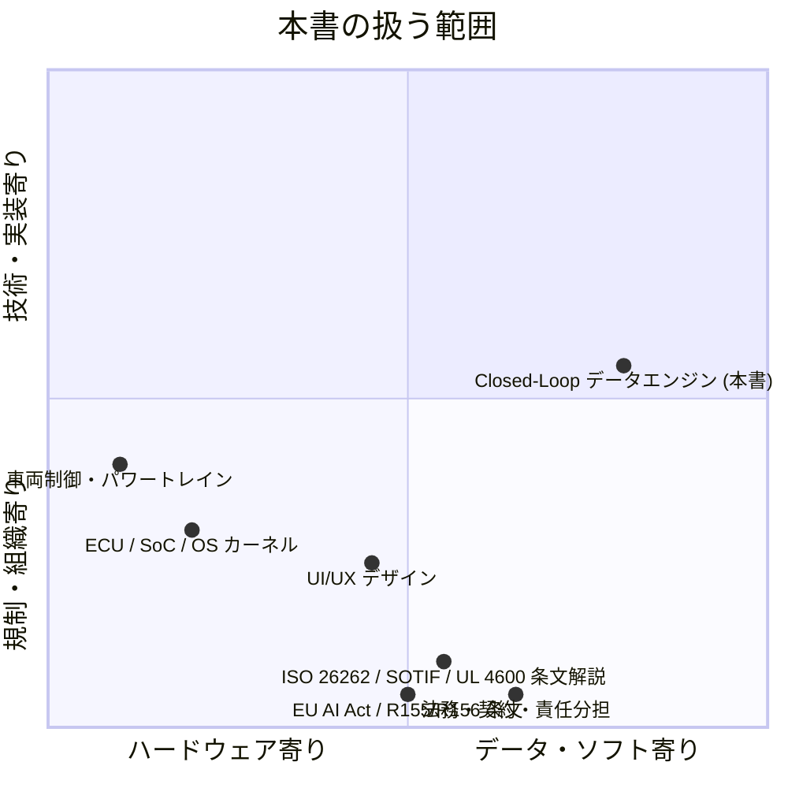
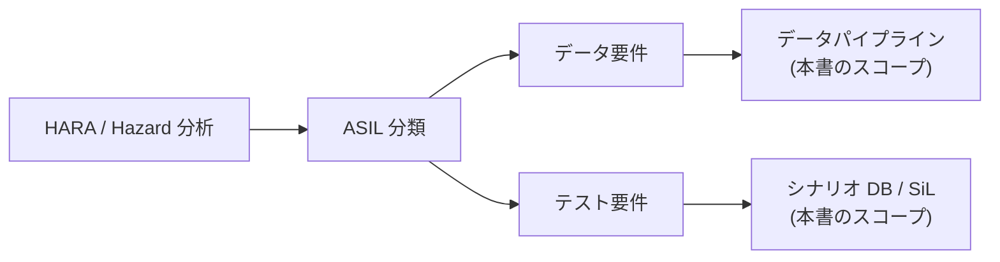

# 1.6 本書で扱わない領域・対象外とした技術

本節の結論を先に述べます。本書は **「データ・モデル・評価」** に集中します。車両制御・パワートレイン・チップ設計・規格条文の逐次解説・法律解釈は隣接領域として接続面のみに触れます。本書の焦点を明確にするため、意図的に **詳細を扱わない領域** と、**他の専門書に委ねる範囲** を整理します。あわせて、隣接領域との **境界面** や地域別の規制要件をどう参照するかを示し、本書を実プロジェクトで使うときに誤解を生まないようにします。

## スコープと隣接領域のマトリクス

> **図 1.11**：本書のスコープと隣接領域。本書が中央右に位置するのに対し、車両制御・チップ設計・規格条文解説・法務は周辺領域として、それぞれの専門書を参照する想定です。

## 領域別のスコープ詳細

### 車両制御・パワートレイン・UI/UX

ステアリング・ブレーキ・パワートレイン制御、シャーシ設計、電動化、ドライバ向け UI/UX は本書の主対象ではありません。ただし、データ中心・Closed-Loop の観点から **接続面** には触れます。

| 隣接領域 | 本書での扱い |
|---|---|
| 制御則設計・チューニング | 扱わない。**制御出力 / トラッキング誤差をログとして使う方法** は扱う |
| 画面レイアウト・色使い | 扱わない。**警告表示タイミングがテイクオーバー反応に与える影響をログ化する** ことは扱う |
| ドライバ監視 (DMS; Driver Monitoring System) アルゴリズム自体 | 扱わない。**DMS 信号を Closed-Loop 評価に取り込む方法** は扱う |

### 安全認証プロセス（ISO 26262 / SOTIF / UL 4600）

ISO 26262（機能安全規格）、SOTIF（Safety Of The Intended Functionality; ISO 21448、意図機能安全）、UL 4600（自律システムのセーフティケース規格）の条文逐次解説は行いません。代わりに、**安全認証の要求をデータ要件・テスト要件・指標に翻訳する方法** を扱います（第7.9 節 / 第8.9 節）。

> **図 1.12**：安全認証プロセスの上位仕様から、本書が扱う「データパイプライン」「シナリオ DB / SiL（Software-in-the-Loop）」へ落とすときの境界線。条文解釈は **必ず社内安全担当・外部認証機関** と連携してください。

### ハードウェア設計・OS カーネル最適化

ECU・SoC のチップ設計、メモリ階層、リアルタイム OS のスケジューリングは本書の対象外です。一方で、**ハードウェア制約をデータセット設計・モデル選択・評価指標に翻訳する** 議論は本書の中心テーマです。

代表的な制約条件と本書での扱いを示します。

| 制約 | 本書での扱い |
|---|---|
| Drive Orin (254 TOPS, 12 GB DRAM) のようなプラットフォーム性能 | 第6.6 節：量子化・剪定、ODD 別レイテンシ予算 |
| バッチ推論不可（実時間 1 サンプル毎） | 第6.6 節：学習時のバッチ構成、リプレイ可否 |
| ECU（Electronic Control Unit; 電子制御ユニット）温度・電力上限 | 第6.6 節：DVFS（Dynamic Voltage and Frequency Scaling）による精度トレードオフ |

### 法規制・責任分担の詳細解説

各国・各地域の道路交通法、型式認証、責任分担の解釈は、**法務・コンプライアンス担当および外部専門家** と連携する範囲です。本書は次の 3 点に絞って扱います。

- インシデント発生時の **データ・メタデータをトレース可能** にする方法
- セーフティレポート・規制報告に耐えうるログとレジストリ設計
- 主要規制（GDPR / 改正個保法 / PIPL / EU AI Act / UNECE R155/R156）の **構造的な要件** とデータエンジンへの影響

#### 地域別規制フレームワーク（要点）

| 地域 | 主規制 | 主担当 | データ越境 | 本書で詳述する章 |
|---|---|---|---|---|
| **米国** | NHTSA Standing General Order [R5](references#r5)、SAE J3018 [L8](references#l8)、CCPA | NHTSA / 州 DMV | 比較的緩い | 第8.6, 8.9 |
| **EU** | UNECE R155/R156 [O2, O3]、GDPR [L14](references#l14)、EU AI Act [L10](references#l10) | UNECE / EC | 厳格、十分性決定 | 第2.8, 8.4, 8.9 |
| **日本** | UNECE R157 [L6](references#l6)（ALKS 部分）、改正個保法 [L13](references#l13)、JAMA ガイド | MLIT / 個情委 | 越境制限あり | 第2.8, 8.9 |
| **中国** | PIPL [L12](references#l12)、CAC データ越境管理 | 工業信息化部 / CAC | 厳格、原則国内処理 | 第2.8, 3.8, 8.9 |
| **韓国** | 個人情報保護法、自動運転法 | KMOLIT / PIPC | 制限あり | 第2.8（参考） |

> 一次情報は変動が激しいため、必ず **執筆時点（2025 年初）** の各国法規を確認してください。

## OEM / Tier1 / Tier2 の責任分担と Closed-Loop

データオーナーシップとモデル更新権限の整理は **第8.9 節** で扱います。ここでは概念的な分担例だけ示します。OEM (Original Equipment Manufacturer; 完成車メーカー)、Tier1（一次サプライヤ）、Tier2（二次サプライヤ）はサプライチェーン上の階層を表します。

| ロール | データオーナーシップ | モデル更新権限 | 障害責任 |
|---|---|---|---|
| OEM | 量産フリート全体のデータ | 自社統合モデルの最終承認 | 一次責任（製造物責任） |
| Tier1 | 特定機能（AEB、LKA（Lane Keeping Assist）、ADAS Suite）モジュール | 機能モジュールの更新 | 契約に基づく |
| Tier2 | センサ・ECU・ミドルウェア | コンポーネント更新 | 契約に基づく |
| サービサ（ロボタクシー運営） | 走行ログ、運行データ | 運行ポリシー、機能制限 | 運行責任 |

OEM がフリートデータを集約しつつ、Tier1 / Tier2 とは契約上のデータ共有とモデル承認フローを設計するのが一般的です。第8.9 節で RACI 行列（Responsible / Accountable / Consulted / Informed の責任分担表）の例を示します。

## 役割分担からみたフォーカスの再確認

大規模な自動運転プロジェクトでは、次のような複数の専門チームが協調しています。本書が主に対象とするのは **太字** のチームです。

| チーム | 専門領域 | 本書のスコープ |
|---|---|---|
| 車両開発 | 車両制御・パワートレイン・シャーシ | 隣接 |
| 機能安全・法務 | 安全認証・法規制・契約 | 隣接（要約のみ） |
| **データ基盤** | DataOps・インフラ・セキュリティ | **本書のメインスコープ** |
| **モデル開発** | Perception / Prediction / Planning / E2E | **本書のメインスコープ** |
| **シミュ・テスト** | シナリオ設計・Closed-Loop 評価 | **本書のメインスコープ** |
| Onboard / Vehicle Integration | 車両搭載・OTA・テレメトリ | 接続面のみ詳述 |
| 運用 / フィールドオペ | 量産フリート運行・整備 | 接続面のみ詳述 |

## 本節の振り返り

スコープを意識的に絞ることは、技術書として誠実な姿勢の表明であると同時に、**読者を「何でも本書で解決できる」という錯覚から守る** ためでもあります。データ中心 Closed-Loop の視点は強力ですが、車両制御の安定性、ECU の温度管理、ISO 26262 の条文解釈、各地域の道路交通法といった領域は、それぞれ専門書とその領域の専門家を必要とします。本書を実プロジェクトで使うときに最も危険なのは、「データパイプラインが整っているのだから安全認証も大丈夫だろう」という越権的な拡大解釈です。逆に「データ中心は流行っているらしいが、安全認証チームと話したことはない」という分断も同じくらい危険です。

実務で見落とされやすい観点は、**隣接領域との「境界面のログ設計」** です。本節で示したように、本書は車両制御そのものは扱いませんが、**制御出力とトラッキング誤差をログとして使う** ことは扱います。DMS のアルゴリズム自体は扱いませんが、**DMS 信号を Closed-Loop 評価に取り込む方法** は扱います。この「境界面のログ化」が抜けると、隣接領域での問題（制御チューニングの不整合、ドライバの介入パターンの変化）が、データ中心ループの中で見えなくなります。読者の組織で本書を使うときは、自分の担当領域の隣にあるチームに「あなたたちの出力で、私たちがログとして残しておくべきものは何ですか」と聞くことから始めるのが有効です。

地域別規制の扱いについても一言。本書は EU AI Act / R155/R156 / GDPR / 改正個保法 / PIPL の **構造的な要件** を整理しますが、条文の細部や最新の解釈変更には追従しきれません。これは技術書一般の宿命です。読者が量産事業に関わっているなら、社内法務との定期的な対話と、各規制当局の一次情報への直接アクセスを、**本書の知識とは別経路で** 確保することが必須です。本書はその対話を効率化するための共通語彙を提供します。OEM / Tier1 / Tier2 の責任分担も同様で、契約と RACI 行列の精緻化は本書の枠外であり、第 8.9 節を読み終えた後に組織内で議論すべきテーマとして残ります。

## 次章への橋渡し

第1章では、モデル中心からデータ中心への転換、自動運転スタックの3類型、グローバルトレンド、DataOps / MLOps アーキテクチャ、7 段階 Closed-Loop データエンジン、本書のスコープを順に整理しました。これで Part I（概観）は完了です。

第2章からは Part II として、7 段階の出発点である **(I) データ収集** に入ります。ODD の定義、フリート設計、センサ構成（最新の HDR カメラ、4D Imaging Radar、SPAD LiDAR、Event Camera を含む）、PTP/gPTP による時刻同期、MCAP フォーマット、エッジトリガ、オンボードデータ品質モニタリング、地域別プライバシー / セキュリティ要件まで、データ中心開発の **土台** となる設計を詳しく扱います。
