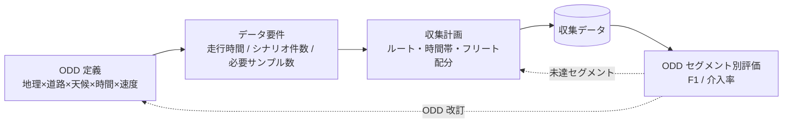
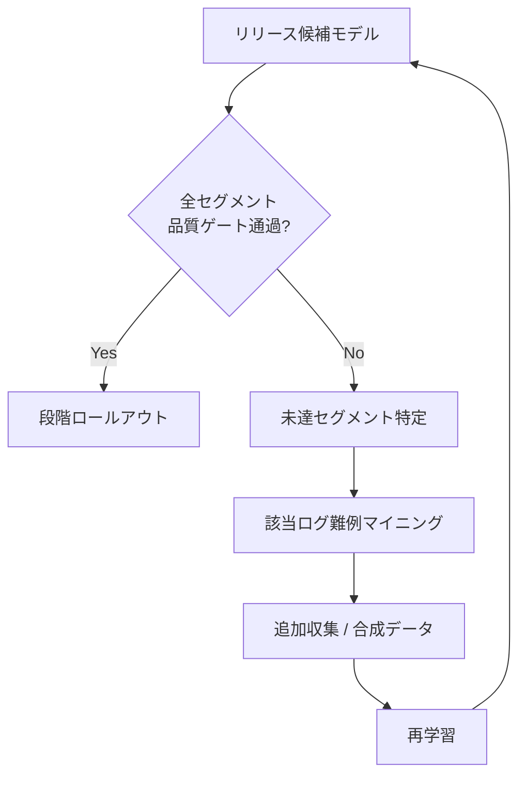
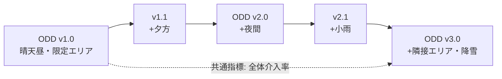

# 2.1 ODD（運用設計領域）とユースケースの定義

自動運転 (autonomous driving; AD) と ADAS (Advanced Driver Assistance Systems; 先進運転支援システム) の開発は、ODD (Operational Design Domain; 運用設計領域) の定義から始まります。本節では ODD とユースケースを Closed-Loop データエンジンの「座標系」として捉え直し、走行時間・シナリオ件数・必要サンプル数といったデータ要件にどう翻訳するかを整理します。

## ODD はデータ要件への変換器である

ODD とは、SAE J3016 [L7](references#l7) において「システムが意図どおりに動作するよう設計された前提環境の集合」と定義される概念です。たとえば「都内の高速道路を晴天昼間に時速 80 km 以下で走行する」という条件の組み合わせが ODD にあたります。実務では次の軸で記述します。

- 地理 (geographic)：対象都市・高速道路網・サービスエリアの境界
- 道路種別 (roadway type)：高速道路・幹線・住宅街・交差点・ランプ
- 交通条件 (traffic)：交通密度、歩行者・自転車の有無、車線数
- 環境条件 (environmental)：天候、照度、季節、路面状態
- 動的制約 (dynamic)：速度域、勾配、曲率、最小車間

データ中心 (data-centric) の開発では、ODD を「どの分布のデータを、どれだけのカバレッジで集めるか」というデータ要件への**変換器**として扱います。ASAM (Association for Standardization of Automation and Measuring Systems; 自動化・計測標準化協会) は ODD 記述を機械可読にする OpenODD を整備しており [Sim7, Sim9]、ODD をタグ体系として定義しておくと収集計画・データセット設計・評価指標・ヒヤリハット分析のすべてで同一の語彙を再利用できます。

ODD タグ辞書を設計する際に最も陥りやすい失敗は、軸を増やしすぎて運用が回らなくなることです。地理と道路だけで百以上のタグが膨らみ、収集計画とラベリングと評価で別々の語彙が使われてしまうと、「夜間の高速本線」がチームによって違うラベルを指す、という事態が起こります。逆に軸を 2〜3 個に削りすぎれば、ロングテール条件をひとまとめにしてしまい、料金所付近の雨夜のような事故寄与度の高い領域がカバレッジ表に現れません。OpenODD のような既存ラベル体系を出発点として、自社固有の軸（サービス地域名や運用形態）だけを拡張する設計が現実的です。タグ辞書を Git で管理しレビューを必須にする運用は手間に見えますが、これがないと「気がついたら同じ意味のタグが三つ存在する」という典型的な失敗を防げません。Closed-Loop の観点では、ODD タグは収集計画と評価レポートとヒヤリハット報告で同一の語彙として再利用される共通インターフェースであり、この語彙の一貫性こそがデータ中心開発の出発点です。

> **図 2.1**：ODD を起点に要件・収集・評価が一巡し、未達セグメントが収集計画と ODD 定義へ戻る Closed-Loop。ODD は「一度決めて終わり」ではなく更新対象である点が要点です。

## カバレッジ表：構造と優先順位付け

ODD を運用するには、軸の直積で**カバレッジ表 (coverage matrix)** を作り、各セルに目標走行時間・シナリオ件数・現状値・達成率を記録します。次は都市高速 ODD v1.0 の抜粋例です。

| セグメント (道路×天候×時間) | 重み w | 目標走行時間 | 現状 | 達成率 | 重点シナリオ件数(目標/現状) |
|---|---|---|---|---|---|
| 高速本線 × 晴 × 昼 | 0.10 | 300 h | 420 h | 140% | 合流 500/610 |
| 高速本線 × 雨 × 夜 | 0.18 | 300 h | 95 h | 32% | 合流 500/120 |
| ランプ合流 × 晴 × 夕 | 0.15 | 200 h | 150 h | 75% | 本線合流 800/540 |
| 料金所付近 × 雨 × 夜 | 0.20 | 150 h | 28 h | 19% | 低速割込み 400/55 |
| トンネル出入口 × 晴 × 昼 | 0.12 | 120 h | 138 h | 115% | 露出急変 300/360 |

優先順位は単純な達成率ではなく、**リスク重み付き不足度**で決めます。セグメント $i$ の重み $w_i$（事故寄与度や ODD 上の重要度）と達成率 $c_i$ から、収集優先スコアを次式で定義します。

$$ \text{priority}_i = w_i \cdot (1 - \min(c_i, 1)) $$

上表では「料金所付近×雨×夜」が $0.20 \times (1-0.19)=0.162$ で最大となり、最優先で追加収集すべきセグメントだと定量的に判断できます。

この優先度計算は単純な算術で自動化できます。カバレッジ表を CSV か Iceberg テーブル（第3章）として持ち、各行で `coverage = min(current_h / target_h, 1.0)` と `priority = weight × (1 - coverage)` を計算し、`priority` で降順ソートして上位を出力するだけです。

ここで設計上の論点になるのは、重み $w_i$ をどう決めるかです。事故寄与度を機械的に重みへ翻訳するアプローチは一見公平に見えますが、過去事故統計に現れない新規 ODD（たとえば降雪ロボタクシー初進出地域）はそもそも事故データが存在せず、重みがゼロに近づいてしまいます。逆に「全セグメント等重み」で運用すると、達成率が低い順に並べた結果、料金所付近×雨×夜のような最重要セグメントが、走りやすい一般道の未達セグメントに埋もれます。重みは過去事故統計と規制要請と社内インシデント分析からチームで合意した数値を起点にし、ODD バージョン更新ごとに見直すべきものです。また達成率が 100% を超えたセグメントを放置すると、収集帯域とアノテーション予算が過剰収集に吸われ、他セグメントの不足が温存されてしまいます。FOT (Field Operational Test; 公道実走試験) チームの収集チケットを `priority` 上位 5 セグメントへ自動的に振り替える運用と、過剰セグメントからルートを引き剥がす運用の両輪が、Closed-Loop における「データ予算の動的再配分」を成立させます。

## 「どれだけ必要か」を統計的に見積もる

カバレッジ表の「目標件数」には根拠が要ります。あるレアシナリオでのモデル失敗率 $p$ を相対誤差 $\varepsilon$ で推定したい場合、必要サンプル数 $n$ は正規近似で次式が目安です。ここで $z_{1-\alpha/2}$ は信頼水準に対応する標準正規分布の分位点で、95% 信頼区間なら約 1.96 です。

$$ n \approx \frac{z_{1-\alpha/2}^2 \,(1-p)}{\varepsilon^2 \, p} $$

たとえば失敗率 $p=0.01$ を相対誤差 25%（$\varepsilon=0.25$）、信頼水準 95%（$z\approx1.96$）で推定するには、約 6,090 件のレアイベントが必要になります。分布の仮定を置きにくい初期段階では Chebyshev 不等式（チェビシェフの不等式：平均から $k$ 標準偏差外れる確率を分布非依存で上から押さえる定理）$P(|X-\mu|\ge k\sigma)\le 1/k^2$ を併用し、保守的な下限を見積もります。より厳密な区間推定が必要であれば二項分布の Wilson 区間（少数サンプルでも妥当な被覆率を持つ信頼区間の構成法）を用いてください。

実装上は、失敗率の想定値 $p$、許容相対誤差 $\varepsilon$（例：0.25）、信頼水準（例：0.95）の三つを入力に、上式で必要件数 $n$ を返す小さな関数を整備して計画書に組み込みます。$p=0.01$、$\varepsilon=0.25$、信頼水準 95% の組み合わせでは約 6,090 件が必要、というのが本節で繰り返し登場する基準値です。

レアイベント発生率を走行 1,000 h あたり 3 件と仮定すると、6,090 件を集めるには約 200 万 h 相当の走行が必要となります。この発生率は公開セーフティレポート [R1, R5] や米カリフォルニア DMV (Department of Motor Vehicles; 車両管理局) の開示 [L9](references#l9) から参考にした例示値で、ODD・地域・SW バージョンにより 1〜2 桁変動します。この逆算の時点で「実走のみでは非現実的」と判明し、第7章の合成データ・シミュレーションへ橋渡しする根拠が定量的に得られます。RAND Corporation の試算 [R6](references#r6) が示す「数億〜数十億マイル」という壁も、この逆算の延長線上にあります。

サンプル数の逆算で最も注意したいのは、失敗率 $p$ を「希望的観測」で過小評価してしまう罠です。$p$ を実態より小さく見積もると必要件数が膨らみ、現実離れした収集計画になり、$p$ を大きく見積もりすぎると逆に「これだけあれば足りる」と過信して評価精度を欠きます。本書が繰り返し基準値として用いる「失敗率 1% を相対誤差 25% で 6,090 件」は、ODD・地域・SW バージョンによって容易に 1〜2 桁ずれることに留意してください。実務では過去ログのトリガ統計（2.6 節）から $p$ を実測して定期更新し、推定値が動いたら必要件数を再計算してリリース判定との整合を取り直す運用が要となります。さらに、6,090 件相当の実走時間を物理的に確保できない ODD については、その事実そのものを ODD 定義書に明記して第7章の合成データへ責任を委ねる構造を作っておくことが、Closed-Loop が止まらない設計です。逆に「実走で取れる範囲だけを ODD と呼ぶ」という割り切りも理屈としては成立しますが、それは商用提供範囲を狭める意思決定であり、技術判断ではなく事業判断として扱う必要があります。

## ODD セグメント別の品質ゲート

ODD を評価軸にすると、リリース判定を**セグメント別品質ゲート**として定義できます。平均 mAP ではなく、安全寄与の大きいセグメントに厳しい合格基準を課すのが定石です。

| セグメント | 指標 | 合格基準 | 未達時のアクション |
|---|---|---|---|
| 料金所付近 × 雨 × 夜 | 歩行者 F1 | ≥ 0.95 | 追加収集 + 専用再学習 |
| ランプ合流 × 全天候 | 合流成功率 | ≥ 0.98 | シナリオ生成で補完 |
| 高速本線 × 晴 × 昼 | 検出 F1 | ≥ 0.97 | 既達・維持監視 |
| トンネル出入口 | 露出復帰時間 | ≤ 0.5 s | HDR センサ再設計 |

> **図 2.2**：品質ゲートを起点とした Closed-Loop。未達セグメントが追加収集・合成・再学習に直結し、ODD カバレッジの穴を埋め続けます。

## ODD バージョニングとフェーズ分割

多くのプロジェクトは、最終 ODD を一気に目指さず段階的に拡張します。Waymo はフェニックス郊外の限定エリアから運用を開始し、サンフランシスコなど複雑都市部へ拡張した経緯を公開しています [R1](references#r1)。ここで重要なのは、ODD を `v1.0 → v2.0` のように**セマンティックにバージョン管理**し、各データ・モデルがどの ODD バージョンに属するかを追跡することです。これにより、運用範囲を広げても過去データの位置づけを失わずに済みます。

> **図 2.3**：ODD バージョン遷移。共通指標（全体介入率）はフェーズをまたいで連続追跡し、各バージョン固有指標（夜間ヒヤリハット率など）を加算していきます。

フェーズ設計では、(1) フェーズ横断の共通指標と (2) フェーズ固有指標を分離し、データセットとシナリオ DB の各サンプルに `odd_version` タグを付与します。これにより、v1.0 データで学習したモデルを v2.0 で評価したときの劣化を定量化でき、Closed-Loop の改善度を比較可能に保てます。

ODD バージョニングで見落とされがちな失敗は、「拡張」と「本質的変更」を区別せずに番号だけを進めてしまうことです。たとえば「夕方走行を追加」は v1.1 で十分ですが、「降雪地域を追加」はセンサ要件もモデル要件も大きく変わるため v2.0 として扱うべきで、これを v1.5 のような中間番号で済ませてしまうと、後から「v1.x データはどこまで使えるのか」が判断不能になります。Semantic Versioning ルールで採番し、マイナーは互換性のある拡張、メジャーは本質的変更、と運用上の意味を切り分ける設計判断が要点です。データレイクの全テーブルに `odd_version` カラムを ETL（Extract / Transform / Load）パイプラインで自動付与する仕組みを最初に作っておかないと、半年後に過去データを掘り起こすときに「これはどの ODD バージョンで走った Drive か」が再構成できず、Closed-Loop の改善前後比較が不可能になります。共通指標（介入率・1 万 km あたりインシデント率）はバージョン横断で連続追跡し、フェーズ固有指標（夜間ヒヤリハット率など）はバージョン追加とともにダッシュボードへ段階的に組み込んでいく構造が、運用範囲拡大に追従する Closed-Loop の骨格となります。

## ユースケース定義とステークホルダー合意

ODD を技術チームだけで決めると、ビジネス・運用要件と乖離します。料金所・IC 出入口・一般道接続部は安全認証上は厄介でも、サービスとしては不可欠なユースケースです。次のステークホルダーを巻き込み、合意内容を ODD タグと KPI に落とし込みます。

| ステークホルダー | 主な関心 | ODD/KPI への反映 |
|---|---|---|
| プロダクト企画 | 提供地域・時間帯・サービス形態 | 地理・時間軸の境界 |
| 運用チーム | 運行形態（シャトル/配車）、デポ配置 | ルート分布・走行時間配分 |
| 安全・法務 | 認証可能性、地域規制 | 顔・位置情報の収集可否（2.8節）|
| 技術（車両/モデル/基盤）| 開発コスト・スケジュール | 達成可能な ODD 上限 |

KPI は「1 万 km あたり介入回数」「1 乗車あたりヒヤリハット回数」「セグメント別インシデント率」などをユースケースとセットで定義し、後続の Closed-Loop でそのまま運用します。

## ODD とデータガバナンスの交差点

ODD は安全・技術だけでなくデータガバナンスにも直結します。EU 域内を ODD に含めれば GDPR [L14](references#l14)、中国なら PIPL [L12](references#l12) と CAC の越境規制、日本なら改正個人情報保護法 [L13](references#l13) の制約が、顔・車内映像・位置情報の収集可否を左右します。規制上必要なデータを収集できない地域は、ODD から外すか機能を限定する判断もあり得ます。詳細は第2.8節で扱いますが、ここでは「ODD 定義は技術・ビジネス・法規制・ガバナンスの交差点にある」点を押さえてください。なお本書は法的助言を提供するものではなく、最終判断は各組織の法務専門家と行ってください。

## 本節の振り返り

本節の主張を一文に圧縮すれば、ODD は「安全に走れる範囲の宣言」であると同時に「データ要件への変換器」であり、Closed-Loop データエンジンの座標系そのものだ、ということになります。地理・道路・交通・環境・動的という 5 軸のタグ辞書は、収集計画と評価レポートとヒヤリハット報告で同一の語彙として再利用される共通インターフェースであり、この語彙の一貫性が崩れた瞬間にデータ中心開発は機能不全に陥ります。カバレッジ表を直積で作り $w_i(1-c_i)$ で優先度を計算する仕組みは、料金所付近×雨×夜のような事故寄与度の高い領域が走りやすい一般道の未達セグメントに埋もれる事態を防ぎ、データ予算を動的に再配分するための定量基盤です。失敗率 1% を相対誤差 25% で推定するには 6,090 件、それを発生率 1,000 h あたり 3 件で逆算すると 200 万 h の走行が必要、というサンプル数の見積もりは、実走だけでは ODD カバレッジが完結しないことを冷徹に示し、第7章の合成データへ責任を引き継ぐ橋渡しの根拠になります。ODD セグメント別の品質ゲート（歩行者 F1 ≥ 0.95 など）は、平均 mAP の罠を避けて安全寄与の大きい領域に厳しい合格基準を課す装置であり、`odd_version` カラムによるバージョン管理は運用範囲拡大の中で過去データの位置づけを失わないための仕組みです。これらは独立した施策ではなく、ODD という座標系の上に積み上がる連続した設計判断として理解してください。

## 次節への橋渡し

ODD とユースケースが定まると、次は「それをどの車両群でどう計測するか」という問いに移ります。次の 2.2 節では、FOT・量産・社内実験という車両ロールの分類、必要フリート台数と月走行距離の試算、車両世代差分が性能に与える影響、マルチバイナリ運用の意思決定を、構成テンプレートとメタデータスキーマとともに具体化します。
