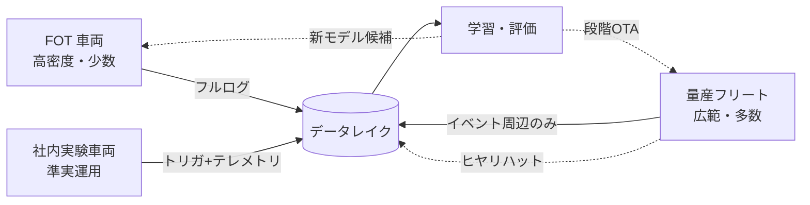
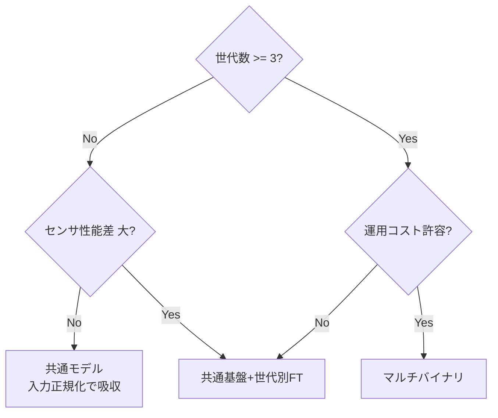

# 2.2 フリート計測戦略と車両ロール

ODD（2.1 節）でデータ要件が定まったら、次は「どの車両群でどう計測するか」というフリート (fleet; 車両群) 設計に進みます。本節では FOT・量産・社内実験という車両ロールの役割分担、必要台数と月走行距離の試算、世代差分の扱い、共通モデルかマルチバイナリかの判断を扱います。

## 三つの車両ロールと収集ポリシー

データ収集源は用途と制約が異なる三つのロールに大別できます。FOT (Field Operational Test; 公道実走試験) は新機能・新センサの探索、量産は分布カバレッジ、社内実験はその中間を担う、と整理するとロギング負荷とアップロード方針を設計しやすくなります。

| ロール | 主目的 | ロギング | ソフト更新頻度 | 制約 |
|---|---|---|---|---|
| FOT / テスト車両 | 新センサ・新 ODD の高密度探索 | ほぼフルログ（数十 TB/日）| 週次〜日次 | 台数が少ない |
| 社内実験車両 | 現場感のある準実運用データ | 中（トリガ＋テレメトリ厚め）| 隔週〜月次 | 業務影響を避ける |
| 量産 / 商用サービス車両 | 広範な分布・統計的イベント | 最小（イベント周辺のみ）| 段階 OTA | コスト・帯域・プライバシー |

Closed-Loop の観点では、FOT を「新機能評価と高品質サンプルの源」、量産を「ロングテール統計とオンラインフィードバックの源」と位置づけ、ロールごとに**アップロードポリシー**を分けます。どのデータがどのロール・どのソフトバージョン (SW Version; Software Version) から来たかは、後段のデータレイクで必ず追跡できるようにします。

ロール設計でありがちな失敗は、量産フリートに対しても「念のため」フルログを取りたくなる誘惑に負けてしまうことです。後の節で示す通り生データは 42 TB/h 規模に達し、量産 500 台にフルログを課せば帯域もストレージも経営判断のレベルで破綻します。逆に FOT までイベントトリガに限定してしまうと、新センサ・新 ODD で「何が起きるか分からない」探索フェーズの情報が指の間からこぼれ落ち、後から再現できないという致命的な失敗につながります。`vehicle_role` を `fot` / `internal` / `production` の列挙型として車両管理マスターに持たせ、ロールごとにアップロードポリシー（フルログ／トリガ＋テレメトリ／イベント周辺のみ）を OTA (Over-The-Air; 無線経由) で配信し、インジェスト時に必須メタデータとして付与する設計は、こうしたバランスを崩さないための制度的なガードレールです。「どのロールの、どの SW バージョンの、どの ODD バージョンで取られたデータか」を後段から復元できなくなった瞬間、Closed-Loop の改善前後比較は意味を失います。

> **図 2.4**：ロール別のデータフロー。FOT が探索、量産がカバレッジを担い、双方が Closed-Loop でデータレイクに収束します。

## 必要フリート台数と月走行距離の試算

フリート規模は「ODD のデータ要件を妥当な期間で満たせるか」から逆算します。2.1 節の例で、あるレアシナリオに約 6,000 件、レア発生率が走行 1,000 km あたり 0.3 件と仮定すると、必要走行距離は約 2,000 万 km です。これを 12 か月で集めるなら次の三段の計算で試算できます。

1. 必要走行距離 = 目標イベント件数 ÷ 1,000 km あたりの発生率 × 1,000。例の値では $6{,}000 \div 0.3 \times 1{,}000 = 2{,}000$ 万 km。
2. 1 台あたりの年間走行 km = 月走行 km × 12。量産車を月 3,000 km と仮定すると年 3.6 万 km。
3. 必要台数 = 必要走行距離 ÷ 1 台あたり年間走行 km。$2{,}000$ 万 ÷ 3.6 万 ≒ **約 556 台**。

月 3,000 km 走る量産車なら約 556 台、月 8,000 km 走る商用シャトルなら約 208 台が目安になります。月 3,000 km は OECD（経済協力開発機構）・国土交通省の自家用車年間平均走行距離（約 9,000〜12,000 km）の月換算をベースにした例示値で、地域・運用形態・季節で 50% 程度変動します。逆に FOT 車両は台数を増やせないため、レアシナリオはシミュレーション（第7章）で補完する前提が、この計算から定量的に導かれます。

この逆算で気をつけたい設計判断は、「レア発生率」を机上の仮定値で固定したまま運用してしまうことです。発生率は ODD・地域・季節・SW バージョンで 50% 以上ぶれるため、過去ログのトリガ統計（2.6 節）から実測値を継続的に取り込み直す必要があります。月走行距離も地域・季節で大きく動くので、最頻・低位・高位の 3 シナリオで見積もりを経営層と共有しないと、「平均値で合意したのに冬の北日本で 60% しか走れなかった」という事業計画レベルの破綻が起こります。商用シャトル・配車サービス・社用車のように走行距離が多い車種をフリートに組み込めば台数は抑えられる一方、走行パターンが偏るため ODD カバレッジは別軸で確認が必要です。逆に「とにかく台数を増やす」アプローチは、車両調達費・通信費・整備体制の三重のコスト爆発を招き、データ収集の費用対効果を急速に悪化させます。必要台数が現実的でない場合に、合成 70% ／実走 30% のような補完比率を計画書に明記して第7章のシミュレーションに責任を委譲する設計判断は、Closed-Loop が「実走の物理限界」で止まらないための重要な逃げ道です。

下表はフリート構成テンプレートの例です。

| ロール | 台数 | 月走行 km/台 | 年間合計 km | 主担当 ODD セグメント |
|---|---|---|---|---|
| FOT | 20 | 2,000 | 480 万 | 新規 ODD・新センサ検証 |
| 社内実験 | 50 | 1,500 | 90 万 | 都市部・準実運用 |
| 量産 | 556 | 3,000 | 2,000 万 | 全 ODD 広域カバレッジ |

## 車両世代差分と性能影響

同一サービス内でも、ECU (Electronic Control Unit; 電子制御ユニット)・センサ構成・車体プラットフォームが異なる複数世代が併存するのが通常です。世代差はモデル性能の統計を歪めます。次は世代別の性能差分シートの例です。

| 項目 | Gen-A | Gen-B | 性能影響（同一モデル） |
|---|---|---|---|
| 前方カメラ | 2 MP（メガピクセル）/ 30 fps（毎秒フレーム数） | 8 MP / 30 fps | Gen-A は遠方小物体 mAP（mean Average Precision）−0.04 |
| LiDAR (Light Detection and Ranging; レーザー測距センサ) | 32 ch | 128 ch | Gen-A は 50 m 超 3D F1 −0.06 |
| SoC (System on Chip) | 30 TOPS（毎秒兆回演算）| 254 TOPS | Gen-A は推論 latency +18 ms |
| 死角率 | 8.2% | 4.1% | Gen-A は近接割込み見逃し増 |

世代をキーにした統計が無いと、「Gen-B は問題ないが Gen-A の特定 ODD でヒヤリハット多発」という現象を見逃します。Closed-Loop では `vehicle_gen` を評価軸に常時加え、世代別レポートを自動生成しましょう。

世代差を「平均値」で語ってしまうと、Gen-B の好成績で Gen-A の劣化が薄められ、安全寄与が大きい最弱世代の問題が見えなくなります。これは平均 mAP の罠の世代版で、リリースゲートを世代横断の単一基準で運用してはいけない理由でもあります。世代別×ODD セグメント別の 2 軸クロス集計を主要 KPI（mAP・F1・介入率・ヒヤリハット率）すべてに適用し、最弱世代がセグメント別ゲートを満たしていることを個別に確認する設計が定石です。逆に「世代別に基準を緩める」アプローチは短期的には合理的に見えますが、Gen-A 搭載車のユーザに対して相対的に低い安全水準を許容することと等価であり、安全認証と社内倫理の両面で説明困難な意思決定になります。世代別レポートを自動生成する仕組みは、こうした構造的な問題を経営判断のテーブルに乗せるための情報基盤として機能します。

## マルチバイナリか共通モデルかの意思決定

世代差をどう吸収するかは、(1) 世代ごとに別モデル（マルチバイナリ）、(2) 共通基盤モデル＋世代別ファインチューニング、(3) 入力側で差分吸収しモデル共通化、の三択に整理できます。

> **図 2.5**：世代数・センサ差・コスト許容度から運用方式を選ぶ意思決定木。世代が多くコストを許容できる場合のみマルチバイナリが妥当で、多くの量産プロジェクトは共通基盤＋世代別ファインチューニングに落ち着きます。

判断軸は、世代数・センサばらつき許容度・検証コストです。マルチバイナリは各世代に最適化できる反面、検証マトリクスが世代数だけ増えます。共通モデルは検証が単純化する反面、最弱世代に性能が引きずられます。いずれの方式を選んでも、世代別データを整理してモデル挙動と結び付ける DataOps（データ運用基盤）が前提となります。

意思決定で見落とされがちなのは、「世代追加 1 つあたりの検証工数」のコスト試算です。マルチバイナリは初期の魅力（各世代で最高性能を出せる）に引きずられて選ばれがちですが、世代数 N に対して検証マトリクスは O(N) で増え、評価データセット・シナリオ DB・回帰テスト・リリース判定がすべて N 倍に膨らみます。逆に「すべてを共通モデルに押し込む」アプローチは検証は単純化されますが、最弱世代（たとえば Gen-A の 32 ch LiDAR）の性能下限に全体が引きずられ、上位世代の投資が無駄になります。実務的には世代数が 3 以上で運用コストが許容できる場合だけマルチバイナリを真剣に検討し、それ以外は共通基盤＋世代別ファインチューニング (fine-tuning; 微調整) を初期方式として、入力正規化（解像度揃え込み・ホワイトバランス補正）でどこまで吸収できるかを最初に試すのが合理的です。Closed-Loop の観点では、いずれの方式を選んでもデータレイクに `vehicle_gen` がメタデータとして残り、世代別の改善カーブを継続観測できる状態が前提になります。

## 車両メタデータスキーマ

「どの構成で学習・評価したか」を後から追跡するには、VIN (Vehicle Identification Number; 車両識別番号)・世代・センサ構成・ソフトバージョン・キャリブ ID を構造化メタデータとして残します。最小スキーマには次の項目を必ず含めます。

- 車両一意識別子（VIN）
- 世代タグ（`Gen-A` / `Gen-B` 等）
- ロール（`fot` / `internal` / `production`）
- ODD バージョン
- ソフトウェアスタック名・バージョン・ビルド ID
- 主要センサ（前方カメラ・ルーフ LiDAR など）の機種名・解像度・チャネル数
- キャリブレーション ID（2.4 節）
- 地域コード（例：`JP-Tokyo`）

各値は走行データのインジェスト時に自動付与します。車両入庫・センサ交換・OTA のたびに新しいレコードを発行（履歴テーブル化）し、過去 Drive がどの構成だったかを `start_ts`（区間開始タイムスタンプ）で範囲検索できるようにします。

このメタデータをデータレイク（第3章）のパーティションキーに使えば、世代別・ソフトバージョン別・地域別の指標をダッシュボードで切り替えられ、新世代導入時の性能差を早期に検知して追加収集・再学習という Closed-Loop アクションへ接続できます。

## フリート構成変化への追従

市場投入後もフリート構成は変化します。世代追加・センサ刷新・ECU リプレースのたびに、データの統計特性は移動します。Tesla は同一機能を異なるハードウェア世代（HW3/HW4）へ展開する際、世代別に検証パイプラインを分けていることを公開資料で示唆しています [D10](references#d10)。構成変化そのものをメタデータ化し、「この期間の学習データはどのフリート構成を前提とするか」を明示することで、世代間ドリフト（第8章）の検知が可能になります。

## 本節の振り返り

本節の核心は、フリート設計を「台数の多寡」ではなく「ロールごとの役割分担とメタデータの整合性」として捉え直すことにあります。FOT は新機能・新センサの探索を担い、量産はロングテールのカバレッジと統計を担い、社内実験はその中間で準実運用の感触を取る、というロール分担を `vehicle_role` で機械的に管理することが、ロギング負荷とアップロード方針を同時に成立させる起点になります。必要フリート規模を「目標イベント件数 ÷ 1,000 km あたり発生率 × 1,000」「月走行 km × 12」「必要走行距離 ÷ 1 台あたり年間走行 km」という三段の逆算で導く手法は、机上の希望ではなく実測値を継続的に流し込み続けることでのみ有効に機能します。世代差を「平均値」で語ることは Gen-A の劣化を Gen-B の好成績で薄める結果につながり、安全寄与の大きい最弱世代が見えなくなる原因になるため、世代別×ODD セグメント別の 2 軸クロス集計を主要 KPI に適用する設計が要点です。マルチバイナリか共通モデルかの選択は、世代追加 1 つあたりの検証工数を冷静に試算し、世代数が 3 以上で運用コストが許容できる場合だけマルチバイナリを真剣に検討する判断順序が現実的です。VIN・世代・センサ・ソフト・キャリブ ID を `start_ts` で範囲検索できる履歴テーブルとして残しておく設計は、半年後に過去 Drive がどの構成だったかを再構成するために絶対に省略できない基盤であり、これを欠くと Closed-Loop の改善前後比較が不可能になります。

## 次節への橋渡し

フリートと車両ロールが定まると、各車両に「どのセンサを、どう組み合わせて載せるか」という設計に進みます。次の 2.3 節では、要件からのバックキャスト、業界標準センサ機種の比較、データレート計算式、そして HDR・4D Imaging Radar・SPAD LiDAR・Event Camera といった最新センサ技術を、視野設計と死角率の観点を交えて掘り下げます。
