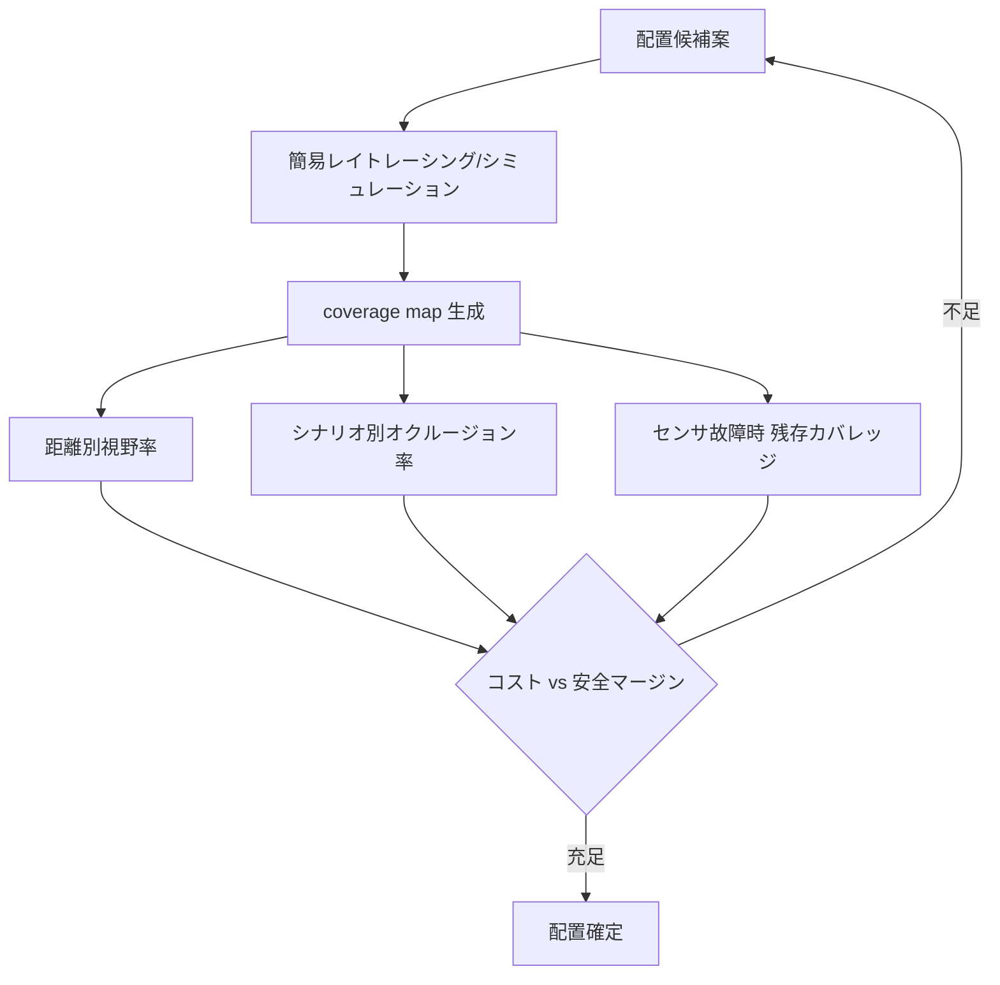
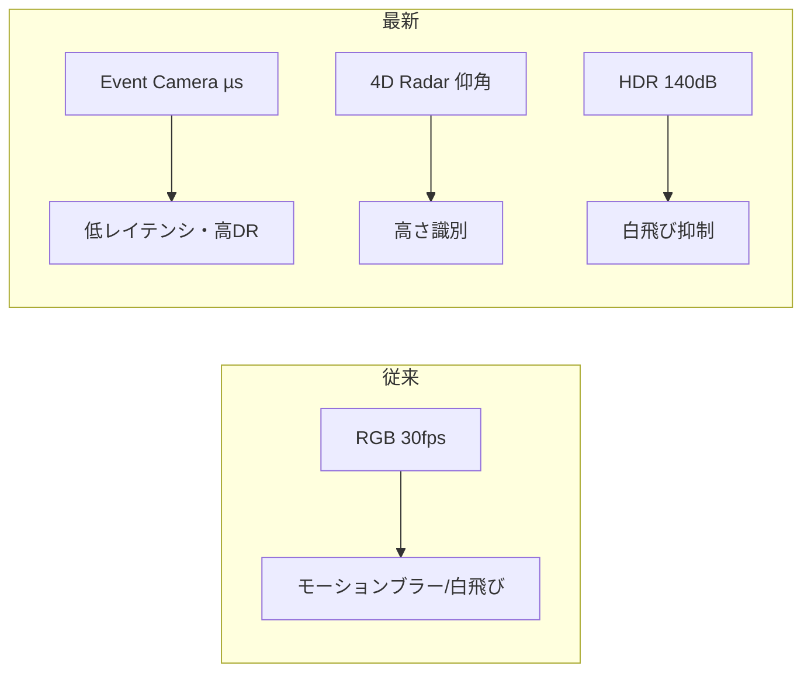

# 2.3 センサー構成の設計（Camera / LiDAR / Radar / GNSS / IMU 他）

センサ選定とは、「どの分布のデータを、どのバイアスとともに集めるか」を決める行為であり、Closed-Loop の入口そのものです。本節では車載センサー構成 (sensor configuration) を ODD とタスクから逆算して設計する手順、業界標準機種の比較、データレートの計算式、視野・死角率の定量評価、そして HDR (High Dynamic Range; 高ダイナミックレンジ) や 4D Imaging Radar など最新センサ技術までを扱います。

## 出発点：ODD とタスクからのバックキャスト

センサ構成は機器一覧ではなく、ODD（2.1 節）とスタック構造（1.2 節）の交差点から逆算します。要求は Perception（知覚）・Prediction（予測）・Planning（計画）・Control（制御）の各層で異なります。Perception は空間分解能・視野・ダイナミックレンジを、Prediction は時間分解能と速度推定を、Planning と Control は位置精度と低遅延を要求します。第一歩として「どのタスクにどのセンサが主情報源か」を表で整理しましょう。

| タスク | 主センサ | 補助センサ | 効くパラメータ |
|---|---|---|---|
| 遠方物体検出 | 望遠カメラ | 長距離 Radar | 解像度・FOV (Field Of View; 視野角) |
| 3D 構造・占有 | LiDAR | サラウンドカメラ | チャネル数・測距 |
| 速度推定・悪天候 | Radar (Radio Detection and Ranging; 電波測距センサ) | LiDAR | ドップラー精度 |
| 自己位置推定 | LiDAR / GNSS (Global Navigation Satellite System; 全球測位衛星システム) | IMU (Inertial Measurement Unit; 慣性計測装置) ・カメラ | 測距・更新周期 |
| 逆光・夜間 | HDR カメラ | サーマル / NIR (Near Infrared; 近赤外) | ダイナミックレンジ |

## 業界標準センサー機種の比較

実機選定では、公開スペックを横並びにして ODD と突き合わせます。下表は各カテゴリの代表機種の公開情報に基づく比較例です（数値は各社公開資料の代表値で、構成により変動します）。

| カテゴリ | 代表機種 | 主要スペック | 典型 ODD | 特徴 |
|---|---|---|---|---|
| 車載カメラセンサ | Sony IMX728 | 約 8 MP、HDR 約 140 dB、LFM (LED Flicker Mitigation; LED 信号機の点滅を抑える機能) 対応 | 都市・高速全般 | LED フリッカ抑制、高 DR |
| 機械式 LiDAR | Velodyne VLS-128 | 128 ch、測距 〜245 m | 高速・都市 | 高密度・全方位 |
| 半導体 LiDAR | Ouster OS1-128 | 128 ch、測距 〜170 m、digital | 都市 | デジタル SPAD、堅牢 |
| MEMS LiDAR | Innoviz One/Two | 高解像度、測距 〜250 m | 高速 | 量産指向ソリッドステート |
| イメージング Radar | Continental ARS548 | 4D、測距 〜300 m、仰角分解能あり | 高速・都市 | 高さ推定可能な 4D Radar |
| Event Camera | Prophesee GenX320 | µs 級時間分解能、低レイテンシ | 高速応答・逆光 | 輝度変化のみ出力 |

> Velodyne / Ouster は 2023 年に統合し、機械式と半導体（デジタル）方式の両系譜を持ちます。ソリッドステート化（MEMS / OPA (Optical Phased Array; 光学フェーズドアレイ) / Flash）は信頼性とコスト面で量産展開の主流になりつつあります。

機種選定で陥りやすい失敗は、データシートのスペック値だけを横並びに比較して机上で決めてしまうことです。データシート上の測距 245 m は理想反射率 80% の白色板に対する値であることが多く、夜間・雨天・低反射ターゲットでは半分以下に縮みます。同じ 8 MP HDR でも、トンネル出口のような輝度急変条件で実用的な復帰時間は機種ごとに大きく異なります。評価機を 2 週間以上自社 ODD の典型シーンで実走させずに本選定するのは、「カタログの数字で安全を約束する」ことと等価で、Closed-Loop が始まる前に入口の品質が崩れます。さらにデータシートを発行年・ロット番号付きで保管しておかないと、半年後にスペックが改訂されたときに「どのバージョンを根拠に選定したか」を再構成できず、リコール対応や安全評価の根拠を失います。量産展開を見据えるならソリッドステート LiDAR（MEMS / Flash）を優先し、機械式は可動部の振動・寿命リスクから FOT 限定とする住み分けが、コストと信頼性の両立として現実的な落とし所です。逆に「機械式の高密度点群が欲しい」という FOT 探索フェーズの要求にソリッドステートだけで応えようとすると、新 ODD で取りこぼすデータが出ることに注意が必要です。

## データレート計算：帯域とストレージの起点

センサ構成が決まると、生成データレートが一意に定まり、ロギング・帯域・ストレージ設計（2.5 節）の前提になります。カメラの生データレートは次式です。$W$ は横解像度、$H$ は縦解像度、$\text{bpp}$ は 1 画素あたりバイト数、$\text{fps}$ はフレームレート、$N_\text{cam}$ はカメラ台数です。

$$ R_\text{cam} = W \times H \times \text{bpp} \times \text{fps} \times N_\text{cam} $$

LiDAR は $R_\text{lidar} = \text{points/s} \times \text{bytes/point}$、Radar は機種公称の Mbps（Megabits per second; 毎秒メガビット）を用います。代表的なロボタクシー構成（8 MP × 7 カメラ × 30 fps × 1.5 byte/px、LiDAR 128 ch × 2 台で点数 約 260 万点/s × 16 byte/point、Radar 30 Mbps × 5 台）で総レートを積算すると、生データで**約 11.7 GB/s、1 時間あたり約 42 TB**に達します。

設計時は次の三段で試算します。

1. センサごとに上式で bytes/s を算出する
2. 全センサを合算する
3. 3,600 を掛けて 1 時間 / 1 日 / 1 か月単位の生成量に換算する

これをスプレッドシートに展開し、機種変更や台数増減の影響を即座に確認できる状態にしておきましょう。

生データ 42 TB/h という値は、H.264 / H.265 で画像を 10〜30 倍、点群を Draco [ST12](references#st12) で圧縮しても 1 台 1 日あたり数 TB 規模になることを意味します。この試算が、後段のトリガ収集（2.6 節）と階層ストレージ（第3章）の必要性を裏づけます。**42 TB/h は代表機種（Sony IMX728 8MP × 7 cam × 30 fps × 1.5 byte/px、LiDAR 260 万点/s × 2 台、Radar 30 Mbps × 5 台）の標準設定下の値で、選定機種（例：Lucid Triton 5MP では 23% 低下）・fps・量子化ビット数で容易に ±30% 変動します**。自社のセンサ表に合わせて式 $R_\text{cam} = W \times H \times \text{bpp} \times \text{fps} \times N_\text{cam}$ で再計算してください。本書の代表機種は 2024 年 Q1 時点の市場情報に基づきます。

データレートの試算で見落とされやすいのは、「圧縮後の値だけ」で経営層と合意してしまうことです。圧縮前 42 TB/h を提示せずに「圧縮後 1 台 1 日数 TB です」とだけ伝えると、後でトリガポリシーや QoS（Quality of Service; 通信品質制御）を見直す際に「なぜ全部録らないのか」という基本的な議論が蒸し返されます。圧縮前と圧縮後を 1 時間・1 日・1 か月単位で並べたストレージ・帯域コスト試算は、トリガ収集（2.6 節）と階層ストレージ（第3章）の必要性を経営判断の俎上に乗せるための共通言語です。さらに 7 cam × 8 MP 構成が予算・帯域の両面で現実的でない場合に、5 MP 機種への切り替えで 23% 削減、fps の段階低減でさらに 30〜50% 削減という選択肢を最初から準備しておかないと、「センサを決めた後で帯域が破綻して計画から作り直し」という典型的な後戻りが発生します。逆に、データレートの圧縮後の値だけを根拠にトリガを緩めすぎると、ロングテール条件のデータが取れずに第4章の Active Learning に流す素材が枯渇する、という別の失敗が待っています。データレートは「センサ選定の結果」ではなく「収集戦略全体を駆動する制約」として設計の中心に置くべき数字です。

## 視野・オーバーラップ・死角率の定量評価

センサ配置は coverage map として可視化し、定量指標で比較します。検討する指標は、距離レンジ別視野、特定シナリオのオクルージョン率、各センサ故障時の残存カバレッジ（フェイルオーバー視野）です。

> **図 2.6**：センサ配置を coverage map の定量指標で評価し、コストと安全マージンのトレードオフとして収束させるループ。死角率は配置確定の客観的な合否基準になります。

一般的なロボタクシー構成は、フロント広角＋望遠＋左右サイド＋リヤの 6〜8 カメラに、ルーフ LiDAR と四隅 Radar を組み合わせます。各センサの視野が 10〜20% 重複するよう配置し、クロスチェックとキャリブレーション（2.4 節）に有利な冗長性を確保します。

## 冗長性とフェイルオーバー設計

センサフュージョン (sensor fusion; 複数センサの統合) は単なる足し算ではなく、「どの条件でどのセンサを信頼するか」「どれが故障しても安全側に倒せるか」の設計です。霧でカメラが失効しても Radar で最低限のリスク回避を継続し、LiDAR 故障時はカメラベースの世界モデルで縮退運転（第 7・8 章の MRM: Minimal Risk Maneuver; 最小リスクマヌーバ）に入る、といった縮退戦略を明示します。Mobileye は知覚を「カメラのみ」と「Radar+LiDAR のみ」の独立した二系統で構成し、相互に冗長化する True Redundancy を公開資料で説明しています [R4](references#r4)。

| 条件 | 第一信頼センサ | 縮退時 | 想定挙動 |
|---|---|---|---|
| 晴・昼 | カメラ+LiDAR | Radar | 通常運転 |
| 濃霧・豪雨 | Radar | 長距離 Radar | 減速・車間拡大 |
| 逆光・トンネル出口 | HDR カメラ | LiDAR | 露出復帰待ち |
| LiDAR 故障 | カメラ世界モデル | Radar | 速度制限・MRM |

## 最新センサー技術

近年のセンサ進化は収集データの質を大きく変えています。主要な四技術を整理します。

- **HDR カメラ（140 dB 以上）**：Sony IMX728 などは約 140 dB のダイナミックレンジと LFM（LED フリッカ低減）を備え、トンネル出入口や夜間ヘッドライトでの白飛び・黒つぶれを抑えます。ロングテールな光条件のデータ品質を底上げします。
- **4D Imaging Radar**：Continental ARS548 などは従来の距離・方位・速度に加え**仰角 (elevation)** を測り、点群状の出力で高さのある障害物や陸橋を区別できます。悪天候耐性を保ったまま BEV (Bird's Eye View; 鳥瞰図) 構築に寄与します。
- **SPAD / dToF LiDAR**：SPAD (Single-Photon Avalanche Diode; 単一光子アバランシェダイオード) を用いたデジタル LiDAR（Ouster デジタル系など）は、可動部削減と耐久性向上を狙い、量産展開に適します。dToF (direct Time-of-Flight; 直接飛行時間) は光子の到達時間差から距離を測る方式です。
- **Event Camera（イベントカメラ）**：Prophesee などのイベントベースセンサは、各画素が輝度変化のみを µs 級の低レイテンシで非同期出力します。高速移動物体やフリッカ環境に強く、データ量も輝度変化に比例して小さくなります。

> **図 2.7**：従来 RGB の弱点（モーションブラー・白飛び）を、イベントカメラ・4D Radar・HDR が補完する関係。最新センサは「これまで取れなかったロングテール条件」をデータ化する手段です。

## Map-based と Map-less、ローカライゼーション

HD マップ (High-Definition Map; 高精度地図) 前提の Map-based 方式か、地図依存を抑える Map-less 方式かによって必要データが変わります。Map-based では LiDAR と地図のマッチング残差・更新レイテンシのログが重要で、Map-less ではカメラ主体の世界モデル学習に適した多様な ODD データと自己教師あり学習タスクが要点となります。Tesla は HD マップ依存を抑えた Map-less な BEV / Occupancy 路線を公開しています [D10](references#d10)。

ローカライゼーション (localization; 自己位置推定) は、GNSS（オープンスカイで高精度、都市キャニオンで劣化）、IMU やホイールエンコーダ（短時間のブリッジには有効、長時間ではドリフト）、Visual / LiDAR SLAM (Simultaneous Localization And Mapping; 自己位置推定と地図構築の同時実行) を ODD に応じて主従を切り替えて構成します。

Map-based か Map-less かの選択で見落とされがちなのは、「地図整備の更新コストが現在の ODD 範囲で持続可能か」を半年単位で評価し続けないと、地図の鮮度劣化が見えないところで進行することです。新規開通道路や工事区間が反映されないまま運用を続けると、Map-based 前提のスタックは静かに性能が落ち、フィールドで初めて発覚します。逆に Map-less を選んだ場合は、BEV / Occupancy ネットワーク（第6章）の学習データ量を 2.1 節の必要サンプル数（失敗率 1% を相対誤差 25% で約 6,090 件、走行時間換算で約 200 万 h）で逆算しないと、地図に頼らない汎化能力をどれだけのデータで担保するのか、という問いに数値で答えられません。ローカライゼーション系の主従切替（GNSS／IMU／SLAM）が ODD タグ（都市キャニオン／オープンスカイ／トンネル）と連動して動的に切り替わる設計と、`localization_mode` をテレメトリに加えてどのモードでどんな性能が出ているかを後段から検証可能にする設計は、ロングテール条件で「なぜ突然位置がずれたか」を説明可能にするための前提です。

## 本節の振り返り

センサ構成の設計は、機器一覧を埋める作業ではなく「どの分布のデータを、どのバイアスとともに集めるか」を決める設計判断であり、Closed-Loop の入口そのものです。Perception / Prediction / Planning / Control の各層が要求するパラメータが異なるため、まずはタスク×センサのマッピング表で主センサと補助センサを明文化し、ODD（2.1 節）から逆算してバックキャストで構成を組む順序が崩れると、後段のすべての設計が空中楼閣になります。業界標準機種をデータシートだけで決めず評価機を 2 週間以上自社 ODD で実走させる手順は、「カタログの数字で安全を約束しない」ための実務的な歯止めです。データレート計算式 $R_\text{cam} = W \times H \times \text{bpp} \times \text{fps} \times N_\text{cam}$ で 1 台 1 時間 42 TB という値を圧縮前と圧縮後の両方で経営層と共有しないと、トリガ収集（2.6 節）と階層ストレージ（第3章）の必要性が共通言語にならず、後で計画が蒸し返されます。coverage map による死角率と故障時残存カバレッジの定量化は、配置確定を主観ではなく数値で合意するための基準であり、True Redundancy のような独立二系統設計の意義もここで初めて評価可能になります。HDR・4D Imaging Radar・SPAD LiDAR・Event Camera は「これまで取れなかったロングテール条件をデータ化する手段」として位置づけ、自社 ODD で効果が大きいものから先行採用する優先順位付けが、Closed-Loop へ流入するデータの質を底上げします。

## 次節への橋渡し

センサを選び配置しても、その出力が正しく座標統合・時刻同期されていなければデータの価値は失われます。次の 2.4 節では、内部・外部・時変キャリブレーションの三層、キャリブ誤差と検出・追跡精度低下の数値相関、カメラ-LiDAR 整合性に基づくドリフト検知、そして IEEE 802.1AS gPTP による µs〜ns 級時刻同期を、コードと履歴メタデータ設計とともに掘り下げます。
