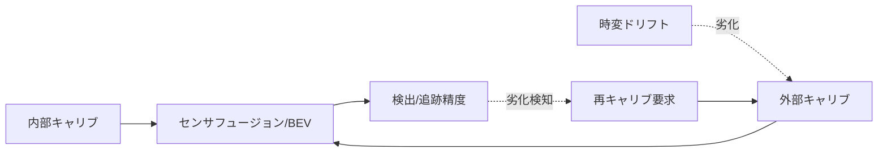
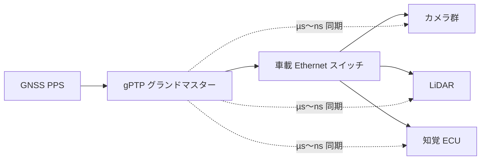

# 2.4 キャリブレーションと品質管理

キャリブレーション (calibration; センサーの校正) 情報は「データの一部」です。その品質が学習データとモデル性能の上限を決めます。本節では車載センサーのキャリブレーションと品質管理を、内部・外部・時変の三層整理、キャリブ誤差と精度低下の数値相関、カメラ-LiDAR 整合性に基づくドリフト検知、IEEE 802.1AS gPTP による時刻同期まで扱います。

## 内部・外部・時変キャリブレーションの三層

キャリブレーションは三層で捉えます。

- **内部 (intrinsic; センサ単体の内部パラメータ)**：カメラの焦点距離・歪み係数、LiDAR のビーム角、IMU バイアスなど単体パラメータです。
- **外部 (extrinsic; センサ間の相対位置・姿勢)**：センサ間の相対位置・姿勢を車両座標系に対して推定します。
- **時変 (time-varying; 経時で変動するパラメータ)**：経年劣化・衝撃・温度変化による変動です。マウントのたわみで走行状態ごとに外部パラメータが揺れたり、温度で LiDAR ビーム方向がずれたりといった条件依存性を持ちます。

不正確なキャリブレーションは、センサフュージョン・BEV・ローカライゼーションに直接波及し、そのまま学習データと評価の品質を下げます。

> **図 2.8**：キャリブレーションの三層と性能への波及、そして劣化検知から再キャリブへ戻る Closed-Loop。時変ドリフトを常時監視する点が要点です。

## キャリブ誤差と性能低下の数値相関

「どこまでの誤差を許容するか」は、誤差と性能低下の関係を数値で押さえて決めます。下表は外部キャリブの並進・回転誤差が下流タスクに与える影響の代表的な傾向です（公開研究・社内実験で観測される桁感の整理であり、構成依存です）。

| 外部キャリブ誤差 | カメラ-LiDAR 投影ずれ(50m) | 3D 検出 mAP 影響 | 追跡 ID switch | 判定 |
|---|---|---|---|---|
| 並進 < 2 cm / 回転 < 0.1° | < 5 px | ほぼ無影響 | 増加なし | 良好 |
| 並進 5 cm / 回転 0.3° | 約 15 px | −0.02〜0.03 | わずか増 | 許容上限 |
| 並進 10 cm / 回転 0.5° | 約 30 px | −0.05〜0.08 | 顕著に増 | 要再キャリブ |
| 並進 > 20 cm / 回転 > 1° | > 60 px | −0.10 以上 | 多発 | 学習除外 |

回転誤差 $\theta$ による遠方点の投影ずれは距離 $d$ にほぼ比例し、$\Delta \approx d \tan\theta$ で概算できます。50 m 先・0.5° なら約 0.44 m の横ずれとなり、歩行者一人分に相当する誤差が生じます。この感度の高さが、遠方タスクで厳しいキャリブ基準を要求する理由です。

許容誤差を「経験的になんとなく」で決めてしまう運用は、同じ社内でも担当者が変わるたびに基準が動き、ある時期のデータが学習に使えなかったり、別の時期には基準を満たしていないデータが混入したりという、再現性の崩壊を招きます。逆に「すべて再キャリブ要求」と厳しく振れば、整備工場の処理能力を超えてフリート全体が止まります。50 m 先で歩行者 1 人分の横ずれが出る回転 0.5° という感度を起点に、自社のセンサ構成で「並進 cm／回転度→投影ずれ」の換算表を作り、検出 mAP の劣化（−0.05〜0.08）や追跡の ID switch 増加といった下流影響との対応関係を過去の評価ログから回帰して係数化しておくと、許容上限を社内合意の数値として固定できます。許容上限を超えたデータには `calib_degraded` タグを自動付与し、学習対象から外すか自己教師あり学習に振り向ける運用は、「キャリブが悪いデータを知らずに学習に流す」という最悪の汚染を防ぐための機械的な歯止めです。Closed-Loop の観点では、キャリブ品質が学習データの上限を決めるという事実を、数値と運用ルールの両方で組織に染み込ませることが本質です。

## カメラ-LiDAR 整合性によるドリフト検知

オンラインのドリフト検知は、LiDAR 点群をカメラへ投影し、画像エッジとの整合性を指標化する手法が実用的です。整合性が落ちれば外部キャリブのずれを疑います。

具体的な処理は次の手順です。

1. **入力**：LiDAR 点群 `points_xyz`（N×3）、同時刻のカメラ画像から計算したエッジ強度マップ（Sobel / Canny を 0–1 に正規化、H×W）、カメラ内部行列 K（3×3）、LiDAR→カメラ外部行列 T（4×4）を用意します。
2. **投影**：点群を同次座標に拡張して T で変換し、カメラ前方（z > 0）のみ残してから K で像面 (u, v) に投影します。
3. **整合スコア算出**：投影点が画像内に収まる (u, v) 集合について、エッジ強度マップの平均値を返します。値が高いほどキャリブが合っています。
4. **運用判定**：このスコアの移動平均（例：直近 60 秒）を車両ごとに記録し、フリート全体の平均と分散から z-score（フリート平均からの標準偏差距離）を計算します。z < −3 で「要再キャリブ」フラグを立て、整備計画に投入します。

検知後の運用ルールを明文化しましょう。外部誤差が並進 10 cm / 回転 0.5° 相当を超えたら、その期間のデータに `calib_degraded` タグを付けます。学習からは除外するか、自己教師あり学習に振り向けます。車両には自動で「要再キャリブ」フラグを立てて整備計画に反映させます。

ドリフト検知の運用設計で見落とされがちなのは、検知から再キャリブまでの SLA を整備チームと合意していないために、検知だけ走って対応が積まれていく状態です。z < −3 を検知してから 7 日以内に再キャリブ、というような時間制約を整備チームの稼働可能性とすり合わせて合意しないと、「警告は出ているが直っていない車両」がフリートを汚染し続け、その期間のデータがすべて低品質ラベルで埋まります。逆に SLA を厳しくしすぎて整備工場のキャパシティを超えると、稼働率が落ちて事業計画に直接響きます。`calib_score` を 1 Hz でテレメトリに送り、フリート全体の z-score 算出ジョブを日次バッチで動かすという継続監視の仕組みは、こうした検知と対応のバランスを定量的に運用可能にする骨格です。Closed-Loop の観点では、ドリフト検知は「データ品質を学習前に守る最後の砦」であり、検知だけで終わらせず整備プロセスまでつなぐ責任分界が要点になります。

## オンライン／オフラインの二段構え

キャリブは、車載で軽量に微補正する**オンライン**と、工場・バッチで高精度に最適化する**オフライン**を組み合わせます。

| 項目 | オンライン | オフライン |
|---|---|---|
| 目的 | 微小ドリフトの即時補正 | 高精度な基準値再確立 |
| 計算 | 軽量・低レイテンシ | 重い最適化・人手検証 |
| 対象 | 外部の微調整中心 | 内部・外部・時変を網羅 |
| 契機 | 常時 | 定期整備・大ドリフト検知時 |

オフライン再キャリブ結果はデータレイクに反映し、過去ログへ遡及補正するか、キャリブ状態ごとにデータを分割するかを設計判断します。

## 時刻同期：IEEE 802.1AS gPTP

センサ間の座標統合と同様に重要なのが**時刻同期**です。複数センサのタイムスタンプがずれると、80 km/h（約 22 m/s）走行時には 1 ms のずれが約 22 mm の位置誤差に化けます。

車載では IEEE 802.1AS gPTP (generalized Precision Time Protocol; ネットワーク経由で µs〜ns 精度の時刻を配信する Ethernet 標準) [L1 関連規格] が標準です。グランドマスタークロック (Grandmaster Clock; ネットワーク全体の時刻基準) を基準に **µs〜サブµs 級**（実装により ns 級）の同期を実現します。GNSS の PPS (Pulse Per Second; 1 秒ごとの正確なパルス信号) を上位基準に据え、PTP (Precision Time Protocol; 高精度時刻同期プロトコル) でネットワーク内の各 ECU・センサへ配る構成が一般的です。ソフトウェア更新の同一性管理を求める UNECE R156 [O3](references#o3) とも、構成・バージョンのタイムスタンプ管理という点で整合させます。

| 同期方式 | 典型精度 | 用途 |
|---|---|---|
| OS 時刻 (NTP: Network Time Protocol) | 数 ms | 非クリティカルなログ |
| PTP / gPTP (IEEE 802.1AS) | µs〜ns | センサ間ハード同期 |
| GNSS PPS | 数十 ns | 上位グランドマスター基準 |
| ハードウェアトリガ | ns | カメラ-LiDAR 露光同期 |

> **図 2.9**：GNSS PPS を上位基準とした gPTP 時刻配信。全センサが共通時刻軸を持つことが、フュージョンとログの正確さの前提です。

時刻同期で陥りやすい設計ミスは、「OS 時刻（NTP: Network Time Protocol）で十分」と判断してしまうことです。NTP の数 ms 精度は 80 km/h 走行時には 22 mm の位置誤差に化け、フュージョン後の物体位置がセンサ間でずれて、3D 検出と追跡が静かに性能を落とします。逆にすべての ECU をハードウェアトリガで揃えようとすればコストと配線が爆発するため、車載 Ethernet には gPTP（IEEE 802.1AS）を中核に据え、カメラ-LiDAR 露光のように位相が直接精度を決める箇所だけハードウェアトリガで揃える階層設計が定石になります。GNSS PPS を上位基準として gPTP のグランドマスターに供給する構成は、UNECE R156 [O3](references#o3) のソフトウェア更新管理が要求する「いつ・どの構成だったか」のタイムスタンプ整合性とも自然に整合します。設計上もう一つ落としやすいのが、グランドマスター故障時のフォールバックです。GNSS PPS 直接同期やローカル発振器への切り替えを冗長設計しておかないと、衛星見通し不良のトンネルや高架下でフリート全体が一時的に時刻同期を失い、その期間のログが評価から除外される事態が起こります。各センサ・ECU の最大時刻オフセットを 1 Hz でテレメトリに送って継続監視する仕組みは、こうした「気づかない劣化」を可視化するための前提です。

## キャリブレーション履歴のメタデータ化

キャリブは数値だけでなく、データセット設計と結び付けてメタデータ化します。一件のキャリブ結果には次のフィールドを必ず含めます。

- `calibration_id`：再現性の主キー（例：`calib-2026-04-10-0007`）
- `vehicle_gen`：適用車両世代タグ
- `created_at`：作成 UTC タイムスタンプ
- `type`：`offline_full` / `online_partial` 等の作業区分
- `extrinsics`：センサ対ごとの並進（cm）と回転（度）。例：前方カメラ × ルーフ LiDAR
- `online_quality`：投影整合スコア、平均残差ピクセル数
- `time_sync`：同期方式（`gPTP` 等）と最大時刻オフセット（µs）
- `events`：センサ交換・衝撃検出など、当該キャリブの履歴イベント配列

Drive / Scene / Frame の各レベルでこのメタデータを参照すれば、「キャリブ状態が安定した期間のみ学習に使う」「あえて劣化期間も含めロバスト化し、評価は状態別に分ける」といった設計を選べます。状態別評価により「どの誤差までシステムが許容できるか」を定量化できる点が Closed-Loop の要諦です。

## ラベリング・評価との関係

キャリブ品質はラベリング（第5章）と評価の前提条件です。外部キャリブがずれると画像 2D ボックスと点群 3D ボックスの整合が崩れ、ラベラー負荷が増します。ローカライゼーション不安定期はレーン・シナリオラベルの品質も落ちます。対策として、キャリブ品質が基準以上のログのみラベリング対象とし、ツール上で整合性の悪いフレームに警告を出します。

## 本節の振り返り

キャリブレーションは「データの一部」であり、その品質が学習データとモデル性能の上限を決めます。本節の主張を一文に圧縮すれば、内部・外部・時変の三層で捉えてドリフトを常時監視し、誤差と性能の関係を数値で押さえて許容上限を社内合意し、履歴をメタデータとして残してデータと結び付けることが、Closed-Loop の入口品質を担保する条件である、ということになります。50 m 先で回転 0.5° は約 0.44 m の横ずれ（歩行者一人分）、並進 10 cm／回転 0.5° で 3D mAP が −0.05〜0.08 落ちる、という数値感覚を組織で共有することが、許容上限の議論を主観から数値に移すための土台です。カメラ-LiDAR 投影整合スコアを 1 Hz でテレメトリに送り、フリート z-score で z < −3 を「要再キャリブ」と機械的に判定し、検知から 7 日以内に整備工場へつなぐ SLA を合意する一連の運用は、「警告は出るが直らない車両」がフリートを汚染し続ける典型的な失敗を防ぎます。gPTP（IEEE 802.1AS）と GNSS PPS による µs〜ns 級の時刻同期は、1 ms ずれが 80 km/h で 22 mm の位置誤差になるという物理的事実を背景にもち、NTP の数 ms 精度では絶対に置き換えられない要件であることを忘れてはいけません。キャリブ履歴・時刻同期精度・センサ交換イベントをメタデータ化して状態別評価ができる状態は、「どの誤差まで許容できるか」をデータドリブンで決めるための情報基盤であり、これがないと許容上限の議論は永遠に経験論に留まります。

## 次節への橋渡し

センサ・キャリブ・時刻同期が整うと、それらの出力を車載で受け取り、記録するソフトウェアスタックが必要です。次の 2.5 節では、ROS 2 / DDS の QoS 推奨設定、メッセージスキーマ、業界標準フォーマット MCAP への移行、そして RAM リングバッファから NVMe・アップロード待ちに至るストレージ層を、SSD の TBW 計算とともに設計します。
