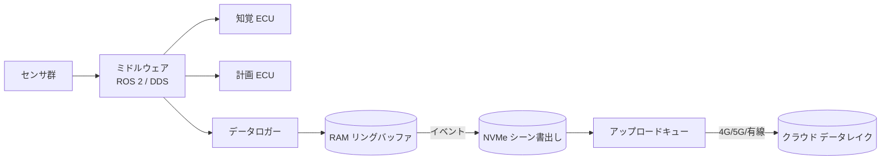
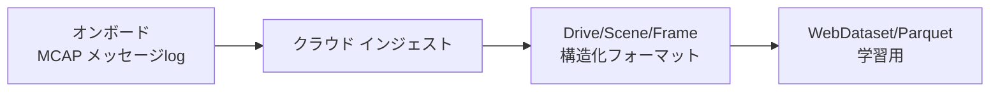

# 2.5 車載データ収集ソフトウェアスタックとログフォーマット

車載ログは最終形ではなく、後段のインジェスト・検索・学習（第3章）へ滑らかにつながる Closed-Loop の入口です。本節では車載データ収集スタックとログフォーマットを、ROS 2 (Robot Operating System 2; ロボット用ミドルウェア) と DDS (Data Distribution Service; データ分散サービス) の QoS 推奨設定、メッセージスキーマ、業界標準フォーマット MCAP [ST4](references#st4) への移行、RAM リングバッファから NVMe・アップロード待ちに至るストレージ層設計まで扱います。

## スタック構成とコンポーネントの役割

車載ソフトウェアは、ECU（センサ制御・前処理・推論・制御を担う計算ノード）、ミドルウェア（メッセージング・トピック管理・QoS: Quality of Service; 通信品質制御）、データロガー（トピックと内部信号を記録）の三層から構成されます。Autoware は ROS 2 をミドルウェアに採用した代表的なオープンスタックです [Sim2](references#sim2)。



> **図 2.10**：センサからクラウドへのデータフロー。ロガーは常時 RAM リングバッファに書き、イベント時のみ NVMe へシーンを確定させる二段構成が要点です。

Closed-Loop のデバッグ・評価には、最終制御コマンドだけでなく中間表現・モデル不確実性・診断情報も記録しておく価値があります。

## ROS 2 QoS の推奨設定

ROS 2 / DDS では、トピックごとに QoS を設定します。トピックとは publisher（送信側）と subscriber（受信側）が共有する名前付きメッセージチャネルのことです。高頻度の生センサと低頻度の重要コマンドでは最適値が異なります。下表は収集用途での推奨例です。

| トピック | Reliability | History (depth) | Durability | 備考 |
|---|---|---|---|---|
| `camera/image_raw` | Best Effort | Keep Last (5) | Volatile | 高帯域・欠落許容 |
| `lidar/points` | Best Effort | Keep Last (5) | Volatile | 大容量・最新優先 |
| `perception/objects` | Reliable | Keep Last (20) | Volatile | 解析に欠落不可 |
| `vehicle/control_cmd` | Reliable | Keep Last (50) | TransientLocal | 監査用・確実性最優先 |
| `diagnostics` | Reliable | Keep All | TransientLocal | 障害解析 |

高頻度センサに Reliable（到達保証あり）を使うと、再送でレイテンシとバッファ枯渇を招きます。そのため Best Effort（到達保証なし、最新優先）が定石となり、制御・診断は欠落不可なので Reliable とします。`Volatile` は新規購読者には過去メッセージを送らない設定、`TransientLocal` は直近の値を送る設定です。

QoS 設計で起こりがちな失敗は、「とりあえず全部 Reliable」と統一してしまうことです。30 fps × 8 MP のカメラトピックを Reliable にすると、ネットワークが詰まった瞬間に再送が積み重なり、ロガーのバッファが秒単位で枯渇して逆にデータをまとめて取りこぼします。逆に制御・診断まで Best Effort にすると、安全評価で必要な「制御コマンドの欠落なき記録」が成立せず、インシデント解析の根拠が失われます。トピックごとに Reliability・History・Durability の三軸を切り分け、それを `qos_profiles.yaml` のような単一の設定ファイルに集約して ECU 起動時に読み込む構造を作っておかないと、コードベースのあちこちに QoS 設定が散らばり、半年後に「どのトピックがどの QoS で動いているか」を再構成できなくなります。安全関連トピック（制御・診断）の QoS 変更にレビューを必須化する運用は手間に見えますが、これがないと「最適化のつもりで Reliable を Best Effort に下げてしまった」事故を防げません。Closed-Loop の観点では、QoS は単なる通信設定ではなく「どのデータを必ず学習・評価に届けるか」の宣言であり、ロギングと安全認証の両方に影響する設計判断として扱うべきです。

## メッセージスキーマの定義

ログ構造はメッセージスキーマ（`.msg` / `.idl`）に直接依存します。スキーマはバージョン管理し、トピック名・名前空間に一貫性を持たせて後からクエリしやすくします。次は知覚オブジェクトの最小スキーマ例です。

```
# PerceptionObject.msg
std_msgs/Header header        # stamp(gPTP同期), frame_id
uint32 id                     # 追跡ID
uint8  label                  # 0:car 1:pedestrian 2:cyclist ...
float32 confidence            # 0.0-1.0
geometry_msgs/Pose pose       # 3D位置・姿勢
geometry_msgs/Vector3 size    # bbox 寸法
geometry_msgs/Vector3 velocity
float32 uncertainty           # epistemic 不確実度（2.6節で活用）
```

`header.stamp` に 2.4 節の gPTP 同期時刻を入れることで、クラウド側で「同一時刻のマルチセンサ情報」を再構成できます。`uncertainty` を残しておくと、2.6 節のトリガや第4章の Active Learning にそのまま活用できます。

## ログフォーマット：MCAP への移行

ログフォーマットは書込み性能・圧縮率・後段親和性で選びます。歴史的には ROS 1 の rosbag、ROS 2 の SQLite3 ベース rosbag2 [ST5](references#st5) が使われてきました。現在の業界標準は **MCAP (Message Capture; Foxglove が策定したロボティクス向け自己記述ログ形式)** [ST4](references#st4) です。MCAP は ROS 2 rosbag2 v0.15 以降のデフォルトストレージプラグインで、Autoware・Foxglove Studio・Cruise OSS など主要スタックで採用されています。新規プロジェクトでは MCAP を第一選択とし、SQLite3 (.db3) 形式はレガシーログの読み込み互換のためのみ保持します。

| フォーマット | 長所 | 短所 | 位置づけ |
|---|---|---|---|
| ROS 1 bag | ツール成熟 | 自己記述性低・ROS依存 | レガシー |
| rosbag2 (SQLite3) | ROS 2 標準 | 大容量で性能劣化 | 移行期 |
| MCAP [ST4](references#st4) | 自己記述・追記高速・多言語・チャンク圧縮 | 比較的新しい | **推奨** |
| 独自バイナリ | 最適化自由 | 保守コスト・互換性 | 特殊要件 |
| WebDataset [ST6](references#st6) | 学習ストリーミング高速 | 収集には不向き | 学習段 |

MCAP は自己記述的（メッセージスキーマをファイル内に同梱）で追記書込みが速く、zstd / lz4 のチャンク圧縮と多言語読出しに対応するため、車載収集と Foxglove [ST11](references#st11) での可視化に適します。移行は、まず可視化ツールを MCAP 対応にし、次に収集の既定ストレージを MCAP へ切り替える、という二段で進めると安全です。

ログフォーマットの選定で陥りやすい失敗は、「車載と可視化を同時に切り替えようとして両方が動かなくなる」状況です。可視化ツールが MCAP に対応していない状態で車載ロガーだけ MCAP に切り替えれば、トリアージの現場で過去ログが開けなくなり、デバッグが止まります。逆に車載は SQLite3 のまま放置して可視化だけ Foxglove Studio + MCAP に切り替えると、毎回フォーマット変換コストがかかり「同じデータを二回保管している」状態になります。可視化を先行で MCAP 対応させ、後から車載ロガーの既定ストレージを切り替えるという順序が安全な理由はここにあり、SQLite3 出力は緊急時のフォールバックとして当面残す段階的な移行設計が現実的です。チャンク圧縮で zstd（圧縮率重視）と lz4（書込み速度重視）のどちらを選ぶかは、自社の NVMe（Non-Volatile Memory Express; PCIe 接続の高速 SSD 規格）書込み帯域と通信費の相対コストで変わるため、机上ではなく実走ベンチマークで決めるべき判断です。レガシーの rosbag / rosbag2 SQLite3 ログを MCAP に変換するバッチを準備しておかないと、過去 1 年分のデータが「読めるが扱いが面倒」な状態で滞留し、Closed-Loop の改善前後比較で過去をベースラインに使えなくなります。MCAP への統一は、フォーマットの先進性そのものよりも「車載・可視化・学習・監査が共通言語で会話できる状態」を作る組織的な意思決定として位置づけるべきです。



> **図 2.11**：オンボードはメッセージログ（MCAP）、クラウドで Drive/Scene/Frame に変換し学習用へ。「車載ログは入口、最終形はクラウド側」という二段変換が要点です。

## ストレージ層と TBW 計算

ロギングは RAM リングバッファ → NVMe (Non-Volatile Memory Express; PCIe 接続の高速 SSD 規格) 一時ファイル → アップロードキューの多層構成です。各層の保持期間が「どのインシデントの前後をどれだけ解析できるか」を決めます。前後 30 秒しか残さない構成では、渋滞形成や長距離追越しを分析できません。

NVMe 選定では書込み耐久を **TBW (Terabytes Written; 累計書込みバイト数)** で評価します。2.3 節の試算で圧縮後 1 台あたり 5 TB/日を書くなら、5 年で約 9,125 TBW が必要となり、これを **DWPD (Drive Writes Per Day; 1 日あたりの全容量書込み回数)** に換算して機種を選びます。試算は次の二段で進めます。

1. **必要 TBW** = 1 日あたり書込み量 × 365 × 想定運用年数。例：5 TB/日 × 365 × 5 年 = **9,125 TBW**
2. **必要 DWPD** = 1 日あたり書込み量 ÷ 採用予定 SSD 容量。例：5 TB/日 ÷ 4 TB = **1.25 DWPD**

この値を満たす機種は産業用 NVMe の 1〜3 DWPD クラスで、5 年保証の範囲内に収まります。容量を倍にすれば DWPD 要件は半減するため、TBW と容量のトレードオフをコストと合わせて 2 軸で評価しましょう。

NVMe 選定で見落とされがちなのは、TBW（Terabytes Written; 累計書込みバイト数）と DWPD（Drive Writes Per Day; 1 日あたりの全容量書込み回数）だけを見て温度耐性・振動耐性を後回しにする失敗です。車載環境は −40 〜 85 ℃の温度範囲と継続的な振動にさらされ、コンシューマ向け NVMe を流用すれば 1 年も持たずに壊れます。産業用 1〜3 DWPD クラスを 2〜3 機種で比較する際は、温度耐性・振動耐性のデータシートを必ず並べて、TBW・DWPD・温度・振動の四軸で評価することが必要です。リングバッファ長を「とりあえず 30 秒」と決め打ちにする運用は、渋滞形成や長距離追越しのような数十秒〜数分のシーンを取りこぼし、過去ログ解析の現場で「もう少し前史が欲しかった」という後悔を繰り返します。過去解析の使用時間分布（2.6 節）から決定し、CPU メモリ利用率とのバランスで 30〜90 秒を目安に設計するのが定石です。アップロードキューが NVMe を圧迫してロガー本体の書込みを邪魔しないよう、バックプレッシャ制御（一定量を超えたら古いデータから削除）を実装しておかないと、ネットワーク不調が NVMe 圧迫を通じてセンサ取りこぼしに化ける、という連鎖障害が起こります。これらは独立した小設計のように見えて、実際には「データを取りこぼさず、長期にわたって安定して書き続ける」という単一の Closed-Loop 入口要件を支える連動した判断です。

| 層 | デバイス | 保持 | 役割 |
|---|---|---|---|
| L0 | RAM リングバッファ | 数分 | 常時・低遅延・イベント前史確保 |
| L1 | NVMe（高 TBW）| 数時間〜数日 | シーン確定・一時保管 |
| L2 | 取外し SSD / バックホール | 数日〜数週 | 物理回収・大容量転送 |
| L3 | クラウド データレイク | 長期 | 学習・評価・監査 |

SATA (Serial ATA) より NVMe を選ぶ理由は、42 TB/h 級の生データを取りこぼさない逐次書込み帯域にあります。冗長性が必要なら RAID (Redundant Array of Independent Disks) よりも、シーン単位の即時クラウド冗長化を優先する設計が一般的です。

## ログ設計とプライバシー／セキュリティの接点

ログフォーマットはプライバシー（2.8節）・セキュリティ（2.9節）と密接です。匿名化をどの層で行うか（オンボード vs クラウド）、ログ単位の暗号化・署名、機密度別のパス分離を、フォーマット段階から織り込みます。「使いたいデータが使えない」「使ってはいけないデータを使う」のどちらも避けるため、機密度タグをメタデータに持たせて DataOps を円滑にします。

## 本節の振り返り

車載ログは最終形ではなく、後段のインジェスト・検索・学習へ滑らかにつながる Closed-Loop の入口です。本節の主張を一文に圧縮すれば、ECU・ミドルウェア・ロガーの三層と RAM リングバッファ→NVMe→アップロードの二段構成は、「全データを取りこぼさず、安定的に書き続ける」入口要件を支える連動した設計判断である、ということになります。ROS 2 QoS を `qos_profiles.yaml` に集約し高頻度センサを Best Effort、制御・診断を Reliable に固定する設計は、「最適化のつもりで安全関連を Best Effort に下げてしまう」事故を防ぐ機械的な歯止めです。メッセージスキーマをバージョン管理し `header.stamp` に gPTP 時刻、`uncertainty` を必ず残す設計は、フュージョン整合性と Active Learning 連携の両方を支える共通基盤として最初から織り込むべき要件です。MCAP への統一は、フォーマットの先進性そのものよりも「車載・可視化・学習・監査が共通言語で会話できる状態」を作る組織的意思決定として位置づけ、可視化先行→車載追従の段階的移行で安全に進めます。NVMe を 5 TB/日 × 5 年で約 9,125 TBW、1.25 DWPD と試算して産業用 1〜3 DWPD クラスを温度・振動耐性込みで選定する手順は、コンシューマ流用が引き起こす早期故障と、それに連鎖するセンサ取りこぼしを防ぎます。

## 次節への橋渡し

スタックとフォーマットが定まると、「全データを記録できない」現実の中で何を記録するかが核心になります。次の 2.6 節では、常時録画とイベントトリガの使い分け、減速度・ヨーレートなどのトリガしきい値、前後ウィンドウ長の決定ロジック、aleatoric/epistemic 不確実性の計算、そしてトリガポリシーの A/B テストを、JSON Schema とコードを交えて設計します。
