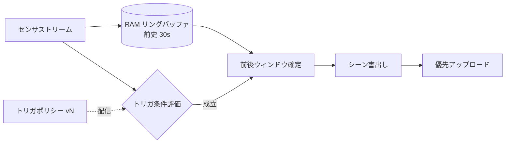
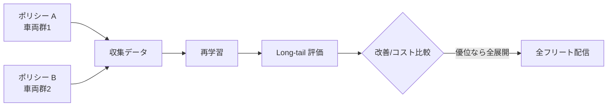

# 2.6 エッジトリガー構成・記録開始条件・サンプリング設計

「全データは記録できない」制約下で何を記録するかを決めるのが、エッジトリガー (edge trigger; 車載側で動作する記録開始条件) の設計です。本節では具体しきい値、前後ウィンドウ長を過去解析分布から決めるロジック、aleatoric / epistemic 不確実性の計算、テレメトリの JSON Schema、そしてトリガポリシーの A/B テストを扱います。ここでの設計が、Closed-Loop に流れ込むデータの質を直接左右します。

## 常時録画 vs イベントトリガ

理想は常時録画ですが、2.3 節の試算（生 約 42 TB/h）が示すとおり全保存は非現実的です。そこで RAM リングバッファ（常時記録）とイベントトリガ（条件成立時に前後を確定）を併用します。FOT 車両はリングバッファを長く取り、量産フリートはイベントトリガ中心とします。Tesla は量産フリートに対し「特定の稀少パターンに合致したクリップだけを抽出してアップロードさせる」分散データ収集を AI Day で公開しています [D10](references#d10)。

> **図 2.10**：リングバッファとトリガ評価の協調。トリガ成立時にバッファの前史を含めてシーンを確定し、ポリシーはリモート更新できる点が要点です。

## トリガしきい値の設計

トリガ種別は、車両運動・ADAS/AD 介入・モデル挙動・環境の四系統に分けられます。下表は推奨しきい値の出発点です（車種・ODD により調整します）。AEB (Autonomous Emergency Braking; 自動緊急ブレーキ) はぶつかりそうになったら自動で停止する機能、TBW（テイクオーバー）はドライバが手動運転に戻ることです。

| 種別 | トリガ | しきい値（例）| 前ウィンドウ | 後ウィンドウ |
|---|---|---|---|---|
| 車両運動 | 急減速 | < −4.0 m/s² | 20 s | 10 s |
| 車両運動 | 急ヨーレート | > 25 deg/s | 15 s | 10 s |
| 車両運動 | 横加速度 | > 0.4 g | 15 s | 10 s |
| 介入 | AEB 作動 | フラグ | 30 s | 15 s |
| 介入 | ドライバ急テイクオーバー | フラグ | 30 s | 15 s |
| モデル | epistemic 不確実性 | > 0.7（正規化）| 20 s | 10 s |
| 環境 | 降雪・踏切・IC 進入 | ODD タグ一致 | 10 s | 10 s |

しきい値は「高すぎて重要シーンを逃さないか／低すぎて帯域を圧迫しないか」のバランスで決めます。`1,000 km あたりイベント件数` と `ODD セグメント別イベント密度` を監視して調整しましょう。

具体的な調整ルールの一例は次の三段です。

1. アップロード帯域上限から逆算した「目標イベント密度」を設定する（例：5 件/1,000 km）
2. 直近 7 日の実測が目標の 1.5 倍を超えたら、トリガしきい値を 0.1 σ ずつ厳しく、0.5 倍を下回ったら 0.1 σ ずつ緩める
3. ODD セグメント単位で別基準を持ち、レアセグメント（雪夜・複雑交差点）は密度上限を 3 倍まで許容する

これらをまとめて `policy_v=N` でバージョン管理し、変更影響を A/B 比較できる状態にします。

トリガ評価ロジック自体は単純です。車両状態（前後加速度・ヨーレート・AEB フラグ・epistemic スコアなど）と現行ポリシーのしきい値を 1 フレームごとに突き合わせ、成立したトリガ名（例：`hard_brake` / `hard_yaw` / `aeb` / `high_uncertainty`）のリストを返すだけです。複数トリガが同時成立した場合は OR 結合し、後段でトリガ名タグごとの収集統計を取れるようにします。

トリガしきい値の設計で陥りやすい失敗は、「コードの中にしきい値をハードコードしてしまう」ことです。一度コードに埋め込まれた値はリリースサイクルでしか変更できなくなり、現場で「雪夜のセグメントだけ密度を 3 倍に上げたい」という要望に応えられません。`trigger_policy.json` のような宣言的設定として外出しして OTA 配信できる状態を最初から作っておくことが、トリガ運用を継続的に最適化できる Closed-Loop の前提です。逆にしきい値を頻繁に変えすぎると、収集データの分布が時期ごとに揺れて「いつのデータと比較しているか」が分からなくなるため、変更は週次バッチでの自動調整（目標密度の 1.5 倍超過なら 0.1 σ ずつ厳しく、0.5 倍未満なら緩める）と `policy_v=N` のバージョン管理で履歴を残すルールが要となります。新しいトリガを追加するときは旧ポリシーと並走させて A/B で比較する手順を省略し「効きそうだから全展開」と判断すると、帯域は跳ね上がるのにモデル改善が伴わない、という失敗が起こります。直近 7 日のイベント密度を ODD セグメント別に集計するダッシュボードは、こうした調整判断を主観ではなく数値で行うための情報基盤です。

## 前後ウィンドウ長を分布から決める

ウィンドウ長は勘ではなく、オフライン解析で「実際に使われた時間範囲」の分布から決めます。手順は次の三段です。

1. **ログ収集**：過去のインシデント解析チケットから、解析者が遡って参照した前史時間（秒）と後追跡時間（秒）をイベント種別ごとに集めます。
2. **分布の 95 パーセンタイルを採用**：例として前史秒数が `[8, 12, 15, 9, 22, 18, 11, 27, 14, 19]` のような分布なら、95 パーセンタイルは約 25 秒となり、これを切り上げて推奨ウィンドウとします。
3. **イベント種別ごとに別値を設定**：軽微な警告は短く（前 10 秒・後 5 秒）、AEB 介入は長く（前 30 秒・後 15 秒）、というように分離します。

このようにイベント種別ごとにウィンドウを変えるのが効率的です。

## aleatoric と epistemic 不確実性

「モデルが自信のないシーン」を集めるには、不確実性 (uncertainty) を二種に分けて扱います。**aleatoric（偶然性、aleatoric uncertainty）**はデータ固有のノイズ（雨・逆光）で、データを増やしても減りません。**epistemic（認識性、epistemic uncertainty）**はモデルの知識不足によるもので、学習データを増やせば減ります。能動的収集で価値が高いのは epistemic です。推定には MC Dropout (Monte Carlo Dropout; 推論時にもドロップアウトを残し複数回サンプリングする手法) [AL4](references#al4) や Deep Ensemble (Deep Ensemble; 複数モデルの予測を統合する手法) を用います。

実装上は、同一入力に対して T 回（典型 10〜30 回）のサンプリング推論を行い、クラス確率の T×C 行列を得ます。そこから次の三量を計算します。

- **予測エントロピー（total）**：T 回平均した確率分布のエントロピー $H(\bar p) = -\sum_c \bar p_c \log \bar p_c$
- **aleatoric**：各サンプルのエントロピーを T 回で平均した値 $\frac{1}{T}\sum_t H(p_t)$
- **epistemic**（BALD: Bayesian Active Learning by Disagreement; モデル間予測の不一致を相互情報量として測る指標）：total − aleatoric

epistemic が高いシーンは「モデル間で意見が割れる」シーンであり、収集・再学習で改善余地が大きい候補です。この epistemic スコアをトリガ（上表）と第4章の Active Learning（能動学習）[AL1](references#al1) の双方で使えば、収集段階から「学べば伸びるデータ」を優先できます。

不確実性の二分類で見落とされがちなのは、aleatoric を epistemic と取り違えて「自信がないから集めれば伸びる」と勘違いしてしまうことです。豪雨の白飛び画像は aleatoric が高いだけでデータを増やしても改善せず、ここに収集帯域を費やすのは無駄になります。MC Dropout や Deep Ensemble で total と aleatoric を分離して epistemic = total − aleatoric を取り出し、`uncertainty` フィールドとしてログに残す実装は、「学習で伸びるデータ」と「いくら集めても伸びないデータ」を切り分ける操作の数学的根拠です。逆に epistemic だけに依存するのも危険で、aleatoric が高いシーンも、別の意味で「センサ・露出設計を見直すべき」シグナルになります（2.7 節の品質×モデルエラーの 2×2 切り分けへ接続します）。epistemic > 0.7 のシーンを第4章の Active Learning キューへ自動投入する仕組みは、トリガ収集と Active Learning を同じ語彙で接続することで、収集段階から「学べば伸びるデータ」を優先選別する Closed-Loop の核となる設計です。

## 低レートテレメトリと JSON Schema

帯域制約下では、ほぼ全走行をカバーする**低レートテレメトリ**（数百 ms〜数秒周期の要約）と、限定的だが詳細な**高解像度生センサ**を二層で使い分けます。テレメトリは分布変化・ドリフト検知（2.7節、第8章）に、生センサは失敗シーンの再学習に使います。テレメトリ項目は ECU 全信号ではなく「Closed-Loop に有用な要約」に絞ります。

具体的なペイロードは次の構造を最小ラインとして設計します。

- **共通**：スキーマバージョン（例：`telemetry/v2`）、UTC タイムスタンプ、車両世代タグ、現在 ODD セグメント、搭載モデルバージョン
- **perception 要約**：物体検出件数、epistemic 不確実性の平均値と 95 パーセンタイル
- **safety 要約**：最小 TTC (Time To Collision; 衝突予測残時間、秒)、最小横方向マージン（m）、AEB 作動フラグ
- **control 要約**：前後加速度、ヨーレート
- **メタ**：ペイロードバイト数（帯域監視用）

このスキーマで 1 件約 320 byte、1 Hz で送れば、1 台 1 時間で約 1.1 MB です。生センサに比べ無視できる帯域で全走行の代表性を確保できます。「この要約だけで、どの ODD・どのバージョンに問題があるか概ね特定できるか」が項目設計の目安です。

テレメトリ設計で起こりがちな失敗は、「ECU の全信号を要約と称してそのまま流す」ことです。これでは帯域が膨らむうえ、結局後段で重要項目を絞り直す手間が生じます。「Closed-Loop で意思決定に使う最小要約」という基準で項目を切り詰め、JSON Schema を Git 管理して追加・改廃にレビューを必須とする運用が、テレメトリを長期的に有用な情報資産として保つ条件です。逆に生センサと同じトピック・APN（Access Point Name; キャリア専用接続網）でテレメトリを流すと、生センサ帯域が詰まったときにテレメトリも届かなくなり、「全走行の代表性を確保する」という本来の目的が崩れます。別経路で送る設計は、生センサが届かない状況でもテレメトリだけは届いて分布変化やドリフトを検知できる、という冗長性を担保します。ダッシュボード上にテレメトリ項目別ヒストグラムを ODD・モデルバージョン別に並べておくと、新バージョン投入時の異常を「集計が走るのを待たずに」即座に検知でき、Closed-Loop の改善サイクルを短縮できます。

## トリガポリシーの A/B テストとバージョニング

トリガポリシー自体を実験対象とみなし、バージョンを付けて A/B 比較します。

| 指標 | ポリシー A（介入のみ）| ポリシー B（+epistemic）|
|---|---|---|
| 1,000 km あたり収集件数 | 12 | 31 |
| 1 件あたり平均データ量 | 1.8 GB | 1.5 GB |
| Long-tail mAP 改善（再学習後）| +0.011 | +0.027 |
| 帯域使用量（相対）| 1.0 | 1.6 |

> **図 2.11**：トリガポリシーの A/B から全展開への流れ。「どのポリシーが最も効率よくモデルを改善したか」を改善量/コストで判断する点が要点です。

ポリシーは ODD・機能別に分けるのが効率的です（高速は前方衝突・合流、都市は横断歩道・右折歩行者、新機能直後はその機能関連）。どの ODD でどのポリシー版が走っていたかを時系列でメタデータ管理し、差分がモデル性能とインシデント統計にどう効いたかを定期レビューしましょう。

## 本節の振り返り

「全データは記録できない」という制約のもとで何を記録するかを決めるエッジトリガ設計は、Closed-Loop に流れ込むデータの質を直接決める設計判断です。RAM リングバッファに常時録画しつつトリガ成立時にだけ前史を含めてシーンを確定する二段構成は、生 42 TB/h という物理的な制約と「インシデント前後の文脈をどれだけ残せるか」という解析要件を両立させる古典的な解です。トリガしきい値を `trigger_policy.json` のような宣言的設定として外出しし、ODD セグメント別の密度監視と週次の自動調整ループ、そして `policy_v=N` のバージョン管理を組み合わせる運用は、しきい値が現場要望に追従しつつ過去比較の再現性を失わないための制度設計です。前後ウィンドウ長を解析者の使用時間分布の 95 パーセンタイルから決め、軽微な警告と AEB 介入で別値を運用する設計は、「短すぎて文脈不足」と「長すぎて帯域過剰」の両極端を避ける実践的な落とし所です。aleatoric と epistemic を分離して epistemic 高のシーンだけを Active Learning キューへ流す仕組みは、「学習で伸びるデータ」と「いくら集めても伸びないデータ」を数学的根拠で切り分ける核心設計であり、第4章のデータ選択と直結します。トリガポリシーを A/B でバージョン比較し「改善量／コスト」で全展開を判断する手順は、トリガ自体を実験対象として扱う、データ中心開発らしい姿勢の表れです。

## 次節への橋渡し

何を記録するかが決まっても、記録されるデータ自体が健全でなければ価値は失われます。次の 2.7 節では、オンボードでのデータ品質・健全性モニタリングを、KL divergence ベースの故障検知コード、z-score とフリート平均比較による品質ラベル分類、そして品質スコアとモデル性能（F1）の相関分析として掘り下げます。
