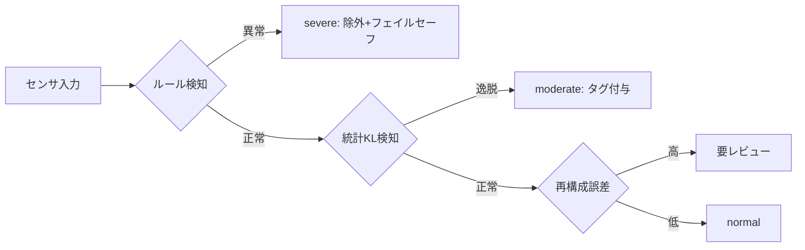

# 2.7 オンボードでのデータ品質・健全性モニタリング

「収集したデータが健全か」を収集段階で判定することは、後段のクレンジング・学習を効率化し、Closed-Loop の入力品質を担保します。本節では車両上でリアルタイムにデータ品質・健全性 (data quality & health) を監視する仕組みを、KL divergence (Kullback-Leibler divergence; 二つの確率分布の差を測る指標) ベースの故障検知、z-score とフリート平均比較による品質ラベル分類、品質スコアとモデル性能（F1）の相関分析として扱います。

## 故障・欠損検知の三段階

センサ・ロガーが異常期間のデータはほぼ利用できず、無駄な収集とデータ汚染を招きます。検知ロジックは確信度で三段に整理しましょう。

| レベル | 手法 | 例 | 車両動作 | データ基盤動作 |
|---|---|---|---|---|
| ルールベース | しきい値 | 全黒/全白画像、点群全消失 | フェイルセーフ | `severe` タグ・除外 |
| 統計ベース | 分布比較（KL）| 画素・点群密度の分布逸脱 | 警告表示 | `moderate` タグ |
| ML ベース | 自己教師あり再構成誤差 | 微妙な劣化・未知故障 | 監視継続 | 要レビュー |

> **図 2.7.1**：三段階の品質判定パイプライン。ルール→統計→ML の順に確信度の低い異常まで掬い、車両動作とデータ基盤動作の双方に反映する点が要点です。

## KL divergence ベースの故障検知

正常稼働時の画素値・反射強度などの基準分布 $P$ を学習しておき、走行中の分布 $Q$ との KL divergence $D_{KL}(Q\|P)=\sum_i Q(i)\log\frac{Q(i)}{P(i)}$ がしきい値を超えたら異常とみなします。レンズ汚れや露出破綻を早期に捉えられます。

実装は次の三段で行います。

1. **基準分布の事前構築**：正常走行データを ODD セグメント別（晴昼の高速、雨夜の市街地など）に分け、各セグメントで画素値ヒストグラム（例：32 ビン、0–255 レンジ）や LiDAR 反射強度ヒストグラムを正規化して保存します。これを `p_ref` として車載に配布します。
2. **走行中の分布計算**：1 秒ごと程度の窓で同じビン定義のヒストグラム `q` を作り、`p_ref` との KL を計算します。$\sum q_i \log(q_i / p_i)$ で素直に計算でき、ゼロ除算回避のため両辺に小さい定数（例：1e-9）を加え正規化し直します。
3. **しきい値判定**：基準しきい値 `T`（例：0.5）に対し、KL が `T` を超えたら `moderate`、`2T` を超えたら `severe` にラベル付けします。

KL は分布全体の形状変化を捉えるため、平均だけ見るしきい値ルールより微妙な劣化に敏感です。実運用では基準分布を ODD セグメント別に持つと誤検知を減らせます。

KL ベース検知の運用で陥りやすい失敗は、基準分布 `p_ref` を ODD セグメントで分けずに「フリート全体の平均」で固定してしまうことです。これでは晴昼の高速と雨夜の市街地が同一基準で評価され、後者で KL が常時上振れし、誤検知が積み上がってアラートが信頼を失います。ODD セグメント別に `p_ref` を持ち、月次でローリング更新して OTA で車載に配信する設計が、季節変動とセンサ経年劣化の両方に追従するための骨格です。逆に更新を頻繁にしすぎると、レンズ汚れの進行を「正常分布の更新」として吸収してしまい、本来検知すべき劣化を見逃します。月次更新と新 ODD・新世代切替時の手動全置換を組み合わせる二段運用が現実的です。KL > 2T が連続 60 秒以上続いた車両に整備チケットを自動起票する運用は、検知から対応への接続を機械化することで、「警告は出ているが直っていない車両」がフリートを汚染し続ける典型的な失敗を防ぎます。

## z-score とフリート平均比較による品質ラベル

単一車両の指標は、同一 ODD・同一世代のフリート平均と比べて初めて意味を持ちます。指標 $x$ をフリート平均 $\mu$ と標準偏差 $\sigma$ で標準化した z-score $z=(x-\mu)/\sigma$ で、品質ラベルを機械的に分類します。z-score は「平均から何 σ 離れているか」を表す指標です。

実装の骨子は次のとおりです。車両側で集計した指標群（例：露出平均・LiDAR 有効点数・パケットロス率）を、対応する ODD セグメント・世代のフリート統計値（$\mu$ と $\sigma$）と突き合わせ、各指標の z-score を計算します。その絶対値の **最悪値（最大）** を「総合 z-score」として 1 つのラベルに対応付けます。下表のしきい値で `normal` / `moderate` / `severe` / `critical` を割り当て、最悪指標がどれだったかも合わせて記録します。$\sigma$ がほぼ 0 のときの 0 除算を避けるため小さな定数（例：1e-9）を加える点だけ注意してください。

| ラベル | z-score | 想定状態 | 学習での扱い |
|---|---|---|---|
| normal | ≤ 2.0 | 許容範囲 | そのまま使用 |
| moderate | 2.0–3.0 | 露出/ノイズやや悪 | ロバスト化に限定使用 |
| severe | 3.0–4.0 | 大きな劣化 | 原則除外・要レビュー |
| critical | > 4.0 | 故障・大不整合 | 除外・整備フラグ |

> **z-score の閾値設定について**：上表の 2.0 / 3.0 / 4.0 は正規分布で外れ確率が約 4.6% / 0.27% / 0.006% に相当する汎用初期値で、すべての指標に同一しきい値を当てるのは粗すぎます。実運用では指標ごとに分布形状（露出平均は概ね正規、LiDAR 有効点数は左裾の重い非対称、パケットロス率は 0 寄りの強い右裾）を実フリートデータで確認し、95/99/99.9 パーセンタイルに基づき個別閾値を設定するのが望ましいです。フリート平均が安定するまでの初期 1 ヶ月（〜100 台）は、業界慣行の汎用値で運用しつつ収集データで再校正します。

露出平均・LiDAR 有効点数・パケットロス率・タイムスタンプ不整合などを 1 Hz 程度で集計し、テレメトリ（2.6 節）に載せてフリートダッシュボードで可視化しましょう。これにより「特定ロケーション・天候で LiDAR 有効点数が一様低下」「特定 ECU 世代でパケットロス増」といった構造的問題を検知できます。

z-score ベースの品質ラベルで気をつけたい設計判断は、フリートの初期段階で母数が少ないにもかかわらず無理に 2.0/3.0/4.0 の汎用しきい値を全指標に適用してしまうことです。フリート 100 台未満では $\mu$ と $\sigma$ そのものが大きくぶれ、ラベルが日替わりで変わって信頼を失います。初期 1 か月は業界慣行の汎用値で運用しつつ、95/99/99.9 パーセンタイルベースの個別しきい値へ収集データで再校正していく段階的な設計が現実的です。逆に、しきい値を指標ごとに最適化しきって複雑化させると、運用者が「どの指標がどの理由で severe か」を即座に説明できなくなり、整備チームと共通言語で議論できなくなります。品質指標を 1 Hz で集計する車載ライブラリの標準化と、ODD セグメント別×世代別のフリート統計を日次再計算して車載へ配信する仕組みは、こうした再校正を継続可能にする骨格です。`severe`／`critical` が連続する車両に整備チケットを自動投入し SLA（例：3 日以内に確認）を整備チームと合意することで、検知が「警告のための警告」で終わらず Closed-Loop の改善行動につながります。

## 品質スコアとモデル性能の相関分析

どの品質指標を重視すべきかは、品質スコアとモデル性能（F1 など）の相関で判断します。Pearson 相関係数（線形関係の強さを −1〜+1 で表す指標）で関係を測り、品質改善が性能改善に効くかを定量化します。

手順は次のとおりです。ODD セグメントごとに「品質スコア（0–1）」と「モデル F1」を対にして集計し、サンプル対の Pearson 相関係数 $r$ と p 値（帰無仮説「相関なし」を棄却できる確率）を計算します。$r$ が 0.7 以上かつ p 値が 0.05 未満であれば「品質改善が F1 改善に直結する」と判断し、センサ・露出チューニング・キャリブ整備への投資根拠として安全チームと共有します。サンプル数が 6〜10 程度では p 値が大きく揺れるため、最低 30 セグメント・3 か月以上の集計を目安とします。

ただし相関は交絡（confounding；別の共通要因が両方に影響を与える状況）を含みます。たとえば「夜間」が品質低下と F1 低下の両方を引き起こす共通要因かもしれません。より厳密には、ODD セグメントを共変量として層別化し、品質劣化を介入とみなした ATE (Average Treatment Effect; 平均処置効果) を推定すると、「品質そのものが性能を下げているのか、ODD が下げているのか」を切り分けられます。この切り分けは第4章のデータ選択・難例発見に直結します。

相関分析で陥りやすい失敗は、$r > 0.7$ を見つけた瞬間に「品質改善が性能改善に直結する」と早合点してしまうことです。サンプル数が 6〜10 程度では p 値が大きく揺れ、層別化していない相関は ODD という共通要因を経由した見せかけである可能性が高いままです。最低 30 セグメント・3 か月以上の集計を待ち、$r > 0.7$ かつ $p < 0.05$ を満たす指標だけを「投資対象」として整理して半期ごとにセンサ・キャリブ予算と紐付ける運用が、誤った投資判断を避ける現実的な構えです。逆に交絡を恐れて ATE 推定だけに頼ると、初期段階のサンプル不足で何も結論が出ず、品質改善の意思決定が止まります。Pearson 相関を粗いふるい、ATE を最終確認、という二段構えで使うのが Closed-Loop 上の実用解です。この切り分けは「センサ・キャリブの問題」と「学習データ不足の問題」を区別する次の 2×2 切り分けへと直結し、投資先を誤らないための前提になります。

## 品質ラベルを用いた難例の切り分け

品質指標とモデル挙動を組み合わせると、Closed-Loop の「どこを直すべきか」を精緻に切り分けられます。

| 品質指標 | モデルエラー | 示唆 | アクション |
|---|---|---|---|
| 正常 | 多い | モデル側の課題（難例）| 再学習・Active Learning（第4章）|
| 悪い | 多い | センサ/チューニング課題 | ハード・露出設定見直し |
| 正常 | 少ない | 健全 | 維持 |
| 悪い | 少ない | 過剰品質要求の可能性 | しきい値緩和を検討 |

この 2×2 の切り分けにより、データ収集側（センサ・キャリブ・露出）の問題か、モデル側（学習データ不足）の問題かを区別し、投資先を誤らずに済みます。

## 本節の振り返り

データ品質モニタリングの核心は、「収集したデータが健全か」を収集段階で判定して後段のクレンジング・学習を効率化することにあります。ルール（severe）・統計 KL（moderate）・ML 再構成（要レビュー）の三段検知は、確信度に応じて車両動作とデータ基盤動作を切り分け、過剰反応と見落としの両極端を避けるための階層設計です。ODD セグメント別の基準分布 `p_ref` を月次更新する仕組みは、KL の誤検知を抑えつつ季節変動とセンサ経年劣化に追従する条件であり、フリート全体の単一基準で済ませる粗い設計と決定的に異なります。z-score による `normal`／`moderate`／`severe`／`critical` の品質ラベルは、フリート初期は汎用しきい値で立ち上げ、サンプルが溜まったら指標ごとのパーセンタイルベースに再校正する段階的な運用が現実的です。品質スコアと F1 の Pearson 相関を月次で計算し $r > 0.7$ かつ $p < 0.05$ の指標を投資対象に据える手順は、サンプル不足での早合点と交絡を経由した見せかけの相関を避けるための歯止めです。最後の 2×2 切り分け（品質正常×エラー多→モデル課題、品質悪い×エラー多→センサ・チューニング課題）は、投資先を「センサ側」と「学習データ側」で取り違えないための判断装置であり、Closed-Loop が「直すべき場所」を見誤らないための要点になります。

## 次節への橋渡し

データの健全性を担保しても、それを「収集してよいか」は別問題です。顔・ナンバープレート・位置情報には地域ごとに異なる法規制が課されます。次の 2.8 節では、GDPR・改正個人情報保護法・PIPL・UNECE・CCPA の比較、マスキングの再識別リスク評価、地域別ロギングポリシーを整理します。なお本書は法的助言を提供するものではなく、規制の構造と読み方を示すものです。
