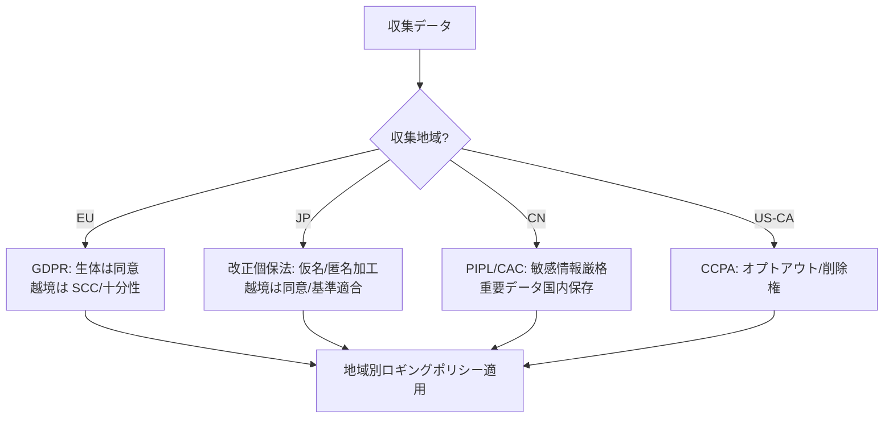

# 2.8 プライバシー・法規制への配慮（収集段階）

プライバシー要件は制約ではなく Closed-Loop の設計パラメータです。本節ではデータ収集段階のプライバシー・法規制対応を、主要規制の比較表、マスキングの再識別リスク評価、地域別ロギングポリシーの JSON として整理します。なお**本書は法的アドバイスを提供するものではなく**、規制の構造と読み方を示すにとどめます。実際の対応は各組織の法務・コンプライアンス専門家と行ってください。

## 主要規制の比較

自動運転データ収集に関わる主要規制を、顔・車内映像・位置情報・越境という観点で比較します。施行時期・要件は改正され得るため、最新の一次情報を必ず確認してください。

| 規制 | 地域 | 顔/ナンバー | 車内映像 | 位置情報 | データ越境 |
|---|---|---|---|---|---|
| GDPR (General Data Protection Regulation; EU 一般データ保護規則) [L14](references#l14) | EU | 個人データ。特別カテゴリ（生体）は原則同意 | 同意 / 正当利益の評価必須 | 個人データ扱い | 十分性認定・SCC (Standard Contractual Clauses; 標準契約条項) などが必要 |
| 改正個人情報保護法（APPI: Act on the Protection of Personal Information）[L13](references#l13) | 日本 | 個人情報。仮名加工 / 匿名加工で緩和 | 取得目的の明示 | 個人関連情報の規律 | 越境は本人同意 / 基準適合体制 |
| PIPL (Personal Information Protection Law; 個人情報保護法) [L12](references#l12) | 中国 | 敏感個人情報。厳格な同意 | 厳格 | 重要データに該当し得る | CAC (Cyberspace Administration of China; 国家インターネット情報弁公室) 安全評価・国内保存要件 |
| UNECE R155 / R156 [O2, O3] | 国連協定国 | （安全 / 更新管理の枠組み）| — | — | CSMS / SUMS の体制要件 |
| CCPA / CPRA (California Consumer Privacy Act / California Privacy Rights Act) | 米国カリフォルニア | 個人情報。オプトアウト権 | 開示・削除権 | 個人情報扱い | 明示制限は緩め |

GDPR は顔などの生体情報を Art. 9 の特別カテゴリとして原則同意を求めます。改正個人情報保護法は**仮名加工情報・匿名加工情報**という加工区分で利活用を緩和する一方、越境提供に本人同意か基準適合体制を要求します。PIPL は敏感個人情報に厳格な同意を課し、CAC のもとで重要データの国内保存・安全評価を求めるため、中国データは**オンプレ国内処理**が現実解となりがちです。UNECE R155 / R156 はプライバシー法ではなく、サイバーセキュリティ管理 (CSMS: Cybersecurity Management System) とソフト更新管理 (SUMS: Software Update Management System) の体制を求める枠組みで、2.9 節と接続します。

> **図 2.8.1**：収集地域に応じて適用規制とロギングポリシーを分岐させる構造。ODD に地域を含めた時点で、この分岐がデータ設計に組み込まれる点が要点です。

地域規制への対応で陥りやすい失敗は、「とりあえず本社所在地の規制を全フリートに適用する」一律設計です。これでは EU 域内の生体情報を本社規制ベースで処理してしまい GDPR Art. 9 に抵触するリスクや、逆に EU 基準で全地域を絞りすぎて日本市場で必要な精密 GPS が取れなくなるといった、両方向の失敗が起こります。地域ごとに適用規制を 1 枚の比較表にまとめ、半年ごとに法務レビューで更新し、差分を `region_policy.json` の必須項目に機械的に反映する設計が、規制改正に追従しつつ収集設計を破綻させないための骨格です。中国 ODD を含むなら CAC（Cyberspace Administration of China; 国家インターネット情報弁公室）の安全評価と国内保存要件を満たすオンプレ処理基盤を計画段階で確定し、越境設計を初期から避ける判断が現実的です。逆に「越境してから対策する」アプローチは、CAC の安全評価で運用許可が下りずにフリートが止まるリスクを抱え、事業計画レベルの失敗につながります。Closed-Loop の観点では、地域規制は技術的制約ではなく ODD の地理軸そのもので、ODD バージョンの拡張と規制マッピングは同じテーブルで管理されるべき情報です。

## オンボードでのマスキングと再識別リスク

顔・ナンバープレートは可能な限り車両上でマスキング (masking; ぼかし・黒塗り・低解像度化) するか、暗号化してのみクラウドに送ります。ただしマスキングは「どの程度残すか」が有用性とトレードオフです。顔の黒塗りは歩行者検出に影響しませんが、視線・向きの行動理解には使えません。重要なのは、マスキング後も**再識別 (re-identification; 加工後データから個人を再特定すること) が困難**であることを定量評価することです。

評価の枠組みは次の手順です。

1. **データ準備**：オリジナル顔画像セット、その同一人物のマスキング後画像セット、参照ギャラリ（既知人物の埋め込み集合）を用意します。
2. **埋め込み抽出**：FaceNet / ArcFace 等の顔認識モデルで、マスク後画像とギャラリそれぞれの特徴量を取り、それぞれを L2 正規化します。
3. **類似度計算**：マスク後埋め込みとギャラリの全組合せでコサイン類似度を計算し、各マスク後画像について最近傍が「本人」だった割合を **再識別成功率** として記録します。
4. **強度走査**：ブラー半径や置換強度を段階的に変えて再識別成功率を測り、目標（例：1% 未満）を満たす最小強度を採用します。

これにより、プライバシーと有用性を両立できます。商用では brighter-AI や Celantur のような匿名化サービスも用いられます（第4章で詳述）。

マスキング設計で見落とされがちな失敗は、「クラウドで匿名化すれば足りる」という発想です。生データを車外に出した時点で漏洩リスクが発生し、GDPR の越境制限や PIPL の重要データ要件に抵触します。顔・ナンバープレートのマスキングはロガー出力前の車載側で実装し、生データは車外に出さない設計を基本とすべきで、これがないと「漏洩しなかったから問題ない」という結果論でしか守れません。逆に強いマスキング（黒塗り）に統一すれば再識別成功率は 1% 未満に抑えられますが、視線・向きを使う行動理解タスクには使えなくなります。3〜5 段階の強度を用意し目標再識別成功率（例：1% 未満）を満たす最小強度を社内基準として固定し、行動理解タスクが必要な場合のみ強度の弱い設定を限定的に使う運用ルールを設ける、というメリハリのある設計が、プライバシーと有用性を両立させる現実解です。再識別成功率の測定を四半期ごとに実施し新しい顔認識モデル登場時に再評価する手順は、攻撃側の能力向上に追従しないとマスキングが「過去の安全」で固定化されてしまう、という時間軸の問題への対策です。

| マスキング手法 | 歩行者検出影響 | 行動理解影響 | 再識別成功率(例) |
|---|---|---|---|
| なし | 無 | 無 | 0.85 |
| 軽ブラー | 無 | 小 | 0.32 |
| 強ブラー | 無 | 中 | 0.04 |
| 黒塗り | 無 | 大（不可）| < 0.01 |
| 顔置換(GAN)| 無 | 小〜中 | < 0.02 |

## 同意管理と地域別ロギングポリシー

GDPR や各国法は利用目的の特定と同意管理を求めます。実務ではユーザーごとに「データ利用レベル」（最小テレメトリのみ／安全向上の追加ログ／研究利用許諾）を設定し、地域別に収集可能項目を切り替えます。これを宣言的なポリシーとして持ち、収集・インジェスト・データ選択の各段階で機械的に適用しましょう。ポリシーは `policy_id` でバージョン管理し、地域コード（EU / CN / JP / US-CA など）ごとに次の項目を必ず指定します。

| 項目 | 例（EU） | 例（CN） | 例（JP） |
|---|---|---|---|
| 車内映像 (`in_cabin_video`) | disabled | disabled | consent_only |
| 顔 (`face`) | onboard_blur_strong | onboard_blur_strong | onboard_blur |
| ナンバープレート (`plate`) | onboard_blur_strong | onboard_blur_strong | onboard_blur |
| GPS 精度 (`gps`) | coarse_1km | store_in_country | precise |
| 保持期間 (`retention_days`) | 90 | 180 | 365 |
| 越境 (`cross_border`) | eu_only | prohibited | consent_or_compliant_scheme |

車載側はインジェスト前にこのポリシーを参照して該当処理を適用します。クラウド側は受信時にポリシー ID を必ず記録し、将来の規制改定や監査要求に対し「どの設定で集められたデータか」を遡及可能にします。

このポリシーをデータレイク（第3章）のカタログにも反映し、「研究用途のみ可」と「安全評価のみ可」のデータセットを論理・物理的に分離して、アクセス制御とトレーサビリティを確保します。

ロギングポリシー設計で陥りやすい失敗は、`policy_id` のバージョン管理を怠ってしまうことです。地域規制は改正されるため、「ある時期に EU で集めたデータが、現行ポリシーの許可範囲とずれている」という事態が起こります。`policy_id` を Git で版管理し、インジェストパイプラインですべてのデータレコードに必須メタデータとして付与する設計があれば、「どの設定で集められたデータか」を遡及可能にでき、規制改定や監査要求に答えられます。逆にこの仕組みなしで運用すると、規制改定のたびに過去データの利用可否を判断できず、「念のため全部使えない」と判断するか「リスクを取って使う」かの二者択一しか残りません。データレイクのアクセス制御を `policy_id` × `data_use_consent` の組み合わせで定義し、研究用途と安全評価用途を物理・論理の両面で分離する設計は、用途違反による信頼失墜と規制違反の両方を機械的に防ぎます。これらは Closed-Loop の観点では「データが使える状態を保ち続けるための制度的基盤」であり、後付けでは整備不可能なため、収集初期から織り込むことが鍵です。

## プライバシーとデータ中心開発のトレードオフ

ロングテール危険シナリオのカバレッジには多様な人・車・環境データが要りますが、個人を長期追跡できるデータの大量保持はリスクです。識別性の高い情報はオンボードで統計量や匿名化表現に変換して元データへのアクセスを最小化し、危険度に応じて保存期間を変え（重大インシデントは長期、それ以外は集計後削除）、解析の単位を「個人単位」から「シナリオ単位・シーンパターン単位」へ移すことが、トレードオフを解く三つの軸です。逆に「すべての生データを長期保管しておけば後で困らない」という発想は、漏洩時の影響範囲を最大化し、削除権対応のコストも跳ね上げます。

GDPR の削除権（忘れられる権利）に応えるには、個人 ID から該当データを横断削除できるリネージ（第3章 OpenLineage [ST9](references#st9) 等）が前提になります。プライバシー要件は後付けではなく、収集設計の初期から織り込むことで、Closed-Loop を止めずに運用できます。

## 本節の振り返り

プライバシー要件は Closed-Loop の制約ではなく設計パラメータです。GDPR・改正個保法・PIPL・UNECE・CCPA を 1 枚の比較表で並べ、生体・車内映像・位置情報・越境という観点で差分を可視化して半年ごとに法務と更新する運用は、本社所在地の規制を全フリートに一律適用する典型的失敗を防ぐ歯止めです。顔・ナンバーのマスキングを車載側（ロガー出力前）で実装し、再識別成功率 1% 未満を満たす最小強度を社内基準として固定する設計は、生データを車外に出した瞬間に発生する漏洩リスクと、強すぎるマスキングで行動理解タスクが死ぬリスクの両方を避ける現実解です。地域別ロギングポリシーを `region_policy.json` で宣言的に定義し、車載・インジェスト・データ選択の各段階で機械的に適用する仕組み、そして `policy_id` × `data_use_consent` のアクセス制御は、規制改定と用途分離の両方に追従できる制度的基盤です。削除権対応のために個人 ID から該当データを横断削除できるリネージを整備する設計は、収集設計の初期から織り込まないと後付け不可能で、これを欠いた組織は「忘れられる権利」要求に応えられず Closed-Loop が法的に止まることになります。

## 次節への橋渡し

プライバシーを守るには、その前提として収集・伝送・保存の各経路が攻撃から保護されていなければなりません。次の 2.9 節では、TARA に基づく脅威分析、CAN-FD SecOC・Ethernet MACsec・TLS 1.3 による車載ネットワーク保護、鍵管理ライフサイクル、CAN スプーフィング攻撃シナリオを扱い、最後に第2章全体のまとめと第3章への橋渡しを行います。
