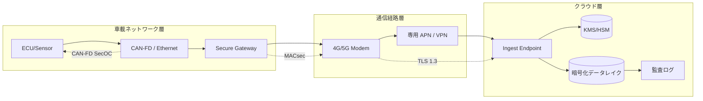
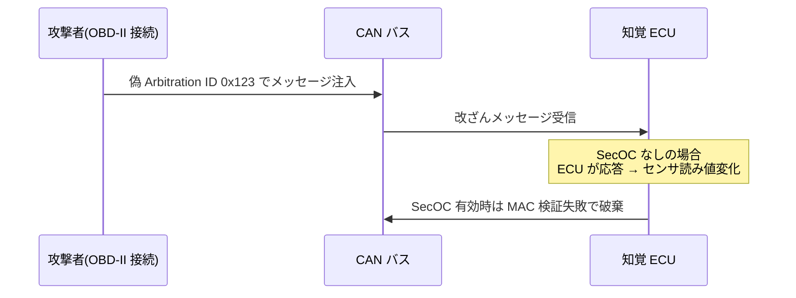
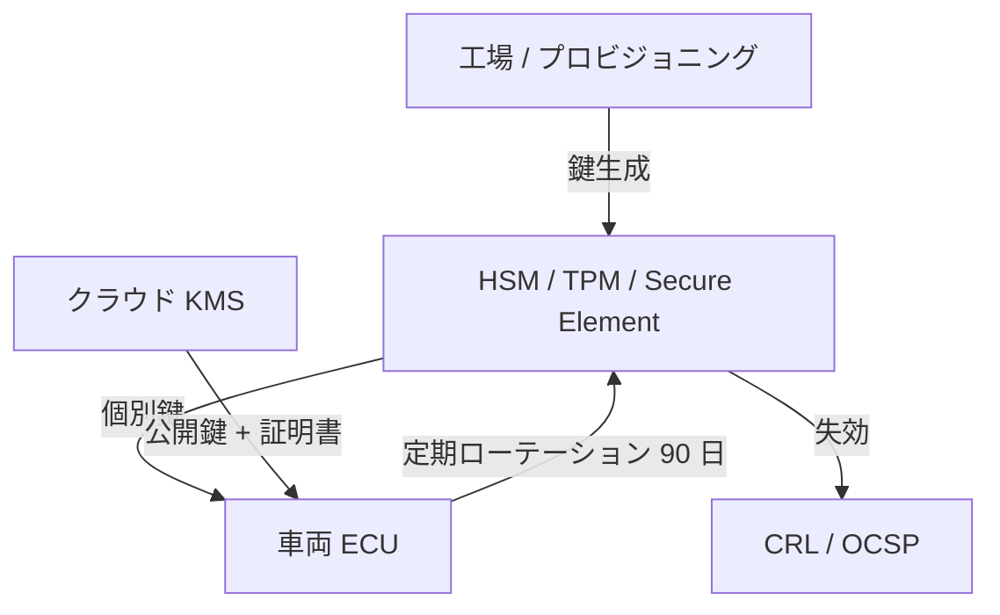
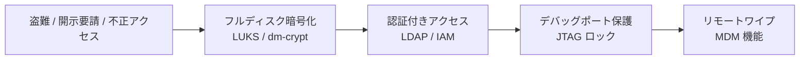

# 2.9 セキュリティとデータ保護

本節では、データ収集段階の**セキュリティ (security) とデータ保護 (data protection)** を、車載ネットワーク → 通信経路 → クラウドの 3 層で整理します。ISO/SAE 21434 [O7](references#o7) と UNECE R155 [O2](references#o2)・R156 [O3](references#o3) が定める TARA (Threat Analysis and Risk Assessment; 脅威分析とリスク評価)、車載 Ethernet の MACsec (Media Access Control Security; IEEE 802.1AE で定義された Ethernet リンク層暗号化) [IEEE 802.1AE]、CAN-FD SecOC、TLS 1.3 (Transport Layer Security; 通信路の暗号化と認証)、HSM (Hardware Security Module; 鍵を耐タンパー領域で管理する装置) 鍵ローテーション、CAN スプーフィング攻撃と防御、データ完全性検証まで、Closed-Loop データエンジンを攻撃から守るための要点を扱います。

## 3 層セキュリティアーキテクチャ

> **図 2.9.1**：3 層セキュリティアーキテクチャ。各層に独立した鍵・認証機構を置く「多層防御 (defense in depth)」が基本方針です。

| 層 | 主な脅威 | 主な対策 | 標準 |
|---|---|---|---|
| 車載ネットワーク | バス注入、リプレイ、なりすまし | CAN-FD SecOC (Secure Onboard Communication; 車載通信の認証付加機能)、MACsec、Secure Gateway | ISO/SAE 21434、AUTOSAR (AUTomotive Open System ARchitecture) SecOC |
| 通信経路 | 中間者攻撃 (MITM; Man-In-The-Middle)、盗聴、DoS (Denial of Service) | TLS 1.3、mTLS（相互 TLS）、専用 APN (Access Point Name; キャリア専用接続網)、VPN | RFC 8446、IPsec |
| クラウド | データ漏洩、特権乱用、改ざん | KMS (Key Management Service; 鍵管理サービス)、IAM (Identity and Access Management; 認証認可) の RBAC/ABAC、SOC 2 / ISO 27001 | UNECE R155、ISO 27001 |

## 車載ネットワークのセキュリティ

### CAN-FD SecOC（Secure Onboard Communication）

CAN (Controller Area Network) / CAN-FD (CAN with Flexible Data-Rate; CAN の高速版) は車載 ECU 間の標準バス規格です。AUTOSAR SecOC は、CAN / CAN-FD バス上のメッセージに MAC (Message Authentication Code; メッセージ認証コード) を付加し、改ざんとリプレイを防ぐ仕組みです。各メッセージは次のフィールドを含みます。

| フィールド | サイズ | 役割 |
|---|---|---|
| Payload | 8〜64 bytes | センサ値・制御コマンド |
| Freshness Value | 4〜8 bytes | カウンタ / タイムスタンプでリプレイ防止 |
| Truncated MAC | 16〜32 bits | CMAC-AES128（AES-128 ベースのメッセージ認証コード）などで計算 |

`Freshness Value` は受信側がカウンタを保持し、減算的なメッセージを拒否します。これにより、攻撃者が正規メッセージを録音して再送する「リプレイ攻撃」を防ぎます。

### Ethernet MACsec（IEEE 802.1AE）

車載 Ethernet（IEEE 802.3 系）では MACsec によりリンク層で暗号化と認証を行います。GCM-AES (Galois/Counter Mode AES; 認証付き暗号化モード) 128 / 256 を用い、**ライン速度（1〜10 Gbps）でのフレーム単位暗号化**を実現します。Secure Gateway を境にして、車外向けトラフィックには MACsec、車内ドメイン間には独自鍵を割り当てるのが一般的です。

### CAN スプーフィング攻撃と防御

**典型攻撃シナリオ**：

1. 攻撃者が OBD-II (On-Board Diagnostics II; 法定の車両診断ポート) に物理接続
2. 偽 Arbitration ID（例 0x123 = センサ制御コマンド）をバスに注入
3. SecOC 無効の ECU は改ざんメッセージに応答 → センサ読み値が偽装される

**防御策**：

- **CAN-FD SecOC**：全メッセージに CMAC、Freshness Value でリプレイ防止
- **CAN IDS (Intrusion Detection System; 侵入検知システム)**：異常メッセージ頻度・タイミング・送信源を ML で検知
- **物理セキュリティ**：OBD-II ポートに認証付きアクセス制御、ロック、整備モード鍵

CAN セキュリティで陥りやすい失敗は、「重要メッセージだけ SecOC を有効化して帯域を節約しよう」と部分有効化に妥協してしまうことです。一部に SecOC が無いだけで、攻撃者は SecOC 無しの ID（例：センサ制御系）を狙って読み値を偽装できるため、攻撃面の縮小効果が得られません。全メッセージに SecOC を有効化し、整備系ツールも例外なく認証経由で接続させる徹底が、SecOC を「導入したのに守れない」状態にしないための条件です。逆に検知系（CAN IDS）だけに頼ってメッセージ認証を省くと、検知時には既に偽装メッセージが ECU に到達しており、後追いの対応しかできません。Secure Gateway に CAN IDS を組み込み異常検知時にテレメトリでセキュリティチームへ通報する仕組みは、SecOC の予防的防御を補完するための後段検知です。OBD-II（On-Board Diagnostics II; 法定の車両診断ポート）の物理アクセスは「整備工場でしか触らないから安全」という思い込みで放置されやすい弱点で、物理ロック＋認証電子鍵（NFC など）の必須化と整備モード鍵の貸与記録管理が、内部関係者を含む脅威モデルへの最低限の備えになります。

## 通信経路の暗号化

### TLS 1.3 推奨設定（NIST / OWASP 整合）

| 項目 | 推奨値 |
|---|---|
| TLS バージョン | 1.3 以上（1.2 は legacy 扱い） |
| キー交換 | 楕円曲線 ECDHE (Elliptic Curve Diffie-Hellman Ephemeral; 一時鍵を用いる楕円曲線鍵交換、P-256 / P-384) |
| 認証 | ECDSA (Elliptic Curve Digital Signature Algorithm; 楕円曲線署名、P-256) または RSA 2048+ |
| 暗号スイート | TLS_AES_256_GCM_SHA384 / TLS_CHACHA20_POLY1305_SHA256 |
| 証明書 | X.509 v3、車両側に Client Certificate（mTLS: mutual TLS; 双方向認証）|
| 失効確認 | OCSP (Online Certificate Status Protocol) Stapling、CRL (Certificate Revocation List; 失効リスト) 配布 |

アップロードクライアントの実装では、上表の推奨値を次のように具体化します。

- **TLS 最小バージョン固定**：HTTPS クライアントの SSL コンテキストに `TLSv1_3` を最小バージョンとして設定し、1.2 以下にダウングレードしないようにする
- **暗号スイート明示**：`TLS_AES_256_GCM_SHA384` または `TLS_CHACHA20_POLY1305_SHA256` のみを許可する
- **CA (Certificate Authority; 認証局) バンドルの固定**：自社 PKI (Public Key Infrastructure; 公開鍵基盤) のルート証明書を含む `ca-bundle.pem` を CA として読み込み、証明書ピンニング（公開鍵ハッシュの一致確認）を併用して中間者攻撃に備える
- **クライアント証明書 (mTLS)**：車両ごとの個別鍵 `vehicle.key` と証明書 `vehicle.pem` をリクエストに添付し、サーバ側でも検証する
- **アップロードエンドポイント**：`https://ingest.example.com/v1/upload` のような固定パスへ MCAP ログをマルチパート POST する

このピンニング付き mTLS クライアントを車載アップローダ・OTA クライアント・診断アップロードの各経路で共通化し、設定差分が出ないよう設定ファイルとして外出ししましょう。

### 専用 APN・VPN による経路隔離

公衆インターネットを介さず、キャリアの専用 APN・Private LTE・IPsec VPN (Virtual Private Network) を用いてインジェスト基盤に直結する構成が一般的です。これにより外部公開面を縮小し、DoS や経路ハイジャックのリスクを下げられます。

通信経路セキュリティで気をつけたいのは、「TLS 1.3 を有効にしただけで安全になった」という誤解です。証明書ピンニングを併用しないと、攻撃者が CA（Certificate Authority; 認証局）を不正に取得して中間者攻撃を仕掛ける経路が残ります。車両アップロードを公衆インターネット経由から専用 APN または IPsec VPN 経由に切り替えて経路を 1 本化し、mTLS の証明書ピンニングを車載アップローダ・OTA クライアント・診断系で共通化して設定ファイルを 1 つにまとめる設計は、攻撃面の縮小と運用ミスの防止を同時に達成するための仕組みです。逆にアップロード・OTA・診断で別々のクライアント設定を持つと、片方だけ古い暗号スイートが残るような運用ミスが半年後に発覚し、セキュリティ監査で指摘されます。アップロードエンドポイントの DNS と TLS 証明書のローテーション計画を年次で策定しておかないと、証明書失効時に車両アップロードが一斉停止する事態が起こり、Closed-Loop の入口が事業影響レベルで止まります。

## HSM・鍵管理戦略

> **図 2.9.2**：鍵管理ライフサイクル。工場プロビジョニング → 配布 → 90 日ローテーション → 失効。各車両に個別の対称鍵を持たせ、漏洩時の影響範囲を1台に閉じ込めます。

鍵ローテーションのバッチ実装は、次の四ステップを 90 日周期で繰り返します。

1. **新鍵の生成**：クラウド KMS（例：AWS KMS）の車両マスター鍵から AES-256 (Advanced Encryption Standard; 256bit 共通鍵暗号) のデータ鍵を生成し、暗号化済み鍵素材（CiphertextBlob）を取得する
2. **車載 HSM への配布**：mTLS 経由で対象車両の HSM / Secure Element に新鍵をアップロードし、有効化日時をスケジュールする
3. **旧鍵の遅延失効**：旧鍵は即時削除せず、未到達のセッションが完了するためのバッファとして 30 日後に削除する予約を入れる
4. **監査ログ追記**：`vehicle_id`、`action=key_rotate`、UTC タイムスタンプ、次回ローテーション予定日を append-only ストアへ記録し、UNECE R155 / R156 の追跡要件を満たす

例外（車両オフライン・通信失敗）は別キューに退避させ、復帰時に再試行する設計にします。

鍵管理で陥りやすい失敗は、「鍵をソフトウェア領域に置いたまま運用する」ことです。これでは ECU が物理的に盗まれた瞬間に鍵が漏洩し、漏洩範囲が 1 台に閉じ込められません。車両ごとに HSM または Secure Element を実装段階で選定し、鍵が車外に出ない設計を初期から確保することが、漏洩時の影響範囲を 1 台に閉じ込める前提条件です。逆に「漏洩したら全車両を一斉ローテーション」という対応に依存すると、フリート全体のオフライン同期失敗で対応が破綻します。90 日鍵ローテーションのバッチ実行を本番運用前に 1 サイクル以上シミュレーションし、車両オフライン・通信失敗の例外パスまで含めて検証することが、本番でローテーションが失敗してフリート全体が認証エラーで止まる事態を防ぎます。監査ログを append-only ストア（S3 Object Lock や WORM 対応ストレージ）に保存して改ざん不可性を担保する設計は、UNECE R155／R156 の追跡要件を満たすうえで欠かせない要素であり、「いつ・誰が・どの鍵で署名された設定を車両に配布したか」を遡及的に証明できる状態を作ります。

| 鍵種別 | ローテーション周期 | 保管 |
|---|---|---|
| 通信用セッション鍵 | TLS セッションごと（PFS: Perfect Forward Secrecy; 完全前方秘匿性）| メモリのみ |
| 車両個別鍵 | 90 日 | 車載 HSM / Secure Element |
| 署名検証鍵（OTA）| 1〜2 年 | クラウド KMS / HSM |
| マスター鍵 | 5 年（厳格管理）| オフライン HSM |

## ISO/SAE 21434 と UNECE R155/R156 の要点

ISO/SAE 21434 [O7](references#o7) は、車両サイバーセキュリティのライフサイクル全体（コンセプト → 開発 → 生産 → 運用 → 廃棄）を扱う標準です。その中核が **TARA（脅威分析とリスク評価）** です。

| 段階 | 出力 | データ収集との関係 |
|---|---|---|
| 資産特定 | センサデータ、AI モデル、HD マップ | データ分類（高 / 中 / 低リスク）|
| 脅威分析 | STRIDE (Spoofing / Tampering / Repudiation / Information Disclosure / Denial of Service / Elevation of Privilege; 6 種の脅威分類) / Attack Tree | ロギングが盗聴・改ざんに耐えるか |
| リスク評価 | Severity × Feasibility | 高リスク経路の暗号化要件 |
| 対策設計 | セキュリティゴール、要件 | 鍵管理・SecOC・MACsec・TLS の選定 |

データ収集段階に STRIDE を適用した代表的な脅威例を、対策とともに示します。

| STRIDE 分類 | 自動運転データ収集での代表例 | 主たる対策 |
|---|---|---|
| **S** Spoofing（なりすまし） | 偽の車両 ID でテレメトリを送信、攻撃者の偽 OTA サーバへの接続 | 車両ごとの HSM 内秘密鍵 + mTLS、Uptane の役割分離（第 8.4 節）|
| **T** Tampering（改ざん） | センサ生データの差し替え、CAN メッセージの中間改ざん | CAN-FD SecOC の MAC、ログのチャンク単位ハッシュチェーン |
| **R** Repudiation（否認） | 「自分はその記録を送っていない」「設定変更は知らない」 | 監査ログを HSM 署名付きで append-only 保存 |
| **I** Information Disclosure（情報漏洩） | 車載ストレージ盗難、通信路の盗聴 | NVMe の AES-256 全量暗号化、TLS 1.3 + ECDHE-ECDSA |
| **D** Denial of Service | アップロード経路への DDoS、車載 ECU のバッファ溢れ | バックプレッシャ制御、リージョン別 CDN、車載ウォッチドッグ |
| **E** Elevation of Privilege | デバッグポートからの権限昇格、内部アクセスの横展開 | セキュアブート、最小権限の RBAC/ABAC、ハードニング設定 |

**UNECE R155（CSMS）**は OEM に対し、組織全体のセキュリティ管理プロセスを義務付けます。**UNECE R156（SUMS）**は OTA を含むソフトウェア更新管理を義務付けます。これらは EU・日本・韓国などで型式認証要件となっており、データ収集段階でも「いつ・誰が・どの鍵で署名された設定を車両に配布したか」を完全に追跡できる必要があります。詳細は第8章で扱います。

TARA 運用で気をつけたい設計判断は、「セキュリティ部門が単独で TARA レポートを書いて棚に置いておく」スタイルです。資産（センサデータ・モデル・HD マップ・鍵）を高／中／低リスクに分類して STRIDE 観点で脅威リストを作るのは TARA の出発点ですが、各脅威に対する対策（SecOC・MACsec・TLS・KMS）と検証方法を紐付け、半年ごとに更新する運用フローを安全チームと合意して Closed-Loop の改善サイクルに組み込むところまで進まないと、TARA は「規制対応のための紙」で終わります。逆に対策だけを積み上げて TARA を更新しないと、新しい攻撃手法（たとえばモデル汚染や OTA 鍵漏洩の新パターン）が登場しても評価が追いつかず、対策と脅威の対応関係が陳腐化します。TARA は「データ中心開発と同じく継続的に回す対象」として位置づけ、Closed-Loop の改善イベント（モデル更新・新 ODD 投入・新規センサ追加）を引き金に半年待たずに更新する柔軟性が、UNECE R155 が要求する CSMS（Cybersecurity Management System）の実体としても望ましい運用形態です。

## 物理的盗難・不正アクセスへの対策

| データ分類 | 例 | 暗号化 | アクセス制御 | 保存期間 |
|---|---|---|---|---|
| 高リスク（L3）| 生カメラ映像、車内映像、精密 GPS | AES-256-XTS（フルディスク暗号化）| RBAC + MFA (Multi-Factor Authentication; 多要素認証) | 30 日 |
| 中リスク（L2）| LiDAR 点群、CAN ログ | AES-256-XTS | RBAC | 90 日 |
| 低リスク（L1）| 集約テレメトリ、統計値 | AES-128 | プロジェクト別 | 365 日 |

すべてを最高レベルで保護するのは非現実的です。リスクベースの 3 層分類で、運用負荷とコストを抑えながら必要十分な防御を実現します。

## データ汚染（poisoning）の検知

攻撃者がセンサデータに微小なノイズを注入し、後段の学習を歪めようとする「データ汚染攻撃 (data poisoning attack)」が研究・実証で報告されています [D23](references#d23)。Closed-Loop データエンジンとしては、**入力分布の連続監視と異常時の検査**が要となります。

検出ロジックは KL divergence ベースで構成します。具体的な処理は次のとおりです。

1. 過去の正規時系列（数日〜数週分）から KDE (Kernel Density Estimation; カーネル密度推定。離散点群から滑らかな確率密度関数を推定する手法) でベースライン分布 $P$ を作る
2. 現在窓の分布 $Q$ を同じ KDE で構築する
3. 共通サポート上で離散化し、$\sum P(x) \log (P(x)/Q(x))$ を数値積分する

値が事前定義したしきい値（例：0.3）を超えたら「データ汚染の可能性あり」と判定し、当該車両・センサ・時間窓のログを学習・評価から自動隔離してセキュリティチームのレビューキューへ送ります。連続監視では 1 分ごとのスライディング窓で計算し、ベースライン窓との比較を続けます。

実運用では、**正規時の分布をベースラインとして保持**し、車両単位・センサ単位・時間窓単位で KL や Wasserstein 距離（分布間の輸送コストを測る距離指標）を継続計測します。閾値超過時には該当期間のデータを**学習・評価から自動隔離**し、セキュリティチームのレビューに回します。ベースラインは**季節変動・センサ経年劣化**で常に移動するため、月次でローリング更新（直近 30 日のクリーンデータでベースラインを差し替え）し、新 ODD セグメント追加・センサ世代切り替え時には手動で全置換します。更新ポリシー自体も `baseline_v=N` でバージョン管理し、検知挙動の変化を遡及検証できるようにします。

データ汚染検知で陥りやすい失敗は、ベースライン分布 $P$ を一度作って固定してしまうことです。季節変動とセンサ経年劣化で正常分布は常に移動し、固定ベースラインでは半年後に「全データが汚染判定」される誤検知の嵐になります。月次のローリング更新と新 ODD・新世代切替時の手動全置換を組み合わせ、ポリシー自体に `baseline_v=N` のバージョン管理を付ける運用が、誤検知の暴発と検知挙動の遡及検証可能性の両方を担保します。逆にベースラインを更新しすぎると、攻撃者が緩やかに分布を操作する slow drift 型の汚染を「正常な変化」として吸収してしまうため、月次更新と全置換のタイミングは慎重に設計すべきです。KL 検知の初期しきい値は 0.3 を出発点に、1 か月運用してから ODD 別に調整するのが現実的で、最初から指標ごとに最適化しようとすると初期データの偏りが原因で運用が振動します。隔離ログをセキュリティチームのレビューキューに自動投入し、48 時間以内の 1 次判定 SLA を定める運用は、検知から対応への接続を機械化することで「警告だけが積み上がる」状態を避けます。

## セキュリティロギングと DataOps の接続

セキュリティイベント（認証失敗、ECU 異常再起動、不正接続試行など）を **モデル性能・インシデント率・データ品質指標** と相関分析することで、攻撃の早期検知と Closed-Loop 改善の両方に活用できます。

| 信号 | 想定パターン | アクション |
|---|---|---|
| 認証失敗増加 + 特定 SW バージョン | 脆弱性が悪用されている可能性 | OTA で緊急パッチ配布 |
| ECU 異常再起動 + センサ KL 上昇 | 物理改ざん + データ汚染 | 当該期間データを学習から除外 |
| 特定キャリア × 特定地域で異常 | 経路ハイジャックの疑い | 通信経路を切替、TARA を再評価 |

これらを Grafana / Splunk / Datadog 等で可視化し、セキュリティチーム・DataOps チーム・ML チームが共通の意思決定面で議論できる状態が、データ中心開発の前提条件になります。

## インシデント時のデータハンドリング方針

セキュリティインシデント発生時は、事前に定めたポリシーに従い迅速に対応します。

| インシデント種別 | データ取り扱い | 影響範囲評価 |
|---|---|---|
| データ漏洩のみ（改ざんなし） | 学習継続可、アクセス権・保存期間見直し | 漏洩データの ID リスト |
| センサ汚染の疑い | 当該期間データを学習・評価から除外、検査対象化 | 影響モデルの roll back 候補 |
| 通信経路改ざん | アップロード経路を遮断、別経路に切替 | 当該経路の全データを隔離 |
| OTA 鍵漏洩 | 鍵失効、緊急ローテーション、再署名配布 | 全車両（最重要） |

各インシデントは TARA を更新し、再発防止策を Closed-Loop で組み込みます。

## 本節の振り返り

セキュリティとデータ保護は Closed-Loop データエンジンを攻撃から守るための全層防御であり、車載ネットワーク・通信経路・クラウドの 3 層に独立した暗号化・認証機構を配置する多層防御（defense in depth）が出発点です。CAN-FD SecOC を全メッセージに適用して Secure Gateway に CAN IDS を組み込む構成は、予防的なメッセージ認証と後段検知を組み合わせ、「一部だけ SecOC」の妥協がもたらす攻撃面の残存を防ぎます。TLS 1.3 + mTLS + 証明書ピンニングのアップロードクライアントを専用 APN／VPN 経由で運用する設計は、TLS 1.3 単体で安心せず CA 不正取得経由の中間者攻撃まで防ぐための実装で、車載アップローダ・OTA・診断系の設定共通化が運用ミスの抑制に直結します。車両個別鍵 90 日／署名鍵 1〜2 年／マスター鍵 5 年のローテーションを HSM ベースで実装し、鍵が車外に出ない設計を初期から確保することは、漏洩時の影響範囲を 1 台に閉じ込めるための前提条件です。TARA レポートを半年ごとに、そして Closed-Loop の改善イベントごとに更新する運用と、データ汚染攻撃に対する KL／Wasserstein 分布監視は、攻撃手法の進化に追従するための情報基盤であり、UNECE R155／R156 の追跡要件と自然に整合します。これらは独立した施策ではなく、Closed-Loop の入口品質を「安全に・継続的に」守り続けるための連動した設計判断として理解してください。

## 第2章のまとめ

第2章では、Closed-Loop データエンジンの最上流である **(I) データ収集** を、ODD 設計（2.1）→ フリート戦略（2.2）→ センサ構成（2.3）→ キャリブレーション（2.4）→ オンボードソフトウェア（2.5）→ エッジトリガ（2.6）→ 品質モニタリング（2.7）→ プライバシー（2.8）→ セキュリティ（本節）の順に体系化しました。データ収集は単なる「全部録る」行為ではなく、**ODD カバレッジ × トリガポリシー × 品質ゲート × プライバシー × セキュリティ** を一体的に設計する戦略的活動である、というのが本章の核心です。

## 次章への橋渡し

第3章では、収集されたデータを **(II) 保存・インジェスト** する段階を扱います。Apache Iceberg / Delta Lake / Hudi の比較、MCAP フォーマット、TimescaleDB / ClickHouse / Druid 等の時系列 DB 選定、S3 ストレージ階層化（Standard / Intelligent-Tiering / Glacier 系）の TCO 試算、データリネージ（OpenLineage / Marquez / DataHub）、Vector DB によるシーン類似検索、IAM / KMS / GDPR 削除権の技術実装まで、ペタバイト級データを Closed-Loop に活用するためのインフラを詳述します。
