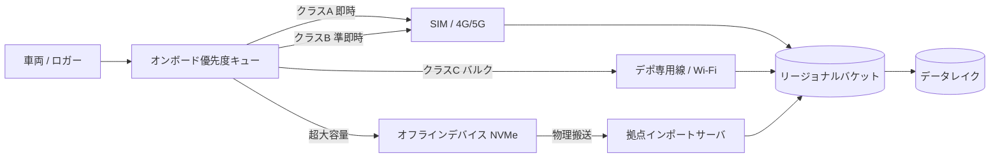

# 3.1 アップロード経路設計（専用線／SIM／オフラインデバイス）

この節では、車両からクラウドへデータを運ぶアップロード経路 (upload path) の設計を扱います。SIM 通信・拠点専用線・オフラインデバイスをどう組み合わせるか、帯域とコストをどう試算するか、優先度制御と耐障害設計をどう作り込むかを、Closed-Loop データエンジンのレイテンシを律速しないという観点から整理します。

## なぜ経路設計が Closed-Loop を律速するのか

Closed-Loop データエンジンの回転速度は、「走行 → アップロード → インジェスト → 学習 → 評価 → 配信」の各レイテンシの総和で決まります。このうちアップロード区間は、フリート規模に比例して帯域コストが線形に増える唯一の区間です。設計を誤ると数 PB/月のデータが滞留し、サイクル全体が止まります。まず規模感を試算で押さえます。

第1章・第2章では「車載側で何を、どのレートで生成するか」を扱いました。本章はその受け皿として、**車両を出てクラウドのデータレイクに着地するまでの経路** を設計する章です。本節はその入り口にあたります。

### データボリューム試算（2.3 節の再掲）

1 台あたりのオンボード生成レートは、センサ構成から見積もれます。**以下の試算は 2.3 節「センサ構成の設計」で算出した値の再掲** で、本節ではアップロード経路設計の前提として参照します。代表的な L2+/L4 開発車両の概算を示します。

| センサ | 構成例 | 生レート | 圧縮後（目安） |
|---|---|---|---|
| カメラ | 8 台 × 1920×1080 × 30fps × 12bit | 約 1.5 GB/s | H.265 5:1 → 約 300 MB/s |
| LiDAR | 2 台 × 約 200 万点/s × 16B | 約 64 MB/s | Draco 10:1 [ST12](references#st12) → 約 6 MB/s |
| Radar | 5 台 × 4D point | 約 5 MB/s | zstd 3:1 → 約 1.7 MB/s |
| CAN/車両バス | 高頻度スカラ | 約 2 MB/s | zstd 5:1 → 約 0.4 MB/s |
| 合計 | — | 約 1.6 GB/s | 約 310 MB/s |

圧縮後でも 1 台が 1 時間走行すると約 1.1 TB を生成します。100 台のフリートが 1 日 8 時間走行すれば、`100 × 8 × 1.1 TB ≈ 880 TB/日`、月間で約 26 PB に達します。**全量アップロードは非現実的**であり、後述の優先度制御とイベントトリガ（特定の条件成立時のみ高解像度ログを残す方式）による間引きが前提になります。仮に「常時テレメトリ + 5% の高解像度イベントログ」に絞れば、アップロード量は月 1〜2 PB 規模まで圧縮できます。

**規模別の出発点**：

- TB 級（試作 1〜数台）：SIM 単独 + デポ Wi-Fi で間に合う。地域分散なし。
- 10〜100 TB/日（小〜中フリート）：SIM + 専用線の二経路、リージョナルバケット 1〜2 拠点。
- PB 級（量産前評価フリート）：SIM + 専用線 + オフライン NVMe の三経路、地域別バケットとデータ主権設計を必須化。

## バックホール経路の選択肢と比較

実フリートでは、単一経路ではなく複数経路を ODD と運用形態に合わせて組み合わせます。

> この図のポイント：経路はデータクラスごとに分岐し、最終的に同じリージョナルバケットへ集約される。

| 経路 | 実効スループット | 概算コスト | 遅延 | 主用途 |
|---|---|---|---|---|
| SIM (4G/5G) | 10〜200 Mbps/台 | 従量 $5〜20/GB（国際ローミングは数倍） | 秒〜分 | クラス A/B イベント・テレメトリ |
| 拠点専用線/Wi-Fi | 1〜10 Gbps（拠点共有） | 固定 $1k〜10k/月 | 帰着後に分〜時間 | クラス C 学習用バルク |
| オフライン NVMe | 物理 1〜8 TB/台、USB-C/Thunderbolt 又は NVMe ホットスワップ | デバイス償却のみ | 日（搬送リードタイム） | 通信弱地域・大規模テストキャンペーン |

オフラインデバイスは「帯域 = 容量 ÷ 搬送時間」で評価します。8 TB の NVMe（不揮発性メモリの高速 SSD 規格）を 1 日で拠点搬送すれば実効約 740 Mbps 相当となり、SIM 単独より高スループットになり得ます。これは古典的な「station wagon full of tapes（テープを満載したワゴン車を走らせる方が、ネットワークより速いことがある、という格言）」の現代版です。

なお 740 Mbps はピーク値です。USB-C / Thunderbolt のドライバオーバーヘッド（10〜20%）、書込み・検証時間、搬送ロジスティクスのバッファを差し引くと、実効値は 600 Mbps 前後（約 80%）に落ちます。実プロジェクトでは余裕係数 0.7〜0.8 を掛けて見積もるのが安全です。

**経路選定の具体的な指針**：

- クラス A（安全クリティカル、1 件あたり数百 MB〜数 GB）→ SIM で即時送信。
- クラス B（テレメトリ、KB〜MB 単位の高頻度小ペイロード）→ SIM で常時細流。
- クラス C（学習用バルク、1 Drive あたり数十〜数百 GB）→ デポ専用線。当日中に上がらない量があればオフライン NVMe を併用。
- 海外拠点や僻地・通信弱地域はオフライン NVMe を主とし、テレメトリのみ衛星通信や eSIM ローミングで送る。

## 優先度制御とウォーターマークによるバックプレッシャー

アップロード候補は重要度でクラス分けします。

- クラス A：安全クリティカルなイベント（AEB 介入、ドライバ介入 (disengagement)、衝突疑い）周辺の高解像度ログ。
- クラス B：健全性モニタリング用テレメトリ（モデルスコア統計、ドリフト指標、データ品質指標）。
- クラス C：学習用の一般走行ログ（サンプリングされたセンサデータ）。

クラウド側インジェストや車両側ストレージが詰まると、古いデータから破棄せざるを得ません。これを制御するのがウォーターマーク (watermark) 方式です。キュー水位に対し高位・低位の 2 閾値を設け、ヒステリシスを持たせてトリガ頻度を増減させます。

具体的には、車両側のアップロードガバナを次の方針で実装します。入力はキューの現在使用量（GB 単位）と、これから送ろうとしているアイテムのデータクラス（A/B/C）です。出力は「送る／送らない」のブーリアン判定です。

- 高位ウォーターマークはキュー容量の 80%、低位ウォーターマークは 50% を初期値とします。使用量が高位に達した時点で「抑制モード」に入り、使用量が低位を下回るまではモードを保持します。これにより閾値付近でのバタつきを防ぎます。
- 通常モード（抑制中でない）であれば、クラスを問わず通過させます。
- 抑制モード中は、クラス A（安全クリティカル）のみ無条件で通過、クラス B（健全性テレメトリ）は 1/4 程度に間引き、クラス C（学習用バルク）は破棄、というポリシーを取ります。
- 高位・低位の値や間引き率は OTA で配布できる設定値として外出しし、運用中にフリート全体へ動的に変更できるようにします。

クラウド側でバックプレッシャー（下流の処理が詰まり、上流に「送るのを抑えてくれ」と圧をかける制御）が発生した際は、この閾値を OTA でフリートに配布し、フリート全体のトリガ頻度を協調的に下げる運用が有効です。「どの拠点・経路のデータが、どれだけの遅延でクラウドに到達したか」をメトリクス化し、ボトルネックを継続監視します。なお A / B / C のクラス定義は社内のインシデント分類（Sev-1〜3）と一致させ、安全レビューと合意した形で決めることが望ましく、抑制発動回数や抑制中の破棄バイト数を Drive メタデータに残しておくと「破棄が多いフリート群」を月次で特定できます。

## 再送・レジューム・耐障害設計

移動体通信では電波状況による中断が避けられないため、チャンク分割と再開可能アップロードを前提にします。

- ログを固定長チャンク（例：8〜64 MB）に分割し、各チャンクに `chunk_seq` と CRC32C チェックサム（誤り検出符号、CRC32 より衝突に強く Google などが標準採用）を付与する。
- クラウド側で受信済みチャンクを記録し、未達分のみ再送要求する。S3 Multipart Upload（最大 10,000 パート、各 5 MB〜5 GB）や `tus` レジューム可能プロトコル（HTTP 上の標準仕様）が代表的。
- 車両側キューの状態を永続化し、再起動後も途中から再開する。

各 Drive には、経路と通信品質をメタデータとして記録しておくと後段の障害分析に直結します。Drive メタデータには次の項目を必須フィールドとして含めます。

- **識別子**：`drive_id`（車両 ID + 走行開始日時）、`region`（収集リージョン）。
- **経路情報**：`upload_path`（`sim_5g` / `dedicated_line` / `offline_nvme` のいずれか）。
- **転送量**：`bytes_uploaded`（最終送達バイト数）、`chunks_total`（総チャンク数）、`chunks_resumed`（再送が発生したチャンク数）。
- **ネットワーク品質**：RTT の中央値 (`rtt_ms_p50`) と 95 パーセンタイル (`rtt_ms_p95`)、パケットロス率 (`loss_pct`)、ジッタ (`jitter_ms`)。
- **タイムスタンプ**：`completed_at`（クラウド側で全チャンク受領完了した時刻、UTC）。

RTT（往復遅延時間）・パケットロス・ジッタ（遅延の揺らぎ）を Drive メタデータに残すと、「SIM 経由はフレームドロップが多い」「特定デポの専用線は時刻同期欠損が多い」といった傾向を定量的に把握できます。たとえば `chunks_resumed / chunks_total` が 5% を超える Drive を「経路品質要レビュー」としてダッシュボード化したり、リージョン × 経路 × 月の集計から設備増強の閾値（例：p95 RTT > 200 ms が 1 ヶ月続いたら検討）を決めたりする運用に直結します。

## 地域別バケット戦略とデータ主権

国境をまたぐフリートでは、データ主権 (data sovereignty、データを「どの国の管轄に置くか」という主権概念) と越境規制が経路設計に直結します。GDPR [L14](references#l14)（EU 一般データ保護規則）、改正個人情報保護法 [L13](references#l13)、PIPL [L12](references#l12)（中国個人情報保護法）は、個人データの保存地や越境移転に制約を課します。特に PIPL [L12](references#l12) は中国国内データの国外移転を厳しく制限するため、国内リージョンでの一次保存が事実上必須です。

設計原則は「収集地のリージョナルバケットへまず着地させ、匿名化・マスキング後にのみ越境させる」ことです。実装としては、走行リージョンを GNSS から判定して S3 / GCS / Azure バケットへ振り分けるルーティングを車載 SDK に持たせ、合わせてバケットポリシーで `s3:PutObject` の Allow リージョンを限定しておくと、誤って越境転送が起きないようガードレールが効きます。国際ローミングはコストも数倍になるため、国境通過時にロギングポリシーを切り替え、現地リージョンへ落とす運用が合理的です。本書は法的アドバイスを提供するものではなく、実装前に各地域の最新規制と法務確認を行う必要があります。

## 本節の振り返り

アップロード経路は Closed-Loop の入口にあり、ここで律速すると後段の学習・評価サイクルが丸ごと止まります。圧縮後でも 1 台 1.1 TB/時、100 台フリートで月 26 PB という規模感は、「全量を運ぶ前提」自体が誤りであることを示しています。設計判断の本質は「何を運ぶか」ではなく「**何を運ばないか、どの順で運ぶか**」をクラス A/B/C の優先度として設計に焼き付けることにあります。実務で陥りがちな失敗は、SIM 単独でクラス C のバルクログまで送ろうとして従量課金が爆発するケース、逆にオフライン NVMe だけに頼ってクラス A の安全イベントが数日遅れるケースの 2 つです。どちらも「経路ごとに運べるデータの種類が違う」という認識が抜けています。データエンジニアと SRE は、ウォーターマークの抑制発動回数やリージョン別の `chunks_resumed` 比率を恒常的に観測し、ボトルネックを定量的に可視化することで、Closed-Loop の回転速度を守る責務を負います。

## 次節への橋渡し

経路を通ってクラウドに到達したデータは、そのままでは利用できません。次の 3.2 節では、到達したデータを受け止めてデータレイクへ取り込む**インジェストパイプライン**を扱い、キューイング基盤の選定、Idempotent な重複排除、SLA 設計、検品 UI による品質ゲートを具体化します。
