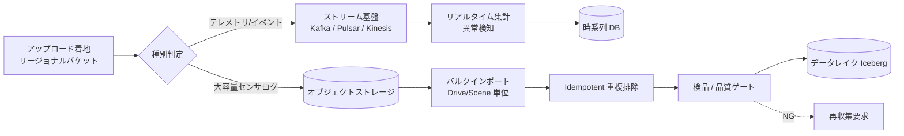

# 3.2 インジェストパイプライン

この節では、車両からアップロードされたデータをクラウドで受け取り、データレイク (data lake) へ取り込むインジェストパイプライン (ingest pipeline) を設計します。ストリーミング基盤の選定、Idempotent な重複排除（同じデータが何度届いても結果が同一になる性質）、SLA クラス分け、検品 UI による品質ゲートを、後段のデータ選択・学習・評価が信頼できる土台を得るという観点から具体化します。

## インジェストの全体構成

インジェストは「リアルタイム経路」と「バルク経路」の二系統を並走させる構成が一般的です。

> この図のポイント：低レイテンシが必要なテレメトリはストリーム経路、大容量ログはバルク経路に分け、両者が品質ゲートを経てレイクに収束する。

## ストリーミング基盤の選定

リアルタイム経路のキューイング基盤は、スループット・順序保証・運用負荷で選びます。

| 基盤 | 強み | 弱み | 自動運転での適性 |
|---|---|---|---|
| Apache Kafka | 高スループット、エコシステム成熟、パーティション順序保証 | 運用が重い、ストレージとブローカが密結合 | フリートテレメトリの本命。自社運用 or MSK |
| Apache Pulsar | ストレージ分離 (BookKeeper)、マルチテナント、地理レプリケーション | 構成要素が多い | 地域分散フリートで有利 |
| AWS Kinesis | マネージド、運用負荷ゼロ | シャード上限・保持期間制約、ベンダーロック | 小〜中規模、AWS 中心構成 |
| Google Pub/Sub | グローバル、自動スケール | 厳密順序は要工夫 | GCP 中心構成 |

選定基準は、**(1) ピークスループット（前節試算の月 1〜2 PB を秒間に割ると数 GB/s）、(2) パーティションキー設計（`vehicle_id` か `drive_id`）による順序保証、(3) 既存クラウドとの親和性**の 3 点です。テレメトリは Kafka / MSK（AWS が提供する Kafka マネージドサービス）、超大容量センサログはストリームに載せずオブジェクトストレージ経由のバルクインポートとする二段構成が堅実です。

**規模別の指針**：

- 〜数百 MB/s（試作〜小規模フリート）：AWS Kinesis や GCP Pub/Sub などのマネージドで十分。運用負荷を最小化できる。
- 数 GB/s（量産前評価フリート）：Kafka / MSK が本命。パーティション数を `vehicle_id` 単位で数百〜数千に切り、ホットスポットを避ける。
- 10 GB/s 超・地域分散：Pulsar の地理レプリケーションを検討するか、Kafka を地域ごとに立てて MirrorMaker で結ぶ。

## Idempotent なインジェストと重複排除

アップロード再送やリトライで同一ログが複数回届くため、インジェストは Idempotent（同じ入力を何度処理しても結果が変わらない）でなければなりません。鍵となるのは、衝突しない一意キーの設計です。

ファイル名やオブジェクトキーだけでは、再エンコードやリネームで衝突や取りこぼしが起きます。**コンテンツハッシュ + 論理 ID の複合キー**にすることで堅牢にします。

各シャードに付与するインジェストレコードには、次のフィールドを必ず持たせます。

- **`idempotency_key`**：そのシャードを一意に識別するキー。実装としては `content_hash` をそのまま用いるか、`drive_id` + `shard_seq` + `content_hash` の連結を採用します。
- **`logical_id`**：ビジネス上の位置を示す構造体で、`drive_id`・`scene_id`・`shard_seq`（シャード連番）の 3 要素を持ちます。
- **`content_hash`**：シャード本体のバイト列に対する SHA-256 ハッシュ。
- **`byte_size`**：シャードのバイト数（後段でレイクへの取り込みボリューム集計に使う）。
- **`time_range`**：そのシャードが含む計測時刻の開始・終了（UTC）。
- **`status`**：`received` → `processing` → `committed` の 3 値で進捗を管理します。

`content_hash` は SHA-256（256 bit のハッシュ関数）を用います。誕生日問題（ハッシュ衝突確率の見積もり）では 256 bit ハッシュの衝突確率 50% が約 $2^{128}$ 件、128 bit 切り詰めでは約 $2^{64}$ 件で 50% に達します。書籍を通じて扱う $10^{12}$〜$10^{13}$ 件規模では実用上衝突は無視できます。

実装上の重複防止は、ハッシュ単独ではなく **bloom filter + LSM-KV + Iceberg ACID コミット** の三段で保証します。

- **bloom filter**：要素の有無を確率的に判定するメモリ常駐フィルタ。「絶対に未登録」を高速に切り分けられる代わりに、ごく稀に「登録済みかも」と誤って答える（偽陽性）。
- **LSM-KV** (Log-Structured Merge-tree key-value store)：書込みを追記専用にして高速化したキーバリューストア。RocksDB / ScyllaDB が代表例。
- **Iceberg ACID コミット**：データレイク用テーブルフォーマット Apache Iceberg のスナップショット単位のトランザクション。中途半端な状態を排除できる。

状態は `received → processing → committed` の三相で管理し、トランザクション境界を Iceberg のスナップショットコミットに合わせることで、「一部だけ登録された中途半端な状態」を排除します。**注意：bloom filter は「未処理」の高速判定にのみ用い、削除済みオブジェクトの追跡には使えません**。`committed → 削除 → 再アップロード` のシナリオでは bloom と KV の同期ズレで二重書き込みが起きるため、削除時には KV に tombstone レコード（削除済みを示すマーカー）を残します。再アップロード時に tombstone を検出した場合のみ KV と bloom を同期更新する設計にします。

### 重複検出のスケーリング

数十億レコード規模で「このキーは既に処理済みか」を毎回問い合わせると、ルックアップがボトルネックになります。実務では多段フィルタを使います。

- **Bloom filter**：メモリ常駐の確率的フィルタで「確実に未処理」を高速判定し、ストレージ問い合わせを大幅に削減する。偽陽性時のみ実体確認に進む。
- **LSM-tree 系 KV ストア**（RocksDB / ScyllaDB）：書き込み主体のワークロードに強く、キー存在確認の永続層として用いる。
- Iceberg 側の `MERGE INTO` による upsert で、最終的な一意性をテーブルレベルでも保証する。

シャードを受信したインジェストワーカーは、次の順序で処理します。

1. シャードから `idempotency_key` を取り出し、まず Bloom filter に問い合わせます。
2. Bloom がヒットした場合のみ、KV ストアにキー存在を確認します。両方でヒットしていれば既コミット済みとして処理をスキップします（偽陽性であった場合は次のステップに進みます）。
3. KV にステータス `processing` で書き込み、シャード本体を Parquet としてレイクへ書き出します。
4. 書き込み成功を Iceberg のスナップショットコミットで確定し、KV のステータスを `committed` に更新、最後に Bloom filter にキーを追加します。
5. 途中で失敗した場合は KV が `processing` のまま残るため、再試行ワーカーが拾い直し、Iceberg コミット未完なら巻き戻して再書き込みします。`processing` のまま長時間残ったキーをアラート対象にしておくと、再試行ワーカーが拾わない取りこぼしを早期に検知できます。

## SLA クラスとインジェストレイテンシ

「どのデータをいつまでにレイクへ入れるか」を SLA として明文化し、経路選定の判定基準にします。

| SLA クラス | 対象データ | 目標レイテンシ | 経路 | 判定基準 |
|---|---|---|---|---|
| リアルタイム | 安全監視テレメトリ、ドリフト指標 | 数分以内（典型 1〜5 分） | ストリーム | オンライン監視・即応が必要か |
| 準リアルタイム（高重大度インシデント）| Sev-1〜2 ヒヤリハットの周辺高解像度ログ | 30 分以内 | 優先バルク（最優先キュー）| 安全レビュー SLA に間に合うか |
| 準リアルタイム（一般）| Sev-3 イベント周辺ログ | 2 時間以内 | 優先バルク | RCA リードタイム |
| バッチ | 学習用一般走行ログ | 学習サイクル頻度に依存（weekly: 72h、biweekly: 7 日、monthly: 14 日）| 通常バルク | 次回学習サイクルに間に合うか |
| アーカイブ | 規制保持・将来再解析用 | 数日 | 低優先バルク | 即時利用予定がないか |

この区分により、「安全性の兆候には素早く反応しつつ、大量の学習データは効率よく取り込む」バランスを実現します。SLA の数値は ODD・インシデント重大度・学習サイクル頻度によって調整し、安全クリティカルな Sev-1〜2 は 30 分以内を死守ラインとします。

## 簡易ビューワ・検品 UI による品質ゲート

全ログを人手確認はできませんが、層化サンプリングした代表サンプルを検品 UI でレビューし、不良データが後段に流れ込むのを防ぎます。

- ODD・車両世代・SW バージョン別に代表 Drive/Scene を自動選定し、センサ同期・露出・点群密度・時刻整合のチェックリストでレビューする。
- レビュー結果（OK / 要再収集 / 要ラベリングポリシー見直し）をメタデータに保存し、データ収集・オンボード設定の改善にフィードバックする。
- 層化は「稀だが重要な ODD」を取りこぼさないよう、頻度の逆数で重み付けしてサンプリングする。

これにより「インジェストされたが誰も見ていないデータ」の滞留を防ぎ、現場の知見を Closed-Loop データエンジンに取り込めます。レビュー結果は Iceberg の `frames` テーブルの `qc_status` 列に書き戻して後段の学習データセット選択でフィルタ条件として使い、検品で検知された系統的不良（特定カメラの露出異常など）は 3.1 節の経路メタデータと突き合わせることで原因切り分けが速くなります。なお、検品 UI は 3.9 節のセンサ同期ビュー（Foxglove Studio など）を流用するのが現実的で、専用 UI を作らない方針が運用コスト的に有利です。

## 本節の振り返り

インジェストはデータレイクの「契約境界」です。ここで Idempotent 性が崩れると、二重学習・二重評価でモデル指標が静かに歪み、原因特定に数週間かかります。鍵は「**何度届いても結果が同じ**」を技術で保証することで、その実装が Bloom filter + LSM-KV + Iceberg ACID の三段構成です。実務でよく見る失敗は、ファイル名やオブジェクトキーだけを一意性の根拠にして、再エンコードやリネームで取りこぼすパターン、もう一つは tombstone を設計に入れずに `削除 → 再アップロード` で二重書き込みを起こすパターンです。どちらも「キーは何で一意か」「削除済みをどう識別するか」を設計初期に詰めなかった結果として現れます。SLA をリアルタイム数分・準リアル 30 分・バッチ数日と段階分けする発想は、安全イベントへの即応とバルクデータの効率取り込みを両立させるためのもので、Closed-Loop の回転速度を「均一に速くする」のではなく「クリティカル経路だけ速くする」設計思想に直結します。データエンジニアは契約破綻時のロールバック余地を、Iceberg のスナップショット保持期間として明示的に確保しておく必要があります。

## 次節への橋渡し

インジェストされたデータは、複数センサのタイムスタンプがわずかにずれたまま格納されています。次の 3.3 節では、クラウド側での**時刻同期とタイムスタンプ整合**を扱い、Clock drift 補正アルゴリズム（線形・分割線形・Kalman・スプライン）の比較、PTP/gPTP 導入判断、温度依存補正、同期品質のメタデータ化を具体化します。
