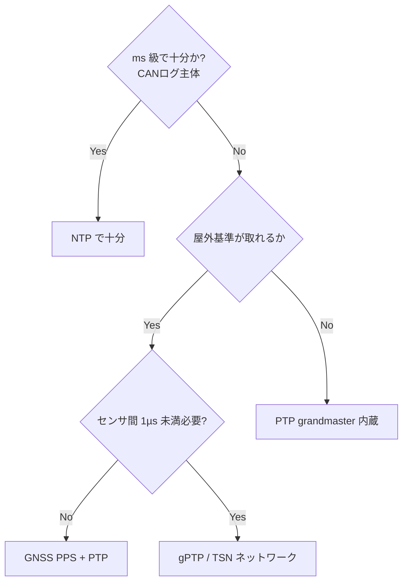

# 3.3 センサー間の時刻同期とタイムスタンプ整合

この節では、クラウド側での時刻同期 (time synchronization) 情報の扱いとタイムスタンプ整合を扱います。Clock drift（センサごとのクロックがじわじわ基準とずれていく現象）の補正モデル、PTP / gPTP 導入の判断基準、温度・電源依存の補正、そして同期品質をメタデータ化して学習・評価に活かす方法を、Closed-Loop の観点から整理します。

## なぜ数十 ms のずれが致命的になるのか

時速 72 km（20 m/s）で走行中、カメラと LiDAR の同期が 30 ms ずれると、空間的には `20 × 0.03 = 0.6 m` の位置ずれになります（外部キャリブレーションと各センサ固有遅延が既知・補正済みの前提で、純粋な時刻同期ずれのみを取り出した最悪ケースです。実運用ではカメラ露光時間・Radar フィルタレイテンシ・DSP 前処理遅延も追加で重なります）。

これは BEV 表現（Bird's Eye View、車両を上から見下ろした俯瞰表現）でのセンサフュージョンや 3D 検出の精度を直接劣化させ、ラベルとモデル出力の不整合として誤って計上されます。**時刻同期は「見えにくいが性能を律速する」前処理**であり、Closed-Loop で性能改善を測る前提条件です。

## オンボード同期と PTP/gPTP の導入判断

オンボードでの時刻配信方式は、要求精度と投資額のトレードオフで選びます。

| 方式 | 典型精度 | 配線/HW 要件 | コスト | 適性 |
|---|---|---|---|---|
| NTP | 1〜10 ms | 既存 Ethernet | 低 | 低レート CAN ログ程度 |
| GPS/GNSS PPS | 1 µs 級 | PPS 配線、GNSS 受信 | 中 | 屋外基準クロック |
| IEEE 1588 PTP | 100 ns〜1 µs | PTP 対応 NIC/スイッチ | 中〜高 | センサフュージョン |
| IEEE 802.1AS gPTP | 数十〜数百 ns | TSN 対応スイッチ | 高 | カメラ-LiDAR 厳密同期 |

導入判断は単純なツリーで整理できます。

> この図のポイント：精度要件が厳しくなるほど右下（gPTP/TSN）へ進み、HW 投資が増える。要件と投資額を対応させる。

gPTP（generalized Precision Time Protocol、IEEE 802.1AS で規定された車載 TSN 向けの厳密時刻同期プロトコル）は IEEE 802.1AS で規定され、第2章で触れた車載 TSN（Time-Sensitive Networking、時間決定性を持つ Ethernet 拡張）の基盤です。

なお IEEE 1588（PTP 一般、ファクトリーオートメーションや基地局など汎用用途）と IEEE 802.1AS（gPTP、車載 TSN 向けに簡略化したプロファイル）はプロトコルとして親子関係にあります。車載では gPTP（802.1AS）を採用するのが標準です。カメラ-LiDAR を ns 級で揃える必要がある知覚スタックでは gPTP が事実上の前提になります。これらの規格は巻末参考文献 [O9](references#o9) に対応します。既存ロガーが NTP しか対応していない場合は、INS（慣性計測装置）の高精度クロックを基準に Drive 単位でオフライン補正する方針も現実解として残ります。

## Clock drift の補正モデル

完全な同期を行っても、ログには微小な Clock drift（クロック周波数のずれによる累積誤差）が残ります。クラウド側では Drive 単位で基準クロック（多くは INS、Inertial Navigation System / 慣性航法装置）を定め、各センサのタイムスタンプとの差分 `Δ(t)` を推定して補正します。モデルの選択肢を比較します。

| モデル | 形式 | 表現できるドリフト | 計算コスト | 適性 |
|---|---|---|---|---|
| 線形 | `Δ(t)=a·t+b` | 一定の周波数オフセット | 最小 | 短時間 Drive、安定環境 |
| 分割線形 | 区間ごとに `a_i·t+b_i` | 区分的に変化するドリフト | 低 | 温度変化のある長時間 Drive |
| Kalman フィルタ | 状態 `[offset, skew]` を逐次推定（線形ガウス系の状態推定アルゴリズム） | 連続的・確率的変動 | 中 | オンライン補正、ノイズ多 |
| Cubic spline | 区分3次多項式で滑らかに内挿（補間カーブの一種） | 非線形で滑らかな変動 | 中 | オフライン高精度再構成 |

線形モデルは実装が最小で多くのケースで十分ですが、長時間走行で温度が変化すると残差が増えます。その場合は分割線形か Cubic spline に切り替えます。オンラインで補正したい場合は Kalman フィルタが適します。

ドリフト補正関数は次の手順で構築します。

- **入力**：基準クロック（INS など）と対象センサのタイムスタンプ対応点列 `(anchor_t, anchor_delta)`。`anchor_delta` は基準クロックに対するセンサクロックの差分（秒）です。
- **出力**：任意の時刻 `t` を渡すとそのときの差分 `Δ(t)` を返す関数。実運用ではセンサタイムスタンプから `Δ(t)` を引くことで基準クロック側へ補正します。
- **モデル選択**：線形モデルは最小二乗で `Δ(t)=a·t+b` を 1 次フィッティングして得ます。Cubic spline は対応点列をノットとして区分3次多項式で内挿します。長時間 Drive で温度変動がある場合は、温度が安定している区間ごとに分割線形でフィットするか、Cubic spline に切り替えます。
- **適用**：補正関数を Drive 単位で 1 度フィットし、対象センサの全フレームのタイムスタンプに一括適用します。

LiDAR では 1 スキャン中（約 100 ms）にも回転で時刻が進むため、フレームレベルではなくスキャンライン（サブフレーム）レベルでの補正が必要になる場合があります。

**モデル選択の具体的な指針**：

- 30 分以下の短時間 Drive、温度安定 → 線形モデル。1 関数で十分。
- 1〜数時間 Drive、温度変動あり → 区間ごとの分割線形か Cubic spline。
- ストリーミング監視・オンライン補正用途 → Kalman フィルタ（前述の `[offset, skew]` 状態モデル）。
- LiDAR の回転スキャン補正が必要 → スキャンラインごとに線形補正を適用、Drive 単位の補正と二重で噛ませる。

## 温度・電源依存の補正

水晶発振器の周波数は温度に依存し、典型的な TCXO（Temperature Compensated Crystal Oscillator、温度補償型水晶発振器）でも数 ppm/℃（parts per million、100 万分のいくつ）の偏差が残ります。1 ppm は 1 時間で 3.6 ms の累積誤差に相当するため、長時間 Drive では無視できません。温度ログがある場合は、ドリフト係数を温度の関数として補正できます。

具体的には、基準温度 25 ℃ におけるドリフト係数を `base_a`、温度依存係数を `k_ppm_per_c`（ppm/℃）として、実温度 `temp_c` における実効ドリフト係数を `base_a + k_ppm_per_c × 1e-6 × (temp_c − 25)` で算出します。これに経過時間 `t` を掛けたものを温度補正後のオフセットとして用います。`base_a` と `k_ppm_per_c` は試験場で温度を変えながらドリフトを測定し、線形回帰で同定します。

センサ固有遅延（カメラの露光時間、Radar のフィルタレイテンシ）は、試験場で既知ターゲットを用いて測定するか、実走行ログ内の同一イベント（信号点灯、急ブレーキ開始）へのセンサ応答時刻差から統計推定します。推定した遅延は「どの温度・電源条件で測定したか」とともにキャリブレーションパラメータとして管理します。

## 同期品質メタデータと Closed-Loop 活用

補正モデル自体にも残差があるため、「どれだけの同期誤差が残っているか」を品質指標として Drive / Scene / Frame 単位で保存します。同期品質メタデータとしては次のフィールドを持たせます。

- **`sync_method`**：採用した同期方式（`ntp` / `pps` / `ptp` / `gptp` のいずれか）。
- **`drift_model`**：適用した補正モデル（`linear` / `piecewise_linear` / `kalman` / `cubic_spline`）。
- **`residual_ms`**：センサペア単位で残差の平均と 95 パーセンタイルを保持します。例として `cam_lidar` ペアの平均と p95 を ms 単位で記録します。
- **`temp_compensated`**：温度補正を適用したかのブーリアン。
- **`sync_quality`**：上記残差から判定した総合ラベル（`good` / `fair` / `poor`）。閾値は ODD と用途で調整しますが、フュージョン用途では p95 残差 5 ms 以下を `good`、5〜20 ms を `fair`、それ以上を `poor` とするのが目安です。

これにより「同期誤差の大きいログを学習から除外・重み付けする」「PTP 導入前後で LiDAR-Camera フュージョンの誤差がどれだけ改善したかをデータレベルで検証する」といった Closed-Loop の運用が可能になります。同期品質はフュージョン系タスクの評価分解（同期 good / fair / poor 別の mAP（mean Average Precision、物体検出系の標準指標）比較）にも使えるため、PTP / gPTP を新車両世代に投入する際は、旧世代との並走期間を設けて改善幅を定量検証する運用が定着します。

## 本節の振り返り

時刻同期は地味な前処理に見えますが、20 m/s 走行で 30 ms ずれれば 0.6 m の空間誤差として知覚モデルの性能評価に混入します。これが恐ろしいのは、誤差が「センサノイズ」「アノテーションミス」「モデル性能不足」のいずれにも見える点です。Closed-Loop でモデル性能を測るとき、同期残差を切り分けないと「学習を回しても改善しない」現象の原因がモデルなのか同期なのかが永遠にわかりません。実務で陥る典型的な失敗は、PTP/gPTP を入れたから安心と考え、ドリフト残差を Drive メタデータに記録しないケースです。残差 p95 を `frames` テーブルに毎 Drive 書き込むことで、初めて「同期 good / poor で mAP 差 1 ポイント」のような層別評価が可能になります。データ中心 AI の主張は「データの品質を測れて初めて改善できる」ですが、時刻同期はその最も見えない部分にある品質指標です。データエンジニアと ML 開発者は、同期方式の選定と残差のメタデータ化を一体で設計しなければなりません。

## 次節への橋渡し

時刻が整合したデータは、次に共通フォーマットへ正規化されます。次の 3.4 節では、**データ正規化とフォーマット設計**を扱い、MCAP / rosbag2 / WebDataset / Parquet の選定マトリクス、WebDataset シャード計算式、zstd レベル別圧縮率、Draco 点群圧縮、Parquet メタデータ DDL を具体化します。
