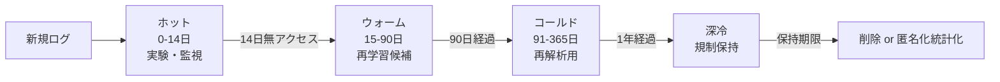

# 3.5 ストレージ階層設計（ホット／ウォーム／コールド）

この節では、PB 級の自動運転ログを格納するストレージ階層設計を、クラスごとの料金・SLA と定量的なコスト試算に踏み込んで扱います。ホット／ウォーム／コールドの階層構成、ライフサイクルポリシーの自動化、1 PB の年間コスト比較、保持・削除ポリシーを整理します。

Closed-Loop の観点では、必要なデータに必要なレイテンシでアクセスできることと、長期保管コストを抑えることを両立させるのが目的です。

## ストレージクラスの比較

主要クラウドのオブジェクトストレージは、アクセス頻度に応じた複数クラスを提供します。料金は地域・時期で変動するため、ここでの数値は 2024 年後半の北米標準リージョンの概算で、`[新規, AWS / GCP / Azure 公式料金]` として記録します。実装前に最新の公式料金で再計算してください。

| 層 | AWS S3 | GCS | Azure Blob | 概算保管料 | 取り出し特性 |
|---|---|---|---|---|---|
| ホット | Standard | Standard | Hot | 約 $23/TB/月 | 即時、取り出し無料 |
| 自動最適化 | Intelligent-Tiering | Autoclass | — | アクセスで自動降格 | アクセスパターン不明時に有効 |
| ウォーム | Standard-IA | Nearline | Cool | 約 $12.5/TB/月 | 即時、取り出し従量 |
| コールド | Glacier Flexible | Coldline | Cold | 約 $3.6/TB/月 | 分〜時間、取り出し料 |
| 深冷 | Glacier Deep Archive | Archive | Archive | 約 $0.99/TB/月 | 12 時間級、取り出し料高 |

SLA（可用性）はホット系で 99.9%、アーカイブ系で 99.0% 前後が一般的です。コールド/深冷は保管料が安い反面、取り出し料と取り出し遅延が大きいため、「再解析の頻度」で適否が決まります。

**階層別の保持期間ガイドライン（自動運転で典型）**：

- ホット（Standard / Hot）：直近 0〜14 日。実験・監視・アクティブ学習の対象。
- 自動最適化（Intelligent-Tiering / Autoclass）：アクセスパターンが読めない期間、特に 14〜60 日。
- ウォーム（Standard-IA / Nearline / Cool）：15〜90 日。再学習や四半期評価に使う候補。
- コールド（Glacier / Coldline）：91〜365 日。再解析の可能性が低いが捨てられないデータ。
- 深冷（Deep Archive / Archive）：1 年超。法規制やインシデント保全のためだけに残す。

## ホット→ウォーム→コールドの遷移ルール

データの価値は時間とともに減衰します。アクセス確率に応じて層を遷移させます。

> この図のポイント：価値減衰に合わせて段階的に安い層へ移し、保持期限で削除する。遷移は日数ベースで自動化できる。

ライフサイクルは宣言的に定義して自動執行します。たとえば AWS S3 では、対象バケット（例：`av-fleet-logs`）に対して次のような階層遷移ルールを設定します。

- 適用範囲はオブジェクトキー接頭辞 `drives/` 配下とし、ルール ID を `tiering-default` などに固定します。
- 経過 14 日で `STANDARD_IA`（ウォーム）、90 日で `GLACIER`（コールド）、365 日で `DEEP_ARCHIVE`（深冷）へ自動遷移させます。
- 経過 1,825 日（5 年）で失効（削除）させます。
- 規制保持要件があるオブジェクトは、別ルールまたは Object Lock を併用して保護します。

GCS は Lifecycle Management、Azure は Blob Lifecycle Policy で同等の宣言的ポリシーを定義できます。インシデント周辺ログのように「将来も高頻度アクセスする」データは、オブジェクトタグ（例：`retention=incident`）でこのルールから除外し、ホット層に固定します。ライフサイクルポリシーは Terraform / CDK で IaC 管理し、変更履歴を Git で追えるようにしておくことで、誤った遷移ルールが本番に入っても切り戻しが容易になります。

## 1 PB の年間コスト試算

1 PB（1,000 TB）を 1 年保管する場合の保管料を、3 戦略で比較します（取り出し料・リクエスト料は除く保管料のみの概算）。

| 戦略 | 内訳 | 年間保管料（概算） |
|---|---|---|
| 全期間ホット | Standard $23/TB/月 × 12 | 約 $276,000 |
| 多階層 | ホット14日→IA→Glacier→深冷へ段階移行 | 約 $35,000〜45,000 |
| 即アーカイブ | Deep Archive $0.99/TB/月 × 12 | 約 $11,900 |

多階層化だけで全期間ホットの **6〜8 分の 1** に削減できます。即アーカイブはさらに安いものの取り出し遅延が 12 時間級になるため、学習・評価で日常的にアクセスするデータには不向きです。実務では「直近を多階層、規制保持分のみ深冷」のハイブリッドが最もコスト対効果に優れます。1.4 節で触れた「1 PB を Standard 14 日 → Intelligent 60 日 → Glacier 残り、で月 $4k 程度」もこの多階層戦略の一例です。試算の精度を上げるには、過去 6 ヶ月のアクセスログから「14 日以降に再アクセスされたオブジェクトの割合」を測り、5% 未満なら多階層遷移が安全と判断できます。なお、取り出し料・リクエスト料はストレージ料の 5〜30% を占めることがあるため、月次のコストレポートで保管料と別行に出して監視する運用が安全です。

## 保持・削除ポリシー

惰性で残るデータはコストとガバナンスリスクの両方を増やします。データ種別ごとに保持期限を明示します。

| データ種別 | 保持方針 | 根拠 |
|---|---|---|
| インシデント/事故ログ | 数年（法的要求に従う） | 安全分析・法規制 |
| 学習用一般走行ログ | 1〜3 年で再評価、価値低下分は削除 | コスト最適化 |
| テストキャンペーン一時データ | キャンペーン終了後に自動削除 | 不要データ排除 |
| 研究用生センサログ | 一定期間後に匿名化統計のみ保持、元データ削除 | プライバシー |

「どの層・どの期間のデータが、どの目的で保持されているか」をメタデータで明示し、保持期限を過ぎたデータは自動で削除または匿名化統計化します。これは 3.8 節の GDPR [L14](references#l14) 削除権対応とも連動します。

## リージョン跨りと規制制約

階層設計はリージョン配置と不可分です。GDPR [L14](references#l14)、改正個人情報保護法 [L13](references#l13)、PIPL [L12](references#l12) は個人データの保存地・越境を制約します。特に PIPL [L12](references#l12) は中国国内データの国外移転を厳しく制限するため、コールド/深冷アーカイブであっても国外リージョンへ移せない場合があります。

設計原則は「ライフサイクルの全段階を収集リージョン内で完結させ、越境が必要な場合は匿名化済み派生データのみ」とすることです。クロスリージョンレプリケーション（CRR、リージョン間で自動コピーする機能）を安易に有効化すると規制違反になり得るため、バケットポリシーでリージョンを固定します。本書は法的アドバイスを提供するものではなく、保持期間・越境可否は各地域の最新規制と法務確認に従ってください。

## 本節の振り返り

ストレージ階層は「データの価値は時間とともに減衰する」という観察を、料金構造に正面から対応させた設計です。1 PB を全期間ホットで持てば年 $276,000、多階層化すれば $35,000〜45,000、即アーカイブなら $11,900 という 6〜23 倍の差は、コスト試算ではなく**設計判断の質を直接表す数字**です。実務で陥る失敗は二方向あります。一方は全部ホットに置き続けて月次コストが線形に膨張するケース、他方は安さに釣られて深冷に落とし、再解析時に取り出し料と 12 時間の遅延に苦しむケースです。どちらも「いつ、どれくらいの確率でアクセスされるか」をデータ種別ごとに見立てなかった結果です。Closed-Loop の観点では、ホット層が「短期の実験・監視」、ウォーム層が「四半期評価」、コールド層が「インシデント再解析の保険」を担う役割分担として設計します。SRE とデータエンジニアは、ライフサイクルポリシーを必ず IaC で管理し、インシデントログには `retention=incident` タグで降格除外を明示することで、「安く保管する」と「いざという時に取り出せる」を両立させなければなりません。リージョン固定はコスト判断ではなく規制制約として扱う発想（次の 3.8 節で深堀り）が、グローバルフリートでは生命線です。

## 次節への橋渡し

階層化されたストレージの上に、検索・分析可能な構造を与えるのがデータレイクとデータベースです。次の 3.6 節では、**データレイク／データベース設計**を扱い、Drive/Scene/Frame の Iceberg DDL、Iceberg/Delta/Hudi の比較、TimescaleDB/InfluxDB/ClickHouse/Druid の時系列 DB 比較、スキーマ進化を具体化します。
