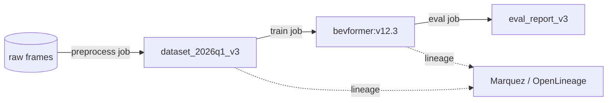

# 3.7 メタデータ管理とカタログ

この節では、メタデータ管理とデータカタログ (data catalog、データの所在・スキーマ・所有者などを一元管理する仕組み) を、ツール比較とリネージ標準・Vector DB に踏み込んで扱います。属性タクソノミ（用語体系）の形式化、データカタログツールの選定、OpenLineage / Marquez によるデータリネージ (data lineage、データの上流・下流の依存関係を追跡する仕組み)、Vector DB によるシーン類似検索、自動タグ付けの精度評価を整理します。

Closed-Loop の観点では、カタログが「データエンジンの入り口」として、探索・抽出・追跡をどう支えるかを理解することが目的です。

## カタログツールの比較

「どこに何があり、誰が触れるか」を一元管理するカタログを比較します。

| ツール | 出自 | 強み | リネージ | 備考 |
|---|---|---|---|---|
| DataHub [ST10](references#st10) | LinkedIn | 強力なリネージ、自動メタデータ抽出、拡張性 | ◎ | OSS、大規模実績 |
| OpenMetadata | OSS | 現代的 UI、データ品質統合 | ○ | 急成長 |
| Apache Atlas | Hadoop 系 | Hadoop エコシステム実績 | ○ | レガシー親和 |
| Amundsen | Lyft | 検索体験に特化 | △ | 軽量 |
| Unity Catalog | Databricks | Databricks 統合、ガバナンス一体 | ○ | Databricks 環境 |

DataHub [ST10](references#st10) はリネージと自動抽出に強く、自動運転の多様なストア（Iceberg・時系列 DB・Vector DB）を横断管理する用途に向きます。ただし DataHub 自体は metadata repository（メタデータの保管・検索・可視化を担う基盤）であり、リネージの捕捉は upstream のジョブ側（Spark の lineage plugin、Airflow / Argo の OpenLineage emitter など）の責務です。

リネージ標準として OpenLineage [ST9](references#st9) を併用すると、Spark / Airflow / 自前 Python 学習スクリプトのいずれからもツール非依存で `Run → Dataset → Job`（実行 → データセット → ジョブ）の依存を emit でき、DataHub 側で集約・可視化できます。

**規模別の指針**：

- 〜数十テーブル → スプレッドシート + Iceberg のテーブルプロパティで運用可。カタログ導入は後回し。
- 数百〜数千テーブル、複数チーム → DataHub または OpenMetadata を導入。OpenLineage emitter を Airflow / Spark に標準で組み込む。
- Databricks ベースで全社統一する場合 → Unity Catalog で一気に統合する選択肢もある。

## 属性タクソノミの形式化（SKOS 準拠）

現場が口にする分類軸（「都市高速のランプ合流」「郊外の信号なし交差点」「雪道の片側一車線」）をそのままタグにできるよう、タクソノミ (taxonomy、概念を体系的に分類した語彙集) を構造化します。多値か単値か、上位下位関係を明示するため、SKOS（Simple Knowledge Organization System、W3C 標準の知識体系記述スキーマ）に準じた YAML で管理すると、語彙の揺れを抑えられます。

各概念には次の項目を持たせます。

- **`concept`**：機械可読な英語スラッグ（例：`merge`、`pedestrian_crossing`）。
- **`prefLabel`**：日本語と英語の表示名を辞書として持たせる（`ja` / `en`）。
- **`broader`**：上位概念へのリンク（例：`merge` の上位は `junction`、`pedestrian_crossing` の上位は `vulnerable_road_user`）。
- **`related`**：関連する横並びの概念（例：`pedestrian_crossing` から `right_turn`、`occlusion` への参照）。
- **`altLabel`**：現場の言い換え表現（例：「ランプ合流」「本線合流」）を配列で記録し、検索時の同義語展開に使います。
- **`multivalued`**：1 シーンに複数タグを付与できるかのブーリアン。

`broader` / `related` で階層と関連を表現すると、「VRU（Vulnerable Road User、歩行者・自転車などの交通弱者）系シナリオすべて」のような上位概念クエリが可能になります。後続のシーン検索と評価レポート作成がスムーズになります。タクソノミ YAML は単独 Git リポジトリで管理して PR ベースで履歴化し、安全エンジニア・ラベリングチーム・データサイエンティストの 3 者で月次レビューを設けると、新概念の追加と統廃合を合議で進められます。Iceberg の `scenes` テーブルにタグを書き込む際は、`concept` のスラッグ値のみを格納し、表示名はクエリ時にタクソノミと JOIN するのが基本です。

## データリネージ（OpenLineage / Marquez）

リネージは「どのデータがどのモデル・評価結果に使われたか」を追跡する情報で、安全クリティカルな自動運転では必須です。OpenLineage [ST9](references#st9) はジョブ・データセット・実行を記述する標準仕様で、Marquez（OpenLineage を受け取る OSS のメタデータサーバ）はそのリファレンス実装です。

> この図のポイント：raw → dataset → model → report の依存をリネージとして記録し、障害時に逆順で原因を辿れる。

OpenLineage への emit 内容としては、ジョブ完了時に次の情報を Marquez（あるいは互換のメタデータリポジトリ）へ送ります。

- **`eventType`**：`START` / `COMPLETE` / `FAIL` のいずれか。
- **`job`**：ジョブの所属する `namespace`（例：`av-train`）と `name`（例：`train_bevformer`）。
- **`inputs`**：入力データセットの一覧（`namespace`：`lake`、`name`：`dataset_2026q1_v3` のように `データセット ID + バージョン` を含める）。
- **`outputs`**：出力アーティファクトの一覧（`namespace`：`registry`、`name`：`bevformer:v12.3` のようにモデルのレジストリ ID とバージョン）。

Spark / Airflow / 自前 Python 学習スクリプトいずれの場合も、対応する OpenLineage emitter ライブラリを噛ませることで、こうしたイベントを共通スキーマで送出できます。

これにより、インシデント発生時に「搭載モデル → 学習データセット → 含まれる Drive / Scene」へ逆向きに辿り、再ラベリング・再学習・ロールバックの判断ができます。各モデルアーティファクトに学習データセットバージョン ID を必ず付与し、評価結果にもモデル ID・データセット ID・スキーマバージョンを紐付けます。学習・評価・推論のジョブテンプレートに OpenLineage emitter を組み込んで「コード変更なしで全ジョブが emit する状態」にしておき、四半期に 1 回は模擬インシデントから影響モデル特定までの逆引き訓練を実施しておくと、本番インシデントでの初動が速くなります。

## Vector DB によるシーン類似検索

「このヒヤリハットに似たシーンを集める」には、画像／シーン埋め込み (embedding、画像やシーンを 数百〜数千次元の固定長ベクトルへ写像した表現) の近傍検索 (nearest neighbor search、ベクトル空間で距離が近いものを探す処理) が有効です。Vector DB を比較します [ST14](references#st14)。

| Vector DB | 形態 | 強み | 適性 |
|---|---|---|---|
| Milvus | 専用分散 | 億〜十億ベクトル、GPU 索引 | 大規模シーン検索 |
| Weaviate | 専用 | ハイブリッド検索、モジュール | 意味+属性の複合検索 |
| pgvector | PostgreSQL 拡張 | 既存 RDB に統合、運用容易 | 中規模、メタデータ JOIN |

シーン類似検索は次の手順で実装します。

1. **埋め込み生成**：CLIP / DINOv2 / SigLIP などの画像エンコーダで、シーン代表フレームを 768 次元程度のベクトルへ変換します（次元数はモデル依存）。
2. **インデックス構築**：Vector DB（例：Milvus）にコレクションを作成し、HNSW（Hierarchical Navigable Small World、近似最近傍探索の代表的なグラフ索引）などの近似最近傍索引を `embedding` フィールドに張ります。距離尺度は意味類似なら COSINE、L2 距離なら EUCLIDEAN を選びます。
3. **検索クエリ**：クエリベクトルとトップ K（例：50）、`ef`（HNSW で探索の幅を決めるパラメータ、大きいほど精度高・遅延大）などの探索パラメータ（HNSW なら 128 程度）を指定して `search` を呼び出します。返り値として `scene_id` と `odd_segment` を取得し、距離（または類似度）でランキングします。億規模を超えるなら IVF-PQ（Inverted File + Product Quantization、ベクトルを直積量子化で圧縮し転置索引で粗く絞り込む方式）への切替も検討します。
4. **結果の活用**：取得したシーン ID 群を 3.6 節の Iceberg テーブルと JOIN し、メタデータ条件（ODD・天候・時刻）でさらに絞り込みます。

検索結果は新たな学習・評価データセットとして収集でき、3.9 節のビューアからワンクリックで「類似シーン検索」へ飛ぶ Closed-Loop を構成します。詳細は第4章のシーン検索と接続します。

**規模別の指針（Vector DB 選定）**：

- 〜数千万シーン → pgvector で十分。既存 PostgreSQL に乗せる方が運用が楽。
- 億〜十億シーン規模 → Milvus / Weaviate を専用クラスタとして構える。GPU 索引で検索遅延を 100 ms 級に保つ。
- 意味検索 + メタデータフィルタを多用する → Weaviate のハイブリッド検索を選択。

## 自動タグ付けと精度メトリクス

フリート規模では人手の全件タグ付けは不可能で、モデルやルールで天候・時間帯・シナリオを自動推定します。自動タグの信頼性は精度メトリクスで監視します。

| 指標 | 定義 | 目的 |
|---|---|---|
| Precision/Recall/F1 | タグ正解集合との一致 | タグ品質の基本評価 |
| カバレッジ | タグ付与済み割合 | 未タグ領域の把握 |
| リスク重み付きスコア | シナリオ頻度 × モデル失敗率 | 優先度付け |

単なる総量集計に加え、「ODD セグメント別の走行時間に対するインシデント率」「シナリオ頻度 × 失敗率のリスクスコア」を導入すると、「頻度は低いがリスクが高いシナリオ」を定量特定できます。データ収集・ラベリング・シミュレーションの優先度に反映できます。自動タグの誤りは検品 UI（3.2 節）からワンクリックで修正できるようにし、修正履歴をモデル再学習データに還流させると、Closed-Loop の中でタグ品質も自然に底上げされていきます。

## 本節の振り返り

メタデータとカタログは「組織の共通資産」として整備されたときに初めて Closed-Loop の入り口として機能します。データレイクにデータがあっても、所在・スキーマ・所有者・上流下流の関係が見えなければ、各チームが個別にコピーを作り、結局「同じデータの似て非なる派生」が組織のあちこちに溜まります。カタログとリネージはこの分断を防ぐ装置で、特に OpenLineage で `raw → dataset → model → report` を全ジョブが emit する状態にしておくと、安全インシデント発生時に「事故車両に搭載されたモデル → 学習データセット → 含まれる Drive / Scene」を 30 分で逆引きできます。実務で陥る失敗は、カタログツールを導入したが emitter を学習スクリプトに組み込まず、リネージが手書き運用で形骸化するケース、もう一つはタクソノミを Excel で管理して `altLabel` の同義語展開ができず「ランプ合流」「本線合流」「合流ランプ」が別概念扱いになるケースです。SKOS 準拠 YAML で `broader` / `related` / `altLabel` を構造化することで、現場の語彙を機械可読な体系に変換できます。データ中心 AI では「どのデータで学習し、どのモデルが何を出したか」の追跡可能性こそがモデル品質の前提であり、ML 開発者と安全エンジニアはこのリネージを設計レビューの必須添付項目として扱う必要があります。

## 次節への橋渡し

カタログで「誰が触れるか」を管理する基盤ができたら、次はその権限を強制し、監査し、規制に対応する仕組みが必要です。次の 3.8 節では、**ガバナンスとアクセス制御**を扱い、IAM ポリシー、KMS による暗号化、PII 検出・マスキング、GDPR 削除権の技術実装を具体化します。
