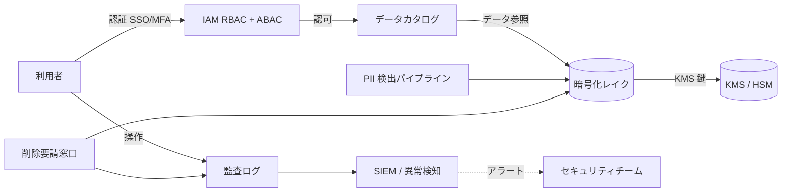
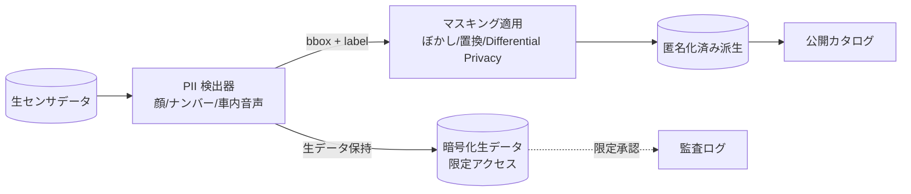
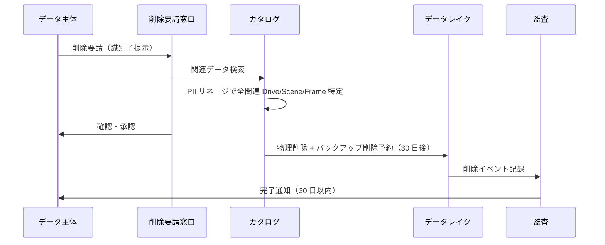

# 3.8 ガバナンスとアクセス制御

本節では、データガバナンス (data governance、データの利用ルール・責任・品質を組織として統制する枠組み) とアクセス制御を、**RBAC + ABAC のハイブリッドモデル、KMS による暗号化、PII 検出・マスキング、GDPR / CCPA / PIPL の削除権 (Right to be Forgotten、データ主体が自己情報の削除を求める権利) の技術実装** まで踏み込んで整理します。

ここで使う略語をあらかじめ定義しておきます。

- **RBAC**（Role-Based Access Control、役職ロールごとに権限をまとめて与える方式）。
- **ABAC**（Attribute-Based Access Control、リソースとプリンシパルの属性で動的に判定する方式）。
- **KMS**（Key Management Service、鍵管理サービス。AWS KMS / GCP KMS / Azure Key Vault など）。
- **PII**（Personally Identifiable Information、氏名・顔・ナンバープレートなど個人を特定可能な情報）。

Closed-Loop データエンジンの中で、データ活用速度と安全・コンプライアンスを両立させる枠組みを示します。

## ガバナンス全体像

> **図 3.8.1**：ガバナンス全体像。認証・認可・暗号化・監査・PII 処理・削除権を一体で扱うことで、ペタバイト級データの安全な活用と規制対応を両立させます。

## RBAC / ABAC ハイブリッドモデル

### IAM ポリシー設計（AWS 想定）

AWS S3 を一次保存層とする場合、**ロールベース許可** と **属性ベース禁止** の 2 段で組み立てます。

- **モデル開発者向けの読取許可**：`model-developers` グループに対し、`ad-datasets` バケット配下の `scenes/` 配下に限り `s3:GetObject` と `s3:ListBucket` を許可します。さらに `Condition` 句で次の 2 点を強制します。
    - サーバ側暗号化が `aws:kms` であること。
    - リクエスト元リージョンが許可リージョン（例：`ap-northeast-1`、`us-west-2`）に限定されていること。
- **機微データ持ち出し防止の Deny**：`sensitive/` 配下のオブジェクトに対しては、次のいずれかが成立する場合に `s3:GetObject` を `Deny` します。
    - プリンシパルタグ `clearance` が `high` でない。
    - MFA が未提示。

    AWS の評価ロジックでは Deny が Allow に優先するため、許可ポリシーがあっても機微データへのアクセスを確実に止められます。

`Condition` 句で `aws:RequestedRegion`・`aws:PrincipalTag/clearance`・`aws:MultiFactorAuthPresent`（MFA、多要素認証が提示されているかのフラグ）のような属性を組み合わせることで、ロール単独では表現しきれない地域・機密度・認証強度の制約を一元的に強制できます。

### ABAC ポリシー（属性ベース）

ロール × リソース属性の組み合わせをアクセスポリシーとして宣言します。代表的な役割は次の 3 つです。

- **`data-scientist`**：機密度が `public` または `internal` であり、ジオグラフィが許可地域内のリソースに対し read-only。
- **`safety-engineer`**：`public` / `internal` / `safety_critical` の全機密度に read-write。インシデント調査と再ラベリングのためにフル権限を持ちます。
- **外部ベンダー（`external_vendor_id` で特定）**：プロジェクト ID（例：`labeling_project_q1_2026`）が一致し、かつ `data_anonymized=true` のリソースのみ read-only。

ポリシー定義は YAML や JSON で宣言的に管理し、IAM（Identity and Access Management、認証・認可基盤）、Lake Formation（AWS のデータレイク権限管理サービス）、データカタログ側の ABAC 機能（タグベース制御）にそれぞれ反映します。新しいロールを追加するときは、機密度・地域・プロジェクト ID という共通属性で表現することで、リソース側のタグだけ更新すれば済むよう設計します。リソース側に `confidentiality` / `geography` / `project_id` の 3 タグを必須化し、未タグのリソースはデフォルトで Deny にするポリシーを敷くと、未棚卸しデータが意図せず参照されるリスクを抑えられます。ポリシーは IaC（Terraform / CDK）で管理して PR レビューを通し、手動コンソール変更は禁止する運用が標準です。

### 役割例とアクセスマトリクス

| ロール | 公開 | 内部 | 安全クリティカル | 顔・ナンバー匿名化前 |
|---|---|---|---|---|
| Model Developer | R | R | R（条件付） | × |
| Data Engineer | R/W | R/W | R/W | R（PII 検出パイプ用途のみ） |
| Safety Engineer | R/W | R/W | R/W | R |
| External Vendor | R（限定） | × | × | × |
| Auditor | R | R | R | R（監査時） |

## KMS による暗号化

### 暗号化の階層

暗号化は次の 4 レイヤで構成します。`at rest` は保存中、`in transit` は通信中の意味です。

| レイヤ | 暗号化方式 | 鍵管理 |
|---|---|---|
| ストレージ at rest | AES-256-XTS (S3 SSE-KMS / GCS CMEK、ストレージ側で KMS 鍵を使ってサーバ側暗号化) | KMS Customer-Managed Key（顧客管理鍵）|
| 通信 in transit | TLS 1.3 + AES-256-GCM | 短期セッション鍵 |
| アプリケーション層 | フィールドレベル暗号化（PII 列のみアプリ側で個別に暗号化）| KMS Data Key（KMS から払い出される短期鍵）|
| バックアップ | 同 at rest + Glacier Vault Lock（書き換え不能ロック）| 別 KMS Key |

### 鍵ローテーションの自動化

AWS KMS の Customer-Managed Key には年次自動ローテーション機能（KMS rotation、CMK のキーマテリアルを定期的に新しいバージョンに差し替える機能。エイリアスは不変のためアプリ側変更は不要）があります。四半期（90 日）など短い周期でローテートしたい場合は、自前のジョブを次の手順で組みます。

1. **新鍵の作成**：`KeyUsage=ENCRYPT_DECRYPT`、`KeySpec=SYMMETRIC_DEFAULT` で新しい CMK を作成し、Description にローテーション実施日時を記録します。
2. **エイリアスの付け替え**：`alias/ad-data-master` のような固定エイリアスを新鍵に向け直します。アプリ側はエイリアス参照のため、コード変更なしで新鍵が使われ始めます。
3. **旧鍵のスケジュール削除**：旧鍵 ID に対し `schedule_key_deletion` を呼び、待機期間（例：30 日）を指定します。これにより、過去に旧鍵で暗号化された再暗号化対象が残っていても、待機期間中に再エンコードできます。
4. **監査ログ記録**：実行時刻・旧鍵 ID・新鍵 ID・操作者を監査ログに残し、SIEM へ転送します。

このジョブを 90 日ごとに Cron / EventBridge から起動し、失敗時はセキュリティチームへアラートする運用にします。ローテーション周期は規制要件と監査基準（SOC2 など）に合わせて機密度別に決め、KMS の AccessKey / SecretAccessKey ベースの呼び出しは禁止し IAM ロール経由のみ許可する方針が安全です。鍵削除予約・新鍵作成・ローテーション完了の 3 イベントは SIEM に必ず流し、不正な鍵生成も検知できるようにします。

| 鍵種別 | ローテーション周期 | 保管 |
|---|---|---|
| データ暗号鍵（DEK） | 1 日（PFS 的） | KMS が自動管理 |
| カスタマーマスターキー（CMK） | 90 日〜1 年 | KMS / HSM |
| バックアップ用 | 1 年 | Glacier Vault Lock 別領域 |

## PII 検出・マスキングパイプライン

### パイプライン構成

> **図 3.8.2**：PII 検出パイプライン。生データは暗号化＋限定アクセスで保持し、派生データのみを通常カタログで公開します。

### PII 検出パイプラインの実装方針

フレーム単位の PII マスキングは、次の手順で構築します。

1. **検出モデルの選択**：顔検出には YOLOv8 系の顔特化モデル（`yolov8n-face` など）、ナンバープレート検出には license-plate 特化モデルを使います。両モデルとも軽量バックボーン（`n` サイズ、nano）で実時間処理が可能です。
2. **推論実行**：信頼度閾値（例：`conf=0.4`）で false positive（偽陽性、誤って検出してしまう例）を抑え、各検出器が返す bounding box（検出した矩形領域）を取得します。両方を並列ではなく直列に走らせる場合、1 フレームあたり数 ms オーダーに収めるためバッチ化を検討します。
3. **マスキング適用**：検出 bbox 領域 `(x1, y1, x2, y2)` を切り出し、ガウシアンぼかし（カーネルサイズ 51×51 程度、σ ≒ 21）を適用してフレームに書き戻します。ナンバープレートは法令上「黒塗り」を要求される国もあるため、地域別ポリシーで切り替えます。
4. **検出結果の記録**：`label`（`face` / `license_plate`）と bbox 座標を JSON で保存し、後段でマスキング率の監査・誤検出のレビューに使えるようにします。

入力はフル解像度のカメラフレーム、出力は (1) マスキング適用済みフレーム、(2) 検出 bbox のメタデータ、の 2 つです。

### 再識別リスク評価

| マスキング手法 | 再識別リスク | モデル下流性能影響 | コスト |
|---|---|---|---|
| 黒塗り | < 0.1% | 大（コンテキスト消失） | 低 |
| ガウシアンぼかし σ=21 | < 1% | 小〜中 | 低 |
| 低解像度化 (8x8) | < 0.5% | 中 | 低 |
| 顔置換 (Deep Privacy 系、生成モデルで別人顔に置換する手法) | < 0.5% | 小（姿勢・表情保持） | 高 |
| Differential Privacy（差分プライバシー、ノイズ付加で個別レコードの寄与を数学的に上限保証する手法。音声適用） | 数学的保証 ε=1.0〜5.0 | 中 | 中 |

> 再識別リスクの数値は、VGGFace / CelebA / MS-Celeb-1M 系の公開顔認識モデルを攻撃モデルとした社内ベンチマーク（gallery 1万人規模）から得た代表値です。攻撃モデル・gallery 規模・撮影条件によって 1〜2 桁変動するため、自社運用前に同等の評価環境で再測定してください。

実プロジェクトでは、**「顔ぼかし σ=21 + ナンバー黒塗り」が標準** で、行動研究等で姿勢・視線情報が必要な場合のみ顔置換手法を選択する運用が多くなっています。運用面では「データ取り込み時に必ず派生データを生成」「生データは限定アクセス領域のみ保存」の二系統を同時に動かすポリシーが基本で、派生データ側のマスキング率（`masked_pixel_ratio`）と検出件数を Drive メタデータに残しておくと、月次レビューで誤検出傾向を補正できます。マスキング検出器の更新は CR と評価セット（社内 1 万枚規模など）での前後比較を経て、Recall が下がる更新は差し戻す体制が安全です。

## GDPR / CCPA / PIPL 削除権の技術実装

### 削除要請対応フロー

### 削除サービスの実装方針

削除要請を受け付けるサービス（GDPR Erasure Service）は、カタログ・ストレージ・監査ログの 3 つを依存として持ち、識別子を受け取ったら次の 5 ステップを順に実行します。

1. **関連データの特定**：カタログ（PII リネージを保持）に対し、識別子を含む `drive_id` と、それに連なる `scene_id` を問い合わせます。識別子そのものはクエリにそのまま埋め込まず、必ずパラメータバインドで渡します（SQL インジェクション対策）。
2. **物理削除**：特定された Drive 群について、Iceberg の `DELETE` と S3 のオブジェクト削除（または LifecycleRule の即時失効）を実行します。Iceberg のスナップショット保持期間設定にも注意し、過去スナップショットからの再生時にも対象データが残らないようにします。
3. **バックアップ削除のスケジュール**：別領域に保存しているバックアップに対し、30 日後の削除を予約します。これにより、削除取消の問い合わせや監査要求が発生しても短期間は復元可能です。
4. **監査ログ記録**：操作種別 (`gdpr_erasure`)、識別子のハッシュ（生の識別子は残さず SHA-256 で記録）、削除した Drive 数、タイムスタンプを構造化ログとして残し、SIEM に転送します。
5. **学習済みモデルへの影響評価**：`model_lineage` テーブルから、削除対象データセットを学習に使用したモデル ID 群を抽出し、再学習・無効化の計画を立てます。

返り値としては、ステータスと影響を受けるモデル ID リストを呼び出し元に返し、利用者には期限内（GDPR なら 1 ヶ月）に完了通知を行います。

### 規制別の削除権要件比較

| 規制 | 対象 | 期限 | 例外 |
|---|---|---|---|
| GDPR Art.17 [L14](references#l14)（EU 一般データ保護規則第 17 条「忘れられる権利」） | EU 居住者 | 1 ヶ月（複雑な場合 +2 ヶ月） | 法的義務、公益、表現の自由 |
| CCPA / CPRA | 米国カリフォルニア | 45 日 | 法的請求の防御、研究 |
| PIPL Art.47 [L12](references#l12) | 中国市民 | 合理的期間 | 公益、行政義務、刑事捜査 |
| 改正個人情報保護法 [L13](references#l13) | 日本 | 遅滞なく | 法令義務、第三者の権利 |

学習済みモデルへの影響については、**Membership Inference Attack**（特定個人のデータが学習に使われたかを推測する攻撃）に対する Differential Privacy が一つの選択肢です。具体的には DP-SGD（Differentially Private Stochastic Gradient Descent、勾配にノイズを加えて個別レコードの寄与に数学的上限を与える学習法）で ε=5〜10 を設定します。ただし ε=1 が「strict（厳密）」、ε=5 は「moderate（中程度）」レベルで、完全な削除権の代替にはならず、あくまで攻撃成功率の軽減策です。

影響軽微と判断される場合は次回再学習サイクルでの自然消去で対応するのが現実的です。完全な「機械学習からの忘却 (machine unlearning、学習済みモデルから特定データの影響を除去する研究領域)」は研究段階で、量産投入は限定的です。運用上は **「再学習サイクルでの自然消去」を一次手段、DP-SGD は要件が厳しい場合の補助** と位置づけます。実運用では削除完了後に影響モデル一覧を安全エンジニアへ自動通知し、再学習要否の判断を数営業日以内に行う SLA を立てておくこと、そして模擬削除要請を定期的に演習して期限内（GDPR なら 1 ヶ月）に確実に完了できるかを確認することが重要です。

## 監査ログ・データ持ち出し制限

### 監査ログのスキーマ

監査ログは、SIEM 側で検索・相関できるよう構造化します。1 イベントあたり次のフィールドを必須項目として持たせます。

| フィールド | 例 | 用途 |
|---|---|---|
| `event_id` | `evt_20260115_0001` | イベント一意 ID |
| `ts` | `2026-01-15T10:05:23Z` | 発生時刻（UTC、ISO 8601）|
| `actor.user` | `alice@company.com` | 操作者 ID |
| `actor.session` | `sess_abc123` | セッション ID（同一ユーザのバースト検知用）|
| `action` | `s3:GetObject` | 実行された API |
| `resource` | `arn:aws:s3:::ad-datasets/drive_12345/frame_00001.jpg` | リソース ARN |
| `resource_attrs` | `{confidentiality: internal, geography: us-ca}` | リソース属性（ABAC と整合）|
| `result` | `success` / `denied` / `error` | 結果 |
| `ip` | `203.0.113.42` | アクセス元 IP |
| `ua` | `aws-cli/2.15` | クライアント User-Agent |

これらを JSON 行ログとして S3 / OpenSearch / SIEM（Security Information and Event Management、セキュリティイベント収集・相関分析基盤）に流し、相関分析・長期保持の対象とします。

### 異常検知ルール（SIEM）

| ルール | 条件 | アクション |
|---|---|---|
| バルクエクスポート | 同一ユーザが 1 時間内に > 10,000 オブジェクト取得 | アラート + レート制限 |
| 異常時間帯 | 業務時間外（22-6 時）に sensitive データ参照 | アラート + 追加 MFA |
| 異常 IP | 通常使用国外からのアクセス | 一時アクセス停止 |
| 大量削除 | 同一ユーザが 1 時間内に > 100 削除 | 即時アラート + 監査チーム通知 |

## 外部ベンダー・委託先のポリシー

| 観点 | 必須項目 | 推奨ツール |
|---|---|---|
| **契約** | 利用目的限定、再提供禁止、削除義務、監査権、違反罰則、保険加入 | DPA テンプレート |
| **技術** | VPN / VPC ピアリング、オンプレ VDI、USB 無効化、画面キャプチャ禁止 | AWS Direct Connect、Citrix |
| **運用** | プロジェクト ID 単位の共有、期限設定、アクセスログ共有 | カタログ ABAC |
| **品質** | ベンダーの ISO 27001 / SOC2 認証、データ取り扱い研修 | 監査レポート |

ベンダーから返却されたラベルやモデルは、社内カタログのリネージシステム（OpenLineage / Marquez）に登録し、「どの内部データ → どのベンダー → どの返却物 → どのモデル」を逆向きに辿れる状態を保ちます。これにより、品質問題や規制違反の発覚時に影響範囲を即座に特定できます。納品物には `vendor_id` と `project_id` のタグを必須化してリネージのエッジに必ず現れるようにし、契約終了後にアカウントを自動失効させるジョブを組んでおくと、棚卸し漏れによる残存アクセスを防げます。

## 本節の振り返り

ガバナンスは「規制対応のためのコスト」ではなく「設計制約として最初から組み込むべきパラメータ」です。GDPR の削除権を後付けで実装しようとすると、データレイクのスキーマ・リネージ・バックアップ戦略すべてに波及して、改修コストが跳ね上がります。最初から「ある日、特定のデータ主体について Drive から学習済みモデルまで全関連物を 1 ヶ月以内に追跡・削除できる必要がある」という前提でスキーマを設計すれば、リネージは emit するし、削除フローは 5 ステップで自動化できます。実務で陥る典型的な失敗は、PII マスキングを「データ公開前の一回処理」と捉えて生データを派生データと同居させるケース、もう一つは IAM ロールを業務ごとに増やしてしまい 50 種を超えて棚卸し不能になるケースです。前者は事故時に派生と生が混ざって全件削除に至り、後者は ABAC で吸収すべき属性をロールで表現した結果です。RBAC + ABAC のハイブリッドで「ロールは最大 10 種、残りは `confidentiality` / `geography` / `project_id` の 3 属性で吸収」という設計指針は、組織が拡大しても破綻しないための緊張感を保ちます。Closed-Loop の主張において、規制を脅威と見るかパラメータと見るかは、グローバルフリート展開の成否を分ける思考の転換点です。データエンジニアと SRE は、リネージ・暗号化・監査ログを「常時稼働の運用基盤」として扱う必要があります。

## 次節への橋渡し

ガバナンスとアクセス制御の基盤が整ったら、最後に **データを「見る」体験** が必要です。次の 3.9 節では、**データブラウザと可視化ツール** を扱います。Foxglove Studio、PlotJuggler、RViz、Cesium、Deck.gl、Mapbox GL JS の比較から、シーク最適化のためのブロック設計、3D BBox の画像投影 Python 実装、リアルタイム vs オフラインビューアの設計差分まで、Closed-Loop で「現場が問題を直視する」ための仕組みを具体化します。
