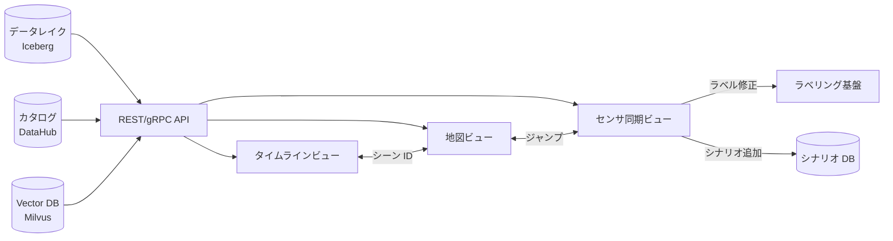
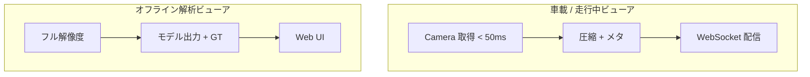
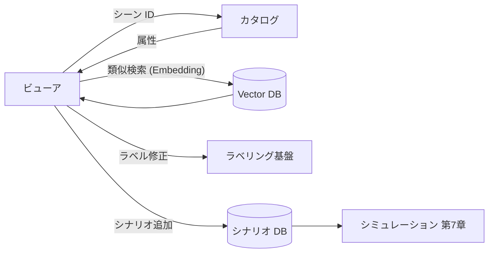

# 3.9 データブラウザ・可視化ツール

本節では、データブラウザと可視化ツールの設計を、ビューア比較・シーク最適化・3D BBox の画像投影・リアルタイム vs オフラインの設計差分まで踏み込んで扱います。膨大なログとモデル挙動を直感的に把握し、ラベリング・安全レビュー・エラー分析へ素早くフィードバックする「目」を構築するのが主題です。

## ビューア技術スタックの比較

| ビューア | 形態 | 強み | 弱み | 主用途 |
|---|---|---|---|---|
| **Foxglove Studio** [ST11](references#st11) | デスクトップ + Web | ROS / MCAP / DDS の標準対応、レイアウト柔軟、3D 点群、Web 配信 | プラグイン開発の自由度は中 | センサ同期ビュー、社内共有 |
| **PlotJuggler** | デスクトップ | 数千系列の時系列を高速描画、CSV / ROS bag 取り込み | 3D・地図表示は弱い | テレメトリ・スカラー時系列 |
| **RViz / RViz2** | デスクトップ | ROS 2 公式、3D 点群・TF・マーカー | UI が古め、Web 共有不可 | 開発者デバッグ |
| **Webviz / Studio (旧 Cruise)** | Web | ブラウザ完結、レイアウト共有 | 開発活動鈍化 | レガシー Web 視聴 |
| **Cesium JS** | Web | 3D 地球儀、地理情報レイヤ重ね | ライセンス・学習曲線 | 軌跡 + 空撮統合 |
| **Deck.gl** | Web | 1 億点クラスの大規模点群描画 | UI 構築は自前 | 大規模 LiDAR / heatmap |
| **Mapbox GL JS / MapLibre** | Web | 高性能ベクトル地図、商用カスタマイズ | スタイル設計が必要 | 商用地図 UI |
| **OpenLayers** | Web | OSS、汎用 GIS | 性能は中 | 内製・コスト重視 |

### バックエンド・フレームワーク選定の目安

| 構成 | 開発期間 | 性能 | 拡張性 | 運用コスト |
|---|---|---|---|---|
| Foxglove + Backend API | 6 週 | ◎ | ◎ | 中 |
| Web (React + Deck.gl) | 8 週 | ◎ | ◎ | 中 |
| Cesium + API | 10 週 | ◎ | ◎ | 中（クラウド依存） |
| RViz 内製拡張 | 4 週 | ○ | ○ | 低（保守負荷大） |

## 3 つの主要ビューと連携

> **図 3.9.1**：3 ビューを単一の API 層で結び、シーン ID で双方向ジャンプできるようにします。Closed-Loop で「気になる箇所を即座に追加収集対象にする」体験が成立します。

### タイムラインビュー：Drive / Scene / Event の軸

タイムラインビューは、Drive（連続走行単位）や Scene（短いシナリオ単位）の時間構造を、イベント・ラベル・モデル評価結果と重ねて表示するビューです。

- **上段**：Drive 全体タイムライン、Scene 区切り、運転モード、SW バージョン、センサ構成変化
- **中段**：イベントトラック（AEB、ドライバ介入、異常検知、near-miss）
- **下段**：スカラー時系列（速度、加速度、ブレーキ、モデル不確実性）

設計上のポイントは次の3つです。

- **マルチレゾリューションサンプリング**：長時間 Drive 俯瞰時は 1〜数秒単位、ズーム時はフレーム単位
- **インデックス設計**：`(drive_id, timestamp)` 複合インデックスで任意時間範囲を 200〜500 ms で返却
- **イベント連携**：異常検知・インシデント・ラベル変更を ID で結び、タイムライン上にバッジ表示

### 地図ビュー：軌跡・シナリオ・ODD セグメント

地図ビューは GPS / GNSS 上で軌跡・シーンを可視化し、「どこで何が多発しているか」を空間的に把握するビューです。WebGL ベースの 2D / 3D 地図に Drive 軌跡・Scene 代表点・インシデントポイントを重ねます。

地図ビューを Deck.gl で実装する場合、レイヤを次の 2 種類に分けて構成します。

- **PathLayer（Drive 軌跡）**：入力は `{path: [[lng, lat], ...], drive_id, odd_segment}` の配列。色は `odd_segment` から色テーブルを引いて決め、線幅は 5 px 程度。`pickable=true` にしておき、クリック時に対応する `drive_id` をタイムラインビューへ受け渡してジャンプさせます。100 万点規模の軌跡でも GPU 上で安定して描画できます。
- **ScatterplotLayer（インシデント）**：入力は `{lng, lat, severity}` の配列。半径は重大度に応じた半径テーブルから決め、色は赤系で半透明。クリックでセンサ同期ビューへジャンプさせます。

カメラ操作は Deck.gl 標準のマップコントローラに任せ、ベース地図は Mapbox GL JS / MapLibre 上に重ねるのが定番構成です。

| 機能 | 利用場面 |
|---|---|
| Drive 軌跡ポリライン + クリックジャンプ | 走行レビュー |
| シナリオタグ・ODD セグメントのフィルタ | カバレッジ可視化 |
| インシデント密度ヒートマップ | 危険箇所特定 |
| HD マップ重ね表示 | レーン構造との照合 |

### センサ同期ビュー：マルチモーダル可視化

複数カメラ・LiDAR・Radar・モデル出力を同一タイムスタンプで同期表示し、フレーム単位の詳細レビューを行うビューです。Foxglove Studio が事実上の標準で、MCAP [ST4](references#st4) フォーマットのインデックスを活用して任意時刻に瞬時シークします。

## シーク最適化：固定長ブロックレイアウト

固定長ブロックの設計パラメータと操作は次のとおりです。

- **ブロックサイズ**：1 ブロック ≒ 10 MB、フレーム数 = 30（30 fps で約 1 秒）。圧縮済み画像 + メタデータの平均サイズを 350 KB 程度と見積もり、これに 30 を掛けて 10 MB に揃えます。
- **オブジェクトキー命名**：`drives/<drive_id>/blocks/block_<block_idx 6桁>.tar` の形式とし、`block_idx = frame_no ÷ FRAMES_PER_BLOCK` で算出します。
- **フレーム → ブロック解決**：任意のフレーム番号からは、(1) 所属ブロックの S3 キー、(2) ブロック内オフセット (`(frame_no mod FRAMES_PER_BLOCK) × FRAME_SIZE_BYTES`) の 2 つを返します。クライアントはこれを使って Range GET で必要部分のみ取得します。
- **プリフェッチ**：再生範囲 `[start_frame, end_frame]` が指定されたら、両端を含むブロック群のキー一覧を生成し、並列に先読みします。シークバー操作時は前後 1〜2 ブロックも投機的にフェッチすると体感レイテンシが下がります。

固定長ブロック設計により、ストレージ側は **オブジェクト数を抑え** （1 Drive あたり数千 → 数百ブロック）、クライアント側は **必要なブロックだけプリフェッチ** できます。MCAP フォーマットを使う場合は、ファイル内インデックスでブロック相当を内部的に持てるため、ブロック化は省略可能です。

## メディアプレビュー最適化

プレビュー生成は次のポリシーで一元化します。

- **画像プレビュー**：入力フル解像度画像を、横幅 320 px に縦横比固定でリサイズ（補間は INTER_AREA 等の領域平均）し、JPEG 品質 75 で再エンコードします。出力はバイト列としてカタログ／ビューア API へ返します。これによりサムネイルサイズは 30 KB 前後となり、4K フレームから約 66 倍の削減になります。
- **点群プレビュー**：入力点群が目標点数（既定 10,000 点）より多い場合、一様ランダムサンプリングで点を間引きます。学術用途で空間分布を保ちたい場合は、Voxel Grid フィルタや FPS（Farthest Point Sampling）への切替も検討します。少ない場合はそのまま返します。
- **動画プレビュー**：30 秒程度の短尺セグメントは 480p HLS にトランスコードし、シークバーから即時再生できるようにします。

これらは一度生成したら CDN にキャッシュし、再生成は元データが更新されたときのみ実施します。

| 元データ | プレビューサイズ | 削減率 |
|---|---|---|
| 4K カメラフレーム（2 MB） | 320 px JPEG（30 KB） | 66 倍 |
| LiDAR 点群（10 MB / 100k 点） | 10 k 点ダウンサンプル（1 MB） | 10 倍 |
| 動画 30 秒（300 MB） | 480 p HLS（30 MB） | 10 倍 |

## モデル出力オーバーレイ：3D BBox を画像に投影

3D BBox を画像へ投影してオーバーレイ描画する手順は次のとおりです。必要な入力は (1) カメラ内部パラメータ `K`（3×3）、(2) LiDAR 座標系からカメラ座標系への 4×4 同次変換 `T_cam_lidar`、(3) 各検出 / GT BBox の 8 点コーナー（LiDAR 系）、(4) 検出と GT のマッチング結果（IoU 等の閾値で事前計算）です。

1. **同次座標化**：8 点に 1 列を加えて 8×4 の同次座標を作ります。
2. **カメラ系へ変換**：`T_cam_lidar` を掛けて 8×3 のカメラ系座標を得ます。
3. **前方クリップ**：`z > 0` の点だけ残します（後方の点は投影しない）。
4. **画像座標へ投影**：`K` を掛けて `[u·z, v·z, z]` を得て、`z` で割って `(u, v)` に正規化します。これで 8×2 の画像座標が得られます。
5. **描画**：得られた 8 点を多角形として `cv2.polylines` などで描画します。色は次の凡例に従います。
   - **緑**（True Positive）：検出があり GT とマッチした BBox。
   - **赤**（False Positive）：検出はあるが GT がない BBox。
   - **黄**（False Negative）：GT があるが検出されなかった BBox。

> **凡例**：緑＝True Positive、赤＝False Positive、黄＝False Negative。モデル評価ループでこの3色オーバーレイをワンクリック生成できると、エラー分析の速度が体感数倍になります。

## リアルタイム vs オフラインビューアの設計差分

| 観点 | リアルタイム | オフライン |
|---|---|---|
| レイテンシ要件 | < 100 ms（運用監視） | 数秒許容 |
| データ品質 | 圧縮優先 | フル解像度 + メタ全件 |
| モデル出力 | 直近のみ | 全バージョン履歴 |
| 配信方式 | WebSocket / WebRTC | REST + 範囲取得 |
| 想定利用者 | 安全監視オペレータ | エンジニア / アノテータ |

## レスポンシブ・アクセシビリティ

| 観点 | 対応事項 |
|---|---|
| 画面サイズ | デスクトップ（1920+）／タブレット（1024）／モバイル（375）でレイアウト切替 |
| 色覚多様性 | 緑赤を避け、Color Universal Design 6 色パレットを基本に |
| キーボード操作 | スペース：再生/停止、← →：1 フレーム送り、shift+←→：1 秒、`f`：フィルタ |
| アクセシビリティ | ARIA ロール、コントラスト比 4.5:1 以上、スクリーンリーダ |

## カタログ・ラベリング・シナリオ DB との接続

> **図 3.9.2**：ビューアは単なる「見る」UI ではなく、**カタログ・Vector DB・ラベリング・シナリオ DB のハブ** として機能します。気になるシーンを 1 クリックで類似検索し、ラベリングキューに追加し、シナリオ DB に登録できる体験が、Closed-Loop の改善速度を決定します。

## 本節の振り返り

ビューアは「データを人間が直視できる状態に保つ装置」であり、Closed-Loop の中で最も低く見積もられがちな投資です。しかし、エンジニアが「気になるシーンに 1 クリックで飛べない」「3D BBox の TP / FP / FN を色で区別できない」という状態にあると、エラー分析の速度は体感で数倍遅くなり、Closed-Loop 全体の回転速度がここで律速します。タイムライン・地図・センサ同期の 3 ビューを同じシーン ID で双方向ジャンプさせる設計は、「データを見る」体験を「データを操作する」体験へ変える分水嶺です。実務で陥る失敗は、ビューアを「見るだけのツール」と捉えて、ラベリング基盤やシナリオ DB との接続を後回しにするケース、もう一つは固定長ブロック設計を省略してフルファイル取得にしてしまい、長時間 Drive のシーク体験が破綻するケースです。10 MB 固定長ブロック化と Range GET、CDN キャッシュ済みプレビュー（4K → 320 px JPEG で 66 倍削減）は、「データセンサにペタバイトあっても、UI からは数百 KB しか触らない」という体験を成立させる仕掛けです。データ中心 AI の主張において、ビューアはカタログ・Vector DB・ラベリング・シナリオ DB のハブとして機能して初めて、現場が問題を直視し、次の収集計画とラベリング優先度に翻訳できます。データエンジニアと ML 開発者は、ビューアを「インフラの末端」ではなく「Closed-Loop の中心ノード」として設計しなければなりません。

## 第3章のまとめ

第3章では、収集データを Closed-Loop に活用するための **(II) 保存・インジェスト** 段階を、アップロード経路（3.1）→ インジェスト（3.2）→ 時刻同期（3.3）→ フォーマット正規化（3.4）→ ストレージ階層（3.5）→ データレイク / DB 設計（3.6）→ メタデータ / カタログ（3.7）→ ガバナンス（3.8）→ ビューア（本節）の順に体系化しました。要諦は「**ペタバイトをただ貯める** のではなく、**いつでも・誰でも・必要な切り口で** 取り出せる仕組みを設計する」ことです。

## 次章への橋渡し

第4章では、こうして整備されたデータレイクから、学習・評価に投入する **(III) データセット** を選び、前処理する段階を扱います。Active Learning（BALD / Core-set / BADGE）の数式と Python 実装、CLIP / DINOv2 / EVA-CLIP / SigLIP を用いたシーン検索、NeRF / Gaussian Splatting / GAIA-1 / DriveDreamer による合成データ、Differential Privacy ベースの匿名化、Snorkel / Cleanlab・Curriculum Learning・Hard Negative Mining・Dataset Distillation など、データ中心開発の「工学的工夫が最大化する」段階を詳述します。
