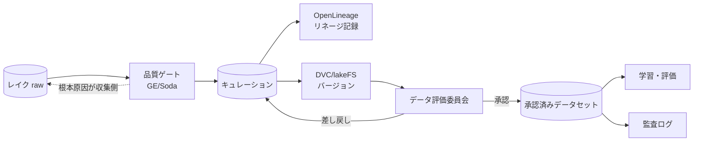
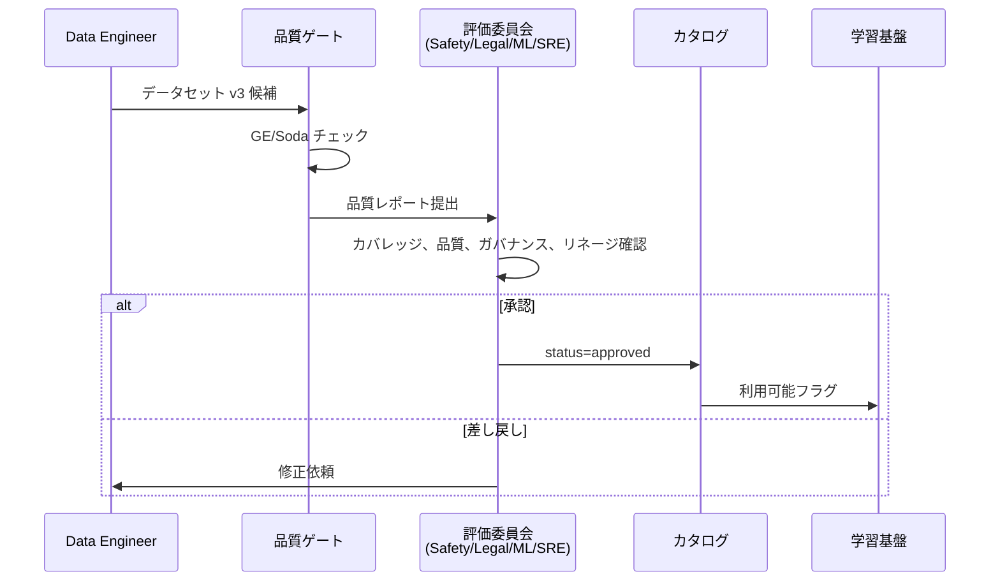
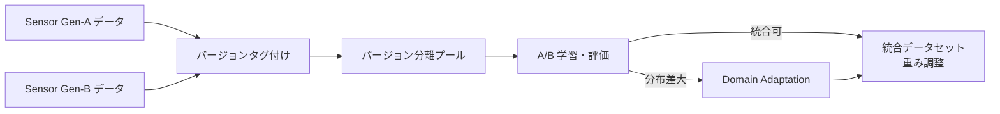

# 4.10 データガバナンスとデータセット承認プロセス

本節では、データガバナンスとデータセット承認プロセスを扱います。Git-Data 統合、データ評価委員会の承認フロー、リネージ管理、センサバージョン移行時の A/B テストを順に説明します。Closed-Loop データエンジンの中で「**どのデータをプロダクションモデルの根拠とするか**」を組織的に決め、追跡可能にする仕組みを示します。

## ガバナンス全体像

> **図 4.10.1**：データガバナンス全体像。raw → 品質ゲート → リネージ・バージョン管理 → 委員会承認 → 承認済みプール → 学習・監査の流れを CI/CD で自動化します。点線は品質ゲートで弾かれたデータの根本原因が収集側（センサ故障、キャリブ不備、特定地域の偏り）にある場合の RCA フィードバック経路で、第 2 章の収集ポリシー・トリガ設計へ戻します。

## ガバナンス4要素

| 要素 | 内容 | 主なツール |
|---|---|---|
| **データ品質** | 欠損率、分布逸脱、NULL、ドリフト | Great Expectations、Soda、Monte Carlo Data |
| **リネージ** | source → ETL → ラベル → モデル の依存関係 | OpenLineage、Marquez、DataHub |
| **アクセス制御** | RBAC/ABAC、暗号化、監査 | IAM、KMS、SIEM（第3.8 節） |
| **バージョニング** | データセットスナップショット、ロールバック | DVC、lakeFS、Iceberg time travel |

## DVC / lakeFS による Git-Data 統合

### DVC（Git 連携型）

**DVC (Data Version Control)** は、Git のワークフローでデータセットをバージョン管理するためのツールです。実体は S3 などのリモートに置きつつ、Git では軽量なメタファイル (`.dvc`) だけを追跡することで、TB 級データでも PR レビューや CI を高速に回せる点が特徴です。

運用は次のように進めます。リポジトリで `dvc init` を行い、リモートストレージとして S3 などのバケットを既定リモートに登録します。データセットディレクトリを `dvc add` で追跡対象にすると、メタファイル（拡張子 `.dvc`）が生成されるので、これを Git にコミットします。実体は `dvc push` でリモートへアップロードします。新しい合成データを追加する場合は、Git で別ブランチを切り、新データセットを `dvc add` してコミットと push を行い、レビュー時には `dvc diff main` で差分を確認します。

### lakeFS（Git ライクなデータレイクブランチ）

**lakeFS** は、データレイクのオブジェクトに対して Git 流のブランチ運用を適用できるツールです。本流ブランチ（例：`main`）からブランチを切り、ブランチ上でクレンジング後のファイルをアップロードして実験を行います。CLI ツール `lakectl` でブランチ作成 (`branch create`)、ファイル投入 (`fs upload --recursive`)、QA 通過後のマージ (`merge`) を一連で実行できます。マージは原子的で、失敗時はブランチを破棄するだけで済むため、PB 級レイクの破壊的変更も安全に試行できます。

| 項目 | DVC | lakeFS | Iceberg time travel |
|---|---|---|---|
| 想定スケール | TB 級 | TB〜PB 級 | PB 級 |
| 操作粒度 | ファイル | ブランチ | テーブルスナップショット |
| Git 統合 | ◎ | ○（API） | △ |
| 主用途 | 学習データセット | データレイク全体 | カラムナテーブル |

## データ評価委員会の承認フロー

委員会の役割と権限は事前に明記しておく必要があります。代表的な分担例を示します。

| ロール | 主な観点 | 権限 |
|---|---|---|
| Safety | ロングテールカバレッジ、安全クリティカルラベル品質 | **Veto**（差し戻し決定権）|
| Legal / Compliance | 地域別規制（GDPR/PIPL/個保法）、契約上の利用範囲 | **Veto** |
| ML | 学習仕様適合、評価セット独立性、リーク検出 | Recommend（合議で決定）|
| SRE / Data Platform | ストレージ・コスト・スループット影響、運用負荷 | Technical feasibility 評価 |

承認は **Safety と Legal のいずれもが Veto しない** ことを必要条件、ML / SRE の合意を十分条件として運用するのが実務的です。各役割の決定は監査ログに署名付きで記録します。

### 承認チェックリスト（実プロジェクトの代表項目）

| カテゴリ | チェック項目 | パス基準 |
|---|---|---|
| **カバレッジ** | ODD セグメント別の走行時間ヒートマップ | 全セグメント中 90% 以上に最低カバレッジ |
| **クラス別** | クラス別サンプル数とロングテール包含 | 重要クラスで > 1,000 サンプル |
| **品質** | 欠損率、タイムスタンプ整合 | 欠損 < 1%、同期誤差 < 50 ms |
| **匿名化** | 顔・ナンバープレートの検出漏れ率 | < 0.1% |
| **リネージ** | source → preprocess → label までトレース可能 | 必須 |
| **ガバナンス** | アクセスログ、利用目的限定 | 全項目記録 |
| **法令** | GDPR / 改正個保法 / PIPL 整合 | 法務承認 |

### データセットメタデータスキーマ

データセット 1 つを 1 つの YAML ファイルとして記述し、リポジトリで管理します。記載すべき主要セクションは次のとおりです。

- 識別子と状態：データセット ID、承認ステータス（`approved` / `pending` / `rejected`）、承認日時
- 承認者：Safety / Legal / ML / SRE の 4 ロールの担当者と承認日
- バージョン：スキーマバージョン（4.6 節）と前処理バージョン（4.5 節）
- 匿名化：顔・ナンバー・音声に適用したマスク方式とパラメータ（例：blur_sigma=21、blackout、removed）
- スプリット：train / val / test / long_tail の各サンプル数
- カバレッジ：ODD セル別の走行時間（例：urban × rain × night = 12.5 時間）
- リネージ：親 raw データセット、前処理パイプライン、ラベルポリシーバージョン
- ガバナンス：適用地域、保持日数、削除プロトコル（例：GDPR 第 17 条準拠）

このメタデータは Pull Request としてレビューされ、承認者の電子署名つきで監査ログに保存されます。

## OpenLineage / Marquez によるリネージ

**OpenLineage** はデータパイプラインのリネージ（系譜）を記述するオープン仕様、**Marquez** はその参照実装サーバです。学習ジョブからリネージを記録すると、データセットとモデルの依存関係が有向グラフとして可視化され、後から逆引きできるようになります。

実装は、OpenLineage クライアントを Marquez サーバ URL で初期化し、ジョブ完了時に次の要素を含む `RunEvent` を `COMPLETE` 状態で発行する形を取ります。

- ジョブ名前空間と名前
- 実行 ID とイベント時刻
- 入力データセット（例：`lake/fleet_2026q1_v3`）
- 出力モデル（例：`registry/bevformer:v42`）
- producer URL（学習コードのリポジトリ）

これを学習スクリプトの最後に組み込むと、Marquez 側に **「インシデント車両 → 搭載モデル → 学習データセット → raw レイク → 元 Drive」** の有向グラフが自動構築されます。GDPR 削除権（第 3.8 節）の対応や安全レビュー時に、モデルからデータへの逆引きが決定的に役立ちます。

## センサ・ソフトウェアバージョン移行戦略

### 移行戦略の 4 ステップ

1. **バージョンタグ付け**：センサ構成、キャリブレーション、SW バージョン、OS / ドライバ版を全ログに付与する。
2. **バージョン分離プール**：旧と新を明確に分け、まずは別データセットとして管理する。
3. **A/B 学習・評価**：旧のみ・新のみ・統合の 3 構成でモデル学習し、ODD セグメント別の性能を比較する。
4. **統合基準**：分布差が許容範囲なら重み調整で統合し、大きい場合は Domain Adaptation や再ラベルを併用する。

センサ世代間の互換性評価は、旧センサ世代と新センサ世代の同一 ODD・同一シナリオから抽出した特徴量行列を用います。各特徴次元の 1 次元 Wasserstein 距離を計算し、その平均値を「互換性スコア」とする方法が一般的です。比較する次元は、計算負荷を抑えるため代表 8 次元程度に絞るのが現実的です。判定の目安は次のとおりです。

- **スコア < 0.05**：旧新を統合プールにマージしてそのまま学習可能。
- **0.05 ≤ スコア < 0.15**：Domain Adaptation（CycleGAN や ADVENT、特徴量空間でのアラインメント）を併用すれば統合可能。
- **スコア ≥ 0.15**：別データセットとして管理し、再ラベル・再評価を実施する。

しきい値は ODD・タスク・モデルアーキテクチャによって変わるため、過去の世代移行で実測した「統合後の性能劣化」と「スコア」の対応表を社内で蓄積し、定期的に再校正してください。

## ガバナンスモニタリングとフィードバック

ガバナンスは「監査をパスする」だけでなく **継続的改善** が必須です。

| 観点 | モニタリング対象 | アクション |
|---|---|---|
| 品質失敗 | GE/Soda の失敗件数・分布 | 改善バックログに自動登録 |
| データセット利用履歴 | どのモデルが何を使ったか | OpenLineage で可視化 |
| インシデント対応 | RCA とリネージの紐付け | 該当データを Long-tail へ |
| 規制変更 | GDPR 改正、新規 EU AI Act | データ保持・削除ポリシー更新 |

## 規制レビューに耐えるエビデンス

データセット承認プロセスの最終目標は、**「規制当局や認証機関に対して、なぜこのモデル・このデータを採用したかを説明できる状態」** にすることです。具体的には次のものを揃えます。

| 種類 | 内容 |
|---|---|
| データセット承認証跡 | 承認日、承認者、レビューコメント、Diff |
| カバレッジレポート | ODD × シナリオ × クラスのヒートマップ |
| 品質レポート | GE/Soda の合否、欠損・SNR・同期誤差統計 |
| 匿名化レポート | 検出漏れ率、再識別リスク評価 |
| リネージグラフ | source → preprocess → label → model |
| 監査ログ | アクセス履歴、エクスポート履歴 |

これらを **不変ストレージ（Glacier Vault Lock 等）** に保存し、後から改ざん不能なエビデンスとして提示できる状態を保ちます。

### ガバナンスを「規約」ではなく「構造」で実装する判断

データガバナンスで最も陥りやすい失敗は、「承認プロセスを文書で定めて運用は人間に任せる」アプローチです。Safety / Legal / ML / SRE の 4 ロールの Veto 権限を社内 Wiki に書いただけでは、忙しい時期に承認をスキップする運用ショートカットが必ず生まれます。代わりに、データセットメタデータに 4 ロール署名欄を必須カラムとして持たせ、`approved` でないデータセットは学習基盤からそもそもアクセス不能にする――こうした「構造で守る」設計に倒すことで、承認プロセスを破ろうとしても破れない状態を作れます。承認ステータスを `pending` / `approved` / `rejected` の 3 値で固定し、Pull Request テンプレに承認チェックリスト全項目を組み込む運用も、レビュー漏れを構造的に封じる仕掛けです。

DVC / lakeFS / Iceberg time travel の使い分けを「ファイル単位 / ブランチ単位 / テーブル単位」で 1 つに決め、データレイクごとに混在させないのも同じ思想で、複数併用は監査ログの読み解きを倍々で複雑化します。OpenLineage のリネージグラフを四半期ごとに監査して孤立ノード（モデルが参照していないデータセット、データセットが追えないモデル）を検出する運用は、ガバナンスの「死に節」を発見する仕掛けで、これがないと孤立データセットがストレージコストを食い続け、孤立モデルが GDPR 削除要請のときに対応不能になります。承認証跡・カバレッジ・品質・匿名化・リネージ・監査ログの 6 種類を Glacier Vault Lock のような不変ストレージに自動保存するのは、規制当局や認証機関への説明責任を「あとから準備する」のではなく「最初から備える」という思想の表れで、改ざん不能なエビデンスとして提示できる状態を維持し続けることが、Closed-Loop データエンジンを企業の正式な開発プロセスとして成立させる最終条件です。

## 本節の振り返り

データガバナンスは品質・リネージ・アクセス制御・バージョニングの 4 要素から成り、ツールとワークフローで継続的に運用するものです。DVC（ファイル単位、TB 級）・lakeFS（ブランチ単位、TB〜PB 級）・Iceberg time travel（テーブルスナップショット、PB 級）をスケールと操作粒度で使い分けることで、Git ライクなデータバージョニングが現実的に成立します。データ評価委員会は Safety / Legal / ML / SRE の横断で構成し、Safety と Legal の Veto 権限と ML / SRE の合意を組み合わせた決裁構造で、カバレッジ・品質・匿名化・リネージ・法令の各チェックを統一フォーマットで承認するのが実務的です。OpenLineage / Marquez のリネージグラフは、GDPR 削除権の対応・安全レビュー・インシデント発生時の RCA で「モデルからデータへの逆引き」が必要になる局面で決定的に役立ち、有向グラフとして自動構築される構造そのものが価値を持ちます。センサ・SW バージョン移行はタグ付け → 分離 → A/B → 統合の 4 ステップで進め、Wasserstein 互換性スコアを軸に Domain Adaptation や再ラベルを併用するかを判定します。規制レビューに耐えるエビデンスは、承認証跡・カバレッジ・品質・匿名化・リネージ・監査ログの 6 種類を不変ストレージで保存することで、改ざん不能な形で説明責任を果たせる状態を維持できます。

## 第4章のまとめ

第4章では、**(III) データ選択・前処理・データセット設計** を、タスクと指標からの要件定義（4.1）→ クレンジングと品質ゲート（4.2）→ サンプリング戦略（4.3）→ 匿名化（4.4）→ フォーマット変換と特徴量抽出（4.5）→ スキーマとスプリット（4.6）→ シーン検索（4.7）→ Active Learning（4.8）→ 合成データと生成モデル（4.9）→ ガバナンスと承認（本節）と体系化しました。データ中心・Closed-Loop の観点では、ここが「**工学的工夫の余地が最大** 」のステージです。

## 次章への橋渡し

第5章では、データセット設計を支える **(IV) ラベリング** を扱います。ラベルポリシーとタクソノミ設計、CVAT / SuperAnnotate / Scale AI / Labelbox 等のツール比較、SAM / SAM2 / Grounding DINO によるオートラベリング基盤、Tesla Auto-labeling Pipeline、Cohen's / Fleiss' / Krippendorff's Kappa の数式と実装、リスクベース品質指標、Active Learning との統合、地域別コンプライアンスまで、ラベルを Closed-Loop の中核ナレッジベースとして扱う設計を詳述します。
