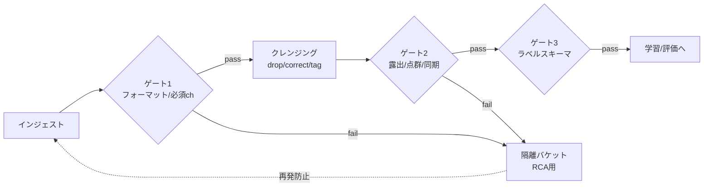

# 4.2 データクレンジングと品質ゲート

本節では、データクレンジング (data cleansing) と品質ゲート (quality gate) の設計を扱います。センサ故障や露出異常、タイムスタンプのずれの検出、ドライバ行動と計測バグの切り分け、品質フレームワークとの連携、そしてマルチモーダル融合後のゴースト物体検出までを Closed-Loop の観点で順に説明します。

## 品質ゲートという考え方

品質ゲートは CI/CD のテストゲートと同じ発想で、**所定の品質条件を満たしたデータのみを次工程（ラベリング・学習・評価）へ進める** 機械的な関門です。クレンジングは「除外 (drop)・補正 (correct)・タグ付け (tag)」の 3 アクションを組み合わせて設計します。悪いデータを弾くだけではなく、品質インシデントを検知してセンサ・ソフトウェア開発へフィードバックする「センサー」としても機能させます。

> この図のポイント：ゲートで弾いたデータは即破棄せず隔離バケットへ送り、根本原因分析 (RCA) を通じて収集・センサ側へ Closed-Loop で返します。

## センサ故障・露出異常・タイムスタンプドリフトの検出

ルールベースとモデルベースを併用します。ルールベースは露光時間・ゲイン・LiDAR 有効点数・GPS/IMU の fix 状態などのしきい値検査、モデルベースは「正常シーン」を学習した異常検知です。

### ルールベースの即時チェック

ルールベースのフレーム品質チェックは、各フレームに対し画像統計量（平均輝度・標準偏差）、LiDAR の有効点数、露光時間、GPS fix 状態を入力として、複数のフラグ列を返す関数で実装します。代表的な判定基準は次のとおりです。

- 画像の平均輝度が 8 未満または 247 超：露光飽和 (EXPOSURE_SATURATED)
- 画像の標準偏差が 5 未満：低コントラスト (LOW_CONTRAST、霧やレンズ曇りの可能性)
- LiDAR 有効点数が 8,000 未満：点群激減 (LIDAR_SPARSE、故障または広範遮蔽)
- 露光時間が 50–33,000 µs の範囲外：露光レンジ外 (EXPOSURE_RANGE)
- GPS fix が RTK/3D fix 未確立（fix < 3）：GPS_NOFIX

これらのフラグを格納した列を Frame テーブルに付与し、後段のゲートで「いずれかのフラグが立った行は隔離バケットへ」と一括振り分けします。しきい値は車両・センサ世代ごとに微調整し、フリート運用ログでの誤検出率を測りながら更新します。

### Autoencoder による異常検知

ルールで書ききれない複合的な異常（レンズ汚れ、HDR 破綻、未知の白飛びなど）には Autoencoder (自己符号化器) が有効です。Autoencoder は入力を一度低次元の潜在表現に圧縮してから元に戻すニューラルネットで、正常フレームのみで学習しておくと、未知の異常入力では再構成誤差 $\lVert x-\hat{x}\rVert^2$ が大きくなる性質があります。これを異常スコアとして使います。

Contrastive 系（PatchCore、SimCLR 表現 + kNN）は局所欠陥に強い一方、学習が重く分布シフトに敏感です。実務では「軽量・安定の Autoencoder を一次フィルタ、Contrastive を二次精査」と置くと費用対効果が高くなります。

実装としては、$3\times H\times W$ 画像を 2 段の畳み込み（チャネル数 3 → 32 → 64、ストライド 2）で潜在表現に圧縮し、対称な転置畳み込みで再構成する小さな畳み込み Autoencoder で十分です。学習データは「品質ゲート 1 を通過した正常フレームのみ」とし、推論時はバッチ単位で再構成して、フレーム別のピクセル平均二乗誤差を異常スコアとして出力します。しきい値は **正常データのスコア分布の 99 パーセンタイル** を採るのが実務的で、これを超えるフレームは隔離バケットへ送ります。スコア分布は週次で再計算して、季節要因や新しいハードウェアによる分布シフトに追従させます。

| 手法 | 学習データ | 強み | 弱み | 用途 |
|---|---|---|---|---|
| ルールしきい値 | 不要 | 高速・説明可能 | 複合異常を見逃す | 一次フィルタ |
| **Autoencoder** | 正常のみ | 軽量・安定 | 微小欠陥に鈍い | 一次〜二次 |
| **PatchCore / Contrastive** | 正常のみ | 局所欠陥に強い | 重い・分布シフトに敏感 | 二次精査 |
| OOD セグメンテーション | ラベル付き | 未知クラス検出 | セグメンタ依存 | シーン異常 |

## タイムスタンプドリフトの補正

時刻同期は第 2 章の PTP / GPS 時刻を基準に推定します。補正手法は特性が異なるため、用途で使い分けます。

| 手法 | 想定モデル | 強み | 弱み |
|---|---|---|---|
| **Kalman Filter** | 線形 + ガウスノイズ | オンライン、外挿可 | モデル設定が必要 |
| **Savitzky-Golay** | 局所多項式平滑化 | 形状保存、微分推定可 | オフライン窓処理 |
| **RANSAC 線形回帰** | 外れ値混入の線形ドリフト | 外れ値に頑健 | 非線形ドリフトに弱い |

クロックオフセットの推定は、PTP / GPS 基準との時刻差列を入力として、状態を「真のオフセット」、観測ノイズ分散を $r$、プロセスノイズ分散を $q$ とする 1 次元 Kalman フィルタで平滑化します。アルゴリズムの骨子は次のとおりです。

- 初期値を最初の観測値、初期共分散を 1.0 とする。
- 各ステップで予測（共分散に $q$ を加算）→ ゲイン $K=P/(P+r)$ を計算 → 更新（残差 $z-\hat{x}$ にゲインを掛けて加算、共分散に $1-K$ を乗算）を繰り返す。
- $q$ と $r$ は実測ノイズに合わせて $q\!\sim\!10^{-6}$、$r\!\sim\!10^{-4}$ あたりから調整する。

出力された平滑化オフセットの絶対値が許容範囲内（例：±1 ms）なら、再サンプリングで補正します。超過したシーンはタグ付けして除外し、原因が特定ロットや SW バージョンに偏在していれば RCA 案件に昇格させます。

### 補正手法の混在が引き起こす落とし穴

時刻同期の補正は、手法の特性とセンサの物理特性を整合させないと「直したつもりが歪んだ」という結果を招きます。例えば LiDAR のように外れ値が混入しやすい時刻記録に Savitzky-Golay 平滑化を当てると、外れ値の影響が窓内に染み出して全体が歪みます。逆にカメラのようにジッタが小さい系に RANSAC を持ち込むと、有効な微小ドリフトを「外れ値」として捨ててしまうことがあります。Kalman は線形・ガウスの仮定が崩れる温度ドリフトの局面で過信できず、Savitzky-Golay や RANSAC との切替判断を運用に組み込む必要があります。手法の混在運用は一見柔軟に見えますが、別のシーンで別の補正が効いた結果として、データセット全体の同期統計が「補正アルゴリズム由来の人工的な分布」になりかねません。

ここで設計判断として重要なのは、「許容ドリフトの SLA」を補正後ではなく補正前から測ることです。カメラ ±5 ms、LiDAR ±2 ms といったしきい値を補正前のセンサ生時刻で測ると、本当の超過率が見えます。補正後の値だけを見ていると、Kalman が表面的に揃えてくれる範囲のドリフトを見逃し、ハードウェア起因の劣化が顕在化したときには手遅れになります。隔離バケットに送るシーンに「ロット偏在」「SW バージョン偏在」「センサ取り付け疑い」のような原因仮説タグを付けておくと、RCA 担当者が事後に偏りを統計的に確認でき、現場で目に見えにくい品質劣化が早期に表出します。これは Closed-Loop が単にモデル性能を回すだけでなく、ハードウェア・ソフトウェアの上流まで品質シグナルを返す「センサー」として機能するための仕掛けでもあります。

## ドライバ行動の異常と計測バグの切り分け

急ブレーキや急ハンドルが「現実の危険挙動」なのか「計測や制御のバグ」なのかは、データだけでは判断できません。次の 3 つの観点で切り分けます。

- CAN / ECU の制御コマンドと実車挙動（速度・加速度・ヨーレート）の整合を確認する。
- ADAS 介入ログ（AEB / LKA）とセンサタイムラインを突き合わせる。
- 異常の車両・センサ・SW バージョン偏在を統計的に分析する。

偏在が見つかれば、ハードウェア・キャリブレーション・取り付け状態の点検トリガとして扱ってください。

## マルチモーダル融合後の品質チェック

融合前に各センサが正常でも、外部キャリブレーションのズレで **投影誤差・ゴースト物体（LiDAR と Camera で別位置に同一物体）** が生じます。LiDAR 点を画像へ投影し、検出ボックスとの整合 (IoU・再投影残差) を測ると検出できます。

投影整合チェックは、LiDAR 点群 $\{p_i\}$、LiDAR から Camera への外部キャリブレーション行列 $T_{\text{cam}\leftarrow\text{lidar}}$、内部パラメータ $K$、画像上の 2D 検出ボックス集合を入力として、ゴースト比率（点群の裏付けがない検出ボックスの割合）を計算します。手順は次のとおりです。

1. LiDAR 点を同次座標で Camera 座標系へ変換し、奥行き $z>0.1$ のみを残す（カメラ前方の点のみ）。
2. 内部パラメータ $K$ を掛けて画像座標 $(u,v)$ に投影する。
3. 各 2D 検出ボックスについて、内部に投影点が一定数（例：5 点）以上落ちているかを判定する。
4. 「点群の裏付けあり」のボックス比率を計算し、$1$ から引いた値を **ghost_ratio** として返す。

ghost_ratio が一定（例：0.2）を超えるシーンは外部キャリブレーションの再検証案件として隔離バケットに送り、特定の車両・センサで偏在していれば取り付け状態の点検トリガとします。

## 品質フレームワークとワークフロー連携

宣言的な品質ルールは Great Expectations / Soda / Monte Carlo Data などで管理し、Spark/Flink/Beam 上で実行、Airflow / Dagster / Prefect から失敗時に後続を停止します。ルールは YAML/SQL でリポジトリ管理し CI でレビューします。

| ツール | 形態 | 強み | 主用途 |
|---|---|---|---|
| **Great Expectations** | OSS / Python | Expectation Suite、Data Docs 自動生成 | バッチ検証 |
| **Soda (SodaCL)** | OSS + SaaS | YAML 宣言、SQL 直結 | 倉庫/レイク検証 |
| **Monte Carlo Data** | SaaS | データ可観測性、自動異常検知 | 大規模監視 |
| **dbt tests** | OSS | 変換と一体、軽量 | ELT パイプライン |

Soda CL を例にとると、Frame テーブルに対する品質ゲートは「行数が 0 でないこと」「LiDAR パス列に欠損がないこと」「露光時間が 50–33,000 µs の有効範囲外となる行が 1% 未満であること」「フレームタイムスタンプの重複がないこと」「`frame_ts` `cam_front` `lidar_path` `gps_fix` の必須列が全て存在すること」を宣言的に書き並べる形になります。これらを YAML としてリポジトリ管理し、Pull Request 時にレビューする運用にしておくと、ルール変更の履歴が残り、誰がどの基準でデータを通したかを後から追跡できます。

自動運転特有の「時系列・センサ同期・空間整合（投影整合）」チェックは独自拡張として追加します。

## Closed-Loop における品質ゲートの役割

品質ゲートで検出した異常は、センサベンダー・ハードウェア・フリート運用チームと共有します。除外したシーンは「品質問題調査用」バケットに保存して RCA に活用してください。ルールやしきい値は実運用フィードバックで継続調整し、過剰除外（有用データの喪失）と過少除外（ノイズ混入）のバランスを取ります。**本書は法的・安全性に関する助言を提供するものではなく、品質基準はテスト・検証を前提として各組織で確立する必要があります。**

### 過剰除外と過少除外の両側を見るという思想

品質ゲートのしきい値は、「どこまで弾けば安心か」だけを見ていると確実に過剰除外側へ滑ります。Autoencoder の異常スコアの 99 パーセンタイルを基準に置いた瞬間、季節要因（雪国の冬期に正常な白飛び画像が増える、夏の逆光フレームが増える）でゲートの挙動が大きく変わります。気付かないうちに、ある地域や時間帯のデータだけが平均より高い割合で隔離バケットへ送られ、結果として学習データが偏る、という現象は実プロジェクトで頻繁に観察されます。逆に「弾く量を抑えたい」とゲートを緩めれば、ゴースト物体や同期ずれが学習に紛れ込み、後段のモデル評価が信頼できなくなります。

そこで本書が推奨する設計判断は、過剰除外率と過少除外率を **両側から** SLA として追い、片側だけが極端に動く運用を構造的に禁じることです。これはルール / Autoencoder / Contrastive の 3 段フィルタを採用する理由でもあります。各段に異なる失敗モードを吸わせ、段ごとの検出率と誤検出率を別々にモニタリングすると、「どの段が過剰に弾いているか」「どの段がすり抜けを許しているか」が分解できます。隔離バケットを「センサ起因」「環境起因」「未分類」に分けるのも同じ思想で、未分類比率が高止まりするなら、3 段フィルタのどこかに分類ロジックの空白があると気付ける構造になっています。品質ゲートの YAML を Pull Request 管理し、しきい値変更に Safety / ML の承認を必須化するのは、評価の信頼性を支える前提を、個人裁量から組織のレビュー対象へ昇格させるための仕掛けです。

## 本節の振り返り

クレンジングは drop / correct / tag の 3 アクションを組み合わせて設計し、弾いたデータは破棄せず隔離バケットに送って RCA の素材として再利用するのが本節の中核です。これは品質ゲートを単なる「ふるい」ではなく、センサ・ハードウェア・ソフトウェアの上流に品質シグナルを返す「センサー」として位置付ける思想です。異常検知はルール（高速・説明可能）→ Autoencoder（軽量・安定）→ Contrastive（局所欠陥に強い）の多段で構成すると、各段が異なる失敗モードを吸い、誤検出と見逃しのバランスを保ちやすくなります。タイムスタンプ補正は Kalman / Savitzky-Golay / RANSAC を特性で使い分け、許容超過は「直す」より「除く」を選ぶことで補正アーティファクトの混入を避けます。マルチモーダルは個別センサが正常でも融合後にゴースト物体が出るため、投影残差・ghost_ratio までを品質ゲートで検査することが不可欠です。Great Expectations や Soda のような宣言的フレームワークで品質ルールを YAML 管理し、Pull Request でレビューする運用に乗せて初めて、誰がどの基準でデータを通したかが事後に追跡でき、Closed-Loop の信頼性が担保されます。

## 次節への橋渡し

品質ゲートを通過した健全なデータが揃ったら、次は「どのデータをどれだけ学習・評価に使うか」を決めるサンプリング設計です。次の 4.3 節では、ランダム / 層別 / シナリオベースの三階層、Class-Balanced Loss の有効サンプル数、ego 速度適応フレームレート、DRO によるロングテール対策を、数式とコードで扱います。
