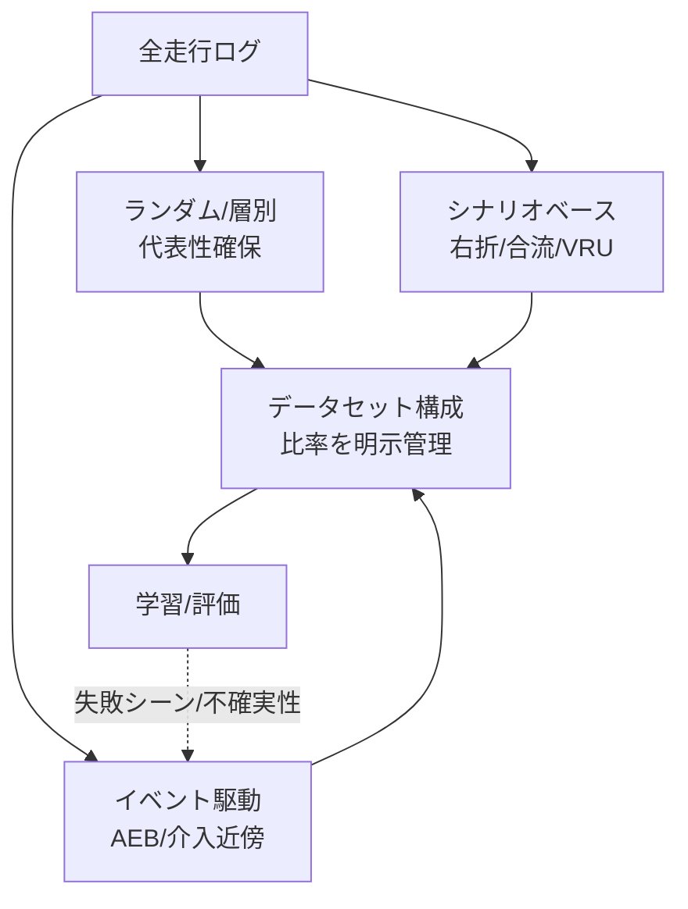

# 4.3 サンプリング・ダウンサンプリング戦略

本節では、常時走行ログから学習・評価データセットを構築する際のサンプリング (sampling) とダウンサンプリング (downsampling) の戦略を扱います。層別サンプリング、クラス不均衡対策、ego 速度に適応したフレームレート選定、ロングテール対策、シナリオベースの評価セット設計を順に説明します。

## 三階層のサンプリング設計

サンプリングは「ランダム → 層別 → シナリオベース」の三階層で設計すると、量・代表性・安全網羅のバランスが取りやすくなります。

> この図のポイント：平凡シーンの代表性（ランダム/層別）と安全上重要なロングテール（イベント/シナリオ）を別経路で集め、最終的な構成比率を明示管理します。

単純な時間均一サンプリングは頻度の高い「平凡シーン」に偏るため、メタデータ（時刻・天候・地域）での層別、Drive / Scene 単位の抽出（連続フレーム相関による実効サンプル数の低下を抑制）、学習・評価で同一 Drive を分離（リーク防止、4.6 節連携）を基本とします。

## クラス不均衡：有効サンプル数と Focal Loss

ロングテール対策の中核は重み付けです。Class-Balanced Loss [AL6](references#al6) は、「クラスのサンプルが増えるほど追加サンプルの情報量が飽和する」という考え方を **有効サンプル数 (effective number)** でモデル化します。クラス $c$ のサンプル数を $n_c$、ハイパーパラメータ $\beta\in[0,1)$ として、

$$
E_{n_c} = \frac{1 - \beta^{n_c}}{1 - \beta}, \qquad w_c \propto \frac{1}{E_{n_c}} = \frac{1 - \beta}{1 - \beta^{n_c}}
$$

式の意味は「サンプル数が多いほど $E_{n_c}$ が頭打ちになり、重み $w_c$ が小さくなる」というもので、$\beta \to 1$ で逆頻度重み、$\beta = 0$ で重み均一に一致します。

検出のような前景・背景の極端な不均衡には Focal Loss [AL5](references#al5) が有効です。Focal Loss は易しく分類できた例（$p_t$ が 1 に近い例）の寄与を $(1-p_t)^\gamma$ で減衰させ、難しい例に学習を集中させます。

$$
\text{FL}(p_t) = -\alpha_t (1 - p_t)^{\gamma} \log(p_t)
$$

### 実装で何を返すか

実装は 2 つの関数を用意します。

- **Class-Balanced 重み**：クラスごとのインスタンス数 $\{n_c\}$ と $\beta$ を入力に、$E_{n_c}$ を計算して逆数を重み $w_c$ とし、平均 1 に正規化して返します。$\beta=0.999$ が既定値で、たとえばクラス数が $[100{,}000,\, 5{,}000,\, 200]$ のとき、多数派クラスの重みはほぼ 0 に、最少クラスの重みは平均の数倍になります。
- **Focal Loss**：ロジットと正解ラベルから交差エントロピー $\text{CE}$ を要素ごとに求め、$p_t=\exp(-\text{CE})$ と $\alpha (1-p_t)^\gamma$ を掛けて平均を返します。$\alpha=0.25$、$\gamma=2.0$ が物体検出での一般的な初期値です。

これらをデータローダのクラス重みとロス関数に適用すると、ロングテール分布のクラスを底上げできます。

学習レベルの重み付けに加えて、データ選択レベルでもレアクラス（電動キックボード、工事標識、逆走自転車など）を意図的にオーバーサンプリングします。ただし過度なオーバーサンプリングは平凡シーンの精度を犠牲にするため、安全要求と運用分布のバランスを見て比率を調整してください。

## DRO によるロングテール保証

平均損失最小化は多数派に最適化されがちです。Distributionally Robust Optimization (DRO、分布ロバスト最適化) は、グループ（ODD セル）ごとの最悪損失を抑えることで「どのセグメントでも一定性能」を狙う枠組みです。Group DRO は次の min-max を解きます。

$$
\min_{\theta} \max_{g \in \mathcal{G}} \; \mathbb{E}_{(x,y)\sim P_g}\big[\ell(\theta; x, y)\big]
$$

式の意味は「最悪のグループ $g$ における期待損失を最小化するパラメータ $\theta$ を探す」というもので、内側の $\max$ により多数派の平均で最適化が止まる現象を防ぎます。

Group DRO の実装は、各ミニバッチでグループ別の平均損失ベクトル $\ell_g$（長さ $G$）と現在のグループ重み $\pi_g$（合計 1）を受け取り、$\pi_g \leftarrow \pi_g \exp(\eta \ell_g)$ で「損失が大きいグループほど重みを増やす」指数更新を行い、合計 1 になるよう正規化します。最終損失は $\sum_g \pi_g \ell_g$ で、これをモデルパラメータの最適化対象にします。学習率 $\eta$ は $0.01$ 前後から始め、グループ重みのエントロピーが極端に低下しない範囲（少数グループに集中しすぎない）で調整します。グループ定義（ODD セル、地域、天候など）は事前に固定し、学習中に変更しないことが安定性の鍵です。

| 手法 | 対象レベル | 効果 | 注意点 |
|---|---|---|---|
| Class-Balanced [AL6](references#al6) | クラス | 頻度飽和を考慮した重み | $\beta$ 調整が必要 |
| Focal Loss [AL5](references#al5) | サンプル | 易例の寄与減衰 | $\gamma$ 過大で学習不安定 |
| Oversampling | データ選択 | レアクラス露出増 | 過学習・平凡精度低下 |
| **Group DRO** | グループ | 最悪セグメント保証 | グループ定義に依存 |

## フレームレート選定：ego 速度への適応

固定 fps は非効率です。高速道路では短時間で景色が変わるため高 fps が要りますが、停車・渋滞時は低 fps で十分です。**ego 速度に応じて「一定の移動距離ごとに 1 フレーム」** を選ぶと、見かけの変化量が均等化されます。

適応フレームレート選定は、フレームごとの ego 速度 [m/s] とタイムスタンプ列を入力として、保持するフレームインデックスのリストを返す処理になります。アルゴリズムの骨格は次のとおりです。

- 「累積移動距離」変数を 0 で初期化し、各フレームで前回保持時刻からの $\Delta t$ と速度から距離増分を加算する。
- 累積距離が閾値 `dist_per_frame`（市街地なら 2 m）を超えるか、最後の保持から $1/\text{fps}_{\min}$ 秒以上経過したらそのフレームを保持して累積距離をリセットする。
- ただしフレーム間隔が $1/\text{fps}_{\max}$ より短い場合（たとえば 50 ms 未満）はスキップし、上限 fps を超えないようにする。

これにより停止中は時間ベース下限 fps が、走行中は距離ベース基準が支配的に効き、見かけの変化量がフレーム間で均等化されます。

`dist_per_frame=2.0` は市街地（30〜50 km/h、停止・発進が頻繁）の典型値で、高速 NOA では 5〜10 m へ広げる方が冗長性を抑えられます。実運用では ODD セグメント別に推奨値を設定するのが現実的です。

| ODD セグメント | dist_per_frame [m] | fps クランプ [min, max] |
|---|---|---|
| 市街地・低速 | 2.0 | 2〜10 |
| 郊外・中速 | 5.0 | 3〜15 |
| 高速 NOA | 10.0 | 5〜20 |
| 停止・渋滞 | 1.0（時間ベース fps_min 主導）| 1〜5 |

タスク別の戦略：Perception は等間隔間引きで冗長性を削減（上式）、Tracking / Prediction / Planning は数秒〜十数秒のシーン切り出しで連続フレームを保持します。LiDAR・Radar との同期が取りやすい間隔を選ぶことも重要です。

## シナリオベースサンプリングと評価セット設計

Planning / Closed-Loop 評価では、シーンではなくシナリオ単位で抽出します。信号交差点右折、高速合流・車線変更、VRU 飛び出し・工事ゾーンなどのカテゴリを定義し、各カテゴリから一定数を確保します。ここで見落としがちなのが **シナリオ内の均等性** で、「右折」と「左折」、「昼の合流」と「夜の合流」のように、同一カテゴリ内の頻度差を意図的に補正しないと評価が偏ります。

評価セットは2系統用意するのが定石です。

- **運用分布セット**：実フリート分布に近く、現実世界での平均性能を測る。
- **ハザード強調セット**：安全上重要なシナリオ比率を高め、保守性を測る。

両者の指標を別々に追跡することで、平均性能と最悪ケース保守性の両面をモニタリングできます。

## Closed-Loop におけるサンプリング戦略の更新

サンプリングは固定ルールではありません。エラー分析・Active Learning・実運用フィードバックで継続更新します。具体的には、オフラインやシミュレーションの失敗シーン近傍を 4.7 節の類似検索で拡充し、4.8 節の不確実性・異常スコアで追加収集領域を特定し、第 8 章のヒヤリハット情報から過小評価シナリオを補強します。サンプリングポリシーはコードや設定としてリポジトリ管理し、Airflow や Dagster 上のジョブとして Pull Request ベースでレビュー・適用してください。これにより戦略自体が DataOps の一部として監査可能になります。

### サンプリング比率を「成果物」として扱う発想

サンプリング戦略でいちばん見落とされやすいのは、「ランダム・層別・イベント駆動・シナリオベースの 4 経路をどの比率で混ぜるか」が **モデル性能と同じくらい重要な設計成果物** だという認識です。比率を文書化せずに開発者の直感で混ぜていると、「夜間データを増やしたら昼の精度が落ちた」「VRU を厚くしたら一般道の平凡シーン精度が崩れた」という事象が、再現できないまま議論されます。比率を YAML として固定し Pull Request でレビューする運用に乗せると、変更履歴と性能変化が一対一で対応するため、何が効いて何が効かなかったかが事後に解析できます。Group DRO のグループ重みエントロピーをモニタするのも同じ発想で、重みが極端に少数グループへ集中すると DRO が「最悪ケースだけを見る学習機」に退化し、平均性能が大きく崩れます。エントロピー低下をアラートとして拾うのは、グループ定義の粒度が粗すぎる/細かすぎるサインを早期に拾う仕組みです。

逆の失敗パターンとして、ハザード強調セットだけでリリース判定を行うケースがあります。安全クリティカルなシナリオに過度に最適化されたモデルは、運用分布上の平凡シーンで体感品質を落とし、現場のドライバ評価が悪化します。そのため評価セットは運用分布とハザード強調の 2 系統を並列に追い、両方の閾値を満たすことを昇格条件にする必要があります。これは「平均性能 vs 最悪ケース保守性」という本質的なトレードオフを、評価設計の段階で明示する仕掛けに他なりません。`dist_per_frame` を ODD セル別に設定ファイル化し、収集ログから自動で再校正する運用も、固定値で固めると ODD 拡張時に追従できなくなる、という長期運用の実情を踏まえた設計判断です。

## 本節の振り返り

サンプリングはランダム / 層別・イベント駆動・シナリオベースの三階層で構成し、比率を明示管理することで、データ中心の改善が再現可能な意思決定になります。クラス不均衡には有効サンプル数 [AL6](references#al6) による Class-Balanced 重みと Focal Loss [AL5](references#al5) が、グループ単位の保証には Group DRO が効きます。これらは目的が異なる道具で、サンプル単位の不均衡（前景・背景の極端な差）には Focal Loss が、クラス単位の頻度差には Class-Balanced が、ODD セル単位の最悪ケース保証には Group DRO が、それぞれ適切な層で働きます。フレームレートは固定 fps ではなく ego 速度に応じた「移動距離あたり一定枚数」とすることで、停車中の冗長フレームを削りつつ高速走行時の情報を維持できます。評価セットは運用分布とハザード強調の 2 系統を並列に運用し、平均性能と保守性のトレードオフを意図的に追跡することで、リリース判断が片側の指標に偏ることを防げます。サンプリングポリシーをコードとして管理し Closed-Loop のフィードバックで更新する運用に乗せて初めて、戦略自体が DataOps の監査対象に組み込まれ、改善履歴が組織に蓄積されます。

## 次節への橋渡し

サンプリングで「使うデータ」を絞り込んだら、公開・共有の前に避けて通れないのがプライバシー保護です。次の 4.4 節では、顔・ナンバープレートの匿名化を、brighter-AI / Celantur などのツール、Differential Privacy の $\varepsilon$-$\delta$ 定義、マスク手法が技術品質に与える影響の定量評価まで含めて扱います。
