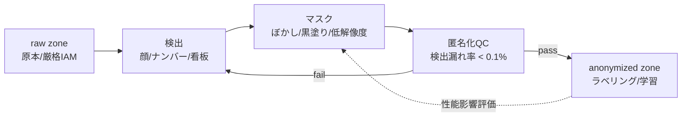

# 4.4 匿名化（顔・ナンバー消し等）

本節では、オフライン匿名化パイプラインとプライバシー保護を扱います。専用ツール、Differential Privacy の位置づけ、マスク手法が Perception 性能に与える影響、ナンバープレート検出の難しさ、地域別規制との整合を順に説明します。**本節は法的助言を提供するものではなく、条文の逐次解説も行いません。匿名化レベルの最終判断は、各組織の法務・コンプライアンス部門と確立してください。**

## オフライン匿名化パイプライン

収集ログは、学習・評価に使う前にオフラインで匿名化します。原本は厳格にアクセス制御された raw zone に保管し、一般開発者は匿名化済みゾーンのみを扱う「ゾーン分離」が基本構成です。

> この図のポイント：匿名化は「検出 → マスク → QC」の閉路で、検出漏れ率を基準に再処理を回します。原本ゾーンと匿名化ゾーンを物理的に分離するのが要点です。

検出ステップは YOLO 系 / Transformer 検出器（MMDetection / Detectron2）を顔・ナンバー・看板に特化させて学習するのが一般的です。自前運用が難しい場合は専用ツールの利用が現実的です。

## 匿名化ツールの比較

| ツール | 形態 | 主対象 | 出力方式 | 特徴 |
|---|---|---|---|---|
| **brighter-AI (Deep Natural Anonymization)** | SaaS / オンプレ | 顔・ナンバー | 合成置換（リアルな別人/別番号に差し替え） | テクスチャを保つため下流性能影響が小さいとされる |
| **Celantur** | SaaS / コンテナ / オンプレ | 顔・ナンバー・人物・車両 | ぼかし / 黒塗り / 全身 | バッチ大量処理、オンプレ対応 |
| **自前 (MMDetection + OpenCV)** | OSS | 任意クラス | 任意 | 完全制御・要運用コスト |
| **Egyde / gallio 等** | SaaS | 顔・ナンバー | ぼかし | 軽量導入 |

合成置換 (generative replacement) はマスクではなく「別人の顔・別のナンバー」に差し替える方式で、検出器の特徴量分布の変化を抑えつつ匿名性を確保できる点が、近年の差別化要素になっています。

## 検出漏れの非対称性とナンバープレート検出の難しさ

匿名化評価では「検出漏れ (false negative) は検出過剰 (false positive) より重大」という非対称性を踏まえます。実務では検出漏れ率の許容基準（例：< 0.1%）を先に定め、多少の過剰マスクを許容して Recall を最大化します。

ナンバープレートは顔よりも検出が難しい対象です。斜め角度・部分遮蔽・反射/夜間グレア・小サイズ（遠方）・各国フォーマット差が重なり、汎用検出器の Recall が落ちます。CCPD などの実環境ナンバープレートデータでファインチューニングし、角度・照度のデータ拡張を厚くするのが定石です。

マスク処理の実装は、画像と検出ボックス集合、マスク方式（`blur` `pixelate` `black`）と膨張率 `pad`（既定 0.15）を入力にとり、各ボックスを $\pm pad$ 倍だけ膨張させた上で領域を加工します。膨張は Recall 重視の安全マージンとして、検出枠ぎりぎりに残ったエッジ情報の漏洩を抑える目的で必須です。加工方式は次のとおりです。

- `blur`：領域の短辺の半分程度を奇数化したカーネルでガウシアンぼかしを適用する。
- `pixelate`：領域を $8\times 8$ 程度に縮小してから元サイズへ最近傍拡大することでモザイク化する。
- `black`：領域を全て 0 で埋めて完全黒塗りする。

返り値はマスク済み画像で、ボックスがフレーム外にはみ出した場合はクリップしてスキップします。マスク方式とパラメータは 4.4 節後半の $\Delta$mAP 評価結果に従って ODD ごとに固定します。

## Differential Privacy の位置づけ

Differential Privacy (DP、差分プライバシー) は、「データセットに個々のレコードが含まれているかどうかが出力分布をほとんど変えない」ことを数学的に保証する枠組みです。$(\varepsilon, \delta)$-DP は、レコードを 1 件だけ違えた隣接データセット $D, D'$ と、任意の出力集合 $S$ について次を満たすことを要求します。

$$
\Pr[\mathcal{M}(D) \in S] \le e^{\varepsilon}\,\Pr[\mathcal{M}(D') \in S] + \delta
$$

式の意味は「個人 1 件の有無で結果の確率比が高々 $e^{\varepsilon}$ 倍にしかならない（例外確率 $\delta$）」というもので、$\varepsilon$ が小さいほど強いプライバシー保証になります。

数値クエリには Laplace mechanism (ラプラス機構) が使われます。感度 $\Delta f$（1 レコードの追加削除で集計値が変わりうる最大量）に対し、スケール $b = \Delta f / \varepsilon$ の Laplace ノイズを加えます。

$$
\mathcal{M}(D) = f(D) + \text{Lap}(0, \Delta f / \varepsilon)
$$

実装は、集計値（例：地域別走行台数）と関数感度 $\Delta f$、プライバシーバジェット $\varepsilon$ を入力に、スケール $b = \Delta f / \varepsilon$ の Laplace ノイズをサンプリングして加えるだけの 1 行の処理です。$\varepsilon$ を小さくするほどノイズが大きくなり、プライバシー強度が増すかわりに統計の有用性が下がります。たとえばユーザ単位の集計（同一ユーザの 1 件追加で値が ±1 しか動かない）は感度 $\Delta f=1$ で、$\varepsilon=0.5$ ならスケール 2 の Laplace ノイズが加算され、結果は元値 ± 数件の揺らぎを伴って公開されます。バジェットは年単位や四半期で総量を決め、複数クエリへの分配を厳密に管理することが運用上の要点です。

ただし DP は主に **集計統計・学習勾配（DP-SGD）・テレメトリ集計** に有効で、画像中の顔そのものを消す処理は検出 + マスク（または合成置換）が中心です。DP は「リリースする統計値や学習済みモデルからの再識別」を抑える層として、ピクセルレベルの匿名化と組み合わせて使います。

## マスク手法がモデル性能に与える影響の定量化

匿名化はテクスチャを失わせ、Perception の特徴量分布を変えます。マスク方式とパラメータを変えて性能変化を測り、プライバシーと性能の両立点を探します。

| マスク方式 | パラメータ例 | プライバシー強度 | 歩行者検出 mAP 影響（代表値）| 計算コスト | 備考 |
|---|---|---|---|---|---|
| 強ガウシアンぼかし | kernel=31, σ=21 | 中〜高 | −1〜−3 pt | 低 | 形状コンテキスト保持 |
| モザイク (pixelate) | block=12 px | 中 | −1〜−2 pt | 低 | 軽量 |
| 完全黒塗り | bbox 全塗り | 高 | −3〜−6 pt | 低 | 領域情報が消失 |
| 合成置換 (brighter-AI 等) | StyleGAN 系 | 高 | −0.5〜−1.5 pt | 高（GPU）| テクスチャ連続性を保つ |

> mAP 影響は社内 nuScenes 互換ベンチで歩行者検出（IoU=0.5）を測定した代表値で、ODD・モデル・ラベル粒度で 1.5 倍程度変動します。

$\Delta$mAP のスイープ評価は、マスクパラメータ（ガウシアンカーネルのサイズ集合、たとえば $0, 7, 15, 31$）を入力にとり、匿名化なし（kernel=0）を基準として各設定で評価関数 `eval_fn` を呼び出し、$(kernel,\ \text{mAP},\ \Delta=\text{base}-\text{mAP})$ の表を返す処理です。同じ評価セット・同じラベルで揃え、モデル側の確率変動を抑えるため評価セットは固定シードで作成します。出力テーブルから検出漏れ率の基準を満たしつつ $\Delta\text{mAP}$ が許容内に収まるパラメータ点を選び、匿名化ポリシーに固定値として反映させます。

評価では匿名化前後で同一ラベルを用い、パラメータ（ぼかし強度・マスクサイズ）を振って $\Delta$mAP をプロットし、検出漏れ率の基準を満たしつつ $\Delta$ が許容内のパラメータ範囲を特定します。

## 点群・マップ・テレメトリの匿名化

画像以外にも個人・機密情報は含まれます。LiDAR 点群は人物シルエットから再識別の可能性があり、解像度低下や領域マスクを検討します。HD マップは建物名・私道をカテゴリ化（一般化）し、テレメトリは緯度経度を粗いメッシュへ丸め、VIN / Driver ID をハッシュ化します。過度な匿名化はモデル性能・マップ整合を損なうため、ユースケースごとに必要レベルを丁寧に決めます。

## 法規制・ポリシーとの整合と Closed-Loop

GDPR [L14](references#l14)・改正個保法 [L13](references#l13)・PIPL [L12](references#l12)・CCPA では、顔・ナンバー・居住地推定情報は個人データとして扱われることが多くあります。次の 3 点を法務と定義してください。

- **完全匿名化** か **仮名化 (pseudonymization)** かの区別。
- 社外ベンダーへ提供可能なレベル。
- 地域別のポリシー切り替え。

匿名化ポリシーの変更はデータセットとモデルへ影響するため、匿名化バージョンをスキーマ（4.6 節）の一部として管理します。「モデル X は匿名化 v2 で学習」というトレーサビリティを確保し、変更時は再学習・再評価・再承認（4.10 節）を回してください。実装は「検出器・加工処理・スケジューラ」の 3 層を疎結合にし、Spark / Dask / Ray でスケールさせます。

### プライバシーと下流性能の両立点を見つける思考様式

匿名化で最も誤解されやすいのは、「強くマスクするほど安全」という直感です。完全黒塗りはプライバシー強度こそ高いものの、歩行者検出の mAP が代表的に −3〜−6 pt 落ち、Perception の特徴量分布を壊します。これを軽視して画一的に黒塗り運用すると、下流のリリースゲート（第 8 章）で性能逸脱が発生し、結局は匿名化方式のやり直しを迫られます。逆に、合成置換 (brighter-AI 系) のように下流影響が −0.5〜−1.5 pt と小さい方式を選んでも、検出漏れ率（false negative）の評価を怠ると「安全策のつもりが最大のリスク」になりかねません。検出漏れと検出過剰の非対称性――前者が法的・倫理的に重く、後者は単に過剰マスクで済むこと――を踏まえて、Recall を最大化する側に倒した設計判断が前提です。

設計上の中心的な論点は、「raw zone と anonymized zone をどれだけ厳密に分離できるか」と、「匿名化バージョンをデータセットメタデータに固定できるか」の 2 点に集約されます。原本ゾーンへの IAM を緩めれば作業効率は上がりますが、内部不正リスクと法的リスクが同時に跳ね上がります。匿名化バージョンを記録せずに学習ジョブを回すと、後で「モデル X はどのマスクポリシーで学習されたか」が辿れず、規制対応や A/B 比較が破綻します。$\Delta$mAP スイープを四半期ごとに走らせ、ODD ごとの推奨パラメータを表として固定する運用は、プライバシーと性能の両立点が ODD（夜間・雨・市街地）で大きく動くことに対応するためのものです。地域別ポリシーのルーターを ETL に組み込み、地域メタが欠落したログを隔離する運用は、グローバル展開時に GDPR と PIPL のように要件が衝突する局面で「黙って通してしまう」ことを構造的に防ぎます。

## 本節の振り返り

匿名化は「検出 → マスク → QC」の閉路で運用し、原本ゾーンと匿名化ゾーンを物理的に分離して検出漏れ率（例 < 0.1%）を基準に動かす――この骨格が、プライバシーリスクと開発効率のバランスを取るための前提です。専用ツール（brighter-AI / Celantur）、特に合成置換は、テクスチャ連続性を保ったまま匿名性を確保するため下流性能への影響を抑えられ、Perception 特徴量分布の歪みを最小化したいケースに適します。ナンバープレートは角度・反射・各国フォーマット差で汎用検出器の Recall が落ちるため、CCPD などでの fine-tuning とデータ拡張の厚みが有効です。Differential Privacy はピクセルレベルの匿名化と競合するものではなく、集計統計・学習勾配・テレメトリの再識別抑制という別レイヤで組み合わせる道具です。マスク方式は $\Delta$mAP を定量評価したうえで、ODD ごとの推奨パラメータを表として固定し、匿名化バージョンをデータセットメタデータに刻むことで、Closed-Loop の中で「どのモデルがどの匿名化ポリシーで学習されたか」を再現可能にすることが、規制対応と性能運用の双方を満たす唯一の道です。

## 次節への橋渡し

匿名化済みの安全なデータが揃ったら、学習に適した形へ変換する段階です。次の 4.5 節では、フォーマット変換・リサンプリング・特徴量抽出として、BEV 投影や Voxelization の実装とメモリ/計算比較、WebDataset vs Parquet vs Zarr の選定、RAFT / FlowFormer など効率的な光フロー手法を扱います。
