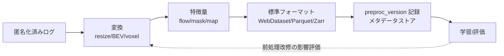

# 4.5 フォーマット変換／リサンプリング／特徴量抽出

本節では、学習・評価に適したデータ表現を得るためのフォーマット変換 (format conversion)、リサンプリング (resampling)、特徴量抽出 (feature extraction) を扱います。BEV 投影や Voxelization のメモリ／計算コスト比較、データフォーマットの選定基準、効率的な光フロー手法を Closed-Loop 再現性の観点で順に説明します。

## 画像・点群の正規化とリサンプリング

異なる解像度・フレームレートのログを統一するため、画像は固定解像度（例 1600×900、800×448）にリサイズします。アスペクト比維持パディングとクロップの間で、情報損失をトレードオフしてください。マルチカメラでは、内部・外部パラメータを保持したまま統一します。点群は Voxelization・BEV 投影・Range View のいずれかに変換します。**これらの変換はオンライン推論時にも必要になるため、「推論時と同じ前処理チェーン」をコードで一元管理する** ことが再現性の前提です。

## BEV 投影と Voxelization の実装

BEV (Bird's Eye View、鳥瞰図) 投影は、点群を地面に垂直な方向から見下ろした 2D グリッドに落とす変換です。これによって 2D 畳み込みで処理できるようになり、計算コストが大きく下がります。

入力は LiDAR 点群 $(N, 4)$（$x, y, z, \text{intensity}$）、グリッド範囲（例：$x, y \in [-50, 50]$ m、$z \in [-3, 1]$ m）、解像度（例：res = 0.1 m）です。出力は BEV 画像 $(H, W, 3)$ で、3 チャネルにそれぞれ「点密度」「最大高さ」「平均反射強度」を格納します。手順は次のとおりです。

1. グリッド範囲外の点を除外し、各点のグリッドセル座標 $(x_i, y_i)$ を $\lfloor (x - x_{\min})/\text{res} \rfloor$ で算出する。
2. セルごとに $z$ 方向最大値、点数、反射強度の和を集計する（`numpy` の `np.add.at` / `np.maximum.at` 相当の散布加算で実装）。
3. 反射強度は点数で除算して平均にし、点密度は `log1p` で右裾を圧縮して NN 入力分布を安定化させる。

`log1p` を使う理由は、点密度の分布が「スパースセル多数 + 一部の高密度セル」という重い右裾を持つためです。`log1p` で圧縮することで NN 入力としての歪度が下がり、学習が安定します。グリッド範囲・解像度はモデルと同じ前処理コードに保持し、推論時の前処理と完全一致させることが Closed-Loop 再現性の前提です。

Voxelization は 3D グリッドに集約し、PointPillars 系は Z 方向を柱 (pillar) に潰して BEV に近づけます。表現ごとにメモリ・計算の効きが異なります。

| 表現 | メモリ | 計算 | 高さ情報 | 高さ精度の例 | 主な用途 |
|---|---|---|---|---|---|
| **Voxel (3D)** | 大（$O(XYZ)$、疎で緩和） | 3D 畳み込みで重い | 完全保持 | 40 層 × 5 cm = 2 m レンジを 5 cm 精度で表現 | 高精度 3D 検出 |
| **Pillar/BEV** | 中（$O(XY)$） | 2D 畳み込みで軽い | 圧縮（max-z などに集約） | 高さ分布は 1 スカラに潰れ、低背障害物の高さ判定は不可 | リアルタイム検出 |
| **Range View** | 小（$O(H_{\text{scan}}W)$） | 軽い | 暗黙的（センサ仰角） | LiDAR スキャンライン数で離散化（例：64 行） | セグメント、近距離 |

> 50m×50m を res=0.1m で BEV 化すると 1000×1000 グリッド。Voxel で Z 方向 40 層に分けると単純計算で 40 倍のメモリになり、疎テンソル (spconv) なしでは非現実的です。リアルタイム車載は Pillar/BEV が支配的な理由がここにあります。

## 標準データフォーマットの選定

共通データセットには標準フォーマットを定め、変換の重複を避けます。選定は「アクセスパターン（シーケンシャル vs ランダム）」「モダリティ数」「分散学習との相性」で決めます。

| フォーマット | アクセス | 強み | 弱み | 向くケース |
|---|---|---|---|---|
| **WebDataset** | シーケンシャル (tar shard) | 高スループット、S3 直結、DataLoader 親和 | ランダムアクセス不可 | 大規模分散学習 |
| **Parquet / Arrow** | 列指向、述語プッシュダウン | メタ/テレメトリのクエリ、Spark 連携 | 大バイナリに不向き | メタデータ・特徴量 |
| **Zarr / HDF5** | 多次元チャンク、部分読み | 点群/voxel/テンソルの局所読み | エコシステム限定 | 科学計算的テンソル |
| **MCAP** | 時系列メッセージ | センサ生ログ、ROS 2 親和 | 学習直結でない | raw ログ保管 |

判定の目安：**学習バッチを高スループットで流す → WebDataset**、**メタ/特徴量を SQL 的に絞る → Parquet**、**大きな多次元テンソルを部分読み → Zarr**。粒度（シーン/フレーム/オブジェクト単位シャード）も用途で選びます。シーン単位は Closed-Loop 評価、フレーム単位は Perception ミニバッチ構成に向きます。

WebDataset 形式での書き出しは、シャード単位の tar ファイル（例：`train-000000.tar`、1 シャードあたり 1,000 サンプル）に対し、フレームごとに「キー (フレーム ID)」と複数のモダリティをひとまとまりで書き込みます。具体的にはフレームごとに JPEG 画像 (`*.jpg`)、LiDAR の NumPy 配列 (`*.lidar.npy`)、ラベル JSON (`*.label.json`) を同一キーで束ねて書き込み、DataLoader 側ではキーで自動的に揃えて取得できる構造にします。シャードサイズは 100 MB〜数 GB 程度に保ち、S3 のスループットと展開時のメモリ使用量のバランスを取ります。

## 効率的な光フローと事前計算特徴

光フロー (optical flow) は計算コストが高いため、前処理で計算しキャッシュするのが現実的です。古典的 Farneback は軽量だが精度が低く、近年は学習ベースが主流です。

| 手法 | 種別 | 特徴 |
|---|---|---|
| Farneback (OpenCV) | 古典 | 高速・低精度、ベースライン |
| **RAFT** | 学習(反復更新) | 高精度、汎化良好、やや重い |
| **FlowFormer** | 学習(Transformer) | SOTA 級精度、計算重い |
| **NeuFlow / 軽量RAFT** | 学習(効率化) | エッジ/準リアルタイム狙い |

RAFT による光フロー事前計算は、torchvision の `raft_large` 学習済みモデルを GPU 上で評価モードにロードし、連続フレームの画像ペア（$[-1, 1]$ に正規化された $(1, 3, H, W)$ テンソル）を入力として与え、反復推論の最終出力 flow を CPU テンソルとして取得・保存する流れになります。フローはフレームペアごとに `.npy` または `.zarr` で書き出し、後段の学習ジョブが I/O 一発で読み出せるようにします。前処理時のモデル重み・反復回数・正規化方式をメタデータストアに記録し、特徴量バージョンとして固定することが Closed-Loop の再現性確保に必須です。

その他、セマンティックマスク・ドライバブル領域、マップ特徴（レーン中心線距離・制限速度・一時停止位置）も事前計算対象です。事前計算するかモデル内で end-to-end 学習するかは「計算コスト」対「精度・学習安定性」のトレードオフで決めます。マップ結合はローカライゼーション結果と GNSS/IMU ポーズを使うため、時刻同期・座標変換（第 3 章）の正しさが前提です。

## 前処理のバージョン管理と再現性

Closed-Loop では前処理結果もバージョン管理します。スキーマに「前処理バージョン」「特徴量セットバージョン」を持たせ、変換コードを学習コードと同一/隣接リポジトリで管理し、メタデータストアに「どのデータセットがどの前処理バージョンで作られたか」を記録します。これにより前処理修正後も旧バージョンモデルの再現・評価が可能になります。

> この図のポイント：前処理バージョンを記録することで、パイプライン改修が性能に与えた影響を後追いで切り分けられます。

## 前処理パイプラインを支えるツール

大規模化には Spark / Dask / Ray で並列実行し、Airflow / Dagster で DAG とリトライを管理します。簡易な前処理（圧縮・正規化）はエッジに寄せてクラウド負荷を下げます。長期運用が前提になるため、バッチ・ストリーミング・GPU アクセラレーションのバランスを見ながら、保守しやすいシンプルな構成を優先してください。

### 前処理を「学習と推論で共有する 1 本の関数」として捉える理由

前処理の設計判断で最も影響が大きいのは、「学習時と推論時で前処理コードを共有できているか」という単純な問いです。BEV のグリッド範囲、Voxel の解像度、画像のリサイズ・正規化のパラメータが、学習側と推論側で 1 ピクセルでも違うと、オフライン評価では出ていた性能が車載では出ない、という現象が起こります。これは Closed-Loop 全体を破綻させる致命的な失敗モードで、原因究明にも数週間を要することがあります。前処理ライブラリを 1 つに統合し、CI で両者の出力一致をハッシュ比較する、という地味な仕掛けは、この失敗を構造的に封じるための投資です。表現の選択（Voxel / Pillar / Range View）を ODD と計算予算で固定し混在を避けるのも同じ理由で、混在運用は再現性を一度に壊します。

もうひとつ、Closed-Loop で見落とされがちなのは「前処理バージョンの管理」です。preproc_version をスキーマに必須化していないと、モデル A と B を比較したときに性能差が「モデル変更によるもの」なのか「前処理変更による副次効果」なのかが識別できません。RAFT のような学習ベース前処理特徴では、モデル重みハッシュと反復回数まで記録しないと、半年後の再現が事実上不可能になります。標準フォーマットを「学習＝WebDataset、メタ＝Parquet、テンソル＝Zarr」のように用途ごとに 1 つへ決める判断も、変換コードの二重化を防ぐためで、複数フォーマットへの分岐運用は保守コストを倍々で増やします。これらは派手な工夫ではありませんが、データ中心開発が「実験の再現性」と「車載での同一性」を両立するための前提条件です。

## 本節の振り返り

BEV と Pillar はメモリ・計算が軽くリアルタイム車載向き、Voxel (3D) は高さ情報を完全保持できる代わりに疎テンソル (spconv) が事実上必須――この使い分けは、50m×50m を res=0.1m で BEV 化したときの 1000×1000 グリッドに対し Voxel で Z 方向 40 層に分けると単純計算で 40 倍のメモリになる、という計算負荷の現実から導かれます。フォーマットは WebDataset（高スループット学習、シーケンシャルアクセス）・Parquet（列指向、メタ/特徴量の SQL 的クエリ）・Zarr（多次元チャンクの部分読み）を用途で選び分けることで、学習バッチの I/O とメタデータ検索の双方を効率化できます。光フローは RAFT や FlowFormer を前処理でキャッシュし、学習時の計算を削減することが現実的で、その際にモデル重みハッシュと反復回数まで記録することが Closed-Loop 再現性の前提になります。preproc_version をデータセットスキーマに必須カラムとして持ち、推論時と同一の前処理チェーンをコードで一元管理する設計は、データ中心開発における「再現性」と「車載一致性」を支える地味だが不可欠な土台です。

## 次節への橋渡し

データ表現が定まったら、それらをどう構造化し、学習・検証・テストへ漏れなく分割するかが次の課題です。次の 4.6 節では、Drive→Scene→Frame→Object の階層スキーマを ERD で示し、Geohash による地理的分割、時系列・同一ドライバのリーク検出、ロングテールセットの定量定義を扱います。
