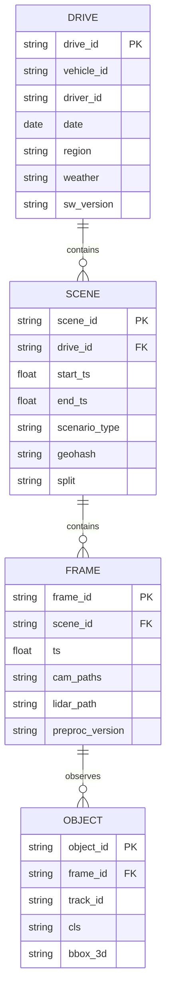
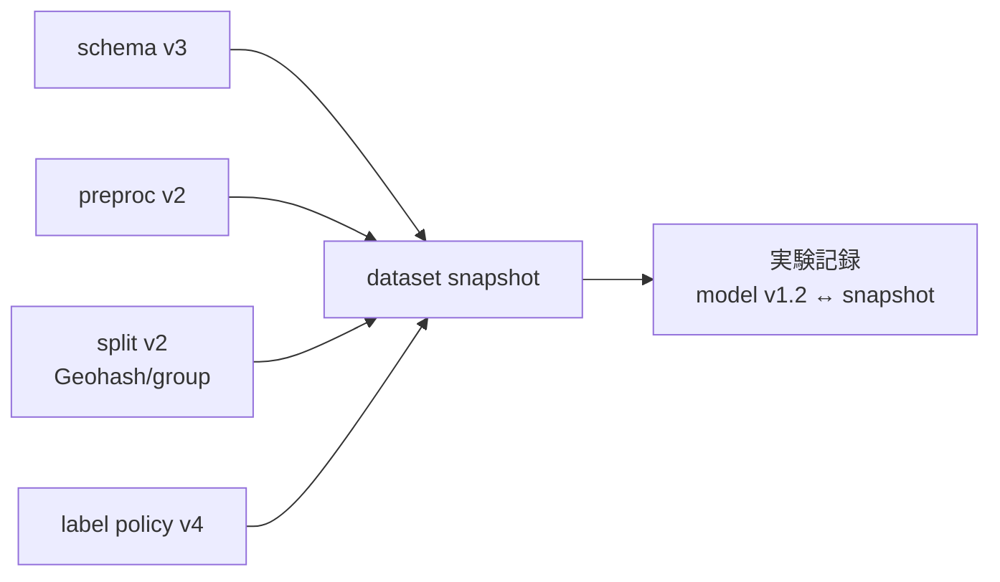

# 4.6 データセットスキーマ・スプリット設計

本節では、データセットスキーマ (dataset schema) と Train / Validation / Test / Long-tail / ODD 別セットのスプリット設計を扱います。Drive→Scene→Frame→Object の階層を ERD で示し、地理的分割、リーク検出、ロングテールセットの定量定義を Closed-Loop の観点で順に説明します。

## データセットスキーマと ERD

自動運転データは「走行 → 区間 → フレーム → 物体」の階層を持ちます。主キー・外部キー・一貫性制約を明示し、スプリットやバージョンをメタデータとして持たせます。

> この図のポイント：`split` を Scene 単位で持たせることで、フレーム単位ランダム分割によるリークを構造的に防げます。`driver_id` / `geohash` / `preproc_version` を保持し、リーク検出とバージョン管理に使います。

## スプリット設計の基本原則

自動運転は時系列・地理的相関が強いため、フレーム単位ランダム分割は過大評価を招きます。**Drive / Scene 単位のグループ分割** を標準とし、走行 ID・車両 ID・日付・地域でグループ化します。Validation（ハイパーパラメータ調整・モデル選択）と Test（最終評価）の役割を分離し、Test へのアクセスを制御して日常開発ループへの情報流入を防ぎます。

## Geohash による地理的スプリット

特定地域を Test 専用にすると、地理的な一般化性能を測れます。緯度経度を **Geohash** （緯度経度を文字列に量子化する手法）でグリッド化し、グリッド単位で Train / Test に割り当てると、隣接シーンの跨りを防げます。

実装は、シーン代表点の緯度経度と分割粒度 `precision`（既定 6、約 1.2 km × 0.6 km）を入力に、Geohash 文字列を計算してその先頭プレフィックスが「Test 専用プレフィックス集合」に含まれるかで Train / Test を割り当てる関数として書きます。Test プレフィックスは事前にリポジトリ管理し、Closed-Loop 中でも安易に変更しないでください。これは評価の安定性確保のためです。

precision=6（約 1.2 km × 0.6 km）は市街地の交差点単位を分離できる粒度ですが、一般道の直線では同一道路の連続区間が同じプレフィックスに収まりやすくなります。安全側に倒すなら precision=5（約 4.9 km × 4.9 km）でブロック分離し、さらに「同一交差点を別日に走行した場合」の弱リーク検出として `(geohash, hour_bucket)` の複合キーを併用するのが実務的です。本書ではリーク検出を 3 段で扱います。

- **(a) 強リーク**：同一 Drive が split を跨ぐ。Frame 単位ランダム分割で発生する。
- **(b) 中リーク**：同一交差点 × 同日 × 別 Drive。
- **(c) 弱リーク**：同一ドライバ × 同月。

precision を上げるほどグリッドが細かくなり、地理的分離が弱まる（隣接漏れ）点に注意してください。市街地は粗め、郊外は細かめのように ODD ごとに調整します。

## リーク検出：時系列・同一ドライバ・交差点

リーク (data leakage) とは、Train セットの情報が Test セットに漏れて、評価指標を実力以上に高く見せてしまう現象です。「同一 Drive」だけでなく「同一ドライバ」「同一交差点」「近接日時」でも起きます。Train と Test の重複キーを機械的に検出するチェッカーを CI に組み込んでください。

実装は、Scene テーブル（`scene_id` `split` `drive_id` `driver_id` `geohash` `date` `vehicle_id` 列）を入力として、`split=train` と `split=test` の各キー集合を比較し、重複の有無を返す関数として書きます。検出キーは次のとおりで、いずれかが空でなければリークとして扱います。

- `drive_id`：同一 Drive が両 split に存在（強リーク）
- `driver_id`：同一ドライバが両 split に存在（運転癖の漏洩）
- `geohash`：同一地理グリッドが両 split に存在（場所依存の過学習）
- `(vehicle_id, date)`：同一車両が同日に両 split に存在（環境条件の漏洩）

戻り値はキーごとの重複サンプル一覧（先頭 20 件程度）と件数です。CI のアサーションで「重複が 1 件でもあれば失敗」と扱うようにすると、スプリット変更を伴う Pull Request で必ず検出できる仕組みになります。判定の運用は次のとおりです。

- **強リーク（drive_id 重複）**：1 件でも検出されたら CI を Fail させ、PR をマージ不可にする。
- **中リーク（driver_id・geohash 重複）**：許容上限を全 Test の 1% 以下とし、超過時は Warning を出してレビュー必須化する。
- **弱リーク（(vehicle_id, date) 重複）**：月次レポートに件数を残し、傾向悪化時にスプリット定義を見直すアラートとする。

| リーク種別 | 原因 | 検出キー | 影響 |
|---|---|---|---|
| 時系列 | 同一 Drive/Scene の跨り | drive_id, scene_id | 強い過大評価 |
| 同一ドライバ | 運転癖の学習 | driver_id | 中程度の過大評価 |
| 地理 | 同一交差点・道路 | geohash | 場所依存の過学習 |
| 近接日時 | 同日・同車両 | vehicle_id+date | 環境条件の漏れ |

## Long-tail セットの定量定義

「ロングテール」を感覚で決めず、定量基準を置きます。代表的な定義は **属性の出現頻度が全体の 1% 未満** のシーン群です。クラス・属性・シナリオの結合頻度で判定します。

$$
\text{is\_longtail}(s) = \mathbb{1}\!\left[\, f(\text{attr}(s)) < \tau \,\right], \quad \tau = 0.01
$$

ロングテールタグ付けの実装は、Scene テーブルと属性列リスト（例：`weather` と `scenario_type`）、頻度閾値 $\tau$（既定 0.01）を入力に、対象列を区切り文字で結合した複合キーごとの正規化頻度を計算し、頻度が $\tau$ を下回るシーンに `is_longtail = True` を立てる処理です。属性列の組み合わせは ODD セル定義と揃え、複合キーの粒度（細かいほどロングテール候補が増える）と $\tau$ の値（小さくするほど厳格）は四半期ごとに見直します。

評価セットは複数系統で管理します。

| 評価スイート | 構成 | 目的 | 用途 |
|---|---|---|---|
| ベースライン Test | 運用分布に近い | 平均性能 | 日常評価 |
| セーフティ Test | ロングテール・ヒヤリハット | 保守性 | リリースゲート（第 8 章） |
| ODD 別 Test | 地域・天候・時間帯別 | 展開妥当性 | ODD 拡張判断 |

インシデント分析や Active Learning（4.8 節）で見つかった新シナリオを適切な Test セットへ追加し、「評価セット自体が成長する」Closed-Loop を作ります。

## バージョニングと再現性

「どのモデルがどのデータセットバージョンで評価されたか」を一意に参照できることが重要です。スキーマバージョン・前処理バージョン（4.5 節）・スプリット定義・ラベルポリシーバージョン（第 5 章）をメタデータとして保持します。実装は DVC / lakeFS / Delta Lake やデータカタログでスナップショット管理します（詳細は 4.10 節）。

> この図のポイント：4 つのバージョン軸を 1 つのスナップショットに束ね、実験と一対一で結ぶことで公平な比較と再現を保証します。

## Closed-Loop におけるスキーマ／スプリット運用

スキーマやスプリットも変化し続けます。ODD 拡張やラベルポリシーの見直しで新クラス・新属性が追加され、新しい Test セットが定義されます。スキーマ変更はマイグレーションスクリプトで管理し、スプリット変更は実験管理ツールと連携して追跡してください。仕様書はデータカタログに集約して組織内で共有します。Test 地域とセーフティセットは安定性のために安易に変えないことも、評価の信頼性を保つ要点です。

### スプリットを「構造で守る」という発想

スプリット設計で最も避けるべきは、「規約として守る」ことです。Frame 単位のランダム分割を「やらないルール」として運用すると、新人やコントラクタの最初の数行のコードでリークが混入し、過大評価された性能が数週間気付かれない、という現象が起きます。Scene 単位の `split` カラムをスキーマに必須化し、Frame 単位ランダム分割が **書こうとしてもスキーマレベルで弾かれる** 状態を作っておく――これが「構造で守る」という設計判断です。同じく Geohash precision=6（約 1.2 km × 0.6 km）で Test 地域を切り出すなら、Test プレフィックス集合をリポジトリ管理し、Safety / ML の合意なしには変更できないようにすることで、評価の安定性を運用ルールではなくコードと PR レビューで担保できます。

リーク検出は強・中・弱の 3 段で扱い、強リーク（drive_id 重複）は CI Fail で完全に堰き止め、中リーク（driver_id・geohash 重複）は許容上限（全 Test の 1% 以下）を超えたら Warning + レビュー必須、弱リーク（vehicle_id × date）は月次レポートに件数を残してトレンド監視に回す、という非対称な扱いが実務的です。これは「すべてのリークをゼロにしようとすると評価セットが取れなくなる」現実に対応するためで、強リークだけは絶対に許さず、それ以外はトレンドで管理するという段階的な厳格さが、評価の信頼性と現実性のバランスを取ります。ロングテールを「出現頻度 < 1%」のような定量基準で定義し月次バッチでタグ付けする運用も、感覚的に「珍しいシーン」を語ると属人化するため、定量化してデータカタログに自動反映する仕組みに置き換える、という思想です。スキーマ・前処理・スプリット・ラベルポリシーの 4 軸を 1 つのスナップショット ID に束ねるのは、実験記録と一対一に結ぶための最終的な接着剤で、これが欠けると「同じ条件での再現」が事実上不可能になります。

## 本節の振り返り

データセットスキーマは Drive → Scene → Frame → Object の階層で設計し、`split` を Scene 単位で持たせることで、Frame 単位ランダム分割によるリークを構造的に防げます。地理的分割は Geohash でグリッド化することで Train / Test の隣接漏れを抑えられますが、precision=6 は市街地の交差点単位を分離する解像度で、一般道直線では同一道路の連続区間が同じプレフィックスに収まりやすいため、ODD ごとに precision を調整する必要があります。リークは時系列・同一ドライバ・地理・近接日時の 4 種をチェッカーで CI 検出し、強・中・弱のリーク種別ごとに非対称な厳格さで扱うことが、評価の信頼性と現実性を両立する鍵です。ロングテールは出現頻度 < 1% のような定量基準で定義し、ベースライン / セーフティ / ODD 別の複数評価スイートを並行運用することで、平均性能と最悪ケース保守性を別々に追跡できます。スキーマ・前処理・スプリット・ラベルポリシーの 4 軸を 1 つのスナップショットに束ね、実験記録と一対一で結ぶことが、Closed-Loop における再現性の最後の支柱になります。

## 次節への橋渡し

スキーマと評価セットが整うと、「弱点セグメントのシーンをどう素早く見つけるか」が次の鍵になります。次の 4.7 節では、シーン検索 UI と自然言語クエリを、CLIP / OpenCLIP / DINOv2 / EVA-CLIP / SigLIP の比較、FAISS / Milvus / pgvector の選定、Recall@K / mAP / NDCG による検索品質評価まで含めて扱います。
