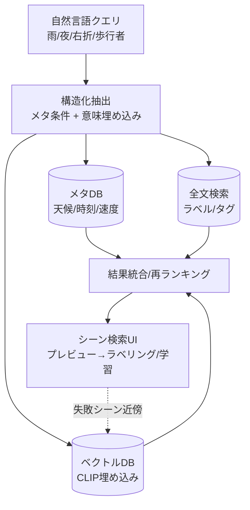

# 4.7 シーン検索 UI と自然言語・ラベル検索

本節では、シーン検索 UI と自然言語・ラベル検索を扱います。「雨の夜の合流」のような自然言語クエリを実現する視覚言語モデルの比較、ベクトル検索基盤の選定、検索品質の評価指標を Closed-Loop の観点で順に説明します。必要なシーンへ素早く到達できるかどうかは、エラー分析・データ選択・Active Learning の効率を大きく左右します。

## 検索アーキテクチャの三層

実務のシーン検索は「メタデータ層・全文検索層・ベクトル検索層」の三層で構成し、自然言語クエリを各層へルーティングします。

> この図のポイント：構造化条件（SQL で厳密フィルタ）と意味的類似（ベクトルで曖昧検索）を併用し、再ランキングで統合することが精度・再現率の両立につながります。

## 視覚言語モデルの比較

自然言語シーン検索の中核は **埋め込みモデル (embedding model)** です。埋め込みモデルとは、画像やテキストを共通の高次元ベクトル空間に写像するモデルで、空間中の距離が「意味的な近さ」と対応するように学習されています。テキスト-画像対比で検索するなら CLIP 系、自己教師あり特徴で類似画像検索をするなら DINOv2 [P16](references#p16) が適しています。

| モデル | 学習方式 | 損失 | 強み | 自動運転での用途 |
|---|---|---|---|---|
| **CLIP** [P17](references#p17) | 画像-テキスト対比 | InfoNCE (softmax) | テキスト検索の標準 | 自然言語シーン検索 |
| **OpenCLIP** | 同上 (LAION で再現) | InfoNCE | 重み公開、規模可変 | 社内 fine-tune の土台 |
| **DINOv2** [P16](references#p16) | 自己教師あり蒸留 | 自己蒸留 | ラベル不要の強い視覚特徴 | 類似画像/近傍検索 |
| **EVA-CLIP** | CLIP + MIM 初期化 | InfoNCE | 大規模で高精度 | 高精度テキスト検索 |
| **SigLIP** | 画像-テキスト | Sigmoid pairwise | 大バッチ不要・安定 | 効率的な検索基盤 |

SigLIP は softmax を sigmoid ペア損失に置き換え、巨大バッチなしでも学習が安定する点が実務上の利点です。DINOv2 はテキストを介さない「画像から画像」の近傍検索（失敗シーンに似たシーンを抽出するなど）で特に有効です。

実装は、OpenCLIP の事前学習済み ViT-L-14（LAION-2B 学習済み重み）と同梱の前処理関数・トークナイザを読み込み、テキスト用と画像用の 2 つの推論関数を用意します。テキスト関数はクエリ文字列を受け取り、トークン化 → エンコーダで特徴量化 → L2 正規化 → `float32` の NumPy 配列として返します。画像関数も同じく既定の前処理（リサイズ・センタークロップ・ToTensor・正規化）を適用し、画像エンコーダで埋め込み → L2 正規化して返します。

L2 正規化はコサイン類似度を内積で計算するための定石で、ベクトル DB の `vector_cosine_ops` インデックスとの整合にも必要です。

## ベクトル検索基盤の選定

数千万〜数億シーン規模では Approximate Nearest Neighbor (ANN) が必須です。代表的な選択肢を比較します。

| 基盤 | 形態 | インデックス | スケール | 強み |
|---|---|---|---|---|
| **FAISS** | ライブラリ | IVF-PQ, HNSW | 単機〜数億 | 最速級、GPU 対応 |
| **Milvus** | 分散サービス | HNSW, IVF, DiskANN | 数十億 | 水平分散、運用機能 |
| **pgvector** | PostgreSQL 拡張 | HNSW, IVFFlat | 数千万 | メタ条件と SQL 一体 |
| Annoy / hnswlib | ライブラリ | 木 / HNSW | 数千万 | 軽量・組み込み |

選定の目安：**メタ条件と類似検索を 1 クエリで結合したい → pgvector**、**最大スループット・GPU → FAISS**、**数十億・多テナント運用 → Milvus**。pgvector は SQL の `WHERE`（天候・時刻）と `<=>`（コサイン距離）を同時に書けるため、シーン検索 UI のバックエンドとして実装が簡潔です。

pgvector を使う場合、Scene テーブルの埋め込み列に対し HNSW インデックスをコサイン類似度（`vector_cosine_ops`）で構築しておき、クエリ時には「天候 = rain」「時刻が 18 時から 23 時」のような厳密フィルタを `WHERE` 句で先に効かせ、`ORDER BY embedding <=> :q` で意味的近傍順にソート、上位 200 件などを返す構成にします。`<=>` 演算子はコサイン距離を返すため、表示用の類似度は $1 - \text{distance}$ で表現できます。SQL 一発でメタ条件と類似検索を結合できる点が、シーン検索 UI のバックエンドとして実装が簡潔になる理由です。

FAISS を使う場合は、メモリ効率を重視するなら IVF-PQ を選びます。具体的には次の手順で構築します。

1. 量子化器として内積インデックス (`IndexFlatIP`) を作成する。
2. 量子化器をベースに `IndexIVFPQ` を、クラスタ数 `nlist=4096`、サブベクトル数 `m=64`、各サブベクトル 8 ビットで作成する。
3. シーン埋め込み行列で `train` → `add` を呼ぶ。
4. クエリ時は `nprobe` を 32 程度に設定し、検索精度と速度のバランスを取る。
5. クエリ埋め込み（例：`"rainy night highway merge"` をテキストエンコーダで埋め込んだベクトル）に対し `search(k=200)` で近傍を取得する。

`nlist` と `nprobe` はデータ規模・許容レイテンシでチューニングし、Recall@100 のような指標で回帰テストします。

## 検索品質の評価

検索は「それっぽい」では不十分で、定量評価が必要です。代表的な指標は次のとおりです。

- **Recall@K**：上位 $K$ 件に正解がどれだけ含まれたかの割合。
- **mAP**：順位を考慮した平均適合率。順位を上げて返すべき結果が上位にあるほど高い。
- **NDCG@K**：関連度に段階（0〜3 など）がある場合の正規化指標。理想順序を 1 として正規化する。

$$
\text{Recall@}K = \frac{|\,\text{relevant} \cap \text{top-}K\,|}{|\text{relevant}|}, \qquad
\text{NDCG@}K = \frac{\text{DCG@}K}{\text{IDCG@}K},\ \ \text{DCG@}K=\sum_{i=1}^{K}\frac{2^{rel_i}-1}{\log_2(i+1)}
$$

NDCG の式の意味は「上位ほど割引が小さい順位重みで関連度を累積し、理想順序の累積で割った相対値」です。

実装は、検索結果の ID リスト `retrieved` と、正解 ID 集合 `relevant`（Recall@K 用）または ID から関連度 0〜3 への辞書 `rel_map`（NDCG 用）を入力に取ります。Recall@K は上位 $K$ 件と正解集合の積集合のサイズを、正解集合のサイズで割ります。NDCG@K はゲイン $2^{rel_i}-1$ を順位 $i$ に応じて $\log_2(i+1)$ で割って累積した DCG を、理想順序での DCG（IDCG）で正規化した値を返します。

これらをクエリ集合（人手で正解付けした 50〜200 件のクエリ）に対して計算し、平均値をモデルやインデックス変更ごとに回帰テストすると、検索品質の劣化を早期に検知できます。

## Closed-Loop とシーン検索の連携

シーン検索はエラー分析・Active Learning・シミュレーションの入口です。具体的には次のような使い方をします。

- 失敗ケースを UI で再現し、DINOv2 埋め込みで近傍を集約する。
- 弱点 ODD を自然言語やメタ条件で指定し、追加候補を抽出する。
- 第 7 章のシナリオ生成のため、実ログから代表シーンを検索する。

検索結果をそのまま「学習データセット候補」としてエクスポートし、4.6 節のデータセット管理に登録できるようにすると、データ中心の改善サイクルが高速化します。UI は単なるビューアではなく、ラベリング依頼・シナリオ生成・学習ジョブ起動への入口として設計するのが要点です。

### シーン検索を「他システムへの入口」として設計する思想

シーン検索の設計で最も誤解されやすいのは、「単なるシーン閲覧 UI」として作ってしまうことです。検索 UI は単独で価値を出すツールではなく、エラー分析・Active Learning・シナリオ生成・学習ジョブ起動への **入口** として位置付けたとき、Closed-Loop の中で最大の効果を発揮します。検索結果をそのまま「学習データセット候補」としてエクスポートし、Active Learning の種シーンや 4.6 節のデータセット管理に直結させる構造になっていれば、「失敗ケースを再現 → 近傍を集約 → 学習に追加」という一連の流れが数クリックで完結します。逆に、検索が独立したアプリとして孤立すると、結果を CSV で吐き出して別のジョブに渡すような手作業が増え、改善サイクルの速度を律速します。

埋め込みモデルの選択も、安易に「最新の SOTA を採る」と失敗します。CLIP / EVA-CLIP / SigLIP はテキスト検索向き、DINOv2 はテキストを介さない画像近傍検索向きで、用途を混在させると精度が両側から崩れます。SigLIP の利点は softmax を sigmoid ペア損失に置き換えたことで巨大バッチなしに安定学習できる点にあり、社内 fine-tune の現実性を考えるとここが効きます。検索品質は Recall@K と NDCG@K の回帰テストを 50〜200 件の正解付きクエリ集合で常時走らせる必要があり、これがないと埋め込みモデルやインデックスを更新するたびに「気付かない劣化」が混入します。pgvector / FAISS / Milvus の選定基準も、SQL の WHERE 句でメタ条件と類似検索を結合したいか、最大スループットを取りたいか、数十億スケールで分散運用したいかで分岐し、設計を曖昧にすると後から移行コストが膨れます。

## 本節の振り返り

シーン検索はメタデータ・全文検索・ベクトル検索の三層で構成し、構造化条件（厳密フィルタ）と意味的類似（曖昧検索）を再ランキングで統合することで、精度と再現率を両立できます。テキストベースの自然言語シーン検索には CLIP / EVA-CLIP / SigLIP、画像から画像への近傍検索には DINOv2 [P16](references#p16) が適しており、特に SigLIP は大バッチ不要で安定するため社内 fine-tune の土台として現実的です。ベクトル検索基盤は pgvector（SQL とメタ条件を一体で書ける手軽さ）・FAISS（最速級・GPU 対応）・Milvus（数十億スケールの分散運用）の中から、「データ規模 × メタ条件結合の必要性 × GPU 利用可否」の 3 軸で選びます。検索品質は Recall@K / mAP / NDCG@K による回帰テストで継続的に監視し、劣化を早期検知することが、自然言語クエリへの信頼を保つ前提です。そしてシーン検索 UI は単独のビューアではなく、エラー分析・Active Learning・シナリオ生成・学習ジョブ起動への入口として位置付けることで初めて、データ中心の改善サイクルを高速化する装置になります。

## 次節への橋渡し

検索で「狙ったシーン」を取れるようになったら、次は「モデルにとって最も学習価値が高いシーンを自動で選ぶ」段階です。次の 4.8 節では、Active Learning とカバレッジギャップ把握を、BALD / Core-set / BADGE / Learning Loss Prediction の数式と Python、MC Dropout、Curriculum Learning まで含めて扱います。
