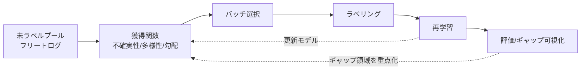

# 4.8 アクティブラーニングとカバレッジギャップ把握

本節では、アクティブラーニング (active learning、AL) とカバレッジギャップの把握を扱います。「どのデータを追加で集めるべきか」を定量的に決める Closed-Loop の中核を、獲得関数・不確実性推定・レアシナリオ発見の順に組み立てます。

## アクティブラーニングとは

アクティブラーニング (Active Learning) とは、未ラベルデータの集合（プール）の中から「学習に最も寄与しそうなサンプル」をモデル自身に選ばせ、そこだけにラベル予算を投じる学習戦略です。「ラベルを付ける順序を最適化する」ことで、同じラベリング工数でも到達精度を引き上げられる点が利点です。自動運転では未ラベルログが PB 級になりやすく、フリート全体に均等にラベルを振る運用は現実的でないため、AL の効率化効果が特に大きく効きます。

選択基準は大きく **不確実性 (uncertainty)・多様性 (diversity)・勾配寄与 (gradient)** の 3 系統に分かれます。

> この図のポイント：AL は単発でなく、再学習したモデルで獲得関数を更新し続ける反復ループです。評価で見えたギャップ領域を次ラウンドの選択に反映します。

| 手法 | 系統 | 獲得関数の核 | 計算量 | バッチ多様性 |
|---|---|---|---|---|
| Uncertainty/Entropy | 不確実性 | 予測エントロピー | 低 | なし（冗長になりがち） |
| Margin | 不確実性 | top1-top2 差 | 低 | なし |
| **BALD** [AL1](references#al1) | 不確実性(認識的) | 相互情報量 | 中(MC) | 弱 |
| **Core-set** [AL2](references#al2) | 多様性 | 被覆半径最小化 | 中〜高 | 強 |
| **BADGE** [AL3](references#al3) | 勾配+多様性 | 勾配埋め込み k-means++ | 中 | 強 |
| **Learning Loss** | 損失予測 | 予測損失の大きさ | 低(推論時) | 弱 |

## 不確実性：MC Dropout と BALD

**MC Dropout (Monte Carlo Dropout)** [AL4](references#al4) は、推論時もドロップアウトを有効にしたまま $T$ 回前向き計算し、予測分布のばらつきを近似ベイズの不確実性とみなす手法です。予測平均は $\bar{p}_c = \frac{1}{T}\sum_t p_c^{(t)}$ となります。

**BALD (Bayesian Active Learning by Disagreement)** [AL1](references#al1) は、**認識的不確実性（モデルが知らないこと、epistemic uncertainty）** を、予測と重みの相互情報量で測る指標です。全体エントロピー（$T$ 回平均後のエントロピー）から、期待エントロピー（各サンプリングのエントロピーの平均）を引いた差を取ります。差が大きいのは「予測はばらつくが各サンプリングは自信を持つ」状態、つまりモデル間で不一致が大きい点で、ラベルを付ければモデルが学べる余地が大きいサンプルを意味します。

$$
\mathbb{I}[y,\theta\mid x] \;=\; \underbrace{H\!\left[\tfrac{1}{T}\sum_t p^{(t)}\right]}_{\text{全体の不確実性}} \;-\; \underbrace{\tfrac{1}{T}\sum_t H\!\left[p^{(t)}\right]}_{\text{偶然誤差（データノイズ）}}
$$

実装は、モデルを `eval` モードに置きつつ Dropout 層だけ `train` モードに戻す（推論時にもサンプリングを起こす）ヘルパを用意し、入力バッチ $x$ に対し $T$ 回（典型値 20）前向き推論して softmax 確率を $(T, B, C)$ のテンソルに積み上げます。スコアは次の手順で計算します。

1. $T$ 回の確率の平均 $\bar p$ を取り、その softmax エントロピーを「全体の不確実性」$H[\bar p]$ として算出する。
2. 各サンプリング $t$ ごとの softmax エントロピーを計算し $T$ で平均して「期待エントロピー」$\mathbb{E}_t[H[p^{(t)}]]$ を得る。
3. 両者の差を BALD（相互情報量）として返す。

数値安定化のため確率値は `clamp_min(1e-12)` で下限を切ります。$T$ を大きくすると推定が安定するかわりに計算コストが増えます。$T=10\sim20$ から始めて、選択候補の Recall が安定する値に調整してください。

BALD はデータノイズ由来の偶然誤差 (aleatoric uncertainty) を差し引くため、Entropy 単独より「ラベルを付ければモデルが改善する」点を選びやすいのが利点です。

## 多様性：Core-set

**Core-set** [AL2](references#al2) は、選んだ集合が未ラベルプール全体を埋め込み空間で「半径最小に被覆」するように選ぶ手法です。冗長な類似サンプルの重複選択を避けたいバッチ AL（一度に複数を選ぶ AL）に向きます。実用上は貪欲な k-Center 法で近似します。

$$
\min_{S:\,|S|=b}\ \max_{x \in \mathcal{U}}\ \min_{s \in S}\ \lVert \phi(x) - \phi(s) \rVert_2
$$

式の意味は「サイズ $b$ の集合 $S$ を選び、プール上の任意の点から $S$ への最短距離の最大値（被覆半径）を最小化する」というものです。

実装は、未ラベルプール全体の埋め込み行列 $(N, D)$、既にラベル済みのインデックス集合、追加で選びたい点数 `budget` を入力に取ります。手順は次のとおりです。

1. 各点について「ラベル済み点群への最短距離」を初期化する（無限大で初期化し、ラベル済み点ごとにユークリッド距離で minimum 更新）。
2. 最短距離が最大となる点を選んで追加し、その点との距離で全点の最短距離を再度 minimum 更新する。
3. budget 回繰り返して `picked` リストを返す。

これにより「現在カバーされていない最も遠い点を順次追加する」貪欲被覆が得られ、バッチ AL の冗長選択を抑えられます。プールが大きい場合は埋め込み次元を PCA で 64〜128 次元に落として高速化します。

## 勾配と多様性の両立：BADGE

**BADGE (Batch Active learning by Diverse Gradient Embeddings)** [AL3](references#al3) は、最終層の **勾配埋め込み (gradient embedding)** を計算し、その空間で k-means++ により初期点を選ぶ手法です。勾配埋め込みは「予測ラベルを正解と仮定したときの損失勾配」の形を取り、勾配の大きさ（不確実性に対応）と方向の多様性を同時に捉えるハイブリッドな選び方になります。勾配埋め込みは次の式で表されます。

$$
g_x = (\,\hat{p}_c - \mathbb{1}[c=\hat{y}]\,)\,\phi(x)
$$

実装は、各サンプルの予測確率 $(N, C)$ と最終層への入力特徴量 $(N, D)$ を入力に取ります。サンプルごとに「予測ラベルを正解と仮定したときのクロスエントロピー損失の、最終層パラメータに対する勾配」$g_x = (\hat p - \text{onehot}(\hat y))\otimes \phi(x)$ を計算し、$(N, C\!\times\! D)$ の行列として返します。具体的には予測確率と擬似 one-hot の差 $(N, C)$ と入力特徴 $(N, D)$ をブロードキャスト外積し、最後の 2 軸を平坦化します。得られた $(N, C\!\times\! D)$ 行列に対し k-means++ の初期化を適用すると、勾配が大きく（不確実）、かつ方向が異なる（多様）バッチが選ばれます。

## 損失予測：Learning Loss Prediction

**Learning Loss Prediction** [AL7](references#al7) は、本体ネットワークに小さな「損失予測モジュール」を付け、各サンプルの損失を回帰する手法です。推論時にラベル不要で「損失が大きそうな ＝ 難しいサンプル」を選べるため、MC 反復が不要で高速です。タスク非依存（検出・セグメント・回帰のいずれにも適用可能）な点も実務向きです。

## マルチタスク AL とバッチ選択

自動運転は Perception / Prediction / Planning が同居します。タスクごとの獲得スコアを正規化して重み付き合成し、シーン単位で集約します（フレーム単位だと類似フレームが偏在）。

マルチタスク AL のスコア統合は、Perception / Prediction / Planning それぞれで計算した獲得スコアベクトルを Z スコア化（平均 0、標準偏差 1）した上で、運用上の重み（例：Perception 0.5、Prediction 0.3、Planning 0.2）で重み付き和を取り、シーン単位スコアとして出力します。Z スコア化はタスク間でスコアスケールが大きく異なるため必須で、これを省くと最大スケールのタスクに支配されてしまいます。最終バッチ選択は「統合スコア降順で上位を仮取得 → Core-set または BADGE で多様性を担保」の 2 段構成にすると、不確実性と多様性を両立できます。

## Curriculum Learning

Curriculum Learning [AL8](references#al8) は「簡単な例から難しい例へ」段階的に学習させ、収束と汎化を改善します。AL とは逆方向（AL は難しい例を集める）ですが、**AL で集めた難例を、難易度スコア順に段階投入する** と相補的に働きます。難易度は損失・不確実性・遮蔽度などで定義します。

Curriculum Learning の pacing 関数は、サンプルごとの難易度スコアと現在のエポック・最大エポックを入力に、エポックが進むほど高い難易度分位点までを露出させるインデックス集合を返します。たとえば「初期は難易度下位 30% のみ、最終エポックでは 100% まで」と線形に閾値を引き上げ、その閾値以下のサンプルだけを学習対象とします。難易度はモデル損失・予測エントロピー・遮蔽度などで定義し、AL で集めた難例を段階的に投入することで、難例ばかり学ばせて発散するリスクを抑えながら最終的なロングテール性能を底上げできます。

## ODD ギャップ可視化とレアシナリオ発見

ODD セグメント別にデータ量（シーン / フレーム / インスタンス）と性能指標を並べ、「真のデータ不足」と「モデリング問題」を切り分けます。BI ツール（Superset / Tableau）で ODD × シナリオ × 指標のヒートマップを作ると直感的に把握できます。

未定義の潜在シナリオは、シーン埋め込みに UMAP + HDBSCAN を適用して自動発見します。**HDBSCAN (Hierarchical DBSCAN)** は密度ベースのクラスタリング手法で、クラスタ数を事前に指定する必要がなく、密度が低い点をノイズとして分離できます。k-means より自動運転のロングテール発見に適しています。

実装の手順は、シーン埋め込み（CLIP / DINOv2 などで得た数百次元ベクトル）を入力に、UMAP で 10 次元程度に次元削減し（`n_neighbors=30`、`min_dist=0.0` がクラスタ分離向きの設定）、その出力に HDBSCAN を適用してクラスタラベルを得る、という流れです。`min_cluster_size`（既定 30）以下のクラスタやノイズ点（ラベル -1）を「レアシナリオ候補」として抽出し、代表シーンをアノテーション担当者が確認して命名・優先度付けします。命名されたシナリオは ODD セルの新規定義としてスキーマに登録し、次ラウンドの AL 獲得関数や評価セット設計に反映させます。

## AL ライブラリと Closed-Loop の位置づけ

| ライブラリ | 特徴 | 主な手法 |
|---|---|---|
| **modAL** | scikit-learn 互換、軽量 | Uncertainty / Margin / Committee |
| **BAAL** | PyTorch、ベイズ AL | MC Dropout / BALD |
| **ALiPy** | 研究向け多数手法 | 30+ クエリ戦略 |

これらを参考にしつつ、自社データ構造と MLOps に合わせたカスタムパイプラインを組むのが一般的です。AL ループは「モデル適用 → スコア集計 → 候補選択 → ラベリング → 再学習 → 再評価」のサイクルで、4.7 節のシーン検索 UI で人手確認を挟み、データセット管理・実験管理（4.6 節・第 6 章）で「どのラウンドで何を追加し、性能がどう変わったか」をトレースします。選択ポリシーをコード化して追跡可能にすることが、再現性ある Closed-Loop の前提です。

### AL ループをいつ止めるか――終了条件の設計判断

AL を「止め時のない無限ループ」として運用すると、ラベル予算が指標改善に対して大幅に逓減する局面で投資が空回りします。実運用では、(1) 直近 3 ラウンドで主要評価指標（Long-tail mAP / NDS）の改善幅が事前定義しきい値（例：+0.005 NDS）未満、(2) 残予算が次ラウンドの最小ロット未満、(3) 監視中のカバレッジ指標（ODD セグメント別のサンプル充足率）がすべて目標達成、という 3 条件のいずれかが満たされたらラウンドを止めるのが定石です。これらの条件を頭の中ではなくコード（`should_stop()` のような関数）として実装し、Pull Request の CI から呼び出せる状態にしておくと、AL の継続/停止判断が個人裁量から自動化された監査対象に切り替わります。

### 獲得関数とマルチタスク統合の落とし穴

獲得関数の選択で陥りがちな失敗は、不確実性スコア（BALD など）だけで選ぶことです。BALD は確かに「ラベルを付ければ学べる余地が大きい」点を選びますが、バッチ AL では似た不確実点が固まって選ばれ、冗長性が高くなります。これを Core-set や BADGE で多様性担保する 2 段構成にしないと、ラベル予算の半分が同じパターンの繰り返しに費やされます。逆に多様性だけで選ぶと、「珍しいけれどモデルが既に解けている点」を選んでしまい、性能改善に寄与しません。「不確実性スコアで上位を仮取得 → Core-set で多様性を担保」という 2 段が効果的なのは、認識的不確実性と被覆性の両方を直列に担保するためです。

マルチタスク AL では、Perception / Prediction / Planning のスコアスケールが大きく異なるため、Z スコア化を省くと最大スケールのタスクにスコアが支配されます。運用重み（例：Perception 0.5、Prediction 0.3、Planning 0.2）で重み付き和を取るのは正規化後の話で、ここを混ぜると「Perception だけが最適化される AL」が静かに走ることになります。HDBSCAN で発見した未命名クラスタを月次レビューし、命名済みのものを ODD セルとしてスキーマに登録する運用も、潜在シナリオを「発見しっぱなし」にせず、ODD ギャップ把握・評価セット設計・次ラウンドの獲得関数へ反映する経路を作るためです。各 AL ラウンドで「追加サンプル数」「ラベル工数」「指標改善幅」を Closed-Loop 台帳に記録すると、AL の ROI が可視化され、終了条件の閾値を実データで再校正できる状態になります。

## 本節の振り返り

獲得関数は不確実性（Entropy / BALD）・多様性（Core-set）・勾配（BADGE）・損失予測（Learning Loss）の 4 系統に整理でき、それぞれが「何を捉えたいか」で異なる役割を担います。BALD [AL1](references#al1) は MC Dropout [AL4](references#al4) の予測を相互情報量に通し、データノイズ由来の偶然誤差を差し引いて認識的不確実性だけを抽出することで、「ラベルを付ければモデルが学べる」点を Entropy 単独より精緻に選べます。バッチ AL では不確実性スコアで仮取得した上で Core-set または BADGE で多様性を担保する 2 段構成が、認識的不確実性と被覆性を直列に確保するうえで効果的です。Curriculum Learning は AL とは逆方向（簡単な例から難しい例へ）ですが、AL で集めた難例を難易度順に投入することで、難例ばかり学ばせて発散するリスクを抑えつつロングテール性能を底上げできます。未定義の潜在シナリオは UMAP + HDBSCAN で自動発見し、ODD ギャップ可視化と組み合わせて重点領域を決めることで、データ中心開発の改善サイクルが「既知の弱点を埋める」段階から「未知の弱点を発見する」段階へ進化します。

## 次節への橋渡し

AL で「足りない領域」を特定しても、実走行で十分なロングテールを集めきれないことがあります。次の 4.9 節では、その不足を埋める合成データと生成モデルを、NeRF / 3D Gaussian Splatting / 拡散モデル + ControlNet / GAIA-1 / DriveDreamer の比較、Domain Randomization、Sim2Real ギャップの Wasserstein 評価まで含めて扱います。
