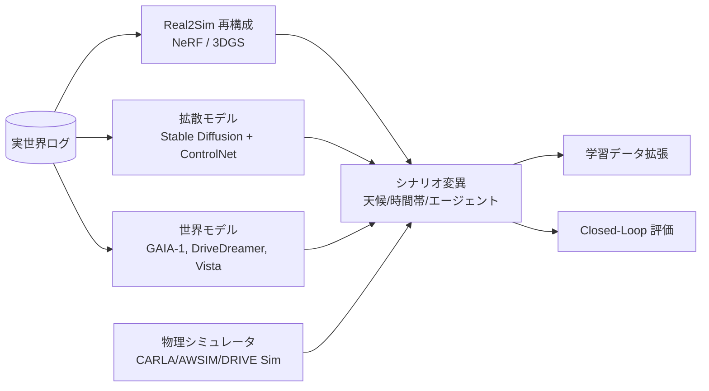
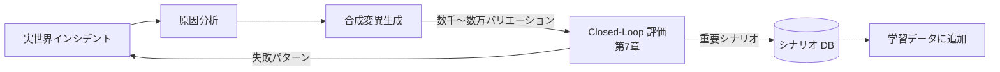

# 4.9 合成データと生成モデルの位置づけ

本節では、不足シーンを補完するための **合成データ (synthetic data) と生成モデル** を、最新の手法を含めて整理します。**合成データとは、実走行ではなくシミュレータや生成モデルから作り出した学習・評価用データ** のことで、ロングテール（実走行ではめったに出会わない事象）の濃縮や危険シナリオの安全な学習に用います。生成モデルの比較、Domain Randomization、Sim2Real ギャップ評価、Domain Adaptation、第 7 章との接続を順に説明します。

## 合成データ源の全体像

> **図 4.9.1**：合成データ源の全体像。実ログ → 再構成 → 変異 → 学習・評価のループが、近年の主流アプローチです。

## 生成モデル比較表

| カテゴリ | 代表手法 | 主入力 | 出力 | 強み | 弱み |
|---|---|---|---|---|---|
| **NeRF 系** | Block-NeRF [W6](references#w6), NeuralSim | 大量走行ログ | 都市規模 3D シーン | 静的シーンの幾何 | 動的物体・更新 |
| **3DGS 系** | 3DGS [W7](references#w7), Street Gaussians [W8](references#w8), DrivingGaussian [W9](references#w9) | 多視点映像 | リアルタイム描画 3D | 高速描画、動的物体 | 大規模化挑戦 |
| **画像拡散** | Stable Diffusion + ControlNet, GLIGEN | テキスト + 構造 | 単フレーム画像 | 高品質、制御性 | 時系列一貫性 |
| **BEV 生成** | BEVGen, BEVControl | レイアウト | BEV / 多視点画像 | BEV 学習に直結 | 高解像度化挑戦 |
| **動画生成** | GAIA-1 [W1](references#w1), Vista [W4](references#w4), MAGVIT 系 | 動画 + 行動 | 連続動画 | 時系列・行動条件付き | 計算コスト大 |
| **世界モデル** | DriveDreamer [W2](references#w2), DriveDreamer-2 [W3](references#w3) | 行動 + 構造化 | 動画 + 状態 | LLM プロンプトで多様 | 評価困難 |
| **点群生成** | LiDARGen, R2DM | LiDAR | 点群 | 形状一貫性 | 反射・強度の現実感 |
| **物理シミュレータ** | CARLA [Sim1](references#sim1), AWSIM [Sim2](references#sim2), DRIVE Sim [Sim3](references#sim3) | シナリオ DSL | センサ・物理 | 制御性、物理整合性 | 視覚リアリズム |
| **ニューラルシミュレータ** | UniSim [W5](references#w5), MARS [W10](references#w10) | 実ログ | 仮想センサ再生 | Real2Sim 高忠実 | 専用学習が必要 |

## NeRF / Gaussian Splatting：Real2Sim の主役

実世界ログから 3D シーンを再構成する手法は、ここ 2 年で **NeRF → 3D Gaussian Splatting (3DGS)** に主役が移っています。**NeRF (Neural Radiance Fields)** は座標から放射輝度を返すニューラルネットでシーンを表現する手法、**3DGS** は多数の 3D ガウス点で空間を表現してリアルタイム描画を実現する手法で、両者とも「実世界ログから仮想センサで再撮影できる空間を作る (Real2Sim)」役割を担います。

| 観点 | NeRF（Block-NeRF 系） | 3DGS（Street/DrivingGaussian 系） |
|---|---|---|
| 描画速度 | 数秒/フレーム | リアルタイム（30+ fps） |
| 学習時間 | 数時間〜日 | 数十分〜数時間 |
| 動的物体 | 限定的 | 4D 拡張で対応 |
| メモリ | 小（重み） | 大（点群） |
| 用途 | 静的シーン高品質 | 動的シーン + リアルタイム |

3DGS による走行シーン再構成は、graphdeco-inria/gaussian-splatting などの公開実装を流用するのが現実的です。入力は同一地域を走った複数走行のマルチカメラ画像群とキャリブレーション済みカメラパラメータ（位置・姿勢・内部行列）で、初期点群として LiDAR 点群を与えると収束が速まります。学習設定の典型値は、球面調和関数の次数 3、総反復 30,000、点群を細分化する `densify_until` を 15,000 ステップとします。出力は Gaussian の位置・スケール・回転・色・不透明度を含む `.ply` ファイルで、CARLA や AWSIM のニューラルレンダラに統合してシミュレーション空間として再利用できます。動的物体は別系統（4D 拡張・Street Gaussians 系）で扱い、静的背景と分離して再構成するとアーティファクトを抑えられます。

## 拡散モデルによるシーン変換

ControlNet + Stable Diffusion による天候変換は、Hugging Face Diffusers の `StableDiffusionControlNetPipeline` に、セマンティックセグメンテーション制御の ControlNet（例：`control_v11p_sd15_seg`）と SD1.5 系の base モデルを GPU 上 fp16 で読み込み、入力としてセグメンテーションマップを渡し、テキストプロンプト（例：「rainy night street, headlights, wet road」）で天候・時間帯を指定する構成にします。推論ステップ 30、`controlnet_conditioning_scale=1.1`、`guidance_scale=7.5` あたりが汎用的な初期値です。出力は実世界の幾何・配置を保ったまま、天候・時間帯・季節だけを変えた画像となり、Sim2Real ギャップを抑えつつデータ多様性を増やせます。生成画像はラベル（セグメント）を流用できるため、再ラベリングのコストがかからない点も実務上の利点です。

セマンティックセグメンテーション（または BEV レイアウト）を制御条件として与えることで、**「実世界の幾何・配置を保ったまま、天候・時間帯・季節だけを変える」** ことが可能です。これは Sim2Real ギャップを抑えつつデータ多様性を増やす実用的アプローチです。

## 世界モデル：GAIA-1, DriveDreamer, Vista

世界モデル系は「**動画生成タスクとしての自動運転**」と捉え直す試みです。

| 手法 | 主入力 | 主出力 | 特徴 |
|---|---|---|---|
| GAIA-1 [W1](references#w1) | 動画 + 行動 + テキスト | 連続動画フレーム | テキストプロンプトで多様シーン生成 |
| DriveDreamer [W2](references#w2) | 行動 + 構造化シナリオ | 動画 | シナリオ DSL 連携 |
| DriveDreamer-2 [W3](references#w3) | LLM 強化 | 多様運転動画 | 自然言語で複雑シナリオ |
| Vista [W4](references#w4) | 動画 + 制御 | 高忠実度動画 | 多様な制御信号で予測 |

## Domain Randomization の実装

**Domain Randomization (DR)** は、合成シーン生成時に照明・テクスチャ・トラフィックなどのパラメータを広い範囲で乱数化することで、実世界の未知条件にもロバストなモデルを学習させる手法です。実装は、シナリオ起動ごとに乱数生成器から各パラメータをサンプリングし、物理シミュレータに渡す辞書を返す関数として書きます。

サンプリング範囲は次表のとおり、照明・天候・テクスチャ・トラフィック・センサノイズの 4 カテゴリで設定します。連続値（太陽高度、路面湿潤度、albedo、ブラー画素数、ISO ノイズ、LiDAR ドロップアウト率）は一様分布、離散値（霧密度、降雨量）はあらかじめ用意した代表値の集合から等確率で選びます。台数や歩行者数のような整数値は、整数一様分布で生成します。乱数シードはシナリオ実行のメタデータに記録し、再現できるようにします。

| カテゴリ | パラメータ範囲 | 目的 |
|---|---|---|
| 照明・天候 | 太陽高度 -10〜90°、霧 0〜0.6、降雨 0〜0.9 | 夜間・悪天候ロバスト性 |
| テクスチャ | 路面 albedo 0.05〜0.4、湿潤度 0〜1.0 | 反射・濡れ路面 |
| トラフィック | 車両 0〜60、攻撃的運転 0〜30% | 異常運転・密集 |
| センサノイズ | モーションブラー 0〜3 px、ISO 0〜5%、LiDAR dropout 0〜5% | センサ劣化 |

## Sim2Real ギャップの定量評価

### 主要指標

| 指標 | 定義 | 用途 |
|---|---|---|
| **FID（Frechet Inception Distance）** | Inception 特徴の分布距離 | 画像視覚品質 |
| **Wasserstein 距離** | 最適輸送による分布距離 | センサ値・統計量 |
| **KL Divergence** | 確率分布の非対称距離 | 行動・軌道分布 |
| **MMD** | カーネル平均差 | 高次元特徴量 |
| **Per-class Performance Drop** | 合成 → 実 のクラス別 mAP 劣化 | タスク直結評価 |

各指標の意味は次のとおりです。

- **FID (Fréchet Inception Distance)**：Inception 特徴空間で実画像分布と合成画像分布の距離を測る。値が小さいほど視覚品質が近い。
- **Wasserstein 距離**：「ある分布を別の分布に変形するのに必要な最小の輸送コスト」を表す。単位が元の物理量で解釈できる点が利点。
- **KL Divergence**：2 つの確率分布の非対称な距離。$P$ から見て $Q$ がどれだけ違うかを測る。
- **MMD (Maximum Mean Discrepancy)**：再生核ヒルベルト空間における平均ベクトル差で、高次元特徴の分布差を測る。

Wasserstein 距離による Sim2Real ギャップ評価は、同じシナリオ（例：特定交差点の右折）を実走と合成で繰り返し記録し、各セッションで得られた速度サンプル列を 2 つの 1 次元分布として比較します。`scipy.stats.wasserstein_distance` に両配列を渡すと地球移動距離 (Earth Mover's Distance) が得られ、単位は元の物理量（ここでは m/s）で解釈できます。0.5 m/s 程度なら許容、1 m/s を超えるなら合成側のパラメータ（操舵頻度、加減速プロファイル）を見直し、Domain Randomization の幅を再校正してください。同じ手法を加速度・ジャーク・車間距離など複数の指標で並列に走らせ、Sim2Real リリースゲート（第 8.2 節）の合否判定に使います。

### Sim2Real Domain Adaptation

**Domain Adaptation (DA)** は、ソースドメイン（合成）で学んだモデルをターゲットドメイン（実世界）に適応させる枠組みです。CycleGAN [AL9](references#al9) や ADVENT などを併用することで、合成データと実データの中間分布へモデルを誘導できます。

CycleGAN を用いた sim → real スタイル変換は、事前に sim ドメインと real ドメインの不対画像で双方向ジェネレータを学習しておき、推論時に sim → real ジェネレータへ合成画像を入力するだけで実世界の質感に近づいた画像が得られる構成にします。学習時は cycle consistency 損失と adversarial 損失を組み合わせ、ラベルは保持される前提（幾何や物体配置は変えない）でテクスチャや色調のみを変換させるのが要点です。

実プロジェクトでは、**「物理シミュレータでシナリオ制御 → CycleGAN や 3DGS 再描画で視覚現実感を補強 → 拡散モデルで天候バリエーション」** という 3 段階パイプラインが効果的です。

## 現実 / 合成データの比率設計

| タスク | 合成比率の目安（参考値）| 理由 |
|---|---|---|
| Perception 検出 | 10〜30% | センサノイズ細部が異なるため低めに |
| Occupancy 予測 | 20〜50% | 幾何中心で合成と相性よい |
| Prediction（軌道） | 30〜60% | 行動分布の多様化に有効 |
| Planning（E2E） | 40〜70% | 危険シナリオを安全に学習可能 |
| ロバスト性評価 | 100%（合成のみ専用セット） | 実走で稀なシナリオを濃縮 |

> 上の比率は、著者の運用経験および公開ベンチマーク（CARLA / Waymo / nuScenes 系）で報告された設定を踏まえた **参考値** です。ODD・ターゲット ASIL・実走データの量と質によって、10〜20 ポイント単位で調整してください。Sim2Real ギャップの実測（FID や下流タスク mAP の劣化量）を見ながら、比率を月次で再校正するのが望ましい運用です。

### 合成比率の決め方の原則

合成比率を「タスクごとに固定する」と決めても、現場では「どのくらい上げるか」の判断が常につきまといます。基本となる思考様式は、下流タスクの実 mAP が劣化しない上限を実測で探ることです。合成比率を 5 ポイント刻みで段階的に増やしながら実 Test での mAP を測り、劣化が始まる手前を上限値として固定すると、Sim2Real ギャップの非線形な現れ方を実データで掴めます。ここを「経験的に 30% にしておく」のような決め打ちで運用すると、ODD やモデル更新で実態が動いた瞬間に上限が外れ、性能劣化の原因が「合成比率の見直し漏れ」だと特定できなくなります。

逆方向の判断軸として、衝突直前や AEB 介入のような実走で稀かつ取得困難な事象は合成中心（70% 以上）で学習し、実走サンプルは検証用に温存するのが現実的です。これは「実データを学習に使い切る」と検証セットが枯渇し評価の独立性が失われる、という構造的な問題への対処でもあります。一方で素の Perception 検出のようにセンサノイズと質感が支配的なタスクは、合成比率を 30% 以下に抑えないと、合成画像のノイズ分布のクセを学習してしまい、実車での Recall が落ちます。タスクごとに合成比率の天井が大きく異なるのは、各タスクが「何で精度が決まっているか」――幾何か、行動分布か、質感か――が違うためで、この本質を踏まえずに比率を一律で語ると必ず破綻します。

## 合成データの管理：データセット設計との接続

合成データも **4.6 節のデータセットスキーマと同じ管理** を適用します。

合成データセットの記述は YAML ファイルとして 1 ファイル 1 データセットの単位で管理します。記載すべき主要項目は次のとおりです。

- データセット ID（例：`synthetic_v3_rainy_night_intersection`）と生成元（例：GAIA v0.9）
- 親となる実データセット ID（リネージ）
- シーン総数と、変異させた条件軸（天候、時間帯、攻撃的ドライバ比率など）の組合せ
- 生成シード（再現性確保）
- 検証結果として、実データに対する FID と Perception mAP の劣化量
- 承認ステータス（`pending` / `approved` / `rejected`、4.10 節のガバナンス節と連動）

これを Pull Request として変更管理し、データ評価委員会のレビューを経て `approved` に切り替える運用にすると、合成データの追加・更新が監査可能になります。

## Closed-Loop での合成データの役割

> **図 4.9.2**：実世界で 1 回しか観測されないインシデントを、合成変異で数千〜数万に拡張し、Closed-Loop 評価と再学習に投入する流れ。第7章のシミュレーション基盤と接続します。

### 合成データだけに依存しない原則

合成データの強みは「実走で稀な事象を安価に大量生成できる」ことですが、これを過信した瞬間に破綻します。合成データのみで学習・評価したモデルは、実データのオフライン評価・Closed-Loop シミュレーション・限定実車テストの 3 段で必ず検証する必要があります。これは Sim2Real ギャップが「画像 FID では小さく見えても下流タスク mAP では大きく出る」「特定の天候・時間帯にだけ集中する」といった、単一指標では見えない非線形な現れ方をするためです。FID・Wasserstein・Per-class Drop の 3 指標をリリースゲート（第 8.2 節）の必須項目に組み込み、いずれか 1 つでも逸脱したら昇格を止める運用にしておくことで、合成データの過信による安全リスクを構造的に封じ込められます。

また、Domain Randomization の乱数シードと合成パラメータをリネージ（OpenLineage）として記録しないと、合成シーンの完全再生成ができず、後から「あの 1 件の失敗シナリオ」を再現できなくなります。物理シミュレータ → CycleGAN → 拡散モデルの 3 段階パイプラインをコード化し、各段の出力を中間アーティファクトとして保存する運用は、生成過程の透明性を確保するためのもので、これを省くと「ブラックボックスで生成されたデータでモデルを学習している」状態が、規制レビューや事故 RCA の現場で説明不能になります。合成データセットを YAML で 1 ファイル 1 セットとして管理し、データ評価委員会（4.10 節）の承認なしには学習で使えない仕組みにするのも、合成データを「実データと同じ重み」で監査対象に組み込むためです。

## 本節の振り返り

合成データ源は NeRF / 3DGS / 拡散モデル / 世界モデル / 物理・ニューラルシミュレータの 5 系統に分かれ、それぞれが「静的シーン高品質」「動的物体 + リアルタイム描画」「天候・時間帯のスタイル変換」「行動条件付き動画生成」「シナリオ DSL による物理整合」という異なる強みを持ちます。Real2Sim 領域では NeRF から 3DGS（Street Gaussians、DrivingGaussian）への移行が進み、リアルタイム描画と動的物体対応の両立が現実的になりました。Domain Randomization は照明・天候・テクスチャ・トラフィック・センサノイズを広く振ることで、Sim2Real ロバスト性の基礎を作る装置として位置付きます。Sim2Real ギャップは FID（視覚品質）・Wasserstein（センサ値分布）・KL（行動分布）・MMD（高次元特徴）・Per-class Drop（タスク直結）の複数指標で定量評価し、単一指標で判断しないことが鉄則です。合成比率の目安は Perception 10〜30%、Prediction 30〜60%、Planning 40〜70%、ロバスト性評価 100% で、各タスクが「何で精度が決まっているか」によって最適点が大きく異なります。合成データも実データと同じスキーマ・バージョン管理を適用し、リネージを残して再現性と監査性を保つことが、合成データを Closed-Loop の正規メンバーに据えるための前提条件です。

## 次節への橋渡し

合成データを含むあらゆるデータセットを Closed-Loop で安全に運用するには、**承認・監査・規制対応** が不可欠です。最後の 4.10 節では、データガバナンスとデータセット承認プロセスを扱い、DVC / lakeFS による Git-data 統合、データ評価委員会の承認フロー、W3C PROV / OpenLineage によるリネージ、センサバージョン移行時の A/B テストを具体化します。
