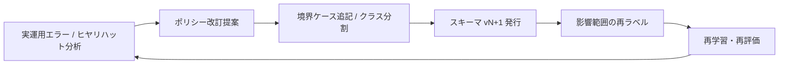
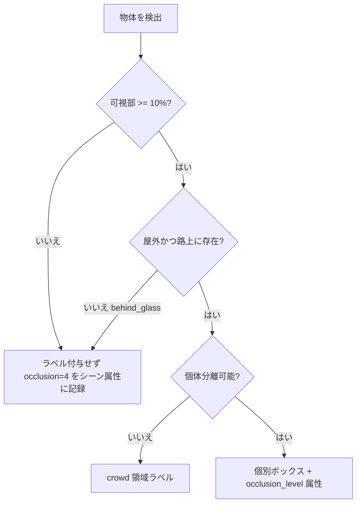
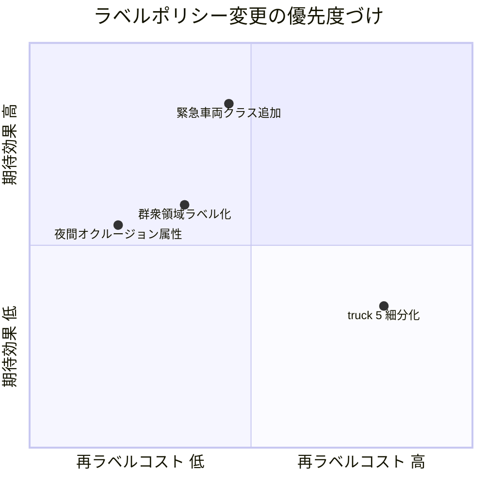

# 5.1 ラベリングポリシーと定義書の作り方

本節では、ラベリングポリシー (labeling policy) と定義書 (annotation guideline) の作り方を実務目線で整理します。クラス・属性・シナリオタグのタクソノミ (taxonomy、ラベル体系) 設計、境界ケース (edge case、解釈が割れやすい事例) の明文化、ポリシーのバージョニングと変更管理までを扱います。一貫したラベルこそが Closed-Loop データエンジンの土台であることを、具体的な手順とサンプルで示すのが本節の狙いです。

## ラベル定義が Closed-Loop の起点になる理由

ラベル定義が揺らぐと、モデルの誤差を観測したときに「モデルの限界なのか、ラベルの不整合なのか」を切り分けられなくなります。Closed-Loop（データ収集 → ラベリング → 学習 → 評価 → 実運用 → フィードバック）では、エラー分析の結果がラベルポリシーへ還流し、ポリシー改訂が再ラベル・再学習を駆動します。したがって定義書は「最初に書いて終わる文書」ではなく、**バージョン管理された生きた仕様**として扱います。

> この図のポイント：ラベルポリシーは Closed-Loop の「設計図」であり、エラーが新しい境界ケース定義として蓄積されるほどデータセットの解像度が上がります。

## タクソノミ設計の5ステップ

タクソノミは「どのタスクでどの指標を改善したいか」から逆算して設計します。公開データセット（Cityscapes [D1](references#d1)、nuScenes [P6](references#p6)、Waymo Open Dataset [P7](references#p7)、Argoverse 2 [P8](references#p8)、BDD100K [P9](references#p9)、ONCE [P10](references#p10)）でも、検出・セグメンテーション・トラッキングといったタスクごとにラベルセットが最適化されています。

1. **対象タスクと指標の整理**：歩行者検出の Precision/Recall、車線検出 IoU (Intersection over Union)、シーンリスクスコアなど、モデル側で計測する指標を列挙し、どのクラス・属性が意思決定に寄与するかを確定します。
2. **既存タクソノミの再利用**：公開・社内のラベルセットを「必須」「Nice-to-have（あると便利）」「ほぼ未使用」に三分します。Cityscapes が 30 クラスを評価時に 19 クラスへ統合する [D1](references#d1) ように、アノテーション用と評価用のクラスを分離する設計が有効です。
3. **階層構造 (hierarchy) の定義**：上位に「動的物体」「静的構造物」「交通制御」「路面属性」「環境要因」を置き、下位に具体クラスをぶら下げます。タスクによっては上位カテゴリのみ扱い、詳細は属性に降ろします。
4. **属性 (attribute) 設計**：`motion_state`（moving/parked/stopped）、`signal_state`（red/yellow/green）、ライト点灯、天候、昼夜などをクラスから分離して保持します。nuScenes [P6](references#p6) が `category`（クラス）と `attribute`（属性）を分離する設計はポリシー変更時の柔軟性が高いです。
5. **シナリオタグ (scenario tag) 設計**：道路種別・交差点種別・イベント（合流／追い越し／渋滞末尾）・環境（雨／雪／トンネル／工事）をシーン単位で付与し、カバレッジ分析の軸にします。

この5ステップを通して最も重要なのは、タクソノミ設計を「クラス列挙」ではなく「KPI から逆算する設計問題」として捉え直すことです。たとえば mAP を改善したいのか、Planning ミス率を下げたいのか、それとも長尾シナリオでのリコール底上げを狙うのかで、必要なクラスや属性は大きく変わります。KPI と紐付けずにクラスを増やすと、ラベリングコストだけが膨張し、評価指標は動かないという典型的な失敗に陥ります。ここで効くのが、公開データセットを「無料で得られる設計ベースライン」として扱う発想です。Cityscapes [D1](references#d1) や nuScenes [P6](references#p6) が長年の議論の末に到達した「アノテーション 30 クラス／評価 19 クラス」「category と attribute の分離」といった構造には、再現性と評価安定性のバランスを取るための知恵が織り込まれています。これらをゼロから議論し直すよりも、自社 ODD に最も近いデータセットを起点に「足す／削る」の差分議論に持ち込む方が、合意形成が速く、社外データとの相互運用性も担保できます。さらにシナリオタグは、第 4 章で扱ったシーン検索やマイニングの軸として再利用される性質があるため、ラベル設計の段階で ID 体系を整えておくと、後段のデータ抜き出しコストが桁で変わります。

### 公開データセットのラベル設計比較

| データセット | 主タスク | 3D ボックスクラス数（目安） | 属性管理 | 特徴 |
|---|---|---|---|---|
| nuScenes [P6](references#p6) | 3D 検出 / 追跡 | 23 → 評価 10 | category と attribute を分離 | 360°マルチセンサ、attribute が豊富 |
| Waymo Open Dataset [P7](references#p7) | 3D 検出 / 追跡 | 4 大クラス | 速度・難易度レベル | 高頻度 LiDAR、難易度 (LEVEL_1/2) |
| Argoverse 2 [P8](references#p8) | 検出 / 予測 | 30 | タクソノミが細粒度 | long-tail クラスを意図的に保持 |
| Cityscapes [D1](references#d1) | セマンティック seg | 30 → 評価 19 | 評価用に統合 | 画素単位、評価クラスを縮約 |

> この表のポイント：「アノテーション粒度」と「評価粒度」を分けるか、long-tail を保持するかで設計思想が分かれます。自社 ODD に近いデータセットの設計を起点にすると合意形成が速くなります。

## 境界ケースの明文化（5つの代表例）

再現性を最も損なうのは境界ケースの解釈揺れです。定義書には文章だけでなくスナップショット画像・動画とセットでルールを掲載します。以下は典型的な5例とルール化の指針です。

1. **ガラス越しの歩行者**：店舗ガラスやバス車内の人物が該当します。原則として「自車挙動に影響する屋外の人物のみ pedestrian」と定め、屋内は `behind_glass=true` 属性で除外可能にします。
2. **シルエット／逆光**：輪郭のみ視認できる人物・車両です。「人体形状が判別でき、かつ路上に存在する確度が高い場合に付与」と確度条件を明記します。
3. **群衆 (crowd)**：個体分離が困難な歩行者集団です。一定密度以上は個別ボックスをやめ `crowd` 領域ラベルへ切り替える閾値（例：重なり率や個体数）を定義します。
4. **視界外／強オクルージョン (occlusion、遮蔽)**：可視部が 10% 未満の物体です。`occlusion_level` を 4 段階で持ち、検出対象から外さずに属性で表現します（nuScenes [P6](references#p6)・Cityscapes [D1](references#d1) も可視性を属性化）。
5. **駐車 vs 走行**：「数秒以上速度ゼロかつウィンカー・ブレーキ非点灯なら parked」のように**時間条件を数値で**明記します。予測タスクの前提となるため曖昧さを残しません。

境界ケースの明文化で見落とされがちなのは、「文章で書く」ことと「再現性を担保する」ことの間にある大きな溝です。たとえば「歩行者として扱う」と一行書いただけでは、ガラス越しの人物がアノテータごとに付いたり付かなかったりします。これを埋めるのが、OK／NG 例のスナップショットを必ずセットで提示する設計と、速度・時間・可視率といった条件を単位付きの数値で固定する規律です。「数秒」ではなく「3 秒以上」、「ほぼ見えない」ではなく「可視部 10% 未満」と書くことが、人手ラベリングだけでなくツール側の自動チェック（ボックスサイズが極端に小さい、軌跡上の速度が条件と矛盾する、など）と接続できるかを左右します。さらに重要なのは、境界ケースは「設計時に決めて終わり」ではなく、現場で発生したズレが定義書に還流するループを持つことです。境界ケースごとの合意率（複数アノテータが同じ判断に至る割合）を継続的に観測すると、合意率が落ち始めたケースが「ポリシーが時代遅れになっている」あるいは「アノテータ教育が崩れている」サインとして浮かび上がります。Closed-Loop におけるラベル品質の劣化は静かに進むため、合意率は最も早く異常を捉えられる先行指標として機能します。

> この図のポイント：境界ケースを決定木 (decision tree) に落とすと、アノテータ教育とツール内チュートリアルに直接転用でき、ベンダー間のばらつきを抑えられます。

## バージョニングと変更管理

ラベルポリシーは Semantic Versioning（メジャー.マイナー.パッチで意味的に互換性を表現するバージョン規約）に倣い、**互換性の壊れ方で Breaking／Non-breaking を分類**します。

| 変更種別 | 例 | バージョン | 再ラベル要否 |
|---|---|---|---|
| Non-breaking（追加） | 新属性 `is_emergency` を追加 | minor (1.2.0→1.3.0) | 任意（過去は null 許容） |
| Non-breaking（拡張） | select に新オプション追加 | minor | 不要 |
| Breaking（分割） | `vehicle` を `car/truck/bus` に分割 | major (1.x→2.0.0) | 影響範囲の再ラベル必須 |
| Breaking（統合） | `parked`/`stopped` を `motion_state` に統合 | major | マッピング + 例外確認 |
| Deprecation | `is_parking` を 2 バージョン後に廃止予告 | minor で告知→major で削除 | 段階移行 |

Deprecation（非推奨化）ポリシーは「**最低 1 メジャーバージョンは旧フィールドを残し、warning を出してから削除する**」と定め、学習・評価コードの破壊を防ぎます。変更は人間可読の説明と機械可読の変更ログ（JSON）の両方で残します。

機械可読な変更ログには、最低限「スキーマバージョン (label_schema_version)」「リリース日」「変更種別 (breaking／non-breaking／deprecation)」「変更操作の一覧」「評価互換ポリシー」を含めます。各変更操作には、(a) 操作種別（split/merge/rename/add/deprecate）、(b) 旧フィールド名と新フィールド名（または分割先クラス一覧）、(c) 自動マッピングルールの簡潔な説明（例：「車両サイズと車軸数のヒューリスティクスで一次振り分けし、境界例は人手レビュー」）、(d) 影響を受ける ODD 範囲、(e) 再ラベルの優先範囲（safety-critical 優先か全量か）、(f) deprecation の場合は何バージョン後に削除するか、を必ず明記してください。評価互換ポリシーは「次の 2 サイクルは旧版・新版を併走で評価レポートする」のように期間と方式を一文で示します。

旧スキーマから新スキーマへの移行はマッピングテーブルとして仕様化し、誰が実装しても同じ結果が再現できるようにします。たとえば v1 → v2 でクラス `vehicle` を `car/truck/bus` に分割するなら、次の 4 ステップを定義書に明文化します。

1. 既定値は `car` とし、サイズ・車軸数などのヒューリスティクスで条件を満たすものを `truck` または `bus` に昇格させる。
2. `pedestrian` や `cyclist` のように変更がないクラスは恒等変換する。
3. ブール値の `is_parking` は新しい列挙型 `motion_state` に統合し、`true → parked / false → moving` で再マップした後に旧フィールドを削除する。
4. すべてのレコードに `label_schema_version = "2.0.0"` を付与する。

実装担当者にはこの仕様と単体テストケース（境界例を含む）を渡し、変換結果は標本抽出で人手検証してから本番適用します。

## ポリシー変更の意思決定：コスト vs 効果マトリクス

すべての変更要求を受け入れると再ラベルコストが膨張します。変更は「期待効果（安全インパクト × 発生頻度）」と「再ラベルコスト」で評価し、優先度を決めます。

| 変更案 | 期待効果 | 再ラベルコスト | 判断 |
|---|---|---|---|
| 緊急車両クラス追加 | 高（安全クリティカル） | 中（出現頻度低・対象限定） | 即採用（major） |
| `truck` を 5 細分化 | 低〜中 | 高（全 ODD に波及） | 保留 / 属性で代替 |
| 夜間オクルージョン属性追加 | 中（long-tail 改善） | 低（属性追記のみ） | 採用（minor） |

> この図のポイント：左上（低コスト・高効果）から着手し、右下（高コスト・低効果）は属性化や保留で回避します。意思決定の根拠を残すこと自体が、後の Closed-Loop 監査で効いてきます。

ポリシー変更の意思決定では、安全クリティカル領域については認証等級 (ASIL レベル) と直接結び付けます。たとえば「ASIL D 領域に効くクラス追加（緊急車両、子ども検出など）は Recall 目標 97% 以上を満たすラベル品質を要件として major 採用」「ASIL B 領域は Recall 目標 90% を最低基準として minor 採用」のように、安全インパクトと品質目標をペアで明示します。

ここで本書がとくに強調したいのは、「採用した変更」と同じくらい「保留・却下した変更」の記録が後で効いてくるという点です。半年後に「なぜ truck の細分化を見送ったのか」が説明できないと、別チームから同じ提案が再浮上したときに議論をゼロから繰り返すことになります。さらに、安全クリティカル領域では ASIL レベルと品質目標を必ずペアで持つことが重要です。「ASIL D 領域の緊急車両クラス追加は Recall 97% 以上を必須」と書く意味は、単なる目標値ではなく、機能安全の観点から「このラベル品質を満たさない学習データは安全認証の根拠にできない」という上限制約を表現することにあります。逆に、Recall 90% 程度で実用上問題ない ASIL B 領域に過剰品質を要求すると、ラベリングコストは指数的に膨らみます。コスト vs 効果マトリクスは、この「安全インパクトに比例した品質投資」を可視化する道具であり、四象限のどこに変更案を置くかという議論自体が、ASIL 等級と品質要件のすり合わせを強制する仕組みとして機能します。意思決定の根拠をコードレビュー同等の承認フローで残せば、認証や監査の場面でラベルポリシーが「設計判断の連鎖として説明可能」になります。

## 本節の振り返り

ラベル定義の一貫性は、モデル誤差を観測したときに「モデルの限界か、ラベルの揺らぎか」を切り分けるための前提条件です。この前提が崩れると、Closed-Loop は「ノイズで自分自身を学習し続けるループ」に堕してしまうため、ラベルポリシーは設計図そのものとして扱われるべきです。タクソノミは KPI から逆算し、公開データセットの設計知を起点にしてアノテーション粒度と評価粒度を分離します。境界ケースは文章ではなく決定木と数値条件で固定し、合意率を先行指標として継続観測することで、定義書を「生きた仕様」として運用します。ポリシー変更は Semantic Versioning と Deprecation を組み合わせて互換性を守りつつ、機械可読な変更ログでマッピング規則を再現可能にし、コスト vs 効果マトリクスで ASIL 等級と品質目標をペアにして優先度を決めます。これらが揃って初めて、エラー分析の結果がラベル設計に還流する Closed-Loop が成立します。

## 次節への橋渡し

定義書が固まったら、それを**実際にラベルとして描き込む環境**が必要です。次の 5.2 節では、CVAT・Scalabel から SuperAnnotate・Scale AI・Labelbox・Roboflow・Encord・V7・Voxel51 FiftyOne までのアノテーションツールを 20 機能軸で比較し、Open3D を用いた 3D ラベリングの実装ガイドと、秒/フレーム単位の効率指標を交えてワークフロー設計を掘り下げます。
