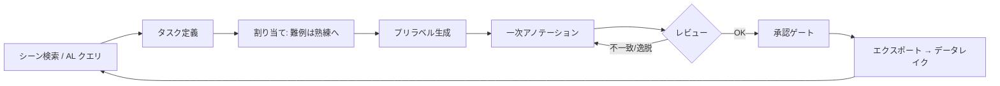

# 5.2 アノテーションツールとワークフロー設計

本節では、アノテーションツール (annotation tool) の選定とワークフロー設計を実装目線で掘り下げます。2D/3D・時系列・マルチセンサ対応の機能要件、商用／OSS ツールの比較、Open3D を用いた 3D 点群ラベリングの実装ガイド、秒／フレーム単位の効率指標までを整理します。数年スパンの Closed-Loop データエンジンを支える基盤として、ツールを評価する視点を提示するのが本節の狙いです。

## ツールに求められる機能要件

自動運転のラベリングは、静止画 1 枚で完結しません。次の機能群が品質と生産性を左右します。

- **シーケンス編集**：数百〜数千フレームを動画として扱い、トラッキング ID（同じ物体を追う番号）の引き継ぎと、フレーム間補間（linear（線形補間） / Kalman interpolation（カルマンフィルタによる補間））をサポートします。
- **マルチセンサ同期ビュー**：前後左右カメラ・BEV (Bird's-Eye View、上空から俯瞰した平面表現)・LiDAR 点群・HD マップを同時表示し、1 物体に 2D/3D ラベルを統合編集します。
- **半自動補完**：既存モデルによる候補生成（プリラベル、pre-label）、SAM (Segment Anything Model) 系 [D5](references#d5) によるクリックマスク化、過去フレームからのマスク伝播を提供します。
- **拡張性**：Python / JS スクリプトでカスタム検査ルール（例：車線を 50 cm 以上跨ぐ車両に警告）を組み込めるかが鍵です。
- **タスク・権限管理**：ラベラー／レビュアー／管理者のロール、状態遷移（未着手 → 進行中 → レビュー待ち → 完了）、監査ログを備える必要があります。

## 代表的アノテーションツールの比較

OSS（CVAT（Computer Vision Annotation Tool）、Scalabel、Label Studio）と商用プラットフォームでは、得意領域とコスト構造が大きく異なります。以下は公開情報に基づく機能軸の比較です（仕様は変動するため選定時に最新情報を確認してください）。なお SuperAnnotate・Scale AI・Labelbox・Roboflow・Encord・V7（Darwin）はいずれも商用のラベリングプラットフォームで、各社が独自の AI アシスト機能とワークフロー管理を提供しています。Voxel51 FiftyOne [D15](references#d15) は描画よりも「データの探索・キュレーション・モデル評価」を担う可視化基盤です。

| ツール | 提供形態 | 3D 点群 | 動画追跡 | AI アシスト | データ管理連携 | 主な強み |
|---|---|---|---|---|---|---|
| CVAT | OSS / SaaS | △（拡張） | ○ | SAM/自動補間 | 中 | 無償・自前ホスト・拡張容易 |
| Scalabel | OSS | ○ | ○ | △ | 中 | 2D/3D 統合、研究用途に強い |
| Label Studio | OSS / SaaS | △ | ○ | ML backend | 中 | マルチモーダル、柔軟な UI |
| SuperAnnotate | 商用 | ○ | ○ | 強 | 強（SDK） | 品質管理ワークフローが充実 |
| Scale AI | 商用(マネージド) | ◎ | ◎ | 強（自動化） | 強 | 大規模 3D、マネージド労働力 |
| Labelbox | 商用 | ○ | ○ | 強（Foundry） | 強（Catalog） | データカタログ + モデル評価統合 |
| Roboflow | 商用 | △ | ○ | 強 | 中 | 2D 中心・MLOps 一気通貫が速い |
| Encord | 商用 | ○ | ◎ | 強（SAM 統合） | 強 | 動画・医療/AV、品質指標が厚い |
| V7 (Darwin) | 商用 | ○ | ◎ | 強（Auto-Annotate） | 強 | 自動アノテーション、複雑ワークフロー |
| Voxel51 FiftyOne [D15](references#d15) | OSS / 商用 | ◎（可視化） | ◎ | 埋め込み検索 | ◎ | データ探索・キュレーション・評価の中枢 |

> この表のポイント：FiftyOne [D15](references#d15) は「描く」より「探す・評価する」ツールで、CVAT 等の描画ツールと組み合わせるのが定石です。3D 大規模はマネージド型（Scale AI）、品質ワークフロー重視は SuperAnnotate/Encord/V7 が候補になります。

ツール選定は単発プロジェクトの使い勝手だけでなく、**SDK (Software Development Kit) の有無・データレイク連携・監査ログ・コスト構造**で評価します。FiftyOne を中核データ層に据え、描画は CVAT／SuperAnnotate、難例検索は埋め込み (embedding) ベース、という疎結合構成が運用しやすいです。

ツール選定で本書がとくに強調したいのは、デモを見て「使いやすそう」と判断するのが最も危険だという点です。アノテーションツールは数年スパンで使い続ける投資対象であり、評価軸を「描画 UI の好み」から「Closed-Loop 全体への適合度」へ引き上げる必要があります。具体的には、自社 ODD で頻出するシーン（高速道路、夜間市街、工事ゾーンなど）から数百フレーム規模の PoC を必ず実走させ、秒／2D ボックス・秒／3D ボックスといった編集効率を実測することが出発点になります。さらに重要なのは、SDK や API でデータ取込・エクスポート・監査ログ取得を自動化できるかをコードレベルで検証することです。ここで「UI 経由でしかデータが出せない」「監査ログが API で取れない」といった制約に気付かずに導入すると、数年後に Closed-Loop の自動化を進めようとした瞬間にロックインが顕在化し、移行コストが膨大になります。ライセンス・データ保管国・SOC2 や ISO27001 の認証有無といった非機能要件も、PIPL や GDPR の重要データ規制（5.8 節で詳述）が絡む現代では選定段階で必ず潰しておくべき論点です。これらを「使い勝手」と切り離して評価できるかが、3 年後にツールを乗り換えずに済むかの分岐点になります。

## ワークフロー設計とロール分担

> この図のポイント：承認ゲートを通過したジョブのみが学習パイプラインに入ります。承認ステータスをデータセットメタデータに保存し、「どのモデルがどの状態のデータで学習されたか」を追跡できるようにします。

オンライン評価やシミュレーションで見つかった問題シーンを「高優先度タスク」として自動投入できることが、Closed-Loop の要です。これにより「気付いた問題を即ラベルキューに反映する」文化が形成されます。

## 3D 点群ラベリングの実装ガイド（Open3D）

3D ラベリングは 2D より桁違いに難しく、レビューの簡略化が品質低下に直結します。実務では次の 3 工程を組み合わせます。(1) 点群の前処理（地面除去・クラスタリングで候補生成）、(2) 3D ボックスのフィッティング、(3) 複数フレーム集約 (aggregation) による見やすさの向上、です。Open3D（点群処理 OSS ライブラリ）を用いた候補生成の手順は次のとおりです。

入力は 1 フレーム分の LiDAR 点群（N×3 の座標、必要なら反射強度を加えた N×4）です。出力は、各物体候補の中心座標と寸法（クラスは未付与）からなるプリラベル候補のリストです。手順は次の 4 ステップです。

1. RANSAC 平面検出で道路面を推定し、平面上の点を「地面」として除外します（距離閾値 0.2 m、最小サンプル数 3、反復回数 200 回程度が初期値）。
2. 残った点群に DBSCAN（密度ベースのクラスタリング）を適用して物体候補のクラスタを得ます（近傍半径 eps = 0.5 m、最小点数 20 が初期値で、車両／歩行者／二輪のスケールに合わせて調整）。
3. 点数が極端に少ない（例：30 点未満）クラスタはノイズとして破棄します。
4. 残ったクラスタごとに軸平行バウンディングボックス (AABB、Axis-Aligned Bounding Box) をフィットし、中心座標と寸法を候補として出力します。

アノテータはこの候補を確認し、向き（ヨー角）の修正とクラス付与だけ行えば済むため、ゼロから 3D ボックスを描く場合に比べて編集回数を大幅に削減できます。

時系列では、自車位置 (ego pose、自車のグローバル位置・姿勢) を使って複数フレームを世界座標へ集約すると、静止物体は点が密になり形状が安定します。動的物体はトラッキング ID 単位で集約し、フレーム間補間で 1 物体あたりの編集回数を減らします（4D 再構成 (Multi-trip Reconstruction、複数走行クリップを一つの 3D 空間に統合する技法) の考え方は 5.4 節の Tesla パイプラインで詳述します）。

## 効率化の定量指標

ツール改善は「感覚」ではなく指標で評価します。代表的な効率指標と、半自動化による削減効果の目安を示します（プロジェクト依存のため自社で計測してください）。

| 指標 | 定義 | 手動のみ | 半自動（プリラベル+補間） |
|---|---|---|---|
| 秒/2D ボックス | 1 ボックス作成・確認の所要時間 | 5〜10 秒 | 1〜3 秒 |
| 秒/3D ボックス | 1 ボックス作成・回転・確認 | 30〜60 秒 | 8〜20 秒 |
| フレーム/時 | 1 時間あたり完了フレーム数 | 基準 | 2〜4 倍 |
| 修正率 | プリラベルのうち人手修正された割合 | — | 10〜30% が目安 |
| 一発承認率 | レビューで無修正通過した割合 | — | 高いほど良い |

> この表のポイント：「秒／フレーム」と「修正率」を継続計測すると、プリラベルモデルの劣化やポリシー曖昧化を早期に検知できます。修正率が急上昇したクラスは、定義書の境界ケース（5.1 節）見直し候補です。

効率指標を運用に落とすうえで本質的なのは、「修正率」を生産性指標ではなく診断指標として読むことです。修正率がクラス別に 30% を超えるという現象には、少なくとも 2 つの異なる原因が潜んでいます。1 つはプリラベルモデルの劣化（最近の走行データに対する性能低下）、もう 1 つは定義書の曖昧化（5.1 節で扱った境界ケースの解釈揺れの再来）です。この 2 つはまったく別の対処を要するため、修正率が上がったときに「アノテータの再教育で押し切る」のか「モデル再学習をかける」のか、それとも「定義書の境界ケースを書き直す」のかを切り分ける文化がないと、コストだけが増え品質が戻らない状態に陥ります。さらに、ASIL D 領域では「一発承認率」を効率指標として追いかけると Recall を取りこぼす危険があります。安全クリティカルなクラスでは「見逃しゼロ」を優先し、レビュー段階で多少の差し戻しが発生することを許容するほうが、結果としての安全余裕が大きくなります。ベンダー SLA に秒／フレームの目標値と修正率の上限を盛り込むのは、この「効率と安全のトレードオフをどこに置くか」をベンダーと共有言語にするためであり、月次レビューでは数値そのものよりも「異常値が出たときに何が起きていたか」のナラティブを共有することに価値があります。

## ツールとデータ基盤の統合

アノテーションツールは単体 SaaS ではなく、データレイク・メタデータカタログ・実験管理と統合された一部として設計します。

- **シーン検索から直接タスク作成**：第 4 章のクエリ機能と連携し、ODD・天候・シナリオ条件の検索結果をそのままラベルキューへ投入します。
- **モデル出力のオーバーレイ**：現行モデルの検出結果・不確実度をツール上に重ね、見落としや誤検出を素早く発見します（AL（Active Learning、能動学習）や半自動ラベリングと直結します）。
- **監査ログと再現性**：誰がいつどのフレームをどう変更したかを保存します。ISO 26262 [L1](references#l1) や SOTIF (Safety Of The Intended Functionality、ISO 21448) [L2](references#l2) の観点から、データ生成プロセスのトレーサビリティを確保することが目的です。

## 本節の振り返り

自動運転のアノテーションツールは、単発プロジェクト用の SaaS ではなく、数年スパンで Closed-Loop を支えるデータ基盤の構成要素として設計する必要があります。シーケンス編集・マルチセンサ同期・半自動補完・拡張性・権限管理という機能要件は、それぞれが「品質」「生産性」「監査可能性」のどこに効くかが異なるため、要件を切り分けて評価することが重要です。ツール構成は描画系・マネージド 3D・探索／評価中核（FiftyOne [D15](references#d15)）を疎結合に組み合わせ、ロックインを避けつつ強みを取り込みます。3D ラベリングは Open3D による候補生成と ego pose に基づく複数フレーム集約で編集回数を桁で減らせる一方、秒／フレームや修正率といった効率指標を診断指標として読み解く規律がないと、半自動化の効果は持続しません。最終的に、ツールがデータレイク・カタログ・実験管理と統合され、ISO 26262 [L1](references#l1) や SOTIF [L2](references#l2) の観点で監査可能性を確保できているかが、Closed-Loop の信頼性を決定づけます。

## 次節への橋渡し

ツールが整っても、「どのシーンを・どんなスキーマで」ラベルするかの上流設計が伴わなければ効率は上がりません。次の 5.3 節では、VLM (Vision-Language Model) / Foundation Model を用いて、ログからシナリオを自動マイニングし、タクソノミ自体をモデルと共進化させるアプローチを扱います。CLIP [P17](references#p17) による zero-shot 検索、選定デシジョンツリー、API 運用コスト、社内 G-VQA ベンチマークの構築手順まで踏み込みます。
