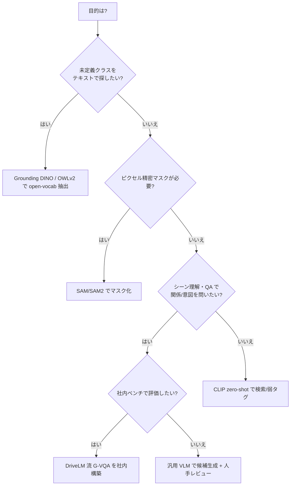

# 5.3 VLM / Foundation Model を用いた環境タクソノミ・シナリオマイニング

本節では、Vision-Language Model (VLM、画像と言語を結びつけるモデル) や Foundation Model（広範なタスクへ転用可能な基盤モデル）を使い、ログからシナリオを自動マイニングし、タクソノミ (taxonomy、ラベル体系) 自体をモデルと共進化させる方法を扱います。CLIP（Contrastive Language–Image Pretraining）[P17](references#p17) によるテキストクエリ検索、埋め込みクラスタリング、自動運転特化 VLM 研究の俯瞰、モデル選定デシジョンツリー、API 運用コスト、社内 G-VQA (Graph Visual Question Answering) ベンチマークの構築手順までを、Closed-Loop の入口として整理します。

## テキストクエリによるシーン検索（CLIP zero-shot）

CLIP [P17](references#p17) 系モデルは、テキストと画像を同一の埋め込み空間 (joint embedding space、画像とテキストを共通の高次元ベクトルとして表現する空間) にマップします。全フレームの埋め込みを事前計算してベクトル DB（ベクトル検索データベース）に格納すれば、「雨の夜の交差点で歩行者が赤信号横断」のような自然言語クエリで最近傍検索ができます。

実装の流れは次の 4 ステップです。

1. `open_clip` などのライブラリで学習済み CLIP（例：ViT-B/32、LAION-2B 重み）をロードします。
2. 検索したいシナリオを表すテキストプロンプト（"a rainy night intersection"、"a sunny highway"、"a construction zone" など）を準備します。
3. 画像はモデル付属の前処理を通して画像エンコーダ (image encoder) で埋め込み、テキストはトークナイズしてテキストエンコーダ (text encoder) で埋め込みを取得します。
4. 双方を L2 正規化したうえで内積（コサイン類似度）を取り、必要なら softmax で確率化して各プロンプトとの類似度を得ます。

検索の閾値（例：類似度 > 0.25 や softmax スコア > 0.5）を超えたフレームを「弱いシナリオタグ候補」として登録し、人手レビューで真偽判定するのが前提です。閾値はクラスごとに調整し、タグごとに precision／recall をサンプリング評価して継続調整します。

この仕組みをラベリングに統合すると、「事故レポートに似た状況を大量抽出」「特定違反シーンだけ集中レビュー」といったシナリオ駆動のデータ選択が容易になります。第 4 章のシーン検索基盤と合わせ、「問題シーン特定 → ラベル付け → モデル改善」の入口になります。

CLIP zero-shot 検索を Closed-Loop に組み込むうえで本質的な落とし穴は、「自然言語クエリで何でも引ける」という万能感に流されることです。実際には、同じ「雨の交差点」を意図しても "rainy intersection at night" と "wet road junction in rain" では検索結果が大きくぶれます。だからこそシナリオを 30〜50 個レベルに整理し、各シナリオに 2〜3 種類のプロンプト変種を用意して、教師セットで precision／recall を実測したうえで閾値を固定する規律が要ります。閾値はシナリオによって最適点が大きく違うため、「全シナリオ一律で類似度 0.25」のような運用は precision を犠牲にし、ノイズで埋まったタグキューを生みます。さらに重要なのは、ヒット件数の時系列変動を ODD ドリフトの先行指標として扱う発想です。「雪道の歩行者横断」のヒット件数が急増したらフリートが新しい地域へ展開したサイン、「夜間工事ゾーン」が急減したら担当エリアの工事が終わったか、あるいはセンサ側の何かが変わったサインかもしれません。CLIP 検索を「データを引く道具」だけでなく「環境変化のセンサ」として読む視点が、Closed-Loop の感度を一段引き上げます。

## 埋め込みクラスタリングによるシナリオマイニング

VLM や自己教師あり (self-supervised) モデルの埋め込みには、人間が明示していないシナリオ構造が潜みます。典型的なプロセスは次の 4 ステップです。

1. 画像・動画から埋め込みを算出します（必要なら LiDAR や地図特徴を連結）。
2. k-means、DBSCAN、階層クラスタリングのいずれかでクラスタを生成します。
3. 各クラスタの代表フレームをエキスパートが意味づけします。
4. 有意なクラスタを新しいシナリオタグとしてポリシーに反映します。

トップダウン設計（仕様から決める）とボトムアップ発見（データから生まれる）を組み合わせるのが要点です。

## オートラベリング基盤モデルの概観（詳細は 5.4 へ）

2023〜2025 年に登場した基盤モデル群は、ラベリングの自動化を一変させました。本節では位置づけのみ概観し、実装と運用は 5.4 節で詳述します。

SAM (Segment Anything Model)・Grounding DINO（テキストで物体を検出する open-vocabulary 検出器）・OWL-ViT／OWLv2（Vision Transformer ベースの open-vocabulary 検出器）・OpenSeeD（検出とセグメンテーションを統合した open-vocabulary モデル）は、いずれも「事前定義されたクラス一覧に縛られず、テキストや少数例から物体を取り出せる」基盤モデル群です。

| モデル | 入力プロンプト | 出力 | マイニング用途 |
|---|---|---|---|
| SAM / SAM2 [D5, D6] | 点・ボックス・なし | クラス非依存マスク | クリックでマスク化、動画追跡 |
| Grounding DINO [D7](references#d7) | テキスト | open-vocab ボックス | 「未定義クラス」をテキストで抽出 |
| Grounded-SAM [D8](references#d8) | テキスト | ボックス + マスク | テキスト → インスタンスマスク |
| OWL-ViT / OWLv2 [D9](references#d9) | テキスト／画像例 | open-vocab ボックス | 少数例での新クラス検索 |
| OpenSeeD [D16](references#d16) | テキスト | 検出 + セグメンテーション統合 | 検出と seg を一括マイニング |

> この表のポイント：シナリオマイニングでは「テキストで未定義クラスを引ける」open-vocabulary（語彙制限のない）能力（Grounding DINO [D7](references#d7)、OWLv2 [D9](references#d9)）が、タクソノミ拡張の発見器として機能します。

## 自動運転特化 VLM 研究の俯瞰

近年の自動運転向け VLM / VLA (Vision-Language-Action) は、認識の高性能化を超えて、シナリオ定義・ラベル設計・評価・フィードバックを包括しようとします。代表研究をタスク性質ごとに整理します。

| 研究 | カテゴリ | タクソノミ/ラベリングへの示唆 |
|---|---|---|
| DriveLM (G-VQA) | Graph VQA | 「ピクセル→物体→関係→質問」の階層を明示化。関係ラベルを一級市民に |
| DriveBench / Are VLMs Ready? | 信頼性評価 | VLM は implicit rule grounding に弱く、人手レビュー必須を裏づけ |
| STRIDE-QA | 大規模 QA | QA スキーマ自体を Closed-Loop でバージョン更新する運用 |
| Talk2BEV | BEV/HD マップ QA | レーン・ジャンクション単位のシナリオタグを QA で抽出 |
| EMMA | マルチモーダルエージェント | 中間説明テキストをログ保存しシナリオタグに再利用 |
| SimLingo | テキスト→シミュ生成 | タクソノミ要素をプロンプト化し合成シーン生成 |
| DriveGPT | 言語付きポリシー | 行動+説明ラベルを自動付与 |
| Poutine | 自己改善エージェント | 失敗クラスタリングとデータ補完を半自動化 |
| ReCogDrive | 認知・推論ベンチ | 危険候補・残余リスクをメタラベル化 |
| DriveAction | 行動理解 | 操作/マヌーバ/目的の階層的行動タクソノミ |
| DiMA | 多能力蒸留 | 共通軸（行動/リスク/関係）でタクソノミ正規化 |

### グラフ VQA とタクソノミ形式化：DriveLM

DriveLM は、シーンをグラフ（ノードに物体・レーン・信号、エッジに関係）で表し、「質問・答え・根拠」の G-VQA (Graph Visual Question Answering、グラフ構造を使った視覚質問応答) を定義します。これは従来のオブジェクト中心タクソノミから「関係・因果構造」を一級市民へ引き上げる試みです。実務では、DriveLM の質問カテゴリ（認識／予測／計画／説明）を社内版「運転知識テスト」のテンプレートに転用し、「どの QA カテゴリでエラーが多いか」を再収集・再ラベルにフィードバックできます。

### 信頼性評価と大規模 QA：DriveBench / STRIDE-QA

「Are VLMs Ready?」は DriveBench を用い、汎用 VLM が安全クリティカルな問いや long-tail（出現頻度の低い長い裾野のシーン）で人間水準に届かないことを示します。とくに「どの信号がどの車線に効くか」のような implicit rule grounding（明示されない規則の理解）に弱く、タクソノミ整備なしに VLM だけでシーン抽出するのは危険だと示唆します。STRIDE-QA は実車・シミュログから大規模 QA を構成し、新しい事故タイプが見つかるたびに QA テンプレートを過去ログへ一括適用します。スキーマをモデル同様にバージョン管理する思想であり、本書の主張と整合します。

### BEV／地図・エージェント・行動系

Talk2BEV は BEV と HD マップ上の対話理解で、レーンやジャンクション単位のシナリオタグ抽出に向きます。EMMA は perception（認識）／world model（世界モデル）／reasoning（推論）の三層エージェントで、中間説明テキストの保存が後のシナリオタグ化に効きます。SimLingo はテキストを中間シナリオ表現にコンパイルし、タクソノミ要素を固定したまま他要素をスイープする感度分析に使えます。DriveGPT は行動トークンと説明トークンを同時生成して説明ラベルの価値を示し、DriveAction は操作・マヌーバ（運転動作）・目的の階層行動タクソノミを定義します。DiMA は教師モジュール間のタクソノミ不整合を共通軸へ正規化します。Poutine は失敗事例のテキスト要約とクラスタリング、データ補完までを半自動化します。

## モデル選定デシジョンツリー

「どのモデルをいつ使うか」を判断する指針を示します。

> この図のポイント：精密マスクは SAM 系 [D5, D6]、未定義クラス発見は open-vocab 検出 [D7, D9]、関係・意図の評価は G-VQA、軽量な検索は CLIP [P17](references#p17)、と役割を分けると過剰投資を避けられます。

## API 運用コストの見積もり

商用 VLM API を大規模ログに適用するとコストが急増します。概算式は「総コスト ≒ フレーム数 × 1 フレームあたりトークン／呼び出し単価」です。オフラインの自前ホスト（OSS の VLM を社内 GPU で運用する形）との損益分岐を必ず試算します。

| 方式 | 単価の目安 | 100 万フレーム適用時 | 向く用途 |
|---|---|---|---|
| 商用 VLM API | 高（呼び出し課金） | 高額になりやすい | 少量・高品質な説明生成 |
| OSS VLM 自前ホスト（GPU） | GPU 時間課金 | バッチで安価化 | 大規模一括マイニング |
| CLIP 埋め込み + ベクトル DB | 極小（事前計算後は検索のみ） | 最安 | 大規模検索・弱タグ付け |

> この表のポイント：大規模適用は「CLIP で粗く絞り込み → 候補だけ重い VLM/API」の二段構えがコスト効率的です。VLM のバージョン・プロンプトもラベルポリシー同様に記録します。

## 社内 G-VQA ベンチマークの構築手順

1. **質問カテゴリ定義**：DriveLM を参考に認識／予測／計画／説明の 4 カテゴリと、自社 ODD 固有のローカルルール質問を追加します。
2. **半自動 QA 生成**：既存ラベル・HD マップ・ルールから機械生成できる QA（存在確認・距離比較など）を量産します。
3. **エキスパート設計 QA**：「なぜ危険か」「代替の安全行動は」など、生成困難な質問は人手で設計・検証します。
4. **対応表の整備**：「QA スキーマ → ラベル定義 → シナリオタグ → 検索クエリ」の対応表を作り MLOps に組み込みます。
5. **Closed-Loop 接続**：オンライン検出のエラー種別から類似 QA を満たすシーンを引き当て、再ラベル・再学習へつなげます。

社内 G-VQA ベンチマークが効果を発揮するのは、「QA の正答率」を単なるモデル性能指標としてではなく、「自社のラベル定義とシナリオ理解が、どこで現実に追いついていないか」を炙り出す診断装置として読んだときです。たとえば認識カテゴリの正答率は高いのに、計画カテゴリの「なぜそこで止まるべきか」が低い、というパターンは、認識ラベルの整備に対して関係や意図のラベルが不足していることを直接示します。ASIL D 領域で正答率 90% を下回る QA を最優先で再ラベル対象に積むのは、機能安全の責務として「危険な誤判断が一定確率で残るベンチマークは、安全認証の根拠にできない」という制約を運用に翻訳しているからです。また、QA バージョンとラベルポリシーバージョンを同じリリースタグで揃える理由は、後で「どの時点の安全性主張がどのデータとどの QA に基づくか」を辿れるようにするためで、ISO 26262 [L1](references#l1) や SOTIF [L2](references#l2) のトレーサビリティ要請と直接結び付きます。公開 VLM が更新されるたびに、これらの内製 QA で再評価するプロセスは、外部モデルの「世代交代」がそのまま自社の安全評価に影響しないよう緩衝材を入れる仕組みであり、DriveBench が示した「VLM は implicit rule grounding に弱い」という指摘への現場での応答にもなっています。

## VLM 利用時の注意点

VLM はドメインギャップ（学習データと運用データの分布差）と幻覚 (hallucination、もっともらしいが誤った出力) を伴います。車載カメラの歪み・夜間・悪天候で誤説明が生じるため、次の 3 点を徹底します。

1. VLM 出力は常に「候補」と扱い、人手レビューを必須にする。
2. 安全クリティカルなシナリオ（飛び出し・緊急車両）はルールベースや専用モデルと併用する。
3. 説明テキストにナンバープレートや地名などの個人情報が混入しないようフィルタリングする。

## 本節の振り返り

VLM や Foundation Model は、ラベル設計を「人が決めて始まり、人が決めて終わる」ものから、「データから発見し、モデルと共進化させる」ものへと変えました。CLIP [P17](references#p17) zero-shot 検索はテキストでログを引く検索基盤であると同時に、ヒット件数の変動を通じて ODD ドリフトを検知する環境センサとしても機能します。SAM 系 [D5, D6] や open-vocabulary 検出 [D7, D9] は未定義クラスを発見する装置として、定義書の改訂サイクルを早める役割を果たします。自動運転特化 VLM 群（DriveLM、STRIDE-QA、Talk2BEV、EMMA、DriveAction、DiMA など）は、関係や意図、行動といった従来は暗黙だった情報を一級市民のラベルへ昇格させ、社内 G-VQA ベンチマークと組み合わせることで、ラベル定義と安全評価を同じバージョン軸で管理可能にします。一方で DriveBench が示すように VLM の implicit rule grounding 能力には限界があり、安全クリティカル領域では人手レビューと保守的運用を崩さないことが、Closed-Loop の信頼性を守る前提条件です。

## 次節への橋渡し

本節で概観したオートラベリング基盤モデルを、次の 5.4 節で本格的に掘り下げます。SAM/SAM2 [D5, D6]・Grounding DINO [D7](references#d7)・Grounded-SAM [D8](references#d8)・OWL-ViT/OWLv2 [D9](references#d9)・OpenSeeD の実装コードと、Tesla の Auto-labeling Pipeline（Multi-trip Reconstruction）[D10](references#d10) を詳述し、プリラベルテンプレートと Active Learning との統合まで、半自動ラベリングの実務を組み立てます。
