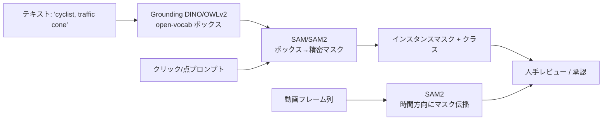
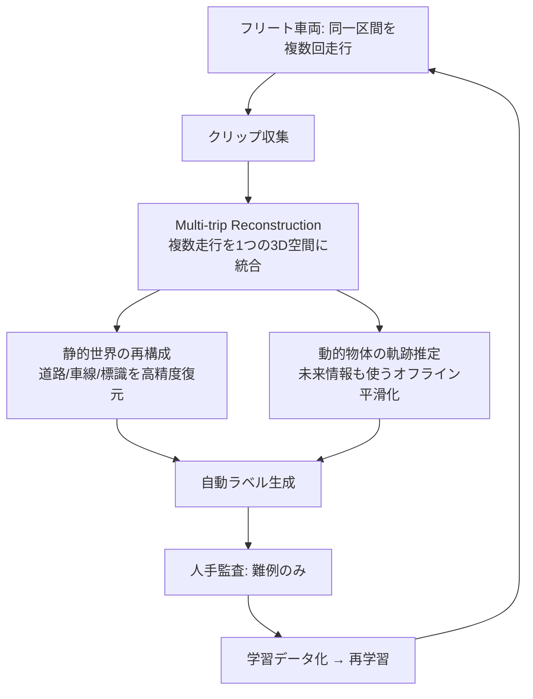
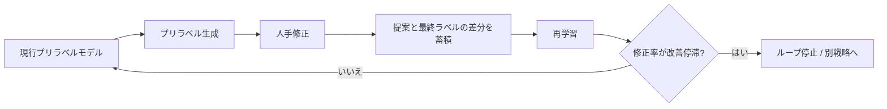

# 5.4 半自動ラベリング・AI アシストツール

本節では、半自動ラベリング (semi-automatic labeling、機械が候補を出して人が修正する方式) の中核技術を実装目線で掘り下げます。SAM／SAM2（Segment Anything Model）[D5, D6]、Grounding DINO（テキストで物体を検出）[D7](references#d7)、Grounded-SAM（Grounding DINO と SAM の連結）[D8](references#d8)、OWL-ViT／OWLv2 [D9](references#d9)、OpenSeeD といったオートラベリング基盤モデルや、Tesla の Auto-labeling Pipeline（Multi-trip Reconstruction、複数走行クリップを 1 つの 3D 空間に統合する手法）[D10](references#d10) を扱います。プリラベル → 人手修正 → 再学習の反復ループと Active Learning（能動学習）との統合を、Closed-Loop の生産設備として組み立てるのが目標です。

## オートラベリング基盤モデルの全体像

2023〜2025 年の基盤モデルは、「クラスを事前定義せずにマスクやボックスを得る」open-world アノテーション（事前にクラスを限定しないアノテーション）を実用化しました。役割を整理します。

> この図のポイント：「テキスト → ボックス（Grounding DINO [D7](references#d7)/OWLv2 [D9](references#d9)）→ 精密マスク（SAM [D5](references#d5)）」の連結が Grounded-SAM [D8](references#d8) の発想で、動画は SAM2 [D6](references#d6) がマスクを時間伝播します。これがプリラベル生成の基本パイプラインです。

| モデル | 入力 | 出力 | 特徴 | ラベリング用途 |
|---|---|---|---|---|
| SAM [D5](references#d5) | 点 / ボックス / 全自動 | クラス非依存マスク | promptable、ゼロショット汎化 | クリック 1 つでマスク化 |
| SAM2 [D6](references#d6) | 点 + 動画 | 時系列マスク | メモリ機構で動画追跡 | フレーム間マスク伝播 |
| Grounding DINO [D7](references#d7) | テキスト | open-vocab ボックス | 言語接地検出 | 未定義クラスをテキストで抽出 |
| Grounded-SAM [D8](references#d8) | テキスト | ボックス + マスク | DINO + SAM 連結 | テキスト → インスタンスマスク |
| OWL-ViT / OWLv2 [D9](references#d9) | テキスト / 画像例 | open-vocab ボックス | image-conditioned 検索可 | 少数例での新クラス検索 |
| OpenSeeD [D16](references#d16) | テキスト | 検出 + セグメンテーション | 検出と seg を統合学習 | 一括マイニング |

### SAM の全自動マスク生成

SAM [D5](references#d5) の automatic mask generator（自動マスク生成器）は、画像にグリッド状の点プロンプトを当て、画像全体のマスク候補を網羅生成します。クラス非依存なので、別途クラス付与（Grounding DINO や CLIP）と組み合わせます。

実装上の主要パラメータは次の 4 つです。

- `points_per_side`：画像の縦横に置く点プロンプトの密度（32 で 32×32 = 1024 点が初期値、密度を上げると小物体に強くなるが計算量が増える）。
- `pred_iou_thresh`：予測 IoU の下限（0.88 程度。高くすると false positive が減るが取りこぼしも増える）。
- `stability_score_thresh`：マスクの安定性スコア閾値（0.92 程度）。
- `min_mask_region_area`：採用する最小ピクセル面積（100 程度。極小ノイズを除去）。

出力は各候補の `segmentation`（マスク）、`area`、`predicted_iou` などを含む辞書のリストです。これらを CLIP や Grounding DINO に通してクラスを後付けし、プリラベル候補へ変換します。GPU メモリと処理時間に応じて密度・閾値をプロジェクトごとに調整してください。

### テキスト駆動の Grounded-SAM パイプライン

「未定義クラスをテキストで指定 → ボックス → マスク」の流れは、タクソノミ拡張（5.1・5.3 節）と直結します。

具体的には次の 4 ステップです。

1. 探したいクラス名をピリオド区切り（例：`cyclist . traffic cone . stroller`）で並べたキャプションを Grounding DINO に与えます。
2. 画像から open-vocabulary 検出として「ボックス座標」と対応する「フレーズ（クラス名）」のペアを取得します。
3. 各ボックスを SAM の `predictor` に渡し、そのボックスを内包する精密マスクを生成します。
4. 「クラス名・ボックス・マスク」をひとまとまりのプリラベルとして書き出します。

Grounding DINO のスコア閾値（box / text）は、再現率優先か適合率優先かで調整します（初期値の例：box_threshold = 0.30、text_threshold = 0.25）。SAM 側は `multimask_output=False` で 1 ボックスにつき 1 マスクに固定するとパイプラインが単純になります。

SAM2 [D6](references#d6) は動画でマスクを時間伝播するため、1 物体に対し初期フレームでプロンプトを与えるだけで以降のフレームを自動追従できます。3D・4D ラベリングの前処理にも有効です。

## Tesla Auto-labeling Pipeline（公開情報の範囲）

Tesla が AI Day 2021／2022 で公開した auto-labeling（自動ラベリング）[D10](references#d10) は、業界標準となった「フリート規模のオフライン自動ラベリング」の代表例です。要点は、**オフラインで重い再構成を行い、オンライン推論より遥かに高精度なラベルを生成する**ことにあります。

> この図のポイント：同一地点を複数台・複数回走行したクリップを 1 つの 3D 空間に統合 (multi-trip reconstruction) することで、単一走行では見えない静的構造を高精度復元し、動的物体は「未来フレームも使える」オフラインの強みで滑らかな軌跡を得ます。人間は難例の監査に集中します。

オフライン auto-labeling の本質的優位は次の3点です。

1. **時間的双方向性**：オンラインは過去しか使えませんが、オフラインは未来フレームも使えるため、オクルージョン復帰やトラッキングが安定します。
2. **重いモデル/アンサンブル**：レイテンシ制約がないため、大型 3D 検出器やアンサンブル (ensemble) を使い高精度化できます。
3. **マルチセンサ・マルチトリップ統合**：複数走行・複数車両の観測を統合し、単発では不可能な再構成を実現します。

この思想は Waymo Open Dataset [P7](references#p7) のオフライン 3D パイプラインや、5.2 節の Open3D による複数フレーム集約とも共通します。

## プリラベルモデルの設計テンプレート

プリラベルモデルはオンラインモデルと別物でよく、「人手修正コストを最小化する」ことが目的関数です。以下の目標値は **著者の運用経験および公開ベンチマーク（nuScenes、Waymo Open Dataset の SOTA 系）から導出した目安** で、自社データの分布・人手アノテーション能力に応じて 5〜10 ポイント単位で調整してください。クラス特性に応じた目標値テンプレートを示します。

| クラス区分 | 推奨方針 | Recall 目標 | Precision 目標 | レイテンシ |
|---|---|---|---|---|
| 安全クリティカル（歩行者／二輪車） | Recall 重視（見逃し最小化） | > 95% | > 70% | < 1 s/frame |
| 一般車両 | バランス | > 90% | > 85% | < 1 s/frame |
| 静的構造（標識／車線） | Precision 重視 | > 85% | > 90% | バッチ可 |

> この表のポイント：安全クリティカルクラスは「見逃しゼロ」を優先し、FP (False Positive、誤検出) の確認負荷を受け入れます。FP はアノテータが却下すれば消えますが、FN (False Negative、見逃し) は気づかれずデータから欠落するためです。

ASIL レベルとの紐付けの一例として、ASIL D 領域（歩行者・子ども・緊急車両）は Recall > 97%、ASIL B 領域（一般車両、二輪車）は Recall > 90% を、プリラベルモデルの最低ラインとして採用ゲートに組み込むと安全議論につなげやすくなります。

信頼度スコアは運用ルールに変換します。「0.9 以上はほぼ正しい（一括承認可）」「0.5〜0.7 は注意確認」「0.5 未満は非表示」のように 3 段階に分け、FixMatch 系の擬似ラベリング (pseudo-labeling、モデル出力を仮ラベルとして再学習に使う手法) 閾値設計（5.5 節）と整合させます。

プリラベルモデルの設計で本書がとくに腑に落ちてほしいのは、「FP（誤検出）と FN（見逃し）は対称ではない」という非対称性です。FP はアノテータが画面上で却下すれば数秒で消えますが、FN は誰の目にも触れずデータセットから静かに欠落します。安全クリティカルクラスでは、この非対称性が ASIL D の Recall > 97% という数値要件と直結します。Recall 97% という数字は単に高い目標値ではなく、「3% の見逃しが残っていても、それが安全認証の根拠データに混じっていることを許容しない」という機能安全の論理を、プリラベルモデルの採用ゲートに翻訳した結果です。だからこそ、プリラベルモデルのバージョンと、それが満たす Recall／Precision の実測値は実験管理に紐付けて永続化される必要があり、後から「この期の学習データはどの世代のプリラベルモデルが生成したか」を追跡できるようにしておかないと、モデル劣化の原因を後追いで切り分けられません。信頼度の 3 段階閾値（一括承認・注意確認・非表示）も同様で、感覚で決めるのではなく、修正率データから定期的に再キャリブレーションする発想を持つことが、アノテーションコストを最適化しつつ Recall を死守する両立を可能にします。

## 反復学習ループと停止条件

停止条件は感覚で決めず、**修正率 (correction rate) の改善が連続 N サイクルで閾値未満**になったら停止、と定量化します。差分（提案 vs 最終ラベル）は最も貴重な学習データであり、「どのシナリオでモデルが系統的に誤るか」を可視化します。

## 難例マイニングの定量化（spatial clustering）

「難例」を曖昧にせず、不確実度・修正頻度・空間的近接でクラスタリングして定義します。同じ交差点・同じ気象条件で修正が密集していれば、それは収集すべき long-tail です。

具体手順は次の 4 ステップです。

1. 各「人手修正イベント」を特徴ベクトル化します。最低限の特徴量は経度・緯度・モデル不確実度の 3 次元で、必要に応じて時刻帯・天候・モデルバージョンなどを加えます。
2. 経度緯度と不確実度はスケールが異なるため、メートル換算や標準化で同じスケールに揃えます。
3. DBSCAN でクラスタリングします（近傍半径 eps はメートル換算後で 30 m 程度、最小サンプル数 min_samples = 10 が初期値）。ノイズ点（ラベル `-1`）を除いた密度の高いクラスタを抽出します。
4. 抽出されたクラスタを「難例ホットスポット」として地図上にプロットし、上位から順に重点再収集・再ラベル対象にします。

eps と min_samples はクラスタ数とホットスポットの粒度を見ながら調整します。誤検出が多い場合は、不確実度の閾値で事前フィルタしてから DBSCAN にかけます。

## Active Learning との統合

半自動ラベリングは Active Learning（能動学習）[AL1, AL2, AL3] と組み合わせると効果が最大化します。BALD（Bayesian Active Learning by Disagreement、ベイズ推論の不一致を活用）[AL1](references#al1)、MC Dropout（Monte Carlo Dropout、推論時に Dropout を使い予測の不確実度を推定）[AL4](references#al4)、Core-Set（埋め込み空間での被覆を最大化する選択法）[AL2](references#al2)、BADGE（勾配の多様性で選ぶ手法）[AL3](references#al3) が代表的です。典型ループは次の 4 ステップです。

1. 現行モデルでフリートログを推論し、不確実度をスコアリングします（BALD [AL1](references#al1)、MC Dropout [AL4](references#al4)、Core-Set [AL2](references#al2)、BADGE [AL3](references#al3)）。
2. 高スコアのフレームを優先キューへ送ります。
3. プリラベルで候補を生成し、人手で修正します。
4. 再学習を行い、不確実度分布の変化を監視します。

これにより「モデルが既に得意なシーン」ではなく「苦手な long-tail」へラベリングリソースを集中できます。

## AI アシスト UX 設計

- **一括承認／却下**：遠方の車線境界など低リスク候補は一括処理、歩行者・近距離車両は個別確認を必須にします。
- **提案理由の可視化 (explainability、説明可能性)**：どの特徴に基づく提案かを Grad-CAM（勾配ベースの可視化）やマップ参照点で提示し、アノテータがモデルの癖を学べるようにします。
- **フィードバックチャンネル**：「この条件では提案しないで」をツールから送信できるようにし、統計を集計してしきい値・プリラベルモデルの改善へ還流させます。

## 本節の振り返り

半自動ラベリングは「人手作業の高速化」ではなく、「Closed-Loop の生産設備」として設計するときに本来の価値を発揮します。SAM/SAM2 [D5, D6]、Grounding DINO [D7](references#d7)、Grounded-SAM [D8](references#d8)、OWLv2 [D9](references#d9)、OpenSeeD のパイプラインは、テキストから精密マスクへ、静止画から動画追従へと、人が介在しなくても良い領域を一段ずつ拡張してきました。Tesla の auto-labeling [D10](references#d10) が示した multi-trip reconstruction の発想は、オフラインの時間的双方向性と重いモデル運用、マルチトリップ統合を組み合わせることで、オンライン推論では到達できない品質のラベルを生成できるという業界標準パターンを与えました。プリラベルモデルは FP と FN の非対称性を踏まえて Recall を ASIL レベルに紐付けて設計し、提案と最終ラベルの差分こそが最も貴重な学習データになります。難例マイニングを空間と不確実度のクラスタリングで定量化し、Active Learning [AL1–AL4] と統合してリソースを long-tail に集中させることで、ラベリング投資が安全インパクトの大きい領域へ集中する仕組みが完成します。

## 次節への橋渡し

プリラベルでも届かない大量の未ラベルデータをどう活かすか——次の 5.5 節では、自己教師あり学習（SimCLR/BYOL/MoCo/DINO/DINOv2 [P16](references#p16)/MAE [P15](references#p15)）、擬似ラベル (pseudo-labeling)、弱教師あり (weak supervision) を扱います。Snorkel [D14](references#d14) の labeling function 設計、ノイズロバスト損失、Cleanlab によるラベルエラー検出を交え、「ラベルコストと性能のトレードオフ」を最適化します。
