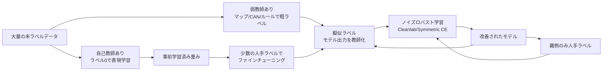

# 5.5 自己教師あり・擬似ラベル・弱教師あり

本節では、ラベルを増やさずに性能を伸ばす 3 系統を実装目線で扱います。すなわち自己教師あり学習 (self-supervised learning、ラベルなしのデータから表現を学ぶ手法)、擬似ラベル (pseudo-labeling、モデル出力を教師として再学習に使う手法)、弱教師あり学習 (weak supervision、ノイズの多い安価な教師信号で学習する手法) の 3 つです。SimCLR（対照学習）／BYOL（自己蒸留）／MoCo（モメンタム対照学習）／DINO／DINOv2 [P16](references#p16)／MAE（Masked Autoencoder）[P15](references#p15) の比較、FixMatch 系の信頼度しきい値とクラスバランス調整、Snorkel [D14](references#d14) の labeling function（弱ラベル付与関数）の運用、Cleanlab によるラベルエラー検出、ノイズロバスト損失（Symmetric CE、Mixup）、そして LiDAR-2D 投影やマップマッチングといった弱ラベル源を、Closed-Loop の中で「ラベルコストと性能のトレードオフ」を最適化する装置として組み立てます。

## 3 系統の位置づけ

まず、ラベルへの依存度と生成されるラベルの粒度で 3 系統を整理します。

> この図のポイント：自己教師ありは「表現の事前学習」、弱教師ありは「粗いラベルの大量生成」、擬似ラベルは「モデル出力の教師化」と役割が異なり、最後にノイズロバスト学習で統合する流れが Closed-Loop の骨格です。

## 自己教師あり表現学習の比較

自己教師あり学習は、ラベルなしの入力からプリテキストタスク (pretext task、本来解きたいタスクの代理として人工的に作る学習タスク) を構成して表現 (representation、特徴ベクトル) を学習します。手法は大きく contrastive 系（対照学習。負例を使い「似ている／似ていない」を学ぶ）、self-distillation 系（自己蒸留。負例不要で教師ネットワークの出力に近づける）、masked modeling 系（マスク再構成。一部を隠してから復元する）に分かれます。

| 手法 | 系統 | 負例 | 鍵となる仕組み | 自動運転での使いどころ |
|---|---|---|---|---|
| SimCLR [P25](references#p25) | contrastive | 必要（大バッチ） | data augmentation + NT-Xent loss | カメラ画像の汎用事前学習 |
| MoCo [P26](references#p26) | contrastive | 必要（キュー + momentum encoder） | 小バッチでも安定 | GPU 制約下の事前学習 |
| BYOL [P27](references#p27) | self-distillation | 不要 | target network への予測 + stop-gradient | 負例設計が難しい長尾シーン |
| DINO [P28](references#p28) | self-distillation | 不要 | ViT + centering/sharpening、emergent attention | セグメンテーション前処理 |
| DINOv2 [P16](references#p16) | self-distillation | 不要 | 大規模キュレーションデータ、汎用密表現 | ゼロショット深度/seg 特徴抽出 |
| MAE [P15](references#p15) | masked modeling | 不要 | パッチの 75% をマスクし再構成 | ViT バックボーンの効率事前学習 |

> この表のポイント：GPU が潤沢なら MAE／DINOv2、バッチサイズに制約があるなら MoCo／BYOL、というように計算資源と下流タスクで選びます。DINOv2 [P16](references#p16) は学習済み特徴をそのまま密予測の前処理に使える点で、ラベリング工程と相性が良いです。

公開研究では、車載カメラ動画に自己教師あり事前学習を施したのち物体検出・セグメンテーションにファインチューニングすると、ラベル付きデータを 1/2〜1/4 に削減しても同等精度に達したと報告される例があります（一般に少ラベル領域ほど事前学習の利得が大きい傾向です）。ラベル作成が高コストな 3D セグメンテーションや行動予測ほど、自己教師ありの恩恵を受けやすいといえます。

contrastive 系の中核損失である InfoNCE（Information Noise-Contrastive Estimation、対照学習で標準的に使われる損失）は、次の 4 ステップから成ります。

1. クエリ表現 $q$、その正例キー $k$、および負例バンクのキュー（MoCo の場合）を用意します。
2. すべての表現を L2 正規化します。
3. クエリと正例の内積（正例類似度）、およびクエリとキュー全体の内積（負例類似度の集合）を計算します。
4. 両者を温度パラメータ $\tau$（典型値 0.07）で割って結合し、softmax ベースのクロスエントロピーで「正例のインデックスが選ばれる確率」を最大化します。

実装上の要点は、温度 $\tau$ の調整と負例バンク（キュー長 K）のサイズです。$\tau$ を下げると分布が鋭くなり困難な負例を強調しますが、過度に下げると勾配が不安定になります。

自己教師あり学習の運用で本書がとくに掘り下げたいのは、「事前学習はラベル削減のための万能手段ではない」という設計判断の難しさです。SSL の利得は少ラベル領域で最も大きく、ラベル付きデータがすでに豊富なクラスや一般車両のような頻出クラスでは、ImageNet 事前学習との差はほとんど消えます。逆に 3D セグメンテーションや行動予測のように、人手ラベル 1 件あたりの単価が桁違いに高い領域では、SSL によるラベル削減が直接的なコスト削減に変換できます。だからこそ、SSL 事前学習を導入する際には「自社のラベル単価が高い領域はどこか」を先に特定し、その領域で ImageNet 重みとのコスト効果比を実測することが出発点になります。さらに重要なのは、安全クリティカル領域では SSL の事前学習効果を盲信しないという設計規律です。SSL で学習された表現は「下流タスクで何を分類しているか」を直接保証しないため、ASIL D 領域では必ず人手ラベルでのファインチューニング後に安全評価をかけ、SSL は「ラベルコスト最適化の手段」であって「安全評価を省略する手段」ではないと位置付ける必要があります。温度 $\tau$ やキュー長といったハイパーパラメータは、見た目以上に下流タスクの性能を左右する一方で、一度プロジェクト固有の最適値に固定してしまえば、その後の再学習サイクルで再探索する必要がなくなる「設計時投資」の性質を持ちます。

## 擬似ラベルの設計：信頼度しきい値とクラスバランス

既存モデルの出力を教師に使う擬似ラベルは、ラベルコスト削減の主力ですが、2 つの課題があります。第一に、確信度の低い予測を学習すると誤りが増幅します。第二に、頻度の高いクラスへ予測が偏ります。FixMatch [D18](references#d18) は前者を高い固定閾値（例 0.95）で抑えますが、自動運転では長尾クラスが閾値を越えにくく後者が深刻化します。そこで **クラスごとに閾値を適応** させ、頻度の逆数で損失重みを与えます（Class-Balanced Loss [AL6](references#al6) の effective number、有効サンプル数を流用）。

実装は次の 2 段階で組み立てます。

**第 1 段階：クラス重みの算出**。各クラスの教師ラベル数 $n_c$ から、Class-Balanced Loss の有効サンプル数 $E_c = (1 - \beta^{n_c}) / (1 - \beta)$（典型値 $\beta = 0.999$）を求めます。その逆数 $1/E_c$ をクラス数で正規化したものを、学習時の損失重みとして与えます。少数クラスほど重みが大きくなり、頻度バイアスを補正できます。

**第 2 段階：擬似ラベル損失**。各サンプルに対しモデルの softmax 確率の最大値 $\text{conf}$ と arg-max クラス $\hat y$ を取り出し、(a) 全クラス共通の基本閾値（例 0.95）、または (b) クラスごとに設定した閾値辞書 `class_thr[ŷ]`（長尾クラスは 0.7 などへ下げる）と比較して、`conf ≥ thr` のサンプルだけを選別します。選別されたサンプルに対し、第 1 段階で求めたクラス重みを `weight` に渡したクロスエントロピー損失を計算します。閾値超えのサンプルがゼロのバッチでは損失をゼロとし、勾配を流さないようにします。`base_thr` と `class_thr` は学習進行に応じて段階的に下げ（curriculum、カリキュラム学習）、初期は厳しく後半は緩めるのが安定します。

擬似ラベルの崩壊（self-confirmation、自己強化的な誤りの増幅）を避けるため、教師 (teacher) と生徒 (student) を分離し、教師は EMA (Exponential Moving Average、指数移動平均) で緩やかに更新します。Closed-Loop では、擬似ラベルで学習したモデルをオフライン評価・シミュレーション（第 7 章）で検証し、特定シナリオで劣化が出たらそのシナリオを人手ラベルへ昇格させます。

## 弱教師あり：自動運転特有のラベル源

弱教師ありでは、ノイズを含む安価なラベル源を大量生成します。自動運転では以下が強力です。

- **LiDAR-to-2D 投影**：LiDAR で得た 3D ボックスをカメラ平面へ投影し、2D ボックスやマスクの弱ラベルを自動生成します。校正済みの内部・外部パラメータ（5.2 節）が前提です。
- **マップマッチング (map matching、走行軌跡を地図へ対応付ける処理)**：走行軌跡を HD マップへスナップし、走行レーン・停止線・横断歩道の存在を自動ラベル化します。
- **車両制御ログ／CAN (Controller Area Network、車載通信規格) 信号**：AEB (Autonomous Emergency Braking、自動緊急ブレーキ) 作動やステア急変を「ヒヤリハット候補」「急制動シーン」として弱ラベル化します。

LiDAR-to-2D 投影の手順は次の 5 ステップです。

1. 3D ボックスの 8 頂点を LiDAR 座標で取得します。
2. カメラと LiDAR 間の外部行列 $T_{cam\leftarrow lidar}$（4×4）でカメラ座標に変換します。
3. カメラ前方（$z > 0$）に残った点だけを残します。
4. 内部行列 $K$（3×3）を掛けてピクセル平面へ射影し、同次座標を $z$ で割って画素座標 $(u, v)$ を得ます。
5. 画素座標の最小値・最大値から軸平行 2D ボックス $(x_1, y_1, x_2, y_2)$ を構成します。

実装上は、画像幅・高さでクリッピングし、画面外に出た頂点が多いボックスは「部分可視」属性を付けるか除外する判断を別途明文化してください。

複数の弱ラベル源は誤りや欠落を含むため、Snorkel [D14](references#d14)（弱教師ありラベル統合フレームワーク）のように複数 labeling function (LF、ヒューリスティクスをコード化した関数) を統合して潜在的な真ラベルを推定します。LF は「精度は低くてよいが、カバレッジと独立性を意識する」のが設計の勘所です。

Snorkel の運用は次の 4 ステップです。

1. 各信号源につき LF を 1 つ以上定義します。LF はサンプルを受け取り `POS／NEG／ABSTAIN`（棄権）のいずれかを返す関数です。たとえば「AEB が作動していたら POS、それ以外は ABSTAIN」「TTC (Time-to-Collision、衝突までの時間) が 1.5 秒未満なら POS、それ以外は NEG」のように、確実に判定できるときだけ POS／NEG を返し、それ以外は棄権するのが定石です。
2. 全 LF を全データに適用し、`N × LF 数` のラベル行列 $L$ を作成します。
3. Snorkel の `LabelModel`（クラス数 = cardinality）を $L$ に対してフィットさせ、LF 間の精度・相関を学習します。
4. 学習済み `LabelModel` で各サンプルの統合された確率的ラベルを予測し、それを「弱教師ラベル」としてデータフレームに保存します。

LF はカバレッジ（棄権率の低さ）、精度、独立性（互いに相関しない情報源）を意識して設計します。`label_model.fit` の epoch 数・seed は再現性確保のため固定します。

## ラベルノイズとロバスト学習

弱ラベル・擬似ラベルにはノイズが残ります。対策は「ノイズを検出して除去」と「ノイズに頑健な損失」の 2 系統です。

| 手法 | 種別 | 仕組み | 適用場面 |
|---|---|---|---|
| Cleanlab [D19](references#d19) | ラベルエラー検出 | confident learning（自信度ベースの誤ラベル特定）で誤ラベルを特定し除去または再ラベル | 既存ラベルセットの監査 |
| Symmetric CE [D20](references#d20) | ロバスト損失 | CE に逆向き項 (RCE) を加え過適合を抑制 | 高ノイズの擬似ラベル学習 |
| Mixup [D21](references#d21) | データ拡張・正則化 | 入力とラベルを線形補間し決定境界を平滑化 | ノイズ全般、汎化向上 |

Symmetric Cross-Entropy (SCE、対称クロスエントロピー) [D20](references#d20) は、通常のクロスエントロピー（CE）に「Reverse CE (RCE)」を足し合わせた損失です。RCE はモデル予測 $p$ を「ターゲット側」、ワンホット target を「予測側」として扱った CE で、極端な確信度に対する過適合を抑制します。実装は次の 4 ステップです。

1. 通常の CE を計算します。
2. softmax 出力 $p$ と target のワンホットそれぞれを微小値 `eps`（例 1e-4）でクランプし、`log(0)` を回避します。
3. RCE = $-\sum_k p_k \log(\text{onehot}_k)$ をバッチ平均で計算します。
4. ハイパーパラメータ $\alpha, \beta$（例 $\alpha = 0.1, \beta = 1.0$）で重み付けし、$\text{SCE} = \alpha \cdot \text{CE} + \beta \cdot \text{RCE}$ を返します。

$\alpha$ と $\beta$ はノイズ率と性能のトレードオフを見ながらバリデーションで調整します。

Cleanlab はラベルセットの監査（5.6 節）と直結し、検出された誤ラベルを優先的に再ラベルキュー（5.7 節）へ送ることで、ノイズ除去そのものを Closed-Loop に組み込めます。弱教師ありで付けた粗いラベルは、モデル誤差の大きい部分から人手ラベルへ「段階的アップグレード」し、限られた予算を安全クリティカル領域へ集中させます。

ラベルノイズ対策で本書が強調したいのは、「ノイズ検出」と「ノイズ耐性損失」は別物であり、両者を併用することが原則だという点です。Cleanlab [D19](references#d19) が検出するのは「ラベルが間違っている可能性が高いサンプル」であり、これを再ラベルキューに送る運用は、ラベルセットの品質を時間とともに改善する仕組みとして機能します。ところが、Cleanlab で全ノイズを除去しきれるわけではないため、学習損失自体をノイズに頑健な Symmetric CE や GCE に切り替えておくことで、検出漏れたノイズに対する保険を二重に張る構造になります。さらに重要な設計原則は、「弱ラベル源の劣化を継続観測する」発想です。LiDAR-2D 投影は校正がずれた瞬間に弱ラベルの精度が崩れ、マップマッチングは地図が古くなった瞬間に偽の停止線ラベルを量産し、CAN ベースの弱ラベルはセンサ仕様変更で意味が変わります。これらを「設定したら終わり」にせず、源ごとの精度を四半期で再評価し、劣化した源を LF から外すかロジックを書き直す運用がないと、Snorkel [D14](references#d14) の LabelModel が学習した精度推定が現実とずれていきます。安全クリティカル領域では、これらの弱ラベルを単独で出荷せず必ず人手ラベルへアップグレードする規律を持つことが、ASIL D 級の Recall 要件を守る最後の砦になります。

## 本節の振り返り

ラベルを増やさずに性能を伸ばす 3 系統は、「自己教師ありで表現を作る」「弱教師ありで粗いラベルを大量生成する」「擬似ラベルでモデル出力を教師化する」と役割が異なり、それぞれが Closed-Loop の別の局面に効きます。SSL（SimCLR/MoCo/BYOL/DINO/DINOv2 [P16](references#p16)/MAE [P15](references#p15)）は計算資源と下流タスク、そして「自社でラベル単価が高い領域はどこか」によって選び、少ラベル領域ほど事前学習の利得が大きいという性質を活かします。擬似ラベルは FixMatch [D18](references#d18) の固定閾値を基準としつつ、クラス別しきい値と effective number 重み [AL6](references#al6) でクラスバランスを補正し、teacher/student の EMA 分離で自己強化的崩壊を防ぐのが現代的な作法です。弱教師ありでは LiDAR-2D 投影・マップマッチング・CAN といった自動運転特有の信号源を Snorkel [D14](references#d14) の labeling function で統合し、確率的ラベルへ変換しつつ、源ごとの精度を継続的に再評価します。最後に、Cleanlab [D19](references#d19) による検出と Symmetric CE [D20](references#d20)/Mixup [D21](references#d21) による頑健損失を併用し、安全クリティカル領域では人手ラベルへのアップグレードを必須とすることで、ラベルコストと性能のトレードオフが安全側に偏った設計になります。

## 次節への橋渡し

ここまでで自動生成・弱生成したラベルは、いずれも「どれだけ信頼できるか」を測らなければ運用に乗せられません。次の 5.6 節では、ダブルアノテーションとレビュー体制、Cohen's Kappa [D11](references#d11)/Fleiss' Kappa [D12](references#d12)/Krippendorff's α [D13](references#d13) の数式と Python 実装、2D/3D IoU と Panoptic Quality の閾値、Risk-weighted F1、3D 検出の Orientation/Depth 誤差まで、ラベル品質を継続的に測定・改善する仕組みを掘り下げます。
