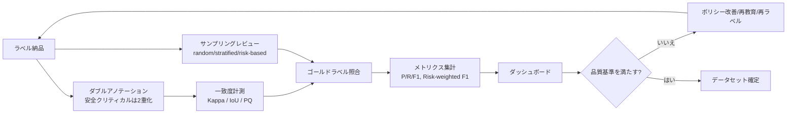

# 5.6 品質管理（ダブルアノテーション、レビュー、メトリクス）

本節では、ラベル品質を継続的に測定・改善する仕組みを数式と実装で掘り下げます。ダブルアノテーション（同じ対象を 2 名が独立にラベル付け）とレビュー体制、Inter-annotator agreement (IAA、評価者間一致度) の 3 大指標、すなわち Cohen's Kappa [D11](references#d11)、Fleiss' Kappa [D12](references#d12)、Krippendorff's α [D13](references#d13) の数式と Python 実装、2D／3D IoU と Panoptic Quality (PQ) の閾値設計、安全影響を加味した Risk-weighted F1、3D 検出特有の Orientation／Depth 誤差までを扱います。Closed-Loop の中で「ラベルの問題か、モデルの限界か」を構造的に切り分けられる計測基盤を整えるのが本節の狙いです。

## 品質管理パイプラインの全体像

> この図のポイント：一致度計測（Kappa/IoU/PQ）とサンプリングレビューを両輪とし、ゴールドラベル照合で得たメトリクスを「合否判定 → フィードバック」に必ず接続するのが Closed-Loop 品質管理の要です。

## Inter-annotator agreement の 3 大指標

一致度はラベルの主観性を定量化します。単純一致率 (percent agreement、観測一致率) は偶然の一致を含むため、**偶然一致を除いた指標**を用います。

### Cohen's Kappa（2 名・名義尺度）[D11](references#d11)

Cohen's Kappa は「2 名のアノテータがどれだけ偶然以上に一致しているか」を測る指標です。観測一致率を $p_o$、偶然一致率を $p_e$ とすると、

$$\kappa = \frac{p_o - p_e}{1 - p_e}, \qquad p_e = \sum_{k} p_{k}^{(1)} p_{k}^{(2)}$$

ここで $p_{k}^{(i)}$ はアノテータ $i$ がクラス $k$ を付けた周辺確率です。$\kappa$ は $-1$〜$1$ の範囲で、目安として 0.6 以上で「かなり良い」、0.8 以上で「ほぼ完全」とみなすことが多いです。

### Fleiss' Kappa（3 名以上・名義尺度）[D12](references#d12)

Fleiss' Kappa は「3 名以上の評価者が同じ対象を分類したときの一致度」を、偶然一致を除いて測る指標です。$N$ 個の対象、$n$ 名の評価者、$k$ クラスで、対象 $i$ がクラス $j$ に割り当てられた数を $n_{ij}$ とします。対象ごとの一致度 $P_i$ と全体平均 $\bar P$、クラス周辺確率 $p_j$ から、

$$P_i = \frac{1}{n(n-1)} \sum_{j} n_{ij}(n_{ij}-1), \quad \bar P_e = \sum_j p_j^2, \quad \kappa = \frac{\bar P - \bar P_e}{1 - \bar P_e}$$

### Krippendorff's α（欠損・多尺度対応）[D13](references#d13)

Krippendorff's α は「評価者数が対象ごとに異なっていてもよく、名義・順序・間隔・比率の各尺度に統一的に適用できる」一致度指標です。観測不一致 $D_o$ と期待不一致 $D_e$ から $\alpha = 1 - D_o/D_e$ で定義されます。複数ベンダー・欠損ありの実運用で頑健です。

| 指標 | 評価者数 | 尺度 | 欠損 | 主な用途 |
|---|---|---|---|---|
| Cohen's Kappa [D11](references#d11) | 2 名固定 | 名義 | 不可 | ペアレビュー、新人 vs 熟練 |
| Fleiss' Kappa [D12](references#d12) | 3 名以上 | 名義 | 原則不可 | 複数ベンダー一致度 |
| Krippendorff's α [D13](references#d13) | 任意 | 名義/順序/間隔/比率 | 可 | 欠損ありの大規模運用 |

> この表のポイント：2 名なら Cohen、3 名以上の名義なら Fleiss、欠損や多尺度が絡むなら Krippendorff、と選びます。迷ったら最も汎用な α が安全です。

### ライブラリでの算出（sklearn / statsmodels / krippendorff）

実装は既存のライブラリで完結します。Cohen's Kappa は `sklearn.metrics.cohen_kappa_score(ann1, ann2)` に 2 名分のラベル列（同じ長さのリスト）を渡すだけで算出できます。Fleiss' Kappa は `statsmodels.stats.inter_rater` の `aggregate_raters` で「N 対象 × n 評価者」のラベル行列を「対象ごとのクラス度数表」に変換し、`fleiss_kappa(table)` に渡します。Krippendorff's α は `krippendorff` パッケージで、信頼度データ行列と尺度（`nominal` / `ordinal` / `interval` / `ratio`）を `krippendorff.alpha(reliability_data=..., level_of_measurement="nominal")` のように指定して算出します。サンプル数が少ない場合の信頼区間はブートストラップで補強し、結果はクラス別・ベンダー別にダッシュボード化します。

物体検出・セグメンテーションでは、ボックスやマスクの IoU が一定以上のとき「同一物体」とみなしてからクラス一致を Kappa で評価します（例：IoU $\ge 0.5$ でマッチング）。

Kappa を運用に落とすうえで本書がとくに掘り下げたいのは、「Kappa 0.7」という基準値がなぜ「かなり良い」とされるかの背景にある統計的意味です。Cohen's Kappa は偶然一致率を差し引いた指標であり、$\kappa = 0.7$ は「観測された一致のうち、偶然では説明できない部分が支配的」と読みます。逆に $\kappa = 0.5$ では、観測一致率が高くてもその半分は偶然で説明できる水準にあり、ラベルの再現性が安全認証の根拠データとしては弱すぎることになります。だからこそ、ASIL D 領域では $\kappa \geq 0.85$、ASIL B 領域では $\geq 0.75$ のように差を付ける設計に意味が出てきます。重要なのは、Kappa が基準を割ったときに「アノテータが下手だった」と短絡せず、定義書改訂・追加教育・ベンダー切り替えという 3 つの異なる原因と対処を切り分ける文化を持つことです。たとえば全クラスで Kappa が一斉に下がったときは定義書の問題、特定クラスだけで下がったときはアノテータ教育の問題、特定ベンダーだけで下がったときはベンダー固有の問題、というように切り分けの仮説が異なります。さらに、一致度の結果をデータセットのリリースノートに添付して下流チームへ自動配信する仕組みは、後のモデル評価で「この期のデータはラベル一致度がこの水準だった」とトレースできるようにするための、ISO 26262 [L1](references#l1) レベルの説明責任を満たす最小構成です。

## IoU 閾値と Panoptic Quality

タスクごとに一致・正解の閾値を明文化します。

| タスク | 指標 | 一致/正解の閾値（目安） | 備考 |
|---|---|---|---|
| 2D 検出 | IoU | 0.5（COCO は 0.5:0.95 平均） | 小物体は閾値感度が高い |
| 2D セグメンテーション | mask IoU | 0.5〜0.7 | 境界曖昧クラスは緩める |
| Panoptic | PQ | TP は IoU > 0.5 | SQ × RQ に分解 |
| 3D 検出（車載） | 3D IoU / center dist | IoU 0.5 or 中心距離 0.5–2.0m | nuScenes は距離閾値 [P6](references#p6) |

> 上の閾値は COCO、nuScenes、ONCE [P10](references#p10) などの公開ベンチマーク慣行に倣った汎用初期値です。安全クリティカルなタスク（特に Planning へ流れる近距離物体や車線中心からのずれ）では IoU 0.5 では甘いことがあります。**自社 ODD・予測ホライズン・ASIL に応じて閾値を厳しく設定** してください（例：ASIL D 領域は IoU $\geq 0.7$、近距離歩行者は中心距離 $\leq 0.5$ m）。

Panoptic Quality (PQ、パノプティックセグメンテーション用の品質指標) [D17](references#d17) は、マッチした領域の質と検出の網羅を分離します。

$$PQ = \underbrace{\frac{\sum_{(p,g)\in TP} IoU(p,g)}{|TP|}}_{SQ\ (品質)} \times \underbrace{\frac{|TP|}{|TP| + \tfrac{1}{2}|FP| + \tfrac{1}{2}|FN|}}_{RQ\ (網羅)}$$

実装の手順は次の 4 ステップです。

1. 予測領域と GT (Ground Truth、正解ラベル) 領域を IoU > 0.5 でマッチングし、TP ペアの集合とその IoU 値リストを得ます。
2. マッチしなかった予測を FP、マッチしなかった GT を FN として件数を数えます。
3. Segmentation Quality (SQ) を「TP ペアの IoU の平均値」、Recognition Quality (RQ) を上式の検出 F1 形式で算出します。
4. PQ = SQ × RQ として返します。

クラスごとに同じ計算を行い、最後にクラス平均（mean PQ）を取るのが COCO Panoptic [D17](references#d17) の慣行です。TP がゼロのクラスは PQ = 0 として明示的に処理します。

## Risk-weighted F1：安全影響の重み付け

通常の F1 はクラスを等価に扱いますが、ラベリングでは「歩行者の見逃し」と「遠方ガードレールの誤り」を同列に扱うべきではありません。Risk-weighted F1 は「安全影響度を加味した重み付き F1」のことで、クラス $c$ に安全影響度 $w_c$ を与え、特に FN（見逃し）へ重みを乗せて算出します。

$$P_w = \frac{\sum_c w_c\,TP_c}{\sum_c w_c (TP_c + FP_c)}, \quad R_w = \frac{\sum_c w_c\,TP_c}{\sum_c w_c (TP_c + FN_c)}, \quad F1_w = \frac{2 P_w R_w}{P_w + R_w}$$

実装は通常の F1 と同じ枠組みで、次の 4 ステップで済みます。

1. クラスごとの TP／FP／FN を数え上げます。
2. クラスごとの安全影響度 $w_c$（後述の ASIL 対応表など）を辞書で用意します。
3. 上式の分子・分母をクラスにわたって重み付き合計します。
4. $P_w$ と $R_w$ から重み付き F1 を算出します。

例として歩行者を $w = 5.0$、ガードレールを $w = 1.0$ と設定し、歩行者の TP=90／FP=5／FN=10、ガードレールの TP=70／FP=20／FN=30 のような統計を与えます。すると歩行者側の見逃し（FN）が結果に強く効くため、通常 F1 では見えなかった「安全クリティカル領域の品質悪化」を可視化できます。

> 安全影響度 $w_c$ は ISO 21448 (SOTIF) [L2](references#l2) のハザード分析（第7章）と整合させると、品質指標が安全議論に直結します。具体的には、ハザード解析で導出した ASIL レベルとの対応を **ASIL D = 5.0、ASIL C = 3.0、ASIL B = 2.0、ASIL A = 1.5、QM = 1.0** のように決め、組織の安全方針として固定します（数値は ISO 26262 FMEA の Risk Priority Number から逆算した参考値で、最終決定は安全責任者の承認を経ること）。本書は法的・安全認証上の助言を与えるものではなく、検証は読者の責任で行う必要があります。

Risk-weighted F1 を主指標に据える設計判断の本質は、「平均的な品質が高く見えるのに、安全クリティカル領域だけ静かに悪化している」状態を可視化できることにあります。通常の F1 はクラスを等価に扱うため、頻出クラスの精度が高ければ全体平均が良く見えてしまい、出現頻度の低い歩行者や子ども、緊急車両の品質低下が指標に埋もれます。Risk-weighted F1 と通常 F1 の「差分」を観測することは、この埋もれを検出するための最も鋭敏な手段で、差分が広がっているクラスは「安全クリティカルなのに品質が低い」最優先改善対象として浮かび上がります。さらに、ASIL D 領域 Recall 97% という目標値は、単独の数値目標ではなく「リリースゲートに組み込む合否条件」として運用してはじめて意味を持ちます。「目標は 97% です」と書くだけでは現場は守りませんが、「97% を割ったらリリースを止める」と決めると、現場は本気でラベル品質と再ラベルキューを設計します。$w_c$ の改訂を ISO 21448 (SOTIF) [L2](references#l2) のハザード分析の更新と同期させる発想は、品質指標と安全議論が別バージョンで動き出すと、安全主張の根拠が時間的にずれて成立しなくなる事態を防ぐ仕組みであり、認証監査の場面でラベル品質と安全責任の説明責任を一致させる前提条件として効きます。

## 3D 検出特有のメトリクス：Orientation / Depth

3D ラベリングでは IoU だけでなく、向きと奥行きの誤差が下流の予測・計画に直結します。nuScenes [P6](references#p6) の TP (True Positive) メトリクスに倣い、以下を計測します。

- **Orientation Error (AOE、Average Orientation Error)**：予測向きと真値のヨー角差（ラジアン、$[0, \pi]$ に正規化）。
- **Translation Error (ATE、Average Translation Error)**：中心位置のユークリッド距離（特に奥行き方向の系統誤差を監視）。
- **Scale Error (ASE、Average Scale Error)**：$1 - \text{3D IoU}$（向き・位置を揃えた後の寸法ずれ）。

Orientation Error は「予測ヨー角と真値ヨー角の差を $2\pi$ で剰余を取り、$[0, \pi]$ に正規化した値」を返します。つまり、絶対差を $2\pi$ で剰余化したうえで、得られた値と「$2\pi$ からその値を引いた値」の小さい方を採用すれば、180° を超える差が反対側に折り返されて常に最短角差になります。Translation Error は「予測中心と真値中心のユークリッド距離（メートル）」をそのまま返します。Scale Error は予測ボックスを真値の中心と向きに揃えてから、3D IoU を計算し $1 - \text{IoU}$ として求めます。これらの実装には `numpy` の三角関数とノルム計算で十分です。デバッグ時には「ヨー誤差が $\pi/2$ を超える件数」を別途集計しておくと、向きが 90°／180° 反転する系統誤差をすぐ発見できます。

これらは「ボックスは合っているのに向きが 180° 反転」といった、IoU では見えにくい系統的ラベル誤りを検出します。

## サンプリングレビューとベンダー比較

全数ダブルアノテーションは非現実的なため、サンプリングレビューを設計します。**ランダム**（全体品質の推定）、**層別 (stratified、長尾・安全クリティカルを厚く)**、**リスクベース**（モデル誤差や過去ミスの多い領域を優先）を併用します。リスクベースは第 7・8 章の評価結果と連携し、「実車で問題が出た領域を重点監査する」Closed-Loop を形成します。

外部ベンダーが複数いる場合は、小さな共通テストセット（例 1,000 フレーム）を全ベンダーに依頼し、内部ゴールドラベルと照合してクラス別 P／R／IoU・Kappa を比較します。SLA／SLO は「納品数」だけでなく「安全クリティカルクラスの誤り率 $\leq$ X%」「基準割れ時は無償再ラベル」を契約に明記します。

## 本節の振り返り

ラベル品質管理の核心は、「ラベルの揺らぎを統計量に落として可視化する」ことと、「その統計量を Closed-Loop の合否判定に直結させる」ことの両輪にあります。一致度は Cohen [D11](references#d11)、Fleiss [D12](references#d12)、Krippendorff α [D13](references#d13) を評価者数・尺度・欠損の有無で使い分け、$\kappa = 0.7$ や $\geq 0.85$ といった基準値は偶然一致を差し引いた再現性の保証として読み解きます。検出やセグメンテーションの閾値は COCO や nuScenes [P6](references#p6) の慣行を起点に、ASIL レベルや予測ホライズンに応じて厳格化し、Panoptic Quality [D17](references#d17) は SQ と RQ への分解で「品質と網羅のどちらが原因か」を切り分けます。Risk-weighted F1 は安全影響度をクラス重みに翻訳し、通常 F1 との差分が安全クリティカル領域の埋もれた品質悪化を炙り出します。3D 検出特有の Orientation/Translation/Scale 誤差は IoU では見えない系統誤り（180° 反転、奥行きバイアス）を補足し、これらすべてが ISO 21448 [L2](references#l2) のハザード分析と同一バージョンで運用されることで、ラベル品質が安全責任と地続きの議論として扱える状態が完成します。

## 次節への橋渡し

品質指標が整えば、それを「いつ・どこで・どれだけ測り直すか」という運用設計が次の課題です。次の 5.7 節では、Active Learning との統合フロー、インシデント周辺ログの空間距離ベース抽出、再ラベルの ROI 見積もり、ルールベース自動変換の P/R/F1 評価、Grafana/SQL によるフリート規模の進行管理ダッシュボードを扱い、運用中もラベルセットが進化し続ける Closed-Loop を組み上げます。
