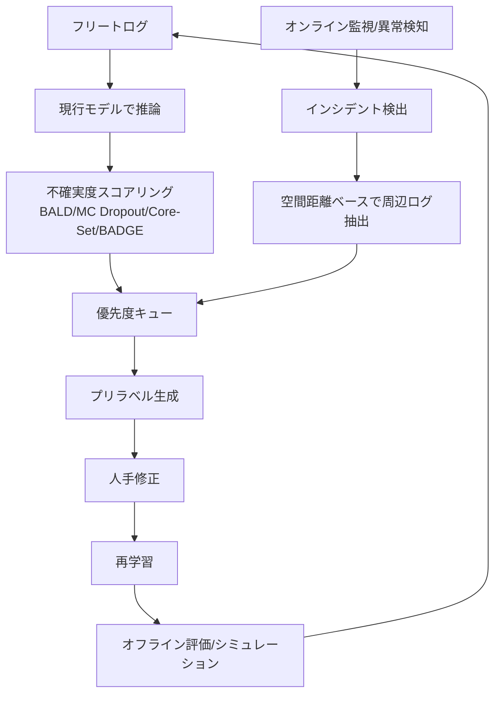

# 5.7 オンラインでの継続ラベル付け・再ラベル

本節では、運用フェーズで「ラベルセットが進化し続ける」Closed-Loop を実装目線で設計します。Active Learning (AL、能動学習) を統合した継続ラベリングフロー、インシデント周辺ログの空間距離ベース抽出、ポリシー変更時の再ラベル ROI (Return on Investment、投資対効果) 見積もり、ルールベース自動変換の P／R／F1 評価、Grafana／SQL によるフリート規模の進行管理ダッシュボードを扱います。「現場で起きた事象が数週間以内に学習データへ取り込まれる」運用を現実的に回せる形にするのが本節の狙いです。

## Active Learning 統合フロー

継続ラベリングは、AL のクエリ戦略と組み合わせると効果が最大化します。フリートログを現行モデルで推論し、不確実度の高いサンプルを優先キューへ送り、プリラベル → 人手修正 → 再学習を回します。

> この図のポイント：AL の「不確実度ドリブン」と、インシデントの「事象ドリブン」の 2 系統を同一の優先度キューに合流させ、再学習 → 評価 → フリートへ戻す閉路を作ります。これにより、モデルが既に得意なシーンではなく long-tail にラベリングリソースを集中できます。

AL のクエリは BALD [AL1](references#al1)、MC Dropout [AL4](references#al4)、Core-Set [AL2](references#al2)、BADGE [AL3](references#al3) を併用します。最も単純なエントロピーベースの不確実度クエリは、次の 3 ステップで実装できます。

1. フリート推論結果のロジット行列（サンプル数 N × クラス数 C）を softmax 化して確率分布 $p$ にします。
2. 各サンプルについて予測エントロピー $H = -\sum_c p_c \log p_c$ を計算します（数値安定化のため確率を $10^{-8}$ 程度でクランプ）。
3. エントロピーが大きい上位 $k$ サンプルのインデックスを返します。

BALD などの相互情報量ベース指標を使う場合は、MC Dropout で複数回推論して、分布のエントロピーから個別エントロピーの平均を引く形に拡張します。Core-Set／BADGE は埋め込み空間での被覆や勾配情報に基づくため、別途特徴量や勾配ベクトルの抽出が必要です。

## インシデント周辺ログの空間距離ベース抽出

インシデント・ヒヤリハットは、時間窓（例：前後 30 秒）だけでなく **空間距離** で周辺ログを集めると、同一地点を通過した別走行・別車両のデータまで束ねられ、再現性のある long-tail を構成できます。

実装は次の 3 ステップで構成します。

1. 入力としてインシデント発生地点の GPS 座標（緯度・経度）と、フリートログの位置レコード一覧を受け取ります。
2. 各ログ点との球面距離 (haversine distance、緯度経度間の球面距離) を計算します。haversine の公式は、緯度経度をラジアン化したうえで $h = \sin^2(\Delta\phi/2) + \cos\phi_1 \cos\phi_2 \sin^2(\Delta\lambda/2)$ を求め、距離 $d = 2 R \arcsin(\sqrt{h})$（地球半径 $R = 6371000\,\text{m}$）として算出します。
3. 距離が指定半径（例：50 m）以下のログを抽出します。

抽出したタスクには事件番号・日時・場所・車両 ID・安全影響度をメタデータとして付与し、「どのインシデントにどのラベルを付け、どのモデル改善につながったか」を追跡可能にします。優先度キューは安全影響度で順序付けし、AEB 作動を伴うヒヤリハットは最高優先とします。Haversine は球面モデルでの近似で、半径数十 m〜数 km の近接抽出には十分です。ただし、高緯度地域や数十 km スケールでは地球楕円体 (WGS84) に基づく Vincenty 法や `geographiclib` のほうが m 単位で正確です。

## 再ラベル ROI の見積もり

ポリシー変更（クラス分割・統合、境界ケース定義変更）に伴う全量再ラベルは非現実的です。**影響範囲 × 期待性能改善 / コスト** で ROI を算出し、優先順位を付けます。

| 領域 | 影響フレーム数 | 単価(円/枚) | コスト(万円) | 期待 ΔmAP | ROI 指標(ΔmAP/万円) | 優先度 |
|---|---|---|---|---|---|---|
| 歩行者・二輪周辺 | 20,000 | 30 | 60 | +2.1 | 0.035 | 高 |
| 交差点(都市) | 35,000 | 25 | 87.5 | +1.4 | 0.016 | 中 |
| 駐車/停車分離 | 50,000 | 20 | 100 | +0.6 | 0.006 | 低 |

> この表のポイント：単に枚数やコストで決めず、「1 万円あたりの性能改善」で並べると、安全クリティカル領域から段階的に再ラベルする合理的な順序が見えます。ΔmAP は小規模パイロット再ラベル後の評価で推定します。

ROI 指標の算出はシンプルで、次の 2 ステップです。

1. 影響フレーム数と単価（円／枚）からコストを算出し、万円単位に換算します。
2. 期待 ΔmAP（小規模パイロットでの実測値）を (1) のコストで割り、「ΔmAP／万円」を得ます。

期待 ΔmAP はパイロットでブートストラップ信頼区間を取り、下側信頼限界を採用すると過大評価を避けられます。

再ラベル ROI を運用する際に本書がとくに腑に落ちてほしいのは、「ROI が高い順に着手する」という単純なルールが安全クリティカル領域で破綻するという点です。歩行者・子ども・緊急車両のような ASIL D 領域は、ΔmAP の絶対値が小さくても、見逃しが事故に直結するため経済的 ROI では測れません。だからこそ、ASIL D 領域の再ラベルは ROI 値に関わらずキューの先頭に積み、その後で残りの予算を ROI 順に配分する 2 段階意思決定が必要になります。さらに重要なのは、パイロット結果のフィードバックループです。期待 ΔmAP は小規模パイロットで推定する設計ですが、パイロット結果が当初想定の 50% 未満だった場合、それは「ラベル品質が原因ではなく、モデル設計やデータ分布が真の制約」というシグナルかもしれません。このとき再ラベル範囲を機械的に拡大するのではなく、戦略そのものを見直すゲートを設けないと、コストだけ膨らんで性能が動かない事態に陥ります。完了した再ラベルプロジェクトの実績を ROI 履歴台帳に残す習慣は、次回の見積もり精度を高めるだけでなく、「どの種類のポリシー変更がどれだけの性能改善に結びつくか」という組織知を蓄積する仕組みでもあり、Closed-Loop が時間とともに賢くなる土台となります。

## ルールベース自動変換の P/R/F1 評価

再ラベルの一部はルールベースやモデルで自動変換し、人手は境界ケースに集中させます。ただし **自動変換の精度を必ず測定** し、信頼できる範囲だけ無人化します。たとえば車速・位置から「駐車 vs 走行」を自動判定し、ゴールドラベルで P／R／F1 を検証します。

具体的な検証手順は次の 4 ステップです。

1. 変換ルールを関数化します。例として「車速 < 1.0 km/h かつ縁石近接 (near_curb) なら parked、それ以外は moving」のようなルールを定義します。
2. ゴールドラベルが付いたサンプル集合に対し、ルールを適用して予測ラベルを得ます。
3. `sklearn.metrics.precision_recall_fscore_support` でクラス別の Precision／Recall／F1 を算出します（`average=None` でクラス別、ラベル順は `["parked", "moving"]` のように固定）。
4. クラスごとに F1 が基準（例 0.95）を満たすか判定します。

たとえば `parked` の Precision が低ければ「ルールが parked 判定したケースのみ人手確認」、Recall が低ければ「moving 判定でも疑わしい例（車速がしきい値付近）を人手確認」のようにフォールバック条件を追加します。

F1 が基準（例 0.95）を超えるクラスは自動変換を採用し、下回るクラスは人手確認キューへフォールバックする、という運用ルールを設けます。これにより自動変換の誤りが静かに混入することを防げます。

## プリラベリングループのリードタイム

Closed-Loop の実効性は「検出 → ラベル完了 → 再学習 → 配備」までのリードタイム (lead time) で決まります。各段の所要時間を分解して監視し、ボトルネックを特定します。

| 段階 | 典型リードタイム | 短縮策 |
|---|---|---|
| インシデント検出 → キュー投入 | 数分〜数時間 | ストリーム処理で自動投入 |
| プリラベル生成 | 数分/バッチ | GPU バッチ推論の並列化 |
| 人手修正 | 数時間〜数日 | 難例のみ人手、低リスクは一括承認 |
| 再学習 | 数時間〜数日 | 増分学習・差分データのみ追加 |
| 評価 → 配備 | 数日 | 自動評価ゲートで承認を高速化 |

> この表のポイント：人手修正と再学習が支配的なため、プリラベルの精度向上（人手削減）と増分学習（再学習短縮）がリードタイム短縮の二大レバーです。目標は「現場の事象が数週間以内に学習データへ反映される」ことです。

リードタイム管理で本質的に問われるのは、「Closed-Loop の周回時間」が組織の学習速度と等価であるという認識です。検出から再学習・配備までが 3 か月かかる組織と 2 週間で回せる組織では、同じデータ量を扱っていても得られる安全性は桁で違います。リードタイムを段階別に可視化する目的は、平均値そのものを下げることではなく、「人手修正が支配的なのか、再学習が支配的なのか」というボトルネックの所在を毎月特定し、その段にだけ施策を集中させることにあります。プリラベル精度の向上は人手修正段階に効き、増分学習の整備は再学習段階に効きますが、両方を同時に攻めるとどちらも中途半端になります。さらに重要なのは、「平均リードタイム」と「安全クリティカル領域のリードタイム」を区別する設計です。AEB 作動を伴うようなヒヤリハットは、月次平均の流れに任せて 30 日後に学習されるのではなく、専用のファストレーンで 7 日以内に取り込まれる必要があります。これは平均では見えない「最悪値」のコントロールであり、安全部門と共通 OKR を組むことで、リードタイム短縮を「効率改善」ではなく「安全責任」の文脈で組織横断的に推進できる土台になります。

## フリート規模の進行管理ダッシュボード（Grafana/SQL）

継続ラベリングと再ラベルの進行は、ODD セグメント・インシデント種別・ポリシーバージョン別に可視化します。ラベリングタスクの状態テーブル（`labeling_tasks`）を集計する Grafana ダッシュボードの定義例を 2 つ示します。

1 つ目は **ODD セグメント別のラベル進行率パネル**。`labeling_tasks` を ODD セグメントでグルーピングし、各セグメントごとに「総タスク数」「`status = 'labeled'` の件数」「進行率（%）」を集計します。Grafana 変数 `$policy` でポリシーバージョンを絞り込み、進行率の昇順で並べることで遅れている領域を上に表示します。

2 つ目は **インシデント種別ごとのラベル完了率と平均リードタイム**。直近 90 日に検出されたタスクを `incident_type` でグルーピングし、件数 `n`、検出から完了までの経過秒数の平均を日数換算した `avg_leadtime_days`、`status = 'labeled'` の割合を完了率（%）として算出します。リードタイムの降順で並べると、滞留しているインシデント種別が上位に出ます。SQL 方言は PostgreSQL を想定していますが、`EXTRACT(EPOCH FROM ...)` や `FILTER (WHERE ...)` を MySQL 等に合わせて書き換えれば他 RDBMS でも同じ集計が可能です。

これらを第6・7章の評価結果と突き合わせ、「モデル性能が低い領域」と「ラベル不足の領域」を照合することで、次にどこへラベリングリソースを投下すべきかを定量的に意思決定できます。また、実験管理システム上で「どのモデルがどのポリシーバージョンのラベルで学習されたか」を記録し、再現性を担保します。

## 本節の振り返り

オンライン継続ラベリングの本質は、「データ収集 → ラベル付け → 学習 → 評価 → 配備」のループを、現場で起きた事象が数週間以内に学習データへ取り込まれる速度で回すことにあります。Active Learning [AL1, AL2, AL3, AL4] の不確実度ドリブンとインシデントの事象ドリブンを同一キューに合流させることで、モデルが既に得意なシーンではなく long-tail にラベリングリソースが集中する仕組みが成立します。インシデント周辺ログは時間窓だけでなく Haversine 距離による空間抽出を組み合わせ、別走行・別車両の同一地点データまで束ねることで再現性のある学習データを構成します。再ラベル ROI は ΔmAP／万円という指標で経済合理性を見つつ、ASIL D 領域は ROI に関わらず先頭に積むという 2 段階の意思決定で安全側に倒します。ルールベース自動変換は P/R/F1 で精度を測ってから無人化範囲を決め、基準割れクラスは人手確認へフォールバックさせます。リードタイム短縮は組織の学習速度そのものであり、Grafana/SQL で段階別・ODD 別に可視化したうえで、ボトルネック段だけに施策を集中させ、安全クリティカル事象は別レーンで 7 日以内に反映するという最悪値コントロールを並走させることが、Closed-Loop の実効性を決めます。

## 次節への橋渡し

運用中にデータが組織やシステムを跨いで動き続けるほど、ラベリング工程のセキュリティ・プライバシーが重要になります。次の 5.8 節では、地域別コンプライアンス（中国 PIPL [L12](references#l12)/EU GDPR [L14](references#l14)/日本 改正個保法 [L13](references#l13)/米国）の比較、VDI のインフラ仕様、ベンダー契約チェックリスト、データ主体の削除要請フロー、Membership Inference 攻撃への対策を扱い、第5章を締めくくります。
