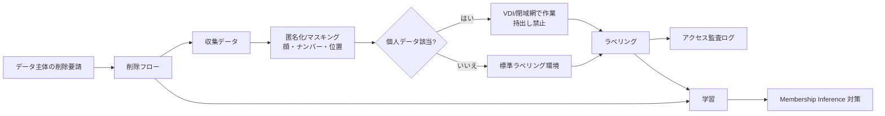
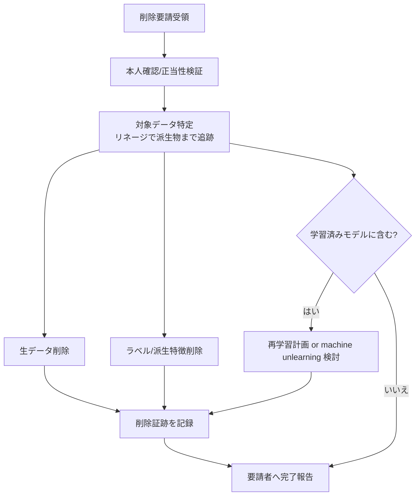

# 5.8 セキュリティ・プライバシーの観点

本節では、ラベリング工程を含めたデータ保護を、地域別コンプライアンスと技術対策の両面から設計します。中国 PIPL (Personal Information Protection Law、個人情報保護法) [L12](references#l12)、EU GDPR (General Data Protection Regulation、一般データ保護規則) [L14](references#l14)、日本の改正個人情報保護法 [L13](references#l13)、米国 (CCPA (California Consumer Privacy Act) 等) の比較を行います。さらに、仮想デスクトップ (VDI、Virtual Desktop Infrastructure) のインフラ仕様、外部ベンダー契約チェックリスト、データ主体の削除要請フロー、公開モデルからの逆推定 (Membership Inference、ある個人のデータが学習に使われたかを推定する攻撃) への対策までを扱います。なお本書は法的アドバイスを提供するものではなく、実運用では必ず自社の法務部門・専門家の助言を仰ぎ、検証は読者の責任で行ってください。

## ラベリングにおけるデータ保護の全体像

> この図のポイント：匿名化 → 個人データ判定 → 環境分離（VDI/閉域網）→ 監査の一連を Closed-Loop の各段に組み込み、削除要請は収集・学習双方へ波及させるのが、ラベリングを含む全体アーキテクチャの保護設計です。

## 地域別コンプライアンスの比較

主要地域の個人データ保護は原則が共通しつつ、域外移転や越境規制で差があります。下表は **公開情報に基づく一般的整理** であり、条文逐次解説や法的判断ではありません。

| 観点 | 中国 PIPL [L12](references#l12) | EU GDPR [L14](references#l14) | 日本 改正個保法 [L13](references#l13) | 米国（CCPA/CPRA 等） |
|---|---|---|---|---|
| 適用範囲 | 域内処理 + 域外で中国居住者を対象 | EU 域内 + 域外で EU 居住者を対象 | 国内 + 国外移転規律 | 州法ベース（カリフォルニア等） |
| 同意 | 厳格、機微情報は個別同意 | 適法根拠の一つ（同意/正当利益等） | 利用目的の特定・通知公表 | オプトアウト中心（販売停止権） |
| 越境移転 | 安全評価/標準契約/認証が必要 | 十分性認定/SCC/BCR | 移転先の体制確認・本人同意 | 契約・通知ベース |
| 削除権 | あり | あり（消去権 Art.17） | 利用停止・消去請求 | 削除権あり |
| 車載データの留意 | 「重要データ」（地図・測量・人口集中地区映像など、CAC が個別告示で指定）は域内保存・国外提供前のセキュリティ評価が義務 | 顔/位置は特定リスク高 | 要配慮個人情報の扱い | 州ごとに差、生体情報規律 |

> この表のポイント：中国 PIPL [L12](references#l12) は越境移転と域内保存が特に厳格で、グローバルなフリートデータをまたぐラベリングでは「データを動かさず作業者を呼ぶ（VDI/オンプレ）」設計が安全側に倒せます。

多地域運用では、地域ごとにデータレジデンシ（保管国）を固定し、ラベリングは現地 VDI から行う、域外移転が必要な場合は匿名化済みデータに限定する、といった分離が現実的です。

## 匿名化・マスキングと品質のトレードオフ

顔・ナンバープレートのぼかし (blurring)、位置情報の粗粒度化 (location obfuscation、座標を一定単位に丸める処理)、車内映像・音声のマスキングが基本です。ただし匿名化は品質と相反することがあります（例：歩行者の顔をぼかすと、ヘッドポーズや視線方向といった行動理解の情報が失われます）。どこまで匿名化するかは法務・安全・技術のバランスで決め、代替手法を段階的に検討します。

| 手法 | 保護強度 | 品質維持 | 用途 |
|---|---|---|---|
| ぼかし／モザイク | 中 | 低（特徴喪失大） | 公開データセット、外部提供 |
| 顔置換 (face replacement、生成モデルで別人の顔に差し替え) | 高 | 高（姿勢／視線を保持） | 行動理解タスク向け |
| 位置の粗粒度化 | 中〜高 | 中 | 軌跡・経路の保護 |
| 差分プライバシー (DP、Differential Privacy。個人データの寄与を数学的に制限する枠組み) | 高（数学的保証） | 低〜中 | 集約統計・モデル学習 |

> この表のポイント：単純なぼかしは行動理解の情報を壊すため、GAN ベースの顔置換でヘッドポーズや視線を保ちつつ個人を匿名化する手法が、品質と保護を両立しやすい選択肢です。

## VDI とラベリング環境の技術仕様

外部ベンダーが自前 PC へデータを保存するのではなく、VDI 上のブラウザで画面転送のみを行う方式が、持ち出しリスクを最小化します。作業性を損なわないための仕様目安を示します。

| 項目 | 推奨仕様 | 理由 |
|---|---|---|
| 画面転送遅延 | < 100 ms（往復） | HCI 研究の操作遅延知覚閾値（100〜140 ms 帯で違和感が生じる）に基づく、ボックス描画の追従性確保 |
| ローカル保存 | 全面禁止（クリップボードや印刷も含む） | データ持ち出し防止 |
| スクリーンショット | OS／ブラウザレベルで抑止 | 画面キャプチャ流出防止 |
| 多要素認証 (MFA、Multi-Factor Authentication) | 必須 | アカウント乗っ取り対策 |
| ネットワーク | 閉域網／VPC + VPN、外部直アクセス遮断 | 流出経路の限定 |
| 監査ログ保持 | アクセス・操作を一定期間保存 | 不正検知・追跡 |

異常アクセスの検知は、`annotation_access_log` のような操作ログテーブルを直近の短い時間窓（例：10 分間）でユーザーごとにグループ化し、(a) 開いたフレーム数、(b) 最初のアクセス時刻、を集計します。そのうえで、通常作業ペースを超える閾値（例：500 件／10 分）を満たすユーザーをアラート対象に挙げる SQL を、Grafana や監視基盤に常駐させて運用します。閾値はベンダーごと・タスク種別ごとの平常時ペースを実測してから決定し、誤検知が多ければユーザー属性別に閾値を分けます。あわせて「同一ユーザーが短時間に複数 IP からアクセス」「業務時間外アクセス」「機密タグ付きフレームへの集中アクセス」も検知ルールに加えると、内部不正の早期発見に有効です。

## 外部ベンダー契約に織り込むべき論点

外部ベンダーとの契約は、技術制約とセットで設計してはじめて意味を持ちます。VDI で持ち出しを禁じたとしても、契約に「目的外利用の禁止」が明記されていなければ、ベンダー社内で別目的に転用される余地が残ります。逆に、契約だけで縛っても技術的にダウンロード可能な状態であれば、内部不正のリスクは残り続けます。だからこそ、利用目的の限定（運転支援の品質向上などに用途を絞る条項）、再委託・再提供の禁止または事前承認制、委託終了時のデータ削除義務と削除証跡の提出、アクセス範囲の VDI 限定とダウンロード禁止の明記、安全クリティカルクラス誤り率を含む品質 SLA／SLO と基準割れ時の無償再ラベル条項、監査権としてのアクセスログ提出義務と現地・リモート監査の受け入れ、インシデント発生時の報告義務と期限、越境移転時の適法根拠（中国 PIPL [L12](references#l12) では標準契約や安全評価、GDPR [L14](references#l14) では十分性認定や SCC など）の明示、といった論点を網羅する必要があります。これらは「契約条項のリスト」ではなく、「ベンダーがどこで線を越えうるか」というリスクシナリオをひとつずつ封じる設計判断であり、技術的な VDI・監査ログ運用と表裏一体で機能します。安全クリティカル領域では、誤り率の上限を SLA に数値で書き込み、基準割れ時に無償再ラベルが発生する経済的圧力を持たせることで、ベンダー側の品質投資インセンティブを構造的に揃えることが可能になります。

## データ主体の削除要請フロー

GDPR の消去権 (right to erasure) [L14](references#l14) や各地域の削除請求 [L12, L13] に応えるには、生データだけでなく **派生物（ラベル・特徴・学習済みモデル）への波及** を設計する必要があります。

> この図のポイント：データリネージ（第 3 章）で派生物を追跡できないと削除が漏れます。モデルに痕跡が残る場合は、再学習や machine unlearning（学習済みモデルから特定データの影響を取り除く技術）の方針を事前に決めておくことが重要です。

削除要請対応で本書がとくに掘り下げたいのは、「削除」という言葉が生データの抹消だけでは閉じないという事実です。GDPR の消去権 [L14](references#l14) は 1 か月の応答期限を持ち、PIPL [L12](references#l12) や日本の改正個保法 [L13](references#l13) も法定期限を伴います。この期限を守るためには、要請を受けてから対象データを探し始めるのでは遅く、平時からデータリネージ DB に「生データ ID → ラベル ID → モデルバージョン」の双方向リンクが整備されている必要があります。さらに本質的な難所は、学習済みモデルに残る痕跡をどう扱うかという点です。完全な機械的アンラーニング (machine unlearning) は研究段階にある一方、実運用では「四半期に 1 度の定期再学習サイクルで対象データを除外する」という設計が現実解になります。これは、削除要請の応答が「即時の生データ削除」と「次回再学習での影響除去」の 2 段階で構成される運用を意味し、要請者への完了報告にもこの 2 段階を明記する誠実さが必要です。削除証跡を 5〜7 年保管する要件は、後年の監査や訴訟に備えるためであり、これ自体が新たな個人データを含まないように設計上の配慮（誰が削除したかは記録するが、削除された個人の識別情報は最小化する）を伴います。Closed-Loop が「データを再利用し続けるアーキテクチャ」である以上、削除要請への対応設計は、再利用の正当性を担保する根拠そのものとなります。

## Membership Inference 攻撃への対策

公開・外部提供するモデルからは、Membership Inference Attack (MIA、特定データが学習に使われたかを推定する攻撃) [D22](references#d22) が成立しうるため、過学習の抑制と出力の鈍化が対策になります。

| 対策 | 仕組み | 副作用 |
|---|---|---|
| 正則化／早期終了 | 過学習を抑え訓練・非訓練の差を縮小 | 性能と過学習のバランス調整 |
| 出力鈍化（温度パラメータ／上位 k 制限） | 確信度の漏えいを抑制 | 下流での確信度利用に影響 |
| DP-SGD（差分プライバシー付き SGD、Stochastic Gradient Descent） | 勾配クリップとノイズで個体寄与を制限 | 精度低下、学習コスト増 |
| 集約 API／レート制限 | 推論回数を制限し攻撃を困難化 | 利便性低下 |

DP-SGD の中核は、ミニバッチ内の各サンプル勾配に対して次の 3 ステップを行うことです。

1. サンプルごとの勾配ノルムを上限 $C$（クリップ閾値、初期値 1.0）でクリップします。
2. クリップ後の勾配の総和にガウスノイズ $\mathcal{N}(0, (\sigma C)^2)$ を加えます。
3. バッチサイズで割って「ノイズ付き平均勾配」をパラメータ更新に使います。

実装は Opacus（PyTorch 用）や TensorFlow Privacy にラッパが用意されており、自前実装する場合はサンプルごとの勾配を取得できる構造（例：`functorch` の `vmap`、Opacus の `GradSampleModule`）が必須になる点に注意します。

実運用では `clip = 1.0`、`sigma = 1.0〜1.5` が出発点で、Opacus／TensorFlow Privacy のプライバシー会計に従い $(\varepsilon = 1 \sim 5,\ \delta = 10^{-6})$ の範囲を狙います。$\varepsilon = 1$ が strict、$\varepsilon = 5$ が moderate の目安で、自動運転のラベリング用途では精度低下とのバランスから $\varepsilon = 2 \sim 5$ を採用するケースが多いです。これらは MIA 攻撃成功率の軽減策で、削除権の完全な代替にはならない点に留意します。

Membership Inference 対策で本書が強調したいのは、「DP-SGD を入れたから安心」という単一対策思考が最も危険だという点です。$(\varepsilon, \delta)$ という数学的保証は、定義上の前提（ニューラルネットの勾配がサンプルごとに独立、プライバシー会計が正しく行われている、など）が成立して初めて意味を持ちます。$\varepsilon = 1$ が strict、$\varepsilon = 5$ が moderate という目安は、あくまで他の対策（出力鈍化、レート制限、入力匿名化）と組み合わせた多層防御の一要素として機能する数値です。だからこそ、公開・外部提供モデルにはリリース前に MIA 攻撃ツールでの実測を行い、$(\varepsilon, \delta)$ の理論値と攻撃成功率の実測値の両方をモデルカードに明記する誠実さが求められます。さらに重要なのは、「データ再利用の同意範囲」を Closed-Loop の各サイクルで再点検する文化です。最初に同意を得たときの利用目的は「運転支援の品質改善」だったとして、新たに加わるインシデントレポートや運転者コメントが当初の同意範囲を超えていないか、四半期に 1 度のレビュー会で確認する運用がないと、PIPL [L12](references#l12) の「重要データ」概念や GDPR [L14](references#l14) の目的拘束原則に静かに抵触する事態になりかねません。本書が「データ中心・Closed-Loop」を掲げる以上、「プライバシー・セキュリティ中心」の視点を同じ強度で持つことが、システムの長期的な持続可能性を支える前提条件です。

Closed-Loop でデータが再利用される際は、元の同意範囲・契約を再確認し、新種データ（インシデントレポート、運転者コメント等）が加わるたびにアクセス制御・匿名化方針を見直します。「データ中心・Closed-Loop」を掲げる以上、「プライバシー・セキュリティ中心」の視点を同時に持つことが不可欠といえます。

## 本節の振り返り

ラベリング工程のセキュリティとプライバシーは、Closed-Loop が「データを動かし続けるアーキテクチャ」である以上、設計の周辺要件ではなく中核要件として扱われる必要があります。地域別コンプライアンス（中国 PIPL [L12](references#l12)、EU GDPR [L14](references#l14)、日本の改正個保法 [L13](references#l13)、米国 CCPA/CPRA）は越境移転と削除権で差があり、PIPL の「重要データ」概念がフリート規模のラベリングでは域内保存と現地 VDI 運用を要請します。VDI は画面転送遅延 100 ms 未満、ローカル保存禁止、MFA、監査ログという技術仕様で「データを動かさず作業者を呼ぶ」発想を実装します。外部ベンダー契約は、利用目的限定・再委託禁止・削除義務・SLA・監査権という条項を網羅し、技術制約と契約制約を同時に課します。削除要請への対応はデータリネージで派生物まで追跡したうえで、モデルに残る痕跡を定期再学習で吸収する 2 段階運用が現実解となり、MIA 対策は正則化・出力鈍化・DP-SGD・レート制限を多層防御として組み合わせ、$(\varepsilon, \delta)$ の理論値と攻撃成功率の実測値を両方モデルカードに明記する誠実さが、長期的な信頼の前提となります。

## 本章のまとめ

第5章では、ラベリングをデータ中心・Closed-Loop の生産設備として体系化しました。ラベリングポリシーと定義書（5.1）、アノテーションツールとワークフロー（5.2）、VLM/Foundation Model によるシナリオマイニング（5.3）、SAM/SAM2 [D5, D6]・Grounding DINO [D7](references#d7) 等を用いた半自動ラベリングと Tesla の auto-labeling [D10](references#d10)（5.4）、自己教師あり・擬似ラベル・弱教師あり（5.5）、Kappa [D11–D13]・Risk-weighted F1・3D メトリクスによる品質管理（5.6）、AL 統合と再ラベル ROI を備えた継続ラベリング（5.7）、そして地域別コンプライアンスとセキュリティ（5.8）を貫く軸は、「ラベルは一度作って終わりではなく、運用フィードバックで測定・改善し続ける」という思想です。

## 次章への橋渡し

良質なラベルが揃ったら、次は **モデル学習** です。第6章では、BEV 系（BEVFormer [P2](references#p2)/BEVDet [P3](references#p3)/PETR [P4](references#p4)）、Occupancy（TPVFormer [P14](references#p14)/Occ3D [P13](references#p13)）、End-to-End（UniAD [P11](references#p11)/VAD [P12](references#p12)）、世界モデル（GAIA-1 [W1](references#w1)/DriveDreamer [W2](references#w2)）といったアーキテクチャに加え、FSDP [T1](references#t1)/DeepSpeed [T2](references#t2) による分散学習、TensorRT [T8](references#t8) や GPTQ [T5](references#t5)/AWQ [T6](references#t6) の量子化、NVIDIA Drive Orin/Thor への車載デプロイ、そして nuScenes mAP/NDS [P6](references#p6) の数式や Occupancy mIoU といった評価指標までを扱います。本章で築いたラベル品質と Closed-Loop の計測基盤が、第6章のモデル改善サイクルを支える土台となります。
