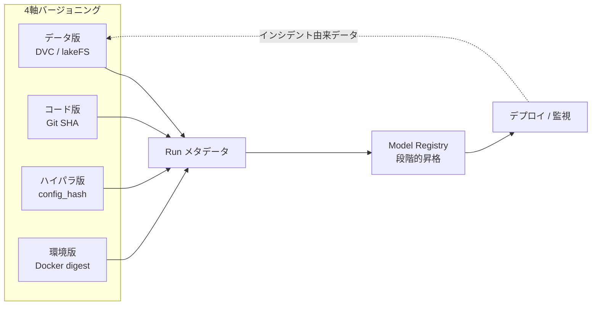

# 6.1 実験管理：データセット／ハイパラ／結果のメタデータ管理

自動運転モデルは「どのデータからどう学習したか」を後から証明できなければ、安全認証も改善判断もできません。本節では、その記録基盤となる実験管理 (experiment management) を扱います。MLflow などのトラッキングツール比較、データ・コード・ハイパーパラメータ・環境の 4 軸バージョニング、Model Registry の段階的昇格、CUDA の非決定性制御までを順に整理します。

ここで扱う **実験管理ツール (experiment management tool)** とは、学習ジョブごとに「使ったデータ版・コードのコミット・ハイパーパラメータ・評価結果」を自動記録し、後から横断検索できるようにするサーバ群のことです。代表例として MLflow (OSS でセルフホスト可能)、Weights & Biases (W&B、SaaS 中心の可視化ツール)、Neptune、ClearML、Comet があります。

## 実験管理が満たすべき要件

自動運転の実験管理は、一般的な機械学習よりも厳しい要件があります。安全に関わる説明責任 (accountability) があるため、リリースから数か月後にインシデントが起きたとしても、「なぜこのモデルを採用したか」を証跡付きで説明できる必要があります。具体的な要件は次の 4 つに整理できます。

| 要件 | 定義 | 自動運転での具体化 |
|---|---|---|
| 再現性 (reproducibility) | 同じ入力で同じ出力を再現できる | データ・コード・config・コンテナ・乱数シードまで固定 |
| 追跡可能性 (traceability) | モデル→データ→設定を辿れる | リリース判定の根拠を監査ログとして提示 |
| 由来連鎖 (provenance linkage) | インシデント→学習データを逆引き | フィールド失敗から該当 Drive/Scene を特定 |
| スケーラビリティ (scalability) | 日次数百 Run でも破綻しない | メタデータストアと Run 命名規則の標準化 |

Closed-Loop の観点では、「インシデント → データセット更新 → 再学習 → 評価 → デプロイ」のループを何周も回します。各ステップがどの実験・どのデータと結びついていたかを後から確実に辿れることが、改善効果の定量化と安全論証 (safety case) の前提になります。

## 実験トラッキングツールの比較

実験管理の中核は、実験トラッキングツール (experiment tracking tool) によるメタデータ管理です。主要ツールを公開機能ベースで比較します。

| ツール | ホスティング | 強み | 自動運転での留意点 | 参照 |
|---|---|---|---|---|
| MLflow | OSS / セルフホスト | Model Registry、言語非依存、ベンダーロックインが弱い | UI のスケーラビリティは大規模で要チューニング | [T11](references#t11) |
| Weights & Biases (W&B) | SaaS 中心 | 可視化・Sweeps・Artifacts が強力、協調作業向き | 大量メディアログ時のコストとデータ持ち出し | [T12](references#t12) |
| Neptune | SaaS / セルフホスト | メタデータ大量管理、Run 比較が高速 | エコシステムは MLflow より小さい | [T15](references#t15) |
| ClearML | OSS / SaaS | オーケストレーション・データ版管理を統合 | 機能が広く学習コストが高い | [T16](references#t16) |
| Comet | SaaS | 実験比較・パネル、生産監視と連続 | オンプレ要件が強い組織には不向き | [T17](references#t17) |

多くの自動運転チームは、**監査性とベンダー中立性を重視して MLflow をメタデータの正本 (source of truth) に据え、研究フェーズの可視化に W&B を併用する** 構成を採ります。重要なのはツール選定そのものより、後述するスキーマと運用ルールの一貫性です。

自動運転固有の要件として、一般的な ML 以上に次のメタデータを実験に紐づけます。

- ODD セグメント (時間帯・天候・道路種別) のカバレッジ情報
- データ選択ポリシー (例: インシデント由来 20% + ランダム 80%)
- シミュレーション・ログリプレイとリンクするシナリオ ID / ケース ID

学習スクリプトのエントリポイントで実験トラッキングを初期化し、学習ループ内で評価指標を逐次記録します。実装担当者に依頼する際の最低要件は次の通りです。

- Experiment 名（例：知覚 BEV モデル用なら `ad_perception_bev` のように、対象モデル種別が後で識別できる命名）と Run 名（データ版とサンプリングポリシーがひと目で分かる命名、例：`bevformer_v2025.05_incident_mix`）を一意に設定する。
- Run 開始時にパラメータとして、データセット版 ID、バックボーン種別、学習率などのハイパーパラメータ、ODD セグメント (時間帯・天候・道路種別)、データ選択ポリシー (例: インシデント由来 20% + ランダム 80%) を記録する。
- タグとして Git の commit SHA と、後述する解決済み config のハッシュを必ず付与し、コードと設定のスナップショットを Run と紐づける。
- 学習ループ内では、各エポックまたは固定ステップごとに検証指標 (val_NDS、mAP、ODD セグメント別 recall など) を `step` を添えて記録し、後から学習曲線を再構築できるようにする。

## 4 軸バージョニングとデータ版管理ツール

実験を再現するには「データセット・コード・ハイパーパラメータ・実行環境」のいずれが変わっても結果が変わり得ることを前提に、4 つすべてを個別にバージョニングして相互にリンクさせる必要があります。データを個別管理する代表的ツールは次の 3 つです。**DVC (Data Version Control)** は Git にメタデータを置き実体を外部ストレージに置く軽量ツール、**lakeFS** はオブジェクトストレージ全体に Git 風のブランチとマージを提供するサーバ、**Iceberg / Delta Lake** はテーブル形式でスキーマ進化とタイムトラベルクエリを実現する基盤です。

> この図のポイント：4 軸すべてが 1 つの Run に集約され、Run から Model Registry を経てデプロイに至り、フィールドのインシデントが再びデータ版に戻る Closed-Loop を形成します。

データ版管理ツールには次のトレードオフがあります。

| ツール | アプローチ | 長所 | 短所 |
|---|---|---|---|
| DVC | Git にメタ、実体は外部ストレージ | Git ワークフローと親和、軽量 | PB 級・並行更新で運用が重い |
| lakeFS | オブジェクトストレージに Git 風ブランチ | ペタバイト級、ブランチ/マージが高速 | 専用サーバ運用が必要 |
| Delta Lake / Iceberg | テーブル形式 + タイムトラベル | クエリ統合、スキーマ進化 [ST1, ST2] | 画像/点群実体は別管理が必要 |

自動運転の PB 級ログでは、**メタデータと小規模ラベルは DVC、実体データのスナップショットは lakeFS や Iceberg のタイムトラベル**、という併用が現実的です。重要なのは「データセットバージョン ID」を実験メタデータに必ず記録し、評価用セットのバージョンを実験間で固定することです。

## Hydra による config 管理と差分追跡

ハイパーパラメータが数百項目に達してくると、フラットな辞書では管理できません。**Hydra** (Facebook 製の階層 config フレームワーク) や、その内部で使われる **OmegaConf** (型付き YAML 操作ライブラリ) を使うと、設定をモジュールごとに分割しつつ、CLI からの上書きを構造的に追跡できます。再現性を高める運用手順は次の通りです。

1. **config を YAML で階層管理する**：`conf/` 配下にモデル・データ・オプティマイザ・スケジューラなどを別ファイルに分け、トップレベル設定 (例：`bev_train.yaml`) から合成する。コマンドラインからの上書き (例：`optimizer.lr=1e-4 data.version=v2025.05`) を許容し、上書き内容は実行ログに残す。
2. **解決済み config を YAML 文字列に正規化する**：補間 (`${...}`) を解決し、辞書順序を入力 YAML の順序で固定した正規化 YAML を生成する。マージ順や Hydra 固有の上書き構文 (`++key` の強制追加・`~key` の削除) も resolve 後の YAML に反映させる。
3. **正規化 YAML をハッシュ化して Run に紐付ける**：SHA-256 などで安定したハッシュ (例：先頭 12 桁) を計算し、`config_hash` タグとして Run に付与する。同時に、解決済み YAML 全文を Run のアーティファクトとして保存する。

この手順を踏むと、`config_hash` が一致する Run は完全に同じ設定であることを保証できます。CLI override の差分も後から `diff` で確認可能です。逆に、ハッシュが違えば必ず設定差分があると断言できるため、再現性問題の調査が大幅に容易になります。

## CUDA 非決定性の制御とログ

自動運転の安全評価では「同じ Run が再現するか」が監査対象になります。ところが GPU 学習にはアルゴリズム選択・並列縮約順・乱数のいずれにも非決定性 (non-determinism) があり、放置すると同じ設定でも実行ごとに結果が変動します。この非決定性を明示的に制御し、制御状態そのものを実験トラッキングのパラメータとしてログに残します。具体的に押さえるべき設定は次の通りです。

- **乱数シードの固定**：Python 標準の `random`、NumPy、PyTorch（CPU 側・CUDA 側）すべてに同一の seed を設定し、その値を Run のパラメータとして記録する。
- **cuDNN ベンチマークモードの抑制**：`cudnn.benchmark` を無効化すると最速カーネルの自動選択は止まる代わりに、実行ごとの結果のブレが消える。
- **決定的アルゴリズムの強制**：cuDNN を deterministic モードに切り替え、非決定的カーネルが呼び出されたら検出して例外を出す設定 (例：PyTorch の `use_deterministic_algorithms(True)`) を有効にする。
- **設定状態の記録**：seed 値、ベンチマークモードの有無、決定性モードの有無を Run のパラメータに残し、後から「どちらの設定で得られたスコアか」を必ず追跡できるようにする。

リリース判定に用いる公式評価 Run では決定性を優先し、探索フェーズでは速度を優先する、という使い分けが実務的です。どちらを使ったかを必ずログに残すことが追跡可能性の要です。なお seed 固定だけでは optimizer の内部状態 (Adam の 1 次・2 次モーメント、SGD-momentum の momentum buffer、混合精度の loss scale 履歴) も再現性に影響します。再現対象が「途中再開」を含む場合は、オプティマイザと loss scaler の状態も checkpoint に含めて保存します。

## MLflow Model Registry による段階的昇格

**Model Registry** とは、学習済みモデルにバージョン番号と「ステージ」を付与し、デプロイ可否を組織として管理する仕組みです。MLflow の Model Registry では、`None → Staging → Production → Archived` というステージを経てモデルを昇格させ、各遷移にゲートを設けます。具体的な運用は次のようになります。

- 学習が完了した Run のアーティファクトを、Model Registry に同名のモデル (例：`bev_detector`) の新バージョンとして登録する。
- `None → Staging` のゲートでは、オフライン評価指標 (例：NDS) が baseline からの劣化許容幅 (例：0.005pt) 以内に収まっていることを自動判定し、通過した場合のみ Staging に遷移させる。同時にシミュレーション評価などの後段判定が「未実施」であることを示すタグ (例：`sim_passed=pending`) を付与する。
- `Staging → Production` のゲートでは、シミュレーション・HiL・人手承認の結果がそれぞれ合格していることをタグで確認し、すべてが揃った時点でのみ昇格させる。

ステージ遷移の条件 (オフライン評価 → シミュレーション → HiL → 人的承認) を Model Registry のタグとして残すことで、第 6.7 節のオーケストレーションや第 8 章のリリースゲートと一貫したガバナンスを構築できます。

## Closed-Loop での実験管理パターン

Closed-Loop サイクルを実験管理の観点から整理すると、次のパターンになります。

1. **失敗シナリオ特定**：オフライン評価・シミュレーション・第 8 章のフィールド監視から、特定ケース (例: 夜間逆光交差点での歩行者見落とし) を特定します。
2. **データセット更新**：第 4・5 章のデータ選択・ラベリングを通じて、該当ケースを含む `v_next` を作成し DVC/lakeFS で版を切ります。
3. **実験定義**：「`v_prev` → `v_next` の差分による再学習」を新 experiment として定義します。
4. **学習・評価**：mAP / NDS / ODD セグメント別指標の改善を記録します。
5. **昇格・監視**：Model Registry で Staging→Production へ昇格させ、第 8 章の監視へ渡します。

このループを支えるには、「データセット版」「実験」「モデル」「評価レポート」がすべてリンクされた一貫メタデータモデルが不可欠です。

## チーム横断でのメタデータ設計

実験メタデータは研究チームだけでなく、DataOps・MLOps・シミュレーション・フィールド運用チームが共有します。初期からスキーマを設計しておくと拡張が容易です。

- **役割別ビュー**：研究者には学習曲線、データエンジニアにはデータ出所と品質、マネージャには KPI とリリース状況。
- **タクソノミ共通化**：ODD セグメント・シナリオタグ・ラベルポリシー版を第 2〜5 章と共通辞書で管理。
- **ID 設計**：実験 ID・モデル ID・データセット ID・シナリオ ID を規則的に設計し、人間にも機械にも扱いやすくする。

このメタデータ設計により、Closed-Loop 全体の可観測性 (observability) が高まり、どの改善サイクルがどれだけの効果を持ったかを定量把握できます。

## 実験管理基盤を組み立てる際の判断軸

実験管理は「ツールを入れた」だけでは機能せず、メタデータの正本をどこに置くか、どのレイヤをどのツールに任せるかという設計判断の積み重ねで品質が決まります。MLflow を正本のメタデータストアに据えつつ W&B を可視化用に併用する二層構成が広く採られるのは、研究フェーズの素早い試行錯誤と、量産リリースに必要な監査証跡を切り分けたいからです。可視化 SaaS の派手な UI に引きずられて W&B だけを正本にしてしまうと、解約時の引き上げや SaaS 障害時の参照不能、データ持ち出しポリシーへの抵触といった形で後から綻びが出ます。

データ版管理についても、DVC・lakeFS・Iceberg のいずれか一つに寄せようとすると必ず無理が来ます。ラベル JSON のような小ファイルは Git 親和の DVC が扱いやすい一方、PB 級の画像や点群実体を DVC で管理しようとすると `dvc pull` が現実的な時間で終わらなくなります。逆に lakeFS や Iceberg は実体スナップショットには強いですが、メタデータ単位での細かい分岐管理は重く感じられます。「メタデータと小規模ラベルは DVC、実体スナップショットは lakeFS/Iceberg のタイムトラベル」という二層化は、両者のスケーラビリティの差を素直に受け入れた結果です。

ハイパーパラメータの管理で見落とされがちなのは、CLI 上書きを許した瞬間に「config ファイルだけ見ても何で実行したか分からない」状態になる点です。Hydra/OmegaConf で補間と上書きを解決した正規化 YAML を SHA-256 でハッシュ化し `config_hash` として Run に残しておくと、ハッシュ一致は完全一致を保証し、ハッシュが違えば必ず差分があるという反証可能性が生まれます。これは再現性問題の調査時間を桁で短縮します。

CUDA 非決定性は、放置するとリリース評価のスコアが実行のたびに揺らぐため、安全論証の根拠として致命的に弱くなります。`cudnn.benchmark`・決定的アルゴリズム・乱数シードの三つを Run パラメータとして必ず記録し、リリース評価ではすべてオンにする方針を組織として決めておくのが要点です。探索フェーズでは速度を優先して非決定性を許容するという使い分けは合理的ですが、「どちらの設定で得られたスコアか」を後から区別できなければ意味がありません。

Model Registry の `None → Staging → Production` 遷移条件は、6.7 節のガバナンスゲートと一貫させなければ、結局二重管理になって運用が崩れます。Staging への昇格にはオフライン評価のブートストラップ判定 (劣化許容幅 0.005pt) を、Production への昇格にはシミュレーション・HiL・人手承認をタグで揃えてから許す、という形で実装側の DAG と Registry のメタデータが同じルールを参照することが、組織として安全論証を回すための前提になります。

## 本節の振り返り

自動運転の実験管理は、再現性・追跡可能性・由来連鎖・スケーラビリティという四つの要件を、安全に関わる説明責任の重みのもとで満たさねばなりません。MLflow を正本に据え W&B を可視化に併用する構成、DVC と lakeFS/Iceberg の二層データ版管理、Hydra による解決済み config のハッシュ管理、`cudnn.benchmark` と決定的アルゴリズムの三点ログ、Model Registry の段階的昇格——これらは独立した tips ではなく、フィールドのインシデントから学習データを逆引きする由来連鎖を支える単一の基盤です。本書の主張する Closed-Loop は、この基盤の上で初めて「どの改善サイクルがどれだけの効果を持ったか」を定量化でき、安全論証の証跡として外部に提示できる段階に立ち上がります。

## 次節への橋渡し

実験管理が「何を記録するか」を定めたのに対し、次の 6.2 節では「学習データをどう供給するか」を扱います。PB 級ログを GPU が枯渇しないよう供給する WebDataset の分散シャーディング、NVIDIA DALI による GPU 前処理、shuffle buffer 設計、そしてバッチレイテンシの P50/P95/P99 計測まで、トレーニングデータパイプラインの実装を掘り下げます。
