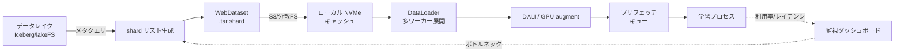

# 6.2 トレーニングデータパイプライン設計

高価な GPU を 1 秒でも遊ばせないことが、大規模学習の経済性を左右します。本節では、PB 級のフリートログを途切れず供給するためのトレーニングデータパイプライン (training data pipeline) 設計を扱います。WebDataset による分散シャーディング、shuffle buffer 設計、NVIDIA DALI による GPU 前処理、On-the-fly とオフラインのトレードオフ、バッチレイテンシ分位点の計測、そしてサンプリング比率の制御まで順に整理します。

ここで扱う主要なツール・概念を先に押さえます。**WebDataset** は多数の小ファイルを `.tar` にまとめてシーケンシャル読み込みに変換するライブラリ、**NVIDIA DALI (Data Loading Library)** は前処理を GPU に逃がす高性能データローダ、**shard** は学習データを分割した塊 (典型的には数千サンプル入りの `.tar`)、**GPU starvation** は GPU が I/O 待ちでアイドルになる状態を指します。

## パイプライン全体像と GPU starvation

自動運転のトレーニングデータは、フリートから収集される膨大なログ (数 PB 規模) が起点です。素朴にファイルリストを読むだけでは、メタデータ I/O とランダムアクセスでスループットが不足します。すると GPU が I/O 待ちでアイドルになる **GPU starvation (GPU 飢餓)** が発生し、月額数千万円規模の計算資源が無駄になります。典型的なパイプラインは次の段に分解できます。

> この図のポイント：データレイクからのサンプリング比率の変更が即座に shard 生成に反映され、GPU 側のレイテンシ計測がボトルネック解析を通じて再びサンプリングへ戻る Closed-Loop を形成します。

Closed-Loop の観点では、このパイプラインに「インシデントデータ」「シミュレーション生成データ」「合成データ」を混在させつつ、構成比率を設定ファイルで制御できることが重要です。

## WebDataset による分散シャーディング

多数の小ファイル (画像・点群・ラベル JSON) をそのまま置くと、メタデータ I/O とランダムアクセスがボトルネックになります。WebDataset [ST6](references#st6) は複数サンプルを `.tar` にまとめ、**シーケンシャル読み込み** に変換することで、オブジェクトストレージからのスループットを大幅に改善します。

設計の要点は次の通りです。

- 1 shard あたり数千〜数万サンプル。shard サイズは 100MB〜1GB 程度が目安。
- 各サンプルは複数キー (`jpg`, `pcd`, `json`) で 1 レコードを構成し、マルチモーダルデータをまとめる。
- 分散学習では shard をノード/ワーカーに重複なく割り当てる。

WebDataset のローダ実装担当者には、次の項目を必ず指定して設計するよう依頼します。

- **shard リスト**：S3 や分散ファイルシステム上の `.tar` ファイル URL リスト。データセット版 ID と紐づける。
- **shard レベル分配**：ノード間で shard を重複なく分配する仕組み (`split_by_node` 相当) と、ワーカー間でさらに分配する仕組み (`split_by_worker` 相当) を **両方** 有効にする。これを併用しないと、複数ノードが同じ shard を読んでデータ重複と実効エポックの縮小を招く。
- **shard シャッフルの有効化**：エポックごとに shard 順を入れ替える (`shardshuffle=True` 相当)。
- **サンプルレベルバッファ**：メモリに数千サンプル (例：2000) を貯めてランダム取り出しするバッファを挟む。サイズの根拠は次節で詳述する。
- **デコードと前処理**：画像 (RGB) のデコード、点群 (PCD) と JSON ラベルのパースをサンプルごとに適用し、最後にバッチ化する。
- **破損 shard の扱い**：破損 shard を検出したら学習を止めずに警告を出してスキップする運用 (`warn_and_continue` 相当) を採用する。
- **ローダ側の最適化**：CUDA への転送高速化のための `pin_memory`、ワーカーごとの先読み数を指定する `prefetch_factor` (目安 4) を設定し、後段の GPU が空かないようにする。

## 1000+ shard 環境の shuffle buffer 設計

shard 数が 1000 を超える大規模学習では、シャッフルを 2 段で設計します。

1. **shard レベル shuffle** (`shardshuffle=True`)：エポックごとに shard 順をシャッフル。
2. **サンプルレベル shuffle** (`.shuffle(N)`)：メモリ上の buffer に N サンプル溜め、ランダムに取り出す。

buffer サイズ N の決定には次のトレードオフがあります。

| buffer サイズ | メモリ | シャッフル品質 | リスク |
|---|---|---|---|
| 小 (例: 100) | 軽い | 局所的に偏る | shard 内の連続フレームが固まり相関学習 |
| 中 (例: 1000〜5000) | 中 | 実務上十分 | 一般的な推奨レンジ |
| 大 (例: 50000) | 重い | ほぼ完全 | OOM・起動レイテンシ増 |

自動運転ログは「同一 Drive の連続フレームが強く相関する」性質があるため、buffer は最低でも数千、かつ **shard 自体を Drive 横断でインターリーブして生成** しておくと、相関バイアスを抑えられます。経験的には `buffer ≈ 2 × (1 shard のサンプル数)` を起点に調整するのが扱いやすいです。

## NVIDIA DALI による GPU 前処理

WebDataset でストレージ I/O を解消しても、JPEG デコードや augmentation を CPU でこなす段階で詰まることがあります。NVIDIA DALI (Data Loading Library) を使うと、これらの前処理を GPU にオフロードできます。とくに JPEG デコードでは GPU 内蔵の専用ハードウェア (NVJPEG) を呼び出せるため、CPU デコードの数倍のスループットが得られます。DALI パイプラインを設計する際の主要な構成要素は次の通りです。

- **入力リーダ**：shard ディレクトリやファイルリストを読み、ランダムシャッフルしながら JPEG バイト列とラベルを供給する。
- **デコード段**：JPEG デコードを CPU ではなくハードウェア NVJPEG (mixed device) で実行し、CPU デコードに対して数倍のスループットを狙う。
- **リサイズ段**：GPU 上で解像度を統一する (例：960×540)。
- **正規化と augmentation の融合**：平均・標準偏差での正規化、ランダムクロップ (例：512×512)、ランダム水平反転を 1 つの GPU カーネルにまとめ、メモリ往復を減らす。
- **PyTorch ループへの橋渡し**：DALI の出力を PyTorch のテンソルとしてイテレートできる形 (`DALIGenericIterator` 相当) でラップする。

mixed device での JPEG デコードは GPU 上の専用ハードウェアを利用するため強力ですが、GPU メモリと演算を学習側と取り合います。したがって **前処理が CPU バウンドのときに限定して導入** し、DALI 導入前後で GPU 利用率とステップ時間を比較してから採否を判断します。

## On-the-fly 前処理とオフライン前処理のトレードオフ

前処理をどこまで学習時にオンラインで行うかは、スループットと柔軟性のトレードオフです。

| 方式 | 内容 | 長所 | 短所 |
|---|---|---|---|
| オフライン前処理 | センサ補正・座標変換・GT アサインを事前に済ます | 学習が高速・安定 | 変更のたびに全データ再生成、ストレージ増 |
| On-the-fly 前処理 | 正規化・augmentation・ビュー合成を学習時に実施 | 柔軟・ストレージ節約 | CPU/GPU 負荷、スループット低下 |
| ハイブリッド | 重い変換はオフライン、軽い augment はオンライン | 実務的な折衷 | パイプラインが複雑 |

実務では、座標変換や点群投影のような重く決定的な処理はオフラインで shard に焼き込み、ランダム性が必要な augmentation のみオンラインにするハイブリッドが主流です。Closed-Loop で新データ種別 (新センサ構成・合成データ) が追加されたとき、どこまでオフライン化するかを素早く切り替えられる柔軟性が重要です。

## バッチレイテンシの計測 (P50/P95/P99)

「GPU 利用率の平均値」だけを見ていると、たまに発生する数秒の I/O スパイクを見逃します。そこでバッチ取得レイテンシ (1 ステップ分のデータが揃うまでの時間) を分位点 (P50・P95・P99) で計測し、テール遅延を監視します。P50 は中央値、P95・P99 はそれぞれ「上位 5% / 1% で起きる遅延」を示し、自動運転の長時間学習では P99 が GPU starvation の主犯になりやすいです。計測の最低要件は次の通りです。

- 各イテレーションで「前のステップ終了から次のバッチが揃うまで」の経過時間 (ミリ秒) を記録し、リングバッファに直近 1000 ステップ分などを保持する。
- 一定間隔 (例：100 ステップごと) に、その窓に対する P50・P95・P99 を算出し、実験トラッキングに `data_lat_p50_ms` / `data_lat_p95_ms` / `data_lat_p99_ms` のように記録する。
- ステップ計算時間 (forward + backward + optimizer step) と並べて可視化し、P99 が計算時間を超えていれば GPU starvation 要因として扱う。

P50 は健全でも P99 が突出する場合、shard のコールドキャッシュやネットワーク輻輳が疑われます。対策はローカル NVMe キャッシュ、`prefetch_factor` 増加、shard サイズの調整です。P99 がステップ計算時間を下回るまで詰めれば、GPU starvation はほぼ解消できます。

## データ・コードバージョンの整合とサンプリング

パイプラインでは、データ版とコード版の不整合が静かなリーク・評価ミスを生みます。代表的な失敗と対策は次の通りです。

- 古いラベルフォーマット/座標系の混在 → **スキーマにバージョン番号を持たせ読み込み時に検証**。
- クリーニングロジック更新時の新旧混在 → **データ版を config 管理し実験トラッキングに記録** (第 6.1 節)。
- 評価セットの微妙な差異 → **評価用データセット版を固定し monorepo の Git tag で整合**。

サンプリング・ミキシングは、第 4 章のデータ選択戦略と連携し、設定で比率を制御します。サンプリングポリシーは YAML 等の設定ファイルに切り出し、次の項目を持たせます。

- **データソース別ウェイト**：実ログ (例：0.70)、インシデント由来 (例：0.15)、シミュレーション (例：0.10)、合成データ (例：0.05) のように、合計が 1 になるよう重みを定義する。
- **インシデントの上限比率**：希少シーンへの過剰適合を防ぐため、特定ソース (特にインシデント由来) には `max_ratio` のような上限を設定する (例：0.20)。
- **ODD バランス**：夜間・雨天・都市交差点など、重要 ODD の最小サンプリング比率 (例：夜間 0.25、雨天 0.15、都市交差点 0.20) を明示し、レアな ODD が完全に欠落しないようにする。

この設定ファイル全体を実験トラッキングのアーティファクトとして保存し、Run のメタデータと紐づけます。Closed-Loop では、インシデント分布や ODD での失敗傾向に応じてこのポリシーを継続更新します。インシデント由来データには上限比率を設け、希少シーンへの過剰適合を防ぎます。

## データパイプラインの落とし穴と設計判断

データパイプラインの整備は GPU 機材コストに直結し、設定一つの誤りが月額数千万円規模の無駄を生むため、典型的な失敗パターンと設計判断の勘所を整理します。最も頻発する失敗は、`split_by_node` だけを有効にして `split_by_worker` を忘れるケースです。この状態では、ノード内の複数 DataLoader ワーカーが同じ shard を読み、データ重複と実効エポックの縮小が静かに進行します。学習曲線は一見ノイズなく下がりますが、汎化性能が想定より伸びずに評価セットで頭打ちします。両方を必ず有効化することが大前提です。

shuffle buffer のサイズ選定は「自動運転ログは同一 Drive の連続フレームが強く相関する」性質を踏まえないと意味がありません。buffer を 1 shard 分しか取らないと、shard が Drive 単位で構成されている場合に同じシーンの連続フレームしか流れず、モデルは時間相関にショートカット学習してしまいます。「shard 自体を Drive 横断でインターリーブして生成し、buffer はそのサンプル数の 2 倍を起点に置く」という二段構えで初めて、相関バイアスが実用上問題ない水準まで落ちます。

DALI 導入は「速くなりそうだから入れる」では失敗します。前処理が CPU バウンドであることを `nvidia-smi` の GPU 利用率と `top` の CPU 使用率で確認しないまま導入すると、JPEG デコードが GPU に乗ることで学習側の演算と GPU メモリ・SM を取り合い、かえって全体スループットが落ちることがあります。導入前後で GPU 利用率とステップ時間を比較し、改善が確認できた場合のみ採用するという順序が現実的です。

レイテンシ監視で最も多い誤りは「P50 (中央値) しか見ない」ことです。P50 は健全でも P99 が突出していると、たまに数秒の I/O スパイクで GPU が空転します。P50/P95/P99 を実験トラッキングに記録し、P99 がステップ計算時間を超えたら、shard のコールドキャッシュやネットワーク輻輳を疑って NVMe キャッシュ追加や `prefetch_factor` 増加を試します。テール遅延が計算時間を下回るまで詰めれば GPU starvation はほぼ解消します。

サンプリング比率の管理で踏むべき罠は、コードに数値を直書きしてしまうことです。実ログ 0.70・インシデント 0.15・シミュレーション 0.10・合成 0.05 のような構成比は、Closed-Loop でインシデント分布や ODD 失敗傾向に応じて毎月のように調整されます。YAML に集約して Run のアーティファクトとして保存し、Git で履歴を追えるようにしておかないと、「いつから比率がこうなり、なぜそのモデルが特定の ODD で劣化したか」を後から再現できなくなります。

## 本節の振り返り

PB 級ログから GPU を遊ばせず学習を回すパイプライン設計は、WebDataset のシーケンシャル読み込みを基盤に、shard の重複防止・二段シャッフル・テールレイテンシ監視・サンプリング比率の config 化という個別技法を、本書の Closed-Loop の更新サイクルと整合させて組み合わせる仕事です。とくに `split_by_node` と `split_by_worker` の両方有効化、shuffle buffer のサイズ根拠、DALI 採否の事前計測、P99 を見るレイテンシ監視、YAML サンプリングポリシーは、いずれも放置すると静かに学習を毀損する種類の問題で、機材コストと安全評価の両面で見過ごせません。これらを定量化された運用基準に落とし込めると、データ更新のリードタイムが安定し、6.7 節のオーケストレーションで自動化する土台が整います。

## 次節への橋渡し

データが安定供給される前提が整ったところで、次の 6.3 節では「そのデータで何を学習させるか」、すなわちモデルアーキテクチャを扱います。BEV 系 (BEVFormer / BEVDet / PETR 系 / StreamPETR / FastBEV)、Occupancy 系 (TPVFormer / OccFormer / FlashOcc / OCC3D)、End-to-End (UniAD / VAD / GenAD / FSD v12 系)、世界モデル (GAIA-1 / DriveDreamer / Vista / UniSim) を、レイテンシ・メモリ・データ要件の観点から比較します。
