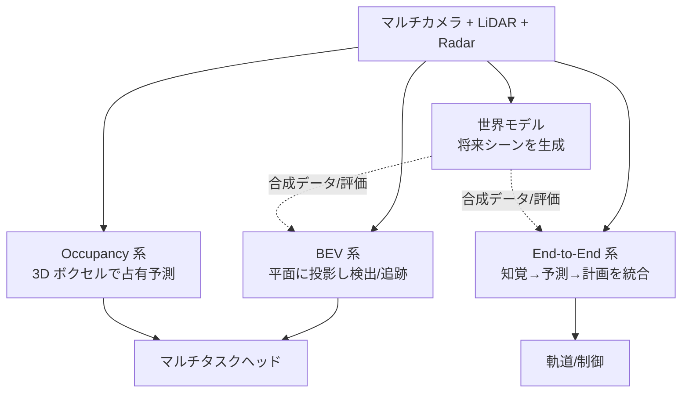
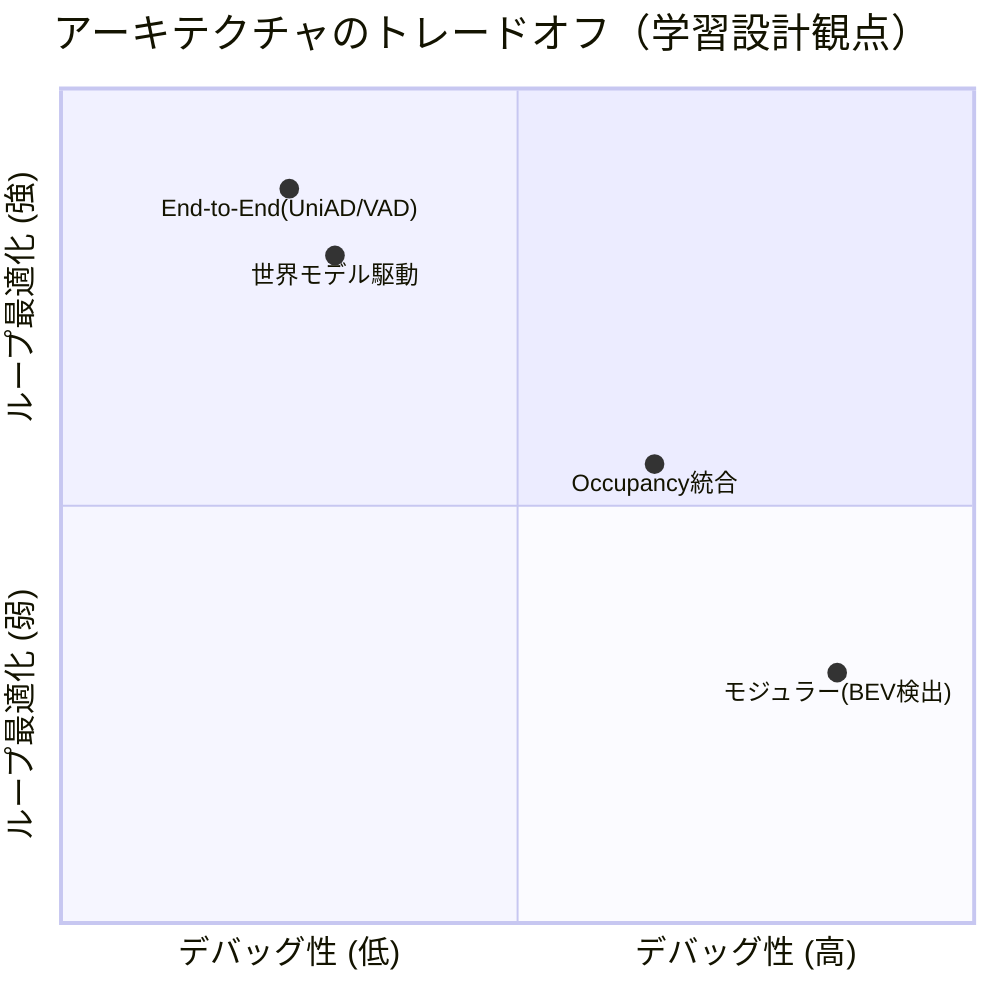

# 6.3 モデルアーキテクチャの設計

アーキテクチャ選択は「どんなラベルをどれだけ集めるか」を決定し、データ戦略を 1 年単位で縛ります。本節では BEV 系・Occupancy 系・End-to-End (E2E) 系・世界モデルの 4 系統を、レイテンシ・メモリ・データ要件の観点で比較し、自社の条件に合う方式を選ぶための判断軸を示します。

ここで先に用語を押さえます。**BEV (Bird's-Eye View)** はカメラや LiDAR を車両中心の鳥瞰平面に投影した中間表現、**Occupancy** は空間を 3D ボクセルに離散化して各セルの占有を予測する表現、**End-to-End (E2E)** はセンサ入力から軌道・制御までを単一ネットワークで学習する方式、**世界モデル (world model)** は将来観測を生成的に予測するモデルを指します。

## 4 系統の俯瞰

近年の自動運転モデルは、中間表現の取り方によって 4 系統に大別できます。

> この図のポイント：BEV と Occupancy は中間表現、E2E は計画までの統合、世界モデルはそれらを合成データと Closed-Loop 評価で支える役割を担い、互いに排他ではなく補完関係にあります。

4 系統を主要指標で比較すると次のようになります (nuScenes 系の公開値を概算でまとめたもので、実装・解像度で大きく変動します)。

| 系統 | 代表手法 | 主出力 | 相対レイテンシ | メモリ | データ要件 | デバッグ性 |
|---|---|---|---|---|---|---|
| BEV 検出 | BEVFormer [P2](references#p2) / StreamPETR | 3D 検出・追跡 | 中 | 中 | 3D box ラベル | ○ |
| Occupancy | FlashOcc [P13](references#p13) / TPVFormer [P14](references#p14) | 3D 占有・意味 | 中〜高 | 高 | voxel/占有ラベル | ○ |
| End-to-End | UniAD [P11](references#p11) / VAD [P12](references#p12) | 軌道・計画 | 高 | 高 | マルチタスク + 運転デモ | △ |
| 世界モデル | GAIA-1 [W1](references#w1) / Vista [W4](references#w4) | 生成シーン | 非常に高 | 非常に高 | 大量の無ラベル動画 | △ |

## BEV 系アーキテクチャの系譜

**Bird's-Eye View (BEV)** 表現は、マルチカメラ・LiDAR・Radar を車両中心の平面グリッドに投影し、地図や経路計画と整合させやすくする中心的手法です。BEV 化の方式により系譜が分かれます。

| 手法 | 発表 | BEV 化方式 | 特徴 | 参照 |
|---|---|---|---|---|
| BEVDet | 2021 | LSS (Lift-Splat-Shoot) | 深度分布を推定し画素を持ち上げ投影 | [P3](references#p3) |
| BEVDepth | 2022 | LSS + 明示的深度監視 | LiDAR で深度を教師化し精度向上 | [P18](references#p18) |
| BEVFormer | ECCV2022 | 時空間 Transformer | BEV query が空間+時間に attention | [P2](references#p2) |
| PETR / PETRv2 | ECCV2022 | 3D 位置エンコーディング | 明示投影なしで 3D 位置を埋め込む | [P4](references#p4) |
| StreamPETR | ICCV2023 | object-centric 時系列伝播 | 物体クエリを時系列に伝播し高効率 | [P19](references#p19) |
| FastBEV | 2023 | 投影の高速化・軽量化 | 車載向けに推論を高速化 | [P20](references#p20) |

**LSS (Lift-Splat-Shoot)** とは画素ごとに深度分布を推定し、その分布で重みづけしながら 2D 特徴を 3D 空間に「持ち上げる (lift)」操作です。**LSS 系 (BEVDet / BEVDepth)** は深度分布を陽に推定して画素を 3D に持ち上げるため、深度精度がボトルネックになります。BEVDepth は LiDAR を深度の教師に使い、この弱点を補います。**Transformer 系 (BEVFormer)** は BEV query が複数カメラ・複数フレームに attention し、明示投影を回避します。**PETR 系** は 3D position embedding (3D 位置をベクトル化して特徴に足す技法) で 2D 特徴に 3D 幾何を注入し、StreamPETR は物体クエリを時系列に伝播することで計算量を抑えます。

データ中心の観点では、BEV 系は「空間的に整合した教師ラベル」と「マルチセンサの時間同期」が前提です。キャリブレーション誤差やタイムシフトがあると BEV 上で物体が滲み二重像になるため、第 2〜3 章のキャリブレーション品質が直接性能に効きます。

## Occupancy 系アーキテクチャ

BEV が「平面」なのに対し、**Occupancy 予測** は空間を 3D ボクセルに離散化し、各ボクセルの占有と意味カテゴリを予測します。BEV では表現しにくい未定義クラスの障害物 (落下物・特殊車両) や高さ方向の構造を扱えるのが利点です。

| 手法 | 発表 | 表現 | 特徴 | 参照 |
|---|---|---|---|---|
| TPVFormer | CVPR2023 | Tri-Perspective View | 3 平面で 3D を近似しメモリ削減 | [P14](references#p14) |
| SurroundOcc | ICCV2023 | 多階層 voxel | 粗→密の階層デコードで高密度予測 | [P21](references#p21) |
| OccFormer | ICCV2023 | dual-path Transformer | 局所/大域を分離して効率化 | [P22](references#p22) |
| OCC3D | NeurIPS2023 | ベンチマーク + ベースライン | 大規模 Occupancy 評価基盤 | [P13](references#p13) |
| FlashOcc | 2023 | BEV + チャネルto高さ | 3D 畳み込みを避け車載で高速 | [P13](references#p13) 系 |

TPVFormer は 3D ボクセルの計算量を 3 つの直交平面で近似してメモリを削減します。FlashOcc は重い 3D 畳み込みを避け、BEV 特徴のチャネル次元を高さに展開することで車載 GPU でも動く推論速度を狙います。OCC3D [P13](references#p13) は Occupancy の標準ベンチマークと評価指標 (mIoU) を提供し、後続研究の比較基盤となっています。

Closed-Loop では、Occupancy 系の「未知障害物を取りこぼさない」性質が安全に直結します。フィールドで遭遇した稀な障害物を Occupancy ラベルとして取り込み、mIoU の改善を ODD セグメント別に追跡する運用が有効です。

## End-to-End アーキテクチャ

**End-to-End (E2E)** は、知覚・予測・計画を単一ネットワークで統合し、最終目的 (安全・快適な軌道) に近い損失で学習します。

| 手法 | 発表 | 統合範囲 | 特徴 | 参照 |
|---|---|---|---|---|
| UniAD | CVPR2023 (Best Paper) | 知覚+予測+計画 | クエリ伝播で全タスクを 1 つの Transformer に統合 | [P11](references#p11) |
| VAD | ICCV2023 | 知覚+計画 | シーンをベクトル化し計算量を削減 | [P12](references#p12) |
| GenAD | 2024 | 予測+計画 | 生成的に多モーダル軌道分布を出力 | [P23](references#p23) |
| FSD v12 系 | 2024- | 知覚→制御 | カメラ入力からの E2E ニューラルプランナー（公開資料） | [D10](references#d10) |

UniAD [P11](references#p11) は、検出・追跡・マッピング・動作予測・占有予測・計画を **クエリの受け渡し** で連結し、計画タスクを最終目的として全体を一貫学習します。VAD [P12](references#p12) はラスタ表現を避けてシーンをベクトル (エージェント・地図要素) で表し、計算効率を高めます。GenAD は軌道を確率的に生成して多峰性を扱います。

E2E はデバッグ性とトレーサビリティが弱い反面、モジュール境界の手作業チューニングを最小化し、Closed-Loop でのインタラクションそのものを学習対象にできます。教師信号として大量の運転デモが必要で、人間運転のバイアス (安全側に倒した運転) を踏まえた損失設計が求められます。

## 世界モデル

**世界モデル (world model)** は、自動運転を「将来シーンの生成タスク」と捉え直し、行動を条件に将来の観測を予測します。

| 手法 | 提供 | 生成対象 | 特徴 | 参照 |
|---|---|---|---|---|
| GAIA-1 | Wayve | 多カメラ動画 | 言語・行動条件付きの自動運転動画生成 | [W1](references#w1) |
| DriveDreamer / -2 | — | 動画 + 行動 | 実データ駆動、LLM 拡張で多様生成 | [W2, W3] |
| Vista | — | 高解像度動画 | 高忠実度・制御可能な汎用世界モデル | [W4](references#w4) |
| UniSim | Waabi | センサ再現 | Closed-Loop センサシミュレータ | [W5](references#w5) |

世界モデルは、Closed-Loop データエンジンにおいて 2 つの役割を担います。第一に **合成データ生成** — 稀なシナリオを生成して学習データを補強します (第 4・7 章)。第二に **Closed-Loop 評価** — UniSim [W5](references#w5) のように、モデルの行動に応じて変化するセンサ観測を再現し、オフライン評価では捉えられないフィードバック効果を評価します。

## End-to-End vs モジュラー：トレードオフ

> 1.2 節 図 1.5 で示した類型のトレードオフを、学習設計の観点で再構成します。本節では BEV / Occupancy 統合系と E2E 系を「学習データ要件・損失設計・分散学習適合性」の軸で比較します。

> この図のポイント：横軸はデバッグ性・トレーサビリティ、縦軸は Closed-Loop 全体の最適化余地。多くのチームは BEV/Occupancy を主流に据えつつ、E2E を補完的に検証する構成を採ります。

| 観点 | モジュラー | BEV/Occupancy 統合 | End-to-End |
|---|---|---|---|
| エラー切り分け | モジュール単位で容易 | ヘッド単位で可 | 困難 (勾配解析等が必要) |
| 計算効率 | 中 (重複計算) | 良 | 良 |
| 安全認証との整合 | 高 (境界明確) | 中 | 低 (説明責任が課題) |
| 学習データ要件 | タスク別ラベル | マルチタスクラベル | 運転デモ + 多様シナリオ |
| ロングテール対応 | データ + ロジック修正 | データ追加中心 | データ + ループ学習 |

## アーキテクチャ選択とデータ要件

アーキテクチャ選択は、必要なデータの種類・量・品質に直結します。

- **BEV 検出 (BEVFormer / StreamPETR)**：整ったマルチカメラ/LiDAR ログと 3D box ラベル。キャリブレーションドリフトに弱く、第 2〜3 章の品質管理が必須。
- **Occupancy (FlashOcc / TPVFormer)**：voxel/占有ラベル。LiDAR スイープの蓄積で密な GT を生成。稀な障害物の網羅が安全価値を生む。
- **End-to-End (UniAD / VAD)**：マルチタスクラベル + 大量の運転デモ。人間運転のラベルノイズとバイアスを踏まえた損失設計が重要。
- **世界モデル (GAIA-1 / Vista)**：大量の無ラベル動画。長期 horizon の誤差蓄積評価が課題で、第 7 章の評価と連携が必要。

ODD 限定戦略も有効です。高速道路限定など ODD を絞れば、より小さなモデルで高精度を達成でき、第 6.6 節の車載制約とも整合します。アーキテクチャ採用前に必要なデータ要件を明文化しておくと、後からのデータ不足リスクを減らせます。

## 「BEV か Occupancy か E2E か」を選ぶ思考プロセス

新規プロジェクトでこの 4 系統のうちどれを主軸に据えるかは、研究の流行で決まる問題ではなく、データ要件・人員規模・ASIL の三条件の組み合わせで自然に絞り込まれる選択です。「やりたいから」ではなく「自社の条件下で何が成立するか」という観点で考えると、選択は意外と素直に決まります。

最も多くのチームに当てはまる主軸は BEV 検出です。3D box ラベル付きデータが数百万フレーム規模で揃い、ASIL B/C 相当の高速道路運転支援を狙う場合、デバッグ性の高さと知覚-予測のモジュール境界を維持しやすい設計が量産プロジェクトのリスク管理と噛み合います。チーム 10〜30 名規模でも研究から量産まで回せるため、現実的な経営判断として選びやすい主軸です。第 2〜3 章のキャリブレーション品質が直接性能に効く点を踏まえると、センサ・データ基盤への投資が先行できる組織で特に強みが出ます。

Occupancy 系の併用は、未定義クラスの障害物 (落下物・特殊車両・想定外の構造物) や高さ方向の構造を扱う必要があり、かつ LiDAR スイープを蓄積して密な占有 GT を作れる場合に検討します。BEV 検出と同じバックボーンに占有ヘッドだけ追加する形にすれば、追加学習コストを抑えながら未知障害物の取りこぼしを減らせます。安全価値が直接的に大きい一方、voxel ラベルの作成パイプラインを整える初期コストが必要なため、データチームの体力と相談して導入規模を決めます。

E2E に踏み込むのは、数千万フレーム以上の運転デモが揃い、Closed-Loop シミュレータと HiL の検証基盤が運用可能で、安全担当が「説明性の弱さを補う追加検証」を組織として回せる場合に限られます。チーム 50 名以上で研究と量産の両輪を持てる組織向きで、データ量・検証基盤・組織体制のいずれかが欠けると、人間運転バイアスを学習しただけのブラックボックスができ上がる失敗パターンに陥ります。E2E は技術的な強さよりも、説明性の弱さを補える組織を持っているかが採否を決定する点で、純粋に技術選定だけで判断できない種類の選択です。

世界モデルは、レアな ODD のデータが慢性的に不足しており合成データで埋めたい、もしくは Closed-Loop でセンサ応答を再現したい場合に補完的に使います。生成モデルそのものの評価基盤を整備できることが前提で、合成データの分布が実データと乖離していないかを継続検証する仕組みがなければ、生成データが学習を毒する逆効果になりかねません。

どれを選んでも譲れない条件として、(1) ODD ごとの評価セットを 6.8 節の方法で固定する、(2) 学習データの版管理を 6.1 節の通り徹底する、(3) 6.6 節の車載レイテンシ予算 (Drive Orin の 254 TOPS / 12GB 制約など) から逆算した「載るサイズ」を最初から想定する、の三つは独立に成立しません。アーキテクチャ採用前に必要なデータ要件・評価基盤・載るサイズを並べて検討すると、組織として実現可能な選択肢が自然に絞られてきます。

## モジュール化とインターフェース設計

学習時は巨大なネットワークでも、デプロイ時は複数 ECU・コンポーネントに分割されます。早期にインターフェースを定めます。

- **入出力定義**：各モジュールの入力 (センサ・BEV 特徴・予測軌道) と出力 (検出・リスク・候補軌道) の座標系と単位を統一。
- **時間同期とレイテンシバジェット**：どのモジュールがどれだけ過去を参照するかを設計 (第 6.6 節の Worst-Case と連動)。
- **フォールバック経路**：モデルが出力できない場合の保守的ルールベース制御との接続点を定義。

インターフェースが明確であれば、Closed-Loop シミュレーションで特定モジュールだけを差し替える A/B 検証 (第 7 章) が容易になります。

## 本節の振り返り

自動運転モデルの 4 系統 (BEV・Occupancy・E2E・世界モデル) は排他選択ではなく補完関係にあり、選定はデータ要件・人員規模・ASIL の組み合わせで自然に絞り込まれる種類の判断です。BEV 検出は LSS 系の深度推定型と BEVFormer/PETR 系の Transformer 型に分かれ、StreamPETR の物体クエリ時系列伝播や FastBEV の投影高速化で車載化が現実的な水準に近づいています。Occupancy 系は FlashOcc が 3D 畳み込みを避けて車載速度を狙い、未知障害物の取りこぼしを減らす安全価値を提供します。UniAD/VAD/GenAD の E2E は計画までを一貫学習する強さと引き換えにデバッグ性が弱く、組織として説明性を補える検証基盤を持っているかで採否が決まります。GAIA-1/Vista/UniSim の世界モデルは、本書のデータ中心の主張のうち合成データ生成と Closed-Loop センサ再現の二つを担う補完技術として位置づけられます。

## 次節への橋渡し

アーキテクチャを選んだら、次はそれを「どう学習させるか」です。次の 6.4 節では、DINOv2/MAE による自己教師あり事前学習、不確実性に基づくマルチタスク損失の重み付け、FP16/BF16/FP8 の Mixed Precision と Loss Scaling、Gradient Checkpointing のメモリ-計算トレードオフ、そして知識蒸留の温度調整まで、性能を押し上げる学習テクニックを掘り下げます。
