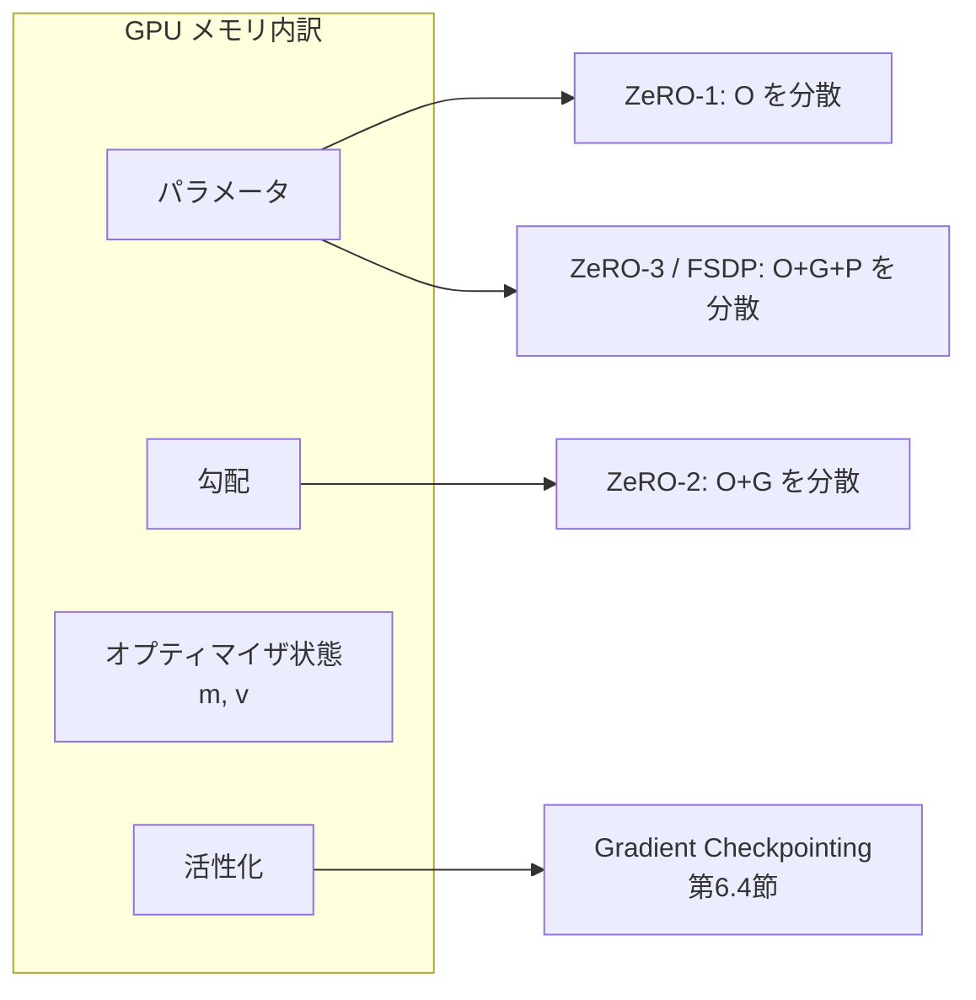

# 6.5 分散学習の効率化と GPU Cluster 設計

大規模モデルが単一 GPU に収まらない時、複数 GPU で「役割分担」させるのが分散学習 (distributed training) です。本節では Data / Tensor / Pipeline Parallel と FSDP / ZeRO の整理、NCCL / InfiniBand の通信最適化、分散チェックポイント、スケジューラ比較を、再学習リードタイムを短く保つインフラ設計の観点で扱います。

ここで先に主要用語を押さえます。**Data Parallel (DDP, Distributed Data Parallel)** はバッチを GPU 間で分割し勾配を平均化する方式、**Tensor Parallel (TP)** は層内の行列演算を GPU 間で分割する方式、**Pipeline Parallel (PP)** は層をステージに分けて流れ作業で処理する方式、**FSDP (Fully Sharded Data Parallel)** はパラメータ・勾配・最適化状態をすべて GPU 間で分散保持する PyTorch 公式の実装、**ZeRO (Zero Redundancy Optimizer)** は DeepSpeed が提供する同種の技法でステージ 1/2/3 に分かれます。**NCCL (NVIDIA Collective Communications Library)** は GPU 間集合通信ライブラリ、**InfiniBand** は HPC 向け低レイテンシネットワークです。

## 並列化パラダイムと GPU メモリ内訳

単一 GPU に収まらない要因は、モデルパラメータだけでなく、勾配・オプティマイザ状態・活性化です。Adam を FP32 で使う場合、概算でパラメータ 1 に対し、勾配 1、オプティマイザ状態 2 (一次・二次モーメント) が加わり、**パラメータの数倍** のメモリが必要になります。

> この図のポイント：ZeRO/FSDP は「どこまでを GPU 間で分散 (shard) するか」で段階が分かれ、活性化は別途 Gradient Checkpointing で削減します。

並列化の基本パラダイムは次の通りです。

| 方式 | 分割対象 | 通信 | 適する状況 |
|---|---|---|---|
| Data Parallel (DP/DDP) | バッチ | 勾配 All-Reduce | モデルが 1 GPU に収まる |
| Tensor Parallel (TP) | 層内の行列 | activation All-Reduce (層ごと) | 巨大な層、低レイテンシ相互接続 |
| Pipeline Parallel (PP) | 層をステージ分割 | ステージ間 P2P | 層数が多い、メモリ不足 |
| Sharded DP (FSDP/ZeRO) | パラメータ/勾配/状態 | All-Gather + Reduce-Scatter | 状態メモリが支配的 |

## ZeRO と FSDP の段階

通常のデータ並列 (DDP) は、すべての GPU が同じパラメータ・勾配・最適化状態のコピーを持ちます。これは冗長で、メモリの無駄が大きい構成です。**ZeRO (Zero Redundancy Optimizer)** [T2](references#t2) と **FSDP (Fully Sharded Data Parallel)** [T1](references#t1) は、この冗長な複製を段階的に排除します。何を分散させるかでステージが分かれます。

| 段階 | 分散対象 | メモリ削減 | 通信オーバーヘッド |
|---|---|---|---|
| ZeRO-1 | オプティマイザ状態 | 中 | 小 |
| ZeRO-2 | + 勾配 | 大 | 中 |
| ZeRO-3 / FSDP (FULL_SHARD) | + パラメータ | 最大 | 大 (All-Gather/Reduce-Scatter) |

FSDP の `FULL_SHARD` は ZeRO-3 相当で、順伝播・逆伝播の直前に必要なパラメータだけを **All-Gather (全 GPU から集める集合通信)** し、使用後に解放します。これによりピークメモリを大幅に削減できます。さらに CPU offload (パラメータを CPU メモリに退避する機能) を併用すれば、GPU メモリをいっそう節約できます。ただし CPU と GPU の間は PCIe バスを介すため、転送がボトルネックになり得る点に注意が必要です。

## FSDP による大規模学習スクリプトの構成

混合精度・Gradient Checkpointing・勾配累積・分散チェックポイントを統合した FSDP 学習スクリプトを `torchrun --nproc_per_node=8 train_fsdp.py` のように起動して動かす場合、実装担当者には次の構成要素を依頼します。

### FSDP の主要な設定項目

| 設定項目 | 役割 | 推奨値・選択肢 |
|---|---|---|
| バックエンド | プロセス間通信 | NCCL (`init_process_group("nccl")`)。`timeout` を 30 分程度に延長して大規模 All-Gather に備える |
| sharding strategy | 分散対象の段階 | `FULL_SHARD` (ZeRO-3 相当) を基本。GPU メモリに余裕があれば `SHARD_GRAD_OP` (ZeRO-2 相当) |
| auto wrap policy | FSDP ユニットの分割粒度 | Transformer 層 (例：`TransformerEncoderLayer`) を 1 ユニットとする `transformer_auto_wrap_policy` |
| mixed precision | 計算と勾配 reduce の精度 | `param_dtype=bfloat16` / `reduce_dtype=bfloat16` / `buffer_dtype=bfloat16`。通信量を半減 |
| CPU offload | パラメータの CPU 退避 | 既定は無効。GPU メモリが極端に逼迫した場合のみ有効化 (PCIe がボトルネック) |
| limit_all_gathers | All-Gather 過多の抑制 | `True`。同時発行を制限してメモリスパイクを抑える |
| use_orig_params | `torch.compile` 互換 | `True`。最近の PyTorch では既定の選択肢 |
| device_id | カレント GPU の指定 | `LOCAL_RANK` から `cuda.set_device` で設定済みの ID |

### 実装上の要点と詰まりやすい箇所

起動段階で詰まる典型は、全ノードでの `MASTER_ADDR` / `MASTER_PORT` の不一致や、`LOCAL_RANK` 環境変数を見ずに `cuda.set_device` を忘れることで、複数ランクが同じ GPU を奪い合う挙動です。Slurm `srun` か鍵ベース SSH で rank が正しく配布されていることを前提に、プロセスグループ初期化のタイムアウトを大規模 All-Gather に耐えるよう延長しておくと、初期化段階でのハングが見えやすくなります。

モデルラップは、GPU に載せた後に Transformer 層単位の auto wrap policy で FSDP ユニットに分割し、その後に活性化チェックポイント (第 6.4 節) を適用するという順序が重要です。ラップ後のパラメータを AdamW (lr=2e-4、weight_decay=0.05 など) に渡すこと、ラップ前のパラメータを使ってしまうと shard 化されないオプティマイザ状態が発生して ZeRO の効果が消える点は、初回導入で必ず踏む地雷です。

学習ループでは、勾配累積ステップ数 (例：4) を決めて損失を `accum_steps` で割ってから逆伝播し、累積回数に達したら `clip_grad_norm_(1.0)` で勾配ノルムをクリップしてから `optimizer.step()` と `zero_grad(set_to_none=True)` を呼ぶ流れになります。FSDP は逆伝播中に Reduce-Scatter を自動発行するため、メトリクスのロギングは rank 0 のみが行うようにし、全 rank が同時に書き込んで I/O が崩壊するのを避けます。

分散チェックポイントは `SHARDED_STATE_DICT` を有効にし、各 rank が自分の shard のみを並列に書き込む構成が必須です。出力先は Lustre / NFS / EFS など全 rank が並列書き込み可能な共有 FS を指定し、rank 0 だけ書き込み可能な構成は大規模で必ず詰まります。オプティマイザ状態も `FSDP.optim_state_dict` で sharded として取得し、再開時に状態を完全復元できる構成にしておきます。終了処理では `dist.barrier()` で全 rank の完了を揃えてから `destroy_process_group()` を呼び、孤立プロセスやハングを残さないようにします。

設計の核心は四つに集約できます。第一に Transformer 層単位の auto wrap で FSDP ユニットを自動分割することで、ラップ粒度の最適化を自動化します。第二に Mixed Precision 設定で BF16 計算と BF16 勾配 reduce を指定し、通信量を半減します。第三に `limit_all_gathers=True` で All-Gather の発行過多によるメモリスパイクを抑えます。第四に `SHARDED_STATE_DICT` を使い、各 rank が自分の shard だけを書く分散チェックポイントを取ります。

## Megatron による Tensor/Pipeline Parallel

数十億パラメータ超のモデルでは、FSDP だけでは通信が支配的になります。**Megatron-LM/Core** [T3](references#t3) は層内の行列を列/行方向に分割する Tensor Parallel と、層をステージ分割する Pipeline Parallel を提供し、これらを FSDP のデータ並列と組み合わせる **3D 並列** を構成できます。

| 次元 | 役割 | 推奨スコープ |
|---|---|---|
| Tensor Parallel | 層内行列を分割 | ノード内 (NVLink で低レイテンシ) |
| Pipeline Parallel | 層をステージ分割 | ノード間 (P2P 通信) |
| Data Parallel (FSDP) | バッチ + 状態分散 | 残りの全 rank |

実務的な配置原則は「**TP はノード内に閉じ、PP と DP をノード間に展開する**」ことです。TP は層ごとに頻繁な All-Reduce が必要なため、ノード内 NVLink の帯域に依存します。自動運転の知覚モデルは LLM ほど巨大でないことが多く、FSDP + (必要に応じて) PP で足りる場合が大半ですが、世界モデル (第 6.3 節) の大規模化に伴い TP の重要性が増しています。

## NCCL と InfiniBand の通信最適化

分散学習のスケーリング効率は、All-Reduce/All-Gather 通信が計算とどれだけ重なるかで決まります。

- **InfiniBand + GPUDirect RDMA**：GPU メモリ間を CPU を介さず直接転送し、レイテンシと CPU 負荷を削減します。
- **通信と計算のオーバーラップ**：FSDP/DDP は逆伝播中に勾配通信を発行し、後続層の計算と重ねます。`backward_prefetch` で All-Gather を前倒しできます。
- **NCCL チューニング**：`NCCL_IB_HCA`、`NCCL_SOCKET_IFNAME` で正しい IB デバイス/NIC を指定し、`NCCL_DEBUG=INFO` でトポロジ検出を確認します。

通信効率を実測する際は、`torch.profiler` で CPU と CUDA 両方のアクティビティを記録するセッションを構成します。具体的には、(1) ウォームアップを 1〜2 ステップ取って初期化コストを除外する、(2) 連続する数ステップ (例：3 ステップ) を計測対象とする、(3) trace を TensorBoard で開ける形式 (`tensorboard_trace_handler` 相当) でディスクに出力する、という構成にします。出力された trace を見て、NCCL の AllReduce / AllGather が計算カーネルと重なっていれば健全です。通信が露出 (gap) している場合、`bucket_cap_mb` や `backward_prefetch` の調整、IB 設定の見直しを行います。

## チェックポイントと障害耐性

長時間学習では GPU の一時エラーやノード障害が避けられません。

- **分散 (sharded) チェックポイント**：上記コードのように各 rank が自分の shard を並列に書き込み、`rank 0` 集約による I/O 輻輳を回避します。大規模モデルで保存時間を大幅短縮できます。
- **非同期保存**：チェックポイント書き込みを別スレッド/プロセスに逃がし、学習ステップを止めない構成が有効です。
- **再開ロジック**：データローダのオフセット (shard/sample 位置) も状態に含め、エポック途中から正確に再開します。

障害耐性は Closed-Loop の再学習サイクルの信頼性に直結します。再学習が頻繁に失敗すると、インシデント対応のリードタイムが読めず、組織的意思決定に悪影響を与えます。

## スケジューラ比較とジョブ運用

GPU クラスタを複数チームで共有する場合、スケジューラ選定とキュー設計が重要です。

| スケジューラ | 強み | 留意点 |
|---|---|---|
| Slurm | HPC で実績、gang scheduling が堅牢 | コンテナ/MLOps 連携は追加設定 |
| Kubernetes | コンテナ標準、MLOps エコシステム豊富 | gang scheduling に Volcano/Kueue が必要 |
| Ray | Python ネイティブ、分散処理と統合 | 大規模 HPC 通信は要チューニング |

- **キュークラス**：バッチ学習・短時間インタラクティブ・実験用を分け、最大占有 GPU と優先度を設定。
- **優先度制御**：インシデント対応やリリース検証ジョブに高優先度を付与し、即時に GPU を確保。
- **フェアシェア**：チーム/プロジェクト別クォータで独占を防止。

これらを DataOps/MLOps と合意し、第 6.1 節の実験トラッキングと使用ログを組み合わせれば、「どの Closed-Loop サイクルにどれだけ計算資源を投入したか」を後から分析できます。

## Closed-Loop における GPU Cluster の役割

- **再学習 SLA**：インシデント発生から「データ選択・ラベリング・再学習・評価」完了までの目標時間を定め、GPU クラスタの占有時間を逆算します。
- **バッチ vs ストリーミング**：定期バッチ再学習に加え、continual learning (継続学習、新しいデータで段階的にモデルを更新する方式) を行うかを検討します。
- **コスト管理**：GPU 使用量とクラウドコストを監視し、ZeRO/FSDP・8-bit optimizer (第 6.4 節) で効率化します。

## FSDP を段階的に深める思考プロセス

FSDP は設定項目が多く、初回導入で詰まりやすい技術ですが、その本質は「メモリ削減と通信オーバーヘッドのトレードオフを、ZeRO-1 → 2 → 3 と段階的に深めながら最小コストで必要な分散を獲得する」という思考プロセスにあります。最初から `FULL_SHARD` (ZeRO-3 相当) に飛び込むのは、通信量と挙動の複雑さを一度に抱え込むことになり、デバッグが困難になります。

最も賢明な順序は、単一 GPU で動く小規模モデルから始め、まず DDP に移行して勾配 All-Reduce が正常に動くことを確認し、次にオプティマイザ状態だけを分散する `SHARD_GRAD_OP` (ZeRO-2 相当) に切り替え、最後に必要な場合のみ `FULL_SHARD` に進む、という三段階です。各段階でメモリ削減と収束挙動の差分を確認することで、どこで通信がボトルネックになり、どこでメモリ削減効果が頭打ちになるかが見えてきます。Adam を FP32 で使うとパラメータの数倍のメモリ (パラメータ 1 + 勾配 1 + モーメント 2 = 4 倍) が必要になるため、ZeRO-1 だけでも状態メモリは大きく減ります。一方 ZeRO-3 はパラメータも分散するため All-Gather が必要になり、通信オーバーヘッドが急増します。自動運転の知覚モデルは LLM ほど巨大でないことが多く、ZeRO-2 で十分なケースも珍しくありません。

`auto_wrap_policy` の粒度選定は、見落とすと FSDP の効果が消える論点です。Transformer 層単位でラップするのが基本で、ラップ単位が小さすぎる (例：層内の Linear 単位) と All-Gather が頻発してメモリスパイクと通信コストが膨らみ、ラップ単位が大きすぎる (例：モデル全体) と分散の恩恵が消えます。`torch.profiler` で trace を取り、AllGather/AllReduce が計算カーネルと重なっているかを必ず確認します。露出 (gap) が見えていれば、`bucket_cap_mb` や `backward_prefetch` の調整で改善する余地があります。

`MixedPrecision(param_dtype=bfloat16, reduce_dtype=bfloat16)` の指定は、通信量を半減させる効果が大きく、BF16 対応 GPU (A100 / H100) でのみ採用するのが安全です。BF16 は指数部が FP32 と同じで動的範囲が広いため Loss Scaling を実質無効化でき、FP16 のような勾配アンダーフローのリスクなしに通信を半減できます。

分散チェックポイントは、Closed-Loop の再学習 SLA を守る前提検証として `SHARDED_STATE_DICT` を使うことが必須です。rank 0 集約方式は大規模で必ず I/O 輻輳を起こし、保存だけで数十分かかって学習を止めることになります。出力先は Lustre / NFS / EFS など全 rank が並列書き込み可能な共有 FS に固定します。さらに、学習中に意図的に 1 ノードを落として最後の sharded checkpoint から正しく再開できるかをノード障害テストとして検証しないと、本番で 24 時間以上の学習が落ちたときに復旧できず、インシデント対応のリードタイムが読めなくなります。

CPU offload は最後の手段です。GPU メモリが極端に逼迫した場合のみ有効化し、通常は無効のままにします。CPU と GPU の間は PCIe バスを介すため転送がボトルネックになり、ZeRO-3 の通信オーバーヘッドにさらに上乗せされる構造になります。

## 本節の振り返り

GPU メモリの内訳は状態と活性化が支配的で、ZeRO/FSDP は分散対象 (オプティマイザ状態 → 勾配 → パラメータ) を段階的に増やして冗長コピーを排除する技法です。設計判断の核心は「メモリ削減と通信オーバーヘッドのトレードオフを意識し、ZeRO-1 → 2 → 3 と段階的に深める」という順序にあり、いきなり `FULL_SHARD` に飛び込むとデバッグ困難に陥ります。FSDP の `FULL_SHARD` は ZeRO-3 相当で BF16・Gradient Checkpointing・勾配累積・分散チェックポイントと統合可能ですが、Transformer 層単位の `auto_wrap_policy` と `SHARDED_STATE_DICT` の二点を外すと効果が消えます。超大規模では Megatron の TP をノード内 NVLink、PP/DP をノード間に配置する 3D 並列に進みますが、自動運転の知覚モデルでは多くの場合 FSDP + 必要に応じた PP で足ります。スケジューラ (Slurm/K8s/Ray) とキュー設計が Closed-Loop の再学習リードタイムを直接左右し、インシデント対応に高優先度を付与する仕組みがなければ、本書の主張する迅速な失敗是正サイクルは成立しません。

## 次節への橋渡し

クラスタで学習した大規模モデルは、そのままでは車載 SoC に載りません。次の 6.6 節では、INT8/INT4/FP8 量子化、GPTQ/AWQ/SmoothQuant、TensorRT の INT8 calibration パイプライン、構造化枝刈り、そして NVIDIA Drive Orin (254 TOPS, 12GB) / Drive Thor / Mobileye EyeQ6 といった実チップの制約と ODD 別レイテンシ予算を扱い、学習済みモデルを車載で動かす最適化を掘り下げます。
