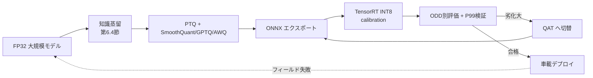

# 6.6 モデル軽量化・省電力化・専用チップ向け最適化

学習で最高精度を出したモデルも、車載 SoC に載らなければ製品にはなりません。本節では学習済みモデルを車載で動かすための軽量化・最適化を扱います。INT8 / INT4 / FP8 量子化、PTQ と QAT、SmoothQuant / GPTQ / AWQ、TensorRT のキャリブレーション、ONNX 経由のグラフコンパイル、構造化枝刈り、そしてチップ別のレイテンシ予算配分です。

ここで先に用語を整理します。**量子化 (quantization)** は重みや活性化を低ビットに変換する技法、**PTQ (Post-Training Quantization)** は学習済みモデルに少量の校正データを通して量子化する方式、**QAT (Quantization-Aware Training)** は学習中から量子化を模倣する方式です。**ONNX (Open Neural Network Exchange)** はモデルをフレームワーク中立に書き出す共通形式、**TensorRT** は NVIDIA GPU 向けの高性能推論エンジン、**GPTQ / AWQ / SmoothQuant** は活性化の外れ値に強い PTQ アルゴリズム、**2:4 sparse** は「4 要素中 2 要素をゼロにする」NVIDIA Ampere 以降の構造化スパース命令を指します。

## 車載チップの制約とレイテンシ予算

データセンターの GPU と異なり、車載 SoC は計算・メモリ・電力が厳しく制約されます。公開資料に基づく代表的なチップは次の通りです。

| チップ | 公称性能 | メモリ | 概略電力 | 位置づけ |
|---|---|---|---|---|
| NVIDIA Drive Orin | 254 TOPS (INT8) | 一般に 12〜64GB 構成 | 〜数十W級 | 現行量産の主力 |
| NVIDIA Drive Thor | 1000+ TOPS 級 (公称) | 大容量 | より高い | 次世代、生成AI/E2E 向け |
| Mobileye EyeQ6 | 高効率推論 | 統合 | 低電力志向 | 省電力 ADAS〜AD |

Drive Orin の単一構成では INT8 で 254 TOPS、DRAM が 12GB 程度に制約される構成があり、知覚・予測・計画・制御・冗長系を **すべてこの予算内に収める** 必要があります。そのため、end-to-end のレイテンシ予算をモジュールに配分します。

| モジュール | 例: レイテンシ予算 | 備考 |
|---|---|---|
| Perception (BEV/Occupancy) | 〜30 ms | 最も重く最適化の主対象 |
| Prediction | 〜10 ms | マルチエージェント |
| Planning | 〜10 ms | 安全制約評価を含む |
| 制御 + マージン | 残り | 制御周期 (例: 10〜20ms) を厳守 |

> 本書は安全に関する法的アドバイスを提供するものではありません。レイテンシ予算は ODD・車両・規格要件で変わるため、各 ECU 上での実測と検証 (第 7・8 章) を必ず行ってください。

## 量子化：精度形式の選択

量子化 (quantization) は、もともと FP32 / FP16 で表現していた重み・活性化を、より少ないビット数 (INT8 / INT4 など) で表現し直す技法です。これにより演算量・メモリ・電力を削減できます。INT8 (8 ビット整数) なら FP32 比でメモリ 4 分の 1、整数演算ユニットを使うため電力も大幅に下がります。

| 形式 | ビット | 主用途 | 精度劣化 | 備考 |
|---|---|---|---|---|
| FP16/BF16 | 16 | 汎用高速化 | ほぼなし | 第 6.4 節の Mixed Precision |
| INT8 | 8 | 車載推論の標準 | 小 (PTQ+calibration) | TensorRT で広くサポート [T8](references#t8) |
| FP8 (E4M3/E5M2) | 8 | 新世代 GPU/SoC | 小 | Thor 世代で活用余地 |
| INT4 | 4 | 大規模モデル圧縮 | 中 (要 GPTQ/AWQ) | LLM/世界モデル向け [T5,T6] |

量子化には 2 つのアプローチがあります。**PTQ (Post-Training Quantization)** は、学習済みモデルに少量の校正 (calibration) データを通すだけで量子化する手法です。低コストで適用できますが、精度劣化が出やすい弱点があります。**QAT (Quantization-Aware Training)** は学習中に量子化操作を模倣する fake quantization (フェイク量子化) を挟み、精度を保ちます。再学習が必要なためコストはかかります。車載では「まず PTQ で評価し、劣化が許容外なら QAT に切り替える」段階的戦略が実務的です。

## PTQ の先進手法：SmoothQuant / GPTQ / AWQ

単純な INT8 PTQ では、活性化の外れ値 (outlier) が精度を大きく損ないます。これを克服する手法が提案されています。

| 手法 | 対象 | 原理 | 参照 |
|---|---|---|---|
| SmoothQuant | 重み+活性化 INT8 | 活性化の外れ値を重み側へ数学的に移し量子化を平滑化 | [T7](references#t7) |
| GPTQ | 重み INT4/INT3 | 二次情報 (Hessian 近似) で層ごとに誤差最小化量子化 | [T5](references#t5) |
| AWQ | 重み INT4 | 活性化の大きさで重要重みを保護してスケール | [T6](references#t6) |

SmoothQuant [T7](references#t7) は、活性化に集中する外れ値を等価変換で重みに移し、両者を量子化しやすくします。GPTQ [T5](references#t5) は層ごとに量子化誤差を二次近似で最小化し、INT4 でも精度を保ちます。AWQ [T6](references#t6) は「活性化が大きい少数チャネルの重みが重要」という観察に基づき、その重みを保護します。これらは世界モデル (第 6.3 節) のような大規模生成モデルの車載化で特に重要になりつつあります。

## TensorRT による INT8 calibration パイプライン

車載 NVIDIA SoC への展開では、PyTorch モデルを **ONNX** [T9](references#t9) にエクスポートし、その ONNX を **TensorRT** [T8](references#t8) で読み込んで INT8 エンジンをビルドする流れが定石です。INT8 化には、各テンソルの「動的範囲 (取り得る値の幅)」を代表データから推定する **calibration (校正)** が必要です。校正データの選び方が量子化精度を決定づけます。

実装担当者には、次の手順で INT8 エンジンビルドのパイプラインを組むよう依頼します。

1. **校正データローダの準備**：本番 ODD (時間帯・天候・道路種別) を代表するように選んだ少量のサンプル (典型は数百〜数千枚) をミニバッチ単位で供給するローダを用意する。校正データは Closed-Loop での再ビルドに備え、データセット版 ID と紐付けて保存する。
2. **エントロピー校正クラスの実装**：TensorRT の `IInt8EntropyCalibrator2` を継承し、`get_batch` でローダから次バッチを取り出して GPU メモリに転送、ポインタを返す処理を実装する。`read_calibration_cache` / `write_calibration_cache` でキャッシュファイルへ読み書きし、再ビルド時の校正コストを削減する。
3. **エンジンビルド**：(1) ONNX をパースしてネットワーク定義を構築、(2) builder config でワークスペースメモリ上限 (例：4GB) を指定、(3) `BuilderFlag.INT8` を立てて INT8 を有効化、(4) INT8 非対応の層を救うため `BuilderFlag.FP16` も立てて混在精度のフォールバックを許す、(5) 上で実装した校正クラスを `int8_calibrator` に設定、(6) シリアライズされたエンジンをファイルに保存する。
4. **検証**：ビルド済みエンジンで本番 ODD と希少 ODD の両方を流し、後述する P99 レイテンシと精度劣化を計測する。

ポイントは、**校正データを本番分布 (ODD) を代表するように選ぶ** ことです。夜間・雨天など特定 ODD が校正データから欠けると、その条件で量子化精度が落ちます。`IInt8EntropyCalibrator2` はヒストグラムの KL ダイバージェンスを最小化してスケールを決めます。INT8 非対応の層は FP16 にフォールバックさせ、混在精度でエンジンを構築します。

## 枝刈りとグラフ最適化

**枝刈り (pruning)** は重みの一部をゼロ化して実効パラメータと FLOPs を削減します。

- **構造化枝刈り (structured)**：チャネル/フィルタ単位で削除。実機で確実に高速化しますが精度劣化が出やすい。
- **非構造化枝刈り (unstructured)**：個々の重みをゼロ化。高い疎性を得られるが、専用ハードウェア（NVIDIA Ampere 以降の Tensor Core が備える 2:4 構造化スパース命令、Drive Orin/Thor も対応）がないと速度に結びつきません。最近の量産 GPU・SoC は 2:4 を標準サポートするため、選択肢として現実的になっています。

PyTorch で構造化枝刈りを適用する手順は、(1) モデル内のすべての `Conv2d` 層を走査する、(2) 各層の重みに対し、出力チャネル軸 (`dim=0`) で L2 ノルム (`n=2`) の小さい順に一定割合 (例：`amount=0.3` で下位 30%) をマスクする、(3) マスクを「焼き込み」で恒久化し、推論グラフから不要なチャネルを除去できる状態にする、という流れです。枝刈り後はファインチューニングで精度回復を図り、グラフコンパイル時にチャネル削減が実速度に反映されることを確認します。

グラフコンパイル (TensorRT/ONNX Runtime/TVM) は、演算融合 (operator fusion)、レイアウト最適化 (NCHW/NHWC)、定数畳み込みを行います。特殊演算や動的制御フローは車載チップで実装困難なことがあるため、アーキテクチャ側で標準的な畳み込み・注意機構を選ぶと最適化が通りやすくなります。

## P99 レイテンシと Worst-Case 検証

自動運転では平均値より **テールレイテンシ (tail latency、上位 1% で発生する遅延)** が安全に直結します。推論がたまたま 1 回遅れて制御周期を外すと、それだけで安全リスクが高まります。P99 (上位 1%)・P99.9 (上位 0.1%)・最大値まで計測し、最悪条件で制御周期に収まるかを検証します。

レイテンシ計測の最低要件は次の通りです。

- **ウォームアップ**：最初の数十イテレーション (例：20 ステップ) は計測対象から除外し、初回コンパイル・キャッシュ確立のオーバーヘッドを除く。
- **GPU 同期の徹底**：各推論の前後で `torch.cuda.synchronize` を呼び、CUDA カーネルの非同期実行による計測誤差を排除する。
- **分位点の網羅**：P50・P95・P99・P99.9 と最大値を必ず算出する。P99.9 や最大値が制御周期 (例：10〜20 ms) を外していないかが安全に直結する。
- **ODD ごとの分解**：同じモデルでも夜間・雨天・遠距離など重い ODD でテールが伸びることがあるため、ODD セグメント別に計測結果を集計する。

P99/P99.9 と最大値を計測し、制御周期内に収まるかを検証します。間に合わない場合は、保守的 fallback (古い結果の再利用、安全側制御) を設計します。これらは第 7 章の HiL (Hardware-in-the-Loop) で実 ECU 同等条件で計測し、第 8 章のリリースゲートに組み込みます。

## データ中心の軽量化と ODD 別評価

軽量化はパラメータ削減だけでなく「どのデータにどれだけの表現力が必要か」を考えることが重要です。

- **ODD 限定モデル**：高速道路限定など ODD を絞れば、より小さなモデルで高精度を達成できます (第 6.3 節)。
- **圧縮後のデータ依存性**：量子化・枝刈りは特定の照度・距離レンジで性能が落ちやすいため、**ODD セグメント別の評価が必須** です。

> この図のポイント：軽量化は一方向の変換ではなく、ODD 別評価で劣化が見つかれば QAT に戻る反復であり、フィールド失敗が再びデータと学習に戻る Closed-Loop を形成します。

## 量子化方式を選ぶ思考プロセス

「PTQ で十分か、QAT に踏み込むか」「INT8 か INT4 か」の判定は車載化のリードタイムを左右しますが、判断ぶれを減らす要点は「コストの低い手法から順に試し、ODD セグメント別の劣化が見えた瞬間に次段に進む」という単調な順序を組織として守ることです。

最初に行うべきは、FP16 / BF16 の TensorRT エンジンを軽量化のベースラインとして固めることです。本番 ODD 全セグメントで NDS / mIoU / 安全クリティカルクラスの recall を計測し、量子化前の基準を確定させます。この段階を省くと、後段で精度劣化が見つかったときに「もともと劣化していたのか量子化で劣化したのか」が切り分けられなくなります。

次に素朴な INT8 PTQ をかけ、本番 ODD 代表の校正データ (数百〜数千枚) で精度を再計測します。許容劣化幅 (例：NDS で −0.5pt = −0.005) 以内なら採用というルールで判定し、Closed-Loop の評価ゲート (6.8 節のブートストラップ判定) と整合させます。ここで重要なのは、TensorRT INT8 の劣化は「全体平均で見ると小さく見えても、夜間・雨天など特定 ODD セグメントだけ大きく落ちている」ケースが頻発する点です。校正データに夜間や雨天が欠けていると、その条件で量子化精度が落ちるという形で現れます。

PTQ で劣化が出た場合の次の一手は SmoothQuant です。活性化に集中する外れ値を等価変換で重みに移し、両者を量子化しやすくする手法で、再校正だけで済むためコストが軽いのが特徴です。これでも改善しない場合に初めて QAT に移行します。QAT は学習中に fake quantization を挟むため再学習コストがかかり、PTQ → SmoothQuant → QAT という順序を守ることでコストを最小化できます。

INT4 を検討するのは、世界モデルや E2E 系で重みが大きすぎて INT8 でも車載 SoC のメモリに載らない場合に限られます。GPTQ は二次情報 (Hessian 近似) で層ごとに誤差最小化、AWQ は活性化が大きい少数チャネルの重みを保護するアプローチで、いずれも INT4 でも精度を保ちやすい設計です。ただし INT4 では必ず ODD セグメント別の recall 劣化を確認することが必要で、平均値だけ見ると安全クリティカルクラス (歩行者・自転車) で深刻な見落としが発生していても気づけません。

最後に、すべての量子化候補について P99 / P99.9 / 最大値レイテンシを実 SoC または HiL 環境で計測し、制御周期 (例：10〜20 ms) を超えるものは精度がよくても採用しない、という非妥協のラインを引きます。Drive Orin の 254 TOPS / 12GB 制約のもとで知覚・予測・計画・制御・冗長系を全て収めるには、レイテンシ予算をモジュール単位 (Perception 〜30ms、Prediction 〜10ms、Planning 〜10ms) で配分して逆算するしかなく、テールが制御周期を外すモデルは安全側に寄せた fallback 設計が必須になります。

## モデルバージョニングとロールバック

軽量化モデルは、元の「リファレンスモデル」とペアで管理します。

- **リファレンスモデル**：GPU クラスタで動く重量級モデル。研究・シミュレーションの基準。
- **デプロイモデル**：量子化・蒸留・最適化済みの車載モデル。

両者は実験トラッキング (第 6.1 節) とモデルレジストリ (第 8.1 節) でリンクし、評価レポートと対応付けます。問題発生時には、デプロイモデルからリファレンスへのロールバックや量子化度合いの緩和を迅速に行えるようにします。

## 本節の振り返り

車載 SoC の制約 (Drive Orin の 254 TOPS / 12GB、Drive Thor の 1000+ TOPS 級、EyeQ6 の省電力志向) は、知覚・予測・計画・制御・冗長系を全て収めるための ODD 別レイテンシ予算として降りてきます。量子化は INT8 が標準で、TensorRT INT8 の劣化が ODD セグメント別に偏って現れるという落とし穴を踏まえると、校正データを本番 ODD 代表に選ぶことと、SmoothQuant で外れ値対策を行うこと、INT4 圧縮には GPTQ/AWQ を選ぶことが、いずれも安全クリティカルクラスの recall を守るための必須要件です。構造化枝刈りと 2:4 スパース命令、グラフ融合で実機速度を稼ぎ、P99/P99.9/最大値でテールレイテンシを検証して制御周期を外すモデルは精度がよくても採用しない、というラインを守ることが本書の Closed-Loop の規律です。軽量化は一方向の変換ではなく、ODD 別評価で劣化を検出すれば QAT に戻る反復であり、フィールド失敗が再びデータと学習に戻る Closed-Loop の一部として位置づけられます。

## 次節への橋渡し

ここまでの「データ供給・学習・分散・軽量化」を組織として継続的に回すには、人手の運用では破綻します。次の 6.7 節では、これらのステップを Pipeline as Code で DAG として記述するオーケストレーションを扱います。Argo Workflows / Airflow / Flyte の比較、Argo の DAG YAML、Kafka によるインシデント駆動トリガ、リトライ/アラート/承認ゲートまで、Closed-Loop を自動で回す仕組みを掘り下げます。
