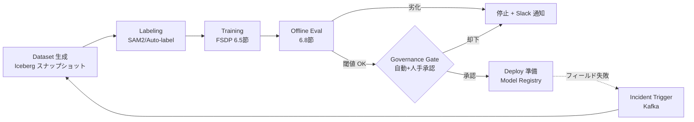

# 6.7 トレーニングパイプラインのオーケストレーション

人手で「データ収集 → ラベリング → 学習 → 評価 → デプロイ」を毎回回していたら、Closed-Loop は週次で破綻します。本節ではこれらを **DAG (Directed Acyclic Graph、有向非巡回グラフ)** として自動実行するオーケストレーション (orchestration) を扱います。主要オーケストレータの比較、Argo による DAG 定義、Airflow による定期・イベント駆動再学習、Kafka インシデントトリガ、Slack アラート、冪等性、ガバナンスゲートを順に整理します。

ここで先に主要ツール名を押さえます。**Argo Workflows** は Kubernetes 上で動くコンテナ単位の DAG エンジン、**Airflow** は Python で DAG を書き定期スケジュールに強い古典的オーケストレータ、**Flyte** は型付き Python タスクで再現性とキャッシュを重視するオーケストレータ、**Kubeflow Pipelines** は Argo を内部で使う ML 特化のフロントエンドです。**Kafka** は分散メッセージキュー (イベントブローカ)、**冪等性 (idempotency)** は同じ操作を何度実行しても結果が変わらない性質を指します。

> **1.4 節との役割分担**：1.4 は DataOps/MLOps 全体俯瞰と承認ゲートのコンセプト (「DAG として書ける／冪等／監査可能」の 3 条件) を扱います。本節 6.7 はその実装技術 (Argo vs Airflow vs Flyte の選定基準と YAML/DAG 例、Kafka イベント駆動のトリガロジック) を扱います。両節を読むと「なぜ Pipeline as Code か」と「具体的にどう書くか」が接続します。

## Pipeline as Code とオーケストレータの選択

オーケストレーションの基本思想は **Pipeline as Code (パイプラインのコード化)** です。データセット生成・ラベリング・学習・評価・モデル登録・承認・デプロイ準備のすべてを、YAML や Python の DSL (ドメイン特化言語) で宣言的に記述し、Git でレビューしてバージョン管理します。これにより、パイプラインの変更そのものが監査対象になり、Closed-Loop の各サイクルに再現性が生まれます [T13, T14]。

> この図のポイント：DAG は Dataset から Deploy への一方向ではなく、フィールド失敗が Kafka 経由で再びデータ生成に戻る Closed-Loop を形成し、その境界に必ずガバナンスゲートが立ちます。

主要なオーケストレータの特性は次の通りです。自動運転の MLOps では、Kubernetes 上の Argo を基盤に、データ ETL を Airflow が担う併用構成が広く採られます。

| 基盤 | 実行モデル | 強み | 留意点 |
|---|---|---|---|
| Argo Workflows [T14](references#t14) | K8s ネイティブ (CRD) | コンテナ単位の DAG、巨大ファンアウトに強い | UI/メタデータは別途整備 |
| Kubeflow Pipelines [T13](references#t13) | Argo を内包 | ML 実験トラッキングと統合、Python SDK | K8s 運用知識が前提 |
| Apache Airflow | Python DAG + スケジューラ | 定期・センサ駆動が成熟、ETL 連携が豊富 | GPU ジョブは外部に委譲しがち |
| Flyte | 型付き Python タスク | データ型・キャッシュ・再現性が強力 | エコシステムが比較的新しい |

## Argo Workflows による Closed-Loop DAG

Dataset → Labeling → Training → Eval → Approval → Deploy という Closed-Loop の DAG を Argo Workflow で表現する場合、実装担当者には次の構成を依頼します。

### 全体構造

- **エントリポイントの DAG**：上記 6 ステップをタスクとして並べ、`dataset → labeling → training → eval → gate-auto → gate-human → deploy` の依存関係で繋ぐ。
- **入力パラメータ**：(1) `dataset-snapshot` (Iceberg などのデータレイクのスナップショット ID。冪等性の鍵)、(2) `odd-segment` (重点的に評価する ODD セグメント、例：`urban_night_rain`)。
- **`onExit` ハンドラ**：成否に関わらず Slack 通知用テンプレートを呼び出すよう指定する。

### 各ステップで指定すべき項目

| ステップ | コンテナ/挙動 | 重要設定 |
|---|---|---|
| `gen-dataset` | データセットビルダのコンテナを起動し、スナップショット ID と出力先パスを引数に渡す | `retryStrategy` で一過性エラー時に最大 3 回、初期 30 秒・指数バックオフでリトライ |
| `run-labeling` | SAM2 等の自動ラベラのコンテナで GT を生成 | 失敗時のリトライ、出力アーティファクトの版管理 |
| `train-fsdp` | `torchrun --nproc_per_node=8 train_fsdp.py` を実行 | `nvidia.com/gpu: 8` を要求し、`nodeSelector` で GPU ノードに固定。リトライ最大 2 回 |
| `offline-eval` | 第 6.8 節の評価スクリプトを ODD パラメータ付きで実行 | baseline からの NDS 変化量を出力パラメータ (`ndsdelta`) として後段に渡す |
| `auto-gate` | スクリプト型テンプレートで `ndsdelta` を読み、閾値判定 | 例：`delta >= -0.005` で合格、未満で `exit 1` (Fail) → DAG 停止 |
| `approval` | `suspend: {}` テンプレートで人手承認待ちにする | 安全担当が `argo resume` するまで Pod を起動せず保留 |
| `register-model` | MLflow Model Registry にリリース候補として登録 | バージョンとタグを残し、第 6.1 節の段階的昇格と接続 |
| `notify-slack` | 通知用コンテナを呼び出し、ワークフロー status を引数で渡す | 成功・失敗・承認待ちで色分けし、実行 URL を添える |

### 設計のポイント

- **冪等性の鍵**：`dataset-snapshot` を入力パラメータに据え、同じスナップショット ID なら何度再実行しても同じデータを参照する構造にする。
- **自動ゲート**：`auto-gate` で NDS の baseline からの劣化量を機械判定し、安全側に倒れた変更を機械的に止める。閾値 (例：−0.5pt = −0.005) は第 6.8 節のブートストラップ判定と整合させる。
- **人手承認ゲート**：`suspend` テンプレートで安全担当の承認を待つ。承認 (resume) がなければデプロイへ進めない。
- **タスク間の値受け渡し**：評価ステップの `outputs.parameters` でファイルから値を読み (`valueFrom: {path: /tmp/nds_delta.txt}` 相当)、後段の `inputs.parameters` で参照する。

## Airflow による定期再学習とイベント駆動再学習

再学習のトリガは大きく 2 系統あります。**定期再学習 (periodic retraining)** は cron スケジュールで計画的に行うもので、データ蓄積による分布シフトに継続追従します。**イベント駆動再学習 (event-driven retraining)** はインシデント発生や性能ドリフト検知に即応するもので、安全側のロングテール失敗を素早く是正するためのものです [M1](references#m1)。両者は併用が基本で、定期で底上げしつつ、重大イベントで割り込みます。

| 観点 | 定期再学習 | イベント駆動再学習 |
|---|---|---|
| トリガ | cron（週次/月次） | インシデント・ドリフト・KPI 悪化 |
| 目的 | 分布シフトへの継続追従 | ロングテール失敗の即時是正 |
| 優先度 | 標準 | 高（GPU を優先確保、6.5 節） |
| リードタイム | 緩やか | 短さが安全に直結 |

Airflow で両系統を実装する場合、1 ファイルに 2 つの DAG を定義し、共通の Argo 起動関数を共有する構成が扱いやすいです。実装担当者には次のように依頼します。

- **共通の Argo 起動関数**：(1) Airflow の実行コンテキストから日付 (`ds_nodash`) などをスナップショット ID として取り出す、(2) `<snapshot>-<odd_segment>` 形式の冪等キーを作る、(3) 同名のワークフローが既に走行中・完了済みであれば再 submit せずスキップする、(4) Argo Workflow テンプレート (`closed-loop-retrain`) に `dataset-snapshot` と `odd-segment` を渡し、冪等キーと優先度をラベルとして付ける、という流れにする。
- **定期 DAG (`periodic_retrain`)**：`schedule="0 2 * * 1"` (毎週月曜 02:00) など cron で起動し、`odd_segment="all"`、`priority="normal"` で全 ODD を再学習する。リトライ既定値は最大 3 回、初期間隔 5 分、指数バックオフ。
- **イベント駆動 DAG (`event_driven_retrain`)**：`schedule=None` で自発起動を止め、外部 (Kafka コンシューマ) からの REST API 起動 (`POST /dags/event_driven_retrain/dagRuns`) を受け付ける。`dag_run.conf['odd_segment']` をテンプレート参照で取り出して Argo に渡し、`priority="high"` を付与して GPU を優先確保する。
- **共通設定**：`catchup=False` で過去日の自動補填を無効にし、`retry_exponential_backoff` で一時的な API/リソース不足を自動吸収する。

## Kafka によるインシデント駆動トリガ

フィールド車両やシミュレーションが検知した重大イベント (介入 disengagement、衝突マージン違反、ドリフト警報など) は **Kafka トピック** に流し、コンシューマがそのトピックを購読して集約・抑制してから Airflow をキックします。生のイベントを 1 件ずつ再学習に直結させると、同じインシデントから派生する大量のメッセージで再学習が暴発します。これを防ぐためにしきい値と冪等性で制御します。コンシューマ実装の最低要件は次の通りです。

- **接続設定**：Kafka ブローカに接続し、トピック (例：`av.incidents`) を購読する。`enable.auto.commit=False` を必ず設定し、メッセージの処理確定後に手動でオフセット commit する (冪等性の前提)。
- **重大度フィルタ**：受信イベントの `severity` が `high` / `critical` のもののみを再学習候補として扱い、それ以外は即座に commit してスキップする。
- **重複抑制 (debounce)**：ODD セグメント別の発生件数を時間窓 (例：10 分) でカウントし、しきい値 (例：3 件以上) を超えた瞬間に **1 回だけ** Airflow の REST API を叩く。窓が終わるたびにカウンタをリセットする。
- **冪等な run_id**：Airflow への POST に渡す `dag_run_id` を `incident-<odd_segment>-<window_start_epoch>` のように決定論的に生成し、二重起動を防ぐ。
- **オフセット commit のタイミング**：Airflow への送信完了後にのみ commit する。コンシューマがクラッシュしてもイベントを取りこぼさず、かつ `run_id` の冪等性で再起動後の二重実行も発生しない。

この設計により、1 つの事象から派生する多数のイベントを 1 回の再学習にまとめ、暴発を防ぎつつ重大失敗への即応を実現します。

## Slack Webhook によるアラート

パイプラインの成否・ゲート通過・承認待ちは、関係者に即時通知します。Argo の `onExit` から呼ばれる通知スクリプトに必要な要件は次の通りです。

- **入力**：ワークフロー名、実行 URL、ステータス文字列 (`Succeeded` / `Failed` / `Error` / `Running` など) を受け取る。
- **色分け**：成功は緑 (例：`#36a64f`)、失敗・エラーは赤 (例：`#d00000`)、承認待ち・進行中は黄 (例：`#daa038`) など、視認性の高い色で attachment を装飾する。
- **本文**：タイトルに「Closed-Loop パイプライン {status}: {ワークフロー名}」、本文に実行 URL へのリンク、追加フィールドに「承認待ち時は安全担当の resume が必要」などの行動指示を含める。
- **送信**：環境変数 (例：`SLACK_WEBHOOK_URL`) から Webhook URL を取り出し、JSON ペイロードを POST する。タイムアウト (例：10 秒) と失敗時の例外送出を必ず実装する。

承認ゲートに到達したら安全担当をメンションする運用にすると、人手レビューのリードタイムを短縮できます。

## 冪等性 (idempotency) の設計

オーケストレーションを長期運用すると、ジョブの再実行・部分再開・二重トリガが日常的に起きます。**冪等性 (idempotency)** とは「同じ入力に対し何度実行しても結果が変わらない」性質のことで、各ステップをこの性質で設計することが、Closed-Loop を安全に自動化する前提です。冪等な実行ステップを設計する際の最低要件は次の 3 点です。

1. **決定論的な冪等キー**：入力 (データスナップショット ID・設定ハッシュ・コードバージョン) を `sort_keys` 付き JSON にシリアライズし、SHA-256 などのハッシュ関数で短い ID (例：先頭 16 桁) を生成する。同じ入力からは常に同じキーが得られるため、出力先のディレクトリ名にそのまま使える。
2. **完了マーカでの再計算回避**：出力ディレクトリ内に `_SUCCESS` のような空ファイルを「完了マーカ」として置く。ステップ起動時にマーカの存在を確認し、既に存在すれば実処理をスキップして既存出力を返す。
3. **原子的な書き込み**：出力は最初 `<out>.tmp` のような一時ディレクトリに書き、すべての書き込みが終わった後に `os.replace` (POSIX `rename`) で本来のパスへ原子的に切り替える。最後に完了マーカを置く。これで、途中で落ちた半端な出力が本来のパスに残ることはなくなる。

この 3 点により、リトライや手動再開が安全になり、計算資源の無駄も防げます。

## オーケストレーションを「運用が回る形」に持ち込む設計判断

オーケストレータの導入はツール選定だけ終わって運用が回らないケースが頻発します。失敗の構造はほぼ共通で、「DAG は書けたが冪等性が壊れている」「自動ゲートはあるが基準が場当たり的」「承認ゲートはあるが誰が承認したかの記録が残らない」のいずれかに集約されます。1.4 節が掲げる「DAG として書ける／冪等／監査可能」の 3 条件を、本節の実装技術にどう接続するかが運用品質を決めます。

最初の現実的な一歩は、Argo Workflows を K8s に立てて最小構成 (Dataset 生成 → 学習 → 評価 → Model Registry 登録の 4 ステップ) を動かすことです。ここで `dataset-snapshot` を入力パラメータに据え、同じスナップショット ID で再実行したら同じ結果になる冪等性を確認します。フル機能の Closed-Loop DAG を最初から組もうとすると、冪等性とゲート設計の問題が同時に噴出して切り分けが困難になります。

自動ゲートのしきい値設計は、Closed-Loop の中で最も繊細な判断です。「NDS で −0.5pt 未満なら不合格」のような固定マージンだけだと、評価セットのサンプリング揺らぎで暴発するか、有意な劣化を見逃します。6.8 節のブートストラップ判定 (95% 信頼区間の上限が 0 を下回る、かつ平均劣化が `min_drop=0.005` を超える、の両方を満たす場合のみ Fail) と一致させ、決定根拠を Git の `regression_thresholds.yaml` 等で版管理してレビュー対象にすることで、しきい値そのものが監査可能になります。

人手承認ゲートで実装の落とし穴になりやすいのが「承認の証跡が残らない」点です。Argo の `suspend` テンプレートで停止することはできますが、誰が `argo resume` したかを MLflow タグに残す監査証跡を組み込まないと、事後のインシデント分析で「なぜそのリリースが承認されたか」を辿れなくなります。安全担当のメンションは Slack で十分でも、承認の事実は MLflow メタデータに残すという二重化が現実的です。

定期再学習とイベント駆動再学習を 1 ファイル 2 DAG で運用し、共通の冪等キー生成関数を共有して二重起動を防ぐ構成は、Kafka 駆動のインシデント対応で実効性を発揮します。生のイベントを 1 件ずつ再学習に直結させると、同じインシデントから派生する大量メッセージで再学習が暴発します。`incident-<odd_segment>-<window_start_epoch>` のような決定論的 `run_id` で 10 分窓に集約し、しきい値 (例：3 件以上) を超えた瞬間に 1 回だけ Airflow を叩く debounce 設計が、暴発防止と即応性の両立を可能にします。

`_SUCCESS` マーカと原子的 rename による出力配置を全ステップで標準化することは、リトライや部分再開で副作用が重複しないための基礎構造です。途中で落ちた半端な出力が本来のパスに残らない、完了マーカで再計算を回避する、という規律を CI で検証する仕組みまで組まないと、長期運用で必ず破綻します。

## ガバナンスゲートと監査証跡

自動運転では、モデル更新は安全と法令遵守に直結するため、自動化されたパイプラインにも明確なガバナンス (governance) を組み込みます。本書は法的アドバイスを提供するものではありませんが、少なくとも次のゲートを必須とすることが実務的です。

- **自動ゲート**：オフライン評価（6.8 節）の統計閾値、ODD セグメント別のリグレッション、安全側指標（FN 率・最小マージン）を満たさなければ機械的に停止。
- **人手承認ゲート**：安全担当・機能オーナーが、評価レポートとデータ由来（どのインシデント・どの ODD から来たか）を確認して承認。Argo の `suspend` で実装。
- **監査証跡 (audit trail)**：どのデータスナップショット・どの実験 run・誰が承認したかを、MLflow [T11](references#t11) のメタデータと突き合わせて記録。事後のインシデント分析（第 8 章）で追跡可能にする。

評価データセットには公開ベンチマーク（nuScenes [P6](references#p6)、Waymo Open Dataset [P7](references#p7)）と自社ゴールデンセットを併用し、ゲート判定の根拠を再現可能な形で残します。

## 本節の振り返り

Closed-Loop の各ステップを Pipeline as Code として DAG 化し、Git で監査・再現可能にすることが、人手運用では破綻する週次サイクルを安定して回す前提です。Argo Workflows で Dataset → Labeling → Training → Eval → Approval → Deploy を記述し `suspend` で人手承認ゲートを実装する構成、定期再学習で底上げしつつ Kafka 駆動のイベント再学習で重大失敗に即応する併用、Kafka コンシューマで手動 commit・debounce・冪等な `run_id` を組み合わせて取りこぼしと暴発を防ぐ設計、決定論的キーと完了マーカと原子的 rename で安全な自動再実行を保証する規律——これらは独立した tips ではなく、6.8 節のブートストラップ判定と整合する自動ゲートと、MLflow に承認証跡を残すガバナンス設計とともに、本書のデータ中心 Closed-Loop が「事故の自動配信装置」にならないための単一の防御線を構成します。安全と法令の観点からは、これらの監査証跡が事後のインシデント分析で辿れることが必須要件です。

## 次節への橋渡し

ガバナンスゲートの中核は「オフライン評価が基準を満たすか」という判定です。次の 6.8 節では、その判定根拠となる評価指標を定量的に掘り下げます。nuScenes の mAP/NDS の計算式、トラッキングの AMOTA/MOTP、軌道予測の ADE/FDE、Occupancy の mIoU、見落とし (False Negative) を重視した損失・指標設計、そしてリグレッション閾値の統計的決定と ODD セグメント別評価を扱い、Closed-Loop を回す際の「止めるべき変更を確実に止める」評価基盤を整えます。
